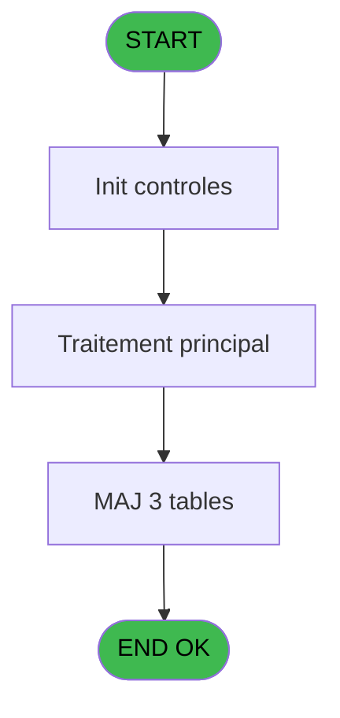

# Menu IDE 15 - MAJ User

> **Analyse**: Phases 1-4 2026-02-03 15:13 -> 15:13 (13s) | Assemblage 15:13
> **Pipeline**: V7.2 Enrichi
> **Structure**: 4 onglets (Resume | Ecrans | Donnees | Connexions)

<!-- TAB:Resume -->

## 1. FICHE D'IDENTITE

| Attribut | Valeur |
|----------|--------|
| Projet | Menu |
| IDE Position | 15 |
| Nom Programme | MAJ User |
| Fichier source | `Prg_15.xml` |
| Dossier IDE | Recup |
| Taches | 3 (0 ecrans visibles) |
| Tables modifiees | 3 |
| Programmes appeles | 0 |

## 2. DESCRIPTION FONCTIONNELLE

**MAJ User** assure la gestion complete de ce processus, accessible depuis [Recup DataBase (IDE 8)](Menu-IDE-8.md).

Le flux de traitement s'organise en **1 blocs fonctionnels** :

- **Traitement** (3 taches) : traitements metier divers

**Donnees modifiees** : 3 tables en ecriture (table_utilisateurs, utilisateur______uti, pv_stock_movements).

## 3. BLOCS FONCTIONNELS

### 3.1 Traitement (3 taches)

Traitements internes.

---

#### 15 - MAJ User

**Role** : Traitement : MAJ User.
**Variables liees** : A (v.retour user)

---

#### 15.1 - Upd Operateur / Utilisateur

**Role** : Configuration/parametrage : Upd Operateur / Utilisateur.

---

#### 15.2 - Upd Droits

**Role** : Traitement : Upd Droits.

## 5. REGLES METIER

*(Aucune regle metier identifiee)*

## 6. CONTEXTE

- **Appele par**: [Recup DataBase (IDE 8)](Menu-IDE-8.md)
- **Appelle**: 0 programmes | **Tables**: 5 (W:3 R:0 L:2) | **Taches**: 3 | **Expressions**: 9

<!-- TAB:Ecrans -->

## 8. ECRANS

*(Programme sans ecran visible)*

## 9. NAVIGATION

### 9.3 Structure hierarchique (3 taches)

| Position | Tache | Type | Dimensions | Bloc |
|----------|-------|------|------------|------|
| **15.1** | [**MAJ User** (15)](#t1) | - | - | Traitement |
| 15.1.1 | [Upd Operateur / Utilisateur (15.1)](#t2) | - | - | |
| 15.1.2 | [Upd Droits (15.2)](#t3) | - | - | |

### 9.4 Algorigramme

> **Legende**: Vert = START/END OK | Rouge = END KO | Bleu = Decisions
> *Algorigramme auto-genere. Utiliser `/algorigramme` pour une synthese metier detaillee.*

<!-- TAB:Donnees -->

## 10. TABLES

### Tables utilisees (5)

| ID | Nom | Description | Type | R | W | L | Usages |
|----|-----|-------------|------|---|---|---|--------|
| 109 | table_utilisateurs |  | DB |   | **W** |   | 1 |
| 691 | commandes |  | DB |   |   | L | 1 |
| 718 | utilisateur______uti |  | DB |   | **W** |   | 1 |
| 740 | pv_stock_movements | Articles et stock | DB |   | **W** |   | 1 |
| 768 | motif_no_enreg_na |  | DB |   |   | L | 1 |

### Colonnes par table (0 / 3 tables avec colonnes identifiees)

Table 109 - table_utilisateurs (**W**) - 1 usages

*Table utilisee uniquement en Link ou aucune colonne Real identifiee dans le DataView.*

Table 718 - utilisateur______uti (**W**) - 1 usages

*Table utilisee uniquement en Link ou aucune colonne Real identifiee dans le DataView.*

Table 740 - pv_stock_movements (**W**) - 1 usages

*Table utilisee uniquement en Link ou aucune colonne Real identifiee dans le DataView.*

## 11. VARIABLES

### 11.1 Variables de session (1)

Variables persistantes pendant toute la session.

| Lettre | Nom | Type | Usage dans |
|--------|-----|------|-----------|
| A | v.retour user | Logical | - |

### 11.2 Autres (2)

Variables diverses.

| Lettre | Nom | Type | Usage dans |
|--------|-----|------|-----------|
| B | Retour Cryptage | Logical | - |
| C | Cle Cryptage | Blob | - |

## 12. EXPRESSIONS

**9 / 9 expressions decodees (100%)**

### 12.1 Repartition par type

| Type | Expressions | Regles |
|------|-------------|--------|
| CONSTANTE | 6 | 0 |
| OTHER | 3 | 0 |

### 12.2 Expressions cles par type

#### CONSTANTE (6 expressions)

| Type | IDE | Expression | Regle |
|------|-----|------------|-------|
| CONSTANTE | 6 | `'club'` | - |
| CONSTANTE | 8 | `'CRY'` | - |
| CONSTANTE | 9 | `'1.00'` | - |
| CONSTANTE | 1 | `'GESTION'` | - |
| CONSTANTE | 2 | `'O'` | - |
| ... | | *+1 autres* | |

#### OTHER (3 expressions)

| Type | IDE | Expression | Regle |
|------|-----|------------|-------|
| OTHER | 7 | `[E]` | - |
| OTHER | 4 | `[O]` | - |
| OTHER | 3 | `NOT([E])` | - |

<!-- TAB:Connexions -->

## 13. GRAPHE D'APPELS

### 13.1 Chaine depuis Main (Callers)

Main -> ... -> [Recup DataBase (IDE 8)](Menu-IDE-8.md) -> **MAJ User (IDE 15)**

### 13.2 Callers

| IDE | Nom Programme | Nb Appels |
|-----|---------------|-----------|
| [8](Menu-IDE-8.md) | Recup DataBase | 1 |

### 13.3 Callees (programmes appeles)

### 13.4 Detail Callees avec contexte

| IDE | Nom Programme | Appels | Contexte |
|-----|---------------|--------|----------|
| - | (aucun) | - | - |

## 14. RECOMMANDATIONS MIGRATION

### 14.1 Profil du programme

| Metrique | Valeur | Impact migration |
|----------|--------|-----------------|
| Lignes de logique | 51 | Programme compact |
| Expressions | 9 | Peu de logique |
| Tables WRITE | 3 | Impact modere |
| Sous-programmes | 0 | Peu de dependances |
| Ecrans visibles | 0 | Ecran unique ou traitement batch |
| Code desactive | 0% (0 / 51) | Code sain |
| Regles metier | 0 | Pas de regle identifiee |

### 14.2 Plan de migration par bloc

#### Traitement (3 taches: 0 ecran, 3 traitements)

- **Strategie** : 3 service(s) backend injectable(s) (Domain Services).
- Decomposer les taches en services unitaires testables.

### 14.3 Dependances critiques

| Dependance | Type | Appels | Impact |
|------------|------|--------|--------|
| table_utilisateurs | Table WRITE (Database) | 1x | Schema + repository |
| utilisateur______uti | Table WRITE (Database) | 1x | Schema + repository |
| pv_stock_movements | Table WRITE (Database) | 1x | Schema + repository |

---
*Spec DETAILED generee par Pipeline V7.2 - 2026-02-03 15:13*
