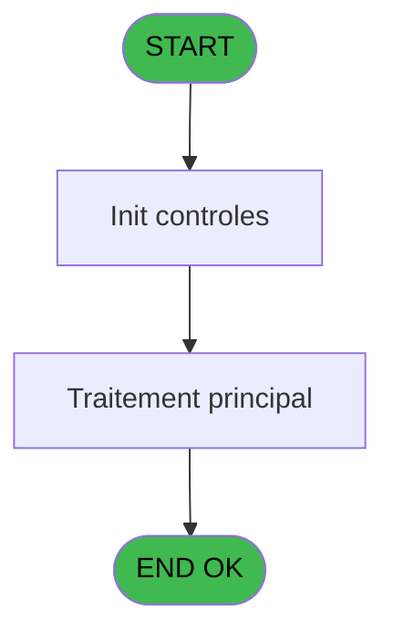

# Menu IDE 16 - Connect DataBase

> **Analyse**: Phases 1-4 2026-02-03 15:13 -> 15:13 (13s) | Assemblage 15:13
> **Pipeline**: V7.2 Enrichi
> **Structure**: 4 onglets (Resume | Ecrans | Donnees | Connexions)

<!-- TAB:Resume -->

## 1. FICHE D'IDENTITE

| Attribut | Valeur |
|----------|--------|
| Projet | Menu |
| IDE Position | 16 |
| Nom Programme | Connect DataBase |
| Fichier source | `Prg_16.xml` |
| Dossier IDE | Utilitaires |
| Taches | 1 (1 ecrans visibles) |
| Tables modifiees | 0 |
| Programmes appeles | 0 |

## 2. DESCRIPTION FONCTIONNELLE

**Connect DataBase** assure la gestion complete de ce processus, accessible depuis [Main Program (IDE 1)](Menu-IDE-1.md).

Le flux de traitement s'organise en **1 blocs fonctionnels** :

- **Traitement** (1 tache) : traitements metier divers

## 3. BLOCS FONCTIONNELS

### 3.1 Traitement (1 tache)

Traitements internes.

---

#### 16 - Village Connection [[ECRAN]](#ecran-t1)

**Role** : Traitement : Village Connection.
**Ecran** : 466 x 73 DLU | [Voir mockup](#ecran-t1)

## 5. REGLES METIER

*(Aucune regle metier identifiee)*

## 6. CONTEXTE

- **Appele par**: [Main Program (IDE 1)](Menu-IDE-1.md)
- **Appelle**: 0 programmes | **Tables**: 0 (W:0 R:0 L:0) | **Taches**: 1 | **Expressions**: 6

<!-- TAB:Ecrans -->

## 8. ECRANS

### 8.1 Forms visibles (1 / 1)

| # | Position | Tache | Nom | Type | Largeur | Hauteur | Bloc |
|---|----------|-------|-----|------|---------|---------|------|
| 1 | 16 | 16 | Village Connection | Type0 | 466 | 73 | Traitement |

### 8.2 Mockups Ecrans

---

#### 16 - Village Connection
**Tache** : [16](#t1) | **Type** : Type0 | **Dimensions** : 466 x 73 DLU
**Bloc** : Traitement | **Titre IDE** : Village Connection

<!-- FORM-DATA:
{
    "width":  466,
    "vFactor":  8,
    "type":  "Type0",
    "hFactor":  4,
    "controls":  [
                     {
                         "x":  5,
                         "type":  "label",
                         "var":  "",
                         "y":  5,
                         "w":  454,
                         "fmt":  "",
                         "name":  "",
                         "h":  40,
                         "color":  "42",
                         "text":  "",
                         "parent":  null
                     },
                     {
                         "x":  46,
                         "type":  "label",
                         "var":  "",
                         "y":  19,
                         "w":  121,
                         "fmt":  "",
                         "name":  "",
                         "h":  10,
                         "color":  "",
                         "text":  "Village",
                         "parent":  1
                     },
                     {
                         "x":  175,
                         "type":  "combobox",
                         "var":  "",
                         "y":  20,
                         "w":  176,
                         "fmt":  "",
                         "name":  "P Serveur",
                         "h":  12,
                         "color":  "",
                         "text":  "",
                         "parent":  1
                     },
                     {
                         "x":  221,
                         "type":  "button",
                         "var":  "",
                         "y":  52,
                         "w":  117,
                         "fmt":  "Exit",
                         "name":  "",
                         "h":  14,
                         "color":  "",
                         "text":  "",
                         "parent":  null
                     },
                     {
                         "x":  342,
                         "type":  "button",
                         "var":  "",
                         "y":  52,
                         "w":  117,
                         "fmt":  "\u0026Validate",
                         "name":  "B Execution",
                         "h":  14,
                         "color":  "",
                         "text":  "",
                         "parent":  null
                     }
                 ],
    "taskId":  "16",
    "height":  73
}
-->

<strong>Champs : 1 champs</strong>

| Pos (x,y) | Nom | Variable | Type |
|-----------|-----|----------|------|
| 175,20 | P Serveur | - | combobox |

<strong>Boutons : 2 boutons</strong>

| Bouton | Pos (x,y) | Action |
|--------|-----------|--------|
| Exit | 221,52 | Quitte le programme |
| Validate | 342,52 | Valide la saisie et enregistre |

## 9. NAVIGATION

Ecran unique: **Village Connection**

### 9.3 Structure hierarchique (1 tache)

| Position | Tache | Type | Dimensions | Bloc |
|----------|-------|------|------------|------|
| **16.1** | [**Village Connection** (16)](#t1) [mockup](#ecran-t1) | - | 466x73 | Traitement |

### 9.4 Algorigramme

> **Legende**: Vert = START/END OK | Rouge = END KO | Bleu = Decisions
> *Algorigramme auto-genere. Utiliser `/algorigramme` pour une synthese metier detaillee.*

<!-- TAB:Donnees -->

## 10. TABLES

### Tables utilisees (0)

| ID | Nom | Description | Type | R | W | L | Usages |
|----|-----|-------------|------|---|---|---|--------|

### Colonnes par table (0 / 0 tables avec colonnes identifiees)

## 11. VARIABLES

*(Programme sans variables locales mappees)*

## 12. EXPRESSIONS

**6 / 6 expressions decodees (100%)**

### 12.1 Repartition par type

| Type | Expressions | Regles |
|------|-------------|--------|
| OTHER | 3 | 0 |
| CAST_LOGIQUE | 2 | 0 |
| CONDITION | 1 | 0 |

### 12.2 Expressions cles par type

#### OTHER (3 expressions)

| Type | IDE | Expression | Regle |
|------|-----|------------|-------|
| OTHER | 6 | `Translate('%SERVER%')` | - |
| OTHER | 2 | `DbDiscnt('PMSArchivage')` | - |
| OTHER | 1 | `DbDiscnt('Pms')` | - |

#### CAST_LOGIQUE (2 expressions)

| Type | IDE | Expression | Regle |
|------|-----|------------|-------|
| CAST_LOGIQUE | 5 | `INIPut('[MAGIC_LOGICAL_NAMES]SERVER='&Trim(V Serveur [A]),'TRUE'LOG)` | - |
| CAST_LOGIQUE | 4 | `'TRUE'LOG` | - |

#### CONDITION (1 expressions)

| Type | IDE | Expression | Regle |
|------|-----|------------|-------|
| CONDITION | 3 | `Trim(V Serveur [A]) = ''` | - |

<!-- TAB:Connexions -->

## 13. GRAPHE D'APPELS

### 13.1 Chaine depuis Main (Callers)

Main -> ... -> [Main Program (IDE 1)](Menu-IDE-1.md) -> **Connect DataBase (IDE 16)**

### 13.2 Callers

| IDE | Nom Programme | Nb Appels |
|-----|---------------|-----------|
| [1](Menu-IDE-1.md) | Main Program | 1 |

### 13.3 Callees (programmes appeles)

### 13.4 Detail Callees avec contexte

| IDE | Nom Programme | Appels | Contexte |
|-----|---------------|--------|----------|
| - | (aucun) | - | - |

## 14. RECOMMANDATIONS MIGRATION

### 14.1 Profil du programme

| Metrique | Valeur | Impact migration |
|----------|--------|-----------------|
| Lignes de logique | 12 | Programme compact |
| Expressions | 6 | Peu de logique |
| Tables WRITE | 0 | Impact faible |
| Sous-programmes | 0 | Peu de dependances |
| Ecrans visibles | 1 | Ecran unique ou traitement batch |
| Code desactive | 8.3% (1 / 12) | A verifier |
| Regles metier | 0 | Pas de regle identifiee |

### 14.2 Plan de migration par bloc

#### Traitement (1 tache: 1 ecran, 0 traitement)

- **Strategie** : 1 composant(s) UI (Razor/React) avec formulaires et validation.
- Decomposer les taches en services unitaires testables.

### 14.3 Dependances critiques

| Dependance | Type | Appels | Impact |
|------------|------|--------|--------|

---
*Spec DETAILED generee par Pipeline V7.2 - 2026-02-03 15:13*
