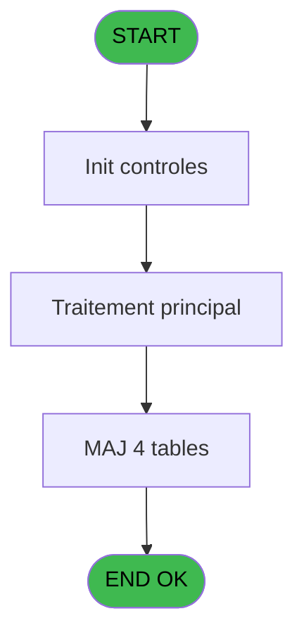

# Menu IDE 23 - Term2Hostname

> **Analyse**: Phases 1-4 2026-02-03 15:15 -> 15:16 (14s) | Assemblage 15:16
> **Pipeline**: V7.2 Enrichi
> **Structure**: 4 onglets (Resume | Ecrans | Donnees | Connexions)

<!-- TAB:Resume -->

## 1. FICHE D'IDENTITE

| Attribut | Valeur |
|----------|--------|
| Projet | Menu |
| IDE Position | 23 |
| Nom Programme | Term2Hostname |
| Fichier source | `Prg_23.xml` |
| Dossier IDE | General |
| Taches | 6 (0 ecrans visibles) |
| Tables modifiees | 4 |
| Programmes appeles | 0 |

## 2. DESCRIPTION FONCTIONNELLE

**Term2Hostname** assure la gestion complete de ce processus, accessible depuis [Main Program (IDE 1)](Menu-IDE-1.md).

Le flux de traitement s'organise en **1 blocs fonctionnels** :

- **Traitement** (6 taches) : traitements metier divers

**Donnees modifiees** : 4 tables en ecriture (terminaux_boutique, numero_des_terminaux_ims, pv_accounting_date, Activite).

Detail : phases du traitement

#### Phase 1 : Traitement (6 taches)

- **23** - Term2Hostname
- **23.1** - Paramètes impression
- **23.2** - Paramètes impression
- **23.3** - Paramètes impression
- **23.4** - Paramètes impression
- **23.5** - Paramètes impression

#### Tables impactees

| Table | Operations | Role metier |
|-------|-----------|-------------|
| numero_des_terminaux_ims | **W** (2 usages) |  |
| terminaux_boutique | **W** (1 usages) |  |
| pv_accounting_date | **W** (1 usages) |  |
| Activite | **W** (1 usages) |  |

## 3. BLOCS FONCTIONNELS

### 3.1 Traitement (6 taches)

Traitements internes.

---

#### 23 - Term2Hostname

**Role** : Tache d'orchestration : point d'entree du programme (6 sous-taches). Coordonne l'enchainement des traitements.

5 sous-taches directes

| Tache | Nom | Bloc |
|-------|-----|------|
| [23.1](#t2) | Paramètes impression | Traitement |
| [23.2](#t5) | Paramètes impression | Traitement |
| [23.3](#t8) | Paramètes impression | Traitement |
| [23.4](#t11) | Paramètes impression | Traitement |
| [23.5](#t14) | Paramètes impression | Traitement |

---

#### 23.1 - Paramètes impression

**Role** : Generation du document : Paramètes impression.

---

#### 23.2 - Paramètes impression

**Role** : Generation du document : Paramètes impression.

---

#### 23.3 - Paramètes impression

**Role** : Generation du document : Paramètes impression.

---

#### 23.4 - Paramètes impression

**Role** : Generation du document : Paramètes impression.

---

#### 23.5 - Paramètes impression

**Role** : Generation du document : Paramètes impression.

## 5. REGLES METIER

*(Aucune regle metier identifiee)*

## 6. CONTEXTE

- **Appele par**: [Main Program (IDE 1)](Menu-IDE-1.md)
- **Appelle**: 0 programmes | **Tables**: 4 (W:4 R:0 L:0) | **Taches**: 6 | **Expressions**: 4

<!-- TAB:Ecrans -->

## 8. ECRANS

*(Programme sans ecran visible)*

## 9. NAVIGATION

### 9.3 Structure hierarchique (6 taches)

| Position | Tache | Type | Dimensions | Bloc |
|----------|-------|------|------------|------|
| **23.1** | [**Term2Hostname** (23)](#t1) | - | - | Traitement |
| 23.1.1 | [Paramètes impression (23.1)](#t2) | - | - | |
| 23.1.2 | [Paramètes impression (23.2)](#t5) | - | - | |
| 23.1.3 | [Paramètes impression (23.3)](#t8) | - | - | |
| 23.1.4 | [Paramètes impression (23.4)](#t11) | - | - | |
| 23.1.5 | [Paramètes impression (23.5)](#t14) | - | - | |

### 9.4 Algorigramme

> **Legende**: Vert = START/END OK | Rouge = END KO | Bleu = Decisions
> *Algorigramme auto-genere. Utiliser `/algorigramme` pour une synthese metier detaillee.*

<!-- TAB:Donnees -->

## 10. TABLES

### Tables utilisees (4)

| ID | Nom | Description | Type | R | W | L | Usages |
|----|-----|-------------|------|---|---|---|--------|
| 256 | terminaux_boutique |  | DB |   | **W** |   | 1 |
| 257 | numero_des_terminaux_ims |  | DB |   | **W** |   | 2 |
| 370 | pv_accounting_date |  | DB |   | **W** |   | 1 |
| 871 | Activite |  | DB |   | **W** |   | 1 |

### Colonnes par table (0 / 4 tables avec colonnes identifiees)

Table 256 - terminaux_boutique (**W**) - 1 usages

*Table utilisee uniquement en Link ou aucune colonne Real identifiee dans le DataView.*

Table 257 - numero_des_terminaux_ims (**W**) - 2 usages

*Table utilisee uniquement en Link ou aucune colonne Real identifiee dans le DataView.*

Table 370 - pv_accounting_date (**W**) - 1 usages

*Table utilisee uniquement en Link ou aucune colonne Real identifiee dans le DataView.*

Table 871 - Activite (**W**) - 1 usages

*Table utilisee uniquement en Link ou aucune colonne Real identifiee dans le DataView.*

## 11. VARIABLES

*(Programme sans variables locales mappees)*

## 12. EXPRESSIONS

**4 / 4 expressions decodees (100%)**

### 12.1 Repartition par type

| Type | Expressions | Regles |
|------|-------------|--------|
| CONSTANTE | 1 | 0 |
| CONDITION | 1 | 0 |
| OTHER | 2 | 0 |

### 12.2 Expressions cles par type

#### CONSTANTE (1 expressions)

| Type | IDE | Expression | Regle |
|------|-----|------------|-------|
| CONSTANTE | 4 | `''` | - |

#### CONDITION (1 expressions)

| Type | IDE | Expression | Regle |
|------|-----|------------|-------|
| CONDITION | 1 | `VG42 AND Term()<>0` | - |

#### OTHER (2 expressions)

| Type | IDE | Expression | Regle |
|------|-----|------------|-------|
| OTHER | 3 | `GetHostName()` | - |
| OTHER | 2 | `Term()` | - |

<!-- TAB:Connexions -->

## 13. GRAPHE D'APPELS

### 13.1 Chaine depuis Main (Callers)

Main -> ... -> [Main Program (IDE 1)](Menu-IDE-1.md) -> **Term2Hostname (IDE 23)**

### 13.2 Callers

| IDE | Nom Programme | Nb Appels |
|-----|---------------|-----------|
| [1](Menu-IDE-1.md) | Main Program | 1 |

### 13.3 Callees (programmes appeles)

### 13.4 Detail Callees avec contexte

| IDE | Nom Programme | Appels | Contexte |
|-----|---------------|--------|----------|
| - | (aucun) | - | - |

## 14. RECOMMANDATIONS MIGRATION

### 14.1 Profil du programme

| Metrique | Valeur | Impact migration |
|----------|--------|-----------------|
| Lignes de logique | 39 | Programme compact |
| Expressions | 4 | Peu de logique |
| Tables WRITE | 4 | Impact modere |
| Sous-programmes | 0 | Peu de dependances |
| Ecrans visibles | 0 | Ecran unique ou traitement batch |
| Code desactive | 0% (0 / 39) | Code sain |
| Regles metier | 0 | Pas de regle identifiee |

### 14.2 Plan de migration par bloc

#### Traitement (6 taches: 0 ecran, 6 traitements)

- **Strategie** : 6 service(s) backend injectable(s) (Domain Services).
- Decomposer les taches en services unitaires testables.

### 14.3 Dependances critiques

| Dependance | Type | Appels | Impact |
|------------|------|--------|--------|
| terminaux_boutique | Table WRITE (Database) | 1x | Schema + repository |
| numero_des_terminaux_ims | Table WRITE (Database) | 2x | Schema + repository |
| pv_accounting_date | Table WRITE (Database) | 1x | Schema + repository |
| Activite | Table WRITE (Database) | 1x | Schema + repository |

---
*Spec DETAILED generee par Pipeline V7.2 - 2026-02-03 15:16*
