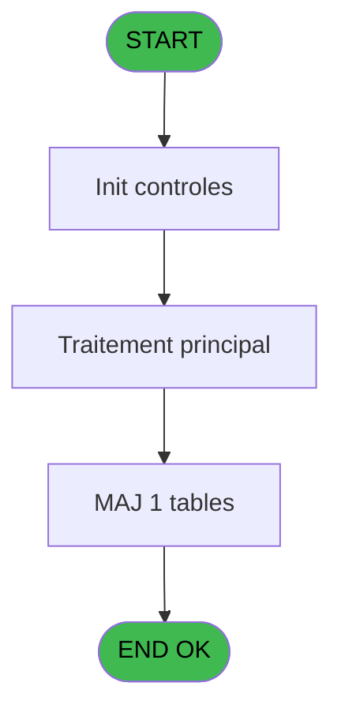

# Menu IDE 5 - Liste des applications

> **Analyse**: Phases 1-4 2026-02-03 15:09 -> 15:10 (14s) | Assemblage 15:10
> **Pipeline**: V7.2 Enrichi
> **Structure**: 4 onglets (Resume | Ecrans | Donnees | Connexions)

<!-- TAB:Resume -->

## 1. FICHE D'IDENTITE

| Attribut | Valeur |
|----------|--------|
| Projet | Menu |
| IDE Position | 5 |
| Nom Programme | Liste des applications |
| Fichier source | `Prg_5.xml` |
| Dossier IDE | Menu |
| Taches | 2 (1 ecrans visibles) |
| Tables modifiees | 1 |
| Programmes appeles | 0 |

## 2. DESCRIPTION FONCTIONNELLE

**Liste des applications** assure la gestion complete de ce processus, accessible depuis [Main Program (IDE 1)](Menu-IDE-1.md).

Le flux de traitement s'organise en **1 blocs fonctionnels** :

- **Traitement** (2 taches) : traitements metier divers

**Donnees modifiees** : 1 tables en ecriture (Table_1003).

**Logique metier** : 2 regles identifiees couvrant conditions metier.

## 3. BLOCS FONCTIONNELS

### 3.1 Traitement (2 taches)

Traitements internes.

---

#### 5 - Liste des applications [[ECRAN]](#ecran-t1)

**Role** : Traitement : Liste des applications.
**Ecran** : 631 x 440 DLU | [Voir mockup](#ecran-t1)

---

#### 5.1 - Dernière visu doc

**Role** : Traitement : Dernière visu doc.

## 5. REGLES METIER

2 regles identifiees:

### Autres (2 regles)

#### [RM-001] Condition toujours vraie (flag actif)

| Element | Detail |
|---------|--------|
| **Condition** | `v.Pseudo terminal [B]='ATY'` |
| **Si vrai** | [L] |
| **Si faux** | 'TRUE'LOG) |
| **Variables** | B (v.Pseudo terminal) |
| **Expression source** | Expression 5 : `IF(v.Pseudo terminal [B]='ATY',[L],'TRUE'LOG)` |
| **Exemple** | Si v.Pseudo terminal [B]='ATY' → [L]. Sinon → 'TRUE'LOG) |

#### [RM-002] Si [Z]=143 alors 205 sinon 143)

| Element | Detail |
|---------|--------|
| **Condition** | `[Z]=143` |
| **Si vrai** | 205 |
| **Si faux** | 143) |
| **Expression source** | Expression 13 : `IF([Z]=143, 205, 143)` |
| **Exemple** | Si [Z]=143 → 205. Sinon → 143) |

## 6. CONTEXTE

- **Appele par**: [Main Program (IDE 1)](Menu-IDE-1.md)
- **Appelle**: 0 programmes | **Tables**: 2 (W:1 R:1 L:0) | **Taches**: 2 | **Expressions**: 29

<!-- TAB:Ecrans -->

## 8. ECRANS

### 8.1 Forms visibles (1 / 2)

| # | Position | Tache | Nom | Type | Largeur | Hauteur | Bloc |
|---|----------|-------|-----|------|---------|---------|------|
| 1 | 5 | 5 | Liste des applications | Type0 | 631 | 440 | Traitement |

### 8.2 Mockups Ecrans

---

#### 5 - Liste des applications
**Tache** : [5](#t1) | **Type** : Type0 | **Dimensions** : 631 x 440 DLU
**Bloc** : Traitement | **Titre IDE** : Liste des applications

<!-- FORM-DATA:
{
    "width":  631,
    "vFactor":  8,
    "type":  "Type0",
    "hFactor":  8,
    "controls":  [
                     {
                         "x":  554,
                         "type":  "label",
                         "var":  "",
                         "y":  42,
                         "w":  40,
                         "fmt":  "",
                         "name":  "PMSNEWS_NUM",
                         "h":  15,
                         "color":  "143",
                         "text":  "",
                         "parent":  null
                     },
                     {
                         "x":  50,
                         "type":  "edit",
                         "var":  "",
                         "y":  7,
                         "w":  461,
                         "fmt":  "",
                         "name":  "Nom Application",
                         "h":  407,
                         "color":  "32",
                         "text":  "",
                         "parent":  null
                     },
                     {
                         "x":  523,
                         "type":  "image",
                         "var":  "",
                         "y":  7,
                         "w":  93,
                         "fmt":  "",
                         "name":  "PMSNEWS",
                         "h":  43,
                         "color":  "32",
                         "text":  "",
                         "parent":  null
                     },
                     {
                         "x":  232,
                         "type":  "button",
                         "var":  "",
                         "y":  420,
                         "w":  120,
                         "fmt":  "\u0026Quitter",
                         "name":  "",
                         "h":  15,
                         "color":  "",
                         "text":  "",
                         "parent":  null
                     }
                 ],
    "taskId":  "5",
    "height":  440
}
-->

<strong>Champs : 1 champs</strong>

| Pos (x,y) | Nom | Variable | Type |
|-----------|-----|----------|------|
| 50,7 | Nom Application | - | edit |

<strong>Boutons : 1 boutons</strong>

| Bouton | Pos (x,y) | Action |
|--------|-----------|--------|
| Quitter | 232,420 | Quitte le programme |

## 9. NAVIGATION

Ecran unique: **Liste des applications**

### 9.3 Structure hierarchique (2 taches)

| Position | Tache | Type | Dimensions | Bloc |
|----------|-------|------|------------|------|
| **5.1** | [**Liste des applications** (5)](#t1) [mockup](#ecran-t1) | - | 631x440 | Traitement |
| 5.1.1 | [Dernière visu doc (5.1)](#t2) | - | - | |

### 9.4 Algorigramme

> **Legende**: Vert = START/END OK | Rouge = END KO | Bleu = Decisions
> *Algorigramme auto-genere. Utiliser `/algorigramme` pour une synthese metier detaillee.*

<!-- TAB:Donnees -->

## 10. TABLES

### Tables utilisees (2)

| ID | Nom | Description | Type | R | W | L | Usages |
|----|-----|-------------|------|---|---|---|--------|
| 1 | histoticket_dat | Historique / journal | DB | R |   |   | 1 |
| 1003 | Table_1003 |  | MEM |   | **W** |   | 1 |

### Colonnes par table (2 / 2 tables avec colonnes identifiees)

Table 1 - histoticket_dat (R) - 1 usages

| Lettre | Variable | Acces | Type |
|--------|----------|-------|------|
| A | v.retour | R | Logical |
| B | v.Pseudo terminal | R | Numeric |
| C | v.Batch Id père | R | Numeric |
| D | v.Batch Id | R | Numeric |
| E | v.PMS News fichier | R | Unicode |
| F | v.PMS News date | R | Date |
| G | v.Couleur PMSNews | R | Numeric |
| H | v.PMSNews existe ? | R | Logical |
| I | v.PMSNews à lire ? | R | Logical |
| J | v.test | R | Unicode |

Table 1003 - Table_1003 (**W**) - 1 usages

| Lettre | Variable | Acces | Type |
|--------|----------|-------|------|
| A | v.Dernier lecture trouvée ? | W | Logical |
| B | v.Date dernière lecture | W | Date |

## 11. VARIABLES

### 11.1 Variables de session (10)

Variables persistantes pendant toute la session.

| Lettre | Nom | Type | Usage dans |
|--------|-----|------|-----------|
| A | v.retour | Logical | - |
| B | v.Pseudo terminal | Numeric | 3x session |
| C | v.Batch Id père | Numeric | 1x session |
| D | v.Batch Id | Numeric | 1x session |
| E | v.PMS News fichier | Unicode | 1x session |
| F | v.PMS News date | Date | - |
| G | v.Couleur PMSNews | Numeric | - |
| H | v.PMSNews existe ? | Logical | - |
| I | v.PMSNews à lire ? | Logical | - |
| J | v.test | Unicode | - |

## 12. EXPRESSIONS

**29 / 29 expressions decodees (100%)**

### 12.1 Repartition par type

| Type | Expressions | Regles |
|------|-------------|--------|
| CONCATENATION | 1 | 0 |
| FORMAT | 3 | 0 |
| CAST_LOGIQUE | 3 | 5 |
| CONDITION | 3 | 5 |
| CONSTANTE | 6 | 0 |
| OTHER | 11 | 0 |
| REFERENCE_VG | 2 | 0 |

### 12.2 Expressions cles par type

#### CONCATENATION (1 expressions)

| Type | IDE | Expression | Regle |
|------|-----|------------|-------|
| CONCATENATION | 7 | `Translate('%EngineDir%MgxpaRuntime.exe /ini='&Translate('%env%')&'magic.ini'&' /InputPassword=N /Terminal=')&Trim(VG5)&' /[MAGIC_LOGICAL_NAMES]club_user='&Trim(VG7)&' /[MAGIC_LOGICAL_NAMES]SERVER='&Translate('%SERVER%')&' /StartApplication='&Translate('%club_prog%'&Trim(v.PMS News fichier [E]))&' /StartingLanguage='&Trim(VG1)& ' /[MAGIC_LOGICAL_NAMES]club_hostname=' &Trim(VG39)` | - |

#### FORMAT (3 expressions)

| Type | IDE | Expression | Regle |
|------|-----|------------|-------|
| FORMAT | 24 | `StrBuild(MlsTrans('Dernière version du @1@'), DStr([AD], '##/##/####'))` | - |
| FORMAT | 23 | `StrBuild(MlsTrans('Consultation de la documentation PMS du @1@'),DStr([AD], '##/##/####'))` | - |
| FORMAT | 9 | `StrBuild(MlsTrans('Quitter le menu (@1@/@2@)'), VG7, Str([V], '3'))` | - |

#### CAST_LOGIQUE (3 expressions)

| Type | IDE | Expression | Regle |
|------|-----|------------|-------|
| CAST_LOGIQUE | 5 | `IF(v.Pseudo terminal [B]='ATY',[L],'TRUE'LOG)` | [RM-001](#rm-RM-001) |
| CAST_LOGIQUE | 27 | `'FALSE'LOG` | - |
| CAST_LOGIQUE | 11 | `INIPut('[MAGIC_LOGICAL_NAMES]club_user=*'& VG7, 'FALSE'LOG)` | - |

#### CONDITION (3 expressions)

| Type | IDE | Expression | Regle |
|------|-----|------------|-------|
| CONDITION | 13 | `IF([Z]=143, 205, 143)` | [RM-002](#rm-RM-002) |
| CONDITION | 6 | `v.Pseudo terminal [B]<>'ATY'` | - |
| CONDITION | 2 | `v.Pseudo terminal [B]='ATY'` | - |

#### CONSTANTE (6 expressions)

| Type | IDE | Expression | Regle |
|------|-----|------------|-------|
| CONSTANTE | 20 | `'DOC'` | - |
| CONSTANTE | 21 | `'PMS'` | - |
| CONSTANTE | 29 | `0` | - |
| CONSTANTE | 1 | `'FRA'` | - |
| CONSTANTE | 4 | `'ATY'` | - |
| ... | | *+1 autres* | |

#### OTHER (11 expressions)

| Type | IDE | Expression | Regle |
|------|-----|------------|-------|
| OTHER | 22 | `[AE]` | - |
| OTHER | 18 | `[AC]` | - |
| OTHER | 25 | `[AA]` | - |
| OTHER | 28 | `[AG]` | - |
| OTHER | 26 | `[Z]` | - |
| ... | | *+6 autres* | |

#### REFERENCE_VG (2 expressions)

| Type | IDE | Expression | Regle |
|------|-----|------------|-------|
| REFERENCE_VG | 19 | `VG7` | - |
| REFERENCE_VG | 10 | `VG42` | - |

### 12.3 Toutes les expressions (29)

Voir les 29 expressions

#### CONCATENATION (1)

| IDE | Expression Decodee |
|-----|-------------------|
| 7 | `Translate('%EngineDir%MgxpaRuntime.exe /ini='&Translate('%env%')&'magic.ini'&' /InputPassword=N /Terminal=')&Trim(VG5)&' /[MAGIC_LOGICAL_NAMES]club_user='&Trim(VG7)&' /[MAGIC_LOGICAL_NAMES]SERVER='&Translate('%SERVER%')&' /StartApplication='&Translate('%club_prog%'&Trim(v.PMS News fichier [E]))&' /StartingLanguage='&Trim(VG1)& ' /[MAGIC_LOGICAL_NAMES]club_hostname=' &Trim(VG39)` |

#### FORMAT (3)

| IDE | Expression Decodee |
|-----|-------------------|
| 9 | `StrBuild(MlsTrans('Quitter le menu (@1@/@2@)'), VG7, Str([V], '3'))` |
| 23 | `StrBuild(MlsTrans('Consultation de la documentation PMS du @1@'),DStr([AD], '##/##/####'))` |
| 24 | `StrBuild(MlsTrans('Dernière version du @1@'), DStr([AD], '##/##/####'))` |

#### CAST_LOGIQUE (3)

| IDE | Expression Decodee |
|-----|-------------------|
| 11 | `INIPut('[MAGIC_LOGICAL_NAMES]club_user=*'& VG7, 'FALSE'LOG)` |
| 5 | `IF(v.Pseudo terminal [B]='ATY',[L],'TRUE'LOG)` |
| 27 | `'FALSE'LOG` |

#### CONDITION (3)

| IDE | Expression Decodee |
|-----|-------------------|
| 13 | `IF([Z]=143, 205, 143)` |
| 2 | `v.Pseudo terminal [B]='ATY'` |
| 6 | `v.Pseudo terminal [B]<>'ATY'` |

#### CONSTANTE (6)

| IDE | Expression Decodee |
|-----|-------------------|
| 1 | `'FRA'` |
| 4 | `'ATY'` |
| 17 | `'OK'` |
| 20 | `'DOC'` |
| 21 | `'PMS'` |
| 29 | `0` |

#### OTHER (11)

| IDE | Expression Decodee |
|-----|-------------------|
| 3 | `v.Batch Id père [C]` |
| 8 | `GetPseudoTerminal ()` |
| 12 | `[Y]` |
| 14 | `[Y]` |
| 15 | `Delay(0)` |
| 16 | `Translate('%club_command%pmsnews.pdf')` |
| 18 | `[AC]` |
| 22 | `[AE]` |
| 25 | `[AA]` |
| 26 | `[Z]` |
| 28 | `[AG]` |

#### REFERENCE_VG (2)

| IDE | Expression Decodee |
|-----|-------------------|
| 10 | `VG42` |
| 19 | `VG7` |

<!-- TAB:Connexions -->

## 13. GRAPHE D'APPELS

### 13.1 Chaine depuis Main (Callers)

Main -> ... -> [Main Program (IDE 1)](Menu-IDE-1.md) -> **Liste des applications (IDE 5)**

### 13.2 Callers

| IDE | Nom Programme | Nb Appels |
|-----|---------------|-----------|
| [1](Menu-IDE-1.md) | Main Program | 1 |

### 13.3 Callees (programmes appeles)

### 13.4 Detail Callees avec contexte

| IDE | Nom Programme | Appels | Contexte |
|-----|---------------|--------|----------|
| - | (aucun) | - | - |

## 14. RECOMMANDATIONS MIGRATION

### 14.1 Profil du programme

| Metrique | Valeur | Impact migration |
|----------|--------|-----------------|
| Lignes de logique | 85 | Programme compact |
| Expressions | 29 | Peu de logique |
| Tables WRITE | 1 | Impact faible |
| Sous-programmes | 0 | Peu de dependances |
| Ecrans visibles | 1 | Ecran unique ou traitement batch |
| Code desactive | 0% (0 / 85) | Code sain |
| Regles metier | 2 | Quelques regles a preserver |

### 14.2 Plan de migration par bloc

#### Traitement (2 taches: 1 ecran, 1 traitement)

- **Strategie** : Orchestrateur avec 1 ecrans (Razor/React) et 1 traitements backend (services).
- Les ecrans deviennent des composants UI, les traitements invisibles deviennent des services injectables.
- Decomposer les taches en services unitaires testables.

### 14.3 Dependances critiques

| Dependance | Type | Appels | Impact |
|------------|------|--------|--------|
| Table_1003 | Table WRITE (Memory) | 1x | Schema + repository |

---
*Spec DETAILED generee par Pipeline V7.2 - 2026-02-03 15:10*
