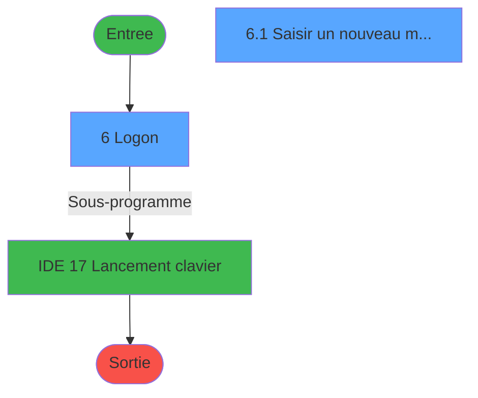
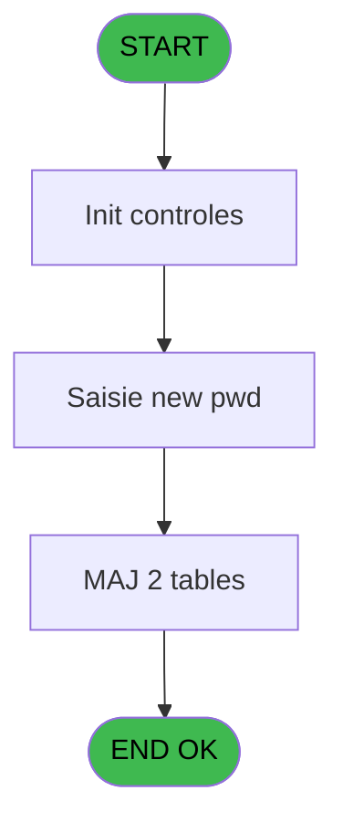
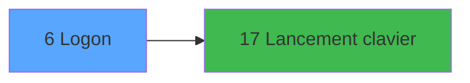

# Menu IDE 6 - Logon

> **Analyse**: Phases 1-4 2026-02-03 15:10 -> 15:10 (11s) | Assemblage 15:10
> **Pipeline**: V7.2 Enrichi
> **Structure**: 4 onglets (Resume | Ecrans | Donnees | Connexions)

<!-- TAB:Resume -->

## 1. FICHE D'IDENTITE

| Attribut | Valeur |
|----------|--------|
| Projet | Menu |
| IDE Position | 6 |
| Nom Programme | Logon |
| Fichier source | `Prg_6.xml` |
| Dossier IDE | Menu |
| Taches | 5 (2 ecrans visibles) |
| Tables modifiees | 2 |
| Programmes appeles | 1 |

## 2. DESCRIPTION FONCTIONNELLE

**Logon** assure la gestion complete de ce processus, accessible depuis [Main Program (IDE 1)](Menu-IDE-1.md).

Le flux de traitement s'organise en **1 blocs fonctionnels** :

- **Traitement** (5 taches) : traitements metier divers

**Donnees modifiees** : 2 tables en ecriture (pv_stock_movements, easy_check_in).

Detail : phases du traitement

#### Phase 1 : Traitement (5 taches)

- **6** - Logon **[[ECRAN]](#ecran-t1)**
- **6.1** - Saisir un nouveau mot de passe **[[ECRAN]](#ecran-t5)**
- **6.1.1** - Maj historique pwd
- **6.1.2** - suppr histo
- **6.1.3** - Supp pw provisoire

Delegue a : [Lancement clavier (IDE 17)](Menu-IDE-17.md)

#### Tables impactees

| Table | Operations | Role metier |
|-------|-----------|-------------|
| easy_check_in | **W**/L (4 usages) |  |
| pv_stock_movements | **W** (1 usages) | Articles et stock |

## 3. BLOCS FONCTIONNELS

### 3.1 Traitement (5 taches)

Traitements internes.

---

#### 6 - Logon [[ECRAN]](#ecran-t1)

**Role** : Traitement : Logon.
**Ecran** : 604 x 143 DLU (Type6) | [Voir mockup](#ecran-t1)

4 sous-taches directes

| Tache | Nom | Bloc |
|-------|-----|------|
| [6.1](#t5) | Saisir un nouveau mot de passe **[[ECRAN]](#ecran-t5)** | Traitement |
| [6.1.1](#t6) | Maj historique pwd | Traitement |
| [6.1.2](#t7) | suppr histo | Traitement |
| [6.1.3](#t10) | Supp pw provisoire | Traitement |

**Delegue a** : [Lancement clavier (IDE 17)](Menu-IDE-17.md)

---

#### 6.1 - Saisir un nouveau mot de passe [[ECRAN]](#ecran-t5)

**Role** : Creation d'enregistrement : Saisir un nouveau mot de passe.
**Ecran** : 604 x 143 DLU (Type6) | [Voir mockup](#ecran-t5)
**Delegue a** : [Lancement clavier (IDE 17)](Menu-IDE-17.md)

---

#### 6.1.1 - Maj historique pwd

**Role** : Consultation/chargement : Maj historique pwd.
**Delegue a** : [Lancement clavier (IDE 17)](Menu-IDE-17.md)

---

#### 6.1.2 - suppr histo

**Role** : Traitement : suppr histo.
**Variables liees** : F (L.Existe histo ?)
**Delegue a** : [Lancement clavier (IDE 17)](Menu-IDE-17.md)

---

#### 6.1.3 - Supp pw provisoire

**Role** : Traitement : Supp pw provisoire.
**Variables liees** : E (L.Existe provisoire ?)
**Delegue a** : [Lancement clavier (IDE 17)](Menu-IDE-17.md)

## 5. REGLES METIER

*(Aucune regle metier identifiee)*

## 6. CONTEXTE

- **Appele par**: [Main Program (IDE 1)](Menu-IDE-1.md)
- **Appelle**: 1 programmes | **Tables**: 3 (W:2 R:1 L:1) | **Taches**: 5 | **Expressions**: 37

<!-- TAB:Ecrans -->

## 8. ECRANS

### 8.1 Forms visibles (2 / 5)

| # | Position | Tache | Nom | Type | Largeur | Hauteur | Bloc |
|---|----------|-------|-----|------|---------|---------|------|
| 1 | 6 | 6 | Logon | Type6 | 604 | 143 | Traitement |
| 2 | 6.1 | 6.1 | Saisir un nouveau mot de passe | Type6 | 604 | 143 | Traitement |

### 8.2 Mockups Ecrans

---

#### 6 - Logon
**Tache** : [6](#t1) | **Type** : Type6 | **Dimensions** : 604 x 143 DLU
**Bloc** : Traitement | **Titre IDE** : Logon

<!-- FORM-DATA:
{
    "width":  604,
    "vFactor":  8,
    "type":  "Type6",
    "hFactor":  4,
    "controls":  [
                     {
                         "x":  7,
                         "type":  "label",
                         "var":  "",
                         "y":  19,
                         "w":  185,
                         "fmt":  "",
                         "name":  "",
                         "h":  28,
                         "color":  "",
                         "text":  "Login :",
                         "parent":  23
                     },
                     {
                         "x":  7,
                         "type":  "label",
                         "var":  "",
                         "y":  56,
                         "w":  185,
                         "fmt":  "",
                         "name":  "",
                         "h":  28,
                         "color":  "",
                         "text":  "Mot de passe :",
                         "parent":  23
                     },
                     {
                         "x":  3,
                         "type":  "label",
                         "var":  "",
                         "y":  100,
                         "w":  598,
                         "fmt":  "",
                         "name":  "",
                         "h":  40,
                         "color":  "",
                         "text":  "",
                         "parent":  null
                     },
                     {
                         "x":  3,
                         "type":  "label",
                         "var":  "",
                         "y":  4,
                         "w":  598,
                         "fmt":  "",
                         "name":  "",
                         "h":  90,
                         "color":  "",
                         "text":  "",
                         "parent":  null
                     },
                     {
                         "x":  410,
                         "type":  "button",
                         "var":  "",
                         "y":  19,
                         "w":  185,
                         "fmt":  "\u0026Clavier",
                         "name":  "CLAVIER",
                         "h":  28,
                         "color":  "",
                         "text":  "",
                         "parent":  23
                     },
                     {
                         "x":  208,
                         "type":  "edit",
                         "var":  "",
                         "y":  19,
                         "w":  185,
                         "fmt":  "",
                         "name":  "User",
                         "h":  28,
                         "color":  "6",
                         "text":  "",
                         "parent":  23
                     },
                     {
                         "x":  208,
                         "type":  "edit",
                         "var":  "",
                         "y":  56,
                         "w":  185,
                         "fmt":  "",
                         "name":  "Password",
                         "h":  28,
                         "color":  "6",
                         "text":  "",
                         "parent":  23
                     },
                     {
                         "x":  7,
                         "type":  "button",
                         "var":  "",
                         "y":  106,
                         "w":  185,
                         "fmt":  "\u0026Ok",
                         "name":  "Bouton ok",
                         "h":  28,
                         "color":  "",
                         "text":  "",
                         "parent":  8
                     },
                     {
                         "x":  208,
                         "type":  "button",
                         "var":  "",
                         "y":  106,
                         "w":  185,
                         "fmt":  "Changer \u0026Mot de passe",
                         "name":  "CHANGEMP",
                         "h":  28,
                         "color":  "",
                         "text":  "",
                         "parent":  8
                     },
                     {
                         "x":  410,
                         "type":  "button",
                         "var":  "",
                         "y":  106,
                         "w":  185,
                         "fmt":  "\\A\u0026bandonner",
                         "name":  "Bt.Abandonner",
                         "h":  28,
                         "color":  "",
                         "text":  "",
                         "parent":  8
                     }
                 ],
    "taskId":  "6",
    "height":  143
}
-->

<strong>Champs : 2 champs</strong>

| Pos (x,y) | Nom | Variable | Type |
|-----------|-----|----------|------|
| 208,19 | User | - | edit |
| 208,56 | Password | - | edit |

<strong>Boutons : 4 boutons</strong>

| Bouton | Pos (x,y) | Action |
|--------|-----------|--------|
| Clavier | 410,19 | Appel [Lancement clavier (IDE 17)](Menu-IDE-17.md) |
| Ok | 7,106 | Valide la saisie et enregistre |
| Changer Mot de passe | 208,106 | Modifie l'element |
| \Abandonner | 410,106 | Annule et retour au menu |

---

#### 6.1 - Saisir un nouveau mot de passe
**Tache** : [6.1](#t5) | **Type** : Type6 | **Dimensions** : 604 x 143 DLU
**Bloc** : Traitement | **Titre IDE** : Saisir un nouveau mot de passe

<!-- FORM-DATA:
{
    "width":  604,
    "vFactor":  8,
    "type":  "Type6",
    "hFactor":  4,
    "controls":  [
                     {
                         "x":  3,
                         "type":  "label",
                         "var":  "",
                         "y":  4,
                         "w":  598,
                         "fmt":  "",
                         "name":  "",
                         "h":  90,
                         "color":  "",
                         "text":  "",
                         "parent":  null
                     },
                     {
                         "x":  7,
                         "type":  "label",
                         "var":  "",
                         "y":  19,
                         "w":  185,
                         "fmt":  "",
                         "name":  "",
                         "h":  28,
                         "color":  "",
                         "text":  "Mot de passe :",
                         "parent":  1
                     },
                     {
                         "x":  7,
                         "type":  "label",
                         "var":  "",
                         "y":  56,
                         "w":  185,
                         "fmt":  "",
                         "name":  "",
                         "h":  28,
                         "color":  "",
                         "text":  "Confirmez Mot de passe :",
                         "parent":  1
                     },
                     {
                         "x":  3,
                         "type":  "label",
                         "var":  "",
                         "y":  97,
                         "w":  598,
                         "fmt":  "",
                         "name":  "",
                         "h":  40,
                         "color":  "",
                         "text":  "",
                         "parent":  null
                     },
                     {
                         "x":  208,
                         "type":  "edit",
                         "var":  "",
                         "y":  19,
                         "w":  185,
                         "fmt":  "",
                         "name":  "newpwd",
                         "h":  28,
                         "color":  "6",
                         "text":  "",
                         "parent":  1
                     },
                     {
                         "x":  410,
                         "type":  "button",
                         "var":  "",
                         "y":  19,
                         "w":  185,
                         "fmt":  "\u0026Clavier",
                         "name":  "CLAVIER",
                         "h":  28,
                         "color":  "",
                         "text":  "",
                         "parent":  1
                     },
                     {
                         "x":  208,
                         "type":  "edit",
                         "var":  "",
                         "y":  56,
                         "w":  185,
                         "fmt":  "",
                         "name":  "confirmpwd",
                         "h":  28,
                         "color":  "6",
                         "text":  "",
                         "parent":  1
                     },
                     {
                         "x":  7,
                         "type":  "button",
                         "var":  "",
                         "y":  104,
                         "w":  185,
                         "fmt":  "\u0026Ok",
                         "name":  "Bouton ok",
                         "h":  28,
                         "color":  "",
                         "text":  "",
                         "parent":  6
                     },
                     {
                         "x":  410,
                         "type":  "button",
                         "var":  "",
                         "y":  104,
                         "w":  185,
                         "fmt":  "A\u0026bandonner",
                         "name":  "Bt.Cancel",
                         "h":  28,
                         "color":  "",
                         "text":  "",
                         "parent":  6
                     }
                 ],
    "taskId":  "6.1",
    "height":  143
}
-->

<strong>Champs : 2 champs</strong>

| Pos (x,y) | Nom | Variable | Type |
|-----------|-----|----------|------|
| 208,19 | newpwd | - | edit |
| 208,56 | confirmpwd | - | edit |

<strong>Boutons : 3 boutons</strong>

| Bouton | Pos (x,y) | Action |
|--------|-----------|--------|
| Clavier | 410,19 | Appel [Lancement clavier (IDE 17)](Menu-IDE-17.md) |
| Ok | 7,104 | Valide la saisie et enregistre |
| Abandonner | 410,104 | Annule et retour au menu |

## 9. NAVIGATION

### 9.1 Enchainement des ecrans

**Detail par enchainement :**

| Depuis | Action | Vers | Retour |
|--------|--------|------|--------|
| Logon | Sous-programme | [Lancement clavier (IDE 17)](Menu-IDE-17.md) | Retour ecran |

### 9.3 Structure hierarchique (5 taches)

| Position | Tache | Type | Dimensions | Bloc |
|----------|-------|------|------------|------|
| **6.1** | [**Logon** (6)](#t1) [mockup](#ecran-t1) | Type6 | 604x143 | Traitement |
| 6.1.1 | [Saisir un nouveau mot de passe (6.1)](#t5) [mockup](#ecran-t5) | Type6 | 604x143 | |
| 6.1.2 | [Maj historique pwd (6.1.1)](#t6) | - | - | |
| 6.1.3 | [suppr histo (6.1.2)](#t7) | - | - | |
| 6.1.4 | [Supp pw provisoire (6.1.3)](#t10) | - | - | |

### 9.4 Algorigramme

> **Legende**: Vert = START/END OK | Rouge = END KO | Bleu = Decisions
> *Algorigramme auto-genere. Utiliser `/algorigramme` pour une synthese metier detaillee.*

<!-- TAB:Donnees -->

## 10. TABLES

### Tables utilisees (3)

| ID | Nom | Description | Type | R | W | L | Usages |
|----|-----|-------------|------|---|---|---|--------|
| 740 | pv_stock_movements | Articles et stock | DB |   | **W** |   | 1 |
| 769 | type_repas |  | DB | R |   |   | 1 |
| 771 | easy_check_in |  | DB |   | **W** | L | 4 |

### Colonnes par table (0 / 3 tables avec colonnes identifiees)

Table 740 - pv_stock_movements (**W**) - 1 usages

*Table utilisee uniquement en Link ou aucune colonne Real identifiee dans le DataView.*

Table 769 - type_repas (R) - 1 usages

*Table utilisee uniquement en Link ou aucune colonne Real identifiee dans le DataView.*

Table 771 - easy_check_in (**W**/L) - 4 usages

*Table utilisee uniquement en Link ou aucune colonne Real identifiee dans le DataView.*

## 11. VARIABLES

### 11.1 Parametres entrants (1)

Variables recues du programme appelant ([Main Program (IDE 1)](Menu-IDE-1.md)).

| Lettre | Nom | Type | Usage dans |
|--------|-----|------|-----------|
| A | P.Login ok ? | Logical | - |

### 11.2 Variables de session (7)

Variables persistantes pendant toute la session.

| Lettre | Nom | Type | Usage dans |
|--------|-----|------|-----------|
| B | V.Login | Unicode | - |
| C | V.Password | Unicode | 2x session |
| L | V.Demande change MP ? | Logical | - |
| M | V.Existe resp gestion ? | Logical | - |
| N | V.Existe resp reception ? | Logical | - |
| O | V.Clé de Cryptage | Blob | - |
| P | V.MDP Crypté | Alpha | - |

### 11.3 Autres (8)

Variables diverses.

| Lettre | Nom | Type | Usage dans |
|--------|-----|------|-----------|
| D | L.Existe user ? | Logical | - |
| E | L.Existe provisoire ? | Logical | [6.1.3](#t10) |
| F | L.Existe histo ? | Logical | - |
| G | L.Regles OK ? | Logical | - |
| H | Bt.Keyboard | Alpha | 1x refs |
| I | Bt.Ok | Alpha | 3x refs |
| J | Bt.Changer MP | Alpha | - |
| K | Bt.Cancel | Alpha | - |

Toutes les 16 variables (liste complete)

| Cat | Lettre | Nom Variable | Type |
|-----|--------|--------------|------|
| P0 | **A** | P.Login ok ? | Logical |
| V. | **B** | V.Login | Unicode |
| V. | **C** | V.Password | Unicode |
| V. | **L** | V.Demande change MP ? | Logical |
| V. | **M** | V.Existe resp gestion ? | Logical |
| V. | **N** | V.Existe resp reception ? | Logical |
| V. | **O** | V.Clé de Cryptage | Blob |
| V. | **P** | V.MDP Crypté | Alpha |
| Autre | **D** | L.Existe user ? | Logical |
| Autre | **E** | L.Existe provisoire ? | Logical |
| Autre | **F** | L.Existe histo ? | Logical |
| Autre | **G** | L.Regles OK ? | Logical |
| Autre | **H** | Bt.Keyboard | Alpha |
| Autre | **I** | Bt.Ok | Alpha |
| Autre | **J** | Bt.Changer MP | Alpha |
| Autre | **K** | Bt.Cancel | Alpha |

## 12. EXPRESSIONS

**37 / 37 expressions decodees (100%)**

### 12.1 Repartition par type

| Type | Expressions | Regles |
|------|-------------|--------|
| CONCATENATION | 5 | 0 |
| CONSTANTE | 8 | 0 |
| OTHER | 10 | 0 |
| NEGATION | 1 | 0 |
| CAST_LOGIQUE | 1 | 0 |
| CONDITION | 11 | 0 |
| REFERENCE_VG | 1 | 0 |

### 12.2 Expressions cles par type

#### CONCATENATION (5 expressions)

| Type | IDE | Expression | Regle |
|------|-----|------------|-------|
| CONCATENATION | 33 | `'Mot de passe incorrect !'&VG44&'Wrong password !'` | - |
| CONCATENATION | 34 | `'Mot de passe provisoire renseigné. Merci de saisir un nouveau mot de passe.'&VG44&
'Temporary password used. Thanks to put a new password.'` | - |
| CONCATENATION | 32 | `'Vous ne pouvez vous connecter en SUPERVIS une fois que les responsables GESTION et RECEPTION existent !'&VG44&
'You can not connect in SUPERVIS when responsables GESTION or RECEPTION exist !'` | - |
| CONCATENATION | 36 | `CallProg('{10,-1}'PROG,DbName('{771,2}'DSOURCE),'WHERE pwh_utilisateur='''&Trim({1,24})&'''')` | - |
| CONCATENATION | 31 | `'Utilisateur non référencé !'&VG44&'User not recognize !'` | - |

#### CONSTANTE (8 expressions)

| Type | IDE | Expression | Regle |
|------|-----|------------|-------|
| CONSTANTE | 23 | `'Supervisor'` | - |
| CONSTANTE | 20 | `'RECEPTION'` | - |
| CONSTANTE | 37 | `'NBRHISTO'` | - |
| CONSTANTE | 26 | `'PASSWORD'` | - |
| CONSTANTE | 7 | `''` | - |
| ... | | *+3 autres* | |

#### OTHER (10 expressions)

| Type | IDE | Expression | Regle |
|------|-----|------------|-------|
| OTHER | 14 | `Bt.Ok [I]` | - |
| OTHER | 10 | `Bt.Ok [I]` | - |
| OTHER | 29 | `V.Password [C]` | - |
| OTHER | 35 | `{1,9}` | - |
| OTHER | 30 | `NOT(VG41)` | - |
| ... | | *+5 autres* | |

#### NEGATION (1 expressions)

| Type | IDE | Expression | Regle |
|------|-----|------------|-------|
| NEGATION | 2 | `NOT Bt.Keyboard [H] AND [X]<>'SUPERVIS'` | - |

#### CAST_LOGIQUE (1 expressions)

| Type | IDE | Expression | Regle |
|------|-----|------------|-------|
| CAST_LOGIQUE | 4 | `'TRUE'LOG` | - |

#### CONDITION (11 expressions)

| Type | IDE | Expression | Regle |
|------|-----|------------|-------|
| CONDITION | 22 | `V.Password [C]<>'super'` | - |
| CONDITION | 21 | `[X]='SUPERVIS' AND [AP] AND [AX]` | - |
| CONDITION | 24 | `VG40<>'TB'` | - |
| CONDITION | 27 | `[BG]<>L.Existe provisoire ? [E]` | - |
| CONDITION | 25 | `VG40='TB'` | - |
| ... | | *+6 autres* | |

#### REFERENCE_VG (1 expressions)

| Type | IDE | Expression | Regle |
|------|-----|------------|-------|
| REFERENCE_VG | 28 | `VG41` | - |

### 12.3 Toutes les expressions (37)

Voir les 37 expressions

#### CONCATENATION (5)

| IDE | Expression Decodee |
|-----|-------------------|
| 36 | `CallProg('{10,-1}'PROG,DbName('{771,2}'DSOURCE),'WHERE pwh_utilisateur='''&Trim({1,24})&'''')` |
| 31 | `'Utilisateur non référencé !'&VG44&'User not recognize !'` |
| 32 | `'Vous ne pouvez vous connecter en SUPERVIS une fois que les responsables GESTION et RECEPTION existent !'&VG44&
'You can not connect in SUPERVIS when responsables GESTION or RECEPTION exist !'` |
| 33 | `'Mot de passe incorrect !'&VG44&'Wrong password !'` |
| 34 | `'Mot de passe provisoire renseigné. Merci de saisir un nouveau mot de passe.'&VG44&
'Temporary password used. Thanks to put a new password.'` |

#### CONSTANTE (8)

| IDE | Expression Decodee |
|-----|-------------------|
| 3 | `0` |
| 7 | `''` |
| 18 | `'GESTION'` |
| 19 | `'O'` |
| 20 | `'RECEPTION'` |
| 23 | `'Supervisor'` |
| 26 | `'PASSWORD'` |
| 37 | `'NBRHISTO'` |

#### OTHER (10)

| IDE | Expression Decodee |
|-----|-------------------|
| 1 | `[X]` |
| 5 | `[Q] OR NOT([AY])` |
| 6 | `ExpCalc('26'EXP) OR NOT( Bt.Ok [I])` |
| 8 | `NOT(ExpCalc('26'EXP))` |
| 9 | `[S]` |
| 10 | `Bt.Ok [I]` |
| 14 | `Bt.Ok [I]` |
| 29 | `V.Password [C]` |
| 30 | `NOT(VG41)` |
| 35 | `{1,9}` |

#### NEGATION (1)

| IDE | Expression Decodee |
|-----|-------------------|
| 2 | `NOT Bt.Keyboard [H] AND [X]<>'SUPERVIS'` |

#### CAST_LOGIQUE (1)

| IDE | Expression Decodee |
|-----|-------------------|
| 4 | `'TRUE'LOG` |

#### CONDITION (11)

| IDE | Expression Decodee |
|-----|-------------------|
| 11 | `LastPark(0)='User'` |
| 12 | `LastPark(0)='User' AND VG40<>'TB'` |
| 13 | `LastPark(0)='Password'` |
| 15 | `LastClicked()<>'Bt.Abandonner'` |
| 16 | `LastClicked()<>'Bt.Abandonner' AND [X]<>''` |
| 17 | `[X]='SUPERVIS'` |
| 21 | `[X]='SUPERVIS' AND [AP] AND [AX]` |
| 22 | `V.Password [C]<>'super'` |
| 24 | `VG40<>'TB'` |
| 25 | `VG40='TB'` |
| 27 | `[BG]<>L.Existe provisoire ? [E]` |

#### REFERENCE_VG (1)

| IDE | Expression Decodee |
|-----|-------------------|
| 28 | `VG41` |

<!-- TAB:Connexions -->

## 13. GRAPHE D'APPELS

### 13.1 Chaine depuis Main (Callers)

Main -> ... -> [Main Program (IDE 1)](Menu-IDE-1.md) -> **Logon (IDE 6)**

### 13.2 Callers

| IDE | Nom Programme | Nb Appels |
|-----|---------------|-----------|
| [1](Menu-IDE-1.md) | Main Program | 1 |

### 13.3 Callees (programmes appeles)

### 13.4 Detail Callees avec contexte

| IDE | Nom Programme | Appels | Contexte |
|-----|---------------|--------|----------|
| [17](Menu-IDE-17.md) | Lancement clavier | 2 | Sous-programme |

## 14. RECOMMANDATIONS MIGRATION

### 14.1 Profil du programme

| Metrique | Valeur | Impact migration |
|----------|--------|-----------------|
| Lignes de logique | 160 | Programme compact |
| Expressions | 37 | Peu de logique |
| Tables WRITE | 2 | Impact faible |
| Sous-programmes | 1 | Peu de dependances |
| Ecrans visibles | 2 | Quelques ecrans |
| Code desactive | 0% (0 / 160) | Code sain |
| Regles metier | 0 | Pas de regle identifiee |

### 14.2 Plan de migration par bloc

#### Traitement (5 taches: 2 ecrans, 3 traitements)

- **Strategie** : Orchestrateur avec 2 ecrans (Razor/React) et 3 traitements backend (services).
- Les ecrans deviennent des composants UI, les traitements invisibles deviennent des services injectables.
- 1 sous-programme(s) a migrer ou a reutiliser depuis les services existants.
- Decomposer les taches en services unitaires testables.

### 14.3 Dependances critiques

| Dependance | Type | Appels | Impact |
|------------|------|--------|--------|
| pv_stock_movements | Table WRITE (Database) | 1x | Schema + repository |
| easy_check_in | Table WRITE (Database) | 3x | Schema + repository |
| [Lancement clavier (IDE 17)](Menu-IDE-17.md) | Sous-programme | 2x | Haute - Sous-programme |

---
*Spec DETAILED generee par Pipeline V7.2 - 2026-02-03 15:10*
