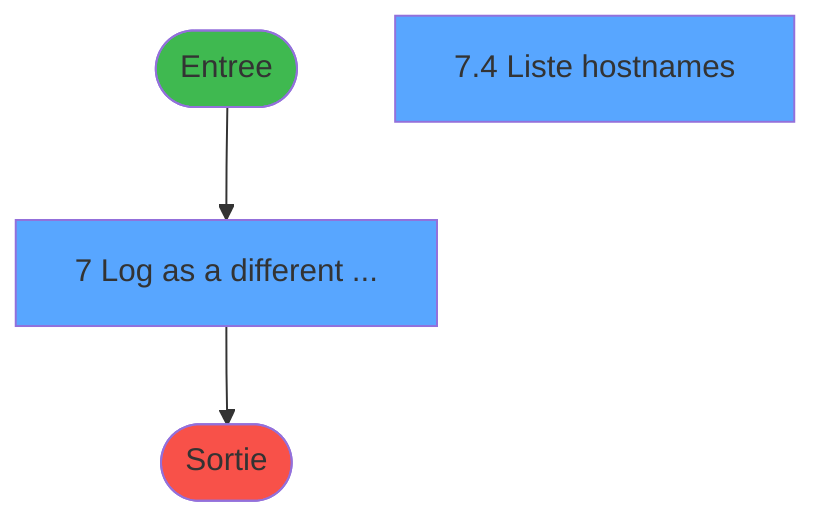
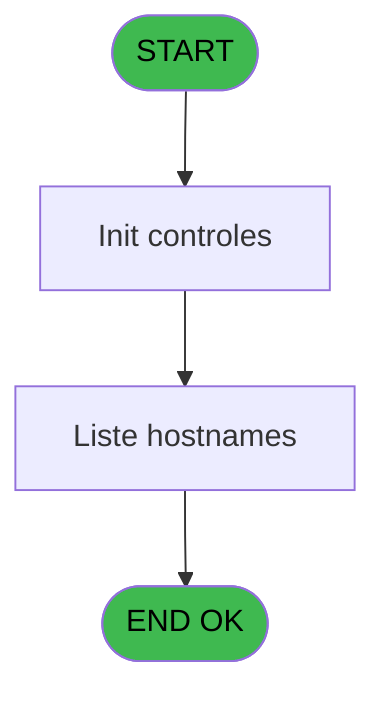
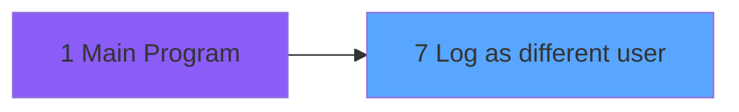
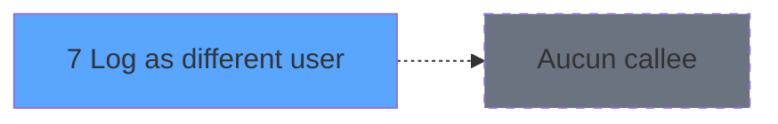

# Menu IDE 7 - Log as different user

> **Analyse**: Phases 1-4 2026-02-03 15:10 -> 15:10 (12s) | Assemblage 15:10
> **Pipeline**: V7.2 Enrichi
> **Structure**: 4 onglets (Resume | Ecrans | Donnees | Connexions)

<!-- TAB:Resume -->

## 1. FICHE D'IDENTITE

| Attribut | Valeur |
|----------|--------|
| Projet | Menu |
| IDE Position | 7 |
| Nom Programme | Log as different user |
| Fichier source | `Prg_7.xml` |
| Dossier IDE | Recup |
| Taches | 5 (2 ecrans visibles) |
| Tables modifiees | 0 |
| Programmes appeles | 0 |

## 2. DESCRIPTION FONCTIONNELLE

**Log as different user** assure la gestion complete de ce processus, accessible depuis [Main Program (IDE 1)](Menu-IDE-1.md).

Le flux de traitement s'organise en **2 blocs fonctionnels** :

- **Traitement** (4 taches) : traitements metier divers
- **Consultation** (1 tache) : ecrans de recherche, selection et consultation

**Logique metier** : 1 regles identifiees couvrant conditions metier.

Detail : phases du traitement

#### Phase 1 : Traitement (4 taches)

- **7** - Log as a different user **[[ECRAN]](#ecran-t1)**
- **7.1** - Recup groupes
- **7.2** - Recup Users
- **7.4** - Liste hostnames **[[ECRAN]](#ecran-t10)**

#### Phase 2 : Consultation (1 tache)

- **7.3** - Init affichage

## 3. BLOCS FONCTIONNELS

### 3.1 Traitement (4 taches)

Traitements internes.

---

#### 7 - Log as a different user [[ECRAN]](#ecran-t1)

**Role** : Traitement : Log as a different user.
**Ecran** : 494 x 128 DLU (Type6) | [Voir mockup](#ecran-t1)

3 sous-taches directes

| Tache | Nom | Bloc |
|-------|-----|------|
| [7.1](#t2) | Recup groupes | Traitement |
| [7.2](#t8) | Recup Users | Traitement |
| [7.4](#t10) | Liste hostnames **[[ECRAN]](#ecran-t10)** | Traitement |

---

#### 7.1 - Recup groupes

**Role** : Consultation/chargement : Recup groupes.
**Variables liees** : C (v.liste des groupes)

---

#### 7.2 - Recup Users

**Role** : Consultation/chargement : Recup Users.

---

#### 7.4 - Liste hostnames [[ECRAN]](#ecran-t10)

**Role** : Traitement : Liste hostnames.
**Ecran** : 472 x 237 DLU | [Voir mockup](#ecran-t10)
**Variables liees** : C (v.liste des groupes), D (v.liste des logins par groupe)

### 3.2 Consultation (1 tache)

Ecrans de recherche et consultation.

---

#### 7.3 - Init affichage

**Role** : Reinitialisation : Init affichage.

## 5. REGLES METIER

1 regles identifiees:

### Autres (1 regles)

#### [RM-001] Si VG42 alors 'v.Groupe [B]'FORM sinon 'v.Login [A]'FORM)

| Element | Detail |
|---------|--------|
| **Condition** | `VG42` |
| **Si vrai** | 'v.Groupe [B]'FORM |
| **Si faux** | 'v.Login [A]'FORM) |
| **Variables** | A (v.Login), B (v.Groupe) |
| **Expression source** | Expression 5 : `IF(VG42, 'v.Groupe [B]'FORM, 'v.Login [A]'FORM)` |
| **Exemple** | Si VG42 → 'v.Groupe [B]'FORM. Sinon → 'v.Login [A]'FORM) |

## 6. CONTEXTE

- **Appele par**: [Main Program (IDE 1)](Menu-IDE-1.md)
- **Appelle**: 0 programmes | **Tables**: 1 (W:0 R:1 L:0) | **Taches**: 5 | **Expressions**: 8

<!-- TAB:Ecrans -->

## 8. ECRANS

### 8.1 Forms visibles (2 / 5)

| # | Position | Tache | Nom | Type | Largeur | Hauteur | Bloc |
|---|----------|-------|-----|------|---------|---------|------|
| 1 | 7 | 7 | Log as a different user | Type6 | 494 | 128 | Traitement |
| 2 | 7.4 | 7.4 | Liste hostnames | Type0 | 472 | 237 | Traitement |

### 8.2 Mockups Ecrans

---

#### 7 - Log as a different user
**Tache** : [7](#t1) | **Type** : Type6 | **Dimensions** : 494 x 128 DLU
**Bloc** : Traitement | **Titre IDE** : Log as a different user

<!-- FORM-DATA:
{
    "width":  494,
    "vFactor":  8,
    "type":  "Type6",
    "hFactor":  4,
    "controls":  [
                     {
                         "x":  11,
                         "type":  "label",
                         "var":  "",
                         "y":  50,
                         "w":  124,
                         "fmt":  "",
                         "name":  "",
                         "h":  20,
                         "color":  "",
                         "text":  "User :",
                         "parent":  23
                     },
                     {
                         "x":  4,
                         "type":  "label",
                         "var":  "",
                         "y":  4,
                         "w":  486,
                         "fmt":  "",
                         "name":  "",
                         "h":  77,
                         "color":  "",
                         "text":  "",
                         "parent":  null
                     },
                     {
                         "x":  4,
                         "type":  "label",
                         "var":  "",
                         "y":  84,
                         "w":  486,
                         "fmt":  "",
                         "name":  "",
                         "h":  40,
                         "color":  "",
                         "text":  "",
                         "parent":  null
                     },
                     {
                         "x":  11,
                         "type":  "label",
                         "var":  "",
                         "y":  13,
                         "w":  124,
                         "fmt":  "",
                         "name":  "",
                         "h":  20,
                         "color":  "",
                         "text":  "Group :",
                         "parent":  23
                     },
                     {
                         "x":  198,
                         "type":  "combobox",
                         "var":  "",
                         "y":  50,
                         "w":  285,
                         "fmt":  "",
                         "name":  "v.Login",
                         "h":  12,
                         "color":  "",
                         "text":  "",
                         "parent":  23
                     },
                     {
                         "x":  11,
                         "type":  "button",
                         "var":  "",
                         "y":  90,
                         "w":  185,
                         "fmt":  "\u0026Ok",
                         "name":  "Bouton ok",
                         "h":  28,
                         "color":  "",
                         "text":  "",
                         "parent":  32
                     },
                     {
                         "x":  298,
                         "type":  "button",
                         "var":  "",
                         "y":  90,
                         "w":  185,
                         "fmt":  "\u0026Abandonner",
                         "name":  "Bt.Abandonner",
                         "h":  28,
                         "color":  "",
                         "text":  "",
                         "parent":  32
                     },
                     {
                         "x":  198,
                         "type":  "combobox",
                         "var":  "",
                         "y":  13,
                         "w":  285,
                         "fmt":  "",
                         "name":  "v.Groupe",
                         "h":  12,
                         "color":  "",
                         "text":  "",
                         "parent":  23
                     }
                 ],
    "taskId":  "7",
    "height":  128
}
-->

<strong>Champs : 2 champs</strong>

| Pos (x,y) | Nom | Variable | Type |
|-----------|-----|----------|------|
| 198,50 | v.Login | - | combobox |
| 198,13 | v.Groupe | - | combobox |

<strong>Boutons : 2 boutons</strong>

| Bouton | Pos (x,y) | Action |
|--------|-----------|--------|
| Ok | 11,90 | Valide la saisie et enregistre |
| Abandonner | 298,90 | Annule et retour au menu |

---

#### 7.4 - Liste hostnames
**Tache** : [7.4](#t10) | **Type** : Type0 | **Dimensions** : 472 x 237 DLU
**Bloc** : Traitement | **Titre IDE** : Liste hostnames

<!-- FORM-DATA:
{
    "width":  472,
    "vFactor":  8,
    "type":  "Type0",
    "hFactor":  4,
    "controls":  [
                     {
                         "x":  0,
                         "type":  "table",
                         "var":  "",
                         "name":  "",
                         "titleH":  12,
                         "color":  "1",
                         "w":  484,
                         "y":  0,
                         "fmt":  "",
                         "parent":  null,
                         "text":  "",
                         "rowH":  24,
                         "h":  232,
                         "cols":  [
                                      {
                                          "title":  "",
                                          "layer":  1,
                                          "w":  110
                                      },
                                      {
                                          "title":  "Libellé",
                                          "layer":  2,
                                          "w":  55
                                      },
                                      {
                                          "title":  "Détail",
                                          "layer":  3,
                                          "w":  245
                                      },
                                      {
                                          "title":  "",
                                          "layer":  4,
                                          "w":  35
                                      }
                                  ],
                         "rows":  4
                     },
                     {
                         "x":  4,
                         "type":  "button",
                         "var":  "",
                         "y":  15,
                         "w":  104,
                         "fmt":  "",
                         "name":  "hostname",
                         "h":  20,
                         "color":  "",
                         "text":  "",
                         "parent":  8
                     },
                     {
                         "x":  114,
                         "type":  "edit",
                         "var":  "",
                         "y":  20,
                         "w":  48,
                         "fmt":  "",
                         "name":  "libelle",
                         "h":  10,
                         "color":  "",
                         "text":  "",
                         "parent":  8
                     },
                     {
                         "x":  169,
                         "type":  "edit",
                         "var":  "",
                         "y":  20,
                         "w":  270,
                         "fmt":  "",
                         "name":  "detail",
                         "h":  10,
                         "color":  "",
                         "text":  "",
                         "parent":  8
                     },
                     {
                         "x":  422,
                         "type":  "checkbox",
                         "var":  "",
                         "y":  20,
                         "w":  16,
                         "fmt":  "",
                         "name":  "vSelectionne poste/rôle",
                         "h":  9,
                         "color":  "",
                         "text":  "",
                         "parent":  8
                     }
                 ],
    "taskId":  "7.4",
    "height":  237
}
-->

<strong>Champs : 3 champs</strong>

| Pos (x,y) | Nom | Variable | Type |
|-----------|-----|----------|------|
| 114,20 | libelle | - | edit |
| 169,20 | detail | - | edit |
| 422,20 | vSelectionne poste/rôle | - | checkbox |

<strong>Boutons : 1 boutons</strong>

| Bouton | Pos (x,y) | Action |
|--------|-----------|--------|
| hostname | 4,15 | Bouton fonctionnel |

## 9. NAVIGATION

### 9.1 Enchainement des ecrans

**Detail par enchainement :**

| Depuis | Action | Vers | Retour |
|--------|--------|------|--------|

### 9.3 Structure hierarchique (5 taches)

| Position | Tache | Type | Dimensions | Bloc |
|----------|-------|------|------------|------|
| **7.1** | [**Log as a different user** (7)](#t1) [mockup](#ecran-t1) | Type6 | 494x128 | Traitement |
| 7.1.1 | [Recup groupes (7.1)](#t2) | - | - | |
| 7.1.2 | [Recup Users (7.2)](#t8) | - | - | |
| 7.1.3 | [Liste hostnames (7.4)](#t10) [mockup](#ecran-t10) | - | 472x237 | |
| **7.2** | [**Init affichage** (7.3)](#t9) | - | - | Consultation |

### 9.4 Algorigramme

> **Legende**: Vert = START/END OK | Rouge = END KO | Bleu = Decisions
> *Algorigramme auto-genere. Utiliser `/algorigramme` pour une synthese metier detaillee.*

<!-- TAB:Donnees -->

## 10. TABLES

### Tables utilisees (1)

| ID | Nom | Description | Type | R | W | L | Usages |
|----|-----|-------------|------|---|---|---|--------|
| 740 | pv_stock_movements | Articles et stock | DB | R |   |   | 1 |

### Colonnes par table (0 / 1 tables avec colonnes identifiees)

Table 740 - pv_stock_movements (R) - 1 usages

*Table utilisee uniquement en Link ou aucune colonne Real identifiee dans le DataView.*

## 11. VARIABLES

### 11.1 Variables de session (5)

Variables persistantes pendant toute la session.

| Lettre | Nom | Type | Usage dans |
|--------|-----|------|-----------|
| A | v.Login | Unicode | 1x session |
| B | v.Groupe | Unicode | 1x session |
| C | v.liste des groupes | Unicode | - |
| D | v.liste des logins par groupe | Unicode | - |
| E | v.Hostname choisi | Unicode | - |

### 11.2 Autres (2)

Variables diverses.

| Lettre | Nom | Type | Usage dans |
|--------|-----|------|-----------|
| F | CHG_REASON_v.Groupe | Numeric | - |
| G | CHG_PRV_v.Groupe | Unicode | - |

## 12. EXPRESSIONS

**8 / 8 expressions decodees (100%)**

### 12.1 Repartition par type

| Type | Expressions | Regles |
|------|-------------|--------|
| CONDITION | 2 | 5 |
| OTHER | 2 | 0 |
| REFERENCE_VG | 2 | 0 |
| STRING | 2 | 0 |

### 12.2 Expressions cles par type

#### CONDITION (2 expressions)

| Type | IDE | Expression | Regle |
|------|-----|------------|-------|
| CONDITION | 5 | `IF(VG42, 'v.Groupe [B]'FORM, 'v.Login [A]'FORM)` | [RM-001](#rm-RM-001) |
| CONDITION | 4 | `Trim([BH])<>''` | - |

#### OTHER (2 expressions)

| Type | IDE | Expression | Regle |
|------|-----|------------|-------|
| OTHER | 7 | `[BM]` | - |
| OTHER | 1 | `[BE]` | - |

#### REFERENCE_VG (2 expressions)

| Type | IDE | Expression | Regle |
|------|-----|------------|-------|
| REFERENCE_VG | 8 | `VG7` | - |
| REFERENCE_VG | 6 | `VG39` | - |

#### STRING (2 expressions)

| Type | IDE | Expression | Regle |
|------|-----|------------|-------|
| STRING | 3 | `Trim([BG])` | - |
| STRING | 2 | `Trim([BF])` | - |

<!-- TAB:Connexions -->

## 13. GRAPHE D'APPELS

### 13.1 Chaine depuis Main (Callers)

Main -> ... -> [Main Program (IDE 1)](Menu-IDE-1.md) -> **Log as different user (IDE 7)**

### 13.2 Callers

| IDE | Nom Programme | Nb Appels |
|-----|---------------|-----------|
| [1](Menu-IDE-1.md) | Main Program | 1 |

### 13.3 Callees (programmes appeles)

### 13.4 Detail Callees avec contexte

| IDE | Nom Programme | Appels | Contexte |
|-----|---------------|--------|----------|
| - | (aucun) | - | - |

## 14. RECOMMANDATIONS MIGRATION

### 14.1 Profil du programme

| Metrique | Valeur | Impact migration |
|----------|--------|-----------------|
| Lignes de logique | 64 | Programme compact |
| Expressions | 8 | Peu de logique |
| Tables WRITE | 0 | Impact faible |
| Sous-programmes | 0 | Peu de dependances |
| Ecrans visibles | 2 | Quelques ecrans |
| Code desactive | 1.6% (1 / 64) | Code sain |
| Regles metier | 1 | Quelques regles a preserver |

### 14.2 Plan de migration par bloc

#### Traitement (4 taches: 2 ecrans, 2 traitements)

- **Strategie** : Orchestrateur avec 2 ecrans (Razor/React) et 2 traitements backend (services).
- Les ecrans deviennent des composants UI, les traitements invisibles deviennent des services injectables.
- Decomposer les taches en services unitaires testables.

#### Consultation (1 tache: 0 ecran, 1 traitement)

- **Strategie** : Composants de recherche/selection en modales.

### 14.3 Dependances critiques

| Dependance | Type | Appels | Impact |
|------------|------|--------|--------|

---
*Spec DETAILED generee par Pipeline V7.2 - 2026-02-03 15:10*
