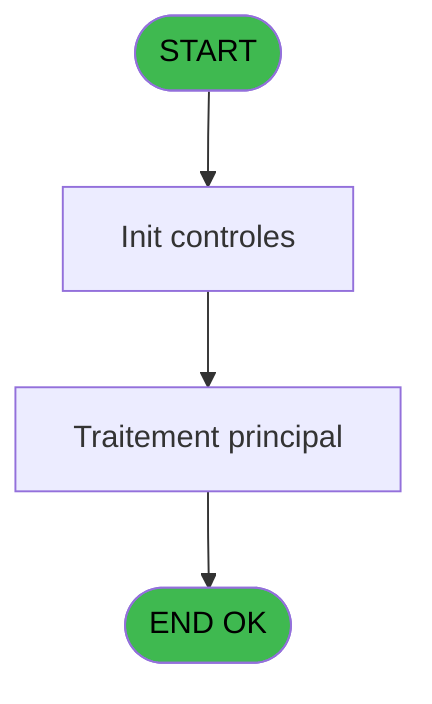
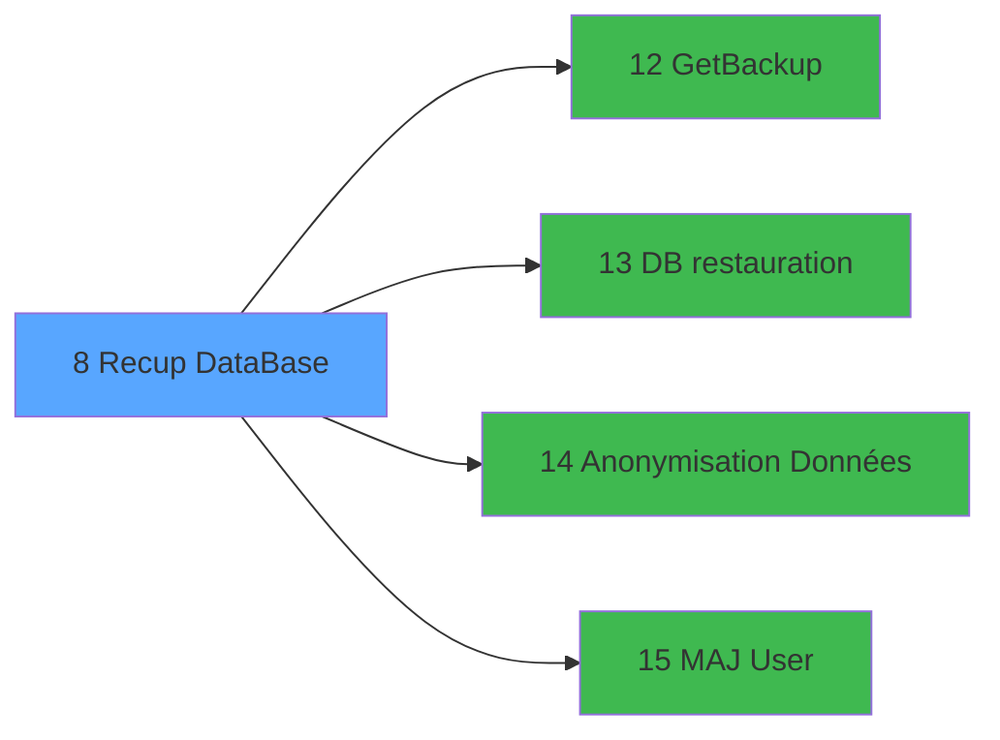

# Menu IDE 8 - Recup DataBase

> **Analyse**: Phases 1-4 2026-02-03 15:10 -> 15:10 (12s) | Assemblage 15:10
> **Pipeline**: V7.2 Enrichi
> **Structure**: 4 onglets (Resume | Ecrans | Donnees | Connexions)

<!-- TAB:Resume -->

## 1. FICHE D'IDENTITE

| Attribut | Valeur |
|----------|--------|
| Projet | Menu |
| IDE Position | 8 |
| Nom Programme | Recup DataBase |
| Fichier source | `Prg_8.xml` |
| Dossier IDE | Recup |
| Taches | 1 (1 ecrans visibles) |
| Tables modifiees | 0 |
| Programmes appeles | 4 |

## 2. DESCRIPTION FONCTIONNELLE

**Recup DataBase** assure la gestion complete de ce processus, accessible depuis [Main Program (IDE 1)](Menu-IDE-1.md).

Le flux de traitement s'organise en **1 blocs fonctionnels** :

- **Traitement** (1 tache) : traitements metier divers

**Logique metier** : 2 regles identifiees couvrant conditions metier.

## 3. BLOCS FONCTIONNELS

### 3.1 Traitement (1 tache)

Traitements internes.

---

#### 8 - Backup Recovery [[ECRAN]](#ecran-t1)

**Role** : Traitement : Backup Recovery.
**Ecran** : 466 x 162 DLU | [Voir mockup](#ecran-t1)
**Variables liees** : E (V.RepertoireDataBackup)
**Delegue a** : [GetBackup (IDE 12)](Menu-IDE-12.md), [DB restauration (IDE 13)](Menu-IDE-13.md), [Anonymisation Données (IDE 14)](Menu-IDE-14.md)

## 5. REGLES METIER

2 regles identifiees:

### Autres (2 regles)

#### [RM-001] Si V.ARCHDataBaseName [S] = 1 alors 'localhost' sinon Trim(v RepertoireBatchResta... [T]))

| Element | Detail |
|---------|--------|
| **Condition** | `V.ARCHDataBaseName [S] = 1` |
| **Si vrai** | 'localhost' |
| **Si faux** | Trim(v RepertoireBatchResta... [T])) |
| **Variables** | S (V.ARCHDataBaseName) |
| **Expression source** | Expression 19 : `IF(V.ARCHDataBaseName [S] = 1, 'localhost',Trim(v Repertoire` |
| **Exemple** | Si V.ARCHDataBaseName [S] = 1 → 'localhost'. Sinon → Trim(v RepertoireBatchResta... [T])) |

#### [RM-002] Si [AA] = 1 alors V.HostName [P] sinon V.SQLServerName [Q])

| Element | Detail |
|---------|--------|
| **Condition** | `[AA] = 1` |
| **Si vrai** | V.HostName [P] |
| **Si faux** | V.SQLServerName [Q]) |
| **Variables** | P (V.HostName), Q (V.SQLServerName) |
| **Expression source** | Expression 22 : `IF([AA] = 1,V.HostName [P],V.SQLServerName [Q])` |
| **Exemple** | Si [AA] = 1 → V.HostName [P]. Sinon → V.SQLServerName [Q]) |

## 6. CONTEXTE

- **Appele par**: [Main Program (IDE 1)](Menu-IDE-1.md)
- **Appelle**: 4 programmes | **Tables**: 1 (W:0 R:1 L:0) | **Taches**: 1 | **Expressions**: 58

<!-- TAB:Ecrans -->

## 8. ECRANS

### 8.1 Forms visibles (1 / 1)

| # | Position | Tache | Nom | Type | Largeur | Hauteur | Bloc |
|---|----------|-------|-----|------|---------|---------|------|
| 1 | 8 | 8 | Backup Recovery | Type0 | 466 | 162 | Traitement |

### 8.2 Mockups Ecrans

---

#### 8 - Backup Recovery
**Tache** : [8](#t1) | **Type** : Type0 | **Dimensions** : 466 x 162 DLU
**Bloc** : Traitement | **Titre IDE** : Backup Recovery

<!-- FORM-DATA:
{
    "width":  466,
    "vFactor":  8,
    "type":  "Type0",
    "hFactor":  4,
    "controls":  [
                     {
                         "x":  5,
                         "type":  "label",
                         "var":  "",
                         "y":  5,
                         "w":  454,
                         "fmt":  "",
                         "name":  "",
                         "h":  129,
                         "color":  "42",
                         "text":  "",
                         "parent":  null
                     },
                     {
                         "x":  46,
                         "type":  "label",
                         "var":  "",
                         "y":  19,
                         "w":  121,
                         "fmt":  "",
                         "name":  "",
                         "h":  10,
                         "color":  "",
                         "text":  "Village",
                         "parent":  1
                     },
                     {
                         "x":  46,
                         "type":  "label",
                         "var":  "",
                         "y":  39,
                         "w":  121,
                         "fmt":  "",
                         "name":  "",
                         "h":  10,
                         "color":  "",
                         "text":  "Backup Date",
                         "parent":  1
                     },
                     {
                         "x":  176,
                         "type":  "label",
                         "var":  "",
                         "y":  62,
                         "w":  115,
                         "fmt":  "",
                         "name":  "",
                         "h":  61,
                         "color":  "",
                         "text":  "",
                         "parent":  1
                     },
                     {
                         "x":  46,
                         "type":  "label",
                         "var":  "",
                         "y":  64,
                         "w":  121,
                         "fmt":  "",
                         "name":  "",
                         "h":  10,
                         "color":  "",
                         "text":  "Backup Choice",
                         "parent":  1
                     },
                     {
                         "x":  201,
                         "type":  "label",
                         "var":  "",
                         "y":  103,
                         "w":  81,
                         "fmt":  "",
                         "name":  "",
                         "h":  12,
                         "color":  "1",
                         "text":  "Archive Database",
                         "parent":  5
                     },
                     {
                         "x":  175,
                         "type":  "combobox",
                         "var":  "",
                         "y":  20,
                         "w":  176,
                         "fmt":  "",
                         "name":  "P Serveur",
                         "h":  12,
                         "color":  "",
                         "text":  "",
                         "parent":  1
                     },
                     {
                         "x":  175,
                         "type":  "button",
                         "var":  "",
                         "y":  38,
                         "w":  21,
                         "fmt":  "...",
                         "name":  "b Zoom Date",
                         "h":  15,
                         "color":  "",
                         "text":  "",
                         "parent":  1
                     },
                     {
                         "x":  199,
                         "type":  "edit",
                         "var":  "",
                         "y":  39,
                         "w":  61,
                         "fmt":  "",
                         "name":  "v date de la sauvegarde",
                         "h":  13,
                         "color":  "",
                         "text":  "",
                         "parent":  1
                     },
                     {
                         "x":  185,
                         "type":  "radio",
                         "var":  "",
                         "y":  64,
                         "w":  70,
                         "fmt":  "",
                         "name":  "V.Avant/AprèsCloture ?",
                         "h":  33,
                         "color":  "42",
                         "text":  "1,2",
                         "parent":  5
                     },
                     {
                         "x":  186,
                         "type":  "checkbox",
                         "var":  "",
                         "y":  103,
                         "w":  14,
                         "fmt":  "",
                         "name":  "v Archivage",
                         "h":  12,
                         "color":  "42",
                         "text":  "",
                         "parent":  5
                     },
                     {
                         "x":  125,
                         "type":  "button",
                         "var":  "",
                         "y":  142,
                         "w":  93,
                         "fmt":  "Exit",
                         "name":  "",
                         "h":  14,
                         "color":  "",
                         "text":  "",
                         "parent":  null
                     },
                     {
                         "x":  221,
                         "type":  "button",
                         "var":  "",
                         "y":  142,
                         "w":  117,
                         "fmt":  "\u0026Restore Only",
                         "name":  "B Restore",
                         "h":  14,
                         "color":  "",
                         "text":  "",
                         "parent":  null
                     },
                     {
                         "x":  342,
                         "type":  "button",
                         "var":  "",
                         "y":  142,
                         "w":  117,
                         "fmt":  "\u0026Get Backup \u0026\u0026 Restore",
                         "name":  "B Execution",
                         "h":  14,
                         "color":  "",
                         "text":  "",
                         "parent":  null
                     }
                 ],
    "taskId":  "8",
    "height":  162
}
-->

<strong>Champs : 3 champs</strong>

| Pos (x,y) | Nom | Variable | Type |
|-----------|-----|----------|------|
| 175,20 | P Serveur | - | combobox |
| 199,39 | v date de la sauvegarde | - | edit |
| 186,103 | v Archivage | - | checkbox |

<strong>Boutons : 4 boutons</strong>

| Bouton | Pos (x,y) | Action |
|--------|-----------|--------|
| ... | 175,38 | Bouton fonctionnel |
| Exit | 125,142 | Quitte le programme |
| Restore Only | 221,142 | Bouton fonctionnel |
| Get Backup  Restore | 342,142 | Bouton fonctionnel |

## 9. NAVIGATION

Ecran unique: **Backup Recovery**

### 9.3 Structure hierarchique (1 tache)

| Position | Tache | Type | Dimensions | Bloc |
|----------|-------|------|------------|------|
| **8.1** | [**Backup Recovery** (8)](#t1) [mockup](#ecran-t1) | - | 466x162 | Traitement |

### 9.4 Algorigramme

> **Legende**: Vert = START/END OK | Rouge = END KO | Bleu = Decisions
> *Algorigramme auto-genere. Utiliser `/algorigramme` pour une synthese metier detaillee.*

<!-- TAB:Donnees -->

## 10. TABLES

### Tables utilisees (1)

| ID | Nom | Description | Type | R | W | L | Usages |
|----|-----|-------------|------|---|---|---|--------|
| 2 | parametre_workgroup |  | DB | R |   |   | 1 |

### Colonnes par table (0 / 1 tables avec colonnes identifiees)

Table 2 - parametre_workgroup (R) - 1 usages

*Table utilisee uniquement en Link ou aucune colonne Real identifiee dans le DataView.*

## 11. VARIABLES

### 11.1 Variables de session (34)

Variables persistantes pendant toute la session.

| Lettre | Nom | Type | Usage dans |
|--------|-----|------|-----------|
| A | V Serveur | Alpha | 2x session |
| B | V.LocalOrNetwork | Numeric | - |
| C | v date de la sauvegarde | Date | - |
| E | V.RepertoireDataBackup | Alpha | - |
| F | V.RepertoireDataRestore | Alpha | 5x session |
| H | v Repetoire Getfilecmd | Alpha | - |
| I | v Repertoire Robocopy | Alpha | - |
| J | v Repertoire Source Serveur | Alpha | - |
| K | v Nom Pms avant clôture | Alpha | - |
| L | v Nom Pms apres clôture | Alpha | - |
| M | v Nom Archivage | Alpha | - |
| N | v Nom PMS | Alpha | - |
| O | V.LocalOrNetwork | Numeric | - |
| P | V.HostName | Alpha | 1x session |
| Q | V.SQLServerName | Alpha | 1x session |
| R | V.PMSDataBaseName | Alpha | - |
| S | V.ARCHDataBaseName | Alpha | 1x session |
| T | v RepertoireBatchRestauration | Alpha | - |
| U | v RestaurationPmsBatch | Alpha | - |
| V | v.DezipBatchFileName | Alpha | - |
| W | V.Avant/AprèsCloture ? | Numeric | - |
| X | V.BaseArchivage? | Logical | - |
| Y | V.Restore PMS | Logical | - |
| Z | V.RepertoireMDF | Alpha | - |
| BA | V.RepertoireLDF | Alpha | - |
| BB | V.LocalHostname | Unicode | - |
| BC | V.CréerTacheCloture | Logical | 2x session |
| BD | V.CréerTacheEnvoieMail | Logical | 1x session |
| BF | V.ScriptCreationTableLogs | Alpha | 2x session |
| BG | V.File List | Blob | 3x session |
| BH | V.Vec Size | Numeric | - |
| BI | V.MessageErreurs | Unicode | - |
| BL | v.index | Numeric | - |
| BM | v.vector cell | Unicode | - |

### 11.2 Autres (5)

Variables diverses.

| Lettre | Nom | Type | Usage dans |
|--------|-----|------|-----------|
| D | b Zoom Date | Alpha | - |
| G | B Execution | Alpha | - |
| BE | LigneDatabase.Ini | Unicode | 3x refs |
| BJ | CHG_REASON_V.MessageErreurs | Numeric | - |
| BK | CHG_PRV_V.MessageErreurs | Unicode | - |

Toutes les 39 variables (liste complete)

| Cat | Lettre | Nom Variable | Type |
|-----|--------|--------------|------|
| V. | **A** | V Serveur | Alpha |
| V. | **B** | V.LocalOrNetwork | Numeric |
| V. | **C** | v date de la sauvegarde | Date |
| V. | **E** | V.RepertoireDataBackup | Alpha |
| V. | **F** | V.RepertoireDataRestore | Alpha |
| V. | **H** | v Repetoire Getfilecmd | Alpha |
| V. | **I** | v Repertoire Robocopy | Alpha |
| V. | **J** | v Repertoire Source Serveur | Alpha |
| V. | **K** | v Nom Pms avant clôture | Alpha |
| V. | **L** | v Nom Pms apres clôture | Alpha |
| V. | **M** | v Nom Archivage | Alpha |
| V. | **N** | v Nom PMS | Alpha |
| V. | **O** | V.LocalOrNetwork | Numeric |
| V. | **P** | V.HostName | Alpha |
| V. | **Q** | V.SQLServerName | Alpha |
| V. | **R** | V.PMSDataBaseName | Alpha |
| V. | **S** | V.ARCHDataBaseName | Alpha |
| V. | **T** | v RepertoireBatchRestauration | Alpha |
| V. | **U** | v RestaurationPmsBatch | Alpha |
| V. | **V** | v.DezipBatchFileName | Alpha |
| V. | **W** | V.Avant/AprèsCloture ? | Numeric |
| V. | **X** | V.BaseArchivage? | Logical |
| V. | **Y** | V.Restore PMS | Logical |
| V. | **Z** | V.RepertoireMDF | Alpha |
| V. | **BA** | V.RepertoireLDF | Alpha |
| V. | **BB** | V.LocalHostname | Unicode |
| V. | **BC** | V.CréerTacheCloture | Logical |
| V. | **BD** | V.CréerTacheEnvoieMail | Logical |
| V. | **BF** | V.ScriptCreationTableLogs | Alpha |
| V. | **BG** | V.File List | Blob |
| V. | **BH** | V.Vec Size | Numeric |
| V. | **BI** | V.MessageErreurs | Unicode |
| V. | **BL** | v.index | Numeric |
| V. | **BM** | v.vector cell | Unicode |
| Autre | **D** | b Zoom Date | Alpha |
| Autre | **G** | B Execution | Alpha |
| Autre | **BE** | LigneDatabase.Ini | Unicode |
| Autre | **BJ** | CHG_REASON_V.MessageErreurs | Numeric |
| Autre | **BK** | CHG_PRV_V.MessageErreurs | Unicode |

## 12. EXPRESSIONS

**58 / 58 expressions decodees (100%)**

### 12.1 Repartition par type

| Type | Expressions | Regles |
|------|-------------|--------|
| CONDITION | 12 | 2 |
| FORMAT | 3 | 0 |
| CALCUL | 3 | 0 |
| CAST_LOGIQUE | 4 | 0 |
| CALCULATION | 1 | 0 |
| CONSTANTE | 14 | 0 |
| DATE | 1 | 0 |
| OTHER | 17 | 0 |
| STRING | 3 | 0 |

### 12.2 Expressions cles par type

#### CONDITION (12 expressions)

| Type | IDE | Expression | Regle |
|------|-----|------------|-------|
| CONDITION | 22 | `IF([AA] = 1,V.HostName [P],V.SQLServerName [Q])` | [RM-002](#rm-RM-002) |
| CONDITION | 19 | `IF(V.ARCHDataBaseName [S] = 1, 'localhost',Trim(v RepertoireBatchResta... [T]))` | [RM-001](#rm-RM-001) |
| CONDITION | 54 | `Lower(Left(V.File List [BG],7))='pmsarch'` | - |
| CONDITION | 52 | `Lower(Left(V.File List [BG],7))='pmsdata'` | - |
| CONDITION | 12 | `Trim(V Serveur [A]) = ''` | - |
| ... | | *+7 autres* | |

#### FORMAT (3 expressions)

| Type | IDE | Expression | Regle |
|------|-----|------------|-------|
| FORMAT | 10 | `'pmsdata-'&Trim(Str(Day(V.RepertoireDataRestore [F]),'2P0'))&'.tar.gz'` | - |
| FORMAT | 9 | `'pmsdata-'&Trim(Str(Day(V.RepertoireDataRestore [F]),'2P0'))&'-2.tar.gz'` | - |
| FORMAT | 8 | `' pmsarchivagedata-'&Trim(Str(Day(V.RepertoireDataRestore [F]),'2P0'))&'.tar.gz'` | - |

#### CALCUL (3 expressions)

| Type | IDE | Expression | Regle |
|------|-----|------------|-------|
| CALCUL | 44 | `'forfiles /P ' & Trim(v Repertoire Source Se... [J]) & ' /S /M *.tar.gz /C "cmd /c del /Q @path"'` | - |
| CALCUL | 43 | `'forfiles /P ' & Trim(v Repertoire Source Se... [J]) & ' /S /M *.tar /C "cmd /c del /Q @path"'` | - |
| CALCUL | 42 | `'forfiles /P ' & Trim(v Repertoire Source Se... [J]) & ' /S /M *.bak /C "cmd /c del /Q @path"'` | - |

#### CAST_LOGIQUE (4 expressions)

| Type | IDE | Expression | Regle |
|------|-----|------------|-------|
| CAST_LOGIQUE | 50 | `'FALSE'LOG` | - |
| CAST_LOGIQUE | 58 | `'TRUE'LOG` | - |
| CAST_LOGIQUE | 45 | `FileListGet(Trim(v Repertoire Source Se... [J]),'*.tar.gz','FALSE'LOG)` | - |
| CAST_LOGIQUE | 27 | `'TRUE'LOG` | - |

#### CALCULATION (1 expressions)

| Type | IDE | Expression | Regle |
|------|-----|------------|-------|
| CALCULATION | 57 | `LigneDatabase.Ini [BE]+1` | - |

#### CONSTANTE (14 expressions)

| Type | IDE | Expression | Regle |
|------|-----|------------|-------|
| CONSTANTE | 37 | `'Recupération de la sauvegarde PMS ...'` | - |
| CONSTANTE | 26 | `2` | - |
| CONSTANTE | 21 | `'PMSARCHIVAGE'` | - |
| CONSTANTE | 38 | `'Recupération de la sauvegarde PMS Archivage ...'` | - |
| CONSTANTE | 47 | `1` | - |
| ... | | *+9 autres* | |

#### DATE (1 expressions)

| Type | IDE | Expression | Regle |
|------|-----|------------|-------|
| DATE | 11 | `Date()` | - |

#### OTHER (17 expressions)

| Type | IDE | Expression | Regle |
|------|-----|------------|-------|
| OTHER | 46 | `VecSize(V.CréerTacheCloture [BC])` | - |
| OTHER | 49 | `V.ScriptCreationTableLogs [BF]` | - |
| OTHER | 32 | `SetCrsr(2)` | - |
| OTHER | 33 | `SetCrsr(1)` | - |
| OTHER | 55 | `[AB] OR V.ScriptCreationTableLogs [BF]` | - |
| ... | | *+12 autres* | |

#### STRING (3 expressions)

| Type | IDE | Expression | Regle |
|------|-----|------------|-------|
| STRING | 41 | `FileDelete(Trim(v Repertoire Source Se... [J]) & 'Restore.rs')` | - |
| STRING | 34 | `Trim([AR])` | - |
| STRING | 4 | `Trim(V Serveur [A])` | - |

### 12.3 Toutes les expressions (58)

Voir les 58 expressions

#### CONDITION (12)

| IDE | Expression Decodee |
|-----|-------------------|
| 3 | `V.RepertoireDataRestore [F]='00/00/0000'DATE` |
| 19 | `IF(V.ARCHDataBaseName [S] = 1, 'localhost',Trim(v RepertoireBatchResta... [T]))` |
| 22 | `IF([AA] = 1,V.HostName [P],V.SQLServerName [Q])` |
| 13 | `V.RepertoireDataRestore [F]>Date()` |
| 23 | `[AA] = 1` |
| 24 | `[AA] = 2` |
| 48 | `LigneDatabase.Ini [BE]<=V.CréerTacheEnvoieMail [BD]` |
| 52 | `Lower(Left(V.File List [BG],7))='pmsdata'` |
| 54 | `Lower(Left(V.File List [BG],7))='pmsarch'` |
| 12 | `Trim(V Serveur [A]) = ''` |
| 35 | `Trim([AR]) <> ''` |
| 36 | `Trim([AR]) <> ''` |

#### FORMAT (3)

| IDE | Expression Decodee |
|-----|-------------------|
| 8 | `' pmsarchivagedata-'&Trim(Str(Day(V.RepertoireDataRestore [F]),'2P0'))&'.tar.gz'` |
| 9 | `'pmsdata-'&Trim(Str(Day(V.RepertoireDataRestore [F]),'2P0'))&'-2.tar.gz'` |
| 10 | `'pmsdata-'&Trim(Str(Day(V.RepertoireDataRestore [F]),'2P0'))&'.tar.gz'` |

#### CALCUL (3)

| IDE | Expression Decodee |
|-----|-------------------|
| 42 | `'forfiles /P ' & Trim(v Repertoire Source Se... [J]) & ' /S /M *.bak /C "cmd /c del /Q @path"'` |
| 43 | `'forfiles /P ' & Trim(v Repertoire Source Se... [J]) & ' /S /M *.tar /C "cmd /c del /Q @path"'` |
| 44 | `'forfiles /P ' & Trim(v Repertoire Source Se... [J]) & ' /S /M *.tar.gz /C "cmd /c del /Q @path"'` |

#### CAST_LOGIQUE (4)

| IDE | Expression Decodee |
|-----|-------------------|
| 45 | `FileListGet(Trim(v Repertoire Source Se... [J]),'*.tar.gz','FALSE'LOG)` |
| 27 | `'TRUE'LOG` |
| 50 | `'FALSE'LOG` |
| 58 | `'TRUE'LOG` |

#### CALCULATION (1)

| IDE | Expression Decodee |
|-----|-------------------|
| 57 | `LigneDatabase.Ini [BE]+1` |

#### CONSTANTE (14)

| IDE | Expression Decodee |
|-----|-------------------|
| 7 | `'\data-01\backup\'` |
| 14 | `'c:\Temp\Backup\'` |
| 15 | `'c:\Temp\Backup\'` |
| 16 | `'DataBaseRestore.bat'` |
| 17 | `'FileDezip.bat'` |
| 18 | `1` |
| 20 | `'PMS'` |
| 21 | `'PMSARCHIVAGE'` |
| 26 | `2` |
| 37 | `'Recupération de la sauvegarde PMS ...'` |
| 38 | `'Recupération de la sauvegarde PMS Archivage ...'` |
| 39 | `'Restauration de la base PMS ...'` |
| 40 | `'Restauration de la base PMS Archivage ...'` |
| 47 | `1` |

#### DATE (1)

| IDE | Expression Decodee |
|-----|-------------------|
| 11 | `Date()` |

#### OTHER (17)

| IDE | Expression Decodee |
|-----|-------------------|
| 1 | `DbDiscnt('Pms')` |
| 2 | `DbDiscnt('PMSArchivage')` |
| 5 | `INIGet ('[MAGIC_LOGICAL_NAMES]club_exe')` |
| 6 | `INIGet ('[MAGIC_LOGICAL_NAMES]club_command')` |
| 25 | `[AB]` |
| 28 | `[AB]` |
| 29 | `INIGet ('[MAGIC_LOGICAL_NAMES]SqlDATA') & 'Data'` |
| 30 | `INIGet ('[MAGIC_LOGICAL_NAMES]SqlDATA') & 'Log'` |
| 31 | `INIGet ('[MAGIC_LOGICAL_NAMES]super_command') & 'create_prepa_recette_log.sql'` |
| 32 | `SetCrsr(2)` |
| 33 | `SetCrsr(1)` |
| 46 | `VecSize(V.CréerTacheCloture [BC])` |
| 49 | `V.ScriptCreationTableLogs [BF]` |
| 51 | `VecGet(V.CréerTacheCloture [BC],LigneDatabase.Ini [BE])` |
| 53 | `V.File List [BG]` |
| 55 | `[AB] OR V.ScriptCreationTableLogs [BF]` |
| 56 | `NOT(ExpCalc('89'EXP))` |

#### STRING (3)

| IDE | Expression Decodee |
|-----|-------------------|
| 4 | `Trim(V Serveur [A])` |
| 34 | `Trim([AR])` |
| 41 | `FileDelete(Trim(v Repertoire Source Se... [J]) & 'Restore.rs')` |

<!-- TAB:Connexions -->

## 13. GRAPHE D'APPELS

### 13.1 Chaine depuis Main (Callers)

Main -> ... -> [Main Program (IDE 1)](Menu-IDE-1.md) -> **Recup DataBase (IDE 8)**

### 13.2 Callers

| IDE | Nom Programme | Nb Appels |
|-----|---------------|-----------|
| [1](Menu-IDE-1.md) | Main Program | 1 |

### 13.3 Callees (programmes appeles)

### 13.4 Detail Callees avec contexte

| IDE | Nom Programme | Appels | Contexte |
|-----|---------------|--------|----------|
| [12](Menu-IDE-12.md) | GetBackup | 3 | Recuperation donnees |
| [13](Menu-IDE-13.md) | DB restauration | 2 | Sous-programme |
| [14](Menu-IDE-14.md) | Anonymisation Données | 1 | Sous-programme |
| [15](Menu-IDE-15.md) | MAJ User | 1 | Mise a jour donnees |

## 14. RECOMMANDATIONS MIGRATION

### 14.1 Profil du programme

| Metrique | Valeur | Impact migration |
|----------|--------|-----------------|
| Lignes de logique | 152 | Programme compact |
| Expressions | 58 | Logique moderee |
| Tables WRITE | 0 | Impact faible |
| Sous-programmes | 4 | Peu de dependances |
| Ecrans visibles | 1 | Ecran unique ou traitement batch |
| Code desactive | 0% (0 / 152) | Code sain |
| Regles metier | 2 | Quelques regles a preserver |

### 14.2 Plan de migration par bloc

#### Traitement (1 tache: 1 ecran, 0 traitement)

- **Strategie** : 1 composant(s) UI (Razor/React) avec formulaires et validation.
- 4 sous-programme(s) a migrer ou a reutiliser depuis les services existants.
- Decomposer les taches en services unitaires testables.

### 14.3 Dependances critiques

| Dependance | Type | Appels | Impact |
|------------|------|--------|--------|
| [GetBackup (IDE 12)](Menu-IDE-12.md) | Sous-programme | 3x | **CRITIQUE** - Recuperation donnees |
| [DB restauration (IDE 13)](Menu-IDE-13.md) | Sous-programme | 2x | Haute - Sous-programme |
| [MAJ User (IDE 15)](Menu-IDE-15.md) | Sous-programme | 1x | Normale - Mise a jour donnees |
| [Anonymisation Données (IDE 14)](Menu-IDE-14.md) | Sous-programme | 1x | Normale - Sous-programme |

---
*Spec DETAILED generee par Pipeline V7.2 - 2026-02-03 15:10*
