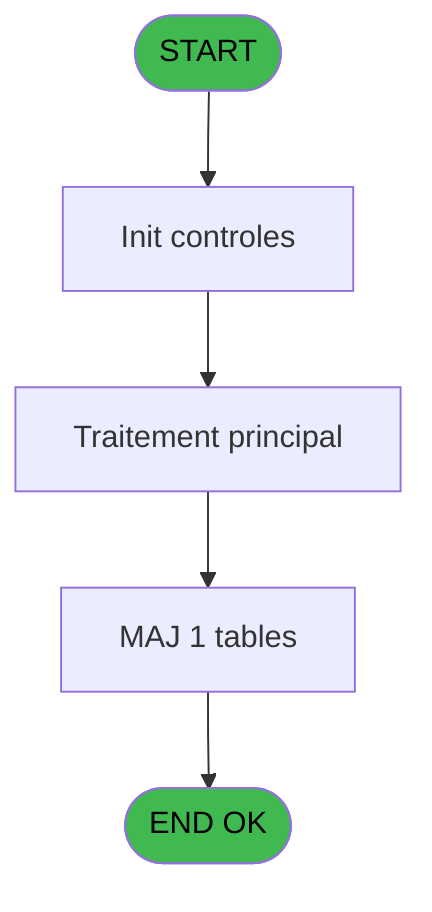
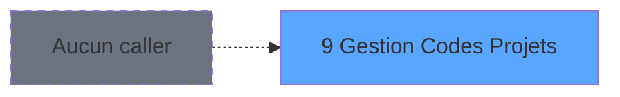
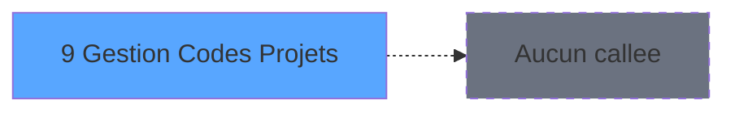

# Menu IDE 9 - Gestion Codes Projets

> **Analyse**: Phases 1-4 2026-02-03 15:11 -> 15:11 (16s) | Assemblage 15:11
> **Pipeline**: V7.2 Enrichi
> **Structure**: 4 onglets (Resume | Ecrans | Donnees | Connexions)

<!-- TAB:Resume -->

## 1. FICHE D'IDENTITE

| Attribut | Valeur |
|----------|--------|
| Projet | Menu |
| IDE Position | 9 |
| Nom Programme | Gestion Codes Projets |
| Fichier source | `Prg_9.xml` |
| Dossier IDE | Recup |
| Taches | 1 (1 ecrans visibles) |
| Tables modifiees | 1 |
| Programmes appeles | 0 |
| :warning: Statut | **ORPHELIN_POTENTIEL** |

## 2. DESCRIPTION FONCTIONNELLE

**Gestion Codes Projets** assure la gestion complete de ce processus.

Le flux de traitement s'organise en **1 blocs fonctionnels** :

- **Traitement** (1 tache) : traitements metier divers

**Donnees modifiees** : 1 tables en ecriture (motif_no_enreg_na).

## 3. BLOCS FONCTIONNELS

### 3.1 Traitement (1 tache)

Traitements internes.

---

#### 9 - Gestion Codes Projets [[ECRAN]](#ecran-t1)

**Role** : Gestion du moyen de paiement : Gestion Codes Projets.
**Ecran** : 257 x 287 DLU | [Voir mockup](#ecran-t1)

## 5. REGLES METIER

*(Aucune regle metier identifiee)*

## 6. CONTEXTE

- **Appele par**: (aucun)
- **Appelle**: 0 programmes | **Tables**: 1 (W:1 R:0 L:0) | **Taches**: 1 | **Expressions**: 0

<!-- TAB:Ecrans -->

## 8. ECRANS

### 8.1 Forms visibles (1 / 1)

| # | Position | Tache | Nom | Type | Largeur | Hauteur | Bloc |
|---|----------|-------|-----|------|---------|---------|------|
| 1 | 9 | 9 | Gestion Codes Projets | Type0 | 257 | 287 | Traitement |

### 8.2 Mockups Ecrans

---

#### 9 - Gestion Codes Projets
**Tache** : [9](#t1) | **Type** : Type0 | **Dimensions** : 257 x 287 DLU
**Bloc** : Traitement | **Titre IDE** : Gestion Codes Projets

<!-- FORM-DATA:
{
    "width":  257,
    "vFactor":  8,
    "type":  "Type0",
    "hFactor":  4,
    "controls":  [
                     {
                         "x":  7,
                         "type":  "table",
                         "var":  "",
                         "name":  "",
                         "titleH":  12,
                         "color":  "110",
                         "w":  245,
                         "y":  10,
                         "fmt":  "",
                         "parent":  null,
                         "text":  "",
                         "rowH":  16,
                         "h":  248,
                         "cols":  [
                                      {
                                          "title":  "Code projet",
                                          "layer":  1,
                                          "w":  53
                                      },
                                      {
                                          "title":  "Version",
                                          "layer":  2,
                                          "w":  125
                                      },
                                      {
                                          "title":  "Activation",
                                          "layer":  3,
                                          "w":  50
                                      }
                                  ],
                         "rows":  3
                     },
                     {
                         "x":  11,
                         "type":  "edit",
                         "var":  "",
                         "y":  25,
                         "w":  20,
                         "fmt":  "",
                         "name":  "VER_Projet",
                         "h":  10,
                         "color":  "110",
                         "text":  "",
                         "parent":  1
                     },
                     {
                         "x":  63,
                         "type":  "edit",
                         "var":  "",
                         "y":  25,
                         "w":  111,
                         "fmt":  "",
                         "name":  "VER_Version",
                         "h":  10,
                         "color":  "110",
                         "text":  "",
                         "parent":  1
                     },
                     {
                         "x":  189,
                         "type":  "checkbox",
                         "var":  "",
                         "y":  25,
                         "w":  16,
                         "fmt":  "",
                         "name":  "VER_Activation",
                         "h":  9,
                         "color":  "110",
                         "text":  "",
                         "parent":  1
                     },
                     {
                         "x":  7,
                         "type":  "button",
                         "var":  "",
                         "y":  266,
                         "w":  69,
                         "fmt":  "Modification",
                         "name":  "BtnModify",
                         "h":  18,
                         "color":  "",
                         "text":  "",
                         "parent":  null
                     },
                     {
                         "x":  78,
                         "type":  "button",
                         "var":  "",
                         "y":  266,
                         "w":  69,
                         "fmt":  "Création",
                         "name":  "BtnCreate",
                         "h":  18,
                         "color":  "",
                         "text":  "",
                         "parent":  null
                     },
                     {
                         "x":  183,
                         "type":  "button",
                         "var":  "",
                         "y":  266,
                         "w":  69,
                         "fmt":  "Quitter",
                         "name":  "",
                         "h":  18,
                         "color":  "",
                         "text":  "",
                         "parent":  null
                     }
                 ],
    "taskId":  "9",
    "height":  287
}
-->

<strong>Champs : 3 champs</strong>

| Pos (x,y) | Nom | Variable | Type |
|-----------|-----|----------|------|
| 11,25 | VER_Projet | - | edit |
| 63,25 | VER_Version | - | edit |
| 189,25 | VER_Activation | - | checkbox |

<strong>Boutons : 3 boutons</strong>

| Bouton | Pos (x,y) | Action |
|--------|-----------|--------|
| Modification | 7,266 | Modifie l'element |
| Création | 78,266 | Bouton fonctionnel |
| Quitter | 183,266 | Quitte le programme |

## 9. NAVIGATION

Ecran unique: **Gestion Codes Projets**

### 9.3 Structure hierarchique (1 tache)

| Position | Tache | Type | Dimensions | Bloc |
|----------|-------|------|------------|------|
| **9.1** | [**Gestion Codes Projets** (9)](#t1) [mockup](#ecran-t1) | - | 257x287 | Traitement |

### 9.4 Algorigramme

> **Legende**: Vert = START/END OK | Rouge = END KO | Bleu = Decisions
> *Algorigramme auto-genere. Utiliser `/algorigramme` pour une synthese metier detaillee.*

<!-- TAB:Donnees -->

## 10. TABLES

### Tables utilisees (1)

| ID | Nom | Description | Type | R | W | L | Usages |
|----|-----|-------------|------|---|---|---|--------|
| 768 | motif_no_enreg_na |  | DB |   | **W** |   | 1 |

### Colonnes par table (0 / 1 tables avec colonnes identifiees)

Table 768 - motif_no_enreg_na (**W**) - 1 usages

*Table utilisee uniquement en Link ou aucune colonne Real identifiee dans le DataView.*

## 11. VARIABLES

*(Programme sans variables locales mappees)*

## 12. EXPRESSIONS

**0 / 0 expressions decodees (0%)**

### 12.1 Repartition par type

| Type | Expressions | Regles |
|------|-------------|--------|

### 12.2 Expressions cles par type

<!-- TAB:Connexions -->

## 13. GRAPHE D'APPELS

### 13.1 Chaine depuis Main (Callers)

**Chemin**: (pas de callers directs)

### 13.2 Callers

| IDE | Nom Programme | Nb Appels |
|-----|---------------|-----------|
| - | (aucun) | - |

### 13.3 Callees (programmes appeles)

### 13.4 Detail Callees avec contexte

| IDE | Nom Programme | Appels | Contexte |
|-----|---------------|--------|----------|
| - | (aucun) | - | - |

## 14. RECOMMANDATIONS MIGRATION

### 14.1 Profil du programme

| Metrique | Valeur | Impact migration |
|----------|--------|-----------------|
| Lignes de logique | 5 | Programme compact |
| Expressions | 0 | Peu de logique |
| Tables WRITE | 1 | Impact faible |
| Sous-programmes | 0 | Peu de dependances |
| Ecrans visibles | 1 | Ecran unique ou traitement batch |
| Code desactive | 0% (0 / 5) | Code sain |
| Regles metier | 0 | Pas de regle identifiee |

### 14.2 Plan de migration par bloc

#### Traitement (1 tache: 1 ecran, 0 traitement)

- **Strategie** : 1 composant(s) UI (Razor/React) avec formulaires et validation.
- Decomposer les taches en services unitaires testables.

### 14.3 Dependances critiques

| Dependance | Type | Appels | Impact |
|------------|------|--------|--------|
| motif_no_enreg_na | Table WRITE (Database) | 1x | Schema + repository |

---
*Spec DETAILED generee par Pipeline V7.2 - 2026-02-03 15:11*
