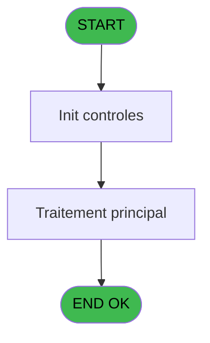

# NET IDE 10 - Export Archive

> **Analyse**: Phases 1-4 2026-02-03 15:17 -> 15:17 (9s) | Assemblage 15:17
> **Pipeline**: V7.2 Enrichi
> **Structure**: 4 onglets (Resume | Ecrans | Donnees | Connexions)

<!-- TAB:Resume -->

## 1. FICHE D'IDENTITE

| Attribut | Valeur |
|----------|--------|
| Projet | NET |
| IDE Position | 10 |
| Nom Programme | Export Archive |
| Fichier source | `Prg_10.xml` |
| Dossier IDE | Request |
| Taches | 3 (1 ecrans visibles) |
| Tables modifiees | 0 |
| Programmes appeles | 0 |

## 2. DESCRIPTION FONCTIONNELLE

**Export Archive** assure la gestion complete de ce processus, accessible depuis [Pilotage (IDE 12)](NET-IDE-12.md).

Le flux de traitement s'organise en **1 blocs fonctionnels** :

- **Traitement** (3 taches) : traitements metier divers

## 3. BLOCS FONCTIONNELS

### 3.1 Traitement (3 taches)

Traitements internes.

---

#### 10 - Exporting to Excel [[ECRAN]](#ecran-t1)

**Role** : Traitement : Exporting to Excel.
**Ecran** : 205 x 60 DLU (MDI) | [Voir mockup](#ecran-t1)

---

#### 10.1 - Format header [[ECRAN]](#ecran-t2)

**Role** : Traitement : Format header.
**Ecran** : 148 x 67 DLU (MDI) | [Voir mockup](#ecran-t2)

---

#### 10.2 - Format details [[ECRAN]](#ecran-t3)

**Role** : Traitement : Format details.
**Ecran** : 83 x 70 DLU (MDI) | [Voir mockup](#ecran-t3)

## 5. REGLES METIER

*(Aucune regle metier identifiee)*

## 6. CONTEXTE

- **Appele par**: [Pilotage (IDE 12)](NET-IDE-12.md)
- **Appelle**: 0 programmes | **Tables**: 1 (W:0 R:1 L:0) | **Taches**: 3 | **Expressions**: 3

<!-- TAB:Ecrans -->

## 8. ECRANS

### 8.1 Forms visibles (1 / 3)

| # | Position | Tache | Nom | Type | Largeur | Hauteur | Bloc |
|---|----------|-------|-----|------|---------|---------|------|
| 1 | 10 | 10 | Exporting to Excel | MDI | 205 | 60 | Traitement |

### 8.2 Mockups Ecrans

---

#### 10 - Exporting to Excel
**Tache** : [10](#t1) | **Type** : MDI | **Dimensions** : 205 x 60 DLU
**Bloc** : Traitement | **Titre IDE** : Exporting to Excel

<!-- FORM-DATA:
{
    "width":  205,
    "vFactor":  8,
    "type":  "MDI",
    "hFactor":  4,
    "controls":  [
                     {
                         "x":  60,
                         "type":  "label",
                         "var":  "",
                         "y":  10,
                         "w":  77,
                         "fmt":  "",
                         "name":  "",
                         "h":  8,
                         "color":  "",
                         "text":  "Running ...",
                         "parent":  null
                     },
                     {
                         "x":  75,
                         "type":  "edit",
                         "var":  "",
                         "y":  28,
                         "w":  46,
                         "fmt":  "",
                         "name":  "",
                         "h":  10,
                         "color":  "",
                         "text":  "",
                         "parent":  null
                     }
                 ],
    "taskId":  "10",
    "height":  60
}
-->

<strong>Champs : 1 champs</strong>

| Pos (x,y) | Nom | Variable | Type |
|-----------|-----|----------|------|
| 75,28 | (sans nom) | - | edit |

## 9. NAVIGATION

Ecran unique: **Exporting to Excel**

### 9.3 Structure hierarchique (3 taches)

| Position | Tache | Type | Dimensions | Bloc |
|----------|-------|------|------------|------|
| **10.1** | [**Exporting to Excel** (10)](#t1) [mockup](#ecran-t1) | MDI | 205x60 | Traitement |
| 10.1.1 | [Format header (10.1)](#t2) [mockup](#ecran-t2) | MDI | 148x67 | |
| 10.1.2 | [Format details (10.2)](#t3) [mockup](#ecran-t3) | MDI | 83x70 | |

### 9.4 Algorigramme

> **Legende**: Vert = START/END OK | Rouge = END KO | Bleu = Decisions
> *Algorigramme auto-genere. Utiliser `/algorigramme` pour une synthese metier detaillee.*

<!-- TAB:Donnees -->

## 10. TABLES

### Tables utilisees (1)

| ID | Nom | Description | Type | R | W | L | Usages |
|----|-----|-------------|------|---|---|---|--------|
| 430 | req_services | Services / filieres | DB | R |   |   | 1 |

### Colonnes par table (1 / 1 tables avec colonnes identifiees)

Table 430 - req_services (R) - 1 usages

| Lettre | Variable | Acces | Type |
|--------|----------|-------|------|
| A | v.list | R | Alpha |
| B | v.counter | R | Numeric |

## 11. VARIABLES

### 11.1 Variables de session (2)

Variables persistantes pendant toute la session.

| Lettre | Nom | Type | Usage dans |
|--------|-----|------|-----------|
| A | v.list | Alpha | - |
| B | v.counter | Numeric | - |

## 12. EXPRESSIONS

**3 / 3 expressions decodees (100%)**

### 12.1 Repartition par type

| Type | Expressions | Regles |
|------|-------------|--------|
| CALCULATION | 1 | 0 |
| CONCATENATION | 1 | 0 |
| CONDITION | 1 | 0 |

### 12.2 Expressions cles par type

#### CALCULATION (1 expressions)

| Type | IDE | Expression | Regle |
|------|-----|------------|-------|
| CALCULATION | 1 | `[AP]+1` | - |

#### CONCATENATION (1 expressions)

| Type | IDE | Expression | Regle |
|------|-----|------------|-------|
| CONCATENATION | 3 | `INIGet ('[MAGIC_LOGICAL_NAMES]club_exportdata')&'Request\Requests_'&DStr (Date (),'YYYYMMDD')&'.csv'` | - |

#### CONDITION (1 expressions)

| Type | IDE | Expression | Regle |
|------|-----|------------|-------|
| CONDITION | 2 | `[AP]=1` | - |

<!-- TAB:Connexions -->

## 13. GRAPHE D'APPELS

### 13.1 Chaine depuis Main (Callers)

Main -> ... -> [Pilotage (IDE 12)](NET-IDE-12.md) -> **Export Archive (IDE 10)**

### 13.2 Callers

| IDE | Nom Programme | Nb Appels |
|-----|---------------|-----------|
| [12](NET-IDE-12.md) | Pilotage | 1 |

### 13.3 Callees (programmes appeles)

### 13.4 Detail Callees avec contexte

| IDE | Nom Programme | Appels | Contexte |
|-----|---------------|--------|----------|
| - | (aucun) | - | - |

## 14. RECOMMANDATIONS MIGRATION

### 14.1 Profil du programme

| Metrique | Valeur | Impact migration |
|----------|--------|-----------------|
| Lignes de logique | 60 | Programme compact |
| Expressions | 3 | Peu de logique |
| Tables WRITE | 0 | Impact faible |
| Sous-programmes | 0 | Peu de dependances |
| Ecrans visibles | 1 | Ecran unique ou traitement batch |
| Code desactive | 0% (0 / 60) | Code sain |
| Regles metier | 0 | Pas de regle identifiee |

### 14.2 Plan de migration par bloc

#### Traitement (3 taches: 3 ecrans, 0 traitement)

- **Strategie** : 3 composant(s) UI (Razor/React) avec formulaires et validation.
- Decomposer les taches en services unitaires testables.

### 14.3 Dependances critiques

| Dependance | Type | Appels | Impact |
|------------|------|--------|--------|

---
*Spec DETAILED generee par Pipeline V7.2 - 2026-02-03 15:18*
