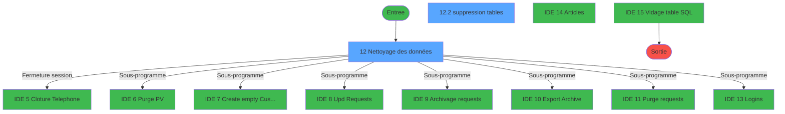
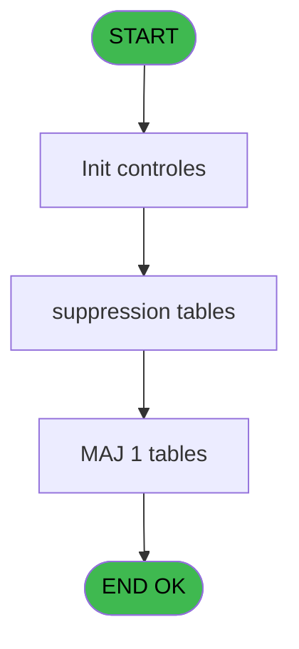
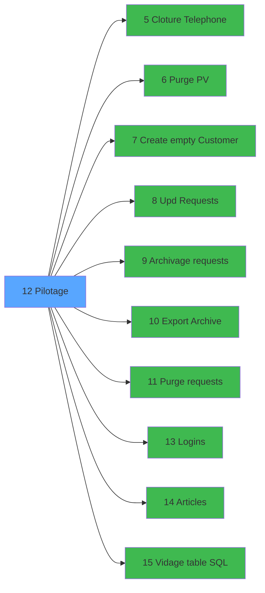

# NET IDE 12 - Pilotage

> **Analyse**: Phases 1-4 2026-02-03 15:18 -> 15:18 (14s) | Assemblage 15:18
> **Pipeline**: V7.2 Enrichi
> **Structure**: 4 onglets (Resume | Ecrans | Donnees | Connexions)

<!-- TAB:Resume -->

## 1. FICHE D'IDENTITE

| Attribut | Valeur |
|----------|--------|
| Projet | NET |
| IDE Position | 12 |
| Nom Programme | Pilotage |
| Fichier source | `Prg_12.xml` |
| Dossier IDE | Nettoyage |
| Taches | 7 (2 ecrans visibles) |
| Tables modifiees | 1 |
| Programmes appeles | 10 |

## 2. DESCRIPTION FONCTIONNELLE

**Pilotage** assure la gestion complete de ce processus, accessible depuis [Main Program (IDE 1)](NET-IDE-1.md).

Le flux de traitement s'organise en **3 blocs fonctionnels** :

- **Traitement** (5 taches) : traitements metier divers
- **Initialisation** (1 tache) : reinitialisation d'etats et de variables de travail
- **Calcul** (1 tache) : calculs de montants, stocks ou compteurs

**Donnees modifiees** : 1 tables en ecriture (date_comptable___dat).

Detail : phases du traitement

#### Phase 1 : Traitement (5 taches)

- **12** - Nettoyage des données **[[ECRAN]](#ecran-t1)**
- **12.2** - suppression tables **[[ECRAN]](#ecran-t4)**
- **12.4** - sauvegarde SQL
- **12.5** - restricted access
- **12.6** - multi SQL

Delegue a : [Cloture Telephone (IDE 5)](NET-IDE-5.md), [Purge PV (IDE 6)](NET-IDE-6.md), [Upd Requests (IDE 8)](NET-IDE-8.md), [Archivage requests (IDE 9)](NET-IDE-9.md), [Export Archive (IDE 10)](NET-IDE-10.md), [Purge requests (IDE 11)](NET-IDE-11.md), [   Logins (IDE 13)](NET-IDE-13.md), [   Articles (IDE 14)](NET-IDE-14.md), [Vidage table SQL (IDE 15)](NET-IDE-15.md)

#### Phase 2 : Calcul (1 tache)

- **12.1** - Upd date comptable

#### Phase 3 : Initialisation (1 tache)

- **12.3** - init

#### Tables impactees

| Table | Operations | Role metier |
|-------|-----------|-------------|
| date_comptable___dat | **W** (1 usages) |  |

## 3. BLOCS FONCTIONNELS

### 3.1 Traitement (5 taches)

Traitements internes.

---

#### 12 - Nettoyage des données [[ECRAN]](#ecran-t1)

**Role** : Traitement : Nettoyage des données.
**Ecran** : 674 x 111 DLU (MDI) | [Voir mockup](#ecran-t1)

4 sous-taches directes

| Tache | Nom | Bloc |
|-------|-----|------|
| [12.2](#t4) | suppression tables **[[ECRAN]](#ecran-t4)** | Traitement |
| [12.4](#t6) | sauvegarde SQL | Traitement |
| [12.5](#t7) | restricted access | Traitement |
| [12.6](#t8) | multi SQL | Traitement |

**Delegue a** : [Cloture Telephone (IDE 5)](NET-IDE-5.md), [Purge PV (IDE 6)](NET-IDE-6.md), [Upd Requests (IDE 8)](NET-IDE-8.md)

---

#### 12.2 - suppression tables [[ECRAN]](#ecran-t4)

**Role** : Traitement : suppression tables.
**Ecran** : 182 x 66 DLU | [Voir mockup](#ecran-t4)
**Delegue a** : [Cloture Telephone (IDE 5)](NET-IDE-5.md), [Purge PV (IDE 6)](NET-IDE-6.md), [Upd Requests (IDE 8)](NET-IDE-8.md)

---

#### 12.4 - sauvegarde SQL

**Role** : Traitement : sauvegarde SQL.
**Delegue a** : [Cloture Telephone (IDE 5)](NET-IDE-5.md), [Purge PV (IDE 6)](NET-IDE-6.md), [Upd Requests (IDE 8)](NET-IDE-8.md)

---

#### 12.5 - restricted access

**Role** : Traitement : restricted access.
**Delegue a** : [Cloture Telephone (IDE 5)](NET-IDE-5.md), [Purge PV (IDE 6)](NET-IDE-6.md), [Upd Requests (IDE 8)](NET-IDE-8.md)

---

#### 12.6 - multi SQL

**Role** : Traitement : multi SQL.
**Delegue a** : [Cloture Telephone (IDE 5)](NET-IDE-5.md), [Purge PV (IDE 6)](NET-IDE-6.md), [Upd Requests (IDE 8)](NET-IDE-8.md)

### 3.2 Calcul (1 tache)

Calculs metier : montants, stocks, compteurs.

---

#### 12.1 - Upd date comptable

**Role** : Traitement : Upd date comptable.
**Variables liees** : A (v.date comptable)

### 3.3 Initialisation (1 tache)

Reinitialisation d'etats et variables de travail.

---

#### 12.3 - init

**Role** : Reinitialisation : init.

## 5. REGLES METIER

*(Aucune regle metier identifiee)*

## 6. CONTEXTE

- **Appele par**: [Main Program (IDE 1)](NET-IDE-1.md)
- **Appelle**: 10 programmes | **Tables**: 4 (W:1 R:2 L:1) | **Taches**: 7 | **Expressions**: 11

<!-- TAB:Ecrans -->

## 8. ECRANS

### 8.1 Forms visibles (2 / 7)

| # | Position | Tache | Nom | Type | Largeur | Hauteur | Bloc |
|---|----------|-------|-----|------|---------|---------|------|
| 1 | 12 | 12 | Nettoyage des données | MDI | 674 | 111 | Traitement |
| 2 | 12.2 | 12.2 | suppression tables | Type0 | 182 | 66 | Traitement |

### 8.2 Mockups Ecrans

---

#### 12 - Nettoyage des données
**Tache** : [12](#t1) | **Type** : MDI | **Dimensions** : 674 x 111 DLU
**Bloc** : Traitement | **Titre IDE** : Nettoyage des données

<!-- FORM-DATA:
{
    "width":  674,
    "vFactor":  8,
    "type":  "MDI",
    "hFactor":  8,
    "controls":  [
                     {
                         "x":  58,
                         "type":  "label",
                         "var":  "",
                         "y":  24,
                         "w":  150,
                         "fmt":  "",
                         "name":  "",
                         "h":  12,
                         "color":  "",
                         "text":  "Date Comptable",
                         "parent":  null
                     },
                     {
                         "x":  238,
                         "type":  "edit",
                         "var":  "",
                         "y":  24,
                         "w":  126,
                         "fmt":  "",
                         "name":  "v.date comptable",
                         "h":  12,
                         "color":  "110",
                         "text":  "",
                         "parent":  null
                     },
                     {
                         "x":  376,
                         "type":  "button",
                         "var":  "",
                         "y":  88,
                         "w":  208,
                         "fmt":  "",
                         "name":  "b.quitter",
                         "h":  14,
                         "color":  "",
                         "text":  "",
                         "parent":  null
                     },
                     {
                         "x":  88,
                         "type":  "button",
                         "var":  "",
                         "y":  88,
                         "w":  208,
                         "fmt":  "",
                         "name":  "b.lancer",
                         "h":  14,
                         "color":  "",
                         "text":  "",
                         "parent":  null
                     },
                     {
                         "x":  465,
                         "type":  "image",
                         "var":  "",
                         "y":  14,
                         "w":  149,
                         "fmt":  "",
                         "name":  "",
                         "h":  61,
                         "color":  "",
                         "text":  "",
                         "parent":  null
                     }
                 ],
    "taskId":  "12",
    "height":  111
}
-->

<strong>Champs : 1 champs</strong>

| Pos (x,y) | Nom | Variable | Type |
|-----------|-----|----------|------|
| 238,24 | v.date comptable | - | edit |

<strong>Boutons : 2 boutons</strong>

| Bouton | Pos (x,y) | Action |
|--------|-----------|--------|
| b.quitter | 376,88 | Quitte le programme |
| b.lancer | 88,88 | Bouton fonctionnel |

---

#### 12.2 - suppression tables
**Tache** : [12.2](#t4) | **Type** : Type0 | **Dimensions** : 182 x 66 DLU
**Bloc** : Traitement | **Titre IDE** : suppression tables

<!-- FORM-DATA:
{
    "width":  182,
    "vFactor":  8,
    "type":  "Type0",
    "hFactor":  4,
    "controls":  [
                     {
                         "x":  6,
                         "type":  "label",
                         "var":  "",
                         "y":  6,
                         "w":  172,
                         "fmt":  "",
                         "name":  "",
                         "h":  29,
                         "color":  "",
                         "text":  "",
                         "parent":  null
                     },
                     {
                         "x":  52,
                         "type":  "label",
                         "var":  "",
                         "y":  16,
                         "w":  120,
                         "fmt":  "",
                         "name":  "",
                         "h":  8,
                         "color":  "7",
                         "text":  "Vidage tables",
                         "parent":  null
                     },
                     {
                         "x":  6,
                         "type":  "label",
                         "var":  "",
                         "y":  35,
                         "w":  172,
                         "fmt":  "",
                         "name":  "",
                         "h":  27,
                         "color":  "",
                         "text":  "",
                         "parent":  null
                     },
                     {
                         "x":  31,
                         "type":  "label",
                         "var":  "",
                         "y":  44,
                         "w":  120,
                         "fmt":  "",
                         "name":  "",
                         "h":  12,
                         "color":  "2",
                         "text":  "Running...",
                         "parent":  null
                     },
                     {
                         "x":  10,
                         "type":  "image",
                         "var":  "",
                         "y":  8,
                         "w":  32,
                         "fmt":  "",
                         "name":  "",
                         "h":  25,
                         "color":  "",
                         "text":  "",
                         "parent":  null
                     }
                 ],
    "taskId":  "12.2",
    "height":  66
}
-->

## 9. NAVIGATION

### 9.1 Enchainement des ecrans

**Detail par enchainement :**

| Depuis | Action | Vers | Retour |
|--------|--------|------|--------|
| Nettoyage des données | Fermeture session | [Cloture Telephone (IDE 5)](NET-IDE-5.md) | Retour ecran |
| Nettoyage des données | Sous-programme | [Purge PV (IDE 6)](NET-IDE-6.md) | Retour ecran |
| Nettoyage des données | Sous-programme | [Create empty Customer (IDE 7)](NET-IDE-7.md) | Retour ecran |
| Nettoyage des données | Sous-programme | [Upd Requests (IDE 8)](NET-IDE-8.md) | Retour ecran |
| Nettoyage des données | Sous-programme | [Archivage requests (IDE 9)](NET-IDE-9.md) | Retour ecran |
| Nettoyage des données | Sous-programme | [Export Archive (IDE 10)](NET-IDE-10.md) | Retour ecran |
| Nettoyage des données | Sous-programme | [Purge requests (IDE 11)](NET-IDE-11.md) | Retour ecran |
| Nettoyage des données | Sous-programme | [   Logins (IDE 13)](NET-IDE-13.md) | Retour ecran |
| Nettoyage des données | Sous-programme | [   Articles (IDE 14)](NET-IDE-14.md) | Retour ecran |
| Nettoyage des données | Sous-programme | [Vidage table SQL (IDE 15)](NET-IDE-15.md) | Retour ecran |

### 9.3 Structure hierarchique (7 taches)

| Position | Tache | Type | Dimensions | Bloc |
|----------|-------|------|------------|------|
| **12.1** | [**Nettoyage des données** (12)](#t1) [mockup](#ecran-t1) | MDI | 674x111 | Traitement |
| 12.1.1 | [suppression tables (12.2)](#t4) [mockup](#ecran-t4) | - | 182x66 | |
| 12.1.2 | [sauvegarde SQL (12.4)](#t6) | - | - | |
| 12.1.3 | [restricted access (12.5)](#t7) | - | - | |
| 12.1.4 | [multi SQL (12.6)](#t8) | - | - | |
| **12.2** | [**Upd date comptable** (12.1)](#t3) | MDI | - | Calcul |
| **12.3** | [**init** (12.3)](#t5) | - | - | Initialisation |

### 9.4 Algorigramme

> **Legende**: Vert = START/END OK | Rouge = END KO | Bleu = Decisions
> *Algorigramme auto-genere. Utiliser `/algorigramme` pour une synthese metier detaillee.*

<!-- TAB:Donnees -->

## 10. TABLES

### Tables utilisees (4)

| ID | Nom | Description | Type | R | W | L | Usages |
|----|-----|-------------|------|---|---|---|--------|
| 69 | initialisation___ini |  | DB | R |   |   | 1 |
| 70 | date_comptable___dat |  | DB |   | **W** |   | 1 |
| 422 | req_type_location |  | DB |   |   | L | 1 |
| 783 | vrl_hp |  | DB | R |   |   | 1 |

### Colonnes par table (1 / 3 tables avec colonnes identifiees)

Table 69 - initialisation___ini (R) - 1 usages

*Table utilisee uniquement en Link ou aucune colonne Real identifiee dans le DataView.*

Table 70 - date_comptable___dat (**W**) - 1 usages

| Lettre | Variable | Acces | Type |
|--------|----------|-------|------|
| A | v.date comptable | W | Date |

Table 783 - vrl_hp (R) - 1 usages

*Table utilisee uniquement en Link ou aucune colonne Real identifiee dans le DataView.*

## 11. VARIABLES

### 11.1 Variables de session (4)

Variables persistantes pendant toute la session.

| Lettre | Nom | Type | Usage dans |
|--------|-----|------|-----------|
| A | v.date comptable | Date | - |
| B | v.traitement Xtrack | Logical | - |
| E | V.Masque montant | Alpha | - |
| F | V.Nom village | Alpha | - |

### 11.2 Autres (2)

Variables diverses.

| Lettre | Nom | Type | Usage dans |
|--------|-----|------|-----------|
| C | b.quitter | Alpha | - |
| D | b.lancer | Alpha | - |

## 12. EXPRESSIONS

**11 / 11 expressions decodees (100%)**

### 12.1 Repartition par type

| Type | Expressions | Regles |
|------|-------------|--------|
| CONCATENATION | 1 | 0 |
| CONSTANTE | 2 | 0 |
| DATE | 1 | 0 |
| CAST_LOGIQUE | 1 | 0 |
| NEGATION | 1 | 0 |
| OTHER | 2 | 0 |
| STRING | 3 | 0 |

### 12.2 Expressions cles par type

#### CONCATENATION (1 expressions)

| Type | IDE | Expression | Regle |
|------|-----|------------|-------|
| CONCATENATION | 3 | `'cmd /c mkdir '&INIGet ('[MAGIC_LOGICAL_NAMES]club_exportdata')&'Request'` | - |

#### CONSTANTE (2 expressions)

| Type | IDE | Expression | Regle |
|------|-----|------------|-------|
| CONSTANTE | 8 | `'%club_command%sauvnettoyage'` | - |
| CONSTANTE | 6 | `'C'` | - |

#### DATE (1 expressions)

| Type | IDE | Expression | Regle |
|------|-----|------------|-------|
| DATE | 1 | `Date ()` | - |

#### CAST_LOGIQUE (1 expressions)

| Type | IDE | Expression | Regle |
|------|-----|------------|-------|
| CAST_LOGIQUE | 2 | `'TRUE'LOG` | - |

#### NEGATION (1 expressions)

| Type | IDE | Expression | Regle |
|------|-----|------------|-------|
| NEGATION | 4 | `NOT (FileExist (INIGet ('[MAGIC_LOGICAL_NAMES]club_exportdata')&'Request'))` | - |

#### OTHER (2 expressions)

| Type | IDE | Expression | Regle |
|------|-----|------------|-------|
| OTHER | 7 | `SetCrsr (1)` | - |
| OTHER | 5 | `SetCrsr (2)` | - |

#### STRING (3 expressions)

| Type | IDE | Expression | Regle |
|------|-----|------------|-------|
| STRING | 11 | `Trim(Translate('%rep_bck_sql%pmsndata3.bak'))` | - |
| STRING | 10 | `Trim(Translate('%rep_bck_sql%pmsndata2.bak'))` | - |
| STRING | 9 | `Trim(Translate('%rep_bck_sql%pmsndata1.bak'))` | - |

<!-- TAB:Connexions -->

## 13. GRAPHE D'APPELS

### 13.1 Chaine depuis Main (Callers)

Main -> ... -> [Main Program (IDE 1)](NET-IDE-1.md) -> **Pilotage (IDE 12)**

### 13.2 Callers

| IDE | Nom Programme | Nb Appels |
|-----|---------------|-----------|
| [1](NET-IDE-1.md) | Main Program | 1 |

### 13.3 Callees (programmes appeles)

### 13.4 Detail Callees avec contexte

| IDE | Nom Programme | Appels | Contexte |
|-----|---------------|--------|----------|
| [5](NET-IDE-5.md) | Cloture Telephone | 1 | Fermeture session |
| [6](NET-IDE-6.md) | Purge PV | 1 | Sous-programme |
| [7](NET-IDE-7.md) | Create empty Customer | 1 | Sous-programme |
| [8](NET-IDE-8.md) | Upd Requests | 1 | Sous-programme |
| [9](NET-IDE-9.md) | Archivage requests | 1 | Sous-programme |
| [10](NET-IDE-10.md) | Export Archive | 1 | Sous-programme |
| [11](NET-IDE-11.md) | Purge requests | 1 | Sous-programme |
| [13](NET-IDE-13.md) |    Logins | 1 | Sous-programme |
| [14](NET-IDE-14.md) |    Articles | 1 | Sous-programme |
| [15](NET-IDE-15.md) | Vidage table SQL | 1 | Sous-programme |

## 14. RECOMMANDATIONS MIGRATION

### 14.1 Profil du programme

| Metrique | Valeur | Impact migration |
|----------|--------|-----------------|
| Lignes de logique | 66 | Programme compact |
| Expressions | 11 | Peu de logique |
| Tables WRITE | 1 | Impact faible |
| Sous-programmes | 10 | Dependances moderees |
| Ecrans visibles | 2 | Quelques ecrans |
| Code desactive | 0% (0 / 66) | Code sain |
| Regles metier | 0 | Pas de regle identifiee |

### 14.2 Plan de migration par bloc

#### Traitement (5 taches: 2 ecrans, 3 traitements)

- **Strategie** : Orchestrateur avec 2 ecrans (Razor/React) et 3 traitements backend (services).
- Les ecrans deviennent des composants UI, les traitements invisibles deviennent des services injectables.
- 10 sous-programme(s) a migrer ou a reutiliser depuis les services existants.
- Decomposer les taches en services unitaires testables.

#### Calcul (1 tache: 0 ecran, 1 traitement)

- **Strategie** : Services de calcul purs (Domain Services).
- Migrer la logique de calcul (stock, compteurs, montants)

#### Initialisation (1 tache: 0 ecran, 1 traitement)

- **Strategie** : Constructeur/methode `InitAsync()` dans l'orchestrateur.

### 14.3 Dependances critiques

| Dependance | Type | Appels | Impact |
|------------|------|--------|--------|
| date_comptable___dat | Table WRITE (Database) | 1x | Schema + repository |
| [Purge requests (IDE 11)](NET-IDE-11.md) | Sous-programme | 1x | Normale - Sous-programme |
| [Export Archive (IDE 10)](NET-IDE-10.md) | Sous-programme | 1x | Normale - Sous-programme |
| [   Logins (IDE 13)](NET-IDE-13.md) | Sous-programme | 1x | Normale - Sous-programme |
| [Vidage table SQL (IDE 15)](NET-IDE-15.md) | Sous-programme | 1x | Normale - Sous-programme |
| [   Articles (IDE 14)](NET-IDE-14.md) | Sous-programme | 1x | Normale - Sous-programme |
| [Purge PV (IDE 6)](NET-IDE-6.md) | Sous-programme | 1x | Normale - Sous-programme |
| [Cloture Telephone (IDE 5)](NET-IDE-5.md) | Sous-programme | 1x | Normale - Fermeture session |
| [Create empty Customer (IDE 7)](NET-IDE-7.md) | Sous-programme | 1x | Normale - Sous-programme |
| [Archivage requests (IDE 9)](NET-IDE-9.md) | Sous-programme | 1x | Normale - Sous-programme |
| [Upd Requests (IDE 8)](NET-IDE-8.md) | Sous-programme | 1x | Normale - Sous-programme |

---
*Spec DETAILED generee par Pipeline V7.2 - 2026-02-03 15:18*
