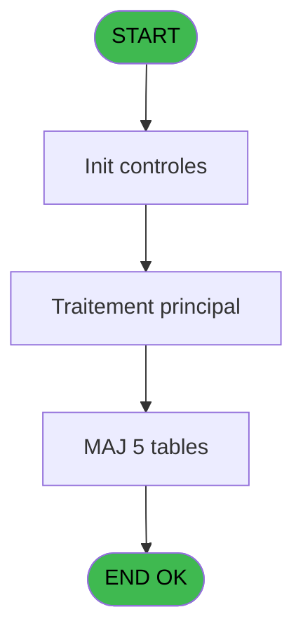
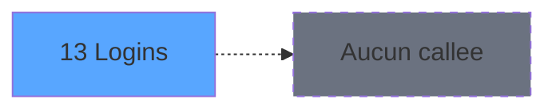

# NET IDE 13 - Logins

> **Analyse**: Phases 1-4 2026-02-03 15:18 -> 15:19 (15s) | Assemblage 15:19
> **Pipeline**: V7.2 Enrichi
> **Structure**: 4 onglets (Resume | Ecrans | Donnees | Connexions)

<!-- TAB:Resume -->

## 1. FICHE D'IDENTITE

| Attribut | Valeur |
|----------|--------|
| Projet | NET |
| IDE Position | 13 |
| Nom Programme | Logins |
| Fichier source | `Prg_13.xml` |
| Dossier IDE | Nettoyage |
| Taches | 6 (0 ecrans visibles) |
| Tables modifiees | 5 |
| Programmes appeles | 0 |

## 2. DESCRIPTION FONCTIONNELLE

**Logins** assure la gestion complete de ce processus, accessible depuis [Pilotage (IDE 12)](NET-IDE-12.md).

Le flux de traitement s'organise en **2 blocs fonctionnels** :

- **Traitement** (5 taches) : traitements metier divers
- **Validation** (1 tache) : controles et verifications de coherence

**Donnees modifiees** : 5 tables en ecriture (table_utilisateurs, coupures_monnaie_euro, ecran, arc_transac_detail_bar, password_historique).

Detail : phases du traitement

#### Phase 1 : Traitement (5 taches)

- **13** - Logins
- **13.1** - Del Rights
- **13.2** - Del Rights
- **13.3** - Del Rights
- **13.4** - Del Rights

#### Phase 2 : Validation (1 tache)

- **13.5** - Verifi Liste

#### Tables impactees

| Table | Operations | Role metier |
|-------|-----------|-------------|
| arc_transac_detail_bar | **W** (1 usages) |  |
| password_historique | **W** (1 usages) | Historique / journal |
| ecran | **W** (1 usages) | Table temporaire ecran |
| table_utilisateurs | **W** (1 usages) |  |
| coupures_monnaie_euro | **W** (1 usages) |  |

## 3. BLOCS FONCTIONNELS

### 3.1 Traitement (5 taches)

Traitements internes.

---

#### 13 - Logins

**Role** : Traitement : Logins.

4 sous-taches directes

| Tache | Nom | Bloc |
|-------|-----|------|
| [13.1](#t2) | Del Rights | Traitement |
| [13.2](#t5) | Del Rights | Traitement |
| [13.3](#t8) | Del Rights | Traitement |
| [13.4](#t11) | Del Rights | Traitement |

---

#### 13.1 - Del Rights

**Role** : Traitement : Del Rights.

---

#### 13.2 - Del Rights

**Role** : Traitement : Del Rights.

---

#### 13.3 - Del Rights

**Role** : Traitement : Del Rights.

---

#### 13.4 - Del Rights

**Role** : Traitement : Del Rights.

### 3.2 Validation (1 tache)

Controles de coherence : 1 tache verifie les donnees et conditions.

---

#### 13.5 - Verifi Liste

**Role** : Verification : Verifi Liste.

## 5. REGLES METIER

*(Aucune regle metier identifiee)*

## 6. CONTEXTE

- **Appele par**: [Pilotage (IDE 12)](NET-IDE-12.md)
- **Appelle**: 0 programmes | **Tables**: 5 (W:5 R:0 L:0) | **Taches**: 6 | **Expressions**: 3

<!-- TAB:Ecrans -->

## 8. ECRANS

*(Programme sans ecran visible)*

## 9. NAVIGATION

### 9.3 Structure hierarchique (6 taches)

| Position | Tache | Type | Dimensions | Bloc |
|----------|-------|------|------------|------|
| **13.1** | [**Logins** (13)](#t1) | MDI | - | Traitement |
| 13.1.1 | [Del Rights (13.1)](#t2) | MDI | - | |
| 13.1.2 | [Del Rights (13.2)](#t5) | MDI | - | |
| 13.1.3 | [Del Rights (13.3)](#t8) | MDI | - | |
| 13.1.4 | [Del Rights (13.4)](#t11) | MDI | - | |
| **13.2** | [**Verifi Liste** (13.5)](#t12) | - | - | Validation |

### 9.4 Algorigramme

> **Legende**: Vert = START/END OK | Rouge = END KO | Bleu = Decisions
> *Algorigramme auto-genere. Utiliser `/algorigramme` pour une synthese metier detaillee.*

<!-- TAB:Donnees -->

## 10. TABLES

### Tables utilisees (5)

| ID | Nom | Description | Type | R | W | L | Usages |
|----|-----|-------------|------|---|---|---|--------|
| 109 | table_utilisateurs |  | DB |   | **W** |   | 1 |
| 672 | coupures_monnaie_euro |  | DB |   | **W** |   | 1 |
| 699 | ecran | Table temporaire ecran | DB |   | **W** |   | 1 |
| 719 | arc_transac_detail_bar |  | DB |   | **W** |   | 1 |
| 749 | password_historique | Historique / journal | DB |   | **W** |   | 1 |

### Colonnes par table (0 / 5 tables avec colonnes identifiees)

Table 109 - table_utilisateurs (**W**) - 1 usages

*Table utilisee uniquement en Link ou aucune colonne Real identifiee dans le DataView.*

Table 672 - coupures_monnaie_euro (**W**) - 1 usages

*Table utilisee uniquement en Link ou aucune colonne Real identifiee dans le DataView.*

Table 699 - ecran (**W**) - 1 usages

*Table utilisee uniquement en Link ou aucune colonne Real identifiee dans le DataView.*

Table 719 - arc_transac_detail_bar (**W**) - 1 usages

*Table utilisee uniquement en Link ou aucune colonne Real identifiee dans le DataView.*

Table 749 - password_historique (**W**) - 1 usages

*Table utilisee uniquement en Link ou aucune colonne Real identifiee dans le DataView.*

## 11. VARIABLES

*(Programme sans variables locales mappees)*

## 12. EXPRESSIONS

**3 / 3 expressions decodees (100%)**

### 12.1 Repartition par type

| Type | Expressions | Regles |
|------|-------------|--------|
| OTHER | 1 | 0 |
| CAST_LOGIQUE | 1 | 0 |
| CONDITION | 1 | 0 |

### 12.2 Expressions cles par type

#### OTHER (1 expressions)

| Type | IDE | Expression | Regle |
|------|-----|------------|-------|
| OTHER | 2 | `[H]` | - |

#### CAST_LOGIQUE (1 expressions)

| Type | IDE | Expression | Regle |
|------|-----|------------|-------|
| CAST_LOGIQUE | 3 | `'TRUE'LOG` | - |

#### CONDITION (1 expressions)

| Type | IDE | Expression | Regle |
|------|-----|------------|-------|
| CONDITION | 1 | `Trim (v.suppression ? [A])<>'INFORMATICIEN'` | - |

<!-- TAB:Connexions -->

## 13. GRAPHE D'APPELS

### 13.1 Chaine depuis Main (Callers)

Main -> ... -> [Pilotage (IDE 12)](NET-IDE-12.md) -> **Logins (IDE 13)**

### 13.2 Callers

| IDE | Nom Programme | Nb Appels |
|-----|---------------|-----------|
| [12](NET-IDE-12.md) | Pilotage | 1 |

### 13.3 Callees (programmes appeles)

### 13.4 Detail Callees avec contexte

| IDE | Nom Programme | Appels | Contexte |
|-----|---------------|--------|----------|
| - | (aucun) | - | - |

## 14. RECOMMANDATIONS MIGRATION

### 14.1 Profil du programme

| Metrique | Valeur | Impact migration |
|----------|--------|-----------------|
| Lignes de logique | 29 | Programme compact |
| Expressions | 3 | Peu de logique |
| Tables WRITE | 5 | Impact modere |
| Sous-programmes | 0 | Peu de dependances |
| Ecrans visibles | 0 | Ecran unique ou traitement batch |
| Code desactive | 0% (0 / 29) | Code sain |
| Regles metier | 0 | Pas de regle identifiee |

### 14.2 Plan de migration par bloc

#### Traitement (5 taches: 0 ecran, 5 traitements)

- **Strategie** : 5 service(s) backend injectable(s) (Domain Services).
- Decomposer les taches en services unitaires testables.

#### Validation (1 tache: 0 ecran, 1 traitement)

- **Strategie** : FluentValidation avec validators specifiques.
- Chaque tache de validation -> un validator injectable

### 14.3 Dependances critiques

| Dependance | Type | Appels | Impact |
|------------|------|--------|--------|
| table_utilisateurs | Table WRITE (Database) | 1x | Schema + repository |
| coupures_monnaie_euro | Table WRITE (Database) | 1x | Schema + repository |
| ecran | Table WRITE (Database) | 1x | Schema + repository |
| arc_transac_detail_bar | Table WRITE (Database) | 1x | Schema + repository |
| password_historique | Table WRITE (Database) | 1x | Schema + repository |

---
*Spec DETAILED generee par Pipeline V7.2 - 2026-02-03 15:19*
