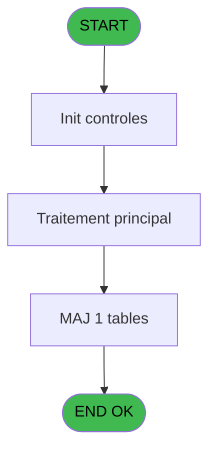

# NET IDE 9 - Archivage requests

> **Analyse**: Phases 1-4 2026-02-03 15:17 -> 15:17 (9s) | Assemblage 15:17
> **Pipeline**: V7.2 Enrichi
> **Structure**: 4 onglets (Resume | Ecrans | Donnees | Connexions)

<!-- TAB:Resume -->

## 1. FICHE D'IDENTITE

| Attribut | Valeur |
|----------|--------|
| Projet | NET |
| IDE Position | 9 |
| Nom Programme | Archivage requests |
| Fichier source | `Prg_9.xml` |
| Dossier IDE | Request |
| Taches | 1 (1 ecrans visibles) |
| Tables modifiees | 1 |
| Programmes appeles | 0 |

## 2. DESCRIPTION FONCTIONNELLE

**Archivage requests** assure la gestion complete de ce processus, accessible depuis [Pilotage (IDE 12)](NET-IDE-12.md).

Le flux de traitement s'organise en **1 blocs fonctionnels** :

- **Traitement** (1 tache) : traitements metier divers

**Donnees modifiees** : 1 tables en ecriture (req_archives).

## 3. BLOCS FONCTIONNELS

### 3.1 Traitement (1 tache)

Traitements internes.

---

#### 9 - Archivage [[ECRAN]](#ecran-t1)

**Role** : Traitement : Archivage.
**Ecran** : 427 x 60 DLU (MDI) | [Voir mockup](#ecran-t1)

## 5. REGLES METIER

*(Aucune regle metier identifiee)*

## 6. CONTEXTE

- **Appele par**: [Pilotage (IDE 12)](NET-IDE-12.md)
- **Appelle**: 0 programmes | **Tables**: 2 (W:1 R:0 L:1) | **Taches**: 1 | **Expressions**: 43

<!-- TAB:Ecrans -->

## 8. ECRANS

### 8.1 Forms visibles (1 / 1)

| # | Position | Tache | Nom | Type | Largeur | Hauteur | Bloc |
|---|----------|-------|-----|------|---------|---------|------|
| 1 | 9 | 9 | Archivage | MDI | 427 | 60 | Traitement |

### 8.2 Mockups Ecrans

---

#### 9 - Archivage
**Tache** : [9](#t1) | **Type** : MDI | **Dimensions** : 427 x 60 DLU
**Bloc** : Traitement | **Titre IDE** : Archivage

<!-- FORM-DATA:
{
    "width":  427,
    "vFactor":  8,
    "type":  "MDI",
    "hFactor":  8,
    "controls":  [
                     {
                         "x":  0,
                         "type":  "label",
                         "var":  "",
                         "y":  0,
                         "w":  423,
                         "fmt":  "",
                         "name":  "",
                         "h":  29,
                         "color":  "",
                         "text":  "",
                         "parent":  null
                     },
                     {
                         "x":  120,
                         "type":  "label",
                         "var":  "",
                         "y":  10,
                         "w":  221,
                         "fmt":  "",
                         "name":  "",
                         "h":  8,
                         "color":  "7",
                         "text":  "Archiving requests",
                         "parent":  null
                     },
                     {
                         "x":  0,
                         "type":  "label",
                         "var":  "",
                         "y":  29,
                         "w":  423,
                         "fmt":  "",
                         "name":  "",
                         "h":  27,
                         "color":  "",
                         "text":  "",
                         "parent":  null
                     },
                     {
                         "x":  103,
                         "type":  "label",
                         "var":  "",
                         "y":  38,
                         "w":  221,
                         "fmt":  "",
                         "name":  "",
                         "h":  12,
                         "color":  "2",
                         "text":  "Running...",
                         "parent":  null
                     },
                     {
                         "x":  4,
                         "type":  "image",
                         "var":  "",
                         "y":  2,
                         "w":  72,
                         "fmt":  "",
                         "name":  "",
                         "h":  25,
                         "color":  "",
                         "text":  "",
                         "parent":  null
                     }
                 ],
    "taskId":  "9",
    "height":  60
}
-->

## 9. NAVIGATION

Ecran unique: **Archivage**

### 9.3 Structure hierarchique (1 tache)

| Position | Tache | Type | Dimensions | Bloc |
|----------|-------|------|------------|------|
| **9.1** | [**Archivage** (9)](#t1) [mockup](#ecran-t1) | MDI | 427x60 | Traitement |

### 9.4 Algorigramme

> **Legende**: Vert = START/END OK | Rouge = END KO | Bleu = Decisions
> *Algorigramme auto-genere. Utiliser `/algorigramme` pour une synthese metier detaillee.*

<!-- TAB:Donnees -->

## 10. TABLES

### Tables utilisees (2)

| ID | Nom | Description | Type | R | W | L | Usages |
|----|-----|-------------|------|---|---|---|--------|
| 430 | req_services | Services / filieres | DB |   |   | L | 1 |
| 435 | req_archives |  | DB |   | **W** |   | 1 |

### Colonnes par table (0 / 1 tables avec colonnes identifiees)

Table 435 - req_archives (**W**) - 1 usages

*Table utilisee uniquement en Link ou aucune colonne Real identifiee dans le DataView.*

## 11. VARIABLES

*(Programme sans variables locales mappees)*

## 12. EXPRESSIONS

**43 / 43 expressions decodees (100%)**

### 12.1 Repartition par type

| Type | Expressions | Regles |
|------|-------------|--------|
| CONSTANTE | 1 | 0 |
| DATE | 1 | 0 |
| OTHER | 40 | 0 |
| CAST_LOGIQUE | 1 | 0 |

### 12.2 Expressions cles par type

#### CONSTANTE (1 expressions)

| Type | IDE | Expression | Regle |
|------|-----|------------|-------|
| CONSTANTE | 42 | `'OK'` | - |

#### DATE (1 expressions)

| Type | IDE | Expression | Regle |
|------|-----|------------|-------|
| DATE | 41 | `AddDate (Date (),0,0,- (GetParam ('ARCHIVEDELAY')))` | - |

#### OTHER (40 expressions)

| Type | IDE | Expression | Regle |
|------|-----|------------|-------|
| OTHER | 27 | `[AA]` | - |
| OTHER | 26 | `[Z]` | - |
| OTHER | 28 | `[AB]` | - |
| OTHER | 30 | `[AD]` | - |
| OTHER | 29 | `[AC]` | - |
| ... | | *+35 autres* | |

#### CAST_LOGIQUE (1 expressions)

| Type | IDE | Expression | Regle |
|------|-----|------------|-------|
| CAST_LOGIQUE | 43 | `'TRUE'LOG` | - |

### 12.3 Toutes les expressions (43)

Voir les 43 expressions

#### CONSTANTE (1)

| IDE | Expression Decodee |
|-----|-------------------|
| 42 | `'OK'` |

#### DATE (1)

| IDE | Expression Decodee |
|-----|-------------------|
| 41 | `AddDate (Date (),0,0,- (GetParam ('ARCHIVEDELAY')))` |

#### OTHER (40)

| IDE | Expression Decodee |
|-----|-------------------|
| 1 | `[A]` |
| 2 | `[B]` |
| 3 | `[C]` |
| 4 | `[D]` |
| 5 | `[E]` |
| 6 | `[F]` |
| 7 | `[G]` |
| 8 | `[H]` |
| 9 | `[I]` |
| 10 | `[J]` |
| 11 | `[K]` |
| 12 | `[L]` |
| 13 | `[M]` |
| 14 | `[N]` |
| 15 | `[O]` |
| 16 | `[P]` |
| 17 | `[Q]` |
| 18 | `[R]` |
| 19 | `[S]` |
| 20 | `[T]` |
| 21 | `[U]` |
| 22 | `[V]` |
| 23 | `[W]` |
| 24 | `[X]` |
| 25 | `[Y]` |
| 26 | `[Z]` |
| 27 | `[AA]` |
| 28 | `[AB]` |
| 29 | `[AC]` |
| 30 | `[AD]` |
| 31 | `[AE]` |
| 32 | `[AF]` |
| 33 | `[AG]` |
| 34 | `[AH]` |
| 35 | `[AI]` |
| 36 | `[AJ]` |
| 37 | `[AK]` |
| 38 | `[AL]` |
| 39 | `[AM]` |
| 40 | `[AN]` |

#### CAST_LOGIQUE (1)

| IDE | Expression Decodee |
|-----|-------------------|
| 43 | `'TRUE'LOG` |

<!-- TAB:Connexions -->

## 13. GRAPHE D'APPELS

### 13.1 Chaine depuis Main (Callers)

Main -> ... -> [Pilotage (IDE 12)](NET-IDE-12.md) -> **Archivage requests (IDE 9)**

### 13.2 Callers

| IDE | Nom Programme | Nb Appels |
|-----|---------------|-----------|
| [12](NET-IDE-12.md) | Pilotage | 1 |

### 13.3 Callees (programmes appeles)

### 13.4 Detail Callees avec contexte

| IDE | Nom Programme | Appels | Contexte |
|-----|---------------|--------|----------|
| - | (aucun) | - | - |

## 14. RECOMMANDATIONS MIGRATION

### 14.1 Profil du programme

| Metrique | Valeur | Impact migration |
|----------|--------|-----------------|
| Lignes de logique | 84 | Programme compact |
| Expressions | 43 | Peu de logique |
| Tables WRITE | 1 | Impact faible |
| Sous-programmes | 0 | Peu de dependances |
| Ecrans visibles | 1 | Ecran unique ou traitement batch |
| Code desactive | 0% (0 / 84) | Code sain |
| Regles metier | 0 | Pas de regle identifiee |

### 14.2 Plan de migration par bloc

#### Traitement (1 tache: 1 ecran, 0 traitement)

- **Strategie** : 1 composant(s) UI (Razor/React) avec formulaires et validation.
- Decomposer les taches en services unitaires testables.

### 14.3 Dependances critiques

| Dependance | Type | Appels | Impact |
|------------|------|--------|--------|
| req_archives | Table WRITE (Database) | 1x | Schema + repository |

---
*Spec DETAILED generee par Pipeline V7.2 - 2026-02-03 15:17*
