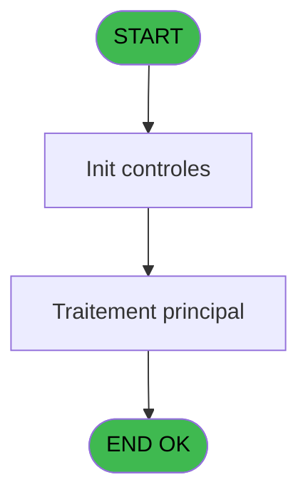
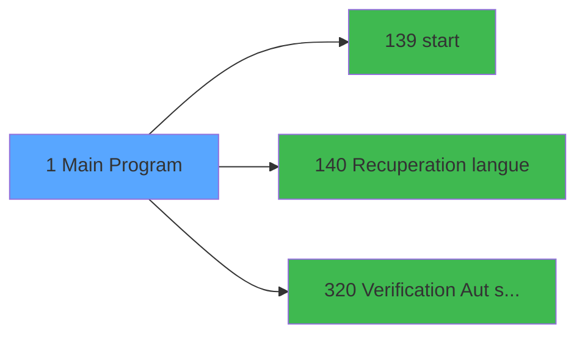

# PBG IDE 1 - Main Program

> **Analyse**: Phases 1-4 2026-02-03 00:44 -> 00:50 (6min) | Assemblage 00:50
> **Pipeline**: V7.2 Enrichi
> **Structure**: 4 onglets (Resume | Ecrans | Donnees | Connexions)

<!-- TAB:Resume -->

## 1. FICHE D'IDENTITE

| Attribut | Valeur |
|----------|--------|
| Projet | PBG |
| IDE Position | 1 |
| Nom Programme | Main Program |
| Fichier source | `Prg_1.xml` |
| Domaine metier | General |
| Taches | 2 (1 ecrans visibles) |
| Tables modifiees | 0 |
| Programmes appeles | 3 |
| :warning: Statut | **ORPHELIN_POTENTIEL** |

## 2. DESCRIPTION FONCTIONNELLE

**Main Program** assure la gestion complete de ce processus.

Le flux de traitement s'organise en **1 blocs fonctionnels** :

- **Traitement** (2 taches) : traitements metier divers

**Logique metier** : 1 regles identifiees couvrant conditions metier.

## 3. BLOCS FONCTIONNELS

### 3.1 Traitement (2 taches)

Traitements internes.

---

#### 1 - Planning Back Office [[ECRAN]](#ecran-t1)

**Role** : Traitement : Planning Back Office.
**Ecran** : 320 x 200 DLU (Type11) | [Voir mockup](#ecran-t1)
**Variables liees** : CQ (VG User BackOffice)
**Delegue a** : [start (IDE 139)](PBG-IDE-139.md), [  Recuperation langue (IDE 140)](PBG-IDE-140.md)

---

#### 1.1 - User BackOffice

**Role** : Traitement : User BackOffice.
**Variables liees** : B (VG.USER), CQ (VG User BackOffice)
**Delegue a** : [start (IDE 139)](PBG-IDE-139.md), [  Recuperation langue (IDE 140)](PBG-IDE-140.md)

## 5. REGLES METIER

1 regles identifiees:

### Autres (1 regles)

#### [RM-001] Si VG.Erreurs PYR [W] alors '2'MENU sinon 0)

| Element | Detail |
|---------|--------|
| **Condition** | `VG.Erreurs PYR [W]` |
| **Si vrai** | '2'MENU |
| **Si faux** | 0) |
| **Variables** | W (VG.Erreurs PYR) |
| **Expression source** | Expression 5 : `IF(VG.Erreurs PYR [W],'2'MENU,0)` |
| **Exemple** | Si VG.Erreurs PYR [W] → '2'MENU. Sinon → 0) |

## 6. CONTEXTE

- **Appele par**: (aucun)
- **Appelle**: 3 programmes | **Tables**: 2 (W:0 R:1 L:1) | **Taches**: 2 | **Expressions**: 64

<!-- TAB:Ecrans -->

## 8. ECRANS

### 8.1 Forms visibles (1 / 2)

| # | Position | Tache | Nom | Type | Largeur | Hauteur | Bloc |
|---|----------|-------|-----|------|---------|---------|------|
| 1 | 1 | 1 | Planning Back Office | Type11 | 320 | 200 | Traitement |

### 8.2 Mockups Ecrans

## 9. NAVIGATION

Ecran unique: **Planning Back Office**

### 9.3 Structure hierarchique (2 taches)

| Position | Tache | Type | Dimensions | Bloc |
|----------|-------|------|------------|------|
| **1.1** | [**Planning Back Office** (1)](#t1) [mockup](#ecran-t1) | Type11 | 320x200 | Traitement |
| 1.1.1 | [User BackOffice (1.1)](#t2) | - | - | |

### 9.4 Algorigramme

> **Legende**: Vert = START/END OK | Rouge = END KO | Bleu = Decisions
> *Algorigramme auto-genere. Utiliser `/algorigramme` pour une synthese metier detaillee.*

<!-- TAB:Donnees -->

## 10. TABLES

### Tables utilisees (2)

| ID | Nom | Description | Type | R | W | L | Usages |
|----|-----|-------------|------|---|---|---|--------|
| 112 | tables_paris |  | DB | R |   |   | 1 |
| 691 | commandes |  | DB |   |   | L | 1 |

### Colonnes par table (0 / 1 tables avec colonnes identifiees)

Table 112 - tables_paris (R) - 1 usages

*Table utilisee uniquement en Link ou aucune colonne Real identifiee dans le DataView.*

## 11. VARIABLES

### 11.1 Variables globales (91)

Variables globales partagees entre programmes.

| Lettre | Nom | Type | Usage dans |
|--------|-----|------|-----------|
| A | VG.LOGIN | Unicode | - |
| B | VG.USER | Unicode | - |
| C | VG.Compte Identite | Numeric | - |
| D | VG.Compte sejours | Numeric | - |
| E | VG.Compte GM Complets | Numeric | - |
| F | VG Compte EZ Cards | Numeric | - |
| G | VG.Compte GM present sejour | Numeric | - |
| H | VG.Compte IDE.DAT | Numeric | - |
| I | VG.Compte ANN.DAT | Numeric | - |
| J | VG.Compte FRA.DAT | Numeric | - |
| K | VG.Compte MOD.DAT | Numeric | - |
| L | VG.Compte annulation | Numeric | - |
| M | VG.Compte import MOD | Numeric | - |
| N | VG.Compte logement | Numeric | - |
| O | VG.Compte circuit | Numeric | - |
| P | VG.Compte prestation | Numeric | - |
| Q | VG.Compte Troncon | Numeric | - |
| R | VG.Compte commentaire | Numeric | - |
| S | VG.Historisation chaine | Numeric | - |
| T | VG.Souscription PYR | Numeric | 2x variable globale |
| U | VG.Annulation PYR | Numeric | - |
| V | VG.Modification PYR | Numeric | 1x variable globale |
| W | VG.Erreurs PYR | Numeric | 7x variable globale |
| X | VG.Nb Purges Unitaires | Numeric | 1x variable globale |
| Y | VG.Nb Erreurs Purges Unitaires | Numeric | - |
| Z | VG.DROIT SUPERVISOR ? | Logical | - |
| BA | VG.DROIT ACCES A TOUT ? | Logical | - |
| BB | VG.PROJET PVE LOT2 ACTIF ? | Logical | - |
| BC | VG.PROJET NEW ARR ACTIF ? | Logical | - |
| BD | VG.EASY CHECK IN ACTIF ? | Logical | - |
| BE | VG.IND SEJ PAYE ACTIF ? | Logical | - |
| BF | VG.AFFEC CHAMBRE ACTIF ? | Logical | 1x variable globale |
| BG | VG.Affect auto autorisee | Alpha | - |
| BH | VG.INTERFACE QUADRIGA ACTIF ? | Logical | - |
| BI | VG.CALCUL EFFECTIF ACTIF ? | Logical | - |
| BJ | VG.Code comptable village | Alpha | - |
| BK | VG.Date version | Alpha | - |
| BL | VG.N° version | Alpha | - |
| BM | VG.TAXE SEJOUR ACTIF ? | Logical | - |
| BN | VG.LIT BEBE ACTIF ? | Logical | - |
| BO | VG.PRESTATION BEBE | Alpha | - |
| BP | VG.FIDELISATION ACTIF ? | Logical | - |
| BQ | VG.CALCUL EFFECTIF 2.0 ACTIF ? | Logical | - |
| BR | VG.CALCUL EFFECTIF 3.0 ACTIF ? | Logical | - |
| BS | VG.LIEU SEJOUR DEFAUT | Alpha | - |
| BT | VG.NB LIEU SEJOUR | Numeric | 2x variable globale |
| BU | VG.AUTOM. CREDIT CONSO ACTIF ? | Logical | - |
| BV | VG.Liste codes repas | Unicode | - |
| BW | VG.Liste Libellés Repas | Unicode | - |
| BX | VG.Traitement Bateau | Logical | 1x variable globale |
| BY | VG.Easy Location | Alpha | - |
| BZ | VG.Easy  Cours | Alpha | - |
| CA | VG.Easy  Enfant | Alpha | - |
| CB | VG.ADI ACTIF | Logical | 2x variable globale |
| CC | VG.GIFT PASS ACTIF | Logical | - |
| CD | VG.DEVISE VILLAGE | Unicode | - |
| CE | VG.PYR ACTIF | Logical | - |
| CF | VG.CODE LANGUE | Unicode | 1x variable globale |
| CG | VG.NOM VILLAGE | Unicode | 1x variable globale |
| CH | VG.ADAPTATION GIFT PASS | Logical | - |
| CI | VG.Resort Credit | Logical | - |
| CJ | VG.Purge Unitaire | Logical | - |
| CK | VG. Auto Chambre Depart | Logical | - |
| CL | VG.Hostname au lieu de terminal | Logical | - |
| CM | VG.Pseudo terminal | Numeric | - |
| CN | VG.ETIS Housekeeping | Logical | - |
| CO | VG.Transfert v2 | Logical | - |
| CP | VG.Critére Logement additionnel | Logical | - |
| CQ | VG User BackOffice | Logical | - |
| CR | VG ARR v3 | Logical | - |
| CS | VG Affichage des GM sans nom | Logical | - |
| CT | VG.Garanties Club Auto | Logical | - |
| CU | VG.Fiche de police Brésil | Logical | - |
| CV | VG. Fiche police maroc v2 | Logical | - |
| CW | VG.Fiche de police Turquie | Logical | - |
| CX | VG. Fiche police Turquie v2 | Logical | - |
| CY | VG. Fiche police Turquie v3 | Logical | - |
| CZ | VG. Fiche police Portugal | Logical | - |
| DA | VG.Recherche logement 1.0 ACTIF | Logical | - |
| DB | VG.Decrementer Repas GE | Logical | - |
| DC | VG.Affectation automatique v2 | Logical | - |
| DD | VG. Numérotation Maximale compt | Numeric | - |
| DE | VG. STA 1.0 | Logical | - |
| DF | VG. IRC 1.00 | Logical | - |
| DG | VG.Nombre de caractère compagni | Numeric | - |
| DH | VG. "ADI 2.00" Import GO V2 | Logical | - |
| DI | VG. AEF 1.00 Autono regu Eff | Logical | - |
| DJ | VG.Facilitate Your Arrival | Logical | - |
| DK | VG.Great Members Revamped | Logical | - |
| DL | VG. Affectation Qualité AFQ1.00 | Logical | - |
| DM | VG.Date Traitement des Arrivant | Date | - |

Toutes les 91 variables (liste complete)

| Cat | Lettre | Nom Variable | Type |
|-----|--------|--------------|------|
| VG | **A** | VG.LOGIN | Unicode |
| VG | **B** | VG.USER | Unicode |
| VG | **C** | VG.Compte Identite | Numeric |
| VG | **D** | VG.Compte sejours | Numeric |
| VG | **E** | VG.Compte GM Complets | Numeric |
| VG | **F** | VG Compte EZ Cards | Numeric |
| VG | **G** | VG.Compte GM present sejour | Numeric |
| VG | **H** | VG.Compte IDE.DAT | Numeric |
| VG | **I** | VG.Compte ANN.DAT | Numeric |
| VG | **J** | VG.Compte FRA.DAT | Numeric |
| VG | **K** | VG.Compte MOD.DAT | Numeric |
| VG | **L** | VG.Compte annulation | Numeric |
| VG | **M** | VG.Compte import MOD | Numeric |
| VG | **N** | VG.Compte logement | Numeric |
| VG | **O** | VG.Compte circuit | Numeric |
| VG | **P** | VG.Compte prestation | Numeric |
| VG | **Q** | VG.Compte Troncon | Numeric |
| VG | **R** | VG.Compte commentaire | Numeric |
| VG | **S** | VG.Historisation chaine | Numeric |
| VG | **T** | VG.Souscription PYR | Numeric |
| VG | **U** | VG.Annulation PYR | Numeric |
| VG | **V** | VG.Modification PYR | Numeric |
| VG | **W** | VG.Erreurs PYR | Numeric |
| VG | **X** | VG.Nb Purges Unitaires | Numeric |
| VG | **Y** | VG.Nb Erreurs Purges Unitaires | Numeric |
| VG | **Z** | VG.DROIT SUPERVISOR ? | Logical |
| VG | **BA** | VG.DROIT ACCES A TOUT ? | Logical |
| VG | **BB** | VG.PROJET PVE LOT2 ACTIF ? | Logical |
| VG | **BC** | VG.PROJET NEW ARR ACTIF ? | Logical |
| VG | **BD** | VG.EASY CHECK IN ACTIF ? | Logical |
| VG | **BE** | VG.IND SEJ PAYE ACTIF ? | Logical |
| VG | **BF** | VG.AFFEC CHAMBRE ACTIF ? | Logical |
| VG | **BG** | VG.Affect auto autorisee | Alpha |
| VG | **BH** | VG.INTERFACE QUADRIGA ACTIF ? | Logical |
| VG | **BI** | VG.CALCUL EFFECTIF ACTIF ? | Logical |
| VG | **BJ** | VG.Code comptable village | Alpha |
| VG | **BK** | VG.Date version | Alpha |
| VG | **BL** | VG.N° version | Alpha |
| VG | **BM** | VG.TAXE SEJOUR ACTIF ? | Logical |
| VG | **BN** | VG.LIT BEBE ACTIF ? | Logical |
| VG | **BO** | VG.PRESTATION BEBE | Alpha |
| VG | **BP** | VG.FIDELISATION ACTIF ? | Logical |
| VG | **BQ** | VG.CALCUL EFFECTIF 2.0 ACTIF ? | Logical |
| VG | **BR** | VG.CALCUL EFFECTIF 3.0 ACTIF ? | Logical |
| VG | **BS** | VG.LIEU SEJOUR DEFAUT | Alpha |
| VG | **BT** | VG.NB LIEU SEJOUR | Numeric |
| VG | **BU** | VG.AUTOM. CREDIT CONSO ACTIF ? | Logical |
| VG | **BV** | VG.Liste codes repas | Unicode |
| VG | **BW** | VG.Liste Libellés Repas | Unicode |
| VG | **BX** | VG.Traitement Bateau | Logical |
| VG | **BY** | VG.Easy Location | Alpha |
| VG | **BZ** | VG.Easy  Cours | Alpha |
| VG | **CA** | VG.Easy  Enfant | Alpha |
| VG | **CB** | VG.ADI ACTIF | Logical |
| VG | **CC** | VG.GIFT PASS ACTIF | Logical |
| VG | **CD** | VG.DEVISE VILLAGE | Unicode |
| VG | **CE** | VG.PYR ACTIF | Logical |
| VG | **CF** | VG.CODE LANGUE | Unicode |
| VG | **CG** | VG.NOM VILLAGE | Unicode |
| VG | **CH** | VG.ADAPTATION GIFT PASS | Logical |
| VG | **CI** | VG.Resort Credit | Logical |
| VG | **CJ** | VG.Purge Unitaire | Logical |
| VG | **CK** | VG. Auto Chambre Depart | Logical |
| VG | **CL** | VG.Hostname au lieu de terminal | Logical |
| VG | **CM** | VG.Pseudo terminal | Numeric |
| VG | **CN** | VG.ETIS Housekeeping | Logical |
| VG | **CO** | VG.Transfert v2 | Logical |
| VG | **CP** | VG.Critére Logement additionnel | Logical |
| VG | **CQ** | VG User BackOffice | Logical |
| VG | **CR** | VG ARR v3 | Logical |
| VG | **CS** | VG Affichage des GM sans nom | Logical |
| VG | **CT** | VG.Garanties Club Auto | Logical |
| VG | **CU** | VG.Fiche de police Brésil | Logical |
| VG | **CV** | VG. Fiche police maroc v2 | Logical |
| VG | **CW** | VG.Fiche de police Turquie | Logical |
| VG | **CX** | VG. Fiche police Turquie v2 | Logical |
| VG | **CY** | VG. Fiche police Turquie v3 | Logical |
| VG | **CZ** | VG. Fiche police Portugal | Logical |
| VG | **DA** | VG.Recherche logement 1.0 ACTIF | Logical |
| VG | **DB** | VG.Decrementer Repas GE | Logical |
| VG | **DC** | VG.Affectation automatique v2 | Logical |
| VG | **DD** | VG. Numérotation Maximale compt | Numeric |
| VG | **DE** | VG. STA 1.0 | Logical |
| VG | **DF** | VG. IRC 1.00 | Logical |
| VG | **DG** | VG.Nombre de caractère compagni | Numeric |
| VG | **DH** | VG. "ADI 2.00" Import GO V2 | Logical |
| VG | **DI** | VG. AEF 1.00 Autono regu Eff | Logical |
| VG | **DJ** | VG.Facilitate Your Arrival | Logical |
| VG | **DK** | VG.Great Members Revamped | Logical |
| VG | **DL** | VG. Affectation Qualité AFQ1.00 | Logical |
| VG | **DM** | VG.Date Traitement des Arrivant | Date |

## 12. EXPRESSIONS

**64 / 64 expressions decodees (100%)**

### 12.1 Repartition par type

| Type | Expressions | Regles |
|------|-------------|--------|
| CONCATENATION | 1 | 0 |
| CONDITION | 7 | 5 |
| CONSTANTE | 35 | 0 |
| CAST_LOGIQUE | 3 | 0 |
| OTHER | 15 | 0 |
| NEGATION | 2 | 0 |
| REFERENCE_VG | 1 | 0 |

### 12.2 Expressions cles par type

#### CONCATENATION (1 expressions)

| Type | IDE | Expression | Regle |
|------|-----|------------|-------|
| CONCATENATION | 23 | `'Planning Back Office - V '&Trim([AG])&' - '&Trim([AH])` | - |

#### CONDITION (7 expressions)

| Type | IDE | Expression | Regle |
|------|-----|------------|-------|
| CONDITION | 5 | `IF(VG.Erreurs PYR [W],'2'MENU,0)` | [RM-001](#rm-RM-001) |
| CONDITION | 20 | `MnuShow('DESAFFEC',([AC]='O' OR VG.Erreurs PYR [W])  AND [AB])` | - |
| CONDITION | 25 | `Translate ('%club_traitement_bateau%')='O'` | - |
| CONDITION | 30 | `RunMode ()<=2 OR INIGet ('[MAGIC_LOGICAL_NAMES]DEV')='O'` | - |
| CONDITION | 1 | `RunMode ()<=2 AND NOT IsComponent()` | - |
| ... | | *+2 autres* | |

#### CONSTANTE (35 expressions)

| Type | IDE | Expression | Regle |
|------|-----|------------|-------|
| CONSTANTE | 45 | `'FPT'` | - |
| CONSTANTE | 44 | `'TRA'` | - |
| CONSTANTE | 47 | `'GCA'` | - |
| CONSTANTE | 46 | `'CAA'` | - |
| CONSTANTE | 37 | `'FDP'` | - |
| ... | | *+30 autres* | |

#### CAST_LOGIQUE (3 expressions)

| Type | IDE | Expression | Regle |
|------|-----|------------|-------|
| CAST_LOGIQUE | 56 | `'TRUE'LOG` | - |
| CAST_LOGIQUE | 3 | `CallProg(ProgIdx('hasRight','TRUE'LOG),VG.Souscription PYR [T],'ACCESALL')` | - |
| CAST_LOGIQUE | 2 | `CallProg(ProgIdx('hasRight','TRUE'LOG),VG.Souscription PYR [T],'SUPERVISOR')` | - |

#### OTHER (15 expressions)

| Type | IDE | Expression | Regle |
|------|-----|------------|-------|
| OTHER | 53 | `MnuShow('REAFFCHAMB',VG.Erreurs PYR [W] OR VG.ADI ACTIF [CB] AND ExpCalc('66'EXP))` | - |
| OTHER | 50 | `VG.Traitement Bateau [BX]` | - |
| OTHER | 43 | `VG.NB LIEU SEJOUR [BT]` | - |
| OTHER | 54 | `[EH]` | - |
| OTHER | 63 | `GetParam('SOCIETE')` | - |
| ... | | *+10 autres* | |

#### NEGATION (2 expressions)

| Type | IDE | Expression | Regle |
|------|-----|------------|-------|
| NEGATION | 42 | `NOT VG.NB LIEU SEJOUR [BT]` | - |
| NEGATION | 27 | `NOT IsComponent()` | - |

#### REFERENCE_VG (1 expressions)

| Type | IDE | Expression | Regle |
|------|-----|------------|-------|
| REFERENCE_VG | 64 | `VG20` | - |

### 12.3 Toutes les expressions (64)

Voir les 64 expressions

#### CONCATENATION (1)

| IDE | Expression Decodee |
|-----|-------------------|
| 23 | `'Planning Back Office - V '&Trim([AG])&' - '&Trim([AH])` |

#### CONDITION (7)

| IDE | Expression Decodee |
|-----|-------------------|
| 5 | `IF(VG.Erreurs PYR [W],'2'MENU,0)` |
| 1 | `RunMode ()<=2 AND NOT IsComponent()` |
| 13 | `MnuShow('AFFEC1',([AC]='O' OR VG.Erreurs PYR [W]) AND [AB])` |
| 14 | `MnuShow('AFFEC2',([AC]='O' OR VG.Erreurs PYR [W])  AND [AB])` |
| 20 | `MnuShow('DESAFFEC',([AC]='O' OR VG.Erreurs PYR [W])  AND [AB])` |
| 25 | `Translate ('%club_traitement_bateau%')='O'` |
| 30 | `RunMode ()<=2 OR INIGet ('[MAGIC_LOGICAL_NAMES]DEV')='O'` |

#### CONSTANTE (35)

| IDE | Expression Decodee |
|-----|-------------------|
| 6 | `'1.00'` |
| 7 | `'2.00'` |
| 8 | `'3.00'` |
| 10 | `'ARR'` |
| 11 | `'PB'` |
| 12 | `'CHA'` |
| 15 | `'C'` |
| 17 | `'27'` |
| 18 | `'EFF'` |
| 21 | `'3.79'` |
| 22 | `'05/12/2025'` |
| 24 | `'TAX'` |
| 26 | `'ADI'` |
| 28 | `'PYR'` |
| 29 | `'FEX'` |
| 33 | `'RCR'` |
| 34 | `'PUN'` |
| 35 | `'ACD'` |
| 36 | `'T2H'` |
| 37 | `'FDP'` |
| 38 | `'FPP'` |
| 39 | `'ETS'` |
| 44 | `'TRA'` |
| 45 | `'FPT'` |
| 46 | `'CAA'` |
| 47 | `'GCA'` |
| 48 | `'DGS'` |
| 49 | `'RLO'` |
| 51 | `99999900` |
| 52 | `'STA'` |
| 55 | `'IRC'` |
| 57 | `'AEF'` |
| 60 | `'FYA'` |
| 61 | `'GMR'` |
| 62 | `'AFQ'` |

#### CAST_LOGIQUE (3)

| IDE | Expression Decodee |
|-----|-------------------|
| 2 | `CallProg(ProgIdx('hasRight','TRUE'LOG),VG.Souscription PYR [T],'SUPERVISOR')` |
| 3 | `CallProg(ProgIdx('hasRight','TRUE'LOG),VG.Souscription PYR [T],'ACCESALL')` |
| 56 | `'TRUE'LOG` |

#### OTHER (15)

| IDE | Expression Decodee |
|-----|-------------------|
| 4 | `MnuShow('DEV',VG.Erreurs PYR [W])` |
| 9 | `MnuShow('HD',VG.Nb Purges Unitaires [X])` |
| 16 | `[AB]` |
| 19 | `MnuShow('REPASHP',[AE])` |
| 31 | `MnuShow('EFF3.0',VG.AFFEC CHAMBRE ACTIF ? [BF])` |
| 32 | `MnuShow('FDP',VG.CODE LANGUE [CF] OR VG.NOM VILLAGE [CG] OR VG.Hostname au lieu de... [CL])` |
| 40 | `Term ()` |
| 41 | `GetPseudoTerminal ()` |
| 43 | `VG.NB LIEU SEJOUR [BT]` |
| 50 | `VG.Traitement Bateau [BX]` |
| 53 | `MnuShow('REAFFCHAMB',VG.Erreurs PYR [W] OR VG.ADI ACTIF [CB] AND ExpCalc('66'EXP))` |
| 54 | `[EH]` |
| 58 | `MnuShow('AEF1.0',(VG.Erreurs PYR [W] OR VG.Modification PYR [V] OR VG.ADI ACTIF [CB] )AND ExpCalc('71'EXP))` |
| 59 | `[EP]` |
| 63 | `GetParam('SOCIETE')` |

#### NEGATION (2)

| IDE | Expression Decodee |
|-----|-------------------|
| 27 | `NOT IsComponent()` |
| 42 | `NOT VG.NB LIEU SEJOUR [BT]` |

#### REFERENCE_VG (1)

| IDE | Expression Decodee |
|-----|-------------------|
| 64 | `VG20` |

<!-- TAB:Connexions -->

## 13. GRAPHE D'APPELS

### 13.1 Chaine depuis Main (Callers)

**Chemin**: (pas de callers directs)

### 13.2 Callers

| IDE | Nom Programme | Nb Appels |
|-----|---------------|-----------|
| - | (aucun) | - |

### 13.3 Callees (programmes appeles)

### 13.4 Detail Callees avec contexte

| IDE | Nom Programme | Appels | Contexte |
|-----|---------------|--------|----------|
| [139](PBG-IDE-139.md) | start | 1 | Sous-programme |
| [140](PBG-IDE-140.md) |   Recuperation langue | 1 | Recuperation donnees |
| [320](PBG-IDE-320.md) | Verification Aut sans ecran | 1 | Controle/validation |

## 14. RECOMMANDATIONS MIGRATION

### 14.1 Profil du programme

| Metrique | Valeur | Impact migration |
|----------|--------|-----------------|
| Lignes de logique | 219 | Taille moyenne |
| Expressions | 64 | Logique moderee |
| Tables WRITE | 0 | Impact faible |
| Sous-programmes | 3 | Peu de dependances |
| Ecrans visibles | 1 | Ecran unique ou traitement batch |
| Code desactive | 1.8% (4 / 219) | Code sain |
| Regles metier | 1 | Quelques regles a preserver |

### 14.2 Plan de migration par bloc

#### Traitement (2 taches: 1 ecran, 1 traitement)

- **Strategie** : Orchestrateur avec 1 ecrans (Razor/React) et 1 traitements backend (services).
- Les ecrans deviennent des composants UI, les traitements invisibles deviennent des services injectables.
- 3 sous-programme(s) a migrer ou a reutiliser depuis les services existants.
- Decomposer les taches en services unitaires testables.

### 14.3 Dependances critiques

| Dependance | Type | Appels | Impact |
|------------|------|--------|--------|
| [Verification Aut sans ecran (IDE 320)](PBG-IDE-320.md) | Sous-programme | 1x | Normale - Controle/validation |
| [  Recuperation langue (IDE 140)](PBG-IDE-140.md) | Sous-programme | 1x | Normale - Recuperation donnees |
| [start (IDE 139)](PBG-IDE-139.md) | Sous-programme | 1x | Normale - Sous-programme |

---
*Spec DETAILED generee par Pipeline V7.2 - 2026-02-03 00:50*
