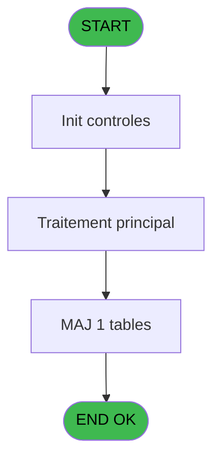

# PBG IDE 104 - Determination Affectation

> **Analyse**: Phases 1-4 2026-02-03 09:24 -> 09:24 (20s) | Assemblage 09:24
> **Pipeline**: V7.2 Enrichi
> **Structure**: 4 onglets (Resume | Ecrans | Donnees | Connexions)

<!-- TAB:Resume -->

## 1. FICHE D'IDENTITE

| Attribut | Valeur |
|----------|--------|
| Projet | PBG |
| IDE Position | 104 |
| Nom Programme | Determination Affectation |
| Fichier source | `Prg_104.xml` |
| Domaine metier | General |
| Taches | 7 (0 ecrans visibles) |
| Tables modifiees | 1 |
| Programmes appeles | 1 |

## 2. DESCRIPTION FONCTIONNELLE

**Determination Affectation** assure la gestion complete de ce processus, accessible depuis [Affectation logement (IDE 98)](PBG-IDE-98.md).

Le flux de traitement s'organise en **3 blocs fonctionnels** :

- **Traitement** (5 taches) : traitements metier divers
- **Creation** (1 tache) : insertion d'enregistrements en base (mouvements, prestations)
- **Consultation** (1 tache) : ecrans de recherche, selection et consultation

**Donnees modifiees** : 1 tables en ecriture (hebergement______heb).

Detail : phases du traitement

#### Phase 1 : Traitement (5 taches)

- **104** - Determination Affectation
- **104.2** - Eclatage Hebergement
- **104.2.1** - Lecture Hebergement
- **104.2.2** - Mise à Jour Charnière
- **104.3** - Modification Hebergement

#### Phase 2 : Consultation (1 tache)

- **104.1** - Selection Date **[[ECRAN]](#ecran-t2)**

#### Phase 3 : Creation (1 tache)

- **104.2.3** - Creation Charnière

#### Tables impactees

| Table | Operations | Role metier |
|-------|-----------|-------------|
| hebergement______heb | R/**W** (4 usages) | Hebergement (chambres) |

## 3. BLOCS FONCTIONNELS

### 3.1 Traitement (5 taches)

Traitements internes.

---

#### 104 - Determination Affectation

**Role** : Traitement : Determination Affectation.

4 sous-taches directes

| Tache | Nom | Bloc |
|-------|-----|------|
| [104.2](#t3) | Eclatage Hebergement | Traitement |
| [104.2.1](#t4) | Lecture Hebergement | Traitement |
| [104.2.2](#t5) | Mise à Jour Charnière | Traitement |
| [104.3](#t8) | Modification Hebergement | Traitement |

---

#### 104.2 - Eclatage Hebergement

**Role** : Traitement : Eclatage Hebergement.

---

#### 104.2.1 - Lecture Hebergement

**Role** : Traitement : Lecture Hebergement.

---

#### 104.2.2 - Mise à Jour Charnière

**Role** : Traitement : Mise à Jour Charnière.
**Variables liees** : S (W0-Date Charnière), T (W0-Heure Charnière)

---

#### 104.3 - Modification Hebergement

**Role** : Traitement : Modification Hebergement.

### 3.2 Consultation (1 tache)

Ecrans de recherche et consultation.

---

#### 104.1 - Selection Date [[ECRAN]](#ecran-t2)

**Role** : Selection par l'operateur : Selection Date.
**Ecran** : 450 x 84 DLU (MDI) | [Voir mockup](#ecran-t2)
**Variables liees** : Q (P0.Date charniere), F (P0-Date Debut), H (P0-Date Fin), J (P0-Selection Choix), S (W0-Date Charnière)

### 3.3 Creation (1 tache)

Insertion de nouveaux enregistrements en base.

---

#### 104.2.3 - Creation Charnière

**Role** : Creation d'enregistrement : Creation Charnière.
**Variables liees** : S (W0-Date Charnière), T (W0-Heure Charnière)

## 5. REGLES METIER

*(Aucune regle metier identifiee)*

## 6. CONTEXTE

- **Appele par**: [Affectation logement (IDE 98)](PBG-IDE-98.md)
- **Appelle**: 1 programmes | **Tables**: 1 (W:1 R:1 L:0) | **Taches**: 7 | **Expressions**: 4

<!-- TAB:Ecrans -->

## 8. ECRANS

*(Programme sans ecran visible)*

## 9. NAVIGATION

### 9.3 Structure hierarchique (7 taches)

| Position | Tache | Type | Dimensions | Bloc |
|----------|-------|------|------------|------|
| **104.1** | [**Determination Affectation** (104)](#t1) | MDI | - | Traitement |
| 104.1.1 | [Eclatage Hebergement (104.2)](#t3) | MDI | - | |
| 104.1.2 | [Lecture Hebergement (104.2.1)](#t4) | MDI | - | |
| 104.1.3 | [Mise à Jour Charnière (104.2.2)](#t5) | MDI | - | |
| 104.1.4 | [Modification Hebergement (104.3)](#t8) | MDI | - | |
| **104.2** | [**Selection Date** (104.1)](#t2) [mockup](#ecran-t2) | MDI | 450x84 | Consultation |
| **104.3** | [**Creation Charnière** (104.2.3)](#t6) | MDI | - | Creation |

### 9.4 Algorigramme

> **Legende**: Vert = START/END OK | Rouge = END KO | Bleu = Decisions
> *Algorigramme auto-genere. Utiliser `/algorigramme` pour une synthese metier detaillee.*

<!-- TAB:Donnees -->

## 10. TABLES

### Tables utilisees (1)

| ID | Nom | Description | Type | R | W | L | Usages |
|----|-----|-------------|------|---|---|---|--------|
| 34 | hebergement______heb | Hebergement (chambres) | DB | R | **W** |   | 4 |

### Colonnes par table (0 / 1 tables avec colonnes identifiees)

Table 34 - hebergement______heb (R/**W**) - 4 usages

*Table utilisee uniquement en Link ou aucune colonne Real identifiee dans le DataView.*

## 11. VARIABLES

### 11.1 Parametres entrants (1)

Variables recues du programme appelant ([Affectation logement (IDE 98)](PBG-IDE-98.md)).

| Lettre | Nom | Type | Usage dans |
|--------|-----|------|-----------|
| Q | P0.Date charniere | Date | 3x parametre entrant |

### 11.2 Autres (19)

Variables diverses.

| Lettre | Nom | Type | Usage dans |
|--------|-----|------|-----------|
| A | P0-Code Societe | Alpha | - |
| B | P0-Code Langue | Alpha | - |
| C | P0-Societe | Alpha | - |
| D | P0-Numero Compte | Numeric | - |
| E | P0-Filiation Compte | Numeric | - |
| F | P0-Date Debut | Date | 2x refs |
| G | P0-Heure Debut | Alpha | - |
| H | P0-Date Fin | Date | - |
| I | P0-Heure Fin | Alpha | - |
| J | P0-Selection Choix | Alpha | - |
| K | P0-Nom Recherche | Alpha | - |
| L | P0-Nom Logement | Alpha | 1x refs |
| M | P0-Occupation Std | Numeric | - |
| N | P0-Type Remplissage | Alpha | - |
| O | P0-Type Occupation | Alpha | - |
| P | P0-Logement | Alpha | - |
| R | W0-Accord Suite | Logical | 2x refs |
| S | W0-Date Charnière | Date | - |
| T | W0-Heure Charnière | Alpha | - |

Toutes les 20 variables (liste complete)

| Cat | Lettre | Nom Variable | Type |
|-----|--------|--------------|------|
| P0 | **Q** | P0.Date charniere | Date |
| Autre | **A** | P0-Code Societe | Alpha |
| Autre | **B** | P0-Code Langue | Alpha |
| Autre | **C** | P0-Societe | Alpha |
| Autre | **D** | P0-Numero Compte | Numeric |
| Autre | **E** | P0-Filiation Compte | Numeric |
| Autre | **F** | P0-Date Debut | Date |
| Autre | **G** | P0-Heure Debut | Alpha |
| Autre | **H** | P0-Date Fin | Date |
| Autre | **I** | P0-Heure Fin | Alpha |
| Autre | **J** | P0-Selection Choix | Alpha |
| Autre | **K** | P0-Nom Recherche | Alpha |
| Autre | **L** | P0-Nom Logement | Alpha |
| Autre | **M** | P0-Occupation Std | Numeric |
| Autre | **N** | P0-Type Remplissage | Alpha |
| Autre | **O** | P0-Type Occupation | Alpha |
| Autre | **P** | P0-Logement | Alpha |
| Autre | **R** | W0-Accord Suite | Logical |
| Autre | **S** | W0-Date Charnière | Date |
| Autre | **T** | W0-Heure Charnière | Alpha |

## 12. EXPRESSIONS

**4 / 4 expressions decodees (100%)**

### 12.1 Repartition par type

| Type | Expressions | Regles |
|------|-------------|--------|
| OTHER | 2 | 0 |
| CONDITION | 2 | 0 |

### 12.2 Expressions cles par type

#### OTHER (2 expressions)

| Type | IDE | Expression | Regle |
|------|-----|------------|-------|
| OTHER | 4 | `P0-Nom Logement [L]` | - |
| OTHER | 1 | `P0.Date charniere [Q]` | - |

#### CONDITION (2 expressions)

| Type | IDE | Expression | Regle |
|------|-----|------------|-------|
| CONDITION | 3 | `P0.Date charniere [Q] AND W0-Accord Suite [R]=P0-Date Debut [F]` | - |
| CONDITION | 2 | `P0.Date charniere [Q] AND W0-Accord Suite [R]<>P0-Date Debut [F]` | - |

<!-- TAB:Connexions -->

## 13. GRAPHE D'APPELS

### 13.1 Chaine depuis Main (Callers)

Main -> ... -> [Affectation logement (IDE 98)](PBG-IDE-98.md) -> **Determination Affectation (IDE 104)**

### 13.2 Callers

| IDE | Nom Programme | Nb Appels |
|-----|---------------|-----------|
| [98](PBG-IDE-98.md) | Affectation logement | 1 |

### 13.3 Callees (programmes appeles)

### 13.4 Detail Callees avec contexte

| IDE | Nom Programme | Appels | Contexte |
|-----|---------------|--------|----------|
| [101](PBG-IDE-101.md) | Verification Adherents | 1 | Controle/validation |

## 14. RECOMMANDATIONS MIGRATION

### 14.1 Profil du programme

| Metrique | Valeur | Impact migration |
|----------|--------|-----------------|
| Lignes de logique | 172 | Programme compact |
| Expressions | 4 | Peu de logique |
| Tables WRITE | 1 | Impact faible |
| Sous-programmes | 1 | Peu de dependances |
| Ecrans visibles | 0 | Ecran unique ou traitement batch |
| Code desactive | 0% (0 / 172) | Code sain |
| Regles metier | 0 | Pas de regle identifiee |

### 14.2 Plan de migration par bloc

#### Traitement (5 taches: 0 ecran, 5 traitements)

- **Strategie** : 5 service(s) backend injectable(s) (Domain Services).
- 1 sous-programme(s) a migrer ou a reutiliser depuis les services existants.
- Decomposer les taches en services unitaires testables.

#### Consultation (1 tache: 1 ecran, 0 traitement)

- **Strategie** : Composants de recherche/selection en modales.
- 1 ecran : Selection Date

#### Creation (1 tache: 0 ecran, 1 traitement)

- **Strategie** : Repository pattern avec Entity Framework Core.
- Insertion via `IRepository<T>.CreateAsync()`

### 14.3 Dependances critiques

| Dependance | Type | Appels | Impact |
|------------|------|--------|--------|
| hebergement______heb | Table WRITE (Database) | 3x | Schema + repository |
| [Verification Adherents (IDE 101)](PBG-IDE-101.md) | Sous-programme | 1x | Normale - Controle/validation |

---
*Spec DETAILED generee par Pipeline V7.2 - 2026-02-03 09:24*
