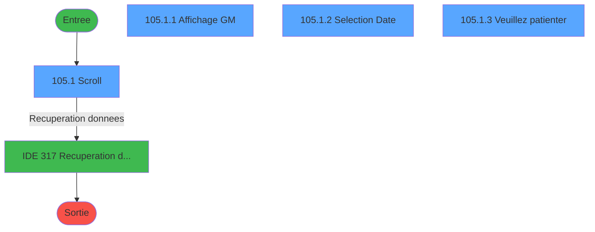
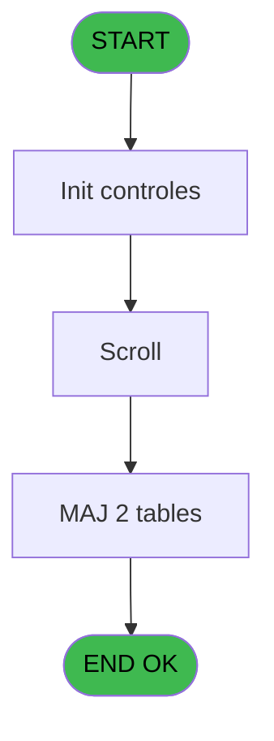
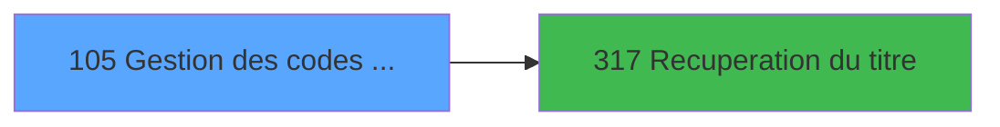

# PBG IDE 105 - Gestion des codes circuits

> **Analyse**: Phases 1-4 2026-02-03 09:24 -> 09:25 (20s) | Assemblage 09:25
> **Pipeline**: V7.2 Enrichi
> **Structure**: 4 onglets (Resume | Ecrans | Donnees | Connexions)

<!-- TAB:Resume -->

## 1. FICHE D'IDENTITE

| Attribut | Valeur |
|----------|--------|
| Projet | PBG |
| IDE Position | 105 |
| Nom Programme | Gestion des codes circuits |
| Fichier source | `Prg_105.xml` |
| Domaine metier | General |
| Taches | 6 (4 ecrans visibles) |
| Tables modifiees | 2 |
| Programmes appeles | 1 |
| :warning: Statut | **ORPHELIN_POTENTIEL** |

## 2. DESCRIPTION FONCTIONNELLE

**Gestion des codes circuits** assure la gestion complete de ce processus.

Le flux de traitement s'organise en **2 blocs fonctionnels** :

- **Traitement** (4 taches) : traitements metier divers
- **Consultation** (2 taches) : ecrans de recherche, selection et consultation

**Donnees modifiees** : 2 tables en ecriture (code_circuit, heb_circuit______hci).

Detail : phases du traitement

#### Phase 1 : Traitement (4 taches)

- **105** - Gestion Code-Circuit
- **105.1** - Scroll **[[ECRAN]](#ecran-t2)**
- **105.1.3** - Veuillez patienter **[[ECRAN]](#ecran-t5)**
- **105.1.3.1** - Modification Hebergement H

Delegue a : [Recuperation du titre (IDE 317)](PBG-IDE-317.md)

#### Phase 2 : Consultation (2 taches)

- **105.1.1** - Affichage GM **[[ECRAN]](#ecran-t3)**
- **105.1.2** - Selection Date **[[ECRAN]](#ecran-t4)**

Delegue a : [Recuperation du titre (IDE 317)](PBG-IDE-317.md)

#### Tables impactees

| Table | Operations | Role metier |
|-------|-----------|-------------|
| heb_circuit______hci | **W**/L (3 usages) | Hebergement (chambres) |
| code_circuit | **W** (1 usages) |  |

## 3. BLOCS FONCTIONNELS

### 3.1 Traitement (4 taches)

Traitements internes.

---

#### 105 - Gestion Code-Circuit

**Role** : Gestion du moyen de paiement : Gestion Code-Circuit.

3 sous-taches directes

| Tache | Nom | Bloc |
|-------|-----|------|
| [105.1](#t2) | Scroll **[[ECRAN]](#ecran-t2)** | Traitement |
| [105.1.3](#t5) | Veuillez patienter **[[ECRAN]](#ecran-t5)** | Traitement |
| [105.1.3.1](#t6) | Modification Hebergement H | Traitement |

**Delegue a** : [Recuperation du titre (IDE 317)](PBG-IDE-317.md)

---

#### 105.1 - Scroll [[ECRAN]](#ecran-t2)

**Role** : Traitement : Scroll.
**Ecran** : 1261 x 284 DLU (MDI) | [Voir mockup](#ecran-t2)
**Variables liees** : D (W0-Scroll vide)
**Delegue a** : [Recuperation du titre (IDE 317)](PBG-IDE-317.md)

---

#### 105.1.3 - Veuillez patienter [[ECRAN]](#ecran-t5)

**Role** : Traitement : Veuillez patienter.
**Ecran** : 422 x 56 DLU (MDI) | [Voir mockup](#ecran-t5)
**Delegue a** : [Recuperation du titre (IDE 317)](PBG-IDE-317.md)

---

#### 105.1.3.1 - Modification Hebergement H

**Role** : Traitement : Modification Hebergement H.
**Delegue a** : [Recuperation du titre (IDE 317)](PBG-IDE-317.md)

### 3.2 Consultation (2 taches)

Ecrans de recherche et consultation.

---

#### 105.1.1 - Affichage GM [[ECRAN]](#ecran-t3)

**Role** : Reinitialisation : Affichage GM.
**Ecran** : 394 x 230 DLU (MDI) | [Voir mockup](#ecran-t3)

---

#### 105.1.2 - Selection Date [[ECRAN]](#ecran-t4)

**Role** : Selection par l'operateur : Selection Date.
**Ecran** : 434 x 97 DLU (MDI) | [Voir mockup](#ecran-t4)
**Variables liees** : C (W0-Date)

## 5. REGLES METIER

*(Aucune regle metier identifiee)*

## 6. CONTEXTE

- **Appele par**: (aucun)
- **Appelle**: 1 programmes | **Tables**: 3 (W:2 R:1 L:1) | **Taches**: 6 | **Expressions**: 4

<!-- TAB:Ecrans -->

## 8. ECRANS

### 8.1 Forms visibles (4 / 6)

| # | Position | Tache | Nom | Type | Largeur | Hauteur | Bloc |
|---|----------|-------|-----|------|---------|---------|------|
| 1 | 105.1 | 105.1 | Scroll | MDI | 1261 | 284 | Traitement |
| 2 | 105.1.1 | 105.1.1 | Affichage GM | MDI | 394 | 230 | Consultation |
| 3 | 105.1.2 | 105.1.2 | Selection Date | MDI | 434 | 97 | Consultation |
| 4 | 105.1.3 | 105.1.3 | Veuillez patienter | MDI | 422 | 56 | Traitement |

### 8.2 Mockups Ecrans

---

#### 105.1 - Scroll
**Tache** : [105.1](#t2) | **Type** : MDI | **Dimensions** : 1261 x 284 DLU
**Bloc** : Traitement | **Titre IDE** : Scroll

<!-- FORM-DATA:
{
    "width":  1261,
    "vFactor":  8,
    "type":  "MDI",
    "hFactor":  8,
    "controls":  [
                     {
                         "x":  0,
                         "type":  "label",
                         "var":  "",
                         "y":  4,
                         "w":  1259,
                         "fmt":  "",
                         "name":  "",
                         "h":  21,
                         "color":  "",
                         "text":  "",
                         "parent":  null
                     },
                     {
                         "x":  0,
                         "type":  "table",
                         "var":  "",
                         "name":  "",
                         "titleH":  12,
                         "color":  "110",
                         "w":  869,
                         "y":  32,
                         "fmt":  "",
                         "parent":  null,
                         "text":  "",
                         "rowH":  16,
                         "h":  219,
                         "cols":  [
                                      {
                                          "title":  "Code Circuit",
                                          "layer":  1,
                                          "w":  106
                                      },
                                      {
                                          "title":  "Libellé",
                                          "layer":  2,
                                          "w":  223
                                      },
                                      {
                                          "title":  "Dates",
                                          "layer":  3,
                                          "w":  506
                                      }
                                  ],
                         "rows":  3
                     },
                     {
                         "x":  2,
                         "type":  "label",
                         "var":  "",
                         "y":  258,
                         "w":  1254,
                         "fmt":  "",
                         "name":  "",
                         "h":  24,
                         "color":  "",
                         "text":  "",
                         "parent":  null
                     },
                     {
                         "x":  14,
                         "type":  "edit",
                         "var":  "",
                         "y":  50,
                         "w":  75,
                         "fmt":  "",
                         "name":  "",
                         "h":  8,
                         "color":  "110",
                         "text":  "",
                         "parent":  4
                     },
                     {
                         "x":  110,
                         "type":  "edit",
                         "var":  "",
                         "y":  50,
                         "w":  211,
                         "fmt":  "",
                         "name":  "",
                         "h":  8,
                         "color":  "110",
                         "text":  "",
                         "parent":  4
                     },
                     {
                         "x":  384,
                         "type":  "edit",
                         "var":  "",
                         "y":  50,
                         "w":  120,
                         "fmt":  "DD/MM/YYYYT",
                         "name":  "",
                         "h":  8,
                         "color":  "110",
                         "text":  "",
                         "parent":  4
                     },
                     {
                         "x":  534,
                         "type":  "edit",
                         "var":  "",
                         "y":  50,
                         "w":  30,
                         "fmt":  "",
                         "name":  "",
                         "h":  8,
                         "color":  "110",
                         "text":  "",
                         "parent":  4
                     },
                     {
                         "x":  634,
                         "type":  "edit",
                         "var":  "",
                         "y":  50,
                         "w":  109,
                         "fmt":  "DD/MM/YYYYT",
                         "name":  "",
                         "h":  8,
                         "color":  "110",
                         "text":  "",
                         "parent":  4
                     },
                     {
                         "x":  778,
                         "type":  "edit",
                         "var":  "",
                         "y":  50,
                         "w":  30,
                         "fmt":  "",
                         "name":  "",
                         "h":  8,
                         "color":  "110",
                         "text":  "",
                         "parent":  4
                     },
                     {
                         "x":  6,
                         "type":  "edit",
                         "var":  "",
                         "y":  10,
                         "w":  267,
                         "fmt":  "20",
                         "name":  "",
                         "h":  8,
                         "color":  "",
                         "text":  "",
                         "parent":  null
                     },
                     {
                         "x":  1048,
                         "type":  "edit",
                         "var":  "",
                         "y":  10,
                         "w":  203,
                         "fmt":  "WWW DD MMM YYYYT",
                         "name":  "",
                         "h":  8,
                         "color":  "",
                         "text":  "",
                         "parent":  null
                     },
                     {
                         "x":  342,
                         "type":  "edit",
                         "var":  "",
                         "y":  50,
                         "w":  38,
                         "fmt":  "4",
                         "name":  "",
                         "h":  8,
                         "color":  "110",
                         "text":  "",
                         "parent":  4
                     },
                     {
                         "x":  510,
                         "type":  "edit",
                         "var":  "",
                         "y":  50,
                         "w":  19,
                         "fmt":  "2",
                         "name":  "",
                         "h":  8,
                         "color":  "110",
                         "text":  "",
                         "parent":  4
                     },
                     {
                         "x":  570,
                         "type":  "edit",
                         "var":  "",
                         "y":  50,
                         "w":  53,
                         "fmt":  "4",
                         "name":  "",
                         "h":  8,
                         "color":  "110",
                         "text":  "",
                         "parent":  4
                     },
                     {
                         "x":  750,
                         "type":  "edit",
                         "var":  "",
                         "y":  50,
                         "w":  19,
                         "fmt":  "1",
                         "name":  "",
                         "h":  8,
                         "color":  "110",
                         "text":  "",
                         "parent":  4
                     },
                     {
                         "x":  806,
                         "type":  "edit",
                         "var":  "",
                         "y":  50,
                         "w":  19,
                         "fmt":  "1",
                         "name":  "",
                         "h":  8,
                         "color":  "110",
                         "text":  "",
                         "parent":  4
                     },
                     {
                         "x":  13,
                         "type":  "button",
                         "var":  "",
                         "y":  261,
                         "w":  154,
                         "fmt":  "\u0026Quitter",
                         "name":  "",
                         "h":  18,
                         "color":  "",
                         "text":  "",
                         "parent":  null
                     },
                     {
                         "x":  720,
                         "type":  "button",
                         "var":  "",
                         "y":  261,
                         "w":  154,
                         "fmt":  "\u0026Visualisation",
                         "name":  "",
                         "h":  18,
                         "color":  "",
                         "text":  "",
                         "parent":  null
                     },
                     {
                         "x":  904,
                         "type":  "button",
                         "var":  "",
                         "y":  261,
                         "w":  154,
                         "fmt":  "\u0026Modification",
                         "name":  "",
                         "h":  18,
                         "color":  "",
                         "text":  "",
                         "parent":  null
                     },
                     {
                         "x":  1089,
                         "type":  "button",
                         "var":  "",
                         "y":  261,
                         "w":  154,
                         "fmt":  "\u0026Date",
                         "name":  "",
                         "h":  18,
                         "color":  "",
                         "text":  "",
                         "parent":  null
                     },
                     {
                         "x":  869,
                         "type":  "subform",
                         "var":  "",
                         "y":  29,
                         "w":  392,
                         "fmt":  "",
                         "name":  "AFFIGM",
                         "h":  226,
                         "color":  "",
                         "text":  "",
                         "parent":  null
                     }
                 ],
    "taskId":  "105.1",
    "height":  284
}
-->

<strong>Champs : 13 champs</strong>

| Pos (x,y) | Nom | Variable | Type |
|-----------|-----|----------|------|
| 14,50 | (sans nom) | - | edit |
| 110,50 | (sans nom) | - | edit |
| 384,50 | DD/MM/YYYYT | - | edit |
| 534,50 | (sans nom) | - | edit |
| 634,50 | DD/MM/YYYYT | - | edit |
| 778,50 | (sans nom) | - | edit |
| 6,10 | 20 | - | edit |
| 1048,10 | WWW DD MMM YYYYT | - | edit |
| 342,50 | 4 | - | edit |
| 510,50 | 2 | - | edit |
| 570,50 | 4 | - | edit |
| 750,50 | 1 | - | edit |
| 806,50 | 1 | - | edit |

<strong>Boutons : 4 boutons</strong>

| Bouton | Pos (x,y) | Action |
|--------|-----------|--------|
| Quitter | 13,261 | Quitte le programme |
| Visualisation | 720,261 | Bouton fonctionnel |
| Modification | 904,261 | Modifie l'element |
| Date | 1089,261 | Bouton fonctionnel |

---

#### 105.1.1 - Affichage GM
**Tache** : [105.1.1](#t3) | **Type** : MDI | **Dimensions** : 394 x 230 DLU
**Bloc** : Consultation | **Titre IDE** : Affichage GM

<!-- FORM-DATA:
{
    "width":  394,
    "vFactor":  8,
    "type":  "MDI",
    "hFactor":  8,
    "controls":  [
                     {
                         "x":  4,
                         "type":  "table",
                         "var":  "",
                         "name":  "",
                         "titleH":  12,
                         "color":  "110",
                         "w":  373,
                         "y":  4,
                         "fmt":  "",
                         "parent":  null,
                         "text":  "",
                         "rowH":  19,
                         "h":  220,
                         "cols":  [
                                      {
                                          "title":  "Nom",
                                          "layer":  1,
                                          "w":  340
                                      }
                                  ],
                         "rows":  1
                     },
                     {
                         "x":  34,
                         "type":  "edit",
                         "var":  "",
                         "y":  23,
                         "w":  309,
                         "fmt":  "30",
                         "name":  "",
                         "h":  8,
                         "color":  "110",
                         "text":  "",
                         "parent":  1
                     }
                 ],
    "taskId":  "105.1.1",
    "height":  230
}
-->

<strong>Champs : 1 champs</strong>

| Pos (x,y) | Nom | Variable | Type |
|-----------|-----|----------|------|
| 34,23 | 30 | - | edit |

---

#### 105.1.2 - Selection Date
**Tache** : [105.1.2](#t4) | **Type** : MDI | **Dimensions** : 434 x 97 DLU
**Bloc** : Consultation | **Titre IDE** : Selection Date

<!-- FORM-DATA:
{
    "width":  434,
    "vFactor":  8,
    "type":  "MDI",
    "hFactor":  8,
    "controls":  [
                     {
                         "x":  203,
                         "type":  "label",
                         "var":  "",
                         "y":  18,
                         "w":  202,
                         "fmt":  "",
                         "name":  "",
                         "h":  27,
                         "color":  "",
                         "text":  "",
                         "parent":  null
                     },
                     {
                         "x":  1,
                         "type":  "label",
                         "var":  "",
                         "y":  72,
                         "w":  427,
                         "fmt":  "",
                         "name":  "",
                         "h":  22,
                         "color":  "",
                         "text":  "",
                         "parent":  null
                     },
                     {
                         "x":  222,
                         "type":  "edit",
                         "var":  "",
                         "y":  26,
                         "w":  126,
                         "fmt":  "",
                         "name":  "W2 date",
                         "h":  11,
                         "color":  "110",
                         "text":  "",
                         "parent":  2
                     },
                     {
                         "x":  355,
                         "type":  "button",
                         "var":  "",
                         "y":  26,
                         "w":  33,
                         "fmt":  "...",
                         "name":  "Btn date",
                         "h":  11,
                         "color":  "",
                         "text":  "",
                         "parent":  2
                     },
                     {
                         "x":  2,
                         "type":  "image",
                         "var":  "",
                         "y":  1,
                         "w":  160,
                         "fmt":  "",
                         "name":  "",
                         "h":  62,
                         "color":  "",
                         "text":  "",
                         "parent":  null
                     },
                     {
                         "x":  7,
                         "type":  "button",
                         "var":  "",
                         "y":  74,
                         "w":  154,
                         "fmt":  "\u0026Ok",
                         "name":  "",
                         "h":  18,
                         "color":  "",
                         "text":  "",
                         "parent":  null
                     },
                     {
                         "x":  167,
                         "type":  "button",
                         "var":  "",
                         "y":  74,
                         "w":  154,
                         "fmt":  "A\u0026bandonner",
                         "name":  "",
                         "h":  18,
                         "color":  "",
                         "text":  "",
                         "parent":  null
                     }
                 ],
    "taskId":  "105.1.2",
    "height":  97
}
-->

<strong>Champs : 1 champs</strong>

| Pos (x,y) | Nom | Variable | Type |
|-----------|-----|----------|------|
| 222,26 | W2 date | - | edit |

<strong>Boutons : 3 boutons</strong>

| Bouton | Pos (x,y) | Action |
|--------|-----------|--------|
| ... | 355,26 | Bouton fonctionnel |
| Ok | 7,74 | Valide la saisie et enregistre |
| Abandonner | 167,74 | Annule et retour au menu |

---

#### 105.1.3 - Veuillez patienter
**Tache** : [105.1.3](#t5) | **Type** : MDI | **Dimensions** : 422 x 56 DLU
**Bloc** : Traitement | **Titre IDE** : Veuillez patienter

<!-- FORM-DATA:
{
    "width":  422,
    "vFactor":  8,
    "type":  "MDI",
    "hFactor":  8,
    "controls":  [
                     {
                         "x":  0,
                         "type":  "label",
                         "var":  "",
                         "y":  0,
                         "w":  423,
                         "fmt":  "",
                         "name":  "",
                         "h":  29,
                         "color":  "",
                         "text":  "",
                         "parent":  null
                     },
                     {
                         "x":  120,
                         "type":  "label",
                         "var":  "",
                         "y":  10,
                         "w":  221,
                         "fmt":  "",
                         "name":  "",
                         "h":  8,
                         "color":  "7",
                         "text":  "Traitement en cours ...",
                         "parent":  null
                     },
                     {
                         "x":  0,
                         "type":  "label",
                         "var":  "",
                         "y":  29,
                         "w":  423,
                         "fmt":  "",
                         "name":  "",
                         "h":  27,
                         "color":  "",
                         "text":  "",
                         "parent":  null
                     },
                     {
                         "x":  72,
                         "type":  "label",
                         "var":  "",
                         "y":  38,
                         "w":  280,
                         "fmt":  "",
                         "name":  "",
                         "h":  8,
                         "color":  "",
                         "text":  "Modification circuits",
                         "parent":  null
                     },
                     {
                         "x":  4,
                         "type":  "image",
                         "var":  "",
                         "y":  2,
                         "w":  72,
                         "fmt":  "",
                         "name":  "",
                         "h":  25,
                         "color":  "",
                         "text":  "",
                         "parent":  null
                     }
                 ],
    "taskId":  "105.1.3",
    "height":  56
}
-->

## 9. NAVIGATION

### 9.1 Enchainement des ecrans

**Detail par enchainement :**

| Depuis | Action | Vers | Retour |
|--------|--------|------|--------|
| Scroll | Recuperation donnees | [Recuperation du titre (IDE 317)](PBG-IDE-317.md) | Retour ecran |

### 9.3 Structure hierarchique (6 taches)

| Position | Tache | Type | Dimensions | Bloc |
|----------|-------|------|------------|------|
| **105.1** | [**Gestion Code-Circuit** (105)](#t1) | MDI | - | Traitement |
| 105.1.1 | [Scroll (105.1)](#t2) [mockup](#ecran-t2) | MDI | 1261x284 | |
| 105.1.2 | [Veuillez patienter (105.1.3)](#t5) [mockup](#ecran-t5) | MDI | 422x56 | |
| 105.1.3 | [Modification Hebergement H (105.1.3.1)](#t6) | MDI | - | |
| **105.2** | [**Affichage GM** (105.1.1)](#t3) [mockup](#ecran-t3) | MDI | 394x230 | Consultation |
| 105.2.1 | [Selection Date (105.1.2)](#t4) [mockup](#ecran-t4) | MDI | 434x97 | |

### 9.4 Algorigramme

> **Legende**: Vert = START/END OK | Rouge = END KO | Bleu = Decisions
> *Algorigramme auto-genere. Utiliser `/algorigramme` pour une synthese metier detaillee.*

<!-- TAB:Donnees -->

## 10. TABLES

### Tables utilisees (3)

| ID | Nom | Description | Type | R | W | L | Usages |
|----|-----|-------------|------|---|---|---|--------|
| 31 | gm-complet_______gmc |  | DB | R |   |   | 1 |
| 127 | code_circuit |  | DB |   | **W** |   | 1 |
| 168 | heb_circuit______hci | Hebergement (chambres) | DB |   | **W** | L | 3 |

### Colonnes par table (2 / 3 tables avec colonnes identifiees)

Table 31 - gm-complet_______gmc (R) - 1 usages

*Table utilisee uniquement en Link ou aucune colonne Real identifiee dans le DataView.*

Table 127 - code_circuit (**W**) - 1 usages

| Lettre | Variable | Acces | Type |
|--------|----------|-------|------|
| B | W0-Direction Circuit | W | Alpha |

Table 168 - heb_circuit______hci (**W**/L) - 3 usages

| Lettre | Variable | Acces | Type |
|--------|----------|-------|------|
| A | W4 hebergement apres | W | Numeric |
| B | W4 hebergement avant | W | Numeric |

## 11. VARIABLES

### 11.1 Variables de travail (3)

Variables internes au programme.

| Lettre | Nom | Type | Usage dans |
|--------|-----|------|-----------|
| F | W0 fin programme | Logical | 1x calcul interne |
| G | W0 fin tâche+1 | Logical | - |
| H | W0. titre ecran | Alpha | - |

### 11.2 Autres (5)

Variables diverses.

| Lettre | Nom | Type | Usage dans |
|--------|-----|------|-----------|
| A | W0-Choix | Alpha | - |
| B | W0-Direction Circuit | Alpha | - |
| C | W0-Date | Date | - |
| D | W0-Scroll vide | Alpha | - |
| E | W0-MDCC | Alpha | - |

## 12. EXPRESSIONS

**4 / 4 expressions decodees (100%)**

### 12.1 Repartition par type

| Type | Expressions | Regles |
|------|-------------|--------|
| CONSTANTE | 1 | 0 |
| DATE | 1 | 0 |
| CAST_LOGIQUE | 1 | 0 |
| OTHER | 1 | 0 |

### 12.2 Expressions cles par type

#### CONSTANTE (1 expressions)

| Type | IDE | Expression | Regle |
|------|-----|------------|-------|
| CONSTANTE | 4 | `'MDCC'` | - |

#### DATE (1 expressions)

| Type | IDE | Expression | Regle |
|------|-----|------------|-------|
| DATE | 3 | `Date ()+2` | - |

#### CAST_LOGIQUE (1 expressions)

| Type | IDE | Expression | Regle |
|------|-----|------------|-------|
| CAST_LOGIQUE | 1 | `'FALSE'LOG` | - |

#### OTHER (1 expressions)

| Type | IDE | Expression | Regle |
|------|-----|------------|-------|
| OTHER | 2 | `W0 fin programme [F]` | - |

<!-- TAB:Connexions -->

## 13. GRAPHE D'APPELS

### 13.1 Chaine depuis Main (Callers)

**Chemin**: (pas de callers directs)

### 13.2 Callers

| IDE | Nom Programme | Nb Appels |
|-----|---------------|-----------|
| - | (aucun) | - |

### 13.3 Callees (programmes appeles)

### 13.4 Detail Callees avec contexte

| IDE | Nom Programme | Appels | Contexte |
|-----|---------------|--------|----------|
| [317](PBG-IDE-317.md) | Recuperation du titre | 1 | Recuperation donnees |

## 14. RECOMMANDATIONS MIGRATION

### 14.1 Profil du programme

| Metrique | Valeur | Impact migration |
|----------|--------|-----------------|
| Lignes de logique | 98 | Programme compact |
| Expressions | 4 | Peu de logique |
| Tables WRITE | 2 | Impact faible |
| Sous-programmes | 1 | Peu de dependances |
| Ecrans visibles | 4 | Quelques ecrans |
| Code desactive | 1% (1 / 98) | Code sain |
| Regles metier | 0 | Pas de regle identifiee |

### 14.2 Plan de migration par bloc

#### Traitement (4 taches: 2 ecrans, 2 traitements)

- **Strategie** : Orchestrateur avec 2 ecrans (Razor/React) et 2 traitements backend (services).
- Les ecrans deviennent des composants UI, les traitements invisibles deviennent des services injectables.
- 1 sous-programme(s) a migrer ou a reutiliser depuis les services existants.
- Decomposer les taches en services unitaires testables.

#### Consultation (2 taches: 2 ecrans, 0 traitement)

- **Strategie** : Composants de recherche/selection en modales.
- 2 ecrans : Affichage GM, Selection Date

### 14.3 Dependances critiques

| Dependance | Type | Appels | Impact |
|------------|------|--------|--------|
| code_circuit | Table WRITE (Database) | 1x | Schema + repository |
| heb_circuit______hci | Table WRITE (Database) | 2x | Schema + repository |
| [Recuperation du titre (IDE 317)](PBG-IDE-317.md) | Sous-programme | 1x | Normale - Recuperation donnees |

---
*Spec DETAILED generee par Pipeline V7.2 - 2026-02-03 09:25*
