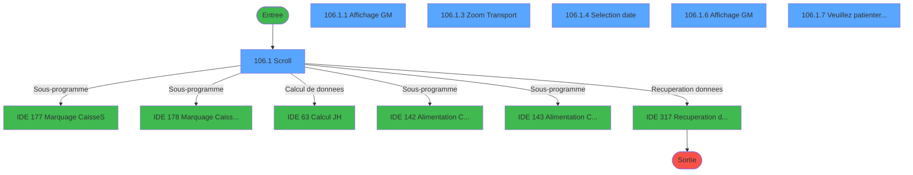
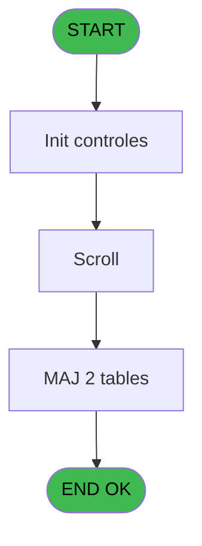
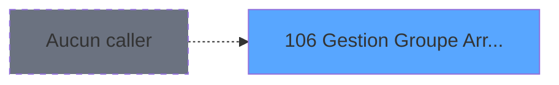
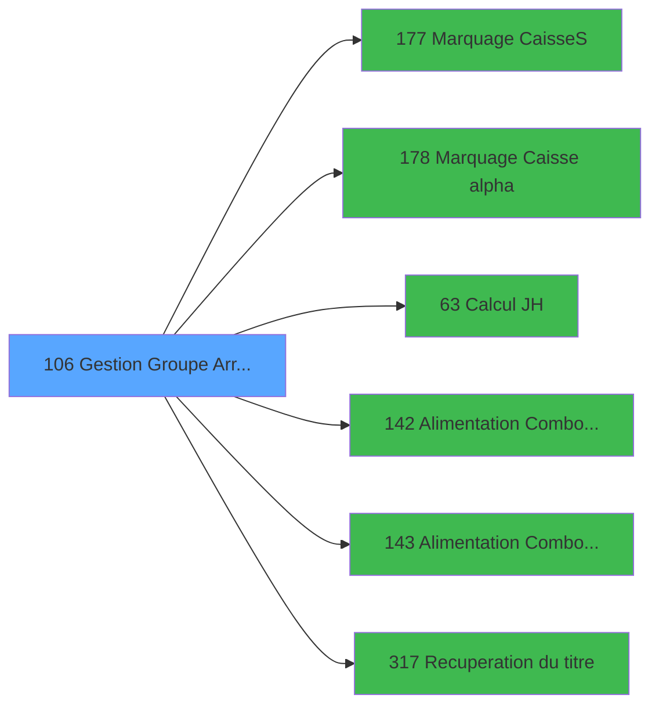

# PBG IDE 106 - Gestion Groupe Arr/dep pms-656

> **Analyse**: Phases 1-4 2026-02-03 09:25 -> 09:25 (19s) | Assemblage 09:25
> **Pipeline**: V7.2 Enrichi
> **Structure**: 4 onglets (Resume | Ecrans | Donnees | Connexions)

<!-- TAB:Resume -->

## 1. FICHE D'IDENTITE

| Attribut | Valeur |
|----------|--------|
| Projet | PBG |
| IDE Position | 106 |
| Nom Programme | Gestion Groupe Arr/dep pms-656 |
| Fichier source | `Prg_106.xml` |
| Domaine metier | General |
| Taches | 17 (6 ecrans visibles) |
| Tables modifiees | 2 |
| Programmes appeles | 6 |
| :warning: Statut | **ORPHELIN_POTENTIEL** |

## 2. DESCRIPTION FONCTIONNELLE

**Gestion Groupe Arr/dep pms-656** assure la gestion complete de ce processus.

Le flux de traitement s'organise en **2 blocs fonctionnels** :

- **Traitement** (13 taches) : traitements metier divers
- **Consultation** (4 taches) : ecrans de recherche, selection et consultation

**Donnees modifiees** : 2 tables en ecriture (hebergement______heb, groupe_arr_dep___vol).

Detail : phases du traitement

#### Phase 1 : Traitement (13 taches)

- **106** - Gestion Code-Vols **[[ECRAN]](#ecran-t1)**
- **106.1** - Scroll **[[ECRAN]](#ecran-t2)**
- **106.1.2** - Veuillez patienter ... **[[ECRAN]](#ecran-t4)**
- **106.1.2.1** - Modification Hebergement H **[[ECRAN]](#ecran-t5)**
- **106.1.2.2** - Modification Hebergement H
- **106.1.3.1** - Modif Hebergement **[[ECRAN]](#ecran-t8)**
- **106.1.5** - Modification sens **[[ECRAN]](#ecran-t11)**
- **106.2** - Suppression Groupe
- **106.1.7** - Veuillez patienter ... **[[ECRAN]](#ecran-t18)**
- **106.1.7.1** - Modification Hebergement H **[[ECRAN]](#ecran-t19)**
- **106.1.7.2** - Modification Hebergement H
- **106.1.3.2** - Modif Hebergement **[[ECRAN]](#ecran-t23)**
- **106.1.6.1** - Génére Package H

Delegue a : [Marquage Caisse(S) (IDE 177)](PBG-IDE-177.md), [Marquage Caisse alpha (IDE 178)](PBG-IDE-178.md), [  Alimentation Combo HEURE (IDE 142)](PBG-IDE-142.md), [  Alimentation Combo TRANSPORT (IDE 143)](PBG-IDE-143.md), [Recuperation du titre (IDE 317)](PBG-IDE-317.md)

#### Phase 2 : Consultation (4 taches)

- **106.1.1** - Affichage GM **[[ECRAN]](#ecran-t3)**
- **106.1.3** - Zoom Transport **[[ECRAN]](#ecran-t7)**
- **106.1.4** - Selection date **[[ECRAN]](#ecran-t10)**
- **106.1.6** - Affichage GM **[[ECRAN]](#ecran-t15)**

Delegue a : [Recuperation du titre (IDE 317)](PBG-IDE-317.md)

#### Tables impactees

| Table | Operations | Role metier |
|-------|-----------|-------------|
| hebergement______heb | **W** (11 usages) | Hebergement (chambres) |
| groupe_arr_dep___vol | R/**W** (3 usages) |  |

## 3. BLOCS FONCTIONNELS

### 3.1 Traitement (13 taches)

Traitements internes.

---

#### 106 - Gestion Code-Vols [[ECRAN]](#ecran-t1)

**Role** : Tache d'orchestration : point d'entree du programme (13 sous-taches). Coordonne l'enchainement des traitements.
**Ecran** : 1126 x 214 DLU (MDI) | [Voir mockup](#ecran-t1)

12 sous-taches directes

| Tache | Nom | Bloc |
|-------|-----|------|
| [106.1](#t2) | Scroll **[[ECRAN]](#ecran-t2)** | Traitement |
| [106.1.2](#t4) | Veuillez patienter ... **[[ECRAN]](#ecran-t4)** | Traitement |
| [106.1.2.1](#t5) | Modification Hebergement H **[[ECRAN]](#ecran-t5)** | Traitement |
| [106.1.2.2](#t6) | Modification Hebergement H | Traitement |
| [106.1.3.1](#t8) | Modif Hebergement **[[ECRAN]](#ecran-t8)** | Traitement |
| [106.1.5](#t11) | Modification sens **[[ECRAN]](#ecran-t11)** | Traitement |
| [106.2](#t12) | Suppression Groupe | Traitement |
| [106.1.7](#t18) | Veuillez patienter ... **[[ECRAN]](#ecran-t18)** | Traitement |
| [106.1.7.1](#t19) | Modification Hebergement H **[[ECRAN]](#ecran-t19)** | Traitement |
| [106.1.7.2](#t20) | Modification Hebergement H | Traitement |
| [106.1.3.2](#t23) | Modif Hebergement **[[ECRAN]](#ecran-t23)** | Traitement |
| [106.1.6.1](#t25) | Génére Package H | Traitement |

---

#### 106.1 - Scroll [[ECRAN]](#ecran-t2)

**Role** : Traitement : Scroll.
**Ecran** : 1569 x 266 DLU (MDI) | [Voir mockup](#ecran-t2)

---

#### 106.1.2 - Veuillez patienter ... [[ECRAN]](#ecran-t4)

**Role** : Traitement : Veuillez patienter ....
**Ecran** : 422 x 58 DLU (MDI) | [Voir mockup](#ecran-t4)

---

#### 106.1.2.1 - Modification Hebergement H [[ECRAN]](#ecran-t5)

**Role** : Traitement : Modification Hebergement H.
**Ecran** : 158 x 18 DLU (MDI) | [Voir mockup](#ecran-t5)

---

#### 106.1.2.2 - Modification Hebergement H

**Role** : Traitement : Modification Hebergement H.

---

#### 106.1.3.1 - Modif Hebergement [[ECRAN]](#ecran-t8)

**Role** : Traitement : Modif Hebergement.
**Ecran** : 577 x 174 DLU (MDI) | [Voir mockup](#ecran-t8)

---

#### 106.1.5 - Modification sens [[ECRAN]](#ecran-t11)

**Role** : Traitement : Modification sens.
**Ecran** : 378 x 73 DLU (MDI) | [Voir mockup](#ecran-t11)

---

#### 106.2 - Suppression Groupe

**Role** : Traitement : Suppression Groupe.
**Variables liees** : J (W0 suppressionl origine)

---

#### 106.1.7 - Veuillez patienter ... [[ECRAN]](#ecran-t18)

**Role** : Traitement : Veuillez patienter ....
**Ecran** : 422 x 58 DLU (MDI) | [Voir mockup](#ecran-t18)

---

#### 106.1.7.1 - Modification Hebergement H [[ECRAN]](#ecran-t19)

**Role** : Traitement : Modification Hebergement H.
**Ecran** : 158 x 18 DLU (MDI) | [Voir mockup](#ecran-t19)

---

#### 106.1.7.2 - Modification Hebergement H

**Role** : Traitement : Modification Hebergement H.

---

#### 106.1.3.2 - Modif Hebergement [[ECRAN]](#ecran-t23)

**Role** : Traitement : Modif Hebergement.
**Ecran** : 577 x 174 DLU (MDI) | [Voir mockup](#ecran-t23)

---

#### 106.1.6.1 - Génére Package H

**Role** : Traitement : Génére Package H.

### 3.2 Consultation (4 taches)

Ecrans de recherche et consultation.

---

#### 106.1.1 - Affichage GM [[ECRAN]](#ecran-t3)

**Role** : Reinitialisation : Affichage GM.
**Ecran** : 653 x 150 DLU (Modal) | [Voir mockup](#ecran-t3)

---

#### 106.1.3 - Zoom Transport [[ECRAN]](#ecran-t7)

**Role** : Selection par l'operateur : Zoom Transport.
**Ecran** : 461 x 181 DLU (MDI) | [Voir mockup](#ecran-t7)
**Variables liees** : P (W0 combo transport)

---

#### 106.1.4 - Selection date [[ECRAN]](#ecran-t10)

**Role** : Selection par l'operateur : Selection date.
**Ecran** : 418 x 95 DLU (MDI) | [Voir mockup](#ecran-t10)
**Variables liees** : B (W0-Date)

---

#### 106.1.6 - Affichage GM [[ECRAN]](#ecran-t15)

**Role** : Reinitialisation : Affichage GM.
**Ecran** : 654 x 148 DLU (Modal) | [Voir mockup](#ecran-t15)

## 5. REGLES METIER

*(Aucune regle metier identifiee)*

## 6. CONTEXTE

- **Appele par**: (aucun)
- **Appelle**: 6 programmes | **Tables**: 6 (W:2 R:1 L:4) | **Taches**: 17 | **Expressions**: 17

<!-- TAB:Ecrans -->

## 8. ECRANS

### 8.1 Forms visibles (6 / 17)

| # | Position | Tache | Nom | Type | Largeur | Hauteur | Bloc |
|---|----------|-------|-----|------|---------|---------|------|
| 1 | 106.1 | 106.1 | Scroll | MDI | 1569 | 266 | Traitement |
| 2 | 106.1.1 | 106.1.1 | Affichage GM | Modal | 653 | 150 | Consultation |
| 3 | 106.1.5 | 106.1.3 | Zoom Transport | MDI | 461 | 181 | Consultation |
| 4 | 106.1.6 | 106.1.4 | Selection date | MDI | 418 | 95 | Consultation |
| 5 | 106.1.2 | 106.1.6 | Affichage GM | Modal | 654 | 148 | Consultation |
| 6 | 106.1.4 | 106.1.7 | Veuillez patienter ... | MDI | 422 | 58 | Traitement |

### 8.2 Mockups Ecrans

---

#### 106.1 - Scroll
**Tache** : [106.1](#t2) | **Type** : MDI | **Dimensions** : 1569 x 266 DLU
**Bloc** : Traitement | **Titre IDE** : Scroll

<!-- FORM-DATA:
{
    "width":  1569,
    "vFactor":  8,
    "type":  "MDI",
    "hFactor":  8,
    "controls":  [
                     {
                         "x":  0,
                         "type":  "label",
                         "var":  "",
                         "y":  0,
                         "w":  1563,
                         "fmt":  "",
                         "name":  "",
                         "h":  21,
                         "color":  "",
                         "text":  "",
                         "parent":  null
                     },
                     {
                         "x":  606,
                         "type":  "label",
                         "var":  "",
                         "y":  30,
                         "w":  317,
                         "fmt":  "",
                         "name":  "",
                         "h":  33,
                         "color":  "",
                         "text":  "",
                         "parent":  null
                     },
                     {
                         "x":  631,
                         "type":  "label",
                         "var":  "",
                         "y":  36,
                         "w":  77,
                         "fmt":  "",
                         "name":  "",
                         "h":  10,
                         "color":  "118",
                         "text":  "Groupe",
                         "parent":  6
                     },
                     {
                         "x":  631,
                         "type":  "label",
                         "var":  "",
                         "y":  48,
                         "w":  125,
                         "fmt":  "",
                         "name":  "",
                         "h":  10,
                         "color":  "118",
                         "text":  "Date du vol",
                         "parent":  6
                     },
                     {
                         "x":  3,
                         "type":  "table",
                         "var":  "",
                         "name":  "",
                         "titleH":  12,
                         "color":  "110",
                         "w":  872,
                         "y":  76,
                         "fmt":  "",
                         "parent":  null,
                         "text":  "",
                         "rowH":  15,
                         "h":  141,
                         "cols":  [
                                      {
                                          "title":  "Code",
                                          "layer":  1,
                                          "w":  128
                                      },
                                      {
                                          "title":  "Ville",
                                          "layer":  2,
                                          "w":  75
                                      },
                                      {
                                          "title":  "Transport",
                                          "layer":  3,
                                          "w":  305
                                      },
                                      {
                                          "title":  "Heure",
                                          "layer":  4,
                                          "w":  113
                                      },
                                      {
                                          "title":  "Libération",
                                          "layer":  5,
                                          "w":  93
                                      },
                                      {
                                          "title":  "Départ village",
                                          "layer":  6,
                                          "w":  122
                                      }
                                  ],
                         "rows":  6
                     },
                     {
                         "x":  0,
                         "type":  "label",
                         "var":  "",
                         "y":  239,
                         "w":  1563,
                         "fmt":  "",
                         "name":  "",
                         "h":  24,
                         "color":  "",
                         "text":  "",
                         "parent":  null
                     },
                     {
                         "x":  563,
                         "type":  "label",
                         "var":  "",
                         "y":  225,
                         "w":  469,
                         "fmt":  "",
                         "name":  "",
                         "h":  9,
                         "color":  "143",
                         "text":  "Les effectifs seront recalculés en quittant cet écran",
                         "parent":  null
                     },
                     {
                         "x":  8,
                         "type":  "label",
                         "var":  "",
                         "y":  225,
                         "w":  174,
                         "fmt":  "",
                         "name":  "",
                         "h":  10,
                         "color":  "",
                         "text":  "Durée transfert ...",
                         "parent":  null
                     },
                     {
                         "x":  13,
                         "type":  "edit",
                         "var":  "",
                         "y":  92,
                         "w":  40,
                         "fmt":  "U4",
                         "name":  "VOL Compagnie",
                         "h":  12,
                         "color":  "110",
                         "text":  "",
                         "parent":  11
                     },
                     {
                         "x":  59,
                         "type":  "edit",
                         "var":  "",
                         "y":  92,
                         "w":  48,
                         "fmt":  "",
                         "name":  "VOL Code Vol",
                         "h":  12,
                         "color":  "110",
                         "text":  "",
                         "parent":  11
                     },
                     {
                         "x":  137,
                         "type":  "edit",
                         "var":  "",
                         "y":  92,
                         "w":  67,
                         "fmt":  "",
                         "name":  "VOL Ville",
                         "h":  12,
                         "color":  "110",
                         "text":  "",
                         "parent":  11
                     },
                     {
                         "x":  212,
                         "type":  "combobox",
                         "var":  "",
                         "y":  91,
                         "w":  297,
                         "fmt":  "",
                         "name":  "VOL Transport",
                         "h":  12,
                         "color":  "110",
                         "text":  "1,2",
                         "parent":  11
                     },
                     {
                         "x":  520,
                         "type":  "combobox",
                         "var":  "",
                         "y":  92,
                         "w":  60,
                         "fmt":  "",
                         "name":  "v.Heure",
                         "h":  12,
                         "color":  "110",
                         "text":  "11,22",
                         "parent":  11
                     },
                     {
                         "x":  632,
                         "type":  "edit",
                         "var":  "",
                         "y":  92,
                         "w":  85,
                         "fmt":  "HH:MMZ",
                         "name":  "heure liberation",
                         "h":  12,
                         "color":  "110",
                         "text":  "",
                         "parent":  11
                     },
                     {
                         "x":  745,
                         "type":  "combobox",
                         "var":  "",
                         "y":  92,
                         "w":  63,
                         "fmt":  "",
                         "name":  "vol_heure_village",
                         "h":  12,
                         "color":  "110",
                         "text":  "",
                         "parent":  11
                     },
                     {
                         "x":  318,
                         "type":  "button",
                         "var":  "",
                         "y":  242,
                         "w":  154,
                         "fmt":  "\u0026Creation",
                         "name":  "Bouton creation",
                         "h":  18,
                         "color":  "",
                         "text":  "",
                         "parent":  null
                     },
                     {
                         "x":  1080,
                         "type":  "button",
                         "var":  "",
                         "y":  242,
                         "w":  154,
                         "fmt":  "Visu \u0026GM",
                         "name":  "Bouton Affic GM",
                         "h":  18,
                         "color":  "",
                         "text":  "",
                         "parent":  null
                     },
                     {
                         "x":  6,
                         "type":  "edit",
                         "var":  "",
                         "y":  6,
                         "w":  267,
                         "fmt":  "20",
                         "name":  "",
                         "h":  8,
                         "color":  "",
                         "text":  "",
                         "parent":  null
                     },
                     {
                         "x":  1333,
                         "type":  "edit",
                         "var":  "",
                         "y":  6,
                         "w":  203,
                         "fmt":  "WWW DD MMM YYYYT",
                         "name":  "",
                         "h":  8,
                         "color":  "",
                         "text":  "",
                         "parent":  null
                     },
                     {
                         "x":  288,
                         "type":  "image",
                         "var":  "",
                         "y":  22,
                         "w":  154,
                         "fmt":  "",
                         "name":  "",
                         "h":  48,
                         "color":  "",
                         "text":  "",
                         "parent":  null
                     },
                     {
                         "x":  1091,
                         "type":  "image",
                         "var":  "",
                         "y":  24,
                         "w":  136,
                         "fmt":  "",
                         "name":  "",
                         "h":  46,
                         "color":  "",
                         "text":  "",
                         "parent":  null
                     },
                     {
                         "x":  763,
                         "type":  "edit",
                         "var":  "",
                         "y":  36,
                         "w":  138,
                         "fmt":  "10",
                         "name":  "",
                         "h":  10,
                         "color":  "118",
                         "text":  "",
                         "parent":  6
                     },
                     {
                         "x":  763,
                         "type":  "edit",
                         "var":  "",
                         "y":  48,
                         "w":  139,
                         "fmt":  "DD/MM/YYYYT",
                         "name":  "",
                         "h":  10,
                         "color":  "118",
                         "text":  "",
                         "parent":  6
                     },
                     {
                         "x":  587,
                         "type":  "edit",
                         "var":  "",
                         "y":  94,
                         "w":  35,
                         "fmt":  "3",
                         "name":  "",
                         "h":  8,
                         "color":  "110",
                         "text":  "",
                         "parent":  11
                     },
                     {
                         "x":  1395,
                         "type":  "button",
                         "var":  "",
                         "y":  242,
                         "w":  154,
                         "fmt":  "\u0026Quitter",
                         "name":  "",
                         "h":  18,
                         "color":  "",
                         "text":  "",
                         "parent":  null
                     },
                     {
                         "x":  8,
                         "type":  "button",
                         "var":  "",
                         "y":  242,
                         "w":  154,
                         "fmt":  "\u0026Visualisation",
                         "name":  "",
                         "h":  18,
                         "color":  "",
                         "text":  "",
                         "parent":  null
                     },
                     {
                         "x":  926,
                         "type":  "button",
                         "var":  "",
                         "y":  242,
                         "w":  154,
                         "fmt":  "\u0026Regroupement",
                         "name":  "",
                         "h":  18,
                         "color":  "",
                         "text":  "",
                         "parent":  null
                     },
                     {
                         "x":  163,
                         "type":  "button",
                         "var":  "",
                         "y":  242,
                         "w":  154,
                         "fmt":  "\u0026Modification",
                         "name":  "",
                         "h":  18,
                         "color":  "",
                         "text":  "",
                         "parent":  null
                     },
                     {
                         "x":  616,
                         "type":  "button",
                         "var":  "",
                         "y":  242,
                         "w":  154,
                         "fmt":  "\u0026Selection",
                         "name":  "S",
                         "h":  18,
                         "color":  "",
                         "text":  "",
                         "parent":  null
                     },
                     {
                         "x":  771,
                         "type":  "button",
                         "var":  "",
                         "y":  242,
                         "w":  154,
                         "fmt":  "\u0026Date",
                         "name":  "",
                         "h":  18,
                         "color":  "",
                         "text":  "",
                         "parent":  null
                     },
                     {
                         "x":  894,
                         "type":  "subform",
                         "var":  "",
                         "y":  71,
                         "w":  655,
                         "fmt":  "",
                         "name":  "AFFIGM",
                         "h":  149,
                         "color":  "",
                         "text":  "",
                         "parent":  null
                     },
                     {
                         "x":  891,
                         "type":  "subform",
                         "var":  "",
                         "y":  71,
                         "w":  659,
                         "fmt":  "",
                         "name":  "AFFIGMTRA",
                         "h":  149,
                         "color":  "",
                         "text":  "",
                         "parent":  null
                     },
                     {
                         "x":  189,
                         "type":  "edit",
                         "var":  "",
                         "y":  225,
                         "w":  51,
                         "fmt":  "",
                         "name":  "v.Durée transfert retour",
                         "h":  10,
                         "color":  "",
                         "text":  "",
                         "parent":  null
                     }
                 ],
    "taskId":  "106.1",
    "height":  266
}
-->

<strong>Champs : 13 champs</strong>

| Pos (x,y) | Nom | Variable | Type |
|-----------|-----|----------|------|
| 13,92 | VOL Compagnie | - | edit |
| 59,92 | VOL Code Vol | - | edit |
| 137,92 | VOL Ville | - | edit |
| 212,91 | VOL Transport | - | combobox |
| 520,92 | v.Heure | - | combobox |
| 632,92 | heure liberation | - | edit |
| 745,92 | vol_heure_village | - | combobox |
| 6,6 | 20 | - | edit |
| 1333,6 | WWW DD MMM YYYYT | - | edit |
| 763,36 | 10 | - | edit |
| 763,48 | DD/MM/YYYYT | - | edit |
| 587,94 | 3 | - | edit |
| 189,225 | v.Durée transfert retour | - | edit |

<strong>Boutons : 8 boutons</strong>

| Bouton | Pos (x,y) | Action |
|--------|-----------|--------|
| Creation | 318,242 | Bouton fonctionnel |
| Visu GM | 1080,242 | Bouton fonctionnel |
| Quitter | 1395,242 | Quitte le programme |
| Visualisation | 8,242 | Bouton fonctionnel |
| Regroupement | 926,242 | Bouton fonctionnel |
| Modification | 163,242 | Modifie l'element |
| Selection | 616,242 | Ouvre la selection |
| Date | 771,242 | Bouton fonctionnel |

---

#### 106.1.1 - Affichage GM
**Tache** : [106.1.1](#t3) | **Type** : Modal | **Dimensions** : 653 x 150 DLU
**Bloc** : Consultation | **Titre IDE** : Affichage GM

<!-- FORM-DATA:
{
    "width":  653,
    "vFactor":  8,
    "type":  "Modal",
    "hFactor":  8,
    "controls":  [
                     {
                         "x":  2,
                         "type":  "table",
                         "var":  "",
                         "name":  "",
                         "titleH":  12,
                         "color":  "110",
                         "w":  651,
                         "y":  6,
                         "fmt":  "",
                         "parent":  null,
                         "text":  "",
                         "rowH":  14,
                         "h":  143,
                         "cols":  [
                                      {
                                          "title":  "Titre",
                                          "layer":  1,
                                          "w":  46
                                      },
                                      {
                                          "title":  "Nom",
                                          "layer":  2,
                                          "w":  180
                                      },
                                      {
                                          "title":  "Prénom",
                                          "layer":  3,
                                          "w":  142
                                      },
                                      {
                                          "title":  "Heure",
                                          "layer":  4,
                                          "w":  56
                                      },
                                      {
                                          "title":  "Départ village",
                                          "layer":  5,
                                          "w":  112
                                      },
                                      {
                                          "title":  "Libération",
                                          "layer":  6,
                                          "w":  81
                                      }
                                  ],
                         "rows":  6
                     },
                     {
                         "x":  14,
                         "type":  "edit",
                         "var":  "",
                         "y":  21,
                         "w":  26,
                         "fmt":  "",
                         "name":  "",
                         "h":  10,
                         "color":  "110",
                         "text":  "",
                         "parent":  1
                     },
                     {
                         "x":  54,
                         "type":  "edit",
                         "var":  "",
                         "y":  22,
                         "w":  174,
                         "fmt":  "",
                         "name":  "",
                         "h":  9,
                         "color":  "110",
                         "text":  "",
                         "parent":  1
                     },
                     {
                         "x":  236,
                         "type":  "edit",
                         "var":  "",
                         "y":  22,
                         "w":  133,
                         "fmt":  "",
                         "name":  "",
                         "h":  9,
                         "color":  "110",
                         "text":  "",
                         "parent":  1
                     },
                     {
                         "x":  385,
                         "type":  "edit",
                         "var":  "",
                         "y":  22,
                         "w":  26,
                         "fmt":  "2",
                         "name":  "",
                         "h":  9,
                         "color":  "110",
                         "text":  "",
                         "parent":  1
                     },
                     {
                         "x":  465,
                         "type":  "edit",
                         "var":  "",
                         "y":  21,
                         "w":  29,
                         "fmt":  "2",
                         "name":  "heb_heure_fin effectif",
                         "h":  10,
                         "color":  "110",
                         "text":  "",
                         "parent":  1
                     },
                     {
                         "x":  544,
                         "type":  "edit",
                         "var":  "",
                         "y":  21,
                         "w":  72,
                         "fmt":  "HH:MMZ",
                         "name":  "heb_liberation_chambre",
                         "h":  10,
                         "color":  "110",
                         "text":  "",
                         "parent":  1
                     }
                 ],
    "taskId":  "106.1.1",
    "height":  150
}
-->

<strong>Champs : 6 champs</strong>

| Pos (x,y) | Nom | Variable | Type |
|-----------|-----|----------|------|
| 14,21 | (sans nom) | - | edit |
| 54,22 | (sans nom) | - | edit |
| 236,22 | (sans nom) | - | edit |
| 385,22 | 2 | - | edit |
| 465,21 | heb_heure_fin effectif | - | edit |
| 544,21 | heb_liberation_chambre | - | edit |

---

#### 106.1.5 - Zoom Transport
**Tache** : [106.1.3](#t7) | **Type** : MDI | **Dimensions** : 461 x 181 DLU
**Bloc** : Consultation | **Titre IDE** : Zoom Transport

<!-- FORM-DATA:
{
    "width":  461,
    "vFactor":  8,
    "type":  "MDI",
    "hFactor":  8,
    "controls":  [
                     {
                         "x":  11,
                         "type":  "label",
                         "var":  "",
                         "y":  13,
                         "w":  436,
                         "fmt":  "",
                         "name":  "",
                         "h":  13,
                         "color":  "",
                         "text":  "",
                         "parent":  null
                     },
                     {
                         "x":  10,
                         "type":  "table",
                         "var":  "",
                         "name":  "",
                         "titleH":  12,
                         "color":  "196",
                         "w":  442,
                         "y":  25,
                         "fmt":  "",
                         "parent":  null,
                         "text":  "",
                         "rowH":  12,
                         "h":  102,
                         "cols":  [
                                      {
                                          "title":  "Code",
                                          "layer":  1,
                                          "w":  113
                                      },
                                      {
                                          "title":  "Transport",
                                          "layer":  2,
                                          "w":  114
                                      },
                                      {
                                          "title":  "Ville",
                                          "layer":  3,
                                          "w":  93
                                      },
                                      {
                                          "title":  "Heure",
                                          "layer":  4,
                                          "w":  85
                                      }
                                  ],
                         "rows":  4
                     },
                     {
                         "x":  0,
                         "type":  "label",
                         "var":  "",
                         "y":  158,
                         "w":  454,
                         "fmt":  "",
                         "name":  "",
                         "h":  19,
                         "color":  "",
                         "text":  "",
                         "parent":  null
                     },
                     {
                         "x":  163,
                         "type":  "label",
                         "var":  "",
                         "y":  15,
                         "w":  131,
                         "fmt":  "",
                         "name":  "",
                         "h":  8,
                         "color":  "142",
                         "text":  "Regrouper avec",
                         "parent":  null
                     },
                     {
                         "x":  43,
                         "type":  "edit",
                         "var":  "",
                         "y":  40,
                         "w":  75,
                         "fmt":  "",
                         "name":  "",
                         "h":  9,
                         "color":  "196",
                         "text":  "",
                         "parent":  2
                     },
                     {
                         "x":  255,
                         "type":  "edit",
                         "var":  "",
                         "y":  40,
                         "w":  75,
                         "fmt":  "",
                         "name":  "",
                         "h":  9,
                         "color":  "196",
                         "text":  "",
                         "parent":  2
                     },
                     {
                         "x":  136,
                         "type":  "edit",
                         "var":  "",
                         "y":  40,
                         "w":  98,
                         "fmt":  "8",
                         "name":  "",
                         "h":  9,
                         "color":  "196",
                         "text":  "",
                         "parent":  2
                     },
                     {
                         "x":  61,
                         "type":  "button",
                         "var":  "",
                         "y":  161,
                         "w":  144,
                         "fmt":  "\u0026Sélectionner",
                         "name":  "",
                         "h":  14,
                         "color":  "",
                         "text":  "",
                         "parent":  null
                     },
                     {
                         "x":  242,
                         "type":  "button",
                         "var":  "",
                         "y":  161,
                         "w":  149,
                         "fmt":  "\u0026Quitter",
                         "name":  "",
                         "h":  14,
                         "color":  "",
                         "text":  "",
                         "parent":  13
                     },
                     {
                         "x":  199,
                         "type":  "image",
                         "var":  "",
                         "y":  130,
                         "w":  58,
                         "fmt":  "",
                         "name":  "",
                         "h":  18,
                         "color":  "",
                         "text":  "",
                         "parent":  null
                     },
                     {
                         "x":  341,
                         "type":  "edit",
                         "var":  "",
                         "y":  40,
                         "w":  66,
                         "fmt":  "",
                         "name":  "vot_heure",
                         "h":  9,
                         "color":  "196",
                         "text":  "",
                         "parent":  2
                     },
                     {
                         "x":  16,
                         "type":  "edit",
                         "var":  "",
                         "y":  40,
                         "w":  27,
                         "fmt":  "",
                         "name":  "vot_compagnie",
                         "h":  9,
                         "color":  "196",
                         "text":  "",
                         "parent":  2
                     }
                 ],
    "taskId":  "106.1.5",
    "height":  181
}
-->

<strong>Champs : 5 champs</strong>

| Pos (x,y) | Nom | Variable | Type |
|-----------|-----|----------|------|
| 43,40 | (sans nom) | - | edit |
| 255,40 | (sans nom) | - | edit |
| 136,40 | 8 | - | edit |
| 341,40 | vot_heure | - | edit |
| 16,40 | vot_compagnie | - | edit |

<strong>Boutons : 2 boutons</strong>

| Bouton | Pos (x,y) | Action |
|--------|-----------|--------|
| Sélectionner | 61,161 | Bouton fonctionnel |
| Quitter | 242,161 | Quitte le programme |

---

#### 106.1.6 - Selection date
**Tache** : [106.1.4](#t10) | **Type** : MDI | **Dimensions** : 418 x 95 DLU
**Bloc** : Consultation | **Titre IDE** : Selection date

<!-- FORM-DATA:
{
    "width":  418,
    "vFactor":  8,
    "type":  "MDI",
    "hFactor":  8,
    "controls":  [
                     {
                         "x":  185,
                         "type":  "label",
                         "var":  "",
                         "y":  18,
                         "w":  202,
                         "fmt":  "",
                         "name":  "",
                         "h":  27,
                         "color":  "",
                         "text":  "",
                         "parent":  null
                     },
                     {
                         "x":  0,
                         "type":  "label",
                         "var":  "",
                         "y":  70,
                         "w":  414,
                         "fmt":  "",
                         "name":  "",
                         "h":  22,
                         "color":  "",
                         "text":  "",
                         "parent":  null
                     },
                     {
                         "x":  204,
                         "type":  "edit",
                         "var":  "",
                         "y":  28,
                         "w":  126,
                         "fmt":  "",
                         "name":  "W2 date",
                         "h":  10,
                         "color":  "110",
                         "text":  "",
                         "parent":  2
                     },
                     {
                         "x":  332,
                         "type":  "button",
                         "var":  "",
                         "y":  27,
                         "w":  33,
                         "fmt":  "...",
                         "name":  "Btn date",
                         "h":  12,
                         "color":  "",
                         "text":  "",
                         "parent":  2
                     },
                     {
                         "x":  0,
                         "type":  "image",
                         "var":  "",
                         "y":  0,
                         "w":  160,
                         "fmt":  "",
                         "name":  "",
                         "h":  62,
                         "color":  "",
                         "text":  "",
                         "parent":  null
                     },
                     {
                         "x":  6,
                         "type":  "button",
                         "var":  "",
                         "y":  72,
                         "w":  154,
                         "fmt":  "\u0026Ok",
                         "name":  "",
                         "h":  18,
                         "color":  "",
                         "text":  "",
                         "parent":  null
                     },
                     {
                         "x":  164,
                         "type":  "button",
                         "var":  "",
                         "y":  72,
                         "w":  154,
                         "fmt":  "A\u0026bandonner",
                         "name":  "",
                         "h":  18,
                         "color":  "",
                         "text":  "",
                         "parent":  null
                     }
                 ],
    "taskId":  "106.1.6",
    "height":  95
}
-->

<strong>Champs : 1 champs</strong>

| Pos (x,y) | Nom | Variable | Type |
|-----------|-----|----------|------|
| 204,28 | W2 date | - | edit |

<strong>Boutons : 3 boutons</strong>

| Bouton | Pos (x,y) | Action |
|--------|-----------|--------|
| ... | 332,27 | Bouton fonctionnel |
| Ok | 6,72 | Valide la saisie et enregistre |
| Abandonner | 164,72 | Annule et retour au menu |

---

#### 106.1.2 - Affichage GM
**Tache** : [106.1.6](#t15) | **Type** : Modal | **Dimensions** : 654 x 148 DLU
**Bloc** : Consultation | **Titre IDE** : Affichage GM

<!-- FORM-DATA:
{
    "width":  654,
    "vFactor":  8,
    "type":  "Modal",
    "hFactor":  8,
    "controls":  [
                     {
                         "x":  0,
                         "type":  "table",
                         "var":  "",
                         "name":  "",
                         "titleH":  12,
                         "color":  "110",
                         "w":  658,
                         "y":  5,
                         "fmt":  "",
                         "parent":  null,
                         "text":  "",
                         "rowH":  14,
                         "h":  142,
                         "cols":  [
                                      {
                                          "title":  "Titre",
                                          "layer":  1,
                                          "w":  40
                                      },
                                      {
                                          "title":  "Nom",
                                          "layer":  2,
                                          "w":  176
                                      },
                                      {
                                          "title":  "Prénom",
                                          "layer":  3,
                                          "w":  139
                                      },
                                      {
                                          "title":  "Heure",
                                          "layer":  4,
                                          "w":  56
                                      },
                                      {
                                          "title":  "Départ village",
                                          "layer":  5,
                                          "w":  111
                                      },
                                      {
                                          "title":  "Libération",
                                          "layer":  6,
                                          "w":  80
                                      },
                                      {
                                          "title":  "",
                                          "layer":  7,
                                          "w":  16
                                      }
                                  ],
                         "rows":  7
                     },
                     {
                         "x":  608,
                         "type":  "label",
                         "var":  "",
                         "y":  20,
                         "w":  16,
                         "fmt":  "",
                         "name":  "",
                         "h":  10,
                         "color":  "110",
                         "text":  "L",
                         "parent":  1
                     },
                     {
                         "x":  13,
                         "type":  "edit",
                         "var":  "",
                         "y":  21,
                         "w":  26,
                         "fmt":  "",
                         "name":  "",
                         "h":  9,
                         "color":  "110",
                         "text":  "",
                         "parent":  1
                     },
                     {
                         "x":  45,
                         "type":  "edit",
                         "var":  "",
                         "y":  21,
                         "w":  185,
                         "fmt":  "",
                         "name":  "",
                         "h":  9,
                         "color":  "110",
                         "text":  "",
                         "parent":  1
                     },
                     {
                         "x":  221,
                         "type":  "edit",
                         "var":  "",
                         "y":  21,
                         "w":  133,
                         "fmt":  "",
                         "name":  "",
                         "h":  9,
                         "color":  "110",
                         "text":  "",
                         "parent":  1
                     },
                     {
                         "x":  370,
                         "type":  "edit",
                         "var":  "",
                         "y":  21,
                         "w":  26,
                         "fmt":  "2",
                         "name":  "",
                         "h":  9,
                         "color":  "110",
                         "text":  "",
                         "parent":  1
                     },
                     {
                         "x":  437,
                         "type":  "edit",
                         "var":  "",
                         "y":  21,
                         "w":  29,
                         "fmt":  "2",
                         "name":  "heb_heure_fin effectif",
                         "h":  9,
                         "color":  "110",
                         "text":  "",
                         "parent":  1
                     },
                     {
                         "x":  530,
                         "type":  "edit",
                         "var":  "",
                         "y":  20,
                         "w":  64,
                         "fmt":  "HH:MMZ",
                         "name":  "heb_liberation_chambre",
                         "h":  10,
                         "color":  "110",
                         "text":  "",
                         "parent":  1
                     }
                 ],
    "taskId":  "106.1.2",
    "height":  148
}
-->

<strong>Champs : 6 champs</strong>

| Pos (x,y) | Nom | Variable | Type |
|-----------|-----|----------|------|
| 13,21 | (sans nom) | - | edit |
| 45,21 | (sans nom) | - | edit |
| 221,21 | (sans nom) | - | edit |
| 370,21 | 2 | - | edit |
| 437,21 | heb_heure_fin effectif | - | edit |
| 530,20 | heb_liberation_chambre | - | edit |

---

#### 106.1.4 - Veuillez patienter ...
**Tache** : [106.1.7](#t18) | **Type** : MDI | **Dimensions** : 422 x 58 DLU
**Bloc** : Traitement | **Titre IDE** : Veuillez patienter ...

<!-- FORM-DATA:
{
    "width":  422,
    "vFactor":  8,
    "type":  "MDI",
    "hFactor":  8,
    "controls":  [
                     {
                         "x":  0,
                         "type":  "label",
                         "var":  "",
                         "y":  0,
                         "w":  423,
                         "fmt":  "",
                         "name":  "",
                         "h":  29,
                         "color":  "",
                         "text":  "",
                         "parent":  null
                     },
                     {
                         "x":  120,
                         "type":  "label",
                         "var":  "",
                         "y":  10,
                         "w":  221,
                         "fmt":  "",
                         "name":  "",
                         "h":  8,
                         "color":  "7",
                         "text":  "Traitement en cours ...",
                         "parent":  null
                     },
                     {
                         "x":  0,
                         "type":  "label",
                         "var":  "",
                         "y":  29,
                         "w":  423,
                         "fmt":  "",
                         "name":  "",
                         "h":  27,
                         "color":  "",
                         "text":  "",
                         "parent":  null
                     },
                     {
                         "x":  72,
                         "type":  "label",
                         "var":  "",
                         "y":  38,
                         "w":  280,
                         "fmt":  "",
                         "name":  "",
                         "h":  8,
                         "color":  "",
                         "text":  "Modification en cours",
                         "parent":  null
                     },
                     {
                         "x":  4,
                         "type":  "image",
                         "var":  "",
                         "y":  2,
                         "w":  72,
                         "fmt":  "",
                         "name":  "",
                         "h":  25,
                         "color":  "",
                         "text":  "",
                         "parent":  null
                     }
                 ],
    "taskId":  "106.1.4",
    "height":  58
}
-->

## 9. NAVIGATION

### 9.1 Enchainement des ecrans

**Detail par enchainement :**

| Depuis | Action | Vers | Retour |
|--------|--------|------|--------|
| Scroll | Sous-programme | [Marquage Caisse(S) (IDE 177)](PBG-IDE-177.md) | Retour ecran |
| Scroll | Sous-programme | [Marquage Caisse alpha (IDE 178)](PBG-IDE-178.md) | Retour ecran |
| Scroll | Calcul de donnees | [Calcul JH (IDE 63)](PBG-IDE-63.md) | Retour ecran |
| Scroll | Sous-programme | [  Alimentation Combo HEURE (IDE 142)](PBG-IDE-142.md) | Retour ecran |
| Scroll | Sous-programme | [  Alimentation Combo TRANSPORT (IDE 143)](PBG-IDE-143.md) | Retour ecran |
| Scroll | Recuperation donnees | [Recuperation du titre (IDE 317)](PBG-IDE-317.md) | Retour ecran |

### 9.3 Structure hierarchique (17 taches)

| Position | Tache | Type | Dimensions | Bloc |
|----------|-------|------|------------|------|
| **106.1** | [**Gestion Code-Vols** (106)](#t1) [mockup](#ecran-t1) | MDI | 1126x214 | Traitement |
| 106.1.1 | [Scroll (106.1)](#t2) [mockup](#ecran-t2) | MDI | 1569x266 | |
| 106.1.2 | [Veuillez patienter ... (106.1.2)](#t4) [mockup](#ecran-t4) | MDI | 422x58 | |
| 106.1.3 | [Modification Hebergement H (106.1.2.1)](#t5) [mockup](#ecran-t5) | MDI | 158x18 | |
| 106.1.4 | [Modification Hebergement H (106.1.2.2)](#t6) | MDI | - | |
| 106.1.5 | [Modif Hebergement (106.1.3.1)](#t8) [mockup](#ecran-t8) | MDI | 577x174 | |
| 106.1.6 | [Modification sens (106.1.5)](#t11) [mockup](#ecran-t11) | MDI | 378x73 | |
| 106.1.7 | [Suppression Groupe (106.2)](#t12) | MDI | - | |
| 106.1.8 | [Veuillez patienter ... (106.1.7)](#t18) [mockup](#ecran-t18) | MDI | 422x58 | |
| 106.1.9 | [Modification Hebergement H (106.1.7.1)](#t19) [mockup](#ecran-t19) | MDI | 158x18 | |
| 106.1.10 | [Modification Hebergement H (106.1.7.2)](#t20) | MDI | - | |
| 106.1.11 | [Modif Hebergement (106.1.3.2)](#t23) [mockup](#ecran-t23) | MDI | 577x174 | |
| 106.1.12 | [Génére Package H (106.1.6.1)](#t25) | - | - | |
| **106.2** | [**Affichage GM** (106.1.1)](#t3) [mockup](#ecran-t3) | Modal | 653x150 | Consultation |
| 106.2.1 | [Zoom Transport (106.1.3)](#t7) [mockup](#ecran-t7) | MDI | 461x181 | |
| 106.2.2 | [Selection date (106.1.4)](#t10) [mockup](#ecran-t10) | MDI | 418x95 | |
| 106.2.3 | [Affichage GM (106.1.6)](#t15) [mockup](#ecran-t15) | Modal | 654x148 | |

### 9.4 Algorigramme

> **Legende**: Vert = START/END OK | Rouge = END KO | Bleu = Decisions
> *Algorigramme auto-genere. Utiliser `/algorigramme` pour une synthese metier detaillee.*

<!-- TAB:Donnees -->

## 10. TABLES

### Tables utilisees (6)

| ID | Nom | Description | Type | R | W | L | Usages |
|----|-----|-------------|------|---|---|---|--------|
| 31 | gm-complet_______gmc |  | DB |   |   | L | 2 |
| 34 | hebergement______heb | Hebergement (chambres) | DB |   | **W** |   | 11 |
| 112 | tables_paris |  | DB |   |   | L | 2 |
| 132 | code_vol_________vot |  | DB |   |   | L | 2 |
| 134 | groupe_arr_dep___vol |  | DB | R | **W** |   | 3 |
| 1025 | Table_1025 |  | MEM |   |   | L | 3 |

### Colonnes par table (3 / 2 tables avec colonnes identifiees)

Table 34 - hebergement______heb (**W**) - 11 usages

| Lettre | Variable | Acces | Type |
|--------|----------|-------|------|
| A | P.i..societe | W | Alpha |
| B | P.i.code_package | W | Alpha |
| C | P.i.nom_logement/code vol | W | Alpha |
| D | P.i.heure_vol | W | Numeric |
| E | P.i.date_debut | W | Date |
| F | A afficher? | W | Logical |
| G | v.Flag retour hébergement H | W | Logical |
| H | v.Heure libération | W | Time |

Table 134 - groupe_arr_dep___vol (R/**W**) - 3 usages

| Lettre | Variable | Acces | Type |
|--------|----------|-------|------|
| A | v.Liste Combo Heure | W | Alpha |
| B | v.liste Combo Transport | W | Alpha |
| C | W1 Fin | W | Logical |
| D | v.Heure | W | Alpha |
| E | v.Heure depart village | W | Alpha |
| F | W Retour lien groupe Aller ? | W | Logical |
| G | v.Vol déjà paramétré ? | W | Logical |
| H | v.Durée transfert heure | W | Numeric |
| I | v.Durée transfert time | W | Time |
| J | Bouton creation | W | Alpha |
| K | Bouton Affic GM | W | Alpha |
| L | v.Prev Heure Lib | W | Time |
| M | v.Modif Heures Differentes TRA2 | W | Numeric |
| N | CHG_REASON_v.Heure | W | Numeric |
| O | CHG_PRV_v.Heure | W | Alpha |
| P | CHG_REASON_v.Heure depart vill | W | Numeric |
| Q | CHG_PRV_v.Heure depart village | W | Alpha |
| R | CHG_REASON_heure liberation | W | Numeric |
| S | CHG_PRV_heure liberation | W | Time |

## 11. VARIABLES

### 11.1 Variables de travail (15)

Variables internes au programme.

| Lettre | Nom | Type | Usage dans |
|--------|-----|------|-----------|
| D | W0 B015 | Alpha | - |
| E | W0 B059 | Alpha | - |
| F | W0 B060 | Alpha | - |
| G | W0 B096 | Alpha | - |
| H | W0 T005 | Alpha | - |
| I | W0 titre | Alpha | - |
| J | W0 suppressionl origine | Logical | 1x calcul interne |
| K | W0 fin | Logical | 1x calcul interne |
| L | W0 fin tache 1 | Logical | - |
| M | W0 code vol | Alpha | - |
| N | W0 heure vol | Numeric | - |
| O | W0 societe vol | Alpha | - |
| P | W0 combo transport | Alpha | - |
| Q | W0 combo heure | Alpha | - |
| R | W0 recalcul effectif ? | Logical | - |

### 11.2 Autres (4)

Variables diverses.

| Lettre | Nom | Type | Usage dans |
|--------|-----|------|-----------|
| A | W0-Direction Vol | Alpha | - |
| B | W0-Date | Date | - |
| C | W0-MCV(A/R) | Alpha | - |
| S | CHG_PRV_heure liberation | Time | - |

Toutes les 19 variables (liste complete)

| Cat | Lettre | Nom Variable | Type |
|-----|--------|--------------|------|
| W0 | **D** | W0 B015 | Alpha |
| W0 | **E** | W0 B059 | Alpha |
| W0 | **F** | W0 B060 | Alpha |
| W0 | **G** | W0 B096 | Alpha |
| W0 | **H** | W0 T005 | Alpha |
| W0 | **I** | W0 titre | Alpha |
| W0 | **J** | W0 suppressionl origine | Logical |
| W0 | **K** | W0 fin | Logical |
| W0 | **L** | W0 fin tache 1 | Logical |
| W0 | **M** | W0 code vol | Alpha |
| W0 | **N** | W0 heure vol | Numeric |
| W0 | **O** | W0 societe vol | Alpha |
| W0 | **P** | W0 combo transport | Alpha |
| W0 | **Q** | W0 combo heure | Alpha |
| W0 | **R** | W0 recalcul effectif ? | Logical |
| Autre | **A** | W0-Direction Vol | Alpha |
| Autre | **B** | W0-Date | Date |
| Autre | **C** | W0-MCV(A/R) | Alpha |
| Autre | **S** | CHG_PRV_heure liberation | Time |

## 12. EXPRESSIONS

**17 / 17 expressions decodees (100%)**

### 12.1 Repartition par type

| Type | Expressions | Regles |
|------|-------------|--------|
| CONSTANTE | 6 | 0 |
| DATE | 3 | 0 |
| OTHER | 5 | 0 |
| CAST_LOGIQUE | 2 | 0 |
| REFERENCE_VG | 1 | 0 |

### 12.2 Expressions cles par type

#### CONSTANTE (6 expressions)

| Type | IDE | Expression | Regle |
|------|-----|------------|-------|
| CONSTANTE | 5 | `'B060'` | - |
| CONSTANTE | 6 | `'B096'` | - |
| CONSTANTE | 7 | `'T005'` | - |
| CONSTANTE | 1 | `'A'` | - |
| CONSTANTE | 3 | `'B015'` | - |
| ... | | *+1 autres* | |

#### DATE (3 expressions)

| Type | IDE | Expression | Regle |
|------|-----|------------|-------|
| DATE | 13 | `Date()-1` | - |
| DATE | 11 | `Date()` | - |
| DATE | 2 | `Date ()+2` | - |

#### OTHER (5 expressions)

| Type | IDE | Expression | Regle |
|------|-----|------------|-------|
| OTHER | 15 | `SetCrsr(2)` | - |
| OTHER | 16 | `SetCrsr(1)` | - |
| OTHER | 12 | `[AG] AND VG31` | - |
| OTHER | 8 | `W0 fin [K]` | - |
| OTHER | 9 | `W0 suppressionl origine [J]` | - |

#### CAST_LOGIQUE (2 expressions)

| Type | IDE | Expression | Regle |
|------|-----|------------|-------|
| CAST_LOGIQUE | 14 | `'TRUE'LOG` | - |
| CAST_LOGIQUE | 10 | `'FALSE'LOG` | - |

#### REFERENCE_VG (1 expressions)

| Type | IDE | Expression | Regle |
|------|-----|------------|-------|
| REFERENCE_VG | 17 | `VG76` | - |

<!-- TAB:Connexions -->

## 13. GRAPHE D'APPELS

### 13.1 Chaine depuis Main (Callers)

**Chemin**: (pas de callers directs)

### 13.2 Callers

| IDE | Nom Programme | Nb Appels |
|-----|---------------|-----------|
| - | (aucun) | - |

### 13.3 Callees (programmes appeles)

### 13.4 Detail Callees avec contexte

| IDE | Nom Programme | Appels | Contexte |
|-----|---------------|--------|----------|
| [177](PBG-IDE-177.md) | Marquage Caisse(S) | 2 | Sous-programme |
| [178](PBG-IDE-178.md) | Marquage Caisse alpha | 2 | Sous-programme |
| [63](PBG-IDE-63.md) | Calcul JH | 1 | Calcul de donnees |
| [142](PBG-IDE-142.md) |   Alimentation Combo HEURE | 1 | Sous-programme |
| [143](PBG-IDE-143.md) |   Alimentation Combo TRANSPORT | 1 | Sous-programme |
| [317](PBG-IDE-317.md) | Recuperation du titre | 1 | Recuperation donnees |

## 14. RECOMMANDATIONS MIGRATION

### 14.1 Profil du programme

| Metrique | Valeur | Impact migration |
|----------|--------|-----------------|
| Lignes de logique | 648 | Programme volumineux |
| Expressions | 17 | Peu de logique |
| Tables WRITE | 2 | Impact faible |
| Sous-programmes | 6 | Dependances moderees |
| Ecrans visibles | 6 | Interface complexe multi-ecrans |
| Code desactive | 0% (0 / 648) | Code sain |
| Regles metier | 0 | Pas de regle identifiee |

### 14.2 Plan de migration par bloc

#### Traitement (13 taches: 9 ecrans, 4 traitements)

- **Strategie** : Orchestrateur avec 9 ecrans (Razor/React) et 4 traitements backend (services).
- Les ecrans deviennent des composants UI, les traitements invisibles deviennent des services injectables.
- 6 sous-programme(s) a migrer ou a reutiliser depuis les services existants.
- Decomposer les taches en services unitaires testables.

#### Consultation (4 taches: 4 ecrans, 0 traitement)

- **Strategie** : Composants de recherche/selection en modales.
- 4 ecrans : Affichage GM, Zoom Transport, Selection date, Affichage GM

### 14.3 Dependances critiques

| Dependance | Type | Appels | Impact |
|------------|------|--------|--------|
| hebergement______heb | Table WRITE (Database) | 11x | Schema + repository |
| groupe_arr_dep___vol | Table WRITE (Database) | 2x | Schema + repository |
| [Marquage Caisse alpha (IDE 178)](PBG-IDE-178.md) | Sous-programme | 2x | Haute - Sous-programme |
| [Marquage Caisse(S) (IDE 177)](PBG-IDE-177.md) | Sous-programme | 2x | Haute - Sous-programme |
| [  Alimentation Combo TRANSPORT (IDE 143)](PBG-IDE-143.md) | Sous-programme | 1x | Normale - Sous-programme |
| [Recuperation du titre (IDE 317)](PBG-IDE-317.md) | Sous-programme | 1x | Normale - Recuperation donnees |
| [Calcul JH (IDE 63)](PBG-IDE-63.md) | Sous-programme | 1x | Normale - Calcul de donnees |
| [  Alimentation Combo HEURE (IDE 142)](PBG-IDE-142.md) | Sous-programme | 1x | Normale - Sous-programme |

---
*Spec DETAILED generee par Pipeline V7.2 - 2026-02-03 09:25*
