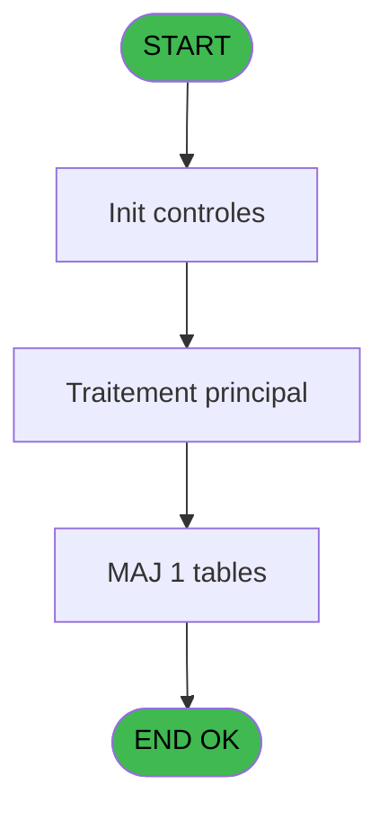

# PBG IDE 11 - Desaffectation chambre

> **Analyse**: Phases 1-4 2026-02-03 00:59 -> 01:00 (39s) | Assemblage 01:00
> **Pipeline**: V7.2 Enrichi
> **Structure**: 4 onglets (Resume | Ecrans | Donnees | Connexions)

<!-- TAB:Resume -->

## 1. FICHE D'IDENTITE

| Attribut | Valeur |
|----------|--------|
| Projet | PBG |
| IDE Position | 11 |
| Nom Programme | Desaffectation chambre |
| Fichier source | `Prg_11.xml` |
| Domaine metier | General |
| Taches | 4 (1 ecrans visibles) |
| Tables modifiees | 1 |
| Programmes appeles | 0 |
| :warning: Statut | **ORPHELIN_POTENTIEL** |

## 2. DESCRIPTION FONCTIONNELLE

**Desaffectation chambre** assure la gestion complete de ce processus.

Le flux de traitement s'organise en **1 blocs fonctionnels** :

- **Traitement** (4 taches) : traitements metier divers

**Donnees modifiees** : 1 tables en ecriture (tairejet).

Detail : phases du traitement

#### Phase 1 : Traitement (4 taches)

- **11** - Désaffectation des chambres **[[ECRAN]](#ecran-t6)**
- **11.1** - Desaffectation
- **11.1.1** - Crzation chambre
- **11.2** - Suppresion Log Detail

#### Tables impactees

| Table | Operations | Role metier |
|-------|-----------|-------------|
| tairejet | **W** (1 usages) |  |

## 3. BLOCS FONCTIONNELS

### 3.1 Traitement (4 taches)

Traitements internes.

---

#### 11 - Désaffectation des chambres [[ECRAN]](#ecran-t6)

**Role** : Traitement : Désaffectation des chambres.
**Ecran** : 717 x 88 DLU (MDI) | [Voir mockup](#ecran-t6)

---

#### 11.1 - Desaffectation

**Role** : Traitement : Desaffectation.

---

#### 11.1.1 - Crzation chambre

**Role** : Traitement : Crzation chambre.

---

#### 11.2 - Suppresion Log Detail

**Role** : Traitement : Suppresion Log Detail.

## 5. REGLES METIER

*(Aucune regle metier identifiee)*

## 6. CONTEXTE

- **Appele par**: (aucun)
- **Appelle**: 0 programmes | **Tables**: 3 (W:1 R:1 L:1) | **Taches**: 4 | **Expressions**: 15

<!-- TAB:Ecrans -->

## 8. ECRANS

### 8.1 Forms visibles (1 / 4)

| # | Position | Tache | Nom | Type | Largeur | Hauteur | Bloc |
|---|----------|-------|-----|------|---------|---------|------|
| 1 | 11.1 | 11 | Désaffectation des chambres | MDI | 717 | 88 | Traitement |

### 8.2 Mockups Ecrans

---

#### 11.1 - Désaffectation des chambres
**Tache** : [11](#t6) | **Type** : MDI | **Dimensions** : 717 x 88 DLU
**Bloc** : Traitement | **Titre IDE** : Désaffectation des chambres

<!-- FORM-DATA:
{
    "width":  717,
    "vFactor":  8,
    "type":  "MDI",
    "hFactor":  8,
    "controls":  [
                     {
                         "x":  0,
                         "type":  "label",
                         "var":  "",
                         "y":  1,
                         "w":  709,
                         "fmt":  "",
                         "name":  "",
                         "h":  19,
                         "color":  "1",
                         "text":  "",
                         "parent":  null
                     },
                     {
                         "x":  7,
                         "type":  "label",
                         "var":  "",
                         "y":  23,
                         "w":  700,
                         "fmt":  "",
                         "name":  "",
                         "h":  60,
                         "color":  "",
                         "text":  "",
                         "parent":  null
                     },
                     {
                         "x":  26,
                         "type":  "label",
                         "var":  "",
                         "y":  46,
                         "w":  58,
                         "fmt":  "",
                         "name":  "",
                         "h":  8,
                         "color":  "",
                         "text":  "Date",
                         "parent":  45
                     },
                     {
                         "x":  88,
                         "type":  "edit",
                         "var":  "",
                         "y":  45,
                         "w":  126,
                         "fmt":  "DD/MM/YYYY",
                         "name":  "w0_Date",
                         "h":  10,
                         "color":  "110",
                         "text":  "",
                         "parent":  45
                     },
                     {
                         "x":  216,
                         "type":  "button",
                         "var":  "",
                         "y":  44,
                         "w":  28,
                         "fmt":  "...",
                         "name":  "b_ZoomDate",
                         "h":  10,
                         "color":  "",
                         "text":  "",
                         "parent":  45
                     },
                     {
                         "x":  546,
                         "type":  "button",
                         "var":  "",
                         "y":  62,
                         "w":  149,
                         "fmt":  "\u0026Quitter",
                         "name":  "b_Quitter",
                         "h":  18,
                         "color":  "",
                         "text":  "",
                         "parent":  45
                     },
                     {
                         "x":  3,
                         "type":  "edit",
                         "var":  "",
                         "y":  3,
                         "w":  267,
                         "fmt":  "20",
                         "name":  "",
                         "h":  8,
                         "color":  "",
                         "text":  "",
                         "parent":  1
                     },
                     {
                         "x":  425,
                         "type":  "edit",
                         "var":  "",
                         "y":  6,
                         "w":  248,
                         "fmt":  "WWW DD MMM YYYYT",
                         "name":  "",
                         "h":  8,
                         "color":  "",
                         "text":  "",
                         "parent":  1
                     },
                     {
                         "x":  3,
                         "type":  "edit",
                         "var":  "",
                         "y":  11,
                         "w":  331,
                         "fmt":  "25",
                         "name":  "",
                         "h":  8,
                         "color":  "",
                         "text":  "",
                         "parent":  null
                     },
                     {
                         "x":  387,
                         "type":  "button",
                         "var":  "",
                         "y":  62,
                         "w":  149,
                         "fmt":  "\u0026Valider",
                         "name":  "b_Valider",
                         "h":  18,
                         "color":  "",
                         "text":  "",
                         "parent":  45
                     }
                 ],
    "taskId":  "11.1",
    "height":  88
}
-->

<strong>Champs : 4 champs</strong>

| Pos (x,y) | Nom | Variable | Type |
|-----------|-----|----------|------|
| 88,45 | w0_Date | - | edit |
| 3,3 | 20 | - | edit |
| 425,6 | WWW DD MMM YYYYT | - | edit |
| 3,11 | 25 | - | edit |

<strong>Boutons : 3 boutons</strong>

| Bouton | Pos (x,y) | Action |
|--------|-----------|--------|
| ... | 216,44 | Bouton fonctionnel |
| Quitter | 546,62 | Quitte le programme |
| Valider | 387,62 | Valide la saisie et enregistre |

## 9. NAVIGATION

Ecran unique: **Désaffectation des chambres**

### 9.3 Structure hierarchique (4 taches)

| Position | Tache | Type | Dimensions | Bloc |
|----------|-------|------|------------|------|
| **11.1** | [**Désaffectation des chambres** (11)](#t6) [mockup](#ecran-t6) | MDI | 717x88 | Traitement |
| 11.1.1 | [Desaffectation (11.1)](#t23) | - | - | |
| 11.1.2 | [Crzation chambre (11.1.1)](#t26) | - | - | |
| 11.1.3 | [Suppresion Log Detail (11.2)](#t27) | - | - | |

### 9.4 Algorigramme

> **Legende**: Vert = START/END OK | Rouge = END KO | Bleu = Decisions
> *Algorigramme auto-genere. Utiliser `/algorigramme` pour une synthese metier detaillee.*

<!-- TAB:Donnees -->

## 10. TABLES

### Tables utilisees (3)

| ID | Nom | Description | Type | R | W | L | Usages |
|----|-----|-------------|------|---|---|---|--------|
| 30 | gm-recherche_____gmr | Index de recherche | DB | R |   |   | 1 |
| 34 | hebergement______heb | Hebergement (chambres) | DB |   |   | L | 1 |
| 455 | tairejet |  | DB |   | **W** |   | 1 |

### Colonnes par table (0 / 2 tables avec colonnes identifiees)

Table 30 - gm-recherche_____gmr (R) - 1 usages

*Table utilisee uniquement en Link ou aucune colonne Real identifiee dans le DataView.*

Table 455 - tairejet (**W**) - 1 usages

*Table utilisee uniquement en Link ou aucune colonne Real identifiee dans le DataView.*

## 11. VARIABLES

### 11.1 Variables de session (1)

Variables persistantes pendant toute la session.

| Lettre | Nom | Type | Usage dans |
|--------|-----|------|-----------|
| E | V.Confirmation | Numeric | - |

### 11.2 Autres (4)

Variables diverses.

| Lettre | Nom | Type | Usage dans |
|--------|-----|------|-----------|
| A | w0_Date | Date | - |
| B | b_ZoomDate | Alpha | - |
| C | b_Valider | Alpha | - |
| D | b_Quitter | Alpha | - |

## 12. EXPRESSIONS

**15 / 15 expressions decodees (100%)**

### 12.1 Repartition par type

| Type | Expressions | Regles |
|------|-------------|--------|
| CONSTANTE | 1 | 0 |
| DATE | 2 | 0 |
| CONDITION | 3 | 0 |
| FORMAT | 3 | 0 |
| REFERENCE_VG | 1 | 0 |
| OTHER | 5 | 0 |

### 12.2 Expressions cles par type

#### CONSTANTE (1 expressions)

| Type | IDE | Expression | Regle |
|------|-----|------------|-------|
| CONSTANTE | 2 | `'...'` | - |

#### DATE (2 expressions)

| Type | IDE | Expression | Regle |
|------|-----|------------|-------|
| DATE | 9 | `Date()+3` | - |
| DATE | 1 | `Date ()` | - |

#### CONDITION (3 expressions)

| Type | IDE | Expression | Regle |
|------|-----|------------|-------|
| CONDITION | 11 | `[EA]=6` | - |
| CONDITION | 12 | `[L]-Date()>=3` | - |
| CONDITION | 8 | `[L]<Date()+1` | - |

#### FORMAT (3 expressions)

| Type | IDE | Expression | Regle |
|------|-----|------------|-------|
| FORMAT | 14 | `'DELETE FROM log_affec_auto_entete WHERE lae_date_traitement='''&DStr(Date(),'YYYYMMDD')&''''` | - |
| FORMAT | 13 | `'DELETE FROM log_affec_auto_detail WHERE laa_date_traitement='''&DStr(Date(),'YYYYMMDD')&''''` | - |
| FORMAT | 10 | `MlsTrans('Toutes les chambres affectées automatiquement à la date du '&Trim(DStr([L],'DD/MM/YYYY')))&' seront désaffectées, Confirmez-vous la demande ?'` | - |

#### REFERENCE_VG (1 expressions)

| Type | IDE | Expression | Regle |
|------|-----|------------|-------|
| REFERENCE_VG | 3 | `VG21` | - |

#### OTHER (5 expressions)

| Type | IDE | Expression | Regle |
|------|-----|------------|-------|
| OTHER | 7 | `GetParam ('VILLAGE')` | - |
| OTHER | 15 | `GetParam('SOCIETE')` | - |
| OTHER | 6 | `SetCrsr (1)` | - |
| OTHER | 4 | `MlsTrans('Désaffectation des chambres')` | - |
| OTHER | 5 | `SetCrsr (2)` | - |

<!-- TAB:Connexions -->

## 13. GRAPHE D'APPELS

### 13.1 Chaine depuis Main (Callers)

**Chemin**: (pas de callers directs)

### 13.2 Callers

| IDE | Nom Programme | Nb Appels |
|-----|---------------|-----------|
| - | (aucun) | - |

### 13.3 Callees (programmes appeles)

### 13.4 Detail Callees avec contexte

| IDE | Nom Programme | Appels | Contexte |
|-----|---------------|--------|----------|
| - | (aucun) | - | - |

## 14. RECOMMANDATIONS MIGRATION

### 14.1 Profil du programme

| Metrique | Valeur | Impact migration |
|----------|--------|-----------------|
| Lignes de logique | 95 | Programme compact |
| Expressions | 15 | Peu de logique |
| Tables WRITE | 1 | Impact faible |
| Sous-programmes | 0 | Peu de dependances |
| Ecrans visibles | 1 | Ecran unique ou traitement batch |
| Code desactive | 0% (0 / 95) | Code sain |
| Regles metier | 0 | Pas de regle identifiee |

### 14.2 Plan de migration par bloc

#### Traitement (4 taches: 1 ecran, 3 traitements)

- **Strategie** : Orchestrateur avec 1 ecrans (Razor/React) et 3 traitements backend (services).
- Les ecrans deviennent des composants UI, les traitements invisibles deviennent des services injectables.
- Decomposer les taches en services unitaires testables.

### 14.3 Dependances critiques

| Dependance | Type | Appels | Impact |
|------------|------|--------|--------|
| tairejet | Table WRITE (Database) | 1x | Schema + repository |

---
*Spec DETAILED generee par Pipeline V7.2 - 2026-02-03 01:00*
