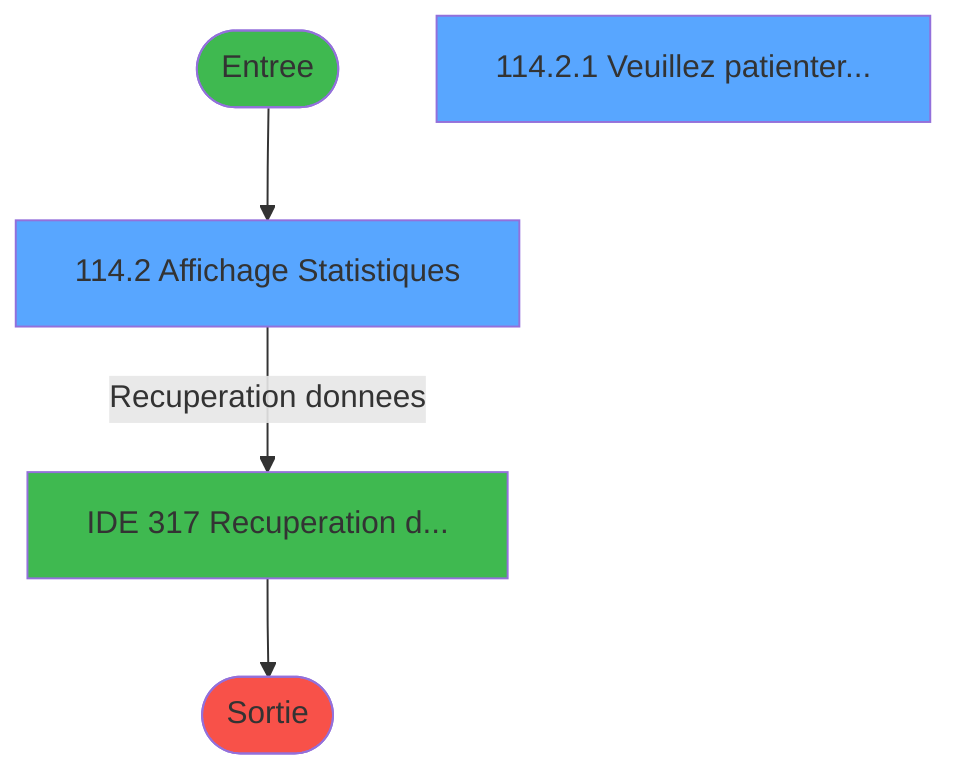
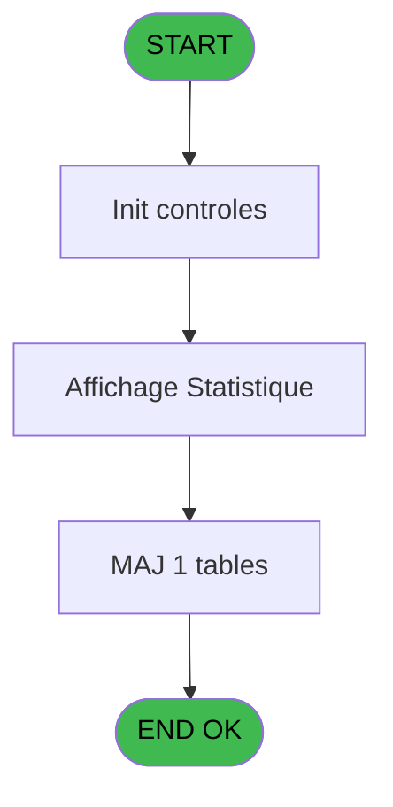
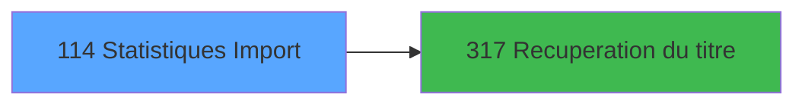

# PBG IDE 114 - Statistiques Import

> **Analyse**: Phases 1-4 2026-02-03 09:29 -> 09:29 (20s) | Assemblage 09:29
> **Pipeline**: V7.2 Enrichi
> **Structure**: 4 onglets (Resume | Ecrans | Donnees | Connexions)

<!-- TAB:Resume -->

## 1. FICHE D'IDENTITE

| Attribut | Valeur |
|----------|--------|
| Projet | PBG |
| IDE Position | 114 |
| Nom Programme | Statistiques Import |
| Fichier source | `Prg_114.xml` |
| Domaine metier | General |
| Taches | 4 (2 ecrans visibles) |
| Tables modifiees | 1 |
| Programmes appeles | 1 |
| :warning: Statut | **ORPHELIN_POTENTIEL** |

## 2. DESCRIPTION FONCTIONNELLE

**Statistiques Import** assure la gestion complete de ce processus.

Le flux de traitement s'organise en **3 blocs fonctionnels** :

- **Traitement** (2 taches) : traitements metier divers
- **Consultation** (1 tache) : ecrans de recherche, selection et consultation
- **Validation** (1 tache) : controles et verifications de coherence

**Donnees modifiees** : 1 tables en ecriture (fichier_statistiques).

**Logique metier** : 2 regles identifiees couvrant valeurs par defaut.

Detail : phases du traitement

#### Phase 1 : Traitement (2 taches)

- **114** - Statistiques **[[ECRAN]](#ecran-t1)**
- **114.2.1** - Veuillez patienter... **[[ECRAN]](#ecran-t4)**

Delegue a : [Recuperation du titre (IDE 317)](PBG-IDE-317.md)

#### Phase 2 : Validation (1 tache)

- **114.1** - Verification Statistiques

#### Phase 3 : Consultation (1 tache)

- **114.2** - Affichage Statistiques **[[ECRAN]](#ecran-t3)**

Delegue a : [Recuperation du titre (IDE 317)](PBG-IDE-317.md)

#### Tables impactees

| Table | Operations | Role metier |
|-------|-----------|-------------|
| fichier_statistiques | R/**W** (3 usages) |  |

## 3. BLOCS FONCTIONNELS

### 3.1 Traitement (2 taches)

Traitements internes.

---

#### 114 - Statistiques [[ECRAN]](#ecran-t1)

**Role** : Traitement : Statistiques.
**Ecran** : 166 x 7 DLU (MDI) | [Voir mockup](#ecran-t1)
**Delegue a** : [Recuperation du titre (IDE 317)](PBG-IDE-317.md)

---

#### 114.2.1 - Veuillez patienter... [[ECRAN]](#ecran-t4)

**Role** : Traitement : Veuillez patienter....
**Ecran** : 422 x 56 DLU (MDI) | [Voir mockup](#ecran-t4)
**Delegue a** : [Recuperation du titre (IDE 317)](PBG-IDE-317.md)

### 3.2 Validation (1 tache)

Controles de coherence : 1 tache verifie les donnees et conditions.

---

#### 114.1 - Verification Statistiques

**Role** : Verification : Verification Statistiques.

### 3.3 Consultation (1 tache)

Ecrans de recherche et consultation.

---

#### 114.2 - Affichage Statistiques [[ECRAN]](#ecran-t3)

**Role** : Reinitialisation : Affichage Statistiques.
**Ecran** : 878 x 336 DLU (MDI) | [Voir mockup](#ecran-t3)

## 5. REGLES METIER

2 regles identifiees:

### Autres (2 regles)

#### [RM-001] Valeur par defaut si P0-Societe [A] est vide

| Element | Detail |
|---------|--------|
| **Condition** | `P0-Societe [A]=''` |
| **Si vrai** | 'C' |
| **Si faux** | P0-Societe [A]) |
| **Variables** | A (P0-Societe) |
| **Expression source** | Expression 3 : `IF (P0-Societe [A]='','C',P0-Societe [A])` |
| **Exemple** | Si P0-Societe [A]='' → 'C'. Sinon → P0-Societe [A]) |

#### [RM-002] Valeur par defaut si P0-Code Langue [B] est vide

| Element | Detail |
|---------|--------|
| **Condition** | `P0-Code Langue [B]=''` |
| **Si vrai** | 'F' |
| **Si faux** | P0-Code Langue [B]) |
| **Variables** | B (P0-Code Langue) |
| **Expression source** | Expression 4 : `IF (P0-Code Langue [B]='','F',P0-Code Langue [B])` |
| **Exemple** | Si P0-Code Langue [B]='' → 'F'. Sinon → P0-Code Langue [B]) |

## 6. CONTEXTE

- **Appele par**: (aucun)
- **Appelle**: 1 programmes | **Tables**: 1 (W:1 R:1 L:0) | **Taches**: 4 | **Expressions**: 8

<!-- TAB:Ecrans -->

## 8. ECRANS

### 8.1 Forms visibles (2 / 4)

| # | Position | Tache | Nom | Type | Largeur | Hauteur | Bloc |
|---|----------|-------|-----|------|---------|---------|------|
| 1 | 114.2 | 114.2 | Affichage Statistiques | MDI | 878 | 336 | Consultation |
| 2 | 114.2.1 | 114.2.1 | Veuillez patienter... | MDI | 422 | 56 | Traitement |

### 8.2 Mockups Ecrans

---

#### 114.2 - Affichage Statistiques
**Tache** : [114.2](#t3) | **Type** : MDI | **Dimensions** : 878 x 336 DLU
**Bloc** : Consultation | **Titre IDE** : Affichage Statistiques

<!-- FORM-DATA:
{
    "width":  878,
    "vFactor":  8,
    "type":  "MDI",
    "hFactor":  8,
    "controls":  [
                     {
                         "x":  0,
                         "type":  "label",
                         "var":  "",
                         "y":  0,
                         "w":  868,
                         "fmt":  "",
                         "name":  "",
                         "h":  19,
                         "color":  "",
                         "text":  "",
                         "parent":  null
                     },
                     {
                         "x":  9,
                         "type":  "table",
                         "var":  "",
                         "name":  "",
                         "titleH":  16,
                         "color":  "110",
                         "w":  864,
                         "y":  27,
                         "fmt":  "",
                         "parent":  null,
                         "text":  "",
                         "rowH":  18,
                         "h":  282,
                         "cols":  [
                                      {
                                          "title":  "Import",
                                          "layer":  1,
                                          "w":  126
                                      },
                                      {
                                          "title":  "Date",
                                          "layer":  2,
                                          "w":  145
                                      },
                                      {
                                          "title":  "Arrivant",
                                          "layer":  3,
                                          "w":  102
                                      },
                                      {
                                          "title":  "Archive",
                                          "layer":  4,
                                          "w":  91
                                      },
                                      {
                                          "title":  "Durée",
                                          "layer":  5,
                                          "w":  122
                                      },
                                      {
                                          "title":  "Commentaire",
                                          "layer":  6,
                                          "w":  243
                                      }
                                  ],
                         "rows":  6
                     },
                     {
                         "x":  7,
                         "type":  "label",
                         "var":  "",
                         "y":  311,
                         "w":  861,
                         "fmt":  "",
                         "name":  "",
                         "h":  24,
                         "color":  "",
                         "text":  "",
                         "parent":  null
                     },
                     {
                         "x":  29,
                         "type":  "edit",
                         "var":  "",
                         "y":  50,
                         "w":  19,
                         "fmt":  "",
                         "name":  "",
                         "h":  8,
                         "color":  "110",
                         "text":  "",
                         "parent":  4
                     },
                     {
                         "x":  54,
                         "type":  "edit",
                         "var":  "",
                         "y":  50,
                         "w":  64,
                         "fmt":  "",
                         "name":  "",
                         "h":  8,
                         "color":  "110",
                         "text":  "",
                         "parent":  4
                     },
                     {
                         "x":  149,
                         "type":  "edit",
                         "var":  "",
                         "y":  50,
                         "w":  120,
                         "fmt":  "DD/MM/YYYYT",
                         "name":  "",
                         "h":  8,
                         "color":  "110",
                         "text":  "",
                         "parent":  4
                     },
                     {
                         "x":  293,
                         "type":  "edit",
                         "var":  "",
                         "y":  50,
                         "w":  53,
                         "fmt":  "",
                         "name":  "",
                         "h":  8,
                         "color":  "110",
                         "text":  "",
                         "parent":  4
                     },
                     {
                         "x":  486,
                         "type":  "edit",
                         "var":  "",
                         "y":  50,
                         "w":  98,
                         "fmt":  "",
                         "name":  "",
                         "h":  8,
                         "color":  "110",
                         "text":  "",
                         "parent":  4
                     },
                     {
                         "x":  608,
                         "type":  "edit",
                         "var":  "",
                         "y":  50,
                         "w":  229,
                         "fmt":  "",
                         "name":  "STI Commentaire",
                         "h":  8,
                         "color":  "110",
                         "text":  "",
                         "parent":  4
                     },
                     {
                         "x":  7,
                         "type":  "edit",
                         "var":  "",
                         "y":  5,
                         "w":  267,
                         "fmt":  "20",
                         "name":  "",
                         "h":  8,
                         "color":  "",
                         "text":  "",
                         "parent":  null
                     },
                     {
                         "x":  650,
                         "type":  "edit",
                         "var":  "",
                         "y":  5,
                         "w":  203,
                         "fmt":  "WWW DD MMM YYYYT",
                         "name":  "",
                         "h":  8,
                         "color":  "",
                         "text":  "",
                         "parent":  null
                     },
                     {
                         "x":  394,
                         "type":  "edit",
                         "var":  "",
                         "y":  50,
                         "w":  42,
                         "fmt":  "3",
                         "name":  "",
                         "h":  8,
                         "color":  "110",
                         "text":  "",
                         "parent":  4
                     },
                     {
                         "x":  14,
                         "type":  "button",
                         "var":  "",
                         "y":  314,
                         "w":  175,
                         "fmt":  "\u0026Quitter",
                         "name":  "",
                         "h":  18,
                         "color":  "",
                         "text":  "",
                         "parent":  18
                     },
                     {
                         "x":  329,
                         "type":  "button",
                         "var":  "",
                         "y":  314,
                         "w":  175,
                         "fmt":  "\u0026Visualisation",
                         "name":  "",
                         "h":  18,
                         "color":  "",
                         "text":  "",
                         "parent":  18
                     },
                     {
                         "x":  509,
                         "type":  "button",
                         "var":  "",
                         "y":  314,
                         "w":  175,
                         "fmt":  "\u0026Modification",
                         "name":  "",
                         "h":  18,
                         "color":  "",
                         "text":  "",
                         "parent":  18
                     },
                     {
                         "x":  690,
                         "type":  "button",
                         "var":  "",
                         "y":  314,
                         "w":  175,
                         "fmt":  "\u0026Suppression",
                         "name":  "",
                         "h":  18,
                         "color":  "",
                         "text":  "",
                         "parent":  18
                     }
                 ],
    "taskId":  "114.2",
    "height":  336
}
-->

<strong>Champs : 9 champs</strong>

| Pos (x,y) | Nom | Variable | Type |
|-----------|-----|----------|------|
| 29,50 | (sans nom) | - | edit |
| 54,50 | (sans nom) | - | edit |
| 149,50 | DD/MM/YYYYT | - | edit |
| 293,50 | (sans nom) | - | edit |
| 486,50 | (sans nom) | - | edit |
| 608,50 | STI Commentaire | - | edit |
| 7,5 | 20 | - | edit |
| 650,5 | WWW DD MMM YYYYT | - | edit |
| 394,50 | 3 | - | edit |

<strong>Boutons : 4 boutons</strong>

| Bouton | Pos (x,y) | Action |
|--------|-----------|--------|
| Quitter | 14,314 | Quitte le programme |
| Visualisation | 329,314 | Bouton fonctionnel |
| Modification | 509,314 | Modifie l'element |
| Suppression | 690,314 | Supprime l'element selectionne |

---

#### 114.2.1 - Veuillez patienter...
**Tache** : [114.2.1](#t4) | **Type** : MDI | **Dimensions** : 422 x 56 DLU
**Bloc** : Traitement | **Titre IDE** : Veuillez patienter...

<!-- FORM-DATA:
{
    "width":  422,
    "vFactor":  8,
    "type":  "MDI",
    "hFactor":  8,
    "controls":  [
                     {
                         "x":  0,
                         "type":  "label",
                         "var":  "",
                         "y":  0,
                         "w":  423,
                         "fmt":  "",
                         "name":  "",
                         "h":  29,
                         "color":  "",
                         "text":  "",
                         "parent":  null
                     },
                     {
                         "x":  120,
                         "type":  "label",
                         "var":  "",
                         "y":  10,
                         "w":  221,
                         "fmt":  "",
                         "name":  "",
                         "h":  8,
                         "color":  "7",
                         "text":  "Traitement en cours ...",
                         "parent":  null
                     },
                     {
                         "x":  0,
                         "type":  "label",
                         "var":  "",
                         "y":  29,
                         "w":  423,
                         "fmt":  "",
                         "name":  "",
                         "h":  27,
                         "color":  "",
                         "text":  "",
                         "parent":  null
                     },
                     {
                         "x":  72,
                         "type":  "label",
                         "var":  "",
                         "y":  38,
                         "w":  280,
                         "fmt":  "",
                         "name":  "",
                         "h":  8,
                         "color":  "",
                         "text":  "Effaçage stat perimees",
                         "parent":  null
                     },
                     {
                         "x":  4,
                         "type":  "image",
                         "var":  "",
                         "y":  2,
                         "w":  72,
                         "fmt":  "",
                         "name":  "",
                         "h":  25,
                         "color":  "",
                         "text":  "",
                         "parent":  null
                     }
                 ],
    "taskId":  "114.2.1",
    "height":  56
}
-->

## 9. NAVIGATION

### 9.1 Enchainement des ecrans

**Detail par enchainement :**

| Depuis | Action | Vers | Retour |
|--------|--------|------|--------|
| Affichage Statistiques | Recuperation donnees | [Recuperation du titre (IDE 317)](PBG-IDE-317.md) | Retour ecran |

### 9.3 Structure hierarchique (4 taches)

| Position | Tache | Type | Dimensions | Bloc |
|----------|-------|------|------------|------|
| **114.1** | [**Statistiques** (114)](#t1) [mockup](#ecran-t1) | MDI | 166x7 | Traitement |
| 114.1.1 | [Veuillez patienter... (114.2.1)](#t4) [mockup](#ecran-t4) | MDI | 422x56 | |
| **114.2** | [**Verification Statistiques** (114.1)](#t2) | MDI | - | Validation |
| **114.3** | [**Affichage Statistiques** (114.2)](#t3) [mockup](#ecran-t3) | MDI | 878x336 | Consultation |

### 9.4 Algorigramme

> **Legende**: Vert = START/END OK | Rouge = END KO | Bleu = Decisions
> *Algorigramme auto-genere. Utiliser `/algorigramme` pour une synthese metier detaillee.*

<!-- TAB:Donnees -->

## 10. TABLES

### Tables utilisees (1)

| ID | Nom | Description | Type | R | W | L | Usages |
|----|-----|-------------|------|---|---|---|--------|
| 129 | fichier_statistiques |  | DB | R | **W** |   | 3 |

### Colonnes par table (0 / 1 tables avec colonnes identifiees)

Table 129 - fichier_statistiques (R/**W**) - 3 usages

*Table utilisee uniquement en Link ou aucune colonne Real identifiee dans le DataView.*

## 11. VARIABLES

### 11.1 Autres (5)

Variables diverses.

| Lettre | Nom | Type | Usage dans |
|--------|-----|------|-----------|
| A | P0-Societe | Alpha | 1x refs |
| B | P0-Code Langue | Alpha | 1x refs |
| C | W0-Code Suite | Alpha | 2x refs |
| D | W0-Code B029 | Alpha | - |
| E | W0-Code B030 | Alpha | - |

## 12. EXPRESSIONS

**8 / 8 expressions decodees (100%)**

### 12.1 Repartition par type

| Type | Expressions | Regles |
|------|-------------|--------|
| CONDITION | 4 | 2 |
| CONSTANTE | 2 | 0 |
| OTHER | 2 | 0 |

### 12.2 Expressions cles par type

#### CONDITION (4 expressions)

| Type | IDE | Expression | Regle |
|------|-----|------------|-------|
| CONDITION | 4 | `IF (P0-Code Langue [B]='','F',P0-Code Langue [B])` | [RM-002](#rm-RM-002) |
| CONDITION | 3 | `IF (P0-Societe [A]='','C',P0-Societe [A])` | [RM-001](#rm-RM-001) |
| CONDITION | 6 | `W0-Code Suite [C]='O'` | - |
| CONDITION | 5 | `W0-Code Suite [C]='N'` | - |

#### CONSTANTE (2 expressions)

| Type | IDE | Expression | Regle |
|------|-----|------------|-------|
| CONSTANTE | 8 | `'B030'` | - |
| CONSTANTE | 7 | `'B029'` | - |

#### OTHER (2 expressions)

| Type | IDE | Expression | Regle |
|------|-----|------------|-------|
| OTHER | 2 | `GetParam ('LANGUE')` | - |
| OTHER | 1 | `GetParam ('SOCIETE')` | - |

<!-- TAB:Connexions -->

## 13. GRAPHE D'APPELS

### 13.1 Chaine depuis Main (Callers)

**Chemin**: (pas de callers directs)

### 13.2 Callers

| IDE | Nom Programme | Nb Appels |
|-----|---------------|-----------|
| - | (aucun) | - |

### 13.3 Callees (programmes appeles)

### 13.4 Detail Callees avec contexte

| IDE | Nom Programme | Appels | Contexte |
|-----|---------------|--------|----------|
| [317](PBG-IDE-317.md) | Recuperation du titre | 1 | Recuperation donnees |

## 14. RECOMMANDATIONS MIGRATION

### 14.1 Profil du programme

| Metrique | Valeur | Impact migration |
|----------|--------|-----------------|
| Lignes de logique | 44 | Programme compact |
| Expressions | 8 | Peu de logique |
| Tables WRITE | 1 | Impact faible |
| Sous-programmes | 1 | Peu de dependances |
| Ecrans visibles | 2 | Quelques ecrans |
| Code desactive | 0% (0 / 44) | Code sain |
| Regles metier | 2 | Quelques regles a preserver |

### 14.2 Plan de migration par bloc

#### Traitement (2 taches: 2 ecrans, 0 traitement)

- **Strategie** : 2 composant(s) UI (Razor/React) avec formulaires et validation.
- 1 sous-programme(s) a migrer ou a reutiliser depuis les services existants.
- Decomposer les taches en services unitaires testables.

#### Validation (1 tache: 0 ecran, 1 traitement)

- **Strategie** : FluentValidation avec validators specifiques.
- Chaque tache de validation -> un validator injectable

#### Consultation (1 tache: 1 ecran, 0 traitement)

- **Strategie** : Composants de recherche/selection en modales.
- 1 ecran : Affichage Statistiques

### 14.3 Dependances critiques

| Dependance | Type | Appels | Impact |
|------------|------|--------|--------|
| fichier_statistiques | Table WRITE (Database) | 2x | Schema + repository |
| [Recuperation du titre (IDE 317)](PBG-IDE-317.md) | Sous-programme | 1x | Normale - Recuperation donnees |

---
*Spec DETAILED generee par Pipeline V7.2 - 2026-02-03 09:29*
