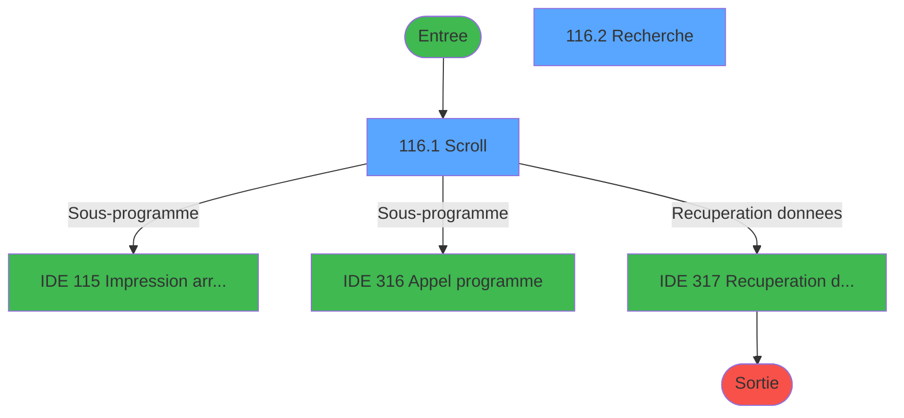
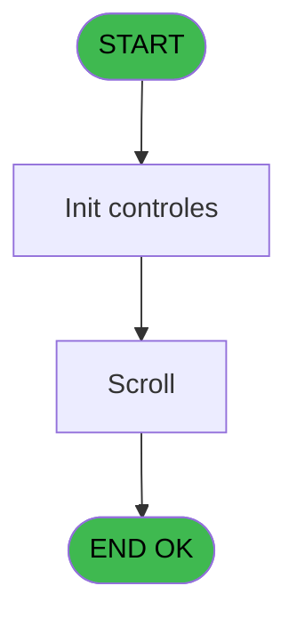
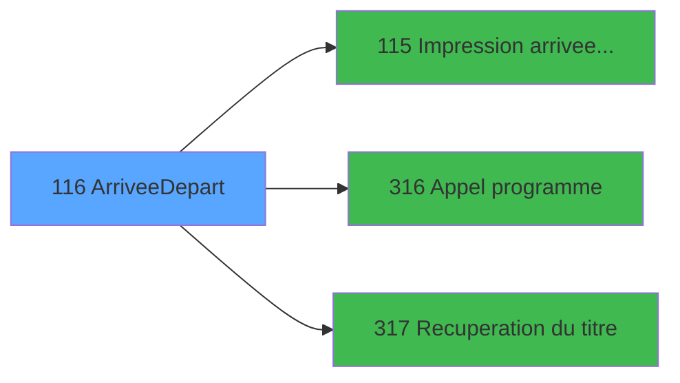

# PBG IDE 116 - Arrivee/Depart

> **Analyse**: Phases 1-4 2026-02-03 09:30 -> 09:30 (19s) | Assemblage 09:30
> **Pipeline**: V7.2 Enrichi
> **Structure**: 4 onglets (Resume | Ecrans | Donnees | Connexions)

<!-- TAB:Resume -->

## 1. FICHE D'IDENTITE

| Attribut | Valeur |
|----------|--------|
| Projet | PBG |
| IDE Position | 116 |
| Nom Programme | Arrivee/Depart |
| Fichier source | `Prg_116.xml` |
| Domaine metier | General |
| Taches | 3 (2 ecrans visibles) |
| Tables modifiees | 0 |
| Programmes appeles | 3 |
| :warning: Statut | **ORPHELIN_POTENTIEL** |

## 2. DESCRIPTION FONCTIONNELLE

**Arrivee/Depart** assure la gestion complete de ce processus.

Le flux de traitement s'organise en **2 blocs fonctionnels** :

- **Traitement** (2 taches) : traitements metier divers
- **Consultation** (1 tache) : ecrans de recherche, selection et consultation

Detail : phases du traitement

#### Phase 1 : Traitement (2 taches)

- **116** - (sans nom) **[[ECRAN]](#ecran-t1)**
- **116.1** - Scroll **[[ECRAN]](#ecran-t2)**

Delegue a : [Impression arrivee / depart (IDE 115)](PBG-IDE-115.md), [Appel programme (IDE 316)](PBG-IDE-316.md), [Recuperation du titre (IDE 317)](PBG-IDE-317.md)

#### Phase 2 : Consultation (1 tache)

- **116.2** - Recherche **[[ECRAN]](#ecran-t3)**

Delegue a : [Recuperation du titre (IDE 317)](PBG-IDE-317.md)

## 3. BLOCS FONCTIONNELS

### 3.1 Traitement (2 taches)

Traitements internes.

---

#### 116 - (sans nom) [[ECRAN]](#ecran-t1)

**Role** : Traitement interne.
**Ecran** : 166 x 31 DLU (MDI) | [Voir mockup](#ecran-t1)
**Delegue a** : [Impression arrivee / depart (IDE 115)](PBG-IDE-115.md), [Appel programme (IDE 316)](PBG-IDE-316.md), [Recuperation du titre (IDE 317)](PBG-IDE-317.md)

---

#### 116.1 - Scroll [[ECRAN]](#ecran-t2)

**Role** : Traitement : Scroll.
**Ecran** : 1091 x 283 DLU (MDI) | [Voir mockup](#ecran-t2)
**Delegue a** : [Impression arrivee / depart (IDE 115)](PBG-IDE-115.md), [Appel programme (IDE 316)](PBG-IDE-316.md), [Recuperation du titre (IDE 317)](PBG-IDE-317.md)

### 3.2 Consultation (1 tache)

Ecrans de recherche et consultation.

---

#### 116.2 - Recherche [[ECRAN]](#ecran-t3)

**Role** : Traitement : Recherche.
**Ecran** : 469 x 89 DLU (MDI) | [Voir mockup](#ecran-t3)

## 5. REGLES METIER

*(Aucune regle metier identifiee)*

## 6. CONTEXTE

- **Appele par**: (aucun)
- **Appelle**: 3 programmes | **Tables**: 1 (W:0 R:1 L:0) | **Taches**: 3 | **Expressions**: 6

<!-- TAB:Ecrans -->

## 8. ECRANS

### 8.1 Forms visibles (2 / 3)

| # | Position | Tache | Nom | Type | Largeur | Hauteur | Bloc |
|---|----------|-------|-----|------|---------|---------|------|
| 1 | 116.1 | 116.1 | Scroll | MDI | 1091 | 283 | Traitement |
| 2 | 116.2 | 116.2 | Recherche | MDI | 469 | 89 | Consultation |

### 8.2 Mockups Ecrans

---

#### 116.1 - Scroll
**Tache** : [116.1](#t2) | **Type** : MDI | **Dimensions** : 1091 x 283 DLU
**Bloc** : Traitement | **Titre IDE** : Scroll

<!-- FORM-DATA:
{
    "width":  1091,
    "vFactor":  8,
    "type":  "MDI",
    "hFactor":  8,
    "controls":  [
                     {
                         "x":  0,
                         "type":  "label",
                         "var":  "",
                         "y":  0,
                         "w":  1089,
                         "fmt":  "",
                         "name":  "",
                         "h":  21,
                         "color":  "",
                         "text":  "",
                         "parent":  null
                     },
                     {
                         "x":  9,
                         "type":  "label",
                         "var":  "",
                         "y":  37,
                         "w":  784,
                         "fmt":  "",
                         "name":  "",
                         "h":  19,
                         "color":  "",
                         "text":  "",
                         "parent":  null
                     },
                     {
                         "x":  793,
                         "type":  "label",
                         "var":  "",
                         "y":  37,
                         "w":  295,
                         "fmt":  "",
                         "name":  "",
                         "h":  19,
                         "color":  "",
                         "text":  "",
                         "parent":  null
                     },
                     {
                         "x":  352,
                         "type":  "label",
                         "var":  "",
                         "y":  42,
                         "w":  98,
                         "fmt":  "",
                         "name":  "",
                         "h":  8,
                         "color":  "7",
                         "text":  "ARRIVEE",
                         "parent":  null
                     },
                     {
                         "x":  871,
                         "type":  "label",
                         "var":  "",
                         "y":  42,
                         "w":  134,
                         "fmt":  "",
                         "name":  "",
                         "h":  8,
                         "color":  "7",
                         "text":  "DEPART",
                         "parent":  null
                     },
                     {
                         "x":  8,
                         "type":  "table",
                         "var":  "",
                         "name":  "",
                         "titleH":  14,
                         "color":  "110",
                         "w":  1082,
                         "y":  55,
                         "fmt":  "",
                         "parent":  null,
                         "text":  "",
                         "rowH":  16,
                         "h":  189,
                         "cols":  [
                                      {
                                          "title":  "Date",
                                          "layer":  1,
                                          "w":  139
                                      },
                                      {
                                          "title":  "Total",
                                          "layer":  2,
                                          "w":  76
                                      },
                                      {
                                          "title":  "Millesia",
                                          "layer":  3,
                                          "w":  91
                                      },
                                      {
                                          "title":  "Honey",
                                          "layer":  4,
                                          "w":  99
                                      },
                                      {
                                          "title":  "Single",
                                          "layer":  5,
                                          "w":  98
                                      },
                                      {
                                          "title":  "Bébé",
                                          "layer":  6,
                                          "w":  93
                                      },
                                      {
                                          "title":  "Enfant",
                                          "layer":  7,
                                          "w":  90
                                      },
                                      {
                                          "title":  "VV",
                                          "layer":  8,
                                          "w":  98
                                      },
                                      {
                                          "title":  "Total départ",
                                          "layer":  9,
                                          "w":  157
                                      },
                                      {
                                          "title":  "VV",
                                          "layer":  10,
                                          "w":  106
                                      }
                                  ],
                         "rows":  10
                     },
                     {
                         "x":  2,
                         "type":  "label",
                         "var":  "",
                         "y":  258,
                         "w":  1089,
                         "fmt":  "",
                         "name":  "",
                         "h":  24,
                         "color":  "",
                         "text":  "",
                         "parent":  null
                     },
                     {
                         "x":  14,
                         "type":  "edit",
                         "var":  "",
                         "y":  73,
                         "w":  128,
                         "fmt":  "DD/MM/YYYYT",
                         "name":  "",
                         "h":  8,
                         "color":  "111",
                         "text":  "",
                         "parent":  8
                     },
                     {
                         "x":  157,
                         "type":  "edit",
                         "var":  "",
                         "y":  73,
                         "w":  53,
                         "fmt":  "",
                         "name":  "",
                         "h":  8,
                         "color":  "110",
                         "text":  "",
                         "parent":  8
                     },
                     {
                         "x":  234,
                         "type":  "edit",
                         "var":  "",
                         "y":  73,
                         "w":  53,
                         "fmt":  "",
                         "name":  "",
                         "h":  8,
                         "color":  "110",
                         "text":  "",
                         "parent":  8
                     },
                     {
                         "x":  325,
                         "type":  "edit",
                         "var":  "",
                         "y":  73,
                         "w":  53,
                         "fmt":  "",
                         "name":  "",
                         "h":  8,
                         "color":  "110",
                         "text":  "",
                         "parent":  8
                     },
                     {
                         "x":  422,
                         "type":  "edit",
                         "var":  "",
                         "y":  73,
                         "w":  53,
                         "fmt":  "",
                         "name":  "",
                         "h":  8,
                         "color":  "110",
                         "text":  "",
                         "parent":  8
                     },
                     {
                         "x":  525,
                         "type":  "edit",
                         "var":  "",
                         "y":  73,
                         "w":  53,
                         "fmt":  "",
                         "name":  "",
                         "h":  8,
                         "color":  "110",
                         "text":  "",
                         "parent":  8
                     },
                     {
                         "x":  614,
                         "type":  "edit",
                         "var":  "",
                         "y":  73,
                         "w":  53,
                         "fmt":  "",
                         "name":  "",
                         "h":  8,
                         "color":  "110",
                         "text":  "",
                         "parent":  8
                     },
                     {
                         "x":  709,
                         "type":  "edit",
                         "var":  "",
                         "y":  73,
                         "w":  53,
                         "fmt":  "",
                         "name":  "",
                         "h":  8,
                         "color":  "110",
                         "text":  "",
                         "parent":  8
                     },
                     {
                         "x":  845,
                         "type":  "edit",
                         "var":  "",
                         "y":  73,
                         "w":  53,
                         "fmt":  "",
                         "name":  "",
                         "h":  8,
                         "color":  "110",
                         "text":  "",
                         "parent":  8
                     },
                     {
                         "x":  973,
                         "type":  "edit",
                         "var":  "",
                         "y":  73,
                         "w":  53,
                         "fmt":  "",
                         "name":  "",
                         "h":  8,
                         "color":  "110",
                         "text":  "",
                         "parent":  8
                     },
                     {
                         "x":  879,
                         "type":  "edit",
                         "var":  "",
                         "y":  6,
                         "w":  203,
                         "fmt":  "WWW DD MMM YYYYT",
                         "name":  "",
                         "h":  8,
                         "color":  "",
                         "text":  "",
                         "parent":  null
                     },
                     {
                         "x":  8,
                         "type":  "button",
                         "var":  "",
                         "y":  261,
                         "w":  154,
                         "fmt":  "\u0026Quitter",
                         "name":  "",
                         "h":  18,
                         "color":  "",
                         "text":  "",
                         "parent":  null
                     },
                     {
                         "x":  768,
                         "type":  "button",
                         "var":  "",
                         "y":  261,
                         "w":  154,
                         "fmt":  "\u0026Impression",
                         "name":  "",
                         "h":  18,
                         "color":  "",
                         "text":  "",
                         "parent":  null
                     },
                     {
                         "x":  931,
                         "type":  "button",
                         "var":  "",
                         "y":  261,
                         "w":  154,
                         "fmt":  "\u0026Recherche",
                         "name":  "R",
                         "h":  18,
                         "color":  "",
                         "text":  "",
                         "parent":  null
                     },
                     {
                         "x":  6,
                         "type":  "edit",
                         "var":  "",
                         "y":  6,
                         "w":  267,
                         "fmt":  "20",
                         "name":  "",
                         "h":  8,
                         "color":  "",
                         "text":  "",
                         "parent":  null
                     }
                 ],
    "taskId":  "116.1",
    "height":  283
}
-->

<strong>Champs : 12 champs</strong>

| Pos (x,y) | Nom | Variable | Type |
|-----------|-----|----------|------|
| 14,73 | DD/MM/YYYYT | - | edit |
| 157,73 | (sans nom) | - | edit |
| 234,73 | (sans nom) | - | edit |
| 325,73 | (sans nom) | - | edit |
| 422,73 | (sans nom) | - | edit |
| 525,73 | (sans nom) | - | edit |
| 614,73 | (sans nom) | - | edit |
| 709,73 | (sans nom) | - | edit |
| 845,73 | (sans nom) | - | edit |
| 973,73 | (sans nom) | - | edit |
| 879,6 | WWW DD MMM YYYYT | - | edit |
| 6,6 | 20 | - | edit |

<strong>Boutons : 3 boutons</strong>

| Bouton | Pos (x,y) | Action |
|--------|-----------|--------|
| Quitter | 8,261 | Quitte le programme |
| Impression | 768,261 | Appel [Impression arrivee / depart (IDE 115)](PBG-IDE-115.md) |
| Recherche | 931,261 | Ouvre la selection |

---

#### 116.2 - Recherche
**Tache** : [116.2](#t3) | **Type** : MDI | **Dimensions** : 469 x 89 DLU
**Bloc** : Consultation | **Titre IDE** : Recherche

<!-- FORM-DATA:
{
    "width":  469,
    "vFactor":  8,
    "type":  "MDI",
    "hFactor":  8,
    "controls":  [
                     {
                         "x":  203,
                         "type":  "label",
                         "var":  "",
                         "y":  14,
                         "w":  234,
                         "fmt":  "",
                         "name":  "",
                         "h":  34,
                         "color":  "195",
                         "text":  "Selection Date",
                         "parent":  null
                     },
                     {
                         "x":  2,
                         "type":  "label",
                         "var":  "",
                         "y":  64,
                         "w":  466,
                         "fmt":  "",
                         "name":  "",
                         "h":  24,
                         "color":  "",
                         "text":  "",
                         "parent":  null
                     },
                     {
                         "x":  231,
                         "type":  "edit",
                         "var":  "",
                         "y":  28,
                         "w":  126,
                         "fmt":  "DD/MM/YYYYT",
                         "name":  "W1 date recherche",
                         "h":  10,
                         "color":  "6",
                         "text":  "",
                         "parent":  2
                     },
                     {
                         "x":  359,
                         "type":  "button",
                         "var":  "",
                         "y":  28,
                         "w":  35,
                         "fmt":  "...",
                         "name":  "W1-Bouton Date",
                         "h":  10,
                         "color":  "",
                         "text":  "",
                         "parent":  null
                     },
                     {
                         "x":  17,
                         "type":  "image",
                         "var":  "",
                         "y":  2,
                         "w":  160,
                         "fmt":  "",
                         "name":  "",
                         "h":  58,
                         "color":  "",
                         "text":  "",
                         "parent":  null
                     },
                     {
                         "x":  8,
                         "type":  "button",
                         "var":  "",
                         "y":  68,
                         "w":  154,
                         "fmt":  "\u0026Ok",
                         "name":  "",
                         "h":  18,
                         "color":  "",
                         "text":  "",
                         "parent":  null
                     },
                     {
                         "x":  309,
                         "type":  "button",
                         "var":  "",
                         "y":  68,
                         "w":  154,
                         "fmt":  "A\u0026bandonner",
                         "name":  "",
                         "h":  18,
                         "color":  "",
                         "text":  "",
                         "parent":  null
                     }
                 ],
    "taskId":  "116.2",
    "height":  89
}
-->

<strong>Champs : 1 champs</strong>

| Pos (x,y) | Nom | Variable | Type |
|-----------|-----|----------|------|
| 231,28 | W1 date recherche | - | edit |

<strong>Boutons : 3 boutons</strong>

| Bouton | Pos (x,y) | Action |
|--------|-----------|--------|
| ... | 359,28 | Bouton fonctionnel |
| Ok | 8,68 | Valide la saisie et enregistre |
| Abandonner | 309,68 | Annule et retour au menu |

## 9. NAVIGATION

### 9.1 Enchainement des ecrans

**Detail par enchainement :**

| Depuis | Action | Vers | Retour |
|--------|--------|------|--------|
| Scroll | Sous-programme | [Impression arrivee / depart (IDE 115)](PBG-IDE-115.md) | Retour ecran |
| Scroll | Sous-programme | [Appel programme (IDE 316)](PBG-IDE-316.md) | Retour ecran |
| Scroll | Recuperation donnees | [Recuperation du titre (IDE 317)](PBG-IDE-317.md) | Retour ecran |

### 9.3 Structure hierarchique (3 taches)

| Position | Tache | Type | Dimensions | Bloc |
|----------|-------|------|------------|------|
| **116.1** | [**(sans nom)** (116)](#t1) [mockup](#ecran-t1) | MDI | 166x31 | Traitement |
| 116.1.1 | [Scroll (116.1)](#t2) [mockup](#ecran-t2) | MDI | 1091x283 | |
| **116.2** | [**Recherche** (116.2)](#t3) [mockup](#ecran-t3) | MDI | 469x89 | Consultation |

### 9.4 Algorigramme

> **Legende**: Vert = START/END OK | Rouge = END KO | Bleu = Decisions
> *Algorigramme auto-genere. Utiliser `/algorigramme` pour une synthese metier detaillee.*

<!-- TAB:Donnees -->

## 10. TABLES

### Tables utilisees (1)

| ID | Nom | Description | Type | R | W | L | Usages |
|----|-----|-------------|------|---|---|---|--------|
| 133 | new_asd |  | DB | R |   |   | 1 |

### Colonnes par table (1 / 1 tables avec colonnes identifiees)

Table 133 - new_asd (R) - 1 usages

| Lettre | Variable | Acces | Type |
|--------|----------|-------|------|
| A | W1 fin tâche | R | Alpha |
| B | W1 choix action | R | Alpha |

## 11. VARIABLES

### 11.1 Parametres entrants (3)

Variables recues en parametre.

| Lettre | Nom | Type | Usage dans |
|--------|-----|------|-----------|
| A | P0 Choix | Alpha | - |
| B | P0 societe | Alpha | - |
| C | P0 nom village | Alpha | - |

### 11.2 Variables de travail (2)

Variables internes au programme.

| Lettre | Nom | Type | Usage dans |
|--------|-----|------|-----------|
| D | W0 choix action | Alpha | 2x calcul interne |
| E | W0 date | Date | - |

### 11.3 Autres (1)

Variables diverses.

| Lettre | Nom | Type | Usage dans |
|--------|-----|------|-----------|
| F | WO titre ecran | Alpha | - |

## 12. EXPRESSIONS

**6 / 6 expressions decodees (100%)**

### 12.1 Repartition par type

| Type | Expressions | Regles |
|------|-------------|--------|
| CONSTANTE | 3 | 0 |
| DATE | 1 | 0 |
| CONDITION | 2 | 0 |

### 12.2 Expressions cles par type

#### CONSTANTE (3 expressions)

| Type | IDE | Expression | Regle |
|------|-----|------------|-------|
| CONSTANTE | 4 | `''` | - |
| CONSTANTE | 3 | `'C'` | - |
| CONSTANTE | 1 | `'F'` | - |

#### DATE (1 expressions)

| Type | IDE | Expression | Regle |
|------|-----|------------|-------|
| DATE | 6 | `Date ()` | - |

#### CONDITION (2 expressions)

| Type | IDE | Expression | Regle |
|------|-----|------------|-------|
| CONDITION | 5 | `W0 choix action [D]='F'` | - |
| CONDITION | 2 | `W0 choix action [D]='R'` | - |

<!-- TAB:Connexions -->

## 13. GRAPHE D'APPELS

### 13.1 Chaine depuis Main (Callers)

**Chemin**: (pas de callers directs)

### 13.2 Callers

| IDE | Nom Programme | Nb Appels |
|-----|---------------|-----------|
| - | (aucun) | - |

### 13.3 Callees (programmes appeles)

### 13.4 Detail Callees avec contexte

| IDE | Nom Programme | Appels | Contexte |
|-----|---------------|--------|----------|
| [115](PBG-IDE-115.md) | Impression arrivee / depart | 1 | Sous-programme |
| [316](PBG-IDE-316.md) | Appel programme | 1 | Sous-programme |
| [317](PBG-IDE-317.md) | Recuperation du titre | 1 | Recuperation donnees |

## 14. RECOMMANDATIONS MIGRATION

### 14.1 Profil du programme

| Metrique | Valeur | Impact migration |
|----------|--------|-----------------|
| Lignes de logique | 43 | Programme compact |
| Expressions | 6 | Peu de logique |
| Tables WRITE | 0 | Impact faible |
| Sous-programmes | 3 | Peu de dependances |
| Ecrans visibles | 2 | Quelques ecrans |
| Code desactive | 0% (0 / 43) | Code sain |
| Regles metier | 0 | Pas de regle identifiee |

### 14.2 Plan de migration par bloc

#### Traitement (2 taches: 2 ecrans, 0 traitement)

- **Strategie** : 2 composant(s) UI (Razor/React) avec formulaires et validation.
- 3 sous-programme(s) a migrer ou a reutiliser depuis les services existants.
- Decomposer les taches en services unitaires testables.

#### Consultation (1 tache: 1 ecran, 0 traitement)

- **Strategie** : Composants de recherche/selection en modales.
- 1 ecran : Recherche

### 14.3 Dependances critiques

| Dependance | Type | Appels | Impact |
|------------|------|--------|--------|
| [Recuperation du titre (IDE 317)](PBG-IDE-317.md) | Sous-programme | 1x | Normale - Recuperation donnees |
| [Appel programme (IDE 316)](PBG-IDE-316.md) | Sous-programme | 1x | Normale - Sous-programme |
| [Impression arrivee / depart (IDE 115)](PBG-IDE-115.md) | Sous-programme | 1x | Normale - Sous-programme |

---
*Spec DETAILED generee par Pipeline V7.2 - 2026-02-03 09:30*
