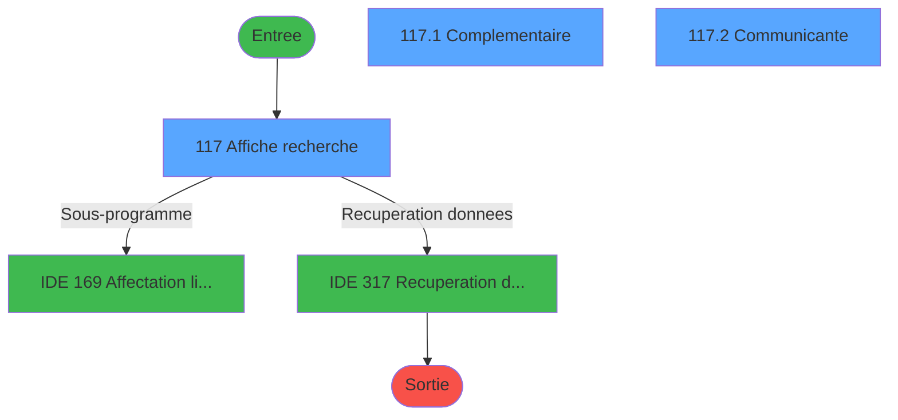
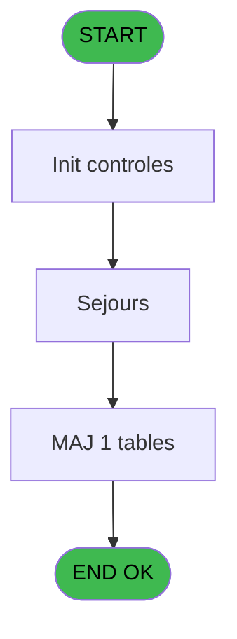
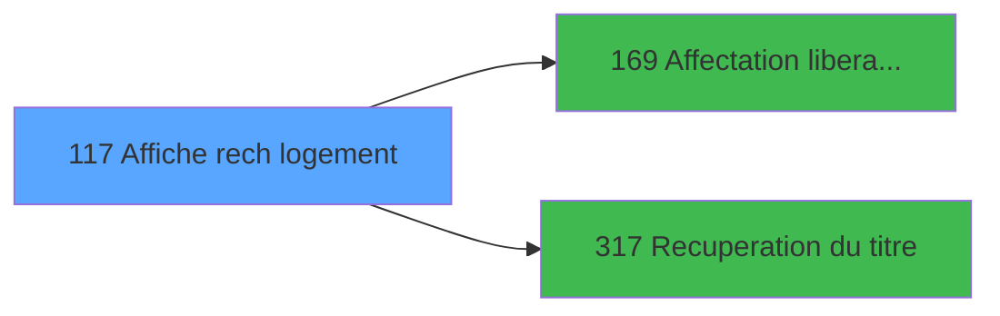

# PBG IDE 117 - Affiche rech logement

> **Analyse**: Phases 1-4 2026-02-03 09:30 -> 09:30 (20s) | Assemblage 09:30
> **Pipeline**: V7.2 Enrichi
> **Structure**: 4 onglets (Resume | Ecrans | Donnees | Connexions)

<!-- TAB:Resume -->

## 1. FICHE D'IDENTITE

| Attribut | Valeur |
|----------|--------|
| Projet | PBG |
| IDE Position | 117 |
| Nom Programme | Affiche rech logement |
| Fichier source | `Prg_117.xml` |
| Domaine metier | General |
| Taches | 7 (3 ecrans visibles) |
| Tables modifiees | 1 |
| Programmes appeles | 2 |

## 2. DESCRIPTION FONCTIONNELLE

**Affiche rech logement** assure la gestion complete de ce processus, accessible depuis [Recherche Logement (IDE 119)](PBG-IDE-119.md).

Le flux de traitement s'organise en **2 blocs fonctionnels** :

- **Traitement** (5 taches) : traitements metier divers
- **Consultation** (2 taches) : ecrans de recherche, selection et consultation

**Donnees modifiees** : 1 tables en ecriture (table_utilisateurs).

**Logique metier** : 22 regles identifiees couvrant conditions metier.

Detail : phases du traitement

#### Phase 1 : Consultation (2 taches)

- **117** - Affiche recherche **[[ECRAN]](#ecran-t1)**
- **117.3** - Exist select

Delegue a : [Affectation / liberation reche (IDE 169)](PBG-IDE-169.md), [Recuperation du titre (IDE 317)](PBG-IDE-317.md)

#### Phase 2 : Traitement (5 taches)

- **117.1** - Complementaire **[[ECRAN]](#ecran-t2)**
- **117.2** - Communicante **[[ECRAN]](#ecran-t3)**
- **117.4** - (sans nom)
- **117.5** - (sans nom)
- **117.6** - Récup. Unité lit

Delegue a : [Recuperation du titre (IDE 317)](PBG-IDE-317.md)

#### Tables impactees

| Table | Operations | Role metier |
|-------|-----------|-------------|
| table_utilisateurs | R/**W** (2 usages) |  |

## 3. BLOCS FONCTIONNELS

### 3.1 Consultation (2 taches)

Ecrans de recherche et consultation.

---

#### 117 - Affiche recherche [[ECRAN]](#ecran-t1)

**Role** : Reinitialisation : Affiche recherche.
**Ecran** : 1014 x 276 DLU (MDI) | [Voir mockup](#ecran-t1)
**Delegue a** : [Affectation / liberation reche (IDE 169)](PBG-IDE-169.md)

---

#### 117.3 - Exist select

**Role** : Traitement : Exist select.
**Variables liees** : F (>NbSelect), H (w0_ExistOccup), I (w0_ExistEnsem), J (w0_ExistBati), L (w0_ExistEtag)
**Delegue a** : [Affectation / liberation reche (IDE 169)](PBG-IDE-169.md)

### 3.2 Traitement (5 taches)

Traitements internes.

---

#### 117.1 - Complementaire [[ECRAN]](#ecran-t2)

**Role** : Traitement : Complementaire.
**Ecran** : 1001 x 94 DLU (Modal) | [Voir mockup](#ecran-t2)
**Delegue a** : [Recuperation du titre (IDE 317)](PBG-IDE-317.md)

---

#### 117.2 - Communicante [[ECRAN]](#ecran-t3)

**Role** : Traitement : Communicante.
**Ecran** : 170 x 62 DLU (Modal) | [Voir mockup](#ecran-t3)
**Delegue a** : [Recuperation du titre (IDE 317)](PBG-IDE-317.md)

---

#### 117.4 - (sans nom)

**Role** : Traitement interne.
**Delegue a** : [Recuperation du titre (IDE 317)](PBG-IDE-317.md)

---

#### 117.5 - (sans nom)

**Role** : Traitement interne.
**Delegue a** : [Recuperation du titre (IDE 317)](PBG-IDE-317.md)

---

#### 117.6 - Récup. Unité lit

**Role** : Traitement : Récup. Unité lit.
**Variables liees** : X (v. Unité lit cm/inch)
**Delegue a** : [Recuperation du titre (IDE 317)](PBG-IDE-317.md)

## 5. REGLES METIER

22 regles identifiees:

### Autres (22 regles)

#### [RM-001] Si [AE]='C' alors 'Cl' sinon 'Pe')

| Element | Detail |
|---------|--------|
| **Condition** | `[AE]='C'` |
| **Si vrai** | 'Cl' |
| **Si faux** | 'Pe') |
| **Expression source** | Expression 8 : `IF ([AE]='C','Cl','Pe')` |
| **Exemple** | Si [AE]='C' → 'Cl'. Sinon → 'Pe') |

#### [RM-002] Si [AF]='N' alors 'Non' sinon [AF])

| Element | Detail |
|---------|--------|
| **Condition** | `[AF]='N'` |
| **Si vrai** | 'Non' |
| **Si faux** | [AF]) |
| **Expression source** | Expression 9 : `IF ([AF]='N','Non',[AF])` |
| **Exemple** | Si [AF]='N' → 'Non'. Sinon → [AF]) |

#### [RM-003] Si [AG]='N' alors 'Non' sinon [AG])

| Element | Detail |
|---------|--------|
| **Condition** | `[AG]='N'` |
| **Si vrai** | 'Non' |
| **Si faux** | [AG]) |
| **Expression source** | Expression 10 : `IF ([AG]='N','Non',[AG])` |
| **Exemple** | Si [AG]='N' → 'Non'. Sinon → [AG]) |

#### [RM-004] Si [AH]='N' alors 'Non' sinon 'Oui')

| Element | Detail |
|---------|--------|
| **Condition** | `[AH]='N'` |
| **Si vrai** | 'Non' |
| **Si faux** | 'Oui') |
| **Expression source** | Expression 11 : `IF ([AH]='N','Non','Oui')` |
| **Exemple** | Si [AH]='N' → 'Non'. Sinon → 'Oui') |

#### [RM-005] Si [AJ]='N' alors 'Non' sinon 'Oui')

| Element | Detail |
|---------|--------|
| **Condition** | `[AJ]='N'` |
| **Si vrai** | 'Non' |
| **Si faux** | 'Oui') |
| **Expression source** | Expression 12 : `IF ([AJ]='N','Non','Oui')` |
| **Exemple** | Si [AJ]='N' → 'Non'. Sinon → 'Oui') |

#### [RM-006] Si [AL]='N' alors 'Non' sinon 'Oui')

| Element | Detail |
|---------|--------|
| **Condition** | `[AL]='N'` |
| **Si vrai** | 'Non' |
| **Si faux** | 'Oui') |
| **Expression source** | Expression 13 : `IF ([AL]='N','Non','Oui')` |
| **Exemple** | Si [AL]='N' → 'Non'. Sinon → 'Oui') |

#### [RM-007] Si v.Libelle_Prox2 [U]='C' alors '>' sinon '')

| Element | Detail |
|---------|--------|
| **Condition** | `v.Libelle_Prox2 [U]='C'` |
| **Si vrai** | '>' |
| **Si faux** | '') |
| **Variables** | U (v.Libelle_Prox2) |
| **Expression source** | Expression 14 : `IF (v.Libelle_Prox2 [U]='C','>','')` |
| **Exemple** | Si v.Libelle_Prox2 [U]='C' → '>'. Sinon → '') |

#### [RM-008] Si w0_ExistAttrib [O] alors 173 sinon 1)

| Element | Detail |
|---------|--------|
| **Condition** | `w0_ExistAttrib [O]` |
| **Si vrai** | 173 |
| **Si faux** | 1) |
| **Variables** | O (w0_ExistAttrib) |
| **Expression source** | Expression 28 : `IF (w0_ExistAttrib [O],173,1)` |
| **Exemple** | Si w0_ExistAttrib [O] → 173. Sinon → 1) |
| **Impact** | [117.3 - Exist select](#t4) |

#### [RM-009] Si w0_ExistEnsem [I] alors 173 sinon 1)

| Element | Detail |
|---------|--------|
| **Condition** | `w0_ExistEnsem [I]` |
| **Si vrai** | 173 |
| **Si faux** | 1) |
| **Variables** | I (w0_ExistEnsem) |
| **Expression source** | Expression 29 : `IF (w0_ExistEnsem [I],173,1)` |
| **Exemple** | Si w0_ExistEnsem [I] → 173. Sinon → 1) |
| **Impact** | [117.3 - Exist select](#t4) |

#### [RM-010] Si w0_ExixtLog [K] alors 173 sinon 1)

| Element | Detail |
|---------|--------|
| **Condition** | `w0_ExixtLog [K]` |
| **Si vrai** | 173 |
| **Si faux** | 1) |
| **Variables** | K (w0_ExixtLog) |
| **Expression source** | Expression 30 : `IF (w0_ExixtLog [K],173,1)` |
| **Exemple** | Si w0_ExixtLog [K] → 173. Sinon → 1) |

#### [RM-011] Si w0_ExistBati [J] alors 173 sinon 1)

| Element | Detail |
|---------|--------|
| **Condition** | `w0_ExistBati [J]` |
| **Si vrai** | 173 |
| **Si faux** | 1) |
| **Variables** | J (w0_ExistBati) |
| **Expression source** | Expression 31 : `IF (w0_ExistBati [J],173,1)` |
| **Exemple** | Si w0_ExistBati [J] → 173. Sinon → 1) |
| **Impact** | [117.3 - Exist select](#t4) |

#### [RM-012] Si w0_ExistEtag [L] alors 173 sinon 1)

| Element | Detail |
|---------|--------|
| **Condition** | `w0_ExistEtag [L]` |
| **Si vrai** | 173 |
| **Si faux** | 1) |
| **Variables** | L (w0_ExistEtag) |
| **Expression source** | Expression 32 : `IF (w0_ExistEtag [L],173,1)` |
| **Exemple** | Si w0_ExistEtag [L] → 173. Sinon → 1) |
| **Impact** | [117.3 - Exist select](#t4) |

#### [RM-013] Si w0_ExistVues [M] alors 173 sinon 1)

| Element | Detail |
|---------|--------|
| **Condition** | `w0_ExistVues [M]` |
| **Si vrai** | 173 |
| **Si faux** | 1) |
| **Variables** | M (w0_ExistVues) |
| **Expression source** | Expression 33 : `IF (w0_ExistVues [M],173,1)` |
| **Exemple** | Si w0_ExistVues [M] → 173. Sinon → 1) |
| **Impact** | [117.3 - Exist select](#t4) |

#### [RM-014] Si w0_ExistOccup [H] alors 173 sinon 1)

| Element | Detail |
|---------|--------|
| **Condition** | `w0_ExistOccup [H]` |
| **Si vrai** | 173 |
| **Si faux** | 1) |
| **Variables** | H (w0_ExistOccup) |
| **Expression source** | Expression 34 : `IF (w0_ExistOccup [H],173,1)` |
| **Exemple** | Si w0_ExistOccup [H] → 173. Sinon → 1) |
| **Impact** | [117.3 - Exist select](#t4) |

#### [RM-015] Si w0_ExistHandi [P] alors 173 sinon 1)

| Element | Detail |
|---------|--------|
| **Condition** | `w0_ExistHandi [P]` |
| **Si vrai** | 173 |
| **Si faux** | 1) |
| **Variables** | P (w0_ExistHandi) |
| **Expression source** | Expression 35 : `IF (w0_ExistHandi [P],173,1)` |
| **Exemple** | Si w0_ExistHandi [P] → 173. Sinon → 1) |
| **Impact** | [117.3 - Exist select](#t4) |

#### [RM-016] Si w0_ExistCommu [N] alors 173 sinon 1)

| Element | Detail |
|---------|--------|
| **Condition** | `w0_ExistCommu [N]` |
| **Si vrai** | 173 |
| **Si faux** | 1) |
| **Variables** | N (w0_ExistCommu) |
| **Expression source** | Expression 36 : `IF (w0_ExistCommu [N],173,1)` |
| **Exemple** | Si w0_ExistCommu [N] → 173. Sinon → 1) |
| **Impact** | [117.3 - Exist select](#t4) |

#### [RM-017] Si w0_ExistStand [Q] alors 173 sinon 1)

| Element | Detail |
|---------|--------|
| **Condition** | `w0_ExistStand [Q]` |
| **Si vrai** | 173 |
| **Si faux** | 1) |
| **Variables** | Q (w0_ExistStand) |
| **Expression source** | Expression 37 : `IF (w0_ExistStand [Q],173,1)` |
| **Exemple** | Si w0_ExistStand [Q] → 173. Sinon → 1) |
| **Impact** | [117.3 - Exist select](#t4) |

#### [RM-018] Si [AM]='00/00/0000'DATE alors MlsTrans ('Non Prête') sinon MlsTrans ('Prête'))

| Element | Detail |
|---------|--------|
| **Condition** | `[AM]='00/00/0000'DATE` |
| **Si vrai** | MlsTrans ('Non Prête') |
| **Si faux** | MlsTrans ('Prête')) |
| **Expression source** | Expression 41 : `IF ([AM]='00/00/0000'DATE,MlsTrans ('Non Prête'),MlsTrans ('` |
| **Exemple** | Si [AM]='00/00/0000'DATE → MlsTrans ('Non Prête'). Sinon → MlsTrans ('Prête')) |

#### [RM-019] Si VG64 vaut 'FRA' alors 'F', sinon 'G'

| Element | Detail |
|---------|--------|
| **Condition** | `VG64='FRA'` |
| **Si vrai** | 'F' |
| **Si faux** | 'G') |
| **Expression source** | Expression 49 : `IF(VG64='FRA','F','G')` |
| **Exemple** | Si VG64='FRA' → 'F'. Sinon → 'G') |

#### [RM-020] Traitement si [FH] est non nul

| Element | Detail |
|---------|--------|
| **Condition** | `[FH]<>0` |
| **Si vrai** | Trim(Str([FH] |
| **Si faux** | '4'))&' m'&ASCIIChr(178),'') |
| **Expression source** | Expression 59 : `IF([FH]<>0,Trim(Str([FH],'4'))&' m'&ASCIIChr(178),'')` |
| **Exemple** | Si [FH]<>0 → Trim(Str([FH]. Sinon → '4'))&' m'&ASCIIChr(178),'') |

#### [RM-021] Si VG78 alors '>DateFin [C]'FORM sinon '>HeureDebut [B]'FORM)

| Element | Detail |
|---------|--------|
| **Condition** | `VG78` |
| **Si vrai** | '>DateFin [C]'FORM |
| **Si faux** | '>HeureDebut [B]'FORM) |
| **Variables** | B (>HeureDebut), C (>DateFin) |
| **Expression source** | Expression 91 : `IF(VG78,'>DateFin [C]'FORM,'>HeureDebut [B]'FORM)` |
| **Exemple** | Si VG78 → '>DateFin [C]'FORM. Sinon → '>HeureDebut [B]'FORM) |

#### [RM-022] Traitement si [CL] AND [CF] est renseigne

| Element | Detail |
|---------|--------|
| **Condition** | `[CL] AND [CF]<>''` |
| **Si vrai** | [CF] |
| **Si faux** | [CE]) |
| **Expression source** | Expression 94 : `IF([CL] AND [CF]<>'',[CF],[CE])` |
| **Exemple** | Si [CL] AND [CF]<>'' → [CF]. Sinon → [CE]) |

## 6. CONTEXTE

- **Appele par**: [Recherche Logement (IDE 119)](PBG-IDE-119.md)
- **Appelle**: 2 programmes | **Tables**: 14 (W:1 R:6 L:9) | **Taches**: 7 | **Expressions**: 96

<!-- TAB:Ecrans -->

## 8. ECRANS

### 8.1 Forms visibles (3 / 7)

| # | Position | Tache | Nom | Type | Largeur | Hauteur | Bloc |
|---|----------|-------|-----|------|---------|---------|------|
| 1 | 117 | 117 | Affiche recherche | MDI | 1014 | 276 | Consultation |
| 2 | 117.1 | 117.1 | Complementaire | Modal | 1001 | 94 | Traitement |
| 3 | 117.2 | 117.2 | Communicante | Modal | 170 | 62 | Traitement |

### 8.2 Mockups Ecrans

---

#### 117 - Affiche recherche
**Tache** : [117](#t1) | **Type** : MDI | **Dimensions** : 1014 x 276 DLU
**Bloc** : Consultation | **Titre IDE** : Affiche recherche

<!-- FORM-DATA:
{
    "width":  1014,
    "vFactor":  8,
    "type":  "MDI",
    "hFactor":  8,
    "controls":  [
                     {
                         "x":  0,
                         "type":  "label",
                         "var":  "",
                         "y":  1,
                         "w":  1003,
                         "fmt":  "",
                         "name":  "",
                         "h":  18,
                         "color":  "",
                         "text":  "",
                         "parent":  null
                     },
                     {
                         "x":  10,
                         "type":  "table",
                         "var":  "",
                         "name":  "",
                         "titleH":  12,
                         "color":  "110",
                         "w":  210,
                         "y":  29,
                         "fmt":  "",
                         "parent":  null,
                         "text":  "",
                         "rowH":  14,
                         "h":  126,
                         "cols":  [
                                      {
                                          "title":  "NOM STANDARD",
                                          "layer":  1,
                                          "w":  169
                                      }
                                  ],
                         "rows":  1
                     },
                     {
                         "x":  218,
                         "type":  "label",
                         "var":  "",
                         "y":  28,
                         "w":  407,
                         "fmt":  "",
                         "name":  "",
                         "h":  126,
                         "color":  "",
                         "text":  "",
                         "parent":  null
                     },
                     {
                         "x":  808,
                         "type":  "label",
                         "var":  "",
                         "y":  28,
                         "w":  185,
                         "fmt":  "",
                         "name":  "",
                         "h":  126,
                         "color":  "",
                         "text":  "",
                         "parent":  null
                     },
                     {
                         "x":  233,
                         "type":  "label",
                         "var":  "",
                         "y":  36,
                         "w":  134,
                         "fmt":  "",
                         "name":  "",
                         "h":  8,
                         "color":  "",
                         "text":  "Non complet",
                         "parent":  7
                     },
                     {
                         "x":  219,
                         "type":  "line",
                         "var":  "",
                         "y":  60,
                         "w":  404,
                         "fmt":  "",
                         "name":  "",
                         "h":  0,
                         "color":  "",
                         "text":  "",
                         "parent":  7
                     },
                     {
                         "x":  450,
                         "type":  "line",
                         "var":  "",
                         "y":  78,
                         "w":  0,
                         "fmt":  "",
                         "name":  "",
                         "h":  74,
                         "color":  "",
                         "text":  "",
                         "parent":  7
                     },
                     {
                         "x":  230,
                         "type":  "label",
                         "var":  "",
                         "y":  81,
                         "w":  144,
                         "fmt":  "",
                         "name":  "",
                         "h":  10,
                         "color":  "2",
                         "text":  "Ensemble",
                         "parent":  7
                     },
                     {
                         "x":  463,
                         "type":  "label",
                         "var":  "",
                         "y":  81,
                         "w":  70,
                         "fmt":  "",
                         "name":  "",
                         "h":  10,
                         "color":  "",
                         "text":  "Lit Pliant",
                         "parent":  7
                     },
                     {
                         "x":  230,
                         "type":  "label",
                         "var":  "",
                         "y":  93,
                         "w":  144,
                         "fmt":  "",
                         "name":  "",
                         "h":  10,
                         "color":  "2",
                         "text":  "Type de logement",
                         "parent":  7
                     },
                     {
                         "x":  463,
                         "type":  "label",
                         "var":  "",
                         "y":  93,
                         "w":  70,
                         "fmt":  "",
                         "name":  "",
                         "h":  10,
                         "color":  "",
                         "text":  "Lit Bebe",
                         "parent":  7
                     },
                     {
                         "x":  230,
                         "type":  "label",
                         "var":  "",
                         "y":  105,
                         "w":  144,
                         "fmt":  "",
                         "name":  "",
                         "h":  10,
                         "color":  "2",
                         "text":  "Bâtiment",
                         "parent":  7
                     },
                     {
                         "x":  463,
                         "type":  "label",
                         "var":  "",
                         "y":  105,
                         "w":  86,
                         "fmt":  "",
                         "name":  "",
                         "h":  10,
                         "color":  "",
                         "text":  "Banquette",
                         "parent":  7
                     },
                     {
                         "x":  230,
                         "type":  "label",
                         "var":  "",
                         "y":  117,
                         "w":  144,
                         "fmt":  "",
                         "name":  "",
                         "h":  10,
                         "color":  "2",
                         "text":  "Etage",
                         "parent":  7
                     },
                     {
                         "x":  230,
                         "type":  "label",
                         "var":  "",
                         "y":  129,
                         "w":  144,
                         "fmt":  "",
                         "name":  "",
                         "h":  10,
                         "color":  "2",
                         "text":  "Vue",
                         "parent":  7
                     },
                     {
                         "x":  464,
                         "type":  "label",
                         "var":  "",
                         "y":  129,
                         "w":  99,
                         "fmt":  "",
                         "name":  "",
                         "h":  10,
                         "color":  "2",
                         "text":  "Handicapes",
                         "parent":  7
                     },
                     {
                         "x":  230,
                         "type":  "label",
                         "var":  "",
                         "y":  141,
                         "w":  144,
                         "fmt":  "",
                         "name":  "",
                         "h":  10,
                         "color":  "2",
                         "text":  "Occupation STD",
                         "parent":  7
                     },
                     {
                         "x":  464,
                         "type":  "label",
                         "var":  "",
                         "y":  141,
                         "w":  99,
                         "fmt":  "",
                         "name":  "",
                         "h":  10,
                         "color":  "2",
                         "text":  "Communic.",
                         "parent":  7
                     },
                     {
                         "x":  0,
                         "type":  "label",
                         "var":  "",
                         "y":  250,
                         "w":  1001,
                         "fmt":  "",
                         "name":  "",
                         "h":  23,
                         "color":  "",
                         "text":  "",
                         "parent":  null
                     },
                     {
                         "x":  220,
                         "type":  "line",
                         "var":  "",
                         "y":  78,
                         "w":  404,
                         "fmt":  "",
                         "name":  "",
                         "h":  0,
                         "color":  "",
                         "text":  "",
                         "parent":  7
                     },
                     {
                         "x":  230,
                         "type":  "label",
                         "var":  "",
                         "y":  64,
                         "w":  133,
                         "fmt":  "",
                         "name":  "",
                         "h":  10,
                         "color":  "2",
                         "text":  "Code logement",
                         "parent":  7
                     },
                     {
                         "x":  466,
                         "type":  "label",
                         "var":  "",
                         "y":  64,
                         "w":  70,
                         "fmt":  "",
                         "name":  "",
                         "h":  10,
                         "color":  "2",
                         "text":  "Unitaire",
                         "parent":  7
                     },
                     {
                         "x":  58,
                         "type":  "edit",
                         "var":  "",
                         "y":  43,
                         "w":  82,
                         "fmt":  "",
                         "name":  "TLOG NOM STANDARD",
                         "h":  10,
                         "color":  "110",
                         "text":  "",
                         "parent":  6
                     },
                     {
                         "x":  380,
                         "type":  "edit",
                         "var":  "",
                         "y":  105,
                         "w":  37,
                         "fmt":  "",
                         "name":  "",
                         "h":  10,
                         "color":  "",
                         "text":  "",
                         "parent":  7
                     },
                     {
                         "x":  380,
                         "type":  "edit",
                         "var":  "",
                         "y":  93,
                         "w":  64,
                         "fmt":  "",
                         "name":  "",
                         "h":  8,
                         "color":  "",
                         "text":  "",
                         "parent":  7
                     },
                     {
                         "x":  380,
                         "type":  "edit",
                         "var":  "",
                         "y":  81,
                         "w":  48,
                         "fmt":  "",
                         "name":  "",
                         "h":  10,
                         "color":  "",
                         "text":  "",
                         "parent":  7
                     },
                     {
                         "x":  380,
                         "type":  "edit",
                         "var":  "",
                         "y":  117,
                         "w":  37,
                         "fmt":  "",
                         "name":  "",
                         "h":  10,
                         "color":  "",
                         "text":  "",
                         "parent":  7
                     },
                     {
                         "x":  421,
                         "type":  "edit",
                         "var":  "",
                         "y":  36,
                         "w":  182,
                         "fmt":  "",
                         "name":  "",
                         "h":  10,
                         "color":  "",
                         "text":  "",
                         "parent":  7
                     },
                     {
                         "x":  421,
                         "type":  "edit",
                         "var":  "",
                         "y":  49,
                         "w":  82,
                         "fmt":  "",
                         "name":  "",
                         "h":  10,
                         "color":  "",
                         "text":  "",
                         "parent":  7
                     },
                     {
                         "x":  520,
                         "type":  "edit",
                         "var":  "",
                         "y":  49,
                         "w":  37,
                         "fmt":  "",
                         "name":  "",
                         "h":  10,
                         "color":  "2",
                         "text":  "",
                         "parent":  7
                     },
                     {
                         "x":  380,
                         "type":  "edit",
                         "var":  "",
                         "y":  129,
                         "w":  37,
                         "fmt":  "",
                         "name":  "",
                         "h":  10,
                         "color":  "",
                         "text":  "",
                         "parent":  7
                     },
                     {
                         "x":  380,
                         "type":  "edit",
                         "var":  "",
                         "y":  141,
                         "w":  37,
                         "fmt":  "",
                         "name":  "",
                         "h":  10,
                         "color":  "",
                         "text":  "",
                         "parent":  7
                     },
                     {
                         "x":  837,
                         "type":  "button",
                         "var":  "",
                         "y":  253,
                         "w":  154,
                         "fmt":  "",
                         "name":  "b_affecter/reaffecter",
                         "h":  18,
                         "color":  "",
                         "text":  "",
                         "parent":  8
                     },
                     {
                         "x":  7,
                         "type":  "button",
                         "var":  "",
                         "y":  253,
                         "w":  154,
                         "fmt":  "\u0026Quitter",
                         "name":  "b_Quitter",
                         "h":  18,
                         "color":  "",
                         "text":  "",
                         "parent":  43
                     },
                     {
                         "x":  7,
                         "type":  "edit",
                         "var":  "",
                         "y":  3,
                         "w":  267,
                         "fmt":  "20",
                         "name":  "",
                         "h":  8,
                         "color":  "",
                         "text":  "",
                         "parent":  1
                     },
                     {
                         "x":  329,
                         "type":  "edit",
                         "var":  "",
                         "y":  6,
                         "w":  344,
                         "fmt":  "30",
                         "name":  "",
                         "h":  8,
                         "color":  "",
                         "text":  "",
                         "parent":  1
                     },
                     {
                         "x":  637,
                         "type":  "edit",
                         "var":  "",
                         "y":  6,
                         "w":  357,
                         "fmt":  "WWW DD MMM YYYYT",
                         "name":  "",
                         "h":  8,
                         "color":  "",
                         "text":  "",
                         "parent":  1
                     },
                     {
                         "x":  7,
                         "type":  "edit",
                         "var":  "",
                         "y":  10,
                         "w":  331,
                         "fmt":  "25",
                         "name":  "",
                         "h":  8,
                         "color":  "",
                         "text":  "",
                         "parent":  null
                     },
                     {
                         "x":  16,
                         "type":  "edit",
                         "var":  "",
                         "y":  43,
                         "w":  34,
                         "fmt":  "1",
                         "name":  "",
                         "h":  10,
                         "color":  "110",
                         "text":  "",
                         "parent":  6
                     },
                     {
                         "x":  837,
                         "type":  "image",
                         "var":  "",
                         "y":  41,
                         "w":  130,
                         "fmt":  "",
                         "name":  "",
                         "h":  64,
                         "color":  "",
                         "text":  "",
                         "parent":  8
                     },
                     {
                         "x":  233,
                         "type":  "edit",
                         "var":  "",
                         "y":  49,
                         "w":  154,
                         "fmt":  "30",
                         "name":  "",
                         "h":  10,
                         "color":  "",
                         "text":  "",
                         "parent":  7
                     },
                     {
                         "x":  566,
                         "type":  "edit",
                         "var":  "",
                         "y":  49,
                         "w":  37,
                         "fmt":  "2",
                         "name":  "",
                         "h":  10,
                         "color":  "2",
                         "text":  "",
                         "parent":  7
                     },
                     {
                         "x":  565,
                         "type":  "edit",
                         "var":  "",
                         "y":  81,
                         "w":  48,
                         "fmt":  "3",
                         "name":  "",
                         "h":  10,
                         "color":  "",
                         "text":  "",
                         "parent":  7
                     },
                     {
                         "x":  565,
                         "type":  "edit",
                         "var":  "",
                         "y":  93,
                         "w":  48,
                         "fmt":  "3",
                         "name":  "",
                         "h":  10,
                         "color":  "",
                         "text":  "",
                         "parent":  7
                     },
                     {
                         "x":  565,
                         "type":  "edit",
                         "var":  "",
                         "y":  105,
                         "w":  48,
                         "fmt":  "3",
                         "name":  "",
                         "h":  10,
                         "color":  "",
                         "text":  "",
                         "parent":  7
                     },
                     {
                         "x":  565,
                         "type":  "edit",
                         "var":  "",
                         "y":  129,
                         "w":  48,
                         "fmt":  "3",
                         "name":  "",
                         "h":  10,
                         "color":  "",
                         "text":  "",
                         "parent":  7
                     },
                     {
                         "x":  565,
                         "type":  "edit",
                         "var":  "",
                         "y":  141,
                         "w":  48,
                         "fmt":  "3",
                         "name":  "",
                         "h":  10,
                         "color":  "",
                         "text":  "",
                         "parent":  7
                     },
                     {
                         "x":  2,
                         "type":  "subform",
                         "var":  "",
                         "y":  155,
                         "w":  1001,
                         "fmt":  "",
                         "name":  "SEJOURS",
                         "h":  93,
                         "color":  "",
                         "text":  "",
                         "parent":  null
                     },
                     {
                         "x":  626,
                         "type":  "subform",
                         "var":  "",
                         "y":  31,
                         "w":  179,
                         "fmt":  "",
                         "name":  "Communicante",
                         "h":  66,
                         "color":  "",
                         "text":  "",
                         "parent":  null
                     },
                     {
                         "x":  629,
                         "type":  "subform",
                         "var":  "",
                         "y":  98,
                         "w":  176,
                         "fmt":  "",
                         "name":  "Communicante",
                         "h":  55,
                         "color":  "",
                         "text":  "",
                         "parent":  null
                     },
                     {
                         "x":  380,
                         "type":  "edit",
                         "var":  "",
                         "y":  64,
                         "w":  67,
                         "fmt":  "",
                         "name":  "loc_code_logement",
                         "h":  10,
                         "color":  "",
                         "text":  "",
                         "parent":  7
                     },
                     {
                         "x":  539,
                         "type":  "edit",
                         "var":  "",
                         "y":  64,
                         "w":  67,
                         "fmt":  "",
                         "name":  "libelle_complement_0001",
                         "h":  10,
                         "color":  "",
                         "text":  "",
                         "parent":  7
                     }
                 ],
    "taskId":  "117",
    "height":  276
}
-->

<strong>Champs : 24 champs</strong>

| Pos (x,y) | Nom | Variable | Type |
|-----------|-----|----------|------|
| 58,43 | TLOG NOM STANDARD | - | edit |
| 380,105 | (sans nom) | - | edit |
| 380,93 | (sans nom) | - | edit |
| 380,81 | (sans nom) | - | edit |
| 380,117 | (sans nom) | - | edit |
| 421,36 | (sans nom) | - | edit |
| 421,49 | (sans nom) | - | edit |
| 520,49 | (sans nom) | - | edit |
| 380,129 | (sans nom) | - | edit |
| 380,141 | (sans nom) | - | edit |
| 7,3 | 20 | - | edit |
| 329,6 | 30 | - | edit |
| 637,6 | WWW DD MMM YYYYT | - | edit |
| 7,10 | 25 | - | edit |
| 16,43 | 1 | - | edit |
| 233,49 | 30 | - | edit |
| 566,49 | 2 | - | edit |
| 565,81 | 3 | - | edit |
| 565,93 | 3 | - | edit |
| 565,105 | 3 | - | edit |
| 565,129 | 3 | - | edit |
| 565,141 | 3 | - | edit |
| 380,64 | loc_code_logement | - | edit |
| 539,64 | libelle_complement_0001 | - | edit |

<strong>Boutons : 2 boutons</strong>

| Bouton | Pos (x,y) | Action |
|--------|-----------|--------|
| b_affecter/reaffecter | 837,253 | Bouton fonctionnel |
| Quitter | 7,253 | Quitte le programme |

---

#### 117.1 - Complementaire
**Tache** : [117.1](#t2) | **Type** : Modal | **Dimensions** : 1001 x 94 DLU
**Bloc** : Traitement | **Titre IDE** : Complementaire

<!-- FORM-DATA:
{
    "width":  1001,
    "vFactor":  8,
    "type":  "Modal",
    "hFactor":  8,
    "controls":  [
                     {
                         "x":  6,
                         "type":  "table",
                         "var":  "",
                         "name":  "",
                         "titleH":  12,
                         "color":  "110",
                         "w":  992,
                         "y":  2,
                         "fmt":  "",
                         "parent":  null,
                         "text":  "",
                         "rowH":  12,
                         "h":  86,
                         "cols":  [
                                      {
                                          "title":  "Sexe",
                                          "layer":  1,
                                          "w":  94
                                      },
                                      {
                                          "title":  "Libellé",
                                          "layer":  2,
                                          "w":  252
                                      },
                                      {
                                          "title":  "Date début",
                                          "layer":  3,
                                          "w":  124
                                      },
                                      {
                                          "title":  "Heure",
                                          "layer":  4,
                                          "w":  70
                                      },
                                      {
                                          "title":  "Date fin",
                                          "layer":  5,
                                          "w":  116
                                      },
                                      {
                                          "title":  "Heure",
                                          "layer":  6,
                                          "w":  62
                                      },
                                      {
                                          "title":  "Age",
                                          "layer":  7,
                                          "w":  101
                                      },
                                      {
                                          "title":  "Nat.",
                                          "layer":  8,
                                          "w":  57
                                      },
                                      {
                                          "title":  "Fumeur",
                                          "layer":  9,
                                          "w":  83
                                      }
                                  ],
                         "rows":  9
                     },
                     {
                         "x":  110,
                         "type":  "edit",
                         "var":  "",
                         "y":  17,
                         "w":  239,
                         "fmt":  "",
                         "name":  "",
                         "h":  10,
                         "color":  "110",
                         "text":  "",
                         "parent":  1
                     },
                     {
                         "x":  368,
                         "type":  "edit",
                         "var":  "",
                         "y":  17,
                         "w":  98,
                         "fmt":  "DD/MM/YYZ",
                         "name":  "",
                         "h":  10,
                         "color":  "110",
                         "text":  "",
                         "parent":  1
                     },
                     {
                         "x":  496,
                         "type":  "edit",
                         "var":  "",
                         "y":  17,
                         "w":  36,
                         "fmt":  "",
                         "name":  "",
                         "h":  10,
                         "color":  "110",
                         "text":  "",
                         "parent":  1
                     },
                     {
                         "x":  557,
                         "type":  "edit",
                         "var":  "",
                         "y":  17,
                         "w":  98,
                         "fmt":  "DD/MM/YYZ",
                         "name":  "",
                         "h":  10,
                         "color":  "110",
                         "text":  "",
                         "parent":  1
                     },
                     {
                         "x":  682,
                         "type":  "edit",
                         "var":  "",
                         "y":  17,
                         "w":  30,
                         "fmt":  "",
                         "name":  "",
                         "h":  10,
                         "color":  "110",
                         "text":  "",
                         "parent":  1
                     },
                     {
                         "x":  837,
                         "type":  "edit",
                         "var":  "",
                         "y":  17,
                         "w":  40,
                         "fmt":  "",
                         "name":  "",
                         "h":  10,
                         "color":  "110",
                         "text":  "",
                         "parent":  1
                     },
                     {
                         "x":  50,
                         "type":  "edit",
                         "var":  "",
                         "y":  17,
                         "w":  30,
                         "fmt":  "2",
                         "name":  "",
                         "h":  10,
                         "color":  "110",
                         "text":  "",
                         "parent":  1
                     },
                     {
                         "x":  733,
                         "type":  "edit",
                         "var":  "",
                         "y":  17,
                         "w":  90,
                         "fmt":  "8",
                         "name":  "",
                         "h":  10,
                         "color":  "110",
                         "text":  "",
                         "parent":  1
                     },
                     {
                         "x":  901,
                         "type":  "edit",
                         "var":  "",
                         "y":  17,
                         "w":  42,
                         "fmt":  "3",
                         "name":  "",
                         "h":  10,
                         "color":  "110",
                         "text":  "",
                         "parent":  1
                     },
                     {
                         "x":  13,
                         "type":  "edit",
                         "var":  "",
                         "y":  17,
                         "w":  20,
                         "fmt":  "1",
                         "name":  "",
                         "h":  10,
                         "color":  "110",
                         "text":  "",
                         "parent":  1
                     }
                 ],
    "taskId":  "117.1",
    "height":  94
}
-->

<strong>Champs : 10 champs</strong>

| Pos (x,y) | Nom | Variable | Type |
|-----------|-----|----------|------|
| 110,17 | (sans nom) | - | edit |
| 368,17 | DD/MM/YYZ | - | edit |
| 496,17 | (sans nom) | - | edit |
| 557,17 | DD/MM/YYZ | - | edit |
| 682,17 | (sans nom) | - | edit |
| 837,17 | (sans nom) | - | edit |
| 50,17 | 2 | - | edit |
| 733,17 | 8 | - | edit |
| 901,17 | 3 | - | edit |
| 13,17 | 1 | - | edit |

---

#### 117.2 - Communicante
**Tache** : [117.2](#t3) | **Type** : Modal | **Dimensions** : 170 x 62 DLU
**Bloc** : Traitement | **Titre IDE** : Communicante

<!-- FORM-DATA:
{
    "width":  170,
    "vFactor":  8,
    "type":  "Modal",
    "hFactor":  8,
    "controls":  [
                     {
                         "x":  0,
                         "type":  "table",
                         "var":  "",
                         "name":  "",
                         "titleH":  12,
                         "color":  "110",
                         "w":  170,
                         "y":  1,
                         "fmt":  "",
                         "parent":  null,
                         "text":  "",
                         "rowH":  14,
                         "h":  59,
                         "cols":  [
                                      {
                                          "title":  "",
                                          "layer":  1,
                                          "w":  163
                                      }
                                  ],
                         "rows":  1
                     },
                     {
                         "x":  6,
                         "type":  "edit",
                         "var":  "",
                         "y":  15,
                         "w":  82,
                         "fmt":  "",
                         "name":  "",
                         "h":  10,
                         "color":  "110",
                         "text":  "",
                         "parent":  1
                     }
                 ],
    "taskId":  "117.2",
    "height":  62
}
-->

<strong>Champs : 1 champs</strong>

| Pos (x,y) | Nom | Variable | Type |
|-----------|-----|----------|------|
| 6,15 | (sans nom) | - | edit |

## 9. NAVIGATION

### 9.1 Enchainement des ecrans

**Detail par enchainement :**

| Depuis | Action | Vers | Retour |
|--------|--------|------|--------|
| Affiche recherche | Sous-programme | [Affectation / liberation reche (IDE 169)](PBG-IDE-169.md) | Retour ecran |
| Affiche recherche | Recuperation donnees | [Recuperation du titre (IDE 317)](PBG-IDE-317.md) | Retour ecran |

### 9.3 Structure hierarchique (7 taches)

| Position | Tache | Type | Dimensions | Bloc |
|----------|-------|------|------------|------|
| **117.1** | [**Affiche recherche** (117)](#t1) [mockup](#ecran-t1) | MDI | 1014x276 | Consultation |
| 117.1.1 | [Exist select (117.3)](#t4) | MDI | - | |
| **117.2** | [**Complementaire** (117.1)](#t2) [mockup](#ecran-t2) | Modal | 1001x94 | Traitement |
| 117.2.1 | [Communicante (117.2)](#t3) [mockup](#ecran-t3) | Modal | 170x62 | |
| 117.2.2 | [(sans nom) (117.4)](#t5) | - | - | |
| 117.2.3 | [(sans nom) (117.5)](#t6) | - | - | |
| 117.2.4 | [Récup. Unité lit (117.6)](#t7) | - | - | |

### 9.4 Algorigramme

> **Legende**: Vert = START/END OK | Rouge = END KO | Bleu = Decisions
> *Algorigramme auto-genere. Utiliser `/algorigramme` pour une synthese metier detaillee.*

<!-- TAB:Donnees -->

## 10. TABLES

### Tables utilisees (14)

| ID | Nom | Description | Type | R | W | L | Usages |
|----|-----|-------------|------|---|---|---|--------|
| 31 | gm-complet_______gmc |  | DB | R |   |   | 1 |
| 34 | hebergement______heb | Hebergement (chambres) | DB |   |   | L | 1 |
| 67 | tables___________tab |  | DB | R |   |   | 1 |
| 103 | logement_client__loc |  | DB | R |   |   | 1 |
| 105 | logement_complement |  | DB | R |   | L | 2 |
| 107 | logement_zone_menage |  | DB |   |   | L | 1 |
| 108 | code_logement____clo |  | DB |   |   | L | 1 |
| 109 | table_utilisateurs |  | DB | R | **W** |   | 2 |
| 112 | tables_paris |  | DB |   |   | L | 1 |
| 113 | tables_village |  | DB |   |   | L | 2 |
| 651 | tempo_users | Table temporaire ecran | DB |   |   | L | 1 |
| 654 | tempo_date_heure | Table temporaire ecran | DB | R |   |   | 1 |
| 1030 | Table_1030 |  | MEM |   |   | L | 1 |
| 1038 | Table_1038 |  | MEM |   |   | L | 1 |

### Colonnes par table (9 / 6 tables avec colonnes identifiees)

Table 31 - gm-complet_______gmc (R) - 1 usages

*Table utilisee uniquement en Link ou aucune colonne Real identifiee dans le DataView.*

Table 67 - tables___________tab (R) - 1 usages

| Lettre | Variable | Acces | Type |
|--------|----------|-------|------|
| A | v.Lien service proximité 1 | R | Logical |
| B | v.Lien service proximité 2 | R | Logical |

Table 103 - logement_client__loc (R) - 1 usages

| Lettre | Variable | Acces | Type |
|--------|----------|-------|------|
| A | >DateDebut | R | Date |
| B | >HeureDebut | R | Alpha |
| C | >DateFin | R | Date |
| D | >HeureFin | R | Alpha |
| E | >Total | R | Numeric |
| F | >NbSelect | R | Numeric |
| G | w0_ExecTache | R | Logical |
| H | w0_ExistOccup | R | Logical |
| I | w0_ExistEnsem | R | Logical |
| J | w0_ExistBati | R | Logical |
| K | w0_ExixtLog | R | Logical |
| L | w0_ExistEtag | R | Logical |
| M | w0_ExistVues | R | Logical |
| N | w0_ExistCommu | R | Logical |
| O | w0_ExistAttrib | R | Logical |
| P | w0_ExistHandi | R | Logical |
| Q | w0_ExistStand | R | Logical |
| R | w0_TitreEcran | R | Alpha |
| S | v.Logement communicant | R | Logical |
| T | v.Libelle_Prox1 | R | Unicode |
| U | v.Libelle_Prox2 | R | Unicode |
| V | v.Concatenation Lit 1 | R | Unicode |
| W | v.Concatenation Lit 2 | R | Unicode |
| X | v. Unité lit cm/inch | R | Alpha |
| Y | b_affecter/reaffecter | R | Alpha |
| Z | b_Quitter | R | Alpha |

Table 105 - logement_complement (R/L) - 2 usages

| Lettre | Variable | Acces | Type |
|--------|----------|-------|------|
| A | >CodeComplement | R | Alpha |
| B | P.Nom standard | R | Alpha |

Table 109 - table_utilisateurs (R/**W**) - 2 usages

| Lettre | Variable | Acces | Type |
|--------|----------|-------|------|
| A | v. Unite equipement | W | Unicode |
| B | v. Largeur | W | Numeric |
| C | v. Longueur | W | Numeric |

Table 654 - tempo_date_heure (R) - 1 usages

| Lettre | Variable | Acces | Type |
|--------|----------|-------|------|
| A | >Categorie | R | Alpha |
| B | >NomTable | R | Alpha |
| C | <CodeRetour | R | Logical |
| D | w1_TousVrai | R | Logical |

## 11. VARIABLES

### 11.1 Variables de session (6)

Variables persistantes pendant toute la session.

| Lettre | Nom | Type | Usage dans |
|--------|-----|------|-----------|
| S | v.Logement communicant | Logical | - |
| T | v.Libelle_Prox1 | Unicode | 1x session |
| U | v.Libelle_Prox2 | Unicode | 1x session |
| V | v.Concatenation Lit 1 | Unicode | 1x session |
| W | v.Concatenation Lit 2 | Unicode | - |
| X | v. Unité lit cm/inch | Alpha | [117.6](#t7) |

### 11.2 Autres (20)

Variables diverses.

| Lettre | Nom | Type | Usage dans |
|--------|-----|------|-----------|
| A | >DateDebut | Date | - |
| B | >HeureDebut | Alpha | 1x refs |
| C | >DateFin | Date | 1x refs |
| D | >HeureFin | Alpha | - |
| E | >Total | Numeric | 1x refs |
| F | >NbSelect | Numeric | 1x refs |
| G | w0_ExecTache | Logical | - |
| H | w0_ExistOccup | Logical | 1x refs |
| I | w0_ExistEnsem | Logical | 1x refs |
| J | w0_ExistBati | Logical | 1x refs |
| K | w0_ExixtLog | Logical | 1x refs |
| L | w0_ExistEtag | Logical | 1x refs |
| M | w0_ExistVues | Logical | 1x refs |
| N | w0_ExistCommu | Logical | 1x refs |
| O | w0_ExistAttrib | Logical | 1x refs |
| P | w0_ExistHandi | Logical | 1x refs |
| Q | w0_ExistStand | Logical | 1x refs |
| R | w0_TitreEcran | Alpha | 1x refs |
| Y | b_affecter/reaffecter | Alpha | 1x refs |
| Z | b_Quitter | Alpha | - |

Toutes les 26 variables (liste complete)

| Cat | Lettre | Nom Variable | Type |
|-----|--------|--------------|------|
| V. | **S** | v.Logement communicant | Logical |
| V. | **T** | v.Libelle_Prox1 | Unicode |
| V. | **U** | v.Libelle_Prox2 | Unicode |
| V. | **V** | v.Concatenation Lit 1 | Unicode |
| V. | **W** | v.Concatenation Lit 2 | Unicode |
| V. | **X** | v. Unité lit cm/inch | Alpha |
| Autre | **A** | >DateDebut | Date |
| Autre | **B** | >HeureDebut | Alpha |
| Autre | **C** | >DateFin | Date |
| Autre | **D** | >HeureFin | Alpha |
| Autre | **E** | >Total | Numeric |
| Autre | **F** | >NbSelect | Numeric |
| Autre | **G** | w0_ExecTache | Logical |
| Autre | **H** | w0_ExistOccup | Logical |
| Autre | **I** | w0_ExistEnsem | Logical |
| Autre | **J** | w0_ExistBati | Logical |
| Autre | **K** | w0_ExixtLog | Logical |
| Autre | **L** | w0_ExistEtag | Logical |
| Autre | **M** | w0_ExistVues | Logical |
| Autre | **N** | w0_ExistCommu | Logical |
| Autre | **O** | w0_ExistAttrib | Logical |
| Autre | **P** | w0_ExistHandi | Logical |
| Autre | **Q** | w0_ExistStand | Logical |
| Autre | **R** | w0_TitreEcran | Alpha |
| Autre | **Y** | b_affecter/reaffecter | Alpha |
| Autre | **Z** | b_Quitter | Alpha |

## 12. EXPRESSIONS

**96 / 96 expressions decodees (100%)**

### 12.1 Repartition par type

| Type | Expressions | Regles |
|------|-------------|--------|
| CONDITION | 30 | 22 |
| CONSTANTE | 22 | 0 |
| DATE | 1 | 0 |
| REFERENCE_VG | 2 | 0 |
| OTHER | 31 | 0 |
| CAST_LOGIQUE | 2 | 0 |
| STRING | 1 | 0 |
| CONCATENATION | 3 | 0 |
| FORMAT | 4 | 0 |

### 12.2 Expressions cles par type

#### CONDITION (30 expressions)

| Type | IDE | Expression | Regle |
|------|-----|------------|-------|
| CONDITION | 35 | `IF (w0_ExistHandi [P],173,1)` | [RM-015](#rm-RM-015) |
| CONDITION | 36 | `IF (w0_ExistCommu [N],173,1)` | [RM-016](#rm-RM-016) |
| CONDITION | 34 | `IF (w0_ExistOccup [H],173,1)` | [RM-014](#rm-RM-014) |
| CONDITION | 32 | `IF (w0_ExistEtag [L],173,1)` | [RM-012](#rm-RM-012) |
| CONDITION | 33 | `IF (w0_ExistVues [M],173,1)` | [RM-013](#rm-RM-013) |
| ... | | *+25 autres* | |

#### CONSTANTE (22 expressions)

| Type | IDE | Expression | Regle |
|------|-----|------------|-------|
| CONSTANTE | 43 | `'P'` | - |
| CONSTANTE | 46 | `'TORIE'` | - |
| CONSTANTE | 42 | `'C'` | - |
| CONSTANTE | 26 | `'THAND'` | - |
| CONSTANTE | 27 | `'TSTAN'` | - |
| ... | | *+17 autres* | |

#### DATE (1 expressions)

| Type | IDE | Expression | Regle |
|------|-----|------------|-------|
| DATE | 7 | `Date ()` | - |

#### REFERENCE_VG (2 expressions)

| Type | IDE | Expression | Regle |
|------|-----|------------|-------|
| REFERENCE_VG | 6 | `VG21` | - |
| REFERENCE_VG | 1 | `VG20` | - |

#### OTHER (31 expressions)

| Type | IDE | Expression | Regle |
|------|-----|------------|-------|
| OTHER | 73 | `[FT]` | - |
| OTHER | 78 | `b_affecter/reaffecter [Y]` | - |
| OTHER | 79 | `v. Unité lit cm/inch [X]` | - |
| OTHER | 72 | `[FS]` | - |
| OTHER | 69 | `[FP]` | - |
| ... | | *+26 autres* | |

#### CAST_LOGIQUE (2 expressions)

| Type | IDE | Expression | Regle |
|------|-----|------------|-------|
| CAST_LOGIQUE | 39 | `'TRUE'LOG` | - |
| CAST_LOGIQUE | 38 | `'FALSE'LOG` | - |

#### STRING (1 expressions)

| Type | IDE | Expression | Regle |
|------|-----|------------|-------|
| STRING | 5 | `Trim (w0_TitreEcran [R])` | - |

#### CONCATENATION (3 expressions)

| Type | IDE | Expression | Regle |
|------|-----|------------|-------|
| CONCATENATION | 77 | `MlsTrans('Prox.')&' '&Trim([FV])` | - |
| CONCATENATION | 76 | `MlsTrans('Prox.')&' '&Trim([FU])` | - |
| CONCATENATION | 16 | `'Selection '&Trim (Str (>NbSelect [F],'4'))&' sur '&Trim (Str (>Total [E],'4'))` | - |

#### FORMAT (4 expressions)

| Type | IDE | Expression | Regle |
|------|-----|------------|-------|
| FORMAT | 92 | `Str([GB],'2P0')` | - |
| FORMAT | 93 | `Str([GC],'2P0')` | - |
| FORMAT | 50 | `Str([EZ],'#')` | - |
| FORMAT | 51 | `Str([EY],'#')` | - |

### 12.3 Toutes les expressions (96)

Voir les 96 expressions

#### CONDITION (30)

| IDE | Expression Decodee |
|-----|-------------------|
| 8 | `IF ([AE]='C','Cl','Pe')` |
| 9 | `IF ([AF]='N','Non',[AF])` |
| 10 | `IF ([AG]='N','Non',[AG])` |
| 11 | `IF ([AH]='N','Non','Oui')` |
| 12 | `IF ([AJ]='N','Non','Oui')` |
| 13 | `IF ([AL]='N','Non','Oui')` |
| 14 | `IF (v.Libelle_Prox2 [U]='C','>','')` |
| 28 | `IF (w0_ExistAttrib [O],173,1)` |
| 29 | `IF (w0_ExistEnsem [I],173,1)` |
| 30 | `IF (w0_ExixtLog [K],173,1)` |
| 31 | `IF (w0_ExistBati [J],173,1)` |
| 32 | `IF (w0_ExistEtag [L],173,1)` |
| 33 | `IF (w0_ExistVues [M],173,1)` |
| 34 | `IF (w0_ExistOccup [H],173,1)` |
| 35 | `IF (w0_ExistHandi [P],173,1)` |
| 36 | `IF (w0_ExistCommu [N],173,1)` |
| 37 | `IF (w0_ExistStand [Q],173,1)` |
| 41 | `IF ([AM]='00/00/0000'DATE,MlsTrans ('Non Prête'),MlsTrans ('Prête'))` |
| 49 | `IF(VG64='FRA','F','G')` |
| 55 | `MlsTrans(CASE([FE],1,'Douche',2,'Baignoire',3,'Douche et Baignoire',''))` |
| 56 | `MlsTrans(CASE([FF],0,'Sans Extérieur',1,'Balcon',2,'Terrasse',3,'Jardin','Sans Extérieur'))` |
| 57 | `IF ([AJ]='N',MlsTrans ('Non'),MlsTrans ('Oui'))` |
| 58 | `MlsTrans(CASE([FG],1,'Aucune',2,'Chambre',3,'Cloison',4,'Rideau',''))` |
| 59 | `IF([FH]<>0,Trim(Str([FH],'4'))&' m'&ASCIIChr(178),'')` |
| 91 | `IF(VG78,'>DateFin [C]'FORM,'>HeureDebut [B]'FORM)` |
| 94 | `IF([CL] AND [CF]<>'',[CF],[CE])` |
| 96 | `'Unit.'&CASE([GA],'i','inch','cm')` |
| 74 | `[FU]<>''` |
| 75 | `[FV]<>''` |
| 90 | `[FY]&[FZ]<>''` |

#### CONSTANTE (22)

| IDE | Expression Decodee |
|-----|-------------------|
| 4 | `59` |
| 15 | `'&Quitter'` |
| 17 | `'L'` |
| 18 | `'TOCCU'` |
| 19 | `'VENSE'` |
| 20 | `'VBATI'` |
| 21 | `'VLOGE'` |
| 22 | `'TETAG'` |
| 23 | `'VVUES'` |
| 24 | `'TCOMU'` |
| 25 | `'TATTR'` |
| 26 | `'THAND'` |
| 27 | `'TSTAN'` |
| 42 | `'C'` |
| 43 | `'P'` |
| 46 | `'TORIE'` |
| 47 | `'HEBER'` |
| 48 | `'F'` |
| 60 | `'5STAR'` |
| 85 | `'Z'` |
| 86 | `'S'` |
| 87 | `''` |

#### DATE (1)

| IDE | Expression Decodee |
|-----|-------------------|
| 7 | `Date ()` |

#### REFERENCE_VG (2)

| IDE | Expression Decodee |
|-----|-------------------|
| 1 | `VG20` |
| 6 | `VG21` |

#### OTHER (31)

| IDE | Expression Decodee |
|-----|-------------------|
| 2 | `GetParam ('SOCIETE')` |
| 3 | `v.Libelle_Prox1 [T]` |
| 40 | `GetParam ('VILLAGE')` |
| 44 | `[CL]` |
| 45 | `v.Concatenation Lit 1 [V]` |
| 52 | `[FA]` |
| 53 | `[FC]` |
| 54 | `[FD]` |
| 61 | `GetParam('LANGUE')` |
| 62 | `[FI]` |
| 63 | `[FJ]` |
| 64 | `[FK]` |
| 65 | `[FL]` |
| 66 | `[FM]` |
| 67 | `[FN]` |
| 68 | `[FO]` |
| 69 | `[FP]` |
| 70 | `[FQ]` |
| 71 | `[FR]` |
| 72 | `[FS]` |
| 73 | `[FT]` |
| 78 | `b_affecter/reaffecter [Y]` |
| 79 | `v. Unité lit cm/inch [X]` |
| 80 | `[AI]` |
| 81 | `[EW]` |
| 82 | `[EX]` |
| 83 | `[AA]` |
| 84 | `[AK]` |
| 88 | `[FY]` |
| 89 | `[FZ]` |
| 95 | `[GD]` |

#### CAST_LOGIQUE (2)

| IDE | Expression Decodee |
|-----|-------------------|
| 38 | `'FALSE'LOG` |
| 39 | `'TRUE'LOG` |

#### STRING (1)

| IDE | Expression Decodee |
|-----|-------------------|
| 5 | `Trim (w0_TitreEcran [R])` |

#### CONCATENATION (3)

| IDE | Expression Decodee |
|-----|-------------------|
| 16 | `'Selection '&Trim (Str (>NbSelect [F],'4'))&' sur '&Trim (Str (>Total [E],'4'))` |
| 76 | `MlsTrans('Prox.')&' '&Trim([FU])` |
| 77 | `MlsTrans('Prox.')&' '&Trim([FV])` |

#### FORMAT (4)

| IDE | Expression Decodee |
|-----|-------------------|
| 50 | `Str([EZ],'#')` |
| 51 | `Str([EY],'#')` |
| 92 | `Str([GB],'2P0')` |
| 93 | `Str([GC],'2P0')` |

<!-- TAB:Connexions -->

## 13. GRAPHE D'APPELS

### 13.1 Chaine depuis Main (Callers)

Main -> ... -> [Recherche Logement (IDE 119)](PBG-IDE-119.md) -> **Affiche rech logement (IDE 117)**

### 13.2 Callers

| IDE | Nom Programme | Nb Appels |
|-----|---------------|-----------|
| [119](PBG-IDE-119.md) | Recherche Logement | 1 |

### 13.3 Callees (programmes appeles)

### 13.4 Detail Callees avec contexte

| IDE | Nom Programme | Appels | Contexte |
|-----|---------------|--------|----------|
| [169](PBG-IDE-169.md) | Affectation / liberation reche | 1 | Sous-programme |
| [317](PBG-IDE-317.md) | Recuperation du titre | 1 | Recuperation donnees |

## 14. RECOMMANDATIONS MIGRATION

### 14.1 Profil du programme

| Metrique | Valeur | Impact migration |
|----------|--------|-----------------|
| Lignes de logique | 329 | Taille moyenne |
| Expressions | 96 | Logique moderee |
| Tables WRITE | 1 | Impact faible |
| Sous-programmes | 2 | Peu de dependances |
| Ecrans visibles | 3 | Quelques ecrans |
| Code desactive | 0.3% (1 / 329) | Code sain |
| Regles metier | 22 | Logique metier riche |

### 14.2 Plan de migration par bloc

#### Consultation (2 taches: 1 ecran, 1 traitement)

- **Strategie** : Composants de recherche/selection en modales.
- 1 ecran : Affiche recherche

#### Traitement (5 taches: 2 ecrans, 3 traitements)

- **Strategie** : Orchestrateur avec 2 ecrans (Razor/React) et 3 traitements backend (services).
- Les ecrans deviennent des composants UI, les traitements invisibles deviennent des services injectables.
- 2 sous-programme(s) a migrer ou a reutiliser depuis les services existants.
- Decomposer les taches en services unitaires testables.

### 14.3 Dependances critiques

| Dependance | Type | Appels | Impact |
|------------|------|--------|--------|
| table_utilisateurs | Table WRITE (Database) | 1x | Schema + repository |
| [Recuperation du titre (IDE 317)](PBG-IDE-317.md) | Sous-programme | 1x | Normale - Recuperation donnees |
| [Affectation / liberation reche (IDE 169)](PBG-IDE-169.md) | Sous-programme | 1x | Normale - Sous-programme |

---
*Spec DETAILED generee par Pipeline V7.2 - 2026-02-03 09:30*
