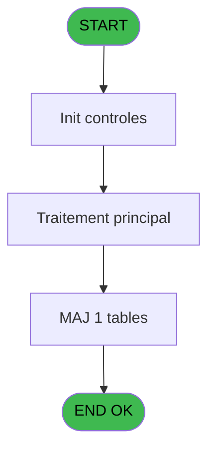

# PBG IDE 118 - Calcul recherche logement

> **Analyse**: Phases 1-4 2026-02-03 09:31 -> 09:31 (18s) | Assemblage 09:31
> **Pipeline**: V7.2 Enrichi
> **Structure**: 4 onglets (Resume | Ecrans | Donnees | Connexions)

<!-- TAB:Resume -->

## 1. FICHE D'IDENTITE

| Attribut | Valeur |
|----------|--------|
| Projet | PBG |
| IDE Position | 118 |
| Nom Programme | Calcul recherche logement |
| Fichier source | `Prg_118.xml` |
| Domaine metier | Consultation |
| Taches | 16 (1 ecrans visibles) |
| Tables modifiees | 1 |
| Programmes appeles | 0 |

## 2. DESCRIPTION FONCTIONNELLE

**Calcul recherche logement** assure la gestion complete de ce processus, accessible depuis [Recherche Logement (IDE 119)](PBG-IDE-119.md).

Le flux de traitement s'organise en **4 blocs fonctionnels** :

- **Traitement** (7 taches) : traitements metier divers
- **Validation** (4 taches) : controles et verifications de coherence
- **Consultation** (4 taches) : ecrans de recherche, selection et consultation
- **Creation** (1 tache) : insertion d'enregistrements en base (mouvements, prestations)

**Donnees modifiees** : 1 tables en ecriture (tempo_users).

Detail : phases du traitement

#### Phase 1 : Traitement (7 taches)

- **118** - Veuillez Patienter ... **[[ECRAN]](#ecran-t1)**
- **118.1.1** - Analyse hebergement
- **118.1.2** - Communicante
- **118.1.2.1** - Analyse hebergement
- **118.1.3** - Recuperation variable
- **118.1.6** - Check Chambre Comm occupée
- **118.1.7** - Recuperation variable

#### Phase 2 : Consultation (4 taches)

- **118.1** - Affiche **[[ECRAN]](#ecran-t2)**
- **118.1.5** - Exist select
- **118.1.8** - Exist select
- **118.1.9** - Exist select

#### Phase 3 : Validation (4 taches)

- **118.1.1.1** - Verif
- **118.1.2.1.1** - Verif
- **118.1.3.1** - Verif
- **118.1.7.1** - Verif

#### Phase 4 : Creation (1 tache)

- **118.1.4** - Creation

#### Tables impactees

| Table | Operations | Role metier |
|-------|-----------|-------------|
| tempo_users | **W**/L (3 usages) | Table temporaire ecran |

## 3. BLOCS FONCTIONNELS

### 3.1 Traitement (7 taches)

Traitements internes.

---

#### 118 - Veuillez Patienter ... [[ECRAN]](#ecran-t1)

**Role** : Tache d'orchestration : point d'entree du programme (7 sous-taches). Coordonne l'enchainement des traitements.
**Ecran** : 427 x 58 DLU (MDI) | [Voir mockup](#ecran-t1)

6 sous-taches directes

| Tache | Nom | Bloc |
|-------|-----|------|
| [118.1.1](#t3) | Analyse hebergement | Traitement |
| [118.1.2](#t5) | Communicante | Traitement |
| [118.1.2.1](#t6) | Analyse hebergement | Traitement |
| [118.1.3](#t8) | Recuperation variable | Traitement |
| [118.1.6](#t14) | Check Chambre Comm occupée | Traitement |
| [118.1.7](#t17) | Recuperation variable | Traitement |

---

#### 118.1.1 - Analyse hebergement

**Role** : Traitement : Analyse hebergement.

---

#### 118.1.2 - Communicante

**Role** : Traitement : Communicante.

---

#### 118.1.2.1 - Analyse hebergement

**Role** : Traitement : Analyse hebergement.

---

#### 118.1.3 - Recuperation variable

**Role** : Consultation/chargement : Recuperation variable.

---

#### 118.1.6 - Check Chambre Comm occupée

**Role** : Traitement : Check Chambre Comm occupée.
**Variables liees** : BI (v. Retour lien Chambre comm), H (Flag recherche ch comm cassée), Z (w1_FaitComm)

---

#### 118.1.7 - Recuperation variable

**Role** : Consultation/chargement : Recuperation variable.

### 3.2 Consultation (4 taches)

Ecrans de recherche et consultation.

---

#### 118.1 - Affiche [[ECRAN]](#ecran-t2)

**Role** : Reinitialisation : Affiche.
**Ecran** : 858 x 184 DLU (MDI) | [Voir mockup](#ecran-t2)

---

#### 118.1.5 - Exist select

**Role** : Traitement : Exist select.
**Variables liees** : F (<NbSelect)

---

#### 118.1.8 - Exist select

**Role** : Traitement : Exist select.
**Variables liees** : F (<NbSelect)

---

#### 118.1.9 - Exist select

**Role** : Traitement : Exist select.
**Variables liees** : F (<NbSelect)

### 3.3 Validation (4 taches)

Controles de coherence : 4 taches verifient les donnees et conditions.

---

#### 118.1.1.1 - Verif

**Role** : Verification : Verif.

---

#### 118.1.2.1.1 - Verif

**Role** : Verification : Verif.

---

#### 118.1.3.1 - Verif

**Role** : Verification : Verif.

---

#### 118.1.7.1 - Verif

**Role** : Verification : Verif.

### 3.4 Creation (1 tache)

Insertion de nouveaux enregistrements en base.

---

#### 118.1.4 - Creation

**Role** : Creation d'enregistrement : Creation.

## 5. REGLES METIER

*(Aucune regle metier identifiee)*

## 6. CONTEXTE

- **Appele par**: [Recherche Logement (IDE 119)](PBG-IDE-119.md)
- **Appelle**: 0 programmes | **Tables**: 7 (W:1 R:6 L:4) | **Taches**: 16 | **Expressions**: 18

<!-- TAB:Ecrans -->

## 8. ECRANS

### 8.1 Forms visibles (1 / 16)

| # | Position | Tache | Nom | Type | Largeur | Hauteur | Bloc |
|---|----------|-------|-----|------|---------|---------|------|
| 1 | 118 | 118 | Veuillez Patienter ... | MDI | 427 | 58 | Traitement |

### 8.2 Mockups Ecrans

---

#### 118 - Veuillez Patienter ...
**Tache** : [118](#t1) | **Type** : MDI | **Dimensions** : 427 x 58 DLU
**Bloc** : Traitement | **Titre IDE** : Veuillez Patienter ...

<!-- FORM-DATA:
{
    "width":  427,
    "vFactor":  8,
    "type":  "MDI",
    "hFactor":  8,
    "controls":  [
                     {
                         "x":  0,
                         "type":  "label",
                         "var":  "",
                         "y":  0,
                         "w":  423,
                         "fmt":  "",
                         "name":  "",
                         "h":  29,
                         "color":  "",
                         "text":  "",
                         "parent":  null
                     },
                     {
                         "x":  120,
                         "type":  "label",
                         "var":  "",
                         "y":  10,
                         "w":  221,
                         "fmt":  "",
                         "name":  "",
                         "h":  8,
                         "color":  "7",
                         "text":  "Traitement en cours ...",
                         "parent":  null
                     },
                     {
                         "x":  0,
                         "type":  "label",
                         "var":  "",
                         "y":  29,
                         "w":  423,
                         "fmt":  "",
                         "name":  "",
                         "h":  27,
                         "color":  "",
                         "text":  "",
                         "parent":  null
                     },
                     {
                         "x":  110,
                         "type":  "label",
                         "var":  "",
                         "y":  32,
                         "w":  114,
                         "fmt":  "",
                         "name":  "",
                         "h":  8,
                         "color":  "",
                         "text":  "Analyses",
                         "parent":  4
                     },
                     {
                         "x":  110,
                         "type":  "label",
                         "var":  "",
                         "y":  44,
                         "w":  139,
                         "fmt":  "",
                         "name":  "",
                         "h":  8,
                         "color":  "",
                         "text":  "Selectiones",
                         "parent":  4
                     },
                     {
                         "x":  4,
                         "type":  "image",
                         "var":  "",
                         "y":  2,
                         "w":  72,
                         "fmt":  "",
                         "name":  "",
                         "h":  25,
                         "color":  "",
                         "text":  "",
                         "parent":  null
                     },
                     {
                         "x":  259,
                         "type":  "edit",
                         "var":  "",
                         "y":  32,
                         "w":  56,
                         "fmt":  "",
                         "name":  "",
                         "h":  9,
                         "color":  "",
                         "text":  "",
                         "parent":  4
                     },
                     {
                         "x":  259,
                         "type":  "edit",
                         "var":  "",
                         "y":  44,
                         "w":  56,
                         "fmt":  "",
                         "name":  "",
                         "h":  9,
                         "color":  "",
                         "text":  "",
                         "parent":  4
                     }
                 ],
    "taskId":  "118",
    "height":  58
}
-->

<strong>Champs : 2 champs</strong>

| Pos (x,y) | Nom | Variable | Type |
|-----------|-----|----------|------|
| 259,32 | (sans nom) | - | edit |
| 259,44 | (sans nom) | - | edit |

## 9. NAVIGATION

Ecran unique: **Veuillez Patienter ...**

### 9.3 Structure hierarchique (16 taches)

| Position | Tache | Type | Dimensions | Bloc |
|----------|-------|------|------------|------|
| **118.1** | [**Veuillez Patienter ...** (118)](#t1) [mockup](#ecran-t1) | MDI | 427x58 | Traitement |
| 118.1.1 | [Analyse hebergement (118.1.1)](#t3) | MDI | - | |
| 118.1.2 | [Communicante (118.1.2)](#t5) | MDI | - | |
| 118.1.3 | [Analyse hebergement (118.1.2.1)](#t6) | MDI | - | |
| 118.1.4 | [Recuperation variable (118.1.3)](#t8) | MDI | - | |
| 118.1.5 | [Check Chambre Comm occupée (118.1.6)](#t14) | - | - | |
| 118.1.6 | [Recuperation variable (118.1.7)](#t17) | MDI | - | |
| **118.2** | [**Affiche** (118.1)](#t2) [mockup](#ecran-t2) | MDI | 858x184 | Consultation |
| 118.2.1 | [Exist select (118.1.5)](#t13) | MDI | - | |
| 118.2.2 | [Exist select (118.1.8)](#t21) | MDI | - | |
| 118.2.3 | [Exist select (118.1.9)](#t24) | MDI | - | |
| **118.3** | [**Verif** (118.1.1.1)](#t4) | MDI | - | Validation |
| 118.3.1 | [Verif (118.1.2.1.1)](#t7) | MDI | - | |
| 118.3.2 | [Verif (118.1.3.1)](#t9) | MDI | - | |
| 118.3.3 | [Verif (118.1.7.1)](#t18) | MDI | - | |
| **118.4** | [**Creation** (118.1.4)](#t12) | MDI | - | Creation |

### 9.4 Algorigramme

> **Legende**: Vert = START/END OK | Rouge = END KO | Bleu = Decisions
> *Algorigramme auto-genere. Utiliser `/algorigramme` pour une synthese metier detaillee.*

<!-- TAB:Donnees -->

## 10. TABLES

### Tables utilisees (7)

| ID | Nom | Description | Type | R | W | L | Usages |
|----|-----|-------------|------|---|---|---|--------|
| 34 | hebergement______heb | Hebergement (chambres) | DB | R |   |   | 3 |
| 103 | logement_client__loc |  | DB | R |   |   | 1 |
| 105 | logement_complement |  | DB | R |   | L | 3 |
| 651 | tempo_users | Table temporaire ecran | DB |   | **W** | L | 3 |
| 654 | tempo_date_heure | Table temporaire ecran | DB | R |   | L | 7 |
| 1030 | Table_1030 |  | MEM | R |   |   | 1 |
| 1054 | Table_1054 |  | MEM | R |   | L | 3 |

### Colonnes par table (7 / 7 tables avec colonnes identifiees)

Table 34 - hebergement______heb (R) - 3 usages

| Lettre | Variable | Acces | Type |
|--------|----------|-------|------|
| A | NB_Concerne | R | Numeric |
| B | w2_BlocageConstaté | R | Logical |
| C | w2_RéservationConstaté | R | Logical |
| D | w2_CodeAcces | R | Alpha |

Table 103 - logement_client__loc (R) - 1 usages

| Lettre | Variable | Acces | Type |
|--------|----------|-------|------|
| A | v.Chambre comm ? | R | Logical |
| B | w1_CondDate | R | Logical |
| C | w1_Selectionne | R | Logical |
| D | w1_Rattachement | R | Alpha |
| E | w1_ExistEns | R | Logical |
| F | w1_ExistCouch | R | Logical |
| G | w1_ExistLoge | R | Logical |
| H | w1_ExistBati | R | Logical |
| I | w1_ExistEtag | R | Logical |
| J | w1_ExistVue | R | Logical |
| K | w1_ExistComm | R | Logical |
| L | w1_ExistAtt | R | Logical |
| M | w1_ExistHand | R | Logical |
| N | w1_ExistSta | R | Logical |
| O | w1_ExistLieu | R | Logical |
| P | w1_ExistClog | R | Logical |
| Q | w1_ExistZone | R | Logical |
| R | w1_ExistSect | R | Logical |
| S | w1_ExistOccu | R | Logical |
| T | w1_FaitEns | R | Logical |
| U | w1_FaitCouch | R | Logical |
| V | w1_FaitLoge | R | Logical |
| W | w1_FaitBati | R | Logical |
| X | w1_FaitEtag | R | Logical |
| Y | w1_FaitVue | R | Logical |
| Z | w1_FaitComm | R | Logical |
| BA | w1_FaitAtt | R | Logical |
| BB | w1_FaitHand | R | Logical |
| BC | w1_FaitSta | R | Logical |
| BD | w1_FaitLieu | R | Logical |
| BE | w1_FaitClog | R | Logical |
| BF | w1_FaitZone | R | Logical |
| BG | w1_FaitSect | R | Logical |
| BH | w1_FaitOccu | R | Logical |
| BI | v. Retour lien Chambre comm | R | Logical |
| BJ | v. TOCCU OCC Complet | R | Logical |
| BK | v. TOCCU BLK Bloqué | R | Logical |
| BL | v. TOCCU RES Reservé | R | Logical |
| BM | v. TOCCU TTL Totalement Libre | R | Logical |

Table 105 - logement_complement (R/L) - 3 usages

| Lettre | Variable | Acces | Type |
|--------|----------|-------|------|
| L | RetLogement-------------------- | R | Logical |

Table 651 - tempo_users (**W**/L) - 3 usages

| Lettre | Variable | Acces | Type |
|--------|----------|-------|------|
| A | >DateDebut | W | Date |
| B | >HeureDebut | W | Alpha |
| C | >DateFin | W | Date |
| D | >HeureFin | W | Alpha |
| E | <Total | W | Numeric |
| F | <NbSelect | W | Numeric |
| G | Flag recherche cd Log unit | W | Logical |
| H | Flag recherche ch comm cassée | W | Logical |
| I | RetBatiment-------------------- | W | Logical |
| J | w0_BatiMin | W | Alpha |
| K | w0_BatiMax | W | Alpha |
| L | RetLogement-------------------- | W | Logical |
| M | w0_LogMin | W | Alpha |
| N | w0_LogMax | W | Alpha |
| O | RetEnsemble-------------------- | W | Logical |
| P | v. retour couchage | W | Logical |
| Q | w0_EnsMin | W | Alpha |
| R | w0_EnsMax | W | Alpha |
| S | w0_CouchageMin | W | Alpha |
| T | w0_CouchageMax | W | Alpha |
| U | RetEtage----------------------- | W | Logical |
| V | w0_EtageMin | W | Alpha |
| W | w0_EtageMax | W | Alpha |

Table 654 - tempo_date_heure (R/L) - 7 usages

| Lettre | Variable | Acces | Type |
|--------|----------|-------|------|
| A | >Categorie | R | Alpha |
| B | >NomTable | R | Alpha |
| C | <CodeRetour | R | Logical |
| D | w1_TousVrai | R | Logical |

Table 1030 - Table_1030 (R) - 1 usages

| Lettre | Variable | Acces | Type |
|--------|----------|-------|------|
| A | > nom table | R | Alpha |
| B | > code table | R | Alpha |

Table 1054 - Table_1054 (R/L) - 3 usages

| Lettre | Variable | Acces | Type |
|--------|----------|-------|------|
| A | >NomTable | R | Alpha |
| B | <CodeRetour | R | Logical |
| C | w1_TousVrai | R | Logical |

## 11. VARIABLES

### 11.1 Variables de session (6)

Variables persistantes pendant toute la session.

| Lettre | Nom | Type | Usage dans |
|--------|-----|------|-----------|
| P | v. retour couchage | Logical | - |
| BI | v. Retour lien Chambre comm | Logical | - |
| BJ | v. TOCCU OCC Complet | Logical | 1x session |
| BK | v. TOCCU BLK Bloqué | Logical | - |
| BL | v. TOCCU RES Reservé | Logical | - |
| BM | v. TOCCU TTL Totalement Libre | Logical | - |

### 11.2 Autres (33)

Variables diverses.

| Lettre | Nom | Type | Usage dans |
|--------|-----|------|-----------|
| A | >DateDebut | Date | - |
| B | >HeureDebut | Alpha | - |
| C | >DateFin | Date | - |
| D | >HeureFin | Alpha | - |
| E | <Total | Numeric | - |
| F | <NbSelect | Numeric | - |
| G | Flag recherche cd Log unit | Logical | - |
| H | Flag recherche ch comm cassée | Logical | - |
| I | RetBatiment-------------------- | Logical | - |
| J | w0_BatiMin | Alpha | - |
| K | w0_BatiMax | Alpha | 1x refs |
| L | RetLogement-------------------- | Logical | - |
| M | w0_LogMin | Alpha | - |
| N | w0_LogMax | Alpha | - |
| O | RetEnsemble-------------------- | Logical | - |
| Q | w0_EnsMin | Alpha | 1x refs |
| R | w0_EnsMax | Alpha | - |
| S | w0_CouchageMin | Alpha | - |
| T | w0_CouchageMax | Alpha | - |
| U | RetEtage----------------------- | Logical | - |
| V | w0_EtageMin | Alpha | - |
| W | w0_EtageMax | Alpha | - |
| X | w1_FaitEtag | Logical | - |
| Y | w1_FaitVue | Logical | - |
| Z | w1_FaitComm | Logical | 1x refs |
| BA | w1_FaitAtt | Logical | - |
| BB | w1_FaitHand | Logical | - |
| BC | w1_FaitSta | Logical | - |
| BD | w1_FaitLieu | Logical | 1x refs |
| BE | w1_FaitClog | Logical | - |
| BF | w1_FaitZone | Logical | - |
| BG | w1_FaitSect | Logical | - |
| BH | w1_FaitOccu | Logical | - |

Toutes les 39 variables (liste complete)

| Cat | Lettre | Nom Variable | Type |
|-----|--------|--------------|------|
| V. | **P** | v. retour couchage | Logical |
| V. | **BI** | v. Retour lien Chambre comm | Logical |
| V. | **BJ** | v. TOCCU OCC Complet | Logical |
| V. | **BK** | v. TOCCU BLK Bloqué | Logical |
| V. | **BL** | v. TOCCU RES Reservé | Logical |
| V. | **BM** | v. TOCCU TTL Totalement Libre | Logical |
| Autre | **A** | >DateDebut | Date |
| Autre | **B** | >HeureDebut | Alpha |
| Autre | **C** | >DateFin | Date |
| Autre | **D** | >HeureFin | Alpha |
| Autre | **E** | <Total | Numeric |
| Autre | **F** | <NbSelect | Numeric |
| Autre | **G** | Flag recherche cd Log unit | Logical |
| Autre | **H** | Flag recherche ch comm cassée | Logical |
| Autre | **I** | RetBatiment-------------------- | Logical |
| Autre | **J** | w0_BatiMin | Alpha |
| Autre | **K** | w0_BatiMax | Alpha |
| Autre | **L** | RetLogement-------------------- | Logical |
| Autre | **M** | w0_LogMin | Alpha |
| Autre | **N** | w0_LogMax | Alpha |
| Autre | **O** | RetEnsemble-------------------- | Logical |
| Autre | **Q** | w0_EnsMin | Alpha |
| Autre | **R** | w0_EnsMax | Alpha |
| Autre | **S** | w0_CouchageMin | Alpha |
| Autre | **T** | w0_CouchageMax | Alpha |
| Autre | **U** | RetEtage----------------------- | Logical |
| Autre | **V** | w0_EtageMin | Alpha |
| Autre | **W** | w0_EtageMax | Alpha |
| Autre | **X** | w1_FaitEtag | Logical |
| Autre | **Y** | w1_FaitVue | Logical |
| Autre | **Z** | w1_FaitComm | Logical |
| Autre | **BA** | w1_FaitAtt | Logical |
| Autre | **BB** | w1_FaitHand | Logical |
| Autre | **BC** | w1_FaitSta | Logical |
| Autre | **BD** | w1_FaitLieu | Logical |
| Autre | **BE** | w1_FaitClog | Logical |
| Autre | **BF** | w1_FaitZone | Logical |
| Autre | **BG** | w1_FaitSect | Logical |
| Autre | **BH** | w1_FaitOccu | Logical |

## 12. EXPRESSIONS

**18 / 18 expressions decodees (100%)**

### 12.1 Repartition par type

| Type | Expressions | Regles |
|------|-------------|--------|
| CONSTANTE | 6 | 0 |
| REFERENCE_VG | 1 | 0 |
| CAST_LOGIQUE | 1 | 0 |
| OTHER | 10 | 0 |

### 12.2 Expressions cles par type

#### CONSTANTE (6 expressions)

| Type | IDE | Expression | Regle |
|------|-----|------------|-------|
| CONSTANTE | 5 | `'VENSE'` | - |
| CONSTANTE | 6 | `'TETAG'` | - |
| CONSTANTE | 16 | `0` | - |
| CONSTANTE | 2 | `'L'` | - |
| CONSTANTE | 3 | `'VBATI'` | - |
| ... | | *+1 autres* | |

#### REFERENCE_VG (1 expressions)

| Type | IDE | Expression | Regle |
|------|-----|------------|-------|
| REFERENCE_VG | 1 | `VG20` | - |

#### CAST_LOGIQUE (1 expressions)

| Type | IDE | Expression | Regle |
|------|-----|------------|-------|
| CAST_LOGIQUE | 7 | `'TRUE'LOG` | - |

#### OTHER (10 expressions)

| Type | IDE | Expression | Regle |
|------|-----|------------|-------|
| OTHER | 14 | `w1_FaitLieu [BD]` | - |
| OTHER | 13 | `[AU]` | - |
| OTHER | 15 | `v. TOCCU OCC Complet [BJ]` | - |
| OTHER | 18 | `[EK]` | - |
| OTHER | 17 | `[EE]` | - |
| ... | | *+5 autres* | |

<!-- TAB:Connexions -->

## 13. GRAPHE D'APPELS

### 13.1 Chaine depuis Main (Callers)

Main -> ... -> [Recherche Logement (IDE 119)](PBG-IDE-119.md) -> **Calcul recherche logement (IDE 118)**

### 13.2 Callers

| IDE | Nom Programme | Nb Appels |
|-----|---------------|-----------|
| [119](PBG-IDE-119.md) | Recherche Logement | 1 |

### 13.3 Callees (programmes appeles)

### 13.4 Detail Callees avec contexte

| IDE | Nom Programme | Appels | Contexte |
|-----|---------------|--------|----------|
| - | (aucun) | - | - |

## 14. RECOMMANDATIONS MIGRATION

### 14.1 Profil du programme

| Metrique | Valeur | Impact migration |
|----------|--------|-----------------|
| Lignes de logique | 467 | Taille moyenne |
| Expressions | 18 | Peu de logique |
| Tables WRITE | 1 | Impact faible |
| Sous-programmes | 0 | Peu de dependances |
| Ecrans visibles | 1 | Ecran unique ou traitement batch |
| Code desactive | 0.4% (2 / 467) | Code sain |
| Regles metier | 0 | Pas de regle identifiee |

### 14.2 Plan de migration par bloc

#### Traitement (7 taches: 1 ecran, 6 traitements)

- **Strategie** : Orchestrateur avec 1 ecrans (Razor/React) et 6 traitements backend (services).
- Les ecrans deviennent des composants UI, les traitements invisibles deviennent des services injectables.
- Decomposer les taches en services unitaires testables.

#### Consultation (4 taches: 1 ecran, 3 traitements)

- **Strategie** : Composants de recherche/selection en modales.
- 1 ecran : Affiche

#### Validation (4 taches: 0 ecran, 4 traitements)

- **Strategie** : FluentValidation avec validators specifiques.
- Chaque tache de validation -> un validator injectable

#### Creation (1 tache: 0 ecran, 1 traitement)

- **Strategie** : Repository pattern avec Entity Framework Core.
- Insertion via `IRepository<T>.CreateAsync()`

### 14.3 Dependances critiques

| Dependance | Type | Appels | Impact |
|------------|------|--------|--------|
| tempo_users | Table WRITE (Database) | 2x | Schema + repository |

---
*Spec DETAILED generee par Pipeline V7.2 - 2026-02-03 09:31*
