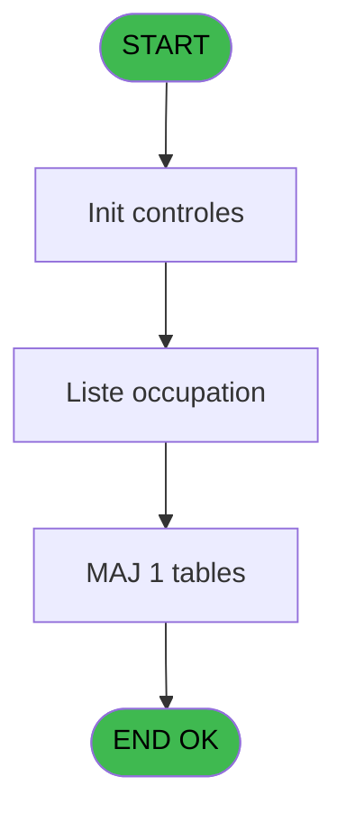
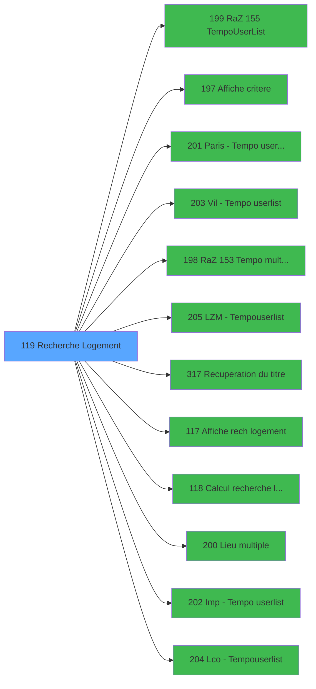

# PBG IDE 119 - Recherche Logement

> **Analyse**: Phases 1-4 2026-02-03 09:31 -> 09:31 (17s) | Assemblage 09:31
> **Pipeline**: V7.2 Enrichi
> **Structure**: 4 onglets (Resume | Ecrans | Donnees | Connexions)

<!-- TAB:Resume -->

## 1. FICHE D'IDENTITE

| Attribut | Valeur |
|----------|--------|
| Projet | PBG |
| IDE Position | 119 |
| Nom Programme | Recherche Logement |
| Fichier source | `Prg_119.xml` |
| Domaine metier | Consultation |
| Taches | 7 (3 ecrans visibles) |
| Tables modifiees | 1 |
| Programmes appeles | 12 |
| :warning: Statut | **ORPHELIN_POTENTIEL** |

## 2. DESCRIPTION FONCTIONNELLE

**Recherche Logement** assure la gestion complete de ce processus.

Le flux de traitement s'organise en **2 blocs fonctionnels** :

- **Consultation** (4 taches) : ecrans de recherche, selection et consultation
- **Traitement** (3 taches) : traitements metier divers

**Donnees modifiees** : 1 tables en ecriture (Table_1054).

Detail : phases du traitement

#### Phase 1 : Traitement (3 taches)

- **119** - Liste occupation **[[ECRAN]](#ecran-t1)**
- **119.1.2** - Veuillez patienter ... **[[ECRAN]](#ecran-t6)**
- **119.1.4** - Veuillez patienter ... **[[ECRAN]](#ecran-t12)**

Delegue a : [Paris -> Tempo userlist (IDE 201)](PBG-IDE-201.md), [Vil -> Tempo userlist (IDE 203)](PBG-IDE-203.md), [LZM -> Tempouserlist (IDE 205)](PBG-IDE-205.md), [Recuperation du titre (IDE 317)](PBG-IDE-317.md), [Lieu multiple (IDE 200)](PBG-IDE-200.md), [Imp -> Tempo userlist (IDE 202)](PBG-IDE-202.md), [Lco  -> Tempouserlist (IDE 204)](PBG-IDE-204.md)

#### Phase 2 : Consultation (4 taches)

- **119.1** - Recherche logement **[[ECRAN]](#ecran-t2)**
- **119.1.1** - Exist select
- **119.1.3** - Exist select
- **119.1.5** - Affiche logement **[[ECRAN]](#ecran-t15)**

Delegue a : [  Affiche critere (IDE 197)](PBG-IDE-197.md), [Recuperation du titre (IDE 317)](PBG-IDE-317.md), [   Affiche rech logement (IDE 117)](PBG-IDE-117.md)

#### Tables impactees

| Table | Operations | Role metier |
|-------|-----------|-------------|
| Table_1054 | R/**W** (4 usages) |  |

## 3. BLOCS FONCTIONNELS

### 3.1 Traitement (3 taches)

Traitements internes.

---

#### 119 - Liste occupation [[ECRAN]](#ecran-t1)

**Role** : Traitement : Liste occupation.
**Ecran** : 77 x 77 DLU (MDI) | [Voir mockup](#ecran-t1)
**Delegue a** : [Paris -> Tempo userlist (IDE 201)](PBG-IDE-201.md), [Vil -> Tempo userlist (IDE 203)](PBG-IDE-203.md), [LZM -> Tempouserlist (IDE 205)](PBG-IDE-205.md)

---

#### 119.1.2 - Veuillez patienter ... [[ECRAN]](#ecran-t6)

**Role** : Traitement : Veuillez patienter ....
**Ecran** : 427 x 58 DLU (MDI) | [Voir mockup](#ecran-t6)
**Delegue a** : [Paris -> Tempo userlist (IDE 201)](PBG-IDE-201.md), [Vil -> Tempo userlist (IDE 203)](PBG-IDE-203.md), [LZM -> Tempouserlist (IDE 205)](PBG-IDE-205.md)

---

#### 119.1.4 - Veuillez patienter ... [[ECRAN]](#ecran-t12)

**Role** : Traitement : Veuillez patienter ....
**Ecran** : 427 x 58 DLU (MDI) | [Voir mockup](#ecran-t12)
**Delegue a** : [Paris -> Tempo userlist (IDE 201)](PBG-IDE-201.md), [Vil -> Tempo userlist (IDE 203)](PBG-IDE-203.md), [LZM -> Tempouserlist (IDE 205)](PBG-IDE-205.md)

### 3.2 Consultation (4 taches)

Ecrans de recherche et consultation.

---

#### 119.1 - Recherche logement [[ECRAN]](#ecran-t2)

**Role** : Traitement : Recherche logement.
**Ecran** : 734 x 277 DLU (MDI) | [Voir mockup](#ecran-t2)
**Variables liees** : W (b_LogementRaZ), BK (b_Logement), BY (RetourLogement), CM (b_Recherche)
**Delegue a** : [  Affiche critere (IDE 197)](PBG-IDE-197.md), [   Affiche rech logement (IDE 117)](PBG-IDE-117.md), [  Calcul recherche logement (IDE 118)](PBG-IDE-118.md)

---

#### 119.1.1 - Exist select

**Role** : Traitement : Exist select.
**Variables liees** : K (w0_NbSelect), CJ (w0_ExistSelect)
**Delegue a** : [  Affiche critere (IDE 197)](PBG-IDE-197.md), [   Affiche rech logement (IDE 117)](PBG-IDE-117.md)

---

#### 119.1.3 - Exist select

**Role** : Traitement : Exist select.
**Variables liees** : K (w0_NbSelect), CJ (w0_ExistSelect)
**Delegue a** : [  Affiche critere (IDE 197)](PBG-IDE-197.md), [   Affiche rech logement (IDE 117)](PBG-IDE-117.md)

---

#### 119.1.5 - Affiche logement [[ECRAN]](#ecran-t15)

**Role** : Reinitialisation : Affiche logement.
**Ecran** : 676 x 201 DLU (MDI) | [Voir mockup](#ecran-t15)
**Variables liees** : W (b_LogementRaZ), BK (b_Logement), BY (RetourLogement)
**Delegue a** : [  Affiche critere (IDE 197)](PBG-IDE-197.md), [   Affiche rech logement (IDE 117)](PBG-IDE-117.md)

## 5. REGLES METIER

*(Aucune regle metier identifiee)*

## 6. CONTEXTE

- **Appele par**: (aucun)
- **Appelle**: 12 programmes | **Tables**: 3 (W:1 R:2 L:1) | **Taches**: 7 | **Expressions**: 2

<!-- TAB:Ecrans -->

## 8. ECRANS

### 8.1 Forms visibles (3 / 7)

| # | Position | Tache | Nom | Type | Largeur | Hauteur | Bloc |
|---|----------|-------|-----|------|---------|---------|------|
| 1 | 119.1 | 119.1 | Recherche logement | MDI | 734 | 277 | Consultation |
| 2 | 119.1.3 | 119.1.2 | Veuillez patienter ... | MDI | 427 | 58 | Traitement |
| 3 | 119.1.1 | 119.1.5 | Affiche logement | MDI | 676 | 201 | Consultation |

### 8.2 Mockups Ecrans

---

#### 119.1 - Recherche logement
**Tache** : [119.1](#t2) | **Type** : MDI | **Dimensions** : 734 x 277 DLU
**Bloc** : Consultation | **Titre IDE** : Recherche logement

<!-- FORM-DATA:
{
    "width":  734,
    "vFactor":  8,
    "type":  "MDI",
    "hFactor":  8,
    "controls":  [
                     {
                         "x":  0,
                         "type":  "label",
                         "var":  "",
                         "y":  1,
                         "w":  732,
                         "fmt":  "",
                         "name":  "",
                         "h":  19,
                         "color":  "1",
                         "text":  "",
                         "parent":  null
                     },
                     {
                         "x":  10,
                         "type":  "label",
                         "var":  "",
                         "y":  20,
                         "w":  303,
                         "fmt":  "",
                         "name":  "",
                         "h":  229,
                         "color":  "",
                         "text":  "",
                         "parent":  null
                     },
                     {
                         "x":  327,
                         "type":  "label",
                         "var":  "",
                         "y":  20,
                         "w":  397,
                         "fmt":  "",
                         "name":  "",
                         "h":  156,
                         "color":  "",
                         "text":  "",
                         "parent":  null
                     },
                     {
                         "x":  338,
                         "type":  "label",
                         "var":  "",
                         "y":  26,
                         "w":  183,
                         "fmt":  "",
                         "name":  "",
                         "h":  18,
                         "color":  "173",
                         "text":  "",
                         "parent":  6
                     },
                     {
                         "x":  530,
                         "type":  "label",
                         "var":  "",
                         "y":  26,
                         "w":  183,
                         "fmt":  "",
                         "name":  "",
                         "h":  18,
                         "color":  "173",
                         "text":  "",
                         "parent":  6
                     },
                     {
                         "x":  18,
                         "type":  "label",
                         "var":  "",
                         "y":  26,
                         "w":  111,
                         "fmt":  "",
                         "name":  "",
                         "h":  9,
                         "color":  "142",
                         "text":  "Selectionnes",
                         "parent":  5
                     },
                     {
                         "x":  197,
                         "type":  "label",
                         "var":  "",
                         "y":  26,
                         "w":  46,
                         "fmt":  "",
                         "name":  "",
                         "h":  9,
                         "color":  "142",
                         "text":  "Total",
                         "parent":  5
                     },
                     {
                         "x":  13,
                         "type":  "line",
                         "var":  "",
                         "y":  38,
                         "w":  297,
                         "fmt":  "",
                         "name":  "",
                         "h":  0,
                         "color":  "",
                         "text":  "",
                         "parent":  5
                     },
                     {
                         "x":  26,
                         "type":  "label",
                         "var":  "",
                         "y":  42,
                         "w":  210,
                         "fmt":  "",
                         "name":  "",
                         "h":  8,
                         "color":  "",
                         "text":  "Occupations",
                         "parent":  5
                     },
                     {
                         "x":  338,
                         "type":  "label",
                         "var":  "",
                         "y":  47,
                         "w":  183,
                         "fmt":  "",
                         "name":  "",
                         "h":  18,
                         "color":  "173",
                         "text":  "",
                         "parent":  6
                     },
                     {
                         "x":  530,
                         "type":  "label",
                         "var":  "",
                         "y":  47,
                         "w":  183,
                         "fmt":  "",
                         "name":  "",
                         "h":  18,
                         "color":  "173",
                         "text":  "",
                         "parent":  6
                     },
                     {
                         "x":  13,
                         "type":  "line",
                         "var":  "",
                         "y":  52,
                         "w":  297,
                         "fmt":  "",
                         "name":  "",
                         "h":  0,
                         "color":  "",
                         "text":  "",
                         "parent":  5
                     },
                     {
                         "x":  26,
                         "type":  "label",
                         "var":  "",
                         "y":  57,
                         "w":  180,
                         "fmt":  "",
                         "name":  "",
                         "h":  8,
                         "color":  "",
                         "text":  "Batiment",
                         "parent":  5
                     },
                     {
                         "x":  13,
                         "type":  "line",
                         "var":  "",
                         "y":  67,
                         "w":  297,
                         "fmt":  "",
                         "name":  "",
                         "h":  0,
                         "color":  "",
                         "text":  "",
                         "parent":  5
                     },
                     {
                         "x":  338,
                         "type":  "label",
                         "var":  "",
                         "y":  69,
                         "w":  183,
                         "fmt":  "",
                         "name":  "",
                         "h":  18,
                         "color":  "173",
                         "text":  "",
                         "parent":  6
                     },
                     {
                         "x":  530,
                         "type":  "label",
                         "var":  "",
                         "y":  69,
                         "w":  183,
                         "fmt":  "",
                         "name":  "",
                         "h":  18,
                         "color":  "173",
                         "text":  "",
                         "parent":  6
                     },
                     {
                         "x":  26,
                         "type":  "label",
                         "var":  "",
                         "y":  72,
                         "w":  188,
                         "fmt":  "",
                         "name":  "",
                         "h":  8,
                         "color":  "",
                         "text":  "Ensemble",
                         "parent":  5
                     },
                     {
                         "x":  13,
                         "type":  "line",
                         "var":  "",
                         "y":  82,
                         "w":  297,
                         "fmt":  "",
                         "name":  "",
                         "h":  0,
                         "color":  "",
                         "text":  "",
                         "parent":  5
                     },
                     {
                         "x":  26,
                         "type":  "label",
                         "var":  "",
                         "y":  87,
                         "w":  197,
                         "fmt":  "",
                         "name":  "",
                         "h":  8,
                         "color":  "",
                         "text":  "Logements",
                         "parent":  5
                     },
                     {
                         "x":  338,
                         "type":  "label",
                         "var":  "",
                         "y":  90,
                         "w":  183,
                         "fmt":  "",
                         "name":  "",
                         "h":  18,
                         "color":  "173",
                         "text":  "",
                         "parent":  6
                     },
                     {
                         "x":  530,
                         "type":  "label",
                         "var":  "",
                         "y":  90,
                         "w":  183,
                         "fmt":  "",
                         "name":  "",
                         "h":  18,
                         "color":  "173",
                         "text":  "",
                         "parent":  6
                     },
                     {
                         "x":  13,
                         "type":  "line",
                         "var":  "",
                         "y":  97,
                         "w":  297,
                         "fmt":  "",
                         "name":  "",
                         "h":  0,
                         "color":  "",
                         "text":  "",
                         "parent":  5
                     },
                     {
                         "x":  26,
                         "type":  "label",
                         "var":  "",
                         "y":  102,
                         "w":  167,
                         "fmt":  "",
                         "name":  "",
                         "h":  8,
                         "color":  "",
                         "text":  "Etages",
                         "parent":  5
                     },
                     {
                         "x":  338,
                         "type":  "label",
                         "var":  "",
                         "y":  112,
                         "w":  183,
                         "fmt":  "",
                         "name":  "",
                         "h":  18,
                         "color":  "173",
                         "text":  "",
                         "parent":  6
                     },
                     {
                         "x":  530,
                         "type":  "label",
                         "var":  "",
                         "y":  112,
                         "w":  183,
                         "fmt":  "",
                         "name":  "",
                         "h":  18,
                         "color":  "173",
                         "text":  "",
                         "parent":  6
                     },
                     {
                         "x":  13,
                         "type":  "line",
                         "var":  "",
                         "y":  112,
                         "w":  297,
                         "fmt":  "",
                         "name":  "",
                         "h":  0,
                         "color":  "",
                         "text":  "",
                         "parent":  5
                     },
                     {
                         "x":  26,
                         "type":  "label",
                         "var":  "",
                         "y":  117,
                         "w":  152,
                         "fmt":  "",
                         "name":  "",
                         "h":  8,
                         "color":  "",
                         "text":  "Vues",
                         "parent":  5
                     },
                     {
                         "x":  13,
                         "type":  "line",
                         "var":  "",
                         "y":  128,
                         "w":  297,
                         "fmt":  "",
                         "name":  "",
                         "h":  0,
                         "color":  "",
                         "text":  "",
                         "parent":  5
                     },
                     {
                         "x":  26,
                         "type":  "label",
                         "var":  "",
                         "y":  132,
                         "w":  226,
                         "fmt":  "",
                         "name":  "",
                         "h":  8,
                         "color":  "",
                         "text":  "Communicante",
                         "parent":  5
                     },
                     {
                         "x":  338,
                         "type":  "label",
                         "var":  "",
                         "y":  133,
                         "w":  183,
                         "fmt":  "",
                         "name":  "",
                         "h":  18,
                         "color":  "173",
                         "text":  "",
                         "parent":  6
                     },
                     {
                         "x":  530,
                         "type":  "label",
                         "var":  "",
                         "y":  133,
                         "w":  183,
                         "fmt":  "",
                         "name":  "",
                         "h":  18,
                         "color":  "173",
                         "text":  "",
                         "parent":  6
                     },
                     {
                         "x":  13,
                         "type":  "line",
                         "var":  "",
                         "y":  143,
                         "w":  297,
                         "fmt":  "",
                         "name":  "",
                         "h":  0,
                         "color":  "",
                         "text":  "",
                         "parent":  5
                     },
                     {
                         "x":  26,
                         "type":  "label",
                         "var":  "",
                         "y":  147,
                         "w":  189,
                         "fmt":  "",
                         "name":  "",
                         "h":  8,
                         "color":  "",
                         "text":  "Attribution",
                         "parent":  5
                     },
                     {
                         "x":  338,
                         "type":  "label",
                         "var":  "",
                         "y":  155,
                         "w":  183,
                         "fmt":  "",
                         "name":  "",
                         "h":  18,
                         "color":  "173",
                         "text":  "",
                         "parent":  6
                     },
                     {
                         "x":  530,
                         "type":  "label",
                         "var":  "",
                         "y":  155,
                         "w":  183,
                         "fmt":  "",
                         "name":  "",
                         "h":  18,
                         "color":  "173",
                         "text":  "",
                         "parent":  6
                     },
                     {
                         "x":  13,
                         "type":  "line",
                         "var":  "",
                         "y":  158,
                         "w":  297,
                         "fmt":  "",
                         "name":  "",
                         "h":  0,
                         "color":  "",
                         "text":  "",
                         "parent":  5
                     },
                     {
                         "x":  26,
                         "type":  "label",
                         "var":  "",
                         "y":  162,
                         "w":  188,
                         "fmt":  "",
                         "name":  "",
                         "h":  8,
                         "color":  "",
                         "text":  "Handicap",
                         "parent":  5
                     },
                     {
                         "x":  13,
                         "type":  "line",
                         "var":  "",
                         "y":  173,
                         "w":  297,
                         "fmt":  "",
                         "name":  "",
                         "h":  0,
                         "color":  "",
                         "text":  "",
                         "parent":  5
                     },
                     {
                         "x":  26,
                         "type":  "label",
                         "var":  "",
                         "y":  177,
                         "w":  181,
                         "fmt":  "",
                         "name":  "",
                         "h":  8,
                         "color":  "",
                         "text":  "Standing",
                         "parent":  5
                     },
                     {
                         "x":  327,
                         "type":  "label",
                         "var":  "",
                         "y":  179,
                         "w":  397,
                         "fmt":  "",
                         "name":  "",
                         "h":  70,
                         "color":  "",
                         "text":  "",
                         "parent":  null
                     },
                     {
                         "x":  13,
                         "type":  "line",
                         "var":  "",
                         "y":  188,
                         "w":  297,
                         "fmt":  "",
                         "name":  "",
                         "h":  0,
                         "color":  "",
                         "text":  "",
                         "parent":  5
                     },
                     {
                         "x":  26,
                         "type":  "label",
                         "var":  "",
                         "y":  192,
                         "w":  146,
                         "fmt":  "",
                         "name":  "",
                         "h":  8,
                         "color":  "",
                         "text":  "Lieu",
                         "parent":  5
                     },
                     {
                         "x":  333,
                         "type":  "label",
                         "var":  "",
                         "y":  191,
                         "w":  135,
                         "fmt":  "",
                         "name":  "",
                         "h":  8,
                         "color":  "",
                         "text":  "Date de début",
                         "parent":  45
                     },
                     {
                         "x":  688,
                         "type":  "label",
                         "var":  "",
                         "y":  192,
                         "w":  21,
                         "fmt":  "",
                         "name":  "",
                         "h":  9,
                         "color":  "",
                         "text":  "H",
                         "parent":  45
                     },
                     {
                         "x":  13,
                         "type":  "line",
                         "var":  "",
                         "y":  203,
                         "w":  297,
                         "fmt":  "",
                         "name":  "",
                         "h":  0,
                         "color":  "",
                         "text":  "",
                         "parent":  5
                     },
                     {
                         "x":  26,
                         "type":  "label",
                         "var":  "",
                         "y":  207,
                         "w":  234,
                         "fmt":  "",
                         "name":  "",
                         "h":  8,
                         "color":  "",
                         "text":  "Code Logement",
                         "parent":  5
                     },
                     {
                         "x":  13,
                         "type":  "line",
                         "var":  "",
                         "y":  218,
                         "w":  297,
                         "fmt":  "",
                         "name":  "",
                         "h":  0,
                         "color":  "",
                         "text":  "",
                         "parent":  5
                     },
                     {
                         "x":  333,
                         "type":  "label",
                         "var":  "",
                         "y":  209,
                         "w":  91,
                         "fmt":  "",
                         "name":  "",
                         "h":  8,
                         "color":  "",
                         "text":  "Date fin",
                         "parent":  45
                     },
                     {
                         "x":  688,
                         "type":  "label",
                         "var":  "",
                         "y":  209,
                         "w":  21,
                         "fmt":  "",
                         "name":  "",
                         "h":  9,
                         "color":  "",
                         "text":  "H",
                         "parent":  45
                     },
                     {
                         "x":  26,
                         "type":  "label",
                         "var":  "",
                         "y":  223,
                         "w":  154,
                         "fmt":  "",
                         "name":  "",
                         "h":  8,
                         "color":  "",
                         "text":  "Zone",
                         "parent":  5
                     },
                     {
                         "x":  13,
                         "type":  "line",
                         "var":  "",
                         "y":  233,
                         "w":  297,
                         "fmt":  "",
                         "name":  "",
                         "h":  0,
                         "color":  "",
                         "text":  "",
                         "parent":  5
                     },
                     {
                         "x":  26,
                         "type":  "label",
                         "var":  "",
                         "y":  237,
                         "w":  173,
                         "fmt":  "",
                         "name":  "",
                         "h":  8,
                         "color":  "",
                         "text":  "Secteur",
                         "parent":  5
                     },
                     {
                         "x":  0,
                         "type":  "label",
                         "var":  "",
                         "y":  252,
                         "w":  732,
                         "fmt":  "",
                         "name":  "",
                         "h":  25,
                         "color":  "1",
                         "text":  "",
                         "parent":  null
                     },
                     {
                         "x":  333,
                         "type":  "label",
                         "var":  "",
                         "y":  224,
                         "w":  298,
                         "fmt":  "",
                         "name":  "",
                         "h":  8,
                         "color":  "",
                         "text":  "Recherche logement sur code unitaire",
                         "parent":  45
                     },
                     {
                         "x":  333,
                         "type":  "label",
                         "var":  "",
                         "y":  237,
                         "w":  298,
                         "fmt":  "",
                         "name":  "",
                         "h":  8,
                         "color":  "",
                         "text":  "Chambres communiquantes cassées",
                         "parent":  45
                     },
                     {
                         "x":  245,
                         "type":  "edit",
                         "var":  "",
                         "y":  26,
                         "w":  56,
                         "fmt":  "",
                         "name":  "",
                         "h":  9,
                         "color":  "",
                         "text":  "",
                         "parent":  5
                     },
                     {
                         "x":  125,
                         "type":  "edit",
                         "var":  "",
                         "y":  26,
                         "w":  56,
                         "fmt":  "",
                         "name":  "",
                         "h":  9,
                         "color":  "",
                         "text":  "",
                         "parent":  5
                     },
                     {
                         "x":  472,
                         "type":  "edit",
                         "var":  "",
                         "y":  191,
                         "w":  126,
                         "fmt":  "DD/MM/YYYY",
                         "name":  "w0_DateMin",
                         "h":  10,
                         "color":  "110",
                         "text":  "",
                         "parent":  45
                     },
                     {
                         "x":  600,
                         "type":  "button",
                         "var":  "",
                         "y":  191,
                         "w":  28,
                         "fmt":  "...",
                         "name":  "b_ZoomDateMin",
                         "h":  10,
                         "color":  "",
                         "text":  "",
                         "parent":  45
                     },
                     {
                         "x":  642,
                         "type":  "edit",
                         "var":  "",
                         "y":  191,
                         "w":  37,
                         "fmt":  "",
                         "name":  "w0_HeureMin",
                         "h":  10,
                         "color":  "110",
                         "text":  "",
                         "parent":  45
                     },
                     {
                         "x":  472,
                         "type":  "edit",
                         "var":  "",
                         "y":  209,
                         "w":  126,
                         "fmt":  "DD/MM/YYYY",
                         "name":  "w0_DateMax",
                         "h":  10,
                         "color":  "110",
                         "text":  "",
                         "parent":  45
                     },
                     {
                         "x":  600,
                         "type":  "button",
                         "var":  "",
                         "y":  209,
                         "w":  28,
                         "fmt":  "...",
                         "name":  "b_ZoomDateMax",
                         "h":  10,
                         "color":  "",
                         "text":  "",
                         "parent":  45
                     },
                     {
                         "x":  642,
                         "type":  "edit",
                         "var":  "",
                         "y":  209,
                         "w":  37,
                         "fmt":  "",
                         "name":  "w0_HeureMax",
                         "h":  10,
                         "color":  "110",
                         "text":  "",
                         "parent":  45
                     },
                     {
                         "x":  642,
                         "type":  "checkbox",
                         "var":  "",
                         "y":  222,
                         "w":  26,
                         "fmt":  "",
                         "name":  "w0_Recherce cd log unit.",
                         "h":  12,
                         "color":  "",
                         "text":  "",
                         "parent":  45
                     },
                     {
                         "x":  269,
                         "type":  "button",
                         "var":  "",
                         "y":  39,
                         "w":  41,
                         "fmt":  "",
                         "name":  "b_OccupationRaZ",
                         "h":  14,
                         "color":  "",
                         "text":  "",
                         "parent":  null
                     },
                     {
                         "x":  269,
                         "type":  "button",
                         "var":  "",
                         "y":  53,
                         "w":  41,
                         "fmt":  "",
                         "name":  "b_BatimentRaZ",
                         "h":  15,
                         "color":  "",
                         "text":  "",
                         "parent":  5
                     },
                     {
                         "x":  269,
                         "type":  "button",
                         "var":  "",
                         "y":  67,
                         "w":  41,
                         "fmt":  "",
                         "name":  "b_EnsembleRaZ",
                         "h":  16,
                         "color":  "",
                         "text":  "",
                         "parent":  5
                     },
                     {
                         "x":  269,
                         "type":  "button",
                         "var":  "",
                         "y":  82,
                         "w":  41,
                         "fmt":  "",
                         "name":  "b_LogementRaZ",
                         "h":  17,
                         "color":  "",
                         "text":  "",
                         "parent":  5
                     },
                     {
                         "x":  269,
                         "type":  "button",
                         "var":  "",
                         "y":  98,
                         "w":  41,
                         "fmt":  "",
                         "name":  "b_EtageRaZ",
                         "h":  15,
                         "color":  "",
                         "text":  "",
                         "parent":  5
                     },
                     {
                         "x":  269,
                         "type":  "button",
                         "var":  "",
                         "y":  112,
                         "w":  41,
                         "fmt":  "",
                         "name":  "b_VuesRaZ",
                         "h":  17,
                         "color":  "",
                         "text":  "",
                         "parent":  5
                     },
                     {
                         "x":  269,
                         "type":  "button",
                         "var":  "",
                         "y":  128,
                         "w":  41,
                         "fmt":  "",
                         "name":  "b_CommunicanteRaZ",
                         "h":  15,
                         "color":  "",
                         "text":  "",
                         "parent":  5
                     },
                     {
                         "x":  269,
                         "type":  "button",
                         "var":  "",
                         "y":  142,
                         "w":  41,
                         "fmt":  "",
                         "name":  "b_AttributionRaZ",
                         "h":  18,
                         "color":  "",
                         "text":  "",
                         "parent":  5
                     },
                     {
                         "x":  269,
                         "type":  "button",
                         "var":  "",
                         "y":  159,
                         "w":  41,
                         "fmt":  "",
                         "name":  "b_HandicapeRaZ",
                         "h":  15,
                         "color":  "",
                         "text":  "",
                         "parent":  5
                     },
                     {
                         "x":  269,
                         "type":  "button",
                         "var":  "",
                         "y":  173,
                         "w":  41,
                         "fmt":  "",
                         "name":  "b_StandingRaZ",
                         "h":  15,
                         "color":  "",
                         "text":  "",
                         "parent":  5
                     },
                     {
                         "x":  269,
                         "type":  "button",
                         "var":  "",
                         "y":  187,
                         "w":  41,
                         "fmt":  "",
                         "name":  "b_LieuRaZ",
                         "h":  18,
                         "color":  "",
                         "text":  "",
                         "parent":  5
                     },
                     {
                         "x":  269,
                         "type":  "button",
                         "var":  "",
                         "y":  203,
                         "w":  41,
                         "fmt":  "",
                         "name":  "b_CodLogRaZ",
                         "h":  16,
                         "color":  "",
                         "text":  "",
                         "parent":  5
                     },
                     {
                         "x":  269,
                         "type":  "button",
                         "var":  "",
                         "y":  219,
                         "w":  41,
                         "fmt":  "",
                         "name":  "b_ZoneRaZ",
                         "h":  15,
                         "color":  "",
                         "text":  "",
                         "parent":  5
                     },
                     {
                         "x":  269,
                         "type":  "button",
                         "var":  "",
                         "y":  234,
                         "w":  41,
                         "fmt":  "",
                         "name":  "b_SecteurRaZ",
                         "h":  14,
                         "color":  "",
                         "text":  "",
                         "parent":  5
                     },
                     {
                         "x":  341,
                         "type":  "button",
                         "var":  "",
                         "y":  28,
                         "w":  174,
                         "fmt":  "\u0026Occupation",
                         "name":  "b_Occupation",
                         "h":  14,
                         "color":  "",
                         "text":  "",
                         "parent":  6
                     },
                     {
                         "x":  534,
                         "type":  "button",
                         "var":  "",
                         "y":  28,
                         "w":  174,
                         "fmt":  "\u0026Bâtiment",
                         "name":  "b_Batiment",
                         "h":  14,
                         "color":  "",
                         "text":  "",
                         "parent":  6
                     },
                     {
                         "x":  341,
                         "type":  "button",
                         "var":  "",
                         "y":  49,
                         "w":  174,
                         "fmt":  "\u0026Ensembles",
                         "name":  "b_Ensemble",
                         "h":  14,
                         "color":  "",
                         "text":  "",
                         "parent":  6
                     },
                     {
                         "x":  533,
                         "type":  "button",
                         "var":  "",
                         "y":  49,
                         "w":  174,
                         "fmt":  "\u0026\\Logement",
                         "name":  "b_Logement",
                         "h":  14,
                         "color":  "",
                         "text":  "",
                         "parent":  6
                     },
                     {
                         "x":  341,
                         "type":  "button",
                         "var":  "",
                         "y":  71,
                         "w":  174,
                         "fmt":  "E\u0026tage",
                         "name":  "b_Etage",
                         "h":  14,
                         "color":  "",
                         "text":  "",
                         "parent":  6
                     },
                     {
                         "x":  533,
                         "type":  "button",
                         "var":  "",
                         "y":  71,
                         "w":  174,
                         "fmt":  "\u0026Vue",
                         "name":  "b_Vue",
                         "h":  14,
                         "color":  "",
                         "text":  "",
                         "parent":  6
                     },
                     {
                         "x":  341,
                         "type":  "button",
                         "var":  "",
                         "y":  92,
                         "w":  174,
                         "fmt":  "\u0026Communicante",
                         "name":  "b_Communicante",
                         "h":  14,
                         "color":  "",
                         "text":  "",
                         "parent":  6
                     },
                     {
                         "x":  533,
                         "type":  "button",
                         "var":  "",
                         "y":  92,
                         "w":  174,
                         "fmt":  "\u0026\\Attribution",
                         "name":  "b_Attribution",
                         "h":  14,
                         "color":  "",
                         "text":  "",
                         "parent":  6
                     },
                     {
                         "x":  341,
                         "type":  "button",
                         "var":  "",
                         "y":  114,
                         "w":  174,
                         "fmt":  "\u0026\\Handicap",
                         "name":  "b_Handicap",
                         "h":  14,
                         "color":  "",
                         "text":  "",
                         "parent":  6
                     },
                     {
                         "x":  533,
                         "type":  "button",
                         "var":  "",
                         "y":  114,
                         "w":  174,
                         "fmt":  "\u0026Standing",
                         "name":  "b_Standing",
                         "h":  14,
                         "color":  "",
                         "text":  "",
                         "parent":  6
                     },
                     {
                         "x":  341,
                         "type":  "button",
                         "var":  "",
                         "y":  135,
                         "w":  174,
                         "fmt":  "L\u0026ieu",
                         "name":  "b_Lieu",
                         "h":  14,
                         "color":  "",
                         "text":  "",
                         "parent":  6
                     },
                     {
                         "x":  533,
                         "type":  "button",
                         "var":  "",
                         "y":  135,
                         "w":  174,
                         "fmt":  "Co\u0026de \\Log",
                         "name":  "b_CodLog",
                         "h":  14,
                         "color":  "",
                         "text":  "",
                         "parent":  6
                     },
                     {
                         "x":  341,
                         "type":  "button",
                         "var":  "",
                         "y":  157,
                         "w":  174,
                         "fmt":  "\u0026Zone",
                         "name":  "b_Zone",
                         "h":  14,
                         "color":  "",
                         "text":  "",
                         "parent":  6
                     },
                     {
                         "x":  533,
                         "type":  "button",
                         "var":  "",
                         "y":  157,
                         "w":  174,
                         "fmt":  "Secte\u0026ur",
                         "name":  "b_Secteur",
                         "h":  14,
                         "color":  "",
                         "text":  "",
                         "parent":  6
                     },
                     {
                         "x":  413,
                         "type":  "button",
                         "var":  "",
                         "y":  256,
                         "w":  149,
                         "fmt":  "Remise à \u0026Zero",
                         "name":  "b_RaZGlobal",
                         "h":  18,
                         "color":  "",
                         "text":  "",
                         "parent":  null
                     },
                     {
                         "x":  12,
                         "type":  "button",
                         "var":  "",
                         "y":  256,
                         "w":  149,
                         "fmt":  "\u0026Quitter",
                         "name":  "b_Quitter",
                         "h":  18,
                         "color":  "",
                         "text":  "",
                         "parent":  62
                     },
                     {
                         "x":  571,
                         "type":  "button",
                         "var":  "",
                         "y":  256,
                         "w":  149,
                         "fmt":  "\u0026Recherche",
                         "name":  "b_Recherche",
                         "h":  18,
                         "color":  "",
                         "text":  "",
                         "parent":  62
                     },
                     {
                         "x":  4,
                         "type":  "edit",
                         "var":  "",
                         "y":  3,
                         "w":  267,
                         "fmt":  "20",
                         "name":  "",
                         "h":  8,
                         "color":  "",
                         "text":  "",
                         "parent":  1
                     },
                     {
                         "x":  475,
                         "type":  "edit",
                         "var":  "",
                         "y":  6,
                         "w":  248,
                         "fmt":  "WWW DD MMM YYYYT",
                         "name":  "",
                         "h":  8,
                         "color":  "",
                         "text":  "",
                         "parent":  1
                     },
                     {
                         "x":  3,
                         "type":  "edit",
                         "var":  "",
                         "y":  11,
                         "w":  331,
                         "fmt":  "25",
                         "name":  "",
                         "h":  8,
                         "color":  "",
                         "text":  "",
                         "parent":  null
                     },
                     {
                         "x":  642,
                         "type":  "checkbox",
                         "var":  "",
                         "y":  235,
                         "w":  26,
                         "fmt":  "",
                         "name":  "w0_Chambres comm. cassées_0001",
                         "h":  12,
                         "color":  "",
                         "text":  "",
                         "parent":  45
                     }
                 ],
    "taskId":  "119.1",
    "height":  277
}
-->

<strong>Champs : 11 champs</strong>

| Pos (x,y) | Nom | Variable | Type |
|-----------|-----|----------|------|
| 245,26 | (sans nom) | - | edit |
| 125,26 | (sans nom) | - | edit |
| 472,191 | w0_DateMin | - | edit |
| 642,191 | w0_HeureMin | - | edit |
| 472,209 | w0_DateMax | - | edit |
| 642,209 | w0_HeureMax | - | edit |
| 642,222 | w0_Recherce cd log unit. | - | checkbox |
| 4,3 | 20 | - | edit |
| 475,6 | WWW DD MMM YYYYT | - | edit |
| 3,11 | 25 | - | edit |
| 642,235 | w0_Chambres comm. cassées_0001 | - | checkbox |

<strong>Boutons : 33 boutons</strong>

| Bouton | Pos (x,y) | Action |
|--------|-----------|--------|
| ... | 600,191 | Bouton fonctionnel |
| ... | 600,209 | Bouton fonctionnel |
| b_OccupationRaZ | 269,39 | Bouton fonctionnel |
| b_BatimentRaZ | 269,53 | Bouton fonctionnel |
| b_EnsembleRaZ | 269,67 | Bouton fonctionnel |
| b_LogementRaZ | 269,82 | Bouton fonctionnel |
| b_EtageRaZ | 269,98 | Bouton fonctionnel |
| b_VuesRaZ | 269,112 | Bouton fonctionnel |
| b_CommunicanteRaZ | 269,128 | Bouton fonctionnel |
| b_AttributionRaZ | 269,142 | Bouton fonctionnel |
| b_HandicapeRaZ | 269,159 | Bouton fonctionnel |
| b_StandingRaZ | 269,173 | Bouton fonctionnel |
| b_LieuRaZ | 269,187 | Bouton fonctionnel |
| b_CodLogRaZ | 269,203 | Bouton fonctionnel |
| b_ZoneRaZ | 269,219 | Bouton fonctionnel |
| b_SecteurRaZ | 269,234 | Bouton fonctionnel |
| Occupation | 341,28 | Bouton fonctionnel |
| Bâtiment | 534,28 | Bouton fonctionnel |
| Ensembles | 341,49 | Bouton fonctionnel |
| \Logement | 533,49 | Bouton fonctionnel |
| Etage | 341,71 | Bouton fonctionnel |
| Vue | 533,71 | Bouton fonctionnel |
| Communicante | 341,92 | Bouton fonctionnel |
| \Attribution | 533,92 | Bouton fonctionnel |
| \Handicap | 341,114 | Bouton fonctionnel |
| Standing | 533,114 | Bouton fonctionnel |
| Lieu | 341,135 | Appel [Lieu multiple (IDE 200)](PBG-IDE-200.md) |
| Code \Log | 533,135 | Bouton fonctionnel |
| Zone | 341,157 | Bouton fonctionnel |
| Secteur | 533,157 | Bouton fonctionnel |
| Remise à Zero | 413,256 | Lance le calcul |
| Quitter | 12,256 | Quitte le programme |
| Recherche | 571,256 | Appel [  Calcul recherche logement (IDE 118)](PBG-IDE-118.md) |

---

#### 119.1.3 - Veuillez patienter ...
**Tache** : [119.1.2](#t6) | **Type** : MDI | **Dimensions** : 427 x 58 DLU
**Bloc** : Traitement | **Titre IDE** : Veuillez patienter ...

<!-- FORM-DATA:
{
    "width":  427,
    "vFactor":  8,
    "type":  "MDI",
    "hFactor":  8,
    "controls":  [
                     {
                         "x":  0,
                         "type":  "label",
                         "var":  "",
                         "y":  0,
                         "w":  423,
                         "fmt":  "",
                         "name":  "",
                         "h":  29,
                         "color":  "",
                         "text":  "",
                         "parent":  null
                     },
                     {
                         "x":  120,
                         "type":  "label",
                         "var":  "",
                         "y":  10,
                         "w":  221,
                         "fmt":  "",
                         "name":  "",
                         "h":  8,
                         "color":  "7",
                         "text":  "Traitement en cours ...",
                         "parent":  null
                     },
                     {
                         "x":  0,
                         "type":  "label",
                         "var":  "",
                         "y":  29,
                         "w":  423,
                         "fmt":  "",
                         "name":  "",
                         "h":  27,
                         "color":  "",
                         "text":  "",
                         "parent":  null
                     },
                     {
                         "x":  72,
                         "type":  "label",
                         "var":  "",
                         "y":  38,
                         "w":  267,
                         "fmt":  "",
                         "name":  "",
                         "h":  8,
                         "color":  "",
                         "text":  "Preparation table temporaire",
                         "parent":  null
                     },
                     {
                         "x":  4,
                         "type":  "image",
                         "var":  "",
                         "y":  2,
                         "w":  72,
                         "fmt":  "",
                         "name":  "",
                         "h":  25,
                         "color":  "",
                         "text":  "",
                         "parent":  null
                     }
                 ],
    "taskId":  "119.1.3",
    "height":  58
}
-->

---

#### 119.1.1 - Affiche logement
**Tache** : [119.1.5](#t15) | **Type** : MDI | **Dimensions** : 676 x 201 DLU
**Bloc** : Consultation | **Titre IDE** : Affiche logement

<!-- FORM-DATA:
{
    "width":  676,
    "vFactor":  8,
    "type":  "MDI",
    "hFactor":  8,
    "controls":  [
                     {
                         "x":  1,
                         "type":  "label",
                         "var":  "",
                         "y":  1,
                         "w":  666,
                         "fmt":  "",
                         "name":  "",
                         "h":  19,
                         "color":  "1",
                         "text":  "",
                         "parent":  null
                     },
                     {
                         "x":  196,
                         "type":  "table",
                         "var":  "",
                         "name":  "",
                         "titleH":  12,
                         "color":  "110",
                         "w":  470,
                         "y":  26,
                         "fmt":  "",
                         "parent":  null,
                         "text":  "",
                         "rowH":  13,
                         "h":  143,
                         "cols":  [
                                      {
                                          "title":  "Choix",
                                          "layer":  1,
                                          "w":  65
                                      },
                                      {
                                          "title":  "Libellé",
                                          "layer":  2,
                                          "w":  371
                                      }
                                  ],
                         "rows":  2
                     },
                     {
                         "x":  0,
                         "type":  "label",
                         "var":  "",
                         "y":  173,
                         "w":  666,
                         "fmt":  "",
                         "name":  "",
                         "h":  24,
                         "color":  "1",
                         "text":  "",
                         "parent":  null
                     },
                     {
                         "x":  267,
                         "type":  "edit",
                         "var":  "",
                         "y":  41,
                         "w":  96,
                         "fmt":  "",
                         "name":  "ID",
                         "h":  9,
                         "color":  "110",
                         "text":  "",
                         "parent":  5
                     },
                     {
                         "x":  218,
                         "type":  "checkbox",
                         "var":  "",
                         "y":  41,
                         "w":  24,
                         "fmt":  "",
                         "name":  "",
                         "h":  9,
                         "color":  "110",
                         "text":  "",
                         "parent":  5
                     },
                     {
                         "x":  8,
                         "type":  "button",
                         "var":  "",
                         "y":  176,
                         "w":  154,
                         "fmt":  "\u0026Quitter",
                         "name":  "b_Quitter",
                         "h":  18,
                         "color":  "",
                         "text":  "",
                         "parent":  11
                     },
                     {
                         "x":  381,
                         "type":  "edit",
                         "var":  "",
                         "y":  6,
                         "w":  283,
                         "fmt":  "WWW DD MMM YYYYT",
                         "name":  "",
                         "h":  8,
                         "color":  "",
                         "text":  "",
                         "parent":  1
                     },
                     {
                         "x":  6,
                         "type":  "edit",
                         "var":  "",
                         "y":  11,
                         "w":  331,
                         "fmt":  "25",
                         "name":  "",
                         "h":  8,
                         "color":  "",
                         "text":  "",
                         "parent":  null
                     },
                     {
                         "x":  7,
                         "type":  "image",
                         "var":  "",
                         "y":  28,
                         "w":  181,
                         "fmt":  "",
                         "name":  "",
                         "h":  59,
                         "color":  "",
                         "text":  "",
                         "parent":  null
                     },
                     {
                         "x":  373,
                         "type":  "edit",
                         "var":  "",
                         "y":  41,
                         "w":  248,
                         "fmt":  "30",
                         "name":  "",
                         "h":  9,
                         "color":  "110",
                         "text":  "",
                         "parent":  5
                     },
                     {
                         "x":  6,
                         "type":  "edit",
                         "var":  "",
                         "y":  3,
                         "w":  267,
                         "fmt":  "20",
                         "name":  "",
                         "h":  8,
                         "color":  "",
                         "text":  "",
                         "parent":  1
                     }
                 ],
    "taskId":  "119.1.1",
    "height":  201
}
-->

<strong>Champs : 6 champs</strong>

| Pos (x,y) | Nom | Variable | Type |
|-----------|-----|----------|------|
| 267,41 | ID | - | edit |
| 218,41 | (sans nom) | - | checkbox |
| 381,6 | WWW DD MMM YYYYT | - | edit |
| 6,11 | 25 | - | edit |
| 373,41 | 30 | - | edit |
| 6,3 | 20 | - | edit |

<strong>Boutons : 1 boutons</strong>

| Bouton | Pos (x,y) | Action |
|--------|-----------|--------|
| Quitter | 8,176 | Quitte le programme |

## 9. NAVIGATION

### 9.1 Enchainement des ecrans

```mermaid
flowchart TD
    START([Entree])
    style START fill:#3fb950
    VF2[119.1 Recherche logement]
    style VF2 fill:#58a6ff
    VF6[119.1.2 Veuillez patienter ...]
    style VF6 fill:#58a6ff
    VF15[119.1.5 Affiche logement]
    style VF15 fill:#58a6ff
    EXT199[IDE 199 RaZ 155 TempoU...]
    style EXT199 fill:#3fb950
    EXT197[IDE 197 Affiche critere]
    style EXT197 fill:#3fb950
    EXT201[IDE 201 Paris - Tempo ...]
    style EXT201 fill:#3fb950
    EXT203[IDE 203 Vil - Tempo us...]
    style EXT203 fill:#3fb950
    EXT198[IDE 198 RaZ 153 Tempo ...]
    style EXT198 fill:#3fb950
    EXT205[IDE 205 LZM - Tempouse...]
    style EXT205 fill:#3fb950
    EXT317[IDE 317 Recuperation d...]
    style EXT317 fill:#3fb950
    EXT117[IDE 117 Affiche rech l...]
    style EXT117 fill:#3fb950
    EXT118[IDE 118 Calcul recherc...]
    style EXT118 fill:#3fb950
    EXT200[IDE 200 Lieu multiple]
    style EXT200 fill:#3fb950
    EXT202[IDE 202 Imp - Tempo us...]
    style EXT202 fill:#3fb950
    EXT204[IDE 204 Lco - Tempouse...]
    style EXT204 fill:#3fb950
    FIN([Sortie])
    style FIN fill:#f85149
    START --> VF2
    VF2 -->|Reinitialisation| EXT199
    VF2 -->|Affichage donnees| EXT197
    VF2 -->|Configuration impression| EXT201
    VF2 -->|Configuration impression| EXT203
    VF2 -->|Reinitialisation| EXT198
    VF2 -->|Configuration impression| EXT205
    VF2 -->|Recuperation donnees| EXT317
    VF2 -->|Affichage donnees| EXT117
    EXT204 --> FIN
```

**Detail par enchainement :**

| Depuis | Action | Vers | Retour |
|--------|--------|------|--------|
| Recherche logement | Reinitialisation | [RaZ 155 TempoUserList (IDE 199)](PBG-IDE-199.md) | Retour ecran |
| Recherche logement | Affichage donnees | [  Affiche critere (IDE 197)](PBG-IDE-197.md) | Retour ecran |
| Recherche logement | Configuration impression | [Paris -> Tempo userlist (IDE 201)](PBG-IDE-201.md) | Retour ecran |
| Recherche logement | Configuration impression | [Vil -> Tempo userlist (IDE 203)](PBG-IDE-203.md) | Retour ecran |
| Recherche logement | Reinitialisation | [RaZ 153 Tempo multicritere (IDE 198)](PBG-IDE-198.md) | Retour ecran |
| Recherche logement | Configuration impression | [LZM -> Tempouserlist (IDE 205)](PBG-IDE-205.md) | Retour ecran |
| Recherche logement | Recuperation donnees | [Recuperation du titre (IDE 317)](PBG-IDE-317.md) | Retour ecran |
| Recherche logement | Affichage donnees | [   Affiche rech logement (IDE 117)](PBG-IDE-117.md) | Retour ecran |
| Recherche logement | Calcul de donnees | [  Calcul recherche logement (IDE 118)](PBG-IDE-118.md) | Retour ecran |
| Recherche logement | Sous-programme | [Lieu multiple (IDE 200)](PBG-IDE-200.md) | Retour ecran |
| Recherche logement | Configuration impression | [Imp -> Tempo userlist (IDE 202)](PBG-IDE-202.md) | Retour ecran |
| Recherche logement | Configuration impression | [Lco  -> Tempouserlist (IDE 204)](PBG-IDE-204.md) | Retour ecran |

### 9.3 Structure hierarchique (7 taches)

| Position | Tache | Type | Dimensions | Bloc |
|----------|-------|------|------------|------|
| **119.1** | [**Liste occupation** (119)](#t1) [mockup](#ecran-t1) | MDI | 77x77 | Traitement |
| 119.1.1 | [Veuillez patienter ... (119.1.2)](#t6) [mockup](#ecran-t6) | MDI | 427x58 | |
| 119.1.2 | [Veuillez patienter ... (119.1.4)](#t12) [mockup](#ecran-t12) | MDI | 427x58 | |
| **119.2** | [**Recherche logement** (119.1)](#t2) [mockup](#ecran-t2) | MDI | 734x277 | Consultation |
| 119.2.1 | [Exist select (119.1.1)](#t3) | MDI | - | |
| 119.2.2 | [Exist select (119.1.3)](#t9) | MDI | - | |
| 119.2.3 | [Affiche logement (119.1.5)](#t15) [mockup](#ecran-t15) | MDI | 676x201 | |

### 9.4 Algorigramme

> **Legende**: Vert = START/END OK | Rouge = END KO | Bleu = Decisions
> *Algorigramme auto-genere. Utiliser `/algorigramme` pour une synthese metier detaillee.*

<!-- TAB:Donnees -->

## 10. TABLES

### Tables utilisees (3)

| ID | Nom | Description | Type | R | W | L | Usages |
|----|-----|-------------|------|---|---|---|--------|
| 654 | tempo_date_heure | Table temporaire ecran | DB | R |   |   | 1 |
| 1038 | Table_1038 |  | MEM |   |   | L | 1 |
| 1054 | Table_1054 |  | MEM | R | **W** |   | 4 |

### Colonnes par table (3 / 2 tables avec colonnes identifiees)

Table 654 - tempo_date_heure (R) - 1 usages

| Lettre | Variable | Acces | Type |
|--------|----------|-------|------|
| A | >Categorie | R | Alpha |
| B | >NomTable | R | Alpha |
| C | <CodeRetour | R | Logical |
| D | w1_TousVrai | R | Logical |

Table 1054 - Table_1054 (R/**W**) - 4 usages

| Lettre | Variable | Acces | Type |
|--------|----------|-------|------|
| A | >NomTable | W | Alpha |
| B | w0_TitreEcran | W | Alpha |
| C | b_Quittter | W | Alpha |

## 11. VARIABLES

### 11.1 Variables de travail (1)

Variables internes au programme.

| Lettre | Nom | Type | Usage dans |
|--------|-----|------|-----------|
| A | W0 fin | Logical | 1x calcul interne |

### 11.2 Autres (64)

Variables diverses.

| Lettre | Nom | Type | Usage dans |
|--------|-----|------|-----------|
| B | w0_NomTable | Alpha | - |
| C | w0_Numerique | Numeric | - |
| D | w0_CodeMenage | Alpha | - |
| E | w0_CodeTri | Alpha | - |
| F | w0_NbLogMini | Numeric | - |
| G | w0_TitreEcran | Alpha | - |
| H | w0_CodeEcranFille | Numeric | - |
| I | w0_LieuMulti | Logical | - |
| J | w0_Total | Numeric | - |
| K | w0_NbSelect | Numeric | - |
| L | w0_DateMin | Date | - |
| M | b_ZoomDateMin | Alpha | - |
| N | w0_HeureMin | Alpha | - |
| O | w0_DateMax | Date | - |
| P | w0_Recherce cd log unit. | Logical | - |
| Q | w0_Chambres comm. cassées | Logical | - |
| R | b_ZoomDateMax | Alpha | - |
| S | w0_HeureMax | Alpha | - |
| T | b_OcccupationRaZ | Alpha | - |
| U | b_BatimentRaZ | Alpha | - |
| V | b_EnsembleRaZ | Alpha | - |
| W | b_LogementRaZ | Alpha | - |
| X | b_EtageRaZ | Alpha | - |
| Y | b_VuesRaZ | Alpha | - |
| Z | b_CommunicanteRaZ | Alpha | - |
| BA | b_AttributionRaZ | Alpha | - |
| BB | b_HandicapeRaZ | Alpha | - |
| BC | b_StandingRaZ | Alpha | - |
| BD | b_LieuRaZ | Alpha | - |
| BE | b_CodLogRaZ | Alpha | - |
| BF | b_ZoneRaZ | Alpha | - |
| BG | b_SecteurRaZ | Alpha | - |
| BH | b_Occcupation | Alpha | - |
| BI | b_Batiment | Alpha | - |
| BJ | b_Ensemble | Alpha | - |
| BK | b_Logement | Alpha | - |
| BL | b_Etage | Alpha | - |
| BM | b_Vue | Alpha | - |
| BN | b_Communicante | Alpha | - |
| BO | b_Attribution | Alpha | - |
| BP | b_Handicap | Alpha | - |
| BQ | b_Standing | Alpha | - |
| BR | b_Lieu | Alpha | - |
| BS | b_CodLog | Alpha | - |
| BT | b_Zone | Alpha | - |
| BU | b_Secteur | Alpha | - |
| BV | RetourOccup | Logical | - |
| BW | RetourEnsemble | Logical | - |
| BX | RetourBatiment | Logical | - |
| BY | RetourLogement | Logical | - |
| BZ | RetourEtage | Logical | - |
| CA | RetourVue | Logical | - |
| CB | RetourComm | Logical | - |
| CC | RetourAttrib | Logical | - |
| CD | RetourHandi | Logical | - |
| CE | RetourStand | Logical | - |
| CF | RetourLieu | Logical | - |
| CG | RetourCodLog | Logical | - |
| CH | RetourZone | Logical | - |
| CI | RetourSect | Logical | - |
| CJ | w0_ExistSelect | Logical | - |
| CK | b_RaZGlobal | Alpha | - |
| CL | b_Quitter | Alpha | - |
| CM | b_Recherche | Alpha | - |

Toutes les 65 variables (liste complete)

| Cat | Lettre | Nom Variable | Type |
|-----|--------|--------------|------|
| W0 | **A** | W0 fin | Logical |
| Autre | **B** | w0_NomTable | Alpha |
| Autre | **C** | w0_Numerique | Numeric |
| Autre | **D** | w0_CodeMenage | Alpha |
| Autre | **E** | w0_CodeTri | Alpha |
| Autre | **F** | w0_NbLogMini | Numeric |
| Autre | **G** | w0_TitreEcran | Alpha |
| Autre | **H** | w0_CodeEcranFille | Numeric |
| Autre | **I** | w0_LieuMulti | Logical |
| Autre | **J** | w0_Total | Numeric |
| Autre | **K** | w0_NbSelect | Numeric |
| Autre | **L** | w0_DateMin | Date |
| Autre | **M** | b_ZoomDateMin | Alpha |
| Autre | **N** | w0_HeureMin | Alpha |
| Autre | **O** | w0_DateMax | Date |
| Autre | **P** | w0_Recherce cd log unit. | Logical |
| Autre | **Q** | w0_Chambres comm. cassées | Logical |
| Autre | **R** | b_ZoomDateMax | Alpha |
| Autre | **S** | w0_HeureMax | Alpha |
| Autre | **T** | b_OcccupationRaZ | Alpha |
| Autre | **U** | b_BatimentRaZ | Alpha |
| Autre | **V** | b_EnsembleRaZ | Alpha |
| Autre | **W** | b_LogementRaZ | Alpha |
| Autre | **X** | b_EtageRaZ | Alpha |
| Autre | **Y** | b_VuesRaZ | Alpha |
| Autre | **Z** | b_CommunicanteRaZ | Alpha |
| Autre | **BA** | b_AttributionRaZ | Alpha |
| Autre | **BB** | b_HandicapeRaZ | Alpha |
| Autre | **BC** | b_StandingRaZ | Alpha |
| Autre | **BD** | b_LieuRaZ | Alpha |
| Autre | **BE** | b_CodLogRaZ | Alpha |
| Autre | **BF** | b_ZoneRaZ | Alpha |
| Autre | **BG** | b_SecteurRaZ | Alpha |
| Autre | **BH** | b_Occcupation | Alpha |
| Autre | **BI** | b_Batiment | Alpha |
| Autre | **BJ** | b_Ensemble | Alpha |
| Autre | **BK** | b_Logement | Alpha |
| Autre | **BL** | b_Etage | Alpha |
| Autre | **BM** | b_Vue | Alpha |
| Autre | **BN** | b_Communicante | Alpha |
| Autre | **BO** | b_Attribution | Alpha |
| Autre | **BP** | b_Handicap | Alpha |
| Autre | **BQ** | b_Standing | Alpha |
| Autre | **BR** | b_Lieu | Alpha |
| Autre | **BS** | b_CodLog | Alpha |
| Autre | **BT** | b_Zone | Alpha |
| Autre | **BU** | b_Secteur | Alpha |
| Autre | **BV** | RetourOccup | Logical |
| Autre | **BW** | RetourEnsemble | Logical |
| Autre | **BX** | RetourBatiment | Logical |
| Autre | **BY** | RetourLogement | Logical |
| Autre | **BZ** | RetourEtage | Logical |
| Autre | **CA** | RetourVue | Logical |
| Autre | **CB** | RetourComm | Logical |
| Autre | **CC** | RetourAttrib | Logical |
| Autre | **CD** | RetourHandi | Logical |
| Autre | **CE** | RetourStand | Logical |
| Autre | **CF** | RetourLieu | Logical |
| Autre | **CG** | RetourCodLog | Logical |
| Autre | **CH** | RetourZone | Logical |
| Autre | **CI** | RetourSect | Logical |
| Autre | **CJ** | w0_ExistSelect | Logical |
| Autre | **CK** | b_RaZGlobal | Alpha |
| Autre | **CL** | b_Quitter | Alpha |
| Autre | **CM** | b_Recherche | Alpha |

## 12. EXPRESSIONS

**2 / 2 expressions decodees (100%)**

### 12.1 Repartition par type

| Type | Expressions | Regles |
|------|-------------|--------|
| OTHER | 1 | 0 |
| CAST_LOGIQUE | 1 | 0 |

### 12.2 Expressions cles par type

#### OTHER (1 expressions)

| Type | IDE | Expression | Regle |
|------|-----|------------|-------|
| OTHER | 1 | `W0 fin [A]` | - |

#### CAST_LOGIQUE (1 expressions)

| Type | IDE | Expression | Regle |
|------|-----|------------|-------|
| CAST_LOGIQUE | 2 | `'TRUE'LOG` | - |

<!-- TAB:Connexions -->

## 13. GRAPHE D'APPELS

### 13.1 Chaine depuis Main (Callers)

**Chemin**: (pas de callers directs)

### 13.2 Callers

| IDE | Nom Programme | Nb Appels |
|-----|---------------|-----------|
| - | (aucun) | - |

### 13.3 Callees (programmes appeles)

### 13.4 Detail Callees avec contexte

| IDE | Nom Programme | Appels | Contexte |
|-----|---------------|--------|----------|
| [199](PBG-IDE-199.md) | RaZ 155 TempoUserList | 16 | Reinitialisation |
| [197](PBG-IDE-197.md) |   Affiche critere | 14 | Affichage donnees |
| [201](PBG-IDE-201.md) | Paris -> Tempo userlist | 6 | Configuration impression |
| [203](PBG-IDE-203.md) | Vil -> Tempo userlist | 4 | Configuration impression |
| [198](PBG-IDE-198.md) | RaZ 153 Tempo multicritere | 2 | Reinitialisation |
| [205](PBG-IDE-205.md) | LZM -> Tempouserlist | 2 | Configuration impression |
| [317](PBG-IDE-317.md) | Recuperation du titre | 2 | Recuperation donnees |
| [117](PBG-IDE-117.md) |    Affiche rech logement | 1 | Affichage donnees |
| [118](PBG-IDE-118.md) |   Calcul recherche logement | 1 | Calcul de donnees |
| [200](PBG-IDE-200.md) | Lieu multiple | 1 | Sous-programme |
| [202](PBG-IDE-202.md) | Imp -> Tempo userlist | 1 | Configuration impression |
| [204](PBG-IDE-204.md) | Lco  -> Tempouserlist | 1 | Configuration impression |

## 14. RECOMMANDATIONS MIGRATION

### 14.1 Profil du programme

| Metrique | Valeur | Impact migration |
|----------|--------|-----------------|
| Lignes de logique | 409 | Taille moyenne |
| Expressions | 2 | Peu de logique |
| Tables WRITE | 1 | Impact faible |
| Sous-programmes | 12 | Forte dependance |
| Ecrans visibles | 3 | Quelques ecrans |
| Code desactive | 0.2% (1 / 409) | Code sain |
| Regles metier | 0 | Pas de regle identifiee |

### 14.2 Plan de migration par bloc

#### Traitement (3 taches: 3 ecrans, 0 traitement)

- **Strategie** : 3 composant(s) UI (Razor/React) avec formulaires et validation.
- 12 sous-programme(s) a migrer ou a reutiliser depuis les services existants.
- Decomposer les taches en services unitaires testables.

#### Consultation (4 taches: 2 ecrans, 2 traitements)

- **Strategie** : Composants de recherche/selection en modales.
- 2 ecrans : Recherche logement, Affiche logement

### 14.3 Dependances critiques

| Dependance | Type | Appels | Impact |
|------------|------|--------|--------|
| Table_1054 | Table WRITE (Memory) | 3x | Schema + repository |
| [RaZ 155 TempoUserList (IDE 199)](PBG-IDE-199.md) | Sous-programme | 16x | **CRITIQUE** - Reinitialisation |
| [  Affiche critere (IDE 197)](PBG-IDE-197.md) | Sous-programme | 14x | **CRITIQUE** - Affichage donnees |
| [Paris -> Tempo userlist (IDE 201)](PBG-IDE-201.md) | Sous-programme | 6x | **CRITIQUE** - Configuration impression |
| [Vil -> Tempo userlist (IDE 203)](PBG-IDE-203.md) | Sous-programme | 4x | **CRITIQUE** - Configuration impression |
| [Recuperation du titre (IDE 317)](PBG-IDE-317.md) | Sous-programme | 2x | Haute - Recuperation donnees |
| [LZM -> Tempouserlist (IDE 205)](PBG-IDE-205.md) | Sous-programme | 2x | Haute - Configuration impression |
| [RaZ 153 Tempo multicritere (IDE 198)](PBG-IDE-198.md) | Sous-programme | 2x | Haute - Reinitialisation |
| [Imp -> Tempo userlist (IDE 202)](PBG-IDE-202.md) | Sous-programme | 1x | Normale - Configuration impression |
| [Lco  -> Tempouserlist (IDE 204)](PBG-IDE-204.md) | Sous-programme | 1x | Normale - Configuration impression |
| [Lieu multiple (IDE 200)](PBG-IDE-200.md) | Sous-programme | 1x | Normale - Sous-programme |

---
*Spec DETAILED generee par Pipeline V7.2 - 2026-02-03 09:31*
