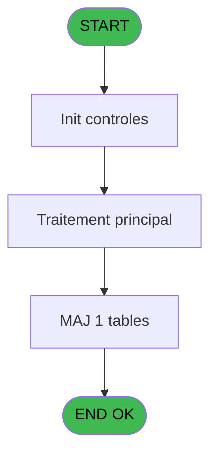

# PBG IDE 120 - Alim Combo seminaire

> **Analyse**: Phases 1-4 2026-02-03 09:31 -> 09:32 (18s) | Assemblage 09:32
> **Pipeline**: V7.2 Enrichi
> **Structure**: 4 onglets (Resume | Ecrans | Donnees | Connexions)

<!-- TAB:Resume -->

## 1. FICHE D'IDENTITE

| Attribut | Valeur |
|----------|--------|
| Projet | PBG |
| IDE Position | 120 |
| Nom Programme | Alim Combo seminaire |
| Fichier source | `Prg_120.xml` |
| Domaine metier | General |
| Taches | 3 (0 ecrans visibles) |
| Tables modifiees | 1 |
| Programmes appeles | 0 |

## 2. DESCRIPTION FONCTIONNELLE

**Alim Combo seminaire** assure la gestion complete de ce processus, accessible depuis [Validation Arrivants (IDE 124)](PBG-IDE-124.md).

Le flux de traitement s'organise en **3 blocs fonctionnels** :

- **Traitement** (1 tache) : traitements metier divers
- **Creation** (1 tache) : insertion d'enregistrements en base (mouvements, prestations)
- **Consultation** (1 tache) : ecrans de recherche, selection et consultation

**Donnees modifiees** : 1 tables en ecriture (groupe_arr_dep___vol).

Detail : phases du traitement

#### Phase 1 : Consultation (1 tache)

- **120** - Selection Nationalite **[[ECRAN]](#ecran-t1)**

#### Phase 2 : Creation (1 tache)

- **120.1** - creation V/V

#### Phase 3 : Traitement (1 tache)

- **120.2** - (sans nom) **[[ECRAN]](#ecran-t4)**

#### Tables impactees

| Table | Operations | Role metier |
|-------|-----------|-------------|
| groupe_arr_dep___vol | **W** (1 usages) |  |

## 3. BLOCS FONCTIONNELS

### 3.1 Consultation (1 tache)

Ecrans de recherche et consultation.

---

#### 120 - Selection Nationalite [[ECRAN]](#ecran-t1)

**Role** : Selection par l'operateur : Selection Nationalite.
**Ecran** : 915 x 278 DLU (MDI) | [Voir mockup](#ecran-t1)

### 3.2 Creation (1 tache)

Insertion de nouveaux enregistrements en base.

---

#### 120.1 - creation V/V

**Role** : Creation d'enregistrement : creation V/V.

### 3.3 Traitement (1 tache)

Traitements internes.

---

#### 120.2 - (sans nom) [[ECRAN]](#ecran-t4)

**Role** : Traitement interne.
**Ecran** : 228 x 40 DLU (MDI) | [Voir mockup](#ecran-t4)

## 5. REGLES METIER

*(Aucune regle metier identifiee)*

## 6. CONTEXTE

- **Appele par**: [Validation Arrivants (IDE 124)](PBG-IDE-124.md)
- **Appelle**: 0 programmes | **Tables**: 2 (W:1 R:1 L:0) | **Taches**: 3 | **Expressions**: 1

<!-- TAB:Ecrans -->

## 8. ECRANS

*(Programme sans ecran visible)*

## 9. NAVIGATION

### 9.3 Structure hierarchique (3 taches)

| Position | Tache | Type | Dimensions | Bloc |
|----------|-------|------|------------|------|
| **120.1** | [**Selection Nationalite** (120)](#t1) [mockup](#ecran-t1) | MDI | 915x278 | Consultation |
| **120.2** | [**creation V/V** (120.1)](#t2) | MDI | - | Creation |
| **120.3** | [**(sans nom)** (120.2)](#t4) [mockup](#ecran-t4) | MDI | 228x40 | Traitement |

### 9.4 Algorigramme

> **Legende**: Vert = START/END OK | Rouge = END KO | Bleu = Decisions
> *Algorigramme auto-genere. Utiliser `/algorigramme` pour une synthese metier detaillee.*

<!-- TAB:Donnees -->

## 10. TABLES

### Tables utilisees (2)

| ID | Nom | Description | Type | R | W | L | Usages |
|----|-----|-------------|------|---|---|---|--------|
| 36 | client_gm |  | DB | R |   |   | 1 |
| 134 | groupe_arr_dep___vol |  | DB |   | **W** |   | 1 |

### Colonnes par table (0 / 2 tables avec colonnes identifiees)

Table 36 - client_gm (R) - 1 usages

*Table utilisee uniquement en Link ou aucune colonne Real identifiee dans le DataView.*

Table 134 - groupe_arr_dep___vol (**W**) - 1 usages

*Table utilisee uniquement en Link ou aucune colonne Real identifiee dans le DataView.*

## 11. VARIABLES

### 11.1 Autres (4)

Variables diverses.

| Lettre | Nom | Type | Usage dans |
|--------|-----|------|-----------|
| A | <Chaine | Alpha | - |
| B | >Aller/Retour | Alpha | - |
| C | >Date Arrivee | Date | - |
| D | >Date Retour | Date | - |

## 12. EXPRESSIONS

**1 / 1 expressions decodees (100%)**

### 12.1 Repartition par type

| Type | Expressions | Regles |
|------|-------------|--------|
| CONSTANTE | 1 | 0 |

### 12.2 Expressions cles par type

#### CONSTANTE (1 expressions)

| Type | IDE | Expression | Regle |
|------|-----|------------|-------|
| CONSTANTE | 1 | `''` | - |

<!-- TAB:Connexions -->

## 13. GRAPHE D'APPELS

### 13.1 Chaine depuis Main (Callers)

Main -> ... -> [Validation Arrivants (IDE 124)](PBG-IDE-124.md) -> **Alim Combo seminaire (IDE 120)**

### 13.2 Callers

| IDE | Nom Programme | Nb Appels |
|-----|---------------|-----------|
| [124](PBG-IDE-124.md) | Validation Arrivants | 1 |

### 13.3 Callees (programmes appeles)

### 13.4 Detail Callees avec contexte

| IDE | Nom Programme | Appels | Contexte |
|-----|---------------|--------|----------|
| - | (aucun) | - | - |

## 14. RECOMMANDATIONS MIGRATION

### 14.1 Profil du programme

| Metrique | Valeur | Impact migration |
|----------|--------|-----------------|
| Lignes de logique | 50 | Programme compact |
| Expressions | 1 | Peu de logique |
| Tables WRITE | 1 | Impact faible |
| Sous-programmes | 0 | Peu de dependances |
| Ecrans visibles | 0 | Ecran unique ou traitement batch |
| Code desactive | 2% (1 / 50) | Code sain |
| Regles metier | 0 | Pas de regle identifiee |

### 14.2 Plan de migration par bloc

#### Consultation (1 tache: 1 ecran, 0 traitement)

- **Strategie** : Composants de recherche/selection en modales.
- 1 ecran : Selection Nationalite

#### Creation (1 tache: 0 ecran, 1 traitement)

- **Strategie** : Repository pattern avec Entity Framework Core.
- Insertion via `IRepository<T>.CreateAsync()`

#### Traitement (1 tache: 1 ecran, 0 traitement)

- **Strategie** : 1 composant(s) UI (Razor/React) avec formulaires et validation.
- Decomposer les taches en services unitaires testables.

### 14.3 Dependances critiques

| Dependance | Type | Appels | Impact |
|------------|------|--------|--------|
| groupe_arr_dep___vol | Table WRITE (Database) | 1x | Schema + repository |

---
*Spec DETAILED generee par Pipeline V7.2 - 2026-02-03 09:32*
