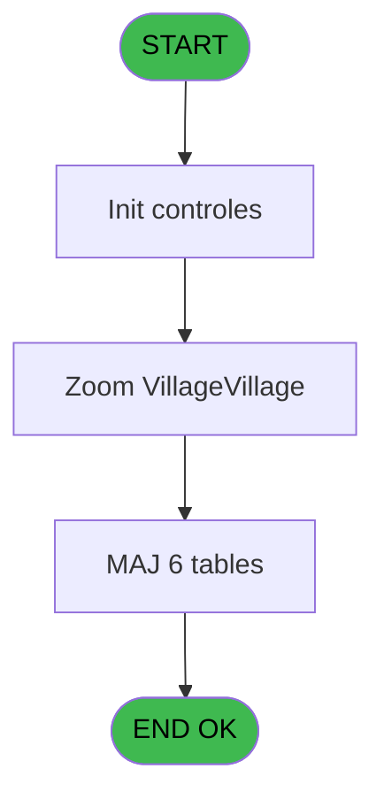
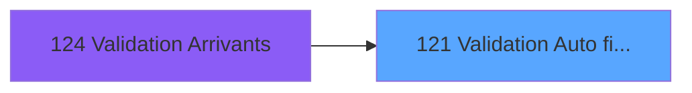
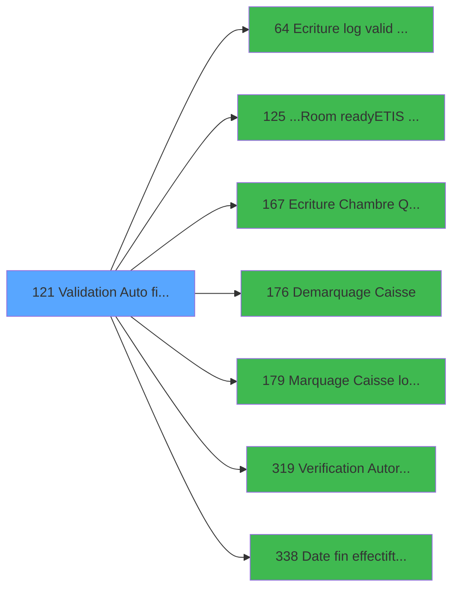

# PBG IDE 121 - Validation Auto filiations

> **Analyse**: Phases 1-4 2026-02-03 09:32 -> 09:32 (18s) | Assemblage 09:32
> **Pipeline**: V7.2 Enrichi
> **Structure**: 4 onglets (Resume | Ecrans | Donnees | Connexions)

<!-- TAB:Resume -->

## 1. FICHE D'IDENTITE

| Attribut | Valeur |
|----------|--------|
| Projet | PBG |
| IDE Position | 121 |
| Nom Programme | Validation Auto filiations |
| Fichier source | `Prg_121.xml` |
| Domaine metier | General |
| Taches | 14 (1 ecrans visibles) |
| Tables modifiees | 6 |
| Programmes appeles | 7 |

## 2. DESCRIPTION FONCTIONNELLE

**Validation Auto filiations** assure la gestion complete de ce processus, accessible depuis [Validation Arrivants (IDE 124)](PBG-IDE-124.md).

Le flux de traitement s'organise en **4 blocs fonctionnels** :

- **Creation** (5 taches) : insertion d'enregistrements en base (mouvements, prestations)
- **Validation** (4 taches) : controles et verifications de coherence
- **Consultation** (3 taches) : ecrans de recherche, selection et consultation
- **Traitement** (2 taches) : traitements metier divers

**Donnees modifiees** : 6 tables en ecriture (gm-recherche_____gmr, hebergement______heb, historik_station, fichier_validation, groupe_arr_dep___vol, heb_circuit______hci).

**Logique metier** : 1 regles identifiees couvrant conditions metier.

Detail : phases du traitement

#### Phase 1 : Validation (4 taches)

- **121** - Validation Arrivant **[[ECRAN]](#ecran-t1)**
- **121.1** - Verification Logement **[[ECRAN]](#ecran-t2)**
- **121.5** - Validation Arrivee
- **121.5.6.2** - Verif si GO Greek

Delegue a : [Ecriture log valid devalid (IDE 64)](PBG-IDE-64.md), [Verification Autorisation (IDE 319)](PBG-IDE-319.md)

#### Phase 2 : Creation (5 taches)

- **121.2** - Creation VV Aller et Retour
- **121.3** - Creation VV Aller et Retour
- **121.5.5** - Creation Historique
- **121.5.6** - Creation Specif Greque
- **121.5.6.1** - Creation Specif Greque

#### Phase 3 : Consultation (3 taches)

- **121.4** - Zoom Vol **[[ECRAN]](#ecran-t5)**
- **121.5.3** - Marquage Recherche
- **121.5.4** - Marquage Recherche

#### Phase 4 : Traitement (2 taches)

- **121.5.1** - Marquage Periodes
- **121.5.2** - Marquage Periodes

Delegue a : [...Room ready/ETIS prio (IDE 125)](PBG-IDE-125.md), [Ecriture Chambre Quadriga (IDE 167)](PBG-IDE-167.md), [Demarquage Caisse (IDE 176)](PBG-IDE-176.md), [Marquage Caisse logique (IDE 179)](PBG-IDE-179.md)

#### Tables impactees

| Table | Operations | Role metier |
|-------|-----------|-------------|
| groupe_arr_dep___vol | **W**/L (3 usages) |  |
| hebergement______heb | R/**W** (3 usages) | Hebergement (chambres) |
| fichier_validation | **W** (1 usages) |  |
| gm-recherche_____gmr | **W** (1 usages) | Index de recherche |
| heb_circuit______hci | **W** (1 usages) | Hebergement (chambres) |
| historik_station | **W** (1 usages) | Historique / journal |

## 3. BLOCS FONCTIONNELS

### 3.1 Validation (4 taches)

Controles de coherence : 4 taches verifient les donnees et conditions.

---

#### 121 - Validation Arrivant [[ECRAN]](#ecran-t1)

**Role** : Verification : Validation Arrivant.
**Ecran** : 862 x 196 DLU (MDI) | [Voir mockup](#ecran-t1)

3 sous-taches directes

| Tache | Nom | Bloc |
|-------|-----|------|
| [121.1](#t2) | Verification Logement **[[ECRAN]](#ecran-t2)** | Validation |
| [121.5](#t7) | Validation Arrivee | Validation |
| [121.5.6.2](#t15) | Verif si GO Greek | Validation |

**Variables liees** : M (P0 Validation effectuee)
**Delegue a** : [Ecriture log valid devalid (IDE 64)](PBG-IDE-64.md), [Verification Autorisation (IDE 319)](PBG-IDE-319.md)

---

#### 121.1 - Verification Logement [[ECRAN]](#ecran-t2)

**Role** : Verification : Verification Logement.
**Ecran** : 525 x 254 DLU (MDI) | [Voir mockup](#ecran-t2)
**Variables liees** : U (W2-Accord Logement)
**Delegue a** : [Ecriture log valid devalid (IDE 64)](PBG-IDE-64.md), [Verification Autorisation (IDE 319)](PBG-IDE-319.md)

---

#### 121.5 - Validation Arrivee

**Role** : Verification : Validation Arrivee.
**Variables liees** : M (P0 Validation effectuee)
**Delegue a** : [Ecriture log valid devalid (IDE 64)](PBG-IDE-64.md), [Verification Autorisation (IDE 319)](PBG-IDE-319.md)

---

#### 121.5.6.2 - Verif si GO Greek

**Role** : Verification : Verif si GO Greek.
**Delegue a** : [Ecriture log valid devalid (IDE 64)](PBG-IDE-64.md), [Verification Autorisation (IDE 319)](PBG-IDE-319.md)

### 3.2 Creation (5 taches)

Insertion de nouveaux enregistrements en base.

---

#### 121.2 - Creation VV Aller et Retour

**Role** : Creation d'enregistrement : Creation VV Aller et Retour.
**Variables liees** : O (P0 New Code Vol ALLER), P (P0 New Heure ALLER), Q (P0 New Code Vol RETOUR), R (P0 New Heure RETOUR), V (W2-Code Vol Aller)

---

#### 121.3 - Creation VV Aller et Retour

**Role** : Creation d'enregistrement : Creation VV Aller et Retour.
**Variables liees** : O (P0 New Code Vol ALLER), P (P0 New Heure ALLER), Q (P0 New Code Vol RETOUR), R (P0 New Heure RETOUR), V (W2-Code Vol Aller)

---

#### 121.5.5 - Creation Historique

**Role** : Consultation/chargement : Creation Historique.

---

#### 121.5.6 - Creation Specif Greque

**Role** : Creation d'enregistrement : Creation Specif Greque.

---

#### 121.5.6.1 - Creation Specif Greque

**Role** : Creation d'enregistrement : Creation Specif Greque.

### 3.3 Consultation (3 taches)

Ecrans de recherche et consultation.

---

#### 121.4 - Zoom Vol [[ECRAN]](#ecran-t5)

**Role** : Selection par l'operateur : Zoom Vol.
**Ecran** : 390 x 156 DLU (MDI) | [Voir mockup](#ecran-t5)
**Variables liees** : N (P0 ZOOM VV Global)

---

#### 121.5.3 - Marquage Recherche

**Role** : Traitement : Marquage Recherche.
**Delegue a** : [Demarquage Caisse (IDE 176)](PBG-IDE-176.md), [Marquage Caisse logique (IDE 179)](PBG-IDE-179.md)

---

#### 121.5.4 - Marquage Recherche

**Role** : Traitement : Marquage Recherche.
**Delegue a** : [Demarquage Caisse (IDE 176)](PBG-IDE-176.md), [Marquage Caisse logique (IDE 179)](PBG-IDE-179.md)

### 3.4 Traitement (2 taches)

Traitements internes.

---

#### 121.5.1 - Marquage Periodes

**Role** : Traitement : Marquage Periodes.
**Delegue a** : [...Room ready/ETIS prio (IDE 125)](PBG-IDE-125.md), [Ecriture Chambre Quadriga (IDE 167)](PBG-IDE-167.md), [Demarquage Caisse (IDE 176)](PBG-IDE-176.md)

---

#### 121.5.2 - Marquage Periodes

**Role** : Traitement : Marquage Periodes.
**Delegue a** : [...Room ready/ETIS prio (IDE 125)](PBG-IDE-125.md), [Ecriture Chambre Quadriga (IDE 167)](PBG-IDE-167.md), [Demarquage Caisse (IDE 176)](PBG-IDE-176.md)

## 5. REGLES METIER

1 regles identifiees:

### Autres (1 regles)

#### [RM-001] Si W2-Confirmation [S]=6 alors 'O' sinon 'N')

| Element | Detail |
|---------|--------|
| **Condition** | `W2-Confirmation [S]=6` |
| **Si vrai** | 'O' |
| **Si faux** | 'N') |
| **Variables** | S (W2-Confirmation) |
| **Expression source** | Expression 14 : `IF (W2-Confirmation [S]=6,'O','N')` |
| **Exemple** | Si W2-Confirmation [S]=6 → 'O'. Sinon → 'N') |

## 6. CONTEXTE

- **Appele par**: [Validation Arrivants (IDE 124)](PBG-IDE-124.md)
- **Appelle**: 7 programmes | **Tables**: 13 (W:6 R:4 L:5) | **Taches**: 14 | **Expressions**: 26

<!-- TAB:Ecrans -->

## 8. ECRANS

### 8.1 Forms visibles (1 / 14)

| # | Position | Tache | Nom | Type | Largeur | Hauteur | Bloc |
|---|----------|-------|-----|------|---------|---------|------|
| 1 | 121.4 | 121.4 | Zoom Vol | MDI | 390 | 156 | Consultation |

### 8.2 Mockups Ecrans

---

#### 121.4 - Zoom Vol
**Tache** : [121.4](#t5) | **Type** : MDI | **Dimensions** : 390 x 156 DLU
**Bloc** : Consultation | **Titre IDE** : Zoom Vol

<!-- FORM-DATA:
{
    "width":  390,
    "vFactor":  8,
    "type":  "MDI",
    "hFactor":  8,
    "controls":  [
                     {
                         "x":  78,
                         "type":  "table",
                         "var":  "",
                         "name":  "",
                         "titleH":  12,
                         "color":  "196",
                         "w":  234,
                         "y":  4,
                         "fmt":  "",
                         "parent":  null,
                         "text":  "",
                         "rowH":  13,
                         "h":  91,
                         "cols":  [
                                      {
                                          "title":  " ",
                                          "layer":  1,
                                          "w":  111
                                      },
                                      {
                                          "title":  "Heure vol",
                                          "layer":  2,
                                          "w":  89
                                      }
                                  ],
                         "rows":  2
                     },
                     {
                         "x":  0,
                         "type":  "label",
                         "var":  "",
                         "y":  128,
                         "w":  383,
                         "fmt":  "",
                         "name":  "",
                         "h":  24,
                         "color":  "",
                         "text":  "",
                         "parent":  null
                     },
                     {
                         "x":  88,
                         "type":  "edit",
                         "var":  "",
                         "y":  19,
                         "w":  99,
                         "fmt":  "30",
                         "name":  "",
                         "h":  8,
                         "color":  "196",
                         "text":  "",
                         "parent":  1
                     },
                     {
                         "x":  30,
                         "type":  "button",
                         "var":  "",
                         "y":  131,
                         "w":  144,
                         "fmt":  "\u0026Selectionner",
                         "name":  "",
                         "h":  18,
                         "color":  "",
                         "text":  "",
                         "parent":  null
                     },
                     {
                         "x":  216,
                         "type":  "button",
                         "var":  "",
                         "y":  131,
                         "w":  144,
                         "fmt":  "\u0026Abandonner",
                         "name":  "",
                         "h":  18,
                         "color":  "",
                         "text":  "",
                         "parent":  null
                     },
                     {
                         "x":  163,
                         "type":  "image",
                         "var":  "",
                         "y":  104,
                         "w":  58,
                         "fmt":  "",
                         "name":  "",
                         "h":  18,
                         "color":  "",
                         "text":  "",
                         "parent":  null
                     },
                     {
                         "x":  195,
                         "type":  "edit",
                         "var":  "",
                         "y":  19,
                         "w":  66,
                         "fmt":  "HH:MM",
                         "name":  "vot_heure",
                         "h":  10,
                         "color":  "196",
                         "text":  "",
                         "parent":  1
                     }
                 ],
    "taskId":  "121.4",
    "height":  156
}
-->

<strong>Champs : 2 champs</strong>

| Pos (x,y) | Nom | Variable | Type |
|-----------|-----|----------|------|
| 88,19 | 30 | - | edit |
| 195,19 | vot_heure | - | edit |

<strong>Boutons : 2 boutons</strong>

| Bouton | Pos (x,y) | Action |
|--------|-----------|--------|
| Selectionner | 30,131 | Ouvre la selection |
| Abandonner | 216,131 | Annule et retour au menu |

## 9. NAVIGATION

Ecran unique: **Zoom Vol**

### 9.3 Structure hierarchique (14 taches)

| Position | Tache | Type | Dimensions | Bloc |
|----------|-------|------|------------|------|
| **121.1** | [**Validation Arrivant** (121)](#t1) [mockup](#ecran-t1) | MDI | 862x196 | Validation |
| 121.1.1 | [Verification Logement (121.1)](#t2) [mockup](#ecran-t2) | MDI | 525x254 | |
| 121.1.2 | [Validation Arrivee (121.5)](#t7) | MDI | - | |
| 121.1.3 | [Verif si GO Greek (121.5.6.2)](#t15) | MDI | - | |
| **121.2** | [**Creation VV Aller et Retour** (121.2)](#t3) | MDI | - | Creation |
| 121.2.1 | [Creation VV Aller et Retour (121.3)](#t4) | MDI | - | |
| 121.2.2 | [Creation Historique (121.5.5)](#t12) | MDI | - | |
| 121.2.3 | [Creation Specif Greque (121.5.6)](#t13) | MDI | - | |
| 121.2.4 | [Creation Specif Greque (121.5.6.1)](#t14) | MDI | - | |
| **121.3** | [**Zoom Vol** (121.4)](#t5) [mockup](#ecran-t5) | MDI | 390x156 | Consultation |
| 121.3.1 | [Marquage Recherche (121.5.3)](#t10) | MDI | - | |
| 121.3.2 | [Marquage Recherche (121.5.4)](#t11) | MDI | - | |
| **121.4** | [**Marquage Periodes** (121.5.1)](#t8) | MDI | - | Traitement |
| 121.4.1 | [Marquage Periodes (121.5.2)](#t9) | MDI | - | |

### 9.4 Algorigramme

> **Legende**: Vert = START/END OK | Rouge = END KO | Bleu = Decisions
> *Algorigramme auto-genere. Utiliser `/algorigramme` pour une synthese metier detaillee.*

<!-- TAB:Donnees -->

## 10. TABLES

### Tables utilisees (13)

| ID | Nom | Description | Type | R | W | L | Usages |
|----|-----|-------------|------|---|---|---|--------|
| 30 | gm-recherche_____gmr | Index de recherche | DB |   | **W** |   | 1 |
| 31 | gm-complet_______gmc |  | DB | R |   |   | 1 |
| 34 | hebergement______heb | Hebergement (chambres) | DB | R | **W** |   | 3 |
| 35 | personnel_go______go |  | DB |   |   | L | 1 |
| 36 | client_gm |  | DB |   |   | L | 1 |
| 88 | historik_station | Historique / journal | DB |   | **W** |   | 1 |
| 104 | fichier_menage |  | DB |   |   | L | 1 |
| 120 | tables_qualites__qua |  | DB | R |   |   | 1 |
| 131 | fichier_validation |  | DB |   | **W** |   | 1 |
| 132 | code_vol_________vot |  | DB | R |   |   | 1 |
| 134 | groupe_arr_dep___vol |  | DB |   | **W** | L | 3 |
| 168 | heb_circuit______hci | Hebergement (chambres) | DB |   | **W** |   | 1 |
| 315 | fi_complet_______gm_go |  | DB |   |   | L | 1 |

### Colonnes par table (3 / 9 tables avec colonnes identifiees)

Table 30 - gm-recherche_____gmr (**W**) - 1 usages

*Table utilisee uniquement en Link ou aucune colonne Real identifiee dans le DataView.*

Table 31 - gm-complet_______gmc (R) - 1 usages

*Table utilisee uniquement en Link ou aucune colonne Real identifiee dans le DataView.*

Table 34 - hebergement______heb (R/**W**) - 3 usages

*Table utilisee uniquement en Link ou aucune colonne Real identifiee dans le DataView.*

Table 88 - historik_station (**W**) - 1 usages

*Table utilisee uniquement en Link ou aucune colonne Real identifiee dans le DataView.*

Table 120 - tables_qualites__qua (R) - 1 usages

*Table utilisee uniquement en Link ou aucune colonne Real identifiee dans le DataView.*

Table 131 - fichier_validation (**W**) - 1 usages

| Lettre | Variable | Acces | Type |
|--------|----------|-------|------|
| M | P0 Validation effectuee | W | Logical |

Table 132 - code_vol_________vot (R) - 1 usages

| Lettre | Variable | Acces | Type |
|--------|----------|-------|------|
| A | Pi Aller/Retour | R | Unicode |
| B | v.Vol? | R | Logical |

Table 134 - groupe_arr_dep___vol (**W**/L) - 3 usages

*Table utilisee uniquement en Link ou aucune colonne Real identifiee dans le DataView.*

Table 168 - heb_circuit______hci (**W**) - 1 usages

*Table utilisee uniquement en Link ou aucune colonne Real identifiee dans le DataView.*

## 11. VARIABLES

### 11.1 Parametres entrants (18)

Variables recues du programme appelant ([Validation Arrivants (IDE 124)](PBG-IDE-124.md)).

| Lettre | Nom | Type | Usage dans |
|--------|-----|------|-----------|
| A | P0 Societe | Alpha | - |
| B | P0 Langue | Alpha | - |
| C | P0 Compte | Numeric | - |
| D | P0 Filiation | Numeric | - |
| E | P0 Nom | Alpha | - |
| F | P0 Prenom | Alpha | - |
| G | P0 Front/Back | Alpha | 2x parametre entrant |
| H | P0 Code 20 | Alpha | - |
| I | P0 Date Debut | Date | 4x parametre entrant |
| J | P0 Date Fin | Date | - |
| K | P0 Age | Numeric | - |
| L | P0 VAL Valide O/N st1 | Alpha | - |
| M | P0 Validation effectuee | Logical | - |
| N | P0 ZOOM VV Global | Logical | [121.4](#t5) |
| O | P0 New Code Vol ALLER | Alpha | [121.2](#t3), [121.3](#t4) |
| P | P0 New Heure ALLER | Alpha | [121.2](#t3), [121.3](#t4) |
| Q | P0 New Code Vol RETOUR | Alpha | [121.2](#t3), [121.3](#t4) |
| R | P0 New Heure RETOUR | Alpha | [121.2](#t3), [121.3](#t4) |

### 11.2 Autres (11)

Variables diverses.

| Lettre | Nom | Type | Usage dans |
|--------|-----|------|-----------|
| S | W2-Confirmation | Numeric | 1x refs |
| T | W2-Autorisation | Alpha | 1x refs |
| U | W2-Accord Logement | Alpha | [121.1](#t2) |
| V | W2-Code Vol Aller | Alpha | [121.2](#t3), [121.3](#t4) |
| W | W2-Code Vol Retour | Alpha | [121.2](#t3), [121.3](#t4) |
| X | W2-New Code Vol All | Alpha | - |
| Y | W2-New Heure Aller | Alpha | - |
| Z | W2-New Code Vol Ret | Alpha | - |
| BA | W2 New Heure Retour | Alpha | - |
| BB | W2-Accord Suite | Alpha | - |
| BC | W2-Chambre | Alpha | - |

Toutes les 29 variables (liste complete)

| Cat | Lettre | Nom Variable | Type |
|-----|--------|--------------|------|
| P0 | **A** | P0 Societe | Alpha |
| P0 | **B** | P0 Langue | Alpha |
| P0 | **C** | P0 Compte | Numeric |
| P0 | **D** | P0 Filiation | Numeric |
| P0 | **E** | P0 Nom | Alpha |
| P0 | **F** | P0 Prenom | Alpha |
| P0 | **G** | P0 Front/Back | Alpha |
| P0 | **H** | P0 Code 20 | Alpha |
| P0 | **I** | P0 Date Debut | Date |
| P0 | **J** | P0 Date Fin | Date |
| P0 | **K** | P0 Age | Numeric |
| P0 | **L** | P0 VAL Valide O/N st1 | Alpha |
| P0 | **M** | P0 Validation effectuee | Logical |
| P0 | **N** | P0 ZOOM VV Global | Logical |
| P0 | **O** | P0 New Code Vol ALLER | Alpha |
| P0 | **P** | P0 New Heure ALLER | Alpha |
| P0 | **Q** | P0 New Code Vol RETOUR | Alpha |
| P0 | **R** | P0 New Heure RETOUR | Alpha |
| Autre | **S** | W2-Confirmation | Numeric |
| Autre | **T** | W2-Autorisation | Alpha |
| Autre | **U** | W2-Accord Logement | Alpha |
| Autre | **V** | W2-Code Vol Aller | Alpha |
| Autre | **W** | W2-Code Vol Retour | Alpha |
| Autre | **X** | W2-New Code Vol All | Alpha |
| Autre | **Y** | W2-New Heure Aller | Alpha |
| Autre | **Z** | W2-New Code Vol Ret | Alpha |
| Autre | **BA** | W2 New Heure Retour | Alpha |
| Autre | **BB** | W2-Accord Suite | Alpha |
| Autre | **BC** | W2-Chambre | Alpha |

## 12. EXPRESSIONS

**26 / 26 expressions decodees (100%)**

### 12.1 Repartition par type

| Type | Expressions | Regles |
|------|-------------|--------|
| CONDITION | 13 | 5 |
| CONSTANTE | 4 | 0 |
| CAST_LOGIQUE | 1 | 0 |
| NEGATION | 1 | 0 |
| OTHER | 7 | 0 |

### 12.2 Expressions cles par type

#### CONDITION (13 expressions)

| Type | IDE | Expression | Regle |
|------|-----|------------|-------|
| CONDITION | 14 | `IF (W2-Confirmation [S]=6,'O','N')` | [RM-001](#rm-RM-001) |
| CONDITION | 8 | `W2-Code Vol Aller [V]='VV1' OR W2-Code Vol Aller [V]='VV2' OR W2-Code Vol Aller [V]='VV3'` | - |
| CONDITION | 6 | `W2-Accord Logement [U]='O'` | - |
| CONDITION | 5 | `W2-Accord Logement [U]='N'` | - |
| CONDITION | 13 | `[AB]<>'N'` | - |
| ... | | *+8 autres* | |

#### CONSTANTE (4 expressions)

| Type | IDE | Expression | Regle |
|------|-----|------------|-------|
| CONSTANTE | 22 | `'N'` | - |
| CONSTANTE | 23 | `'O'` | - |
| CONSTANTE | 11 | `'A'` | - |
| CONSTANTE | 12 | `'R'` | - |

#### CAST_LOGIQUE (1 expressions)

| Type | IDE | Expression | Regle |
|------|-----|------------|-------|
| CAST_LOGIQUE | 15 | `'FALSE'LOG` | - |

#### NEGATION (1 expressions)

| Type | IDE | Expression | Regle |
|------|-----|------------|-------|
| NEGATION | 16 | `NOT (P0 ZOOM VV Global [N])` | - |

#### OTHER (7 expressions)

| Type | IDE | Expression | Regle |
|------|-----|------------|-------|
| OTHER | 24 | `{1,1}` | - |
| OTHER | 25 | `{1,3}` | - |
| OTHER | 26 | `{1,4}` | - |
| OTHER | 20 | `P0 New Heure RETOUR [R]` | - |
| OTHER | 17 | `P0 New Code Vol ALLER [O]` | - |
| ... | | *+2 autres* | |

### 12.3 Toutes les expressions (26)

Voir les 26 expressions

#### CONDITION (13)

| IDE | Expression Decodee |
|-----|-------------------|
| 14 | `IF (W2-Confirmation [S]=6,'O','N')` |
| 3 | `P0 Date Debut [I]>Date ()` |
| 4 | `P0 Date Debut [I]<=Date ()` |
| 7 | `W2-Accord Logement [U]='O' AND P0 Date Debut [I]<Date ()` |
| 21 | `Date()>P0 Date Debut [I]+6 AND NOT(VG23)` |
| 1 | `P0 Front/Back [G]='F' AND NOT(IsComponent())` |
| 2 | `(W2-Autorisation [T]='O' AND P0 Front/Back [G]='F') OR P0 Front/Back [G]='B' OR IsComponent()` |
| 5 | `W2-Accord Logement [U]='N'` |
| 6 | `W2-Accord Logement [U]='O'` |
| 8 | `W2-Code Vol Aller [V]='VV1' OR W2-Code Vol Aller [V]='VV2' OR W2-Code Vol Aller [V]='VV3'` |
| 9 | `W2-Code Vol Retour [W]='VV1' OR W2-Code Vol Retour [W]='VV2' OR W2-Code Vol Retour [W]='VV3'` |
| 10 | `(W2-Code Vol Retour [W]='VV1' OR W2-Code Vol Retour [W]='VV2' OR W2-Code Vol Retour [W]='VV3') AND [AB]<>'N'` |
| 13 | `[AB]<>'N'` |

#### CONSTANTE (4)

| IDE | Expression Decodee |
|-----|-------------------|
| 11 | `'A'` |
| 12 | `'R'` |
| 22 | `'N'` |
| 23 | `'O'` |

#### CAST_LOGIQUE (1)

| IDE | Expression Decodee |
|-----|-------------------|
| 15 | `'FALSE'LOG` |

#### NEGATION (1)

| IDE | Expression Decodee |
|-----|-------------------|
| 16 | `NOT (P0 ZOOM VV Global [N])` |

#### OTHER (7)

| IDE | Expression Decodee |
|-----|-------------------|
| 17 | `P0 New Code Vol ALLER [O]` |
| 18 | `P0 New Heure ALLER [P]` |
| 19 | `P0 New Code Vol RETOUR [Q]` |
| 20 | `P0 New Heure RETOUR [R]` |
| 24 | `{1,1}` |
| 25 | `{1,3}` |
| 26 | `{1,4}` |

<!-- TAB:Connexions -->

## 13. GRAPHE D'APPELS

### 13.1 Chaine depuis Main (Callers)

Main -> ... -> [Validation Arrivants (IDE 124)](PBG-IDE-124.md) -> **Validation Auto filiations (IDE 121)**

### 13.2 Callers

| IDE | Nom Programme | Nb Appels |
|-----|---------------|-----------|
| [124](PBG-IDE-124.md) | Validation Arrivants | 3 |

### 13.3 Callees (programmes appeles)

### 13.4 Detail Callees avec contexte

| IDE | Nom Programme | Appels | Contexte |
|-----|---------------|--------|----------|
| [64](PBG-IDE-64.md) | Ecriture log valid devalid | 1 | Sous-programme |
| [125](PBG-IDE-125.md) | ...Room ready/ETIS prio | 1 | Sous-programme |
| [167](PBG-IDE-167.md) | Ecriture Chambre Quadriga | 1 | Sous-programme |
| [176](PBG-IDE-176.md) | Demarquage Caisse | 1 | Sous-programme |
| [179](PBG-IDE-179.md) | Marquage Caisse logique | 1 | Sous-programme |
| [319](PBG-IDE-319.md) | Verification Autorisation | 1 | Controle/validation |
| [338](PBG-IDE-338.md) | Date fin effectif/t transfert | 1 | Transfert donnees |

## 14. RECOMMANDATIONS MIGRATION

### 14.1 Profil du programme

| Metrique | Valeur | Impact migration |
|----------|--------|-----------------|
| Lignes de logique | 490 | Taille moyenne |
| Expressions | 26 | Peu de logique |
| Tables WRITE | 6 | Fort impact donnees |
| Sous-programmes | 7 | Dependances moderees |
| Ecrans visibles | 1 | Ecran unique ou traitement batch |
| Code desactive | 0% (0 / 490) | Code sain |
| Regles metier | 1 | Quelques regles a preserver |

### 14.2 Plan de migration par bloc

#### Validation (4 taches: 2 ecrans, 2 traitements)

- **Strategie** : FluentValidation avec validators specifiques.
- Chaque tache de validation -> un validator injectable

#### Creation (5 taches: 0 ecran, 5 traitements)

- **Strategie** : Repository pattern avec Entity Framework Core.
- Insertion via `IRepository<T>.CreateAsync()`

#### Consultation (3 taches: 1 ecran, 2 traitements)

- **Strategie** : Composants de recherche/selection en modales.
- 1 ecran : Zoom Vol

#### Traitement (2 taches: 0 ecran, 2 traitements)

- **Strategie** : 2 service(s) backend injectable(s) (Domain Services).
- 7 sous-programme(s) a migrer ou a reutiliser depuis les services existants.
- Decomposer les taches en services unitaires testables.

### 14.3 Dependances critiques

| Dependance | Type | Appels | Impact |
|------------|------|--------|--------|
| gm-recherche_____gmr | Table WRITE (Database) | 1x | Schema + repository |
| hebergement______heb | Table WRITE (Database) | 1x | Schema + repository |
| historik_station | Table WRITE (Database) | 1x | Schema + repository |
| fichier_validation | Table WRITE (Database) | 1x | Schema + repository |
| groupe_arr_dep___vol | Table WRITE (Database) | 2x | Schema + repository |
| heb_circuit______hci | Table WRITE (Database) | 1x | Schema + repository |
| [Marquage Caisse logique (IDE 179)](PBG-IDE-179.md) | Sous-programme | 1x | Normale - Sous-programme |
| [Verification Autorisation (IDE 319)](PBG-IDE-319.md) | Sous-programme | 1x | Normale - Controle/validation |
| [Date fin effectif/t transfert (IDE 338)](PBG-IDE-338.md) | Sous-programme | 1x | Normale - Transfert donnees |
| [Demarquage Caisse (IDE 176)](PBG-IDE-176.md) | Sous-programme | 1x | Normale - Sous-programme |
| [Ecriture log valid devalid (IDE 64)](PBG-IDE-64.md) | Sous-programme | 1x | Normale - Sous-programme |
| [...Room ready/ETIS prio (IDE 125)](PBG-IDE-125.md) | Sous-programme | 1x | Normale - Sous-programme |
| [Ecriture Chambre Quadriga (IDE 167)](PBG-IDE-167.md) | Sous-programme | 1x | Normale - Sous-programme |

---
*Spec DETAILED generee par Pipeline V7.2 - 2026-02-03 09:32*
