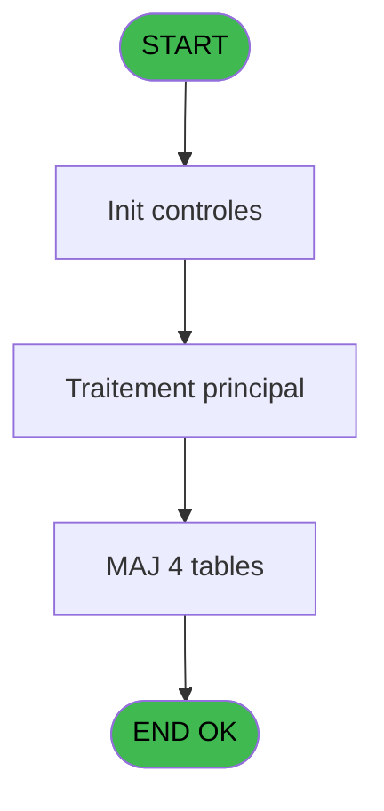
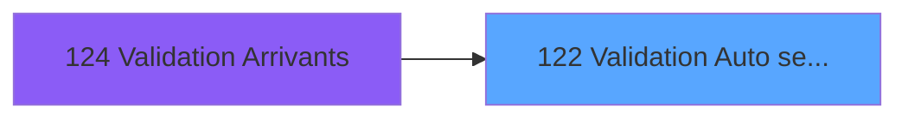
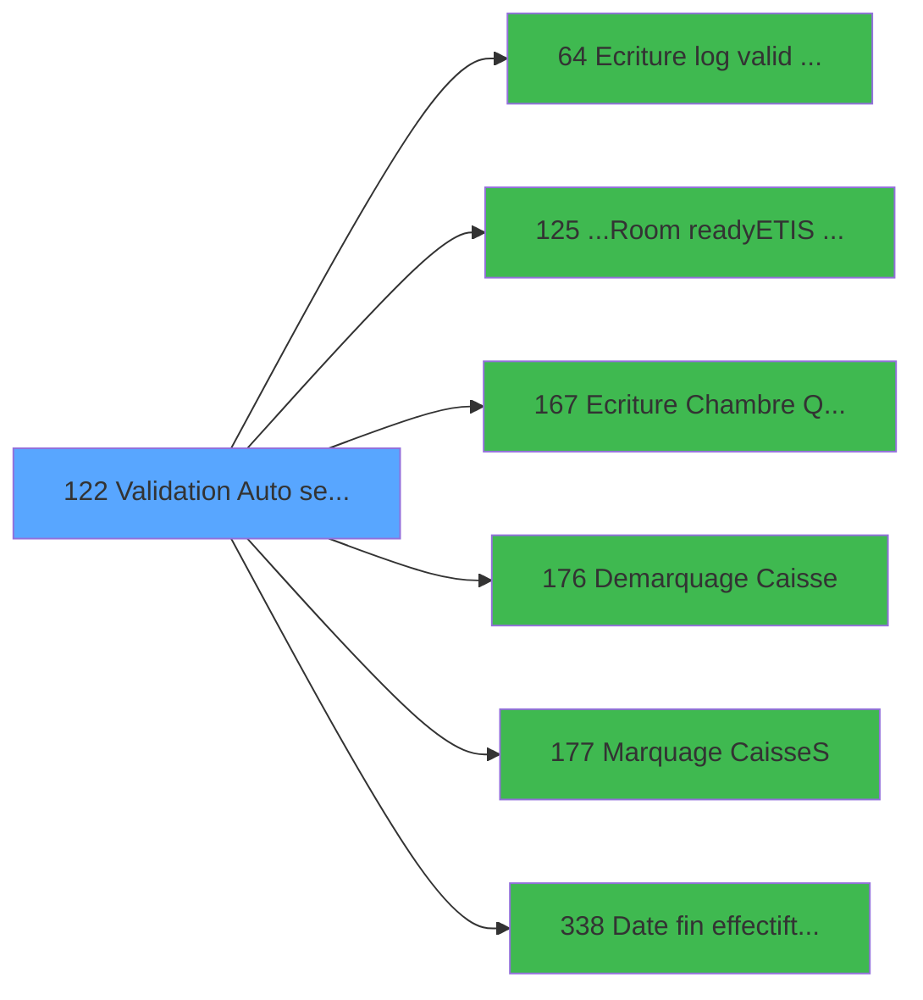

# PBG IDE 122 - Validation Auto seminaire

> **Analyse**: Phases 1-4 2026-02-03 09:32 -> 09:33 (21s) | Assemblage 09:33
> **Pipeline**: V7.2 Enrichi
> **Structure**: 4 onglets (Resume | Ecrans | Donnees | Connexions)

<!-- TAB:Resume -->

## 1. FICHE D'IDENTITE

| Attribut | Valeur |
|----------|--------|
| Projet | PBG |
| IDE Position | 122 |
| Nom Programme | Validation Auto seminaire |
| Fichier source | `Prg_122.xml` |
| Domaine metier | General |
| Taches | 9 (1 ecrans visibles) |
| Tables modifiees | 4 |
| Programmes appeles | 6 |

## 2. DESCRIPTION FONCTIONNELLE

**Validation Auto seminaire** assure la gestion complete de ce processus, accessible depuis [Validation Arrivants (IDE 124)](PBG-IDE-124.md).

Le flux de traitement s'organise en **4 blocs fonctionnels** :

- **Creation** (3 taches) : insertion d'enregistrements en base (mouvements, prestations)
- **Validation** (3 taches) : controles et verifications de coherence
- **Traitement** (2 taches) : traitements metier divers
- **Consultation** (1 tache) : ecrans de recherche, selection et consultation

**Donnees modifiees** : 4 tables en ecriture (hebergement______heb, historik_station, fichier_validation, heb_circuit______hci).

Detail : phases du traitement

#### Phase 1 : Validation (3 taches)

- **122** - Validation Automatique **[[ECRAN]](#ecran-t1)**
- **122.1** - Verification Logement
- **122.5.2** - Verif si GO Greek

Delegue a : [Ecriture log valid devalid (IDE 64)](PBG-IDE-64.md)

#### Phase 2 : Traitement (2 taches)

- **122.2** - Marquage Periodes
- **122.6** - Marquage Periodes

Delegue a : [...Room ready/ETIS prio (IDE 125)](PBG-IDE-125.md), [Ecriture Chambre Quadriga (IDE 167)](PBG-IDE-167.md), [Demarquage Caisse (IDE 176)](PBG-IDE-176.md), [Marquage Caisse(S) (IDE 177)](PBG-IDE-177.md)

#### Phase 3 : Consultation (1 tache)

- **122.3** - Marquage Recherche

#### Phase 4 : Creation (3 taches)

- **122.4** - Creation Historique
- **122.5** - Creation Specif Greque
- **122.5.1** - Creation Specif Greque

#### Tables impactees

| Table | Operations | Role metier |
|-------|-----------|-------------|
| hebergement______heb | R/**W** (4 usages) | Hebergement (chambres) |
| fichier_validation | **W**/L (2 usages) |  |
| heb_circuit______hci | **W** (1 usages) | Hebergement (chambres) |
| historik_station | **W** (1 usages) | Historique / journal |

## 3. BLOCS FONCTIONNELS

### 3.1 Validation (3 taches)

Controles de coherence : 3 taches verifient les donnees et conditions.

---

#### 122 - Validation Automatique [[ECRAN]](#ecran-t1)

**Role** : Verification : Validation Automatique.
**Ecran** : 426 x 107 DLU (MDI) | [Voir mockup](#ecran-t1)
**Delegue a** : [Ecriture log valid devalid (IDE 64)](PBG-IDE-64.md)

---

#### 122.1 - Verification Logement

**Role** : Verification : Verification Logement.
**Delegue a** : [Ecriture log valid devalid (IDE 64)](PBG-IDE-64.md)

---

#### 122.5.2 - Verif si GO Greek

**Role** : Verification : Verif si GO Greek.
**Variables liees** : M (W3-Verifiees)
**Delegue a** : [Ecriture log valid devalid (IDE 64)](PBG-IDE-64.md)

### 3.2 Traitement (2 taches)

Traitements internes.

---

#### 122.2 - Marquage Periodes

**Role** : Traitement : Marquage Periodes.
**Delegue a** : [...Room ready/ETIS prio (IDE 125)](PBG-IDE-125.md), [Ecriture Chambre Quadriga (IDE 167)](PBG-IDE-167.md), [Demarquage Caisse (IDE 176)](PBG-IDE-176.md)

---

#### 122.6 - Marquage Periodes

**Role** : Traitement : Marquage Periodes.
**Delegue a** : [...Room ready/ETIS prio (IDE 125)](PBG-IDE-125.md), [Ecriture Chambre Quadriga (IDE 167)](PBG-IDE-167.md), [Demarquage Caisse (IDE 176)](PBG-IDE-176.md)

### 3.3 Consultation (1 tache)

Ecrans de recherche et consultation.

---

#### 122.3 - Marquage Recherche

**Role** : Traitement : Marquage Recherche.
**Variables liees** : X (W3-Lien Gm_recherche)
**Delegue a** : [Demarquage Caisse (IDE 176)](PBG-IDE-176.md), [Marquage Caisse(S) (IDE 177)](PBG-IDE-177.md)

### 3.4 Creation (3 taches)

Insertion de nouveaux enregistrements en base.

---

#### 122.4 - Creation Historique

**Role** : Consultation/chargement : Creation Historique.

---

#### 122.5 - Creation Specif Greque

**Role** : Creation d'enregistrement : Creation Specif Greque.

---

#### 122.5.1 - Creation Specif Greque

**Role** : Creation d'enregistrement : Creation Specif Greque.

## 5. REGLES METIER

*(Aucune regle metier identifiee)*

## 6. CONTEXTE

- **Appele par**: [Validation Arrivants (IDE 124)](PBG-IDE-124.md)
- **Appelle**: 6 programmes | **Tables**: 11 (W:4 R:3 L:6) | **Taches**: 9 | **Expressions**: 31

<!-- TAB:Ecrans -->

## 8. ECRANS

### 8.1 Forms visibles (1 / 9)

| # | Position | Tache | Nom | Type | Largeur | Hauteur | Bloc |
|---|----------|-------|-----|------|---------|---------|------|
| 1 | 122 | 122 | Validation Automatique | MDI | 426 | 107 | Validation |

### 8.2 Mockups Ecrans

---

#### 122 - Validation Automatique
**Tache** : [122](#t1) | **Type** : MDI | **Dimensions** : 426 x 107 DLU
**Bloc** : Validation | **Titre IDE** : Validation Automatique

<!-- FORM-DATA:
{
    "width":  426,
    "vFactor":  8,
    "type":  "MDI",
    "hFactor":  8,
    "controls":  [
                     {
                         "x":  0,
                         "type":  "label",
                         "var":  "",
                         "y":  0,
                         "w":  423,
                         "fmt":  "",
                         "name":  "",
                         "h":  29,
                         "color":  "",
                         "text":  "",
                         "parent":  null
                     },
                     {
                         "x":  120,
                         "type":  "label",
                         "var":  "",
                         "y":  10,
                         "w":  221,
                         "fmt":  "",
                         "name":  "",
                         "h":  8,
                         "color":  "7",
                         "text":  "Validation en cours ...",
                         "parent":  null
                     },
                     {
                         "x":  0,
                         "type":  "label",
                         "var":  "",
                         "y":  29,
                         "w":  423,
                         "fmt":  "",
                         "name":  "",
                         "h":  77,
                         "color":  "",
                         "text":  "",
                         "parent":  null
                     },
                     {
                         "x":  11,
                         "type":  "label",
                         "var":  "",
                         "y":  35,
                         "w":  256,
                         "fmt":  "",
                         "name":  "",
                         "h":  8,
                         "color":  "",
                         "text":  "Personnes Verifiees",
                         "parent":  4
                     },
                     {
                         "x":  11,
                         "type":  "label",
                         "var":  "",
                         "y":  49,
                         "w":  255,
                         "fmt":  "",
                         "name":  "",
                         "h":  8,
                         "color":  "",
                         "text":  "Personnes Validees",
                         "parent":  4
                     },
                     {
                         "x":  11,
                         "type":  "label",
                         "var":  "",
                         "y":  63,
                         "w":  303,
                         "fmt":  "",
                         "name":  "",
                         "h":  8,
                         "color":  "",
                         "text":  "Personnes Dejà Validees",
                         "parent":  4
                     },
                     {
                         "x":  11,
                         "type":  "label",
                         "var":  "",
                         "y":  77,
                         "w":  324,
                         "fmt":  "",
                         "name":  "",
                         "h":  8,
                         "color":  "",
                         "text":  "Personnes Non Logees",
                         "parent":  4
                     },
                     {
                         "x":  11,
                         "type":  "label",
                         "var":  "",
                         "y":  91,
                         "w":  284,
                         "fmt":  "",
                         "name":  "",
                         "h":  8,
                         "color":  "",
                         "text":  "Personnes Verrouillees",
                         "parent":  4
                     },
                     {
                         "x":  4,
                         "type":  "image",
                         "var":  "",
                         "y":  2,
                         "w":  72,
                         "fmt":  "",
                         "name":  "",
                         "h":  25,
                         "color":  "",
                         "text":  "",
                         "parent":  null
                     },
                     {
                         "x":  339,
                         "type":  "edit",
                         "var":  "",
                         "y":  35,
                         "w":  56,
                         "fmt":  "",
                         "name":  "",
                         "h":  9,
                         "color":  "",
                         "text":  "",
                         "parent":  4
                     },
                     {
                         "x":  339,
                         "type":  "edit",
                         "var":  "",
                         "y":  49,
                         "w":  56,
                         "fmt":  "",
                         "name":  "",
                         "h":  9,
                         "color":  "",
                         "text":  "",
                         "parent":  4
                     },
                     {
                         "x":  339,
                         "type":  "edit",
                         "var":  "",
                         "y":  63,
                         "w":  56,
                         "fmt":  "",
                         "name":  "",
                         "h":  9,
                         "color":  "",
                         "text":  "",
                         "parent":  4
                     },
                     {
                         "x":  339,
                         "type":  "edit",
                         "var":  "",
                         "y":  77,
                         "w":  56,
                         "fmt":  "",
                         "name":  "",
                         "h":  9,
                         "color":  "",
                         "text":  "",
                         "parent":  4
                     },
                     {
                         "x":  339,
                         "type":  "edit",
                         "var":  "",
                         "y":  91,
                         "w":  56,
                         "fmt":  "",
                         "name":  "",
                         "h":  9,
                         "color":  "",
                         "text":  "",
                         "parent":  4
                     }
                 ],
    "taskId":  "122",
    "height":  107
}
-->

<strong>Champs : 5 champs</strong>

| Pos (x,y) | Nom | Variable | Type |
|-----------|-----|----------|------|
| 339,35 | (sans nom) | - | edit |
| 339,49 | (sans nom) | - | edit |
| 339,63 | (sans nom) | - | edit |
| 339,77 | (sans nom) | - | edit |
| 339,91 | (sans nom) | - | edit |

## 9. NAVIGATION

Ecran unique: **Validation Automatique**

### 9.3 Structure hierarchique (9 taches)

| Position | Tache | Type | Dimensions | Bloc |
|----------|-------|------|------------|------|
| **122.1** | [**Validation Automatique** (122)](#t1) [mockup](#ecran-t1) | MDI | 426x107 | Validation |
| 122.1.1 | [Verification Logement (122.1)](#t2) | MDI | - | |
| 122.1.2 | [Verif si GO Greek (122.5.2)](#t11) | MDI | - | |
| **122.2** | [**Marquage Periodes** (122.2)](#t4) | MDI | - | Traitement |
| 122.2.1 | [Marquage Periodes (122.6)](#t13) | MDI | - | |
| **122.3** | [**Marquage Recherche** (122.3)](#t5) | MDI | - | Consultation |
| **122.4** | [**Creation Historique** (122.4)](#t6) | MDI | - | Creation |
| 122.4.1 | [Creation Specif Greque (122.5)](#t9) | MDI | - | |
| 122.4.2 | [Creation Specif Greque (122.5.1)](#t10) | MDI | - | |

### 9.4 Algorigramme

> **Legende**: Vert = START/END OK | Rouge = END KO | Bleu = Decisions
> *Algorigramme auto-genere. Utiliser `/algorigramme` pour une synthese metier detaillee.*

<!-- TAB:Donnees -->

## 10. TABLES

### Tables utilisees (11)

| ID | Nom | Description | Type | R | W | L | Usages |
|----|-----|-------------|------|---|---|---|--------|
| 30 | gm-recherche_____gmr | Index de recherche | DB |   |   | L | 1 |
| 31 | gm-complet_______gmc |  | DB | R |   |   | 1 |
| 34 | hebergement______heb | Hebergement (chambres) | DB | R | **W** |   | 4 |
| 35 | personnel_go______go |  | DB |   |   | L | 1 |
| 36 | client_gm |  | DB |   |   | L | 2 |
| 88 | historik_station | Historique / journal | DB |   | **W** |   | 1 |
| 104 | fichier_menage |  | DB |   |   | L | 1 |
| 120 | tables_qualites__qua |  | DB | R |   |   | 1 |
| 131 | fichier_validation |  | DB |   | **W** | L | 2 |
| 168 | heb_circuit______hci | Hebergement (chambres) | DB |   | **W** |   | 1 |
| 315 | fi_complet_______gm_go |  | DB |   |   | L | 1 |

### Colonnes par table (2 / 6 tables avec colonnes identifiees)

Table 31 - gm-complet_______gmc (R) - 1 usages

*Table utilisee uniquement en Link ou aucune colonne Real identifiee dans le DataView.*

Table 34 - hebergement______heb (R/**W**) - 4 usages

| Lettre | Variable | Acces | Type |
|--------|----------|-------|------|
| A | P0 Societe | W | Alpha |
| B | P0 Code Seminaire | W | Alpha |
| C | P0 Date Arrivee | W | Date |
| D | P0 Code Vol Aller | W | Alpha |
| E | P0 Code Vol Retour | W | Alpha |
| F | P0 New Code Vol Aller | W | Alpha |
| G | P0 New Heure Vol Aller | W | Alpha |
| H | P0 New Code Vol Retour | W | Alpha |
| I | P0 New Heure Vol Retour | W | Alpha |
| J | P0 VAL Date debut | W | Date |
| K | P0 VAL Date fin | W | Date |
| L | P0 Fin | W | Logical |
| M | W3-Verifiees | W | Numeric |
| N | W3-Validees | W | Numeric |
| O | W3-Deja Validees | W | Numeric |
| P | W3-Non Logees | W | Numeric |
| Q | W3-Verrouillees | W | Numeric |
| R | W3-Num chambre | W | Alpha |
| S | W3-Accord Suite | W | Alpha |
| T | W3-Chambre | W | Alpha |
| U | v. VAL Date debut | W | Date |
| V | v. VAL Date fin | W | Date |
| W | W3-Lien Hébergement | W | Logical |
| X | W3-Lien Gm_recherche | W | Logical |

Table 88 - historik_station (**W**) - 1 usages

*Table utilisee uniquement en Link ou aucune colonne Real identifiee dans le DataView.*

Table 120 - tables_qualites__qua (R) - 1 usages

*Table utilisee uniquement en Link ou aucune colonne Real identifiee dans le DataView.*

Table 131 - fichier_validation (**W**/L) - 2 usages

*Table utilisee uniquement en Link ou aucune colonne Real identifiee dans le DataView.*

Table 168 - heb_circuit______hci (**W**) - 1 usages

*Table utilisee uniquement en Link ou aucune colonne Real identifiee dans le DataView.*

## 11. VARIABLES

### 11.1 Parametres entrants (12)

Variables recues du programme appelant ([Validation Arrivants (IDE 124)](PBG-IDE-124.md)).

| Lettre | Nom | Type | Usage dans |
|--------|-----|------|-----------|
| A | P0 Societe | Alpha | 1x parametre entrant |
| B | P0 Code Seminaire | Alpha | 2x parametre entrant |
| C | P0 Date Arrivee | Date | 1x parametre entrant |
| D | P0 Code Vol Aller | Alpha | - |
| E | P0 Code Vol Retour | Alpha | - |
| F | P0 New Code Vol Aller | Alpha | - |
| G | P0 New Heure Vol Aller | Alpha | - |
| H | P0 New Code Vol Retour | Alpha | - |
| I | P0 New Heure Vol Retour | Alpha | - |
| J | P0 VAL Date debut | Date | - |
| K | P0 VAL Date fin | Date | - |
| L | P0 Fin | Logical | 1x parametre entrant |

### 11.2 Variables de session (2)

Variables persistantes pendant toute la session.

| Lettre | Nom | Type | Usage dans |
|--------|-----|------|-----------|
| U | v. VAL Date debut | Date | - |
| V | v. VAL Date fin | Date | - |

### 11.3 Autres (10)

Variables diverses.

| Lettre | Nom | Type | Usage dans |
|--------|-----|------|-----------|
| M | W3-Verifiees | Numeric | 1x refs |
| N | W3-Validees | Numeric | 1x refs |
| O | W3-Deja Validees | Numeric | 1x refs |
| P | W3-Non Logees | Numeric | 1x refs |
| Q | W3-Verrouillees | Numeric | 2x refs |
| R | W3-Num chambre | Alpha | - |
| S | W3-Accord Suite | Alpha | 1x refs |
| T | W3-Chambre | Alpha | 1x refs |
| W | W3-Lien Hébergement | Logical | 1x refs |
| X | W3-Lien Gm_recherche | Logical | 1x refs |

Toutes les 24 variables (liste complete)

| Cat | Lettre | Nom Variable | Type |
|-----|--------|--------------|------|
| P0 | **A** | P0 Societe | Alpha |
| P0 | **B** | P0 Code Seminaire | Alpha |
| P0 | **C** | P0 Date Arrivee | Date |
| P0 | **D** | P0 Code Vol Aller | Alpha |
| P0 | **E** | P0 Code Vol Retour | Alpha |
| P0 | **F** | P0 New Code Vol Aller | Alpha |
| P0 | **G** | P0 New Heure Vol Aller | Alpha |
| P0 | **H** | P0 New Code Vol Retour | Alpha |
| P0 | **I** | P0 New Heure Vol Retour | Alpha |
| P0 | **J** | P0 VAL Date debut | Date |
| P0 | **K** | P0 VAL Date fin | Date |
| P0 | **L** | P0 Fin | Logical |
| V. | **U** | v. VAL Date debut | Date |
| V. | **V** | v. VAL Date fin | Date |
| Autre | **M** | W3-Verifiees | Numeric |
| Autre | **N** | W3-Validees | Numeric |
| Autre | **O** | W3-Deja Validees | Numeric |
| Autre | **P** | W3-Non Logees | Numeric |
| Autre | **Q** | W3-Verrouillees | Numeric |
| Autre | **R** | W3-Num chambre | Alpha |
| Autre | **S** | W3-Accord Suite | Alpha |
| Autre | **T** | W3-Chambre | Alpha |
| Autre | **W** | W3-Lien Hébergement | Logical |
| Autre | **X** | W3-Lien Gm_recherche | Logical |

## 12. EXPRESSIONS

**31 / 31 expressions decodees (100%)**

### 12.1 Repartition par type

| Type | Expressions | Regles |
|------|-------------|--------|
| CALCULATION | 5 | 0 |
| CONSTANTE | 4 | 0 |
| DATE | 1 | 0 |
| OTHER | 9 | 0 |
| CONDITION | 5 | 0 |
| REFERENCE_VG | 3 | 0 |
| CAST_LOGIQUE | 1 | 0 |
| CONCATENATION | 2 | 0 |
| STRING | 1 | 0 |

### 12.2 Expressions cles par type

#### CALCULATION (5 expressions)

| Type | IDE | Expression | Regle |
|------|-----|------------|-------|
| CALCULATION | 18 | `W3-Verifiees [M]+1` | - |
| CALCULATION | 19 | `W3-Non Logees [P]+1` | - |
| CALCULATION | 12 | `W3-Validees [N]+1` | - |
| CALCULATION | 10 | `P0 Fin [L]+1` | - |
| CALCULATION | 11 | `W3-Deja Validees [O]+1` | - |

#### CONSTANTE (4 expressions)

| Type | IDE | Expression | Regle |
|------|-----|------------|-------|
| CONSTANTE | 25 | `'V'` | - |
| CONSTANTE | 30 | `'Validation du séminaire termninée !'` | - |
| CONSTANTE | 6 | `'A'` | - |
| CONSTANTE | 7 | `'O'` | - |

#### DATE (1 expressions)

| Type | IDE | Expression | Regle |
|------|-----|------------|-------|
| DATE | 27 | `Date()` | - |

#### OTHER (9 expressions)

| Type | IDE | Expression | Regle |
|------|-----|------------|-------|
| OTHER | 17 | `[Y]` | - |
| OTHER | 16 | `W3-Lien Gm_recherche [X]` | - |
| OTHER | 31 | `P0 Code Seminaire [B]&'\|'` | - |
| OTHER | 28 | `Time()` | - |
| OTHER | 15 | `W3-Lien Hébergement [W]` | - |
| ... | | *+4 autres* | |

#### CONDITION (5 expressions)

| Type | IDE | Expression | Regle |
|------|-----|------------|-------|
| CONDITION | 21 | `[AE]='N'` | - |
| CONDITION | 22 | `Trim (GetParam ('FISCALITEGREC'))='O'` | - |
| CONDITION | 20 | `[AE]='O'` | - |
| CONDITION | 13 | `W3-Verrouillees [Q]='O'` | - |
| CONDITION | 14 | `W3-Verrouillees [Q]='N'` | - |

#### REFERENCE_VG (3 expressions)

| Type | IDE | Expression | Regle |
|------|-----|------------|-------|
| REFERENCE_VG | 26 | `VG31` | - |
| REFERENCE_VG | 24 | `VG30` | - |
| REFERENCE_VG | 23 | `VG24` | - |

#### CAST_LOGIQUE (1 expressions)

| Type | IDE | Expression | Regle |
|------|-----|------------|-------|
| CAST_LOGIQUE | 29 | `'TRUE'LOG` | - |

#### CONCATENATION (2 expressions)

| Type | IDE | Expression | Regle |
|------|-----|------------|-------|
| CONCATENATION | 2 | `Trim ([AF])&' '&Trim ([AG])&' verrouillé !'` | - |
| CONCATENATION | 1 | `Trim ([AF])&' '&Trim ([AG])&' non logé !'` | - |

#### STRING (1 expressions)

| Type | IDE | Expression | Regle |
|------|-----|------------|-------|
| STRING | 8 | `Trim(P0 Code Seminaire [B])` | - |

### 12.3 Toutes les expressions (31)

Voir les 31 expressions

#### CALCULATION (5)

| IDE | Expression Decodee |
|-----|-------------------|
| 10 | `P0 Fin [L]+1` |
| 11 | `W3-Deja Validees [O]+1` |
| 12 | `W3-Validees [N]+1` |
| 18 | `W3-Verifiees [M]+1` |
| 19 | `W3-Non Logees [P]+1` |

#### CONSTANTE (4)

| IDE | Expression Decodee |
|-----|-------------------|
| 6 | `'A'` |
| 7 | `'O'` |
| 25 | `'V'` |
| 30 | `'Validation du séminaire termninée !'` |

#### DATE (1)

| IDE | Expression Decodee |
|-----|-------------------|
| 27 | `Date()` |

#### OTHER (9)

| IDE | Expression Decodee |
|-----|-------------------|
| 3 | `P0 Societe [A]` |
| 4 | `W3-Accord Suite [S]` |
| 5 | `W3-Chambre [T]` |
| 9 | `P0 Date Arrivee [C]` |
| 15 | `W3-Lien Hébergement [W]` |
| 16 | `W3-Lien Gm_recherche [X]` |
| 17 | `[Y]` |
| 28 | `Time()` |
| 31 | `P0 Code Seminaire [B]&'\|'` |

#### CONDITION (5)

| IDE | Expression Decodee |
|-----|-------------------|
| 13 | `W3-Verrouillees [Q]='O'` |
| 14 | `W3-Verrouillees [Q]='N'` |
| 20 | `[AE]='O'` |
| 21 | `[AE]='N'` |
| 22 | `Trim (GetParam ('FISCALITEGREC'))='O'` |

#### REFERENCE_VG (3)

| IDE | Expression Decodee |
|-----|-------------------|
| 23 | `VG24` |
| 24 | `VG30` |
| 26 | `VG31` |

#### CAST_LOGIQUE (1)

| IDE | Expression Decodee |
|-----|-------------------|
| 29 | `'TRUE'LOG` |

#### CONCATENATION (2)

| IDE | Expression Decodee |
|-----|-------------------|
| 1 | `Trim ([AF])&' '&Trim ([AG])&' non logé !'` |
| 2 | `Trim ([AF])&' '&Trim ([AG])&' verrouillé !'` |

#### STRING (1)

| IDE | Expression Decodee |
|-----|-------------------|
| 8 | `Trim(P0 Code Seminaire [B])` |

<!-- TAB:Connexions -->

## 13. GRAPHE D'APPELS

### 13.1 Chaine depuis Main (Callers)

Main -> ... -> [Validation Arrivants (IDE 124)](PBG-IDE-124.md) -> **Validation Auto seminaire (IDE 122)**

### 13.2 Callers

| IDE | Nom Programme | Nb Appels |
|-----|---------------|-----------|
| [124](PBG-IDE-124.md) | Validation Arrivants | 1 |

### 13.3 Callees (programmes appeles)

### 13.4 Detail Callees avec contexte

| IDE | Nom Programme | Appels | Contexte |
|-----|---------------|--------|----------|
| [64](PBG-IDE-64.md) | Ecriture log valid devalid | 1 | Sous-programme |
| [125](PBG-IDE-125.md) | ...Room ready/ETIS prio | 1 | Sous-programme |
| [167](PBG-IDE-167.md) | Ecriture Chambre Quadriga | 1 | Sous-programme |
| [176](PBG-IDE-176.md) | Demarquage Caisse | 1 | Sous-programme |
| [177](PBG-IDE-177.md) | Marquage Caisse(S) | 1 | Sous-programme |
| [338](PBG-IDE-338.md) | Date fin effectif/t transfert | 1 | Transfert donnees |

## 14. RECOMMANDATIONS MIGRATION

### 14.1 Profil du programme

| Metrique | Valeur | Impact migration |
|----------|--------|-----------------|
| Lignes de logique | 429 | Taille moyenne |
| Expressions | 31 | Peu de logique |
| Tables WRITE | 4 | Impact modere |
| Sous-programmes | 6 | Dependances moderees |
| Ecrans visibles | 1 | Ecran unique ou traitement batch |
| Code desactive | 2.1% (9 / 429) | Code sain |
| Regles metier | 0 | Pas de regle identifiee |

### 14.2 Plan de migration par bloc

#### Validation (3 taches: 1 ecran, 2 traitements)

- **Strategie** : FluentValidation avec validators specifiques.
- Chaque tache de validation -> un validator injectable

#### Traitement (2 taches: 0 ecran, 2 traitements)

- **Strategie** : 2 service(s) backend injectable(s) (Domain Services).
- 6 sous-programme(s) a migrer ou a reutiliser depuis les services existants.
- Decomposer les taches en services unitaires testables.

#### Consultation (1 tache: 0 ecran, 1 traitement)

- **Strategie** : Composants de recherche/selection en modales.

#### Creation (3 taches: 0 ecran, 3 traitements)

- **Strategie** : Repository pattern avec Entity Framework Core.
- Insertion via `IRepository<T>.CreateAsync()`

### 14.3 Dependances critiques

| Dependance | Type | Appels | Impact |
|------------|------|--------|--------|
| hebergement______heb | Table WRITE (Database) | 3x | Schema + repository |
| historik_station | Table WRITE (Database) | 1x | Schema + repository |
| fichier_validation | Table WRITE (Database) | 1x | Schema + repository |
| heb_circuit______hci | Table WRITE (Database) | 1x | Schema + repository |
| [Demarquage Caisse (IDE 176)](PBG-IDE-176.md) | Sous-programme | 1x | Normale - Sous-programme |
| [Marquage Caisse(S) (IDE 177)](PBG-IDE-177.md) | Sous-programme | 1x | Normale - Sous-programme |
| [Date fin effectif/t transfert (IDE 338)](PBG-IDE-338.md) | Sous-programme | 1x | Normale - Transfert donnees |
| [Ecriture log valid devalid (IDE 64)](PBG-IDE-64.md) | Sous-programme | 1x | Normale - Sous-programme |
| [...Room ready/ETIS prio (IDE 125)](PBG-IDE-125.md) | Sous-programme | 1x | Normale - Sous-programme |
| [Ecriture Chambre Quadriga (IDE 167)](PBG-IDE-167.md) | Sous-programme | 1x | Normale - Sous-programme |

---
*Spec DETAILED generee par Pipeline V7.2 - 2026-02-03 09:33*
