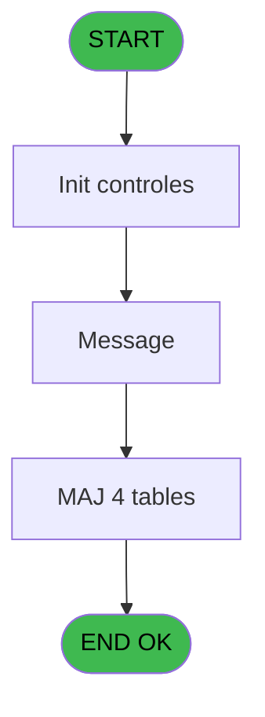
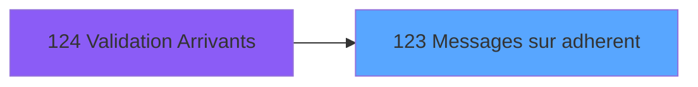
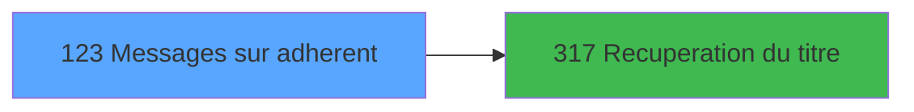

# PBG IDE 123 - Messages sur adherent

> **Analyse**: Phases 1-4 2026-02-03 09:33 -> 09:33 (17s) | Assemblage 09:33
> **Pipeline**: V7.2 Enrichi
> **Structure**: 4 onglets (Resume | Ecrans | Donnees | Connexions)

<!-- TAB:Resume -->

## 1. FICHE D'IDENTITE

| Attribut | Valeur |
|----------|--------|
| Projet | PBG |
| IDE Position | 123 |
| Nom Programme | Messages sur adherent |
| Fichier source | `Prg_123.xml` |
| Domaine metier | General |
| Taches | 10 (1 ecrans visibles) |
| Tables modifiees | 4 |
| Programmes appeles | 1 |

## 2. DESCRIPTION FONCTIONNELLE

**Messages sur adherent** assure la gestion complete de ce processus, accessible depuis [Validation Arrivants (IDE 124)](PBG-IDE-124.md).

Le flux de traitement s'organise en **4 blocs fonctionnels** :

- **Traitement** (6 taches) : traitements metier divers
- **Creation** (2 taches) : insertion d'enregistrements en base (mouvements, prestations)
- **Calcul** (1 tache) : calculs de montants, stocks ou compteurs
- **Validation** (1 tache) : controles et verifications de coherence

**Donnees modifiees** : 4 tables en ecriture (historik_station, fichier_messagerie, fichier_validation, fichier_echanges).

Detail : phases du traitement

#### Phase 1 : Traitement (6 taches)

- **123** - message **[[ECRAN]](#ecran-t1)**
- **123.1** - Recup. poste et ligne
- **123.2** - Test si message
- **123.3** - Message **[[ECRAN]](#ecran-t4)**
- **123.3.1** - Ecriture Historique
- **123.3.2** - Ecriture Historique

Delegue a : [Recuperation du titre (IDE 317)](PBG-IDE-317.md)

#### Phase 2 : Validation (1 tache)

- **123.3.3** - Maj Validation

#### Phase 3 : Creation (2 taches)

- **123.3.4** - Creation Echange v1
- **123.3.6** - Creation Echange v1

#### Phase 4 : Calcul (1 tache)

- **123.3.5** - Calcul Flag

#### Tables impactees

| Table | Operations | Role metier |
|-------|-----------|-------------|
| fichier_messagerie | R/**W**/L (4 usages) |  |
| historik_station | **W** (2 usages) | Historique / journal |
| fichier_echanges | **W** (2 usages) |  |
| fichier_validation | **W** (1 usages) |  |

## 3. BLOCS FONCTIONNELS

### 3.1 Traitement (6 taches)

Traitements internes.

---

#### 123 - message [[ECRAN]](#ecran-t1)

**Role** : Tache d'orchestration : point d'entree du programme (6 sous-taches). Coordonne l'enchainement des traitements.
**Ecran** : 352 x 122 DLU (MDI) | [Voir mockup](#ecran-t1)

5 sous-taches directes

| Tache | Nom | Bloc |
|-------|-----|------|
| [123.1](#t2) | Recup. poste et ligne | Traitement |
| [123.2](#t3) | Test si message | Traitement |
| [123.3](#t4) | Message **[[ECRAN]](#ecran-t4)** | Traitement |
| [123.3.1](#t5) | Ecriture Historique | Traitement |
| [123.3.2](#t6) | Ecriture Historique | Traitement |

**Variables liees** : G (W0 message ?)
**Delegue a** : [Recuperation du titre (IDE 317)](PBG-IDE-317.md)

---

#### 123.1 - Recup. poste et ligne

**Role** : Consultation/chargement : Recup. poste et ligne.
**Variables liees** : H (W0 n° poste), I (W0 n° ligne)
**Delegue a** : [Recuperation du titre (IDE 317)](PBG-IDE-317.md)

---

#### 123.2 - Test si message

**Role** : Verification : Test si message.
**Variables liees** : G (W0 message ?)
**Delegue a** : [Recuperation du titre (IDE 317)](PBG-IDE-317.md)

---

#### 123.3 - Message [[ECRAN]](#ecran-t4)

**Role** : Traitement : Message.
**Ecran** : 1070 x 212 DLU (MDI) | [Voir mockup](#ecran-t4)
**Variables liees** : G (W0 message ?)
**Delegue a** : [Recuperation du titre (IDE 317)](PBG-IDE-317.md)

---

#### 123.3.1 - Ecriture Historique

**Role** : Consultation/chargement : Ecriture Historique.
**Delegue a** : [Recuperation du titre (IDE 317)](PBG-IDE-317.md)

---

#### 123.3.2 - Ecriture Historique

**Role** : Consultation/chargement : Ecriture Historique.
**Delegue a** : [Recuperation du titre (IDE 317)](PBG-IDE-317.md)

### 3.2 Validation (1 tache)

Controles de coherence : 1 tache verifie les donnees et conditions.

---

#### 123.3.3 - Maj Validation

**Role** : Verification : Maj Validation.

### 3.3 Creation (2 taches)

Insertion de nouveaux enregistrements en base.

---

#### 123.3.4 - Creation Echange v1

**Role** : Creation d'enregistrement : Creation Echange v1.

---

#### 123.3.6 - Creation Echange v1

**Role** : Creation d'enregistrement : Creation Echange v1.

### 3.4 Calcul (1 tache)

Calculs metier : montants, stocks, compteurs.

---

#### 123.3.5 - Calcul Flag

**Role** : Calcul : Calcul Flag.

## 5. REGLES METIER

*(Aucune regle metier identifiee)*

## 6. CONTEXTE

- **Appele par**: [Validation Arrivants (IDE 124)](PBG-IDE-124.md)
- **Appelle**: 1 programmes | **Tables**: 5 (W:4 R:2 L:1) | **Taches**: 10 | **Expressions**: 4

<!-- TAB:Ecrans -->

## 8. ECRANS

### 8.1 Forms visibles (1 / 10)

| # | Position | Tache | Nom | Type | Largeur | Hauteur | Bloc |
|---|----------|-------|-----|------|---------|---------|------|
| 1 | 123.3 | 123.3 | Message | MDI | 1070 | 212 | Traitement |

### 8.2 Mockups Ecrans

---

#### 123.3 - Message
**Tache** : [123.3](#t4) | **Type** : MDI | **Dimensions** : 1070 x 212 DLU
**Bloc** : Traitement | **Titre IDE** : Message

<!-- FORM-DATA:
{
    "width":  1070,
    "vFactor":  8,
    "type":  "MDI",
    "hFactor":  8,
    "controls":  [
                     {
                         "x":  1,
                         "type":  "label",
                         "var":  "",
                         "y":  2,
                         "w":  1063,
                         "fmt":  "",
                         "name":  "",
                         "h":  17,
                         "color":  "",
                         "text":  "",
                         "parent":  null
                     },
                     {
                         "x":  5,
                         "type":  "label",
                         "var":  "",
                         "y":  32,
                         "w":  1058,
                         "fmt":  "",
                         "name":  "",
                         "h":  21,
                         "color":  "",
                         "text":  "",
                         "parent":  null
                     },
                     {
                         "x":  295,
                         "type":  "label",
                         "var":  "",
                         "y":  38,
                         "w":  42,
                         "fmt":  "",
                         "name":  "",
                         "h":  8,
                         "color":  "7",
                         "text":  "Par",
                         "parent":  null
                     },
                     {
                         "x":  507,
                         "type":  "label",
                         "var":  "",
                         "y":  38,
                         "w":  27,
                         "fmt":  "",
                         "name":  "",
                         "h":  8,
                         "color":  "7",
                         "text":  "le",
                         "parent":  null
                     },
                     {
                         "x":  5,
                         "type":  "label",
                         "var":  "",
                         "y":  53,
                         "w":  1058,
                         "fmt":  "",
                         "name":  "",
                         "h":  120,
                         "color":  "",
                         "text":  "",
                         "parent":  null
                     },
                     {
                         "x":  15,
                         "type":  "table",
                         "var":  "",
                         "name":  "",
                         "titleH":  12,
                         "color":  "110",
                         "w":  875,
                         "y":  61,
                         "fmt":  "",
                         "parent":  null,
                         "text":  "",
                         "rowH":  14,
                         "h":  103,
                         "cols":  [
                                      {
                                          "title":  "Message",
                                          "layer":  1,
                                          "w":  843
                                      }
                                  ],
                         "rows":  1
                     },
                     {
                         "x":  0,
                         "type":  "label",
                         "var":  "",
                         "y":  185,
                         "w":  1064,
                         "fmt":  "",
                         "name":  "",
                         "h":  24,
                         "color":  "",
                         "text":  "",
                         "parent":  null
                     },
                     {
                         "x":  546,
                         "type":  "edit",
                         "var":  "",
                         "y":  38,
                         "w":  139,
                         "fmt":  "",
                         "name":  "",
                         "h":  8,
                         "color":  "7",
                         "text":  "",
                         "parent":  null
                     },
                     {
                         "x":  695,
                         "type":  "edit",
                         "var":  "",
                         "y":  38,
                         "w":  75,
                         "fmt":  "HH:MM",
                         "name":  "",
                         "h":  8,
                         "color":  "7",
                         "text":  "",
                         "parent":  null
                     },
                     {
                         "x":  349,
                         "type":  "edit",
                         "var":  "",
                         "y":  38,
                         "w":  139,
                         "fmt":  "",
                         "name":  "",
                         "h":  8,
                         "color":  "7",
                         "text":  "",
                         "parent":  null
                     },
                     {
                         "x":  21,
                         "type":  "edit",
                         "var":  "",
                         "y":  75,
                         "w":  826,
                         "fmt":  "",
                         "name":  "",
                         "h":  10,
                         "color":  "110",
                         "text":  "",
                         "parent":  12
                     },
                     {
                         "x":  7,
                         "type":  "button",
                         "var":  "",
                         "y":  189,
                         "w":  226,
                         "fmt":  "\\A\u0026bandonner",
                         "name":  "Btn Abandonner",
                         "h":  18,
                         "color":  "",
                         "text":  "",
                         "parent":  null
                     },
                     {
                         "x":  241,
                         "type":  "button",
                         "var":  "",
                         "y":  189,
                         "w":  226,
                         "fmt":  "\u0026Suppression messages",
                         "name":  "Btn Valider",
                         "h":  18,
                         "color":  "",
                         "text":  "",
                         "parent":  null
                     },
                     {
                         "x":  7,
                         "type":  "edit",
                         "var":  "",
                         "y":  6,
                         "w":  267,
                         "fmt":  "20",
                         "name":  "",
                         "h":  8,
                         "color":  "",
                         "text":  "",
                         "parent":  1
                     },
                     {
                         "x":  779,
                         "type":  "edit",
                         "var":  "",
                         "y":  6,
                         "w":  278,
                         "fmt":  "WWW DD MMM YYYYT",
                         "name":  "",
                         "h":  8,
                         "color":  "",
                         "text":  "",
                         "parent":  1
                     },
                     {
                         "x":  896,
                         "type":  "image",
                         "var":  "",
                         "y":  60,
                         "w":  160,
                         "fmt":  "",
                         "name":  "",
                         "h":  53,
                         "color":  "",
                         "text":  "",
                         "parent":  null
                     }
                 ],
    "taskId":  "123.3",
    "height":  212
}
-->

<strong>Champs : 6 champs</strong>

| Pos (x,y) | Nom | Variable | Type |
|-----------|-----|----------|------|
| 546,38 | (sans nom) | - | edit |
| 695,38 | HH:MM | - | edit |
| 349,38 | (sans nom) | - | edit |
| 21,75 | (sans nom) | - | edit |
| 7,6 | 20 | - | edit |
| 779,6 | WWW DD MMM YYYYT | - | edit |

<strong>Boutons : 2 boutons</strong>

| Bouton | Pos (x,y) | Action |
|--------|-----------|--------|
| \Abandonner | 7,189 | Annule et retour au menu |
| Suppression messages | 241,189 | Supprime l'element selectionne |

## 9. NAVIGATION

Ecran unique: **Message**

### 9.3 Structure hierarchique (10 taches)

| Position | Tache | Type | Dimensions | Bloc |
|----------|-------|------|------------|------|
| **123.1** | [**message** (123)](#t1) [mockup](#ecran-t1) | MDI | 352x122 | Traitement |
| 123.1.1 | [Recup. poste et ligne (123.1)](#t2) | MDI | - | |
| 123.1.2 | [Test si message (123.2)](#t3) | MDI | - | |
| 123.1.3 | [Message (123.3)](#t4) [mockup](#ecran-t4) | MDI | 1070x212 | |
| 123.1.4 | [Ecriture Historique (123.3.1)](#t5) | MDI | - | |
| 123.1.5 | [Ecriture Historique (123.3.2)](#t6) | MDI | - | |
| **123.2** | [**Maj Validation** (123.3.3)](#t7) | MDI | - | Validation |
| **123.3** | [**Creation Echange v1** (123.3.4)](#t8) | MDI | - | Creation |
| 123.3.1 | [Creation Echange v1 (123.3.6)](#t12) | MDI | - | |
| **123.4** | [**Calcul Flag** (123.3.5)](#t9) | MDI | - | Calcul |

### 9.4 Algorigramme

> **Legende**: Vert = START/END OK | Rouge = END KO | Bleu = Decisions
> *Algorigramme auto-genere. Utiliser `/algorigramme` pour une synthese metier detaillee.*

<!-- TAB:Donnees -->

## 10. TABLES

### Tables utilisees (5)

| ID | Nom | Description | Type | R | W | L | Usages |
|----|-----|-------------|------|---|---|---|--------|
| 80 | codes_autocom____aut |  | DB | R |   |   | 1 |
| 88 | historik_station | Historique / journal | DB |   | **W** |   | 2 |
| 123 | fichier_messagerie |  | DB | R | **W** | L | 4 |
| 131 | fichier_validation |  | DB |   | **W** |   | 1 |
| 136 | fichier_echanges |  | DB |   | **W** |   | 2 |

### Colonnes par table (1 / 5 tables avec colonnes identifiees)

Table 80 - codes_autocom____aut (R) - 1 usages

*Table utilisee uniquement en Link ou aucune colonne Real identifiee dans le DataView.*

Table 88 - historik_station (**W**) - 2 usages

*Table utilisee uniquement en Link ou aucune colonne Real identifiee dans le DataView.*

Table 123 - fichier_messagerie (R/**W**/L) - 4 usages

| Lettre | Variable | Acces | Type |
|--------|----------|-------|------|
| A | W1 ret lien message | W | Numeric |
| B | W1 fin tache | W | Alpha |
| C | Btn Abandonner | W | Alpha |
| D | Btn Valider | W | Alpha |

Table 131 - fichier_validation (**W**) - 1 usages

*Table utilisee uniquement en Link ou aucune colonne Real identifiee dans le DataView.*

Table 136 - fichier_echanges (**W**) - 2 usages

*Table utilisee uniquement en Link ou aucune colonne Real identifiee dans le DataView.*

## 11. VARIABLES

### 11.1 Variables de session (1)

Variables persistantes pendant toute la session.

| Lettre | Nom | Type | Usage dans |
|--------|-----|------|-----------|
| J | v. titre | Alpha | 1x session |

### 11.2 Variables de travail (3)

Variables internes au programme.

| Lettre | Nom | Type | Usage dans |
|--------|-----|------|-----------|
| G | W0 message ? | Alpha | [123](#t1), [123.2](#t3), [123.3](#t4) |
| H | W0 n° poste | Numeric | - |
| I | W0 n° ligne | Numeric | - |

### 11.3 Autres (6)

Variables diverses.

| Lettre | Nom | Type | Usage dans |
|--------|-----|------|-----------|
| A | > societe | Alpha | - |
| B | > compte | Numeric | - |
| C | > filiation | Numeric | - |
| D | > village tel | Alpha | 1x refs |
| E | > type triplet | Alpha | 1x refs |
| F | > Interface | Alpha | 1x refs |

## 12. EXPRESSIONS

**4 / 4 expressions decodees (100%)**

### 12.1 Repartition par type

| Type | Expressions | Regles |
|------|-------------|--------|
| CONSTANTE | 1 | 0 |
| CONDITION | 2 | 0 |
| STRING | 1 | 0 |

### 12.2 Expressions cles par type

#### CONSTANTE (1 expressions)

| Type | IDE | Expression | Regle |
|------|-----|------------|-------|
| CONSTANTE | 2 | `57` | - |

#### CONDITION (2 expressions)

| Type | IDE | Expression | Regle |
|------|-----|------------|-------|
| CONDITION | 4 | `> village tel [D]='O' AND > Interface [F]='CLUB' AND > type triplet [E]='1'` | - |
| CONDITION | 3 | `W0 message ? [G]='O'` | - |

#### STRING (1 expressions)

| Type | IDE | Expression | Regle |
|------|-----|------------|-------|
| STRING | 1 | `Trim (v. titre [J])` | - |

<!-- TAB:Connexions -->

## 13. GRAPHE D'APPELS

### 13.1 Chaine depuis Main (Callers)

Main -> ... -> [Validation Arrivants (IDE 124)](PBG-IDE-124.md) -> **Messages sur adherent (IDE 123)**

### 13.2 Callers

| IDE | Nom Programme | Nb Appels |
|-----|---------------|-----------|
| [124](PBG-IDE-124.md) | Validation Arrivants | 1 |

### 13.3 Callees (programmes appeles)

### 13.4 Detail Callees avec contexte

| IDE | Nom Programme | Appels | Contexte |
|-----|---------------|--------|----------|
| [317](PBG-IDE-317.md) | Recuperation du titre | 1 | Recuperation donnees |

## 14. RECOMMANDATIONS MIGRATION

### 14.1 Profil du programme

| Metrique | Valeur | Impact migration |
|----------|--------|-----------------|
| Lignes de logique | 156 | Programme compact |
| Expressions | 4 | Peu de logique |
| Tables WRITE | 4 | Impact modere |
| Sous-programmes | 1 | Peu de dependances |
| Ecrans visibles | 1 | Ecran unique ou traitement batch |
| Code desactive | 0% (0 / 156) | Code sain |
| Regles metier | 0 | Pas de regle identifiee |

### 14.2 Plan de migration par bloc

#### Traitement (6 taches: 2 ecrans, 4 traitements)

- **Strategie** : Orchestrateur avec 2 ecrans (Razor/React) et 4 traitements backend (services).
- Les ecrans deviennent des composants UI, les traitements invisibles deviennent des services injectables.
- 1 sous-programme(s) a migrer ou a reutiliser depuis les services existants.
- Decomposer les taches en services unitaires testables.

#### Validation (1 tache: 0 ecran, 1 traitement)

- **Strategie** : FluentValidation avec validators specifiques.
- Chaque tache de validation -> un validator injectable

#### Creation (2 taches: 0 ecran, 2 traitements)

- **Strategie** : Repository pattern avec Entity Framework Core.
- Insertion via `IRepository<T>.CreateAsync()`

#### Calcul (1 tache: 0 ecran, 1 traitement)

- **Strategie** : Services de calcul purs (Domain Services).
- Migrer la logique de calcul (stock, compteurs, montants)

### 14.3 Dependances critiques

| Dependance | Type | Appels | Impact |
|------------|------|--------|--------|
| historik_station | Table WRITE (Database) | 2x | Schema + repository |
| fichier_messagerie | Table WRITE (Database) | 1x | Schema + repository |
| fichier_validation | Table WRITE (Database) | 1x | Schema + repository |
| fichier_echanges | Table WRITE (Database) | 2x | Schema + repository |
| [Recuperation du titre (IDE 317)](PBG-IDE-317.md) | Sous-programme | 1x | Normale - Recuperation donnees |

---
*Spec DETAILED generee par Pipeline V7.2 - 2026-02-03 09:33*
