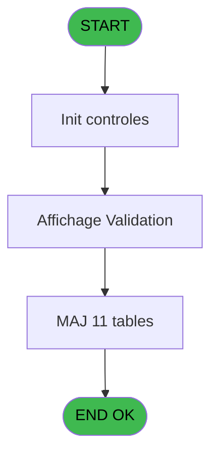
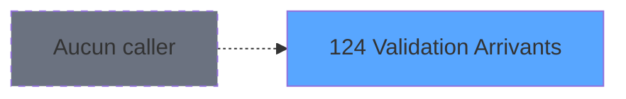
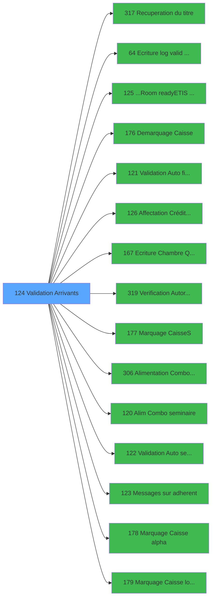

# PBG IDE 124 - Validation Arrivants

> **Analyse**: Phases 1-4 2026-02-03 09:33 -> 09:33 (19s) | Assemblage 09:33
> **Pipeline**: V7.2 Enrichi
> **Structure**: 4 onglets (Resume | Ecrans | Donnees | Connexions)

<!-- TAB:Resume -->

## 1. FICHE D'IDENTITE

| Attribut | Valeur |
|----------|--------|
| Projet | PBG |
| IDE Position | 124 |
| Nom Programme | Validation Arrivants |
| Fichier source | `Prg_124.xml` |
| Domaine metier | General |
| Taches | 77 (16 ecrans visibles) |
| Tables modifiees | 11 |
| Programmes appeles | 15 |
| :warning: Statut | **ORPHELIN_POTENTIEL** |

## 2. DESCRIPTION FONCTIONNELLE

**Validation Arrivants** assure la gestion complete de ce processus.

Le flux de traitement s'organise en **4 blocs fonctionnels** :

- **Traitement** (29 taches) : traitements metier divers
- **Validation** (22 taches) : controles et verifications de coherence
- **Creation** (13 taches) : insertion d'enregistrements en base (mouvements, prestations)
- **Consultation** (13 taches) : ecrans de recherche, selection et consultation

**Donnees modifiees** : 11 tables en ecriture (gm-recherche_____gmr, gm-complet_______gmc, hebergement______heb, personnel_go______go, historik_station, fichier_validation, groupe_arr_dep___vol, heb_circuit______hci, fi_complet_______gm_go, import_avertiss__an_val, num_tpe_par_service).

**Logique metier** : 2 regles identifiees couvrant valeurs par defaut.

Detail : phases du traitement

#### Phase 1 : Validation (22 taches)

- **124** - Validation Arrivant
- **124.2** - Test Base Validation
- **124.3** - Affichage Validation PYR **[[ECRAN]](#ecran-t4)**
- **124.3.5** - Validation Arrivant **[[ECRAN]](#ecran-t10)**
- **124.3.5.1** - Verification Logement **[[ECRAN]](#ecran-t11)**
- **124.3.5.5** - Validation Arrivee
- **124.3.5.5.6.2** - Verif si GO Greek
- **124.3.6** - Devalidation Arrivant **[[ECRAN]](#ecran-t25)**
- **124.3.6.1** - Verification Planning
- **124.3.6.2** - Devalidation Batch
- **124.3.7** - Validation Série **[[ECRAN]](#ecran-t34)**
- **124.3.7.3** - Validation Automatique **[[ECRAN]](#ecran-t38)**
- **124.3.7.3.1** - Verification Logement
- **124.3.7.3.6.2** - Verif si GO Greek
- **124.3.8.1** - Valide un seul **[[ECRAN]](#ecran-t53)**
- **124.3.8.2** - Valide tous **[[ECRAN]](#ecran-t54)**
- **124.3.8.2.1** - Controle logement **[[ECRAN]](#ecran-t55)**
- **124.3.9.1.4** - Maj validation
- **124.3.6.2.7** - Devalidation effectif personne
- **124.3.7.6** - Validation Automatique **[[ECRAN]](#ecran-t81)**
- **124.3.7.6.1** - Verification Logement
- **124.3.7.6.6.2** - Verif si GO Greek

Delegue a : [Ecriture log valid devalid (IDE 64)](PBG-IDE-64.md), [    Validation Auto filiations (IDE 121)](PBG-IDE-121.md), [Verification Autorisation (IDE 319)](PBG-IDE-319.md), [    Validation Auto seminaire (IDE 122)](PBG-IDE-122.md)

#### Phase 2 : Traitement (29 taches)

- **124.1** - Determination Age Bebe
- **124.3.5.5.1** - Marquage Periodes
- **124.3.5.5.2** - Marquage Periodes
- **124.3.6.2.1** - Demarquage Hebergement
- **124.3.6.2.2** - Demarquage Hebergement
- **124.3.7.1** - Existe Groupe Arrivée **[[ECRAN]](#ecran-t35)**
- **124.3.7.2** - Existence Seminaire
- **124.3.7.2.1** - cherche
- **124.3.7.3.2** - Marquage Periodes
- **124.3.7.3.3** - Marquage Periodes
- **124.3.8** - Liste des Filiations **[[ECRAN]](#ecran-t52)**
- **124.3.8.3** - Possibles?
- **124.3.9** - Arr.differee **[[ECRAN]](#ecran-t59)**
- **124.3.9.1** - MAJ
- **124.3.9.1.1** - Maj gmr
- **124.3.9.1.2** - Maj Hebergement
- **124.3.9.1.3** - Maj client
- **124.3.10** - Lecture email
- **124.3.5.6** - Credit Bar **[[ECRAN]](#ecran-t70)**
- **124.3.6.3** - Credit Bar **[[ECRAN]](#ecran-t74)**
- **124.3.11** - Désactive Easy Check-Out
- **124.3.7.5** - Existe Groupe Arrivée **[[ECRAN]](#ecran-t78)**
- **124.3.7.6.2** - Marquage Periodes
- **124.3.7.6.3** - Marquage Periodes
- **124.4** - Test fdp Turquie
- **124.3.7.7** - Màj liste erreurs fdp truquie
- **124.4.1** - Màj liste erreurs fdp truquie
- **124.3.7.8** - Anomalies **[[ECRAN]](#ecran-t99)**
- **124.4.2** - Màj liste erreurs fdp truquie

Delegue a : [Recuperation du titre (IDE 317)](PBG-IDE-317.md), [...Room ready/ETIS prio (IDE 125)](PBG-IDE-125.md), [Demarquage Caisse (IDE 176)](PBG-IDE-176.md), [Affectation Crédit Bar (IDE 126)](PBG-IDE-126.md), [Ecriture Chambre Quadriga (IDE 167)](PBG-IDE-167.md), [Marquage Caisse(S) (IDE 177)](PBG-IDE-177.md), [    Alim Combo seminaire (IDE 120)](PBG-IDE-120.md), [    Messages sur adherent (IDE 123)](PBG-IDE-123.md), [Marquage Caisse alpha (IDE 178)](PBG-IDE-178.md), [Marquage Caisse logique (IDE 179)](PBG-IDE-179.md)

#### Phase 3 : Consultation (13 taches)

- **124.3.1** - Affichage Hebergement **[[ECRAN]](#ecran-t5)**
- **124.3.2** - Affichage Prestations **[[ECRAN]](#ecran-t6)**
- **124.3.3** - Affichage Circuits **[[ECRAN]](#ecran-t7)**
- **124.3.4** - Recherche Nom **[[ECRAN]](#ecran-t9)**
- **124.3.5.4** - Zoom Vol Aller **[[ECRAN]](#ecran-t14)**
- **124.3.5.5.3** - Marquage Recherche
- **124.3.5.5.4** - Marquage Recherche
- **124.3.6.2.3** - Demarquage Recherche
- **124.3.6.2.4** - Demarquage Recherche
- **124.3.7.3.4** - Marquage Recherche
- **124.3.7.4** - Zoom Vol Aller **[[ECRAN]](#ecran-t49)**
- **124.3.8.2.2** - Zoom Vol Aller **[[ECRAN]](#ecran-t56)**
- **124.3.7.6.4** - Marquage Recherche

Delegue a : [Recuperation du titre (IDE 317)](PBG-IDE-317.md)

#### Phase 4 : Creation (13 taches)

- **124.3.5.2** - Creation VV Aller et Retour
- **124.3.5.3** - Creation VV Aller et Retour
- **124.3.5.5.5** - Creation Historique
- **124.3.5.5.6** - Creation Specif Greque
- **124.3.5.5.6.1** - Creation Specif Greque
- **124.3.6.2.5** - Creation Historique
- **124.3.6.2.6** - Creation Historique
- **124.3.7.3.5** - Creation Historique
- **124.3.7.3.6** - Creation Specif Greque
- **124.3.7.3.6.1** - Creation Specif Greque
- **124.3.7.6.5** - Creation Historique
- **124.3.7.6.6** - Creation Specif Greque
- **124.3.7.6.6.1** - Creation Specif Greque

Delegue a : [  Alimentation Combo VOL/creat (IDE 306)](PBG-IDE-306.md)

#### Tables impactees

| Table | Operations | Role metier |
|-------|-----------|-------------|
| hebergement______heb | R/**W**/L (20 usages) | Hebergement (chambres) |
| fichier_validation | R/**W**/L (14 usages) |  |
| gm-complet_______gmc | R/**W**/L (7 usages) |  |
| groupe_arr_dep___vol | R/**W**/L (6 usages) |  |
| gm-recherche_____gmr | R/**W**/L (6 usages) | Index de recherche |
| heb_circuit______hci | **W**/L (5 usages) | Hebergement (chambres) |
| import_avertiss__an_val | **W**/L (4 usages) |  |
| personnel_go______go | **W**/L (4 usages) |  |
| historik_station | **W** (4 usages) | Historique / journal |
| fi_complet_______gm_go | **W**/L (4 usages) |  |
| num_tpe_par_service | **W** (1 usages) | Services / filieres |

## 3. BLOCS FONCTIONNELS

### 3.1 Validation (22 taches)

Controles de coherence : 22 taches verifient les donnees et conditions.

---

#### 124 - Validation Arrivant

**Role** : Tache d'orchestration : point d'entree du programme (22 sous-taches). Coordonne l'enchainement des traitements.

21 sous-taches directes

| Tache | Nom | Bloc |
|-------|-----|------|
| [124.2](#t3) | Test Base Validation | Validation |
| [124.3](#t4) | Affichage Validation PYR **[[ECRAN]](#ecran-t4)** | Validation |
| [124.3.5](#t10) | Validation Arrivant **[[ECRAN]](#ecran-t10)** | Validation |
| [124.3.5.1](#t11) | Verification Logement **[[ECRAN]](#ecran-t11)** | Validation |
| [124.3.5.5](#t16) | Validation Arrivee | Validation |
| [124.3.5.5.6.2](#t24) | Verif si GO Greek | Validation |
| [124.3.6](#t25) | Devalidation Arrivant **[[ECRAN]](#ecran-t25)** | Validation |
| [124.3.6.1](#t26) | Verification Planning | Validation |
| [124.3.6.2](#t27) | Devalidation Batch | Validation |
| [124.3.7](#t34) | Validation Série **[[ECRAN]](#ecran-t34)** | Validation |
| [124.3.7.3](#t38) | Validation Automatique **[[ECRAN]](#ecran-t38)** | Validation |
| [124.3.7.3.1](#t39) | Verification Logement | Validation |
| [124.3.7.3.6.2](#t48) | Verif si GO Greek | Validation |
| [124.3.8.1](#t53) | Valide un seul **[[ECRAN]](#ecran-t53)** | Validation |
| [124.3.8.2](#t54) | Valide tous **[[ECRAN]](#ecran-t54)** | Validation |
| [124.3.8.2.1](#t55) | Controle logement **[[ECRAN]](#ecran-t55)** | Validation |
| [124.3.9.1.4](#t64) | Maj validation | Validation |
| [124.3.6.2.7](#t66) | Devalidation effectif personne | Validation |
| [124.3.7.6](#t81) | Validation Automatique **[[ECRAN]](#ecran-t81)** | Validation |
| [124.3.7.6.1](#t82) | Verification Logement | Validation |
| [124.3.7.6.6.2](#t89) | Verif si GO Greek | Validation |

**Variables liees** : K (W0-Validation Vide)

---

#### 124.2 - Test Base Validation

**Role** : Verification : Test Base Validation.
**Variables liees** : K (W0-Validation Vide)

---

#### 124.3 - Affichage Validation PYR [[ECRAN]](#ecran-t4)

**Role** : Verification : Affichage Validation PYR.
**Ecran** : 1606 x 281 DLU (MDI) | [Voir mockup](#ecran-t4)
**Variables liees** : Y (p.i.Affichage Message?), K (W0-Validation Vide)

---

#### 124.3.5 - Validation Arrivant [[ECRAN]](#ecran-t10)

**Role** : Verification : Validation Arrivant.
**Ecran** : 1274 x 155 DLU (MDI) | [Voir mockup](#ecran-t10)
**Variables liees** : K (W0-Validation Vide)

---

#### 124.3.5.1 - Verification Logement [[ECRAN]](#ecran-t11)

**Role** : Verification : Verification Logement.
**Ecran** : 525 x 254 DLU (MDI) | [Voir mockup](#ecran-t11)

---

#### 124.3.5.5 - Validation Arrivee

**Role** : Verification : Validation Arrivee.
**Variables liees** : K (W0-Validation Vide)

---

#### 124.3.5.5.6.2 - Verif si GO Greek

**Role** : Verification : Verif si GO Greek.

---

#### 124.3.6 - Devalidation Arrivant [[ECRAN]](#ecran-t25)

**Role** : Verification : Devalidation Arrivant.
**Ecran** : 466 x 134 DLU (MDI) | [Voir mockup](#ecran-t25)

---

#### 124.3.6.1 - Verification Planning

**Role** : Verification : Verification Planning.

---

#### 124.3.6.2 - Devalidation Batch

**Role** : Verification : Devalidation Batch.

---

#### 124.3.7 - Validation Série [[ECRAN]](#ecran-t34)

**Role** : Verification : Validation Série.
**Ecran** : 787 x 129 DLU (Modal) | [Voir mockup](#ecran-t34)
**Variables liees** : K (W0-Validation Vide)

---

#### 124.3.7.3 - Validation Automatique [[ECRAN]](#ecran-t38)

**Role** : Verification : Validation Automatique.
**Ecran** : 422 x 106 DLU (MDI) | [Voir mockup](#ecran-t38)
**Variables liees** : K (W0-Validation Vide)

---

#### 124.3.7.3.1 - Verification Logement

**Role** : Verification : Verification Logement.

---

#### 124.3.7.3.6.2 - Verif si GO Greek

**Role** : Verification : Verif si GO Greek.

---

#### 124.3.8.1 - Valide un seul [[ECRAN]](#ecran-t53)

**Role** : Verification : Valide un seul.
**Ecran** : 430 x 44 DLU (MDI) | [Voir mockup](#ecran-t53)

---

#### 124.3.8.2 - Valide tous [[ECRAN]](#ecran-t54)

**Role** : Verification : Valide tous.
**Ecran** : 430 x 44 DLU (MDI) | [Voir mockup](#ecran-t54)

---

#### 124.3.8.2.1 - Controle logement [[ECRAN]](#ecran-t55)

**Role** : Verification : Controle logement.
**Ecran** : 384 x 160 DLU (MDI) | [Voir mockup](#ecran-t55)

---

#### 124.3.9.1.4 - Maj validation

**Role** : Verification : Maj validation.
**Variables liees** : K (W0-Validation Vide)

---

#### 124.3.6.2.7 - Devalidation effectif personne

**Role** : Verification : Devalidation effectif personne.
**Variables liees** : F (P0-Nom Personne), G (P0-Prenom Personne)

---

#### 124.3.7.6 - Validation Automatique [[ECRAN]](#ecran-t81)

**Role** : Verification : Validation Automatique.
**Ecran** : 422 x 106 DLU (MDI) | [Voir mockup](#ecran-t81)
**Variables liees** : K (W0-Validation Vide)

---

#### 124.3.7.6.1 - Verification Logement

**Role** : Verification : Verification Logement.

---

#### 124.3.7.6.6.2 - Verif si GO Greek

**Role** : Verification : Verif si GO Greek.

### 3.2 Traitement (29 taches)

Traitements internes.

---

#### 124.1 - Determination Age Bebe

**Role** : Traitement : Determination Age Bebe.
**Variables liees** : J (W0-Age Bebe)

---

#### 124.3.5.5.1 - Marquage Periodes

**Role** : Traitement : Marquage Periodes.

---

#### 124.3.5.5.2 - Marquage Periodes

**Role** : Traitement : Marquage Periodes.

---

#### 124.3.6.2.1 - Demarquage Hebergement

**Role** : Traitement : Demarquage Hebergement.

---

#### 124.3.6.2.2 - Demarquage Hebergement

**Role** : Traitement : Demarquage Hebergement.

---

#### 124.3.7.1 - Existe Groupe Arrivée [[ECRAN]](#ecran-t35)

**Role** : Traitement : Existe Groupe Arrivée.
**Ecran** : 602 x 0 DLU (MDI) | [Voir mockup](#ecran-t35)

---

#### 124.3.7.2 - Existence Seminaire

**Role** : Traitement : Existence Seminaire.

---

#### 124.3.7.2.1 - cherche

**Role** : Traitement : cherche.

---

#### 124.3.7.3.2 - Marquage Periodes

**Role** : Traitement : Marquage Periodes.

---

#### 124.3.7.3.3 - Marquage Periodes

**Role** : Traitement : Marquage Periodes.

---

#### 124.3.8 - Liste des Filiations [[ECRAN]](#ecran-t52)

**Role** : Traitement : Liste des Filiations.
**Ecran** : 446 x 202 DLU (MDI) | [Voir mockup](#ecran-t52)

---

#### 124.3.8.3 - Possibles?

**Role** : Traitement : Possibles?.

---

#### 124.3.9 - Arr.differee [[ECRAN]](#ecran-t59)

**Role** : Traitement : Arr.differee.
**Ecran** : 434 x 199 DLU (MDI) | [Voir mockup](#ecran-t59)

---

#### 124.3.9.1 - MAJ

**Role** : Traitement interne.

---

#### 124.3.9.1.1 - Maj gmr

**Role** : Traitement : Maj gmr.

---

#### 124.3.9.1.2 - Maj Hebergement

**Role** : Traitement : Maj Hebergement.

---

#### 124.3.9.1.3 - Maj client

**Role** : Traitement : Maj client.

---

#### 124.3.10 - Lecture email

**Role** : Traitement : Lecture email.

---

#### 124.3.5.6 - Credit Bar [[ECRAN]](#ecran-t70)

**Role** : Calcul fidelite/avantage : Credit Bar.
**Ecran** : 898 x 105 DLU (Modal) | [Voir mockup](#ecran-t70)

---

#### 124.3.6.3 - Credit Bar [[ECRAN]](#ecran-t74)

**Role** : Calcul fidelite/avantage : Credit Bar.
**Ecran** : 898 x 105 DLU (Modal) | [Voir mockup](#ecran-t74)

---

#### 124.3.11 - Désactive Easy Check-Out

**Role** : Traitement : Désactive Easy Check-Out.

---

#### 124.3.7.5 - Existe Groupe Arrivée [[ECRAN]](#ecran-t78)

**Role** : Traitement : Existe Groupe Arrivée.
**Ecran** : 602 x 0 DLU (MDI) | [Voir mockup](#ecran-t78)

---

#### 124.3.7.6.2 - Marquage Periodes

**Role** : Traitement : Marquage Periodes.

---

#### 124.3.7.6.3 - Marquage Periodes

**Role** : Traitement : Marquage Periodes.

---

#### 124.4 - Test fdp Turquie

**Role** : Verification : Test fdp Turquie.

---

#### 124.3.7.7 - Màj liste erreurs fdp truquie

**Role** : Traitement : Màj liste erreurs fdp truquie.

---

#### 124.4.1 - Màj liste erreurs fdp truquie

**Role** : Traitement : Màj liste erreurs fdp truquie.

---

#### 124.3.7.8 - Anomalies [[ECRAN]](#ecran-t99)

**Role** : Traitement : Anomalies.
**Ecran** : 339 x 341 DLU | [Voir mockup](#ecran-t99)

---

#### 124.4.2 - Màj liste erreurs fdp truquie

**Role** : Traitement : Màj liste erreurs fdp truquie.

### 3.3 Consultation (13 taches)

Ecrans de recherche et consultation.

---

#### 124.3.1 - Affichage Hebergement [[ECRAN]](#ecran-t5)

**Role** : Reinitialisation : Affichage Hebergement.
**Ecran** : 1028 x 81 DLU (Modal) | [Voir mockup](#ecran-t5)
**Variables liees** : Y (p.i.Affichage Message?)

---

#### 124.3.2 - Affichage Prestations [[ECRAN]](#ecran-t6)

**Role** : Reinitialisation : Affichage Prestations.
**Ecran** : 326 x 63 DLU (Modal) | [Voir mockup](#ecran-t6)
**Variables liees** : Y (p.i.Affichage Message?)

---

#### 124.3.3 - Affichage Circuits [[ECRAN]](#ecran-t7)

**Role** : Reinitialisation : Affichage Circuits.
**Ecran** : 320 x 70 DLU (Modal) | [Voir mockup](#ecran-t7)
**Variables liees** : Y (p.i.Affichage Message?)

---

#### 124.3.4 - Recherche Nom [[ECRAN]](#ecran-t9)

**Role** : Traitement : Recherche Nom.
**Ecran** : 506 x 118 DLU (MDI) | [Voir mockup](#ecran-t9)

---

#### 124.3.5.4 - Zoom Vol Aller [[ECRAN]](#ecran-t14)

**Role** : Selection par l'operateur : Zoom Vol Aller.
**Ecran** : 387 x 156 DLU (MDI) | [Voir mockup](#ecran-t14)

---

#### 124.3.5.5.3 - Marquage Recherche

**Role** : Traitement : Marquage Recherche.

---

#### 124.3.5.5.4 - Marquage Recherche

**Role** : Traitement : Marquage Recherche.

---

#### 124.3.6.2.3 - Demarquage Recherche

**Role** : Traitement : Demarquage Recherche.

---

#### 124.3.6.2.4 - Demarquage Recherche

**Role** : Traitement : Demarquage Recherche.

---

#### 124.3.7.3.4 - Marquage Recherche

**Role** : Traitement : Marquage Recherche.

---

#### 124.3.7.4 - Zoom Vol Aller [[ECRAN]](#ecran-t49)

**Role** : Selection par l'operateur : Zoom Vol Aller.
**Ecran** : 421 x 154 DLU (MDI) | [Voir mockup](#ecran-t49)

---

#### 124.3.8.2.2 - Zoom Vol Aller [[ECRAN]](#ecran-t56)

**Role** : Selection par l'operateur : Zoom Vol Aller.
**Ecran** : 389 x 157 DLU (MDI) | [Voir mockup](#ecran-t56)

---

#### 124.3.7.6.4 - Marquage Recherche

**Role** : Traitement : Marquage Recherche.

### 3.4 Creation (13 taches)

Insertion de nouveaux enregistrements en base.

---

#### 124.3.5.2 - Creation VV Aller et Retour

**Role** : Creation d'enregistrement : Creation VV Aller et Retour.

---

#### 124.3.5.3 - Creation VV Aller et Retour

**Role** : Creation d'enregistrement : Creation VV Aller et Retour.

---

#### 124.3.5.5.5 - Creation Historique

**Role** : Consultation/chargement : Creation Historique.

---

#### 124.3.5.5.6 - Creation Specif Greque

**Role** : Creation d'enregistrement : Creation Specif Greque.

---

#### 124.3.5.5.6.1 - Creation Specif Greque

**Role** : Creation d'enregistrement : Creation Specif Greque.

---

#### 124.3.6.2.5 - Creation Historique

**Role** : Consultation/chargement : Creation Historique.

---

#### 124.3.6.2.6 - Creation Historique

**Role** : Consultation/chargement : Creation Historique.

---

#### 124.3.7.3.5 - Creation Historique

**Role** : Consultation/chargement : Creation Historique.

---

#### 124.3.7.3.6 - Creation Specif Greque

**Role** : Creation d'enregistrement : Creation Specif Greque.

---

#### 124.3.7.3.6.1 - Creation Specif Greque

**Role** : Creation d'enregistrement : Creation Specif Greque.

---

#### 124.3.7.6.5 - Creation Historique

**Role** : Consultation/chargement : Creation Historique.

---

#### 124.3.7.6.6 - Creation Specif Greque

**Role** : Creation d'enregistrement : Creation Specif Greque.

---

#### 124.3.7.6.6.1 - Creation Specif Greque

**Role** : Creation d'enregistrement : Creation Specif Greque.

## 5. REGLES METIER

2 regles identifiees:

### Autres (2 regles)

#### [RM-001] Valeur par defaut si P0-Code Societe [A] est vide

| Element | Detail |
|---------|--------|
| **Condition** | `P0-Code Societe [A]=''` |
| **Si vrai** | 'C' |
| **Si faux** | GetParam ('SOCIETE')) |
| **Variables** | A (P0-Code Societe) |
| **Expression source** | Expression 10 : `IF (P0-Code Societe [A]='','C',GetParam ('SOCIETE'))` |
| **Exemple** | Si P0-Code Societe [A]='' → 'C'. Sinon → GetParam ('SOCIETE')) |

#### [RM-002] Valeur par defaut si P0-Code Langue [B] est vide

| Element | Detail |
|---------|--------|
| **Condition** | `P0-Code Langue [B]=''` |
| **Si vrai** | 'F' |
| **Si faux** | GetParam ('LANGUE')) |
| **Variables** | B (P0-Code Langue) |
| **Expression source** | Expression 11 : `IF (P0-Code Langue [B]='','F',GetParam ('LANGUE'))` |
| **Exemple** | Si P0-Code Langue [B]='' → 'F'. Sinon → GetParam ('LANGUE')) |

## 6. CONTEXTE

- **Appele par**: (aucun)
- **Appelle**: 15 programmes | **Tables**: 31 (W:11 R:15 L:21) | **Taches**: 77 | **Expressions**: 29

<!-- TAB:Ecrans -->

## 8. ECRANS

### 8.1 Forms visibles (16 / 77)

| # | Position | Tache | Nom | Type | Largeur | Hauteur | Bloc |
|---|----------|-------|-----|------|---------|---------|------|
| 1 | 124.3 | 124.3 | Affichage Validation PYR | MDI | 1606 | 281 | Validation |
| 2 | 124.3.1 | 124.3.1 | Affichage Hebergement | Modal | 1028 | 81 | Consultation |
| 3 | 124.3.2 | 124.3.2 | Affichage Prestations | Modal | 326 | 63 | Consultation |
| 4 | 124.3.3 | 124.3.3 | Affichage Circuits | Modal | 320 | 70 | Consultation |
| 5 | 124.3.4 | 124.3.4 | Recherche Nom | MDI | 506 | 118 | Consultation |
| 6 | 124.3.5.4 | 124.3.5.4 | Zoom Vol Aller | MDI | 387 | 156 | Consultation |
| 7 | 124.3.7 | 124.3.7 | Validation Série | Modal | 787 | 129 | Validation |
| 8 | 124.3.7.4 | 124.3.7.3 | Validation Automatique | MDI | 422 | 106 | Validation |
| 9 | 124.3.7.7 | 124.3.7.4 | Zoom Vol Aller | MDI | 421 | 154 | Consultation |
| 10 | 124.3.8 | 124.3.8 | Liste des Filiations | MDI | 446 | 202 | Traitement |
| 11 | 124.3.8.1 | 124.3.8.1 | Valide un seul | MDI | 430 | 44 | Validation |
| 12 | 124.3.8.2 | 124.3.8.2 | Valide tous | MDI | 430 | 44 | Validation |
| 13 | 124.3.8.2.2 | 124.3.8.2.2 | Zoom Vol Aller | MDI | 389 | 157 | Consultation |
| 14 | 124.3.9 | 124.3.9 | Arr.differee | MDI | 434 | 199 | Traitement |
| 15 | 124.3.7.5 | 124.3.7.6 | Validation Automatique | MDI | 422 | 106 | Validation |
| 16 | 124.3.7.8 | 124.3.7.8 | Anomalies | Type0 | 339 | 341 | Traitement |

### 8.2 Mockups Ecrans

---

#### 124.3 - Affichage Validation PYR
**Tache** : [124.3](#t4) | **Type** : MDI | **Dimensions** : 1606 x 281 DLU
**Bloc** : Validation | **Titre IDE** : Affichage Validation PYR

<!-- FORM-DATA:
{
    "width":  1606,
    "vFactor":  8,
    "type":  "MDI",
    "hFactor":  8,
    "controls":  [
                     {
                         "x":  10,
                         "type":  "label",
                         "var":  "",
                         "y":  2,
                         "w":  1586,
                         "fmt":  "",
                         "name":  "",
                         "h":  19,
                         "color":  "1",
                         "text":  "",
                         "parent":  null
                     },
                     {
                         "x":  7,
                         "type":  "table",
                         "var":  "",
                         "name":  "",
                         "titleH":  15,
                         "color":  "110",
                         "w":  547,
                         "y":  24,
                         "fmt":  "",
                         "parent":  null,
                         "text":  "",
                         "rowH":  15,
                         "h":  224,
                         "cols":  [
                                      {
                                          "title":  "Nom",
                                          "layer":  1,
                                          "w":  190
                                      },
                                      {
                                          "title":  "Prénom",
                                          "layer":  2,
                                          "w":  149
                                      },
                                      {
                                          "title":  "Easy  Arr.",
                                          "layer":  3,
                                          "w":  85
                                      },
                                      {
                                          "title":  "PYR",
                                          "layer":  4,
                                          "w":  89
                                      }
                                  ],
                         "rows":  4
                     },
                     {
                         "x":  565,
                         "type":  "label",
                         "var":  "",
                         "y":  23,
                         "w":  560,
                         "fmt":  "",
                         "name":  "",
                         "h":  61,
                         "color":  "195",
                         "text":  "Arrivant",
                         "parent":  null
                     },
                     {
                         "x":  577,
                         "type":  "label",
                         "var":  "",
                         "y":  34,
                         "w":  83,
                         "fmt":  "",
                         "name":  "",
                         "h":  8,
                         "color":  "",
                         "text":  "Nom",
                         "parent":  7
                     },
                     {
                         "x":  315,
                         "type":  "label",
                         "var":  "",
                         "y":  42,
                         "w":  29,
                         "fmt":  "",
                         "name":  "",
                         "h":  10,
                         "color":  "149",
                         "text":  "*",
                         "parent":  4
                     },
                     {
                         "x":  577,
                         "type":  "label",
                         "var":  "",
                         "y":  44,
                         "w":  83,
                         "fmt":  "",
                         "name":  "",
                         "h":  8,
                         "color":  "",
                         "text":  "Prénom",
                         "parent":  7
                     },
                     {
                         "x":  577,
                         "type":  "label",
                         "var":  "",
                         "y":  55,
                         "w":  83,
                         "fmt":  "",
                         "name":  "",
                         "h":  8,
                         "color":  "",
                         "text":  "Titre",
                         "parent":  7
                     },
                     {
                         "x":  565,
                         "type":  "label",
                         "var":  "",
                         "y":  85,
                         "w":  560,
                         "fmt":  "",
                         "name":  "",
                         "h":  72,
                         "color":  "195",
                         "text":  "Renseignements",
                         "parent":  null
                     },
                     {
                         "x":  577,
                         "type":  "label",
                         "var":  "",
                         "y":  97,
                         "w":  77,
                         "fmt":  "",
                         "name":  "",
                         "h":  9,
                         "color":  "",
                         "text":  "Adhérent",
                         "parent":  22
                     },
                     {
                         "x":  830,
                         "type":  "label",
                         "var":  "",
                         "y":  97,
                         "w":  13,
                         "fmt":  "",
                         "name":  "",
                         "h":  9,
                         "color":  "118",
                         "text":  "-",
                         "parent":  22
                     },
                     {
                         "x":  989,
                         "type":  "label",
                         "var":  "",
                         "y":  97,
                         "w":  72,
                         "fmt":  "",
                         "name":  "",
                         "h":  9,
                         "color":  "",
                         "text":  "Filiation",
                         "parent":  22
                     },
                     {
                         "x":  10,
                         "type":  "label",
                         "var":  "",
                         "y":  255,
                         "w":  1586,
                         "fmt":  "",
                         "name":  "",
                         "h":  24,
                         "color":  "1",
                         "text":  "",
                         "parent":  null
                     },
                     {
                         "x":  14,
                         "type":  "edit",
                         "var":  "",
                         "y":  42,
                         "w":  176,
                         "fmt":  "",
                         "name":  "VAL Nom",
                         "h":  10,
                         "color":  "110",
                         "text":  "",
                         "parent":  4
                     },
                     {
                         "x":  205,
                         "type":  "edit",
                         "var":  "",
                         "y":  42,
                         "w":  98,
                         "fmt":  "UX7",
                         "name":  "",
                         "h":  10,
                         "color":  "110",
                         "text":  "",
                         "parent":  4
                     },
                     {
                         "x":  685,
                         "type":  "edit",
                         "var":  "",
                         "y":  55,
                         "w":  34,
                         "fmt":  "",
                         "name":  "",
                         "h":  8,
                         "color":  "",
                         "text":  "",
                         "parent":  7
                     },
                     {
                         "x":  662,
                         "type":  "edit",
                         "var":  "",
                         "y":  97,
                         "w":  120,
                         "fmt":  "#10P0",
                         "name":  "",
                         "h":  9,
                         "color":  "118",
                         "text":  "",
                         "parent":  22
                     },
                     {
                         "x":  847,
                         "type":  "edit",
                         "var":  "",
                         "y":  97,
                         "w":  19,
                         "fmt":  "",
                         "name":  "",
                         "h":  9,
                         "color":  "118",
                         "text":  "",
                         "parent":  22
                     },
                     {
                         "x":  1064,
                         "type":  "edit",
                         "var":  "",
                         "y":  97,
                         "w":  50,
                         "fmt":  "",
                         "name":  "",
                         "h":  9,
                         "color":  "",
                         "text":  "",
                         "parent":  22
                     },
                     {
                         "x":  771,
                         "type":  "edit",
                         "var":  "",
                         "y":  120,
                         "w":  342,
                         "fmt":  "",
                         "name":  "",
                         "h":  9,
                         "color":  "",
                         "text":  "",
                         "parent":  22
                     },
                     {
                         "x":  881,
                         "type":  "edit",
                         "var":  "",
                         "y":  55,
                         "w":  23,
                         "fmt":  "",
                         "name":  "MIL Fidelisation",
                         "h":  8,
                         "color":  "164",
                         "text":  "",
                         "parent":  7
                     },
                     {
                         "x":  912,
                         "type":  "edit",
                         "var":  "",
                         "y":  55,
                         "w":  200,
                         "fmt":  "",
                         "name":  "V.Libelle fidelisation",
                         "h":  8,
                         "color":  "164",
                         "text":  "",
                         "parent":  7
                     },
                     {
                         "x":  577,
                         "type":  "edit",
                         "var":  "",
                         "y":  131,
                         "w":  536,
                         "fmt":  "",
                         "name":  "v email texte",
                         "h":  9,
                         "color":  "2",
                         "text":  "",
                         "parent":  22
                     },
                     {
                         "x":  576,
                         "type":  "combobox",
                         "var":  "",
                         "y":  143,
                         "w":  120,
                         "fmt":  "",
                         "name":  "v email cnil",
                         "h":  12,
                         "color":  "110",
                         "text":  "Accepte,Refuse",
                         "parent":  22
                     },
                     {
                         "x":  696,
                         "type":  "checkbox",
                         "var":  "",
                         "y":  143,
                         "w":  176,
                         "fmt":  "",
                         "name":  "v email report filiation",
                         "h":  12,
                         "color":  "",
                         "text":  "Report sur filiations",
                         "parent":  22
                     },
                     {
                         "x":  873,
                         "type":  "edit",
                         "var":  "",
                         "y":  143,
                         "w":  136,
                         "fmt":  "",
                         "name":  "v email libelle etat",
                         "h":  12,
                         "color":  "2",
                         "text":  "",
                         "parent":  22
                     },
                     {
                         "x":  27,
                         "type":  "edit",
                         "var":  "",
                         "y":  7,
                         "w":  267,
                         "fmt":  "20",
                         "name":  "",
                         "h":  8,
                         "color":  "",
                         "text":  "",
                         "parent":  1
                     },
                     {
                         "x":  1379,
                         "type":  "edit",
                         "var":  "",
                         "y":  7,
                         "w":  203,
                         "fmt":  "WWW DD MMM YYYYT",
                         "name":  "",
                         "h":  8,
                         "color":  "",
                         "text":  "",
                         "parent":  1
                     },
                     {
                         "x":  1055,
                         "type":  "image",
                         "var":  "",
                         "y":  30,
                         "w":  60,
                         "fmt":  "",
                         "name":  "",
                         "h":  23,
                         "color":  "140",
                         "text":  "",
                         "parent":  null
                     },
                     {
                         "x":  683,
                         "type":  "edit",
                         "var":  "",
                         "y":  34,
                         "w":  179,
                         "fmt":  "30",
                         "name":  "",
                         "h":  8,
                         "color":  "",
                         "text":  "",
                         "parent":  7
                     },
                     {
                         "x":  881,
                         "type":  "edit",
                         "var":  "",
                         "y":  34,
                         "w":  101,
                         "fmt":  "UX3",
                         "name":  "",
                         "h":  8,
                         "color":  "120",
                         "text":  "",
                         "parent":  7
                     },
                     {
                         "x":  685,
                         "type":  "edit",
                         "var":  "",
                         "y":  44,
                         "w":  123,
                         "fmt":  "30",
                         "name":  "",
                         "h":  9,
                         "color":  "",
                         "text":  "",
                         "parent":  7
                     },
                     {
                         "x":  881,
                         "type":  "edit",
                         "var":  "",
                         "y":  44,
                         "w":  98,
                         "fmt":  "UX5",
                         "name":  "",
                         "h":  8,
                         "color":  "118",
                         "text":  "",
                         "parent":  7
                     },
                     {
                         "x":  577,
                         "type":  "edit",
                         "var":  "",
                         "y":  108,
                         "w":  168,
                         "fmt":  "14",
                         "name":  "",
                         "h":  9,
                         "color":  "",
                         "text":  "",
                         "parent":  22
                     },
                     {
                         "x":  771,
                         "type":  "edit",
                         "var":  "",
                         "y":  108,
                         "w":  342,
                         "fmt":  "UX29",
                         "name":  "",
                         "h":  9,
                         "color":  "",
                         "text":  "",
                         "parent":  22
                     },
                     {
                         "x":  577,
                         "type":  "edit",
                         "var":  "",
                         "y":  119,
                         "w":  168,
                         "fmt":  "14",
                         "name":  "",
                         "h":  9,
                         "color":  "",
                         "text":  "",
                         "parent":  22
                     },
                     {
                         "x":  1013,
                         "type":  "button",
                         "var":  "",
                         "y":  143,
                         "w":  104,
                         "fmt":  "Email",
                         "name":  "",
                         "h":  12,
                         "color":  "",
                         "text":  "",
                         "parent":  22
                     },
                     {
                         "x":  23,
                         "type":  "button",
                         "var":  "",
                         "y":  258,
                         "w":  154,
                         "fmt":  "\u0026Quitter",
                         "name":  "",
                         "h":  18,
                         "color":  "",
                         "text":  "",
                         "parent":  35
                     },
                     {
                         "x":  614,
                         "type":  "button",
                         "var":  "",
                         "y":  258,
                         "w":  149,
                         "fmt":  "\u0026Valider",
                         "name":  "",
                         "h":  18,
                         "color":  "",
                         "text":  "",
                         "parent":  35
                     },
                     {
                         "x":  777,
                         "type":  "button",
                         "var":  "",
                         "y":  258,
                         "w":  149,
                         "fmt":  "M\u0026essage",
                         "name":  "",
                         "h":  18,
                         "color":  "",
                         "text":  "",
                         "parent":  35
                     },
                     {
                         "x":  936,
                         "type":  "button",
                         "var":  "",
                         "y":  258,
                         "w":  154,
                         "fmt":  "\u0026Recherche",
                         "name":  "",
                         "h":  18,
                         "color":  "",
                         "text":  "",
                         "parent":  35
                     },
                     {
                         "x":  1100,
                         "type":  "button",
                         "var":  "",
                         "y":  258,
                         "w":  154,
                         "fmt":  "\u0026Arr. Differée",
                         "name":  "",
                         "h":  18,
                         "color":  "",
                         "text":  "",
                         "parent":  35
                     },
                     {
                         "x":  1264,
                         "type":  "button",
                         "var":  "",
                         "y":  258,
                         "w":  154,
                         "fmt":  "A\u0026utomatiser",
                         "name":  "",
                         "h":  18,
                         "color":  "",
                         "text":  "",
                         "parent":  35
                     },
                     {
                         "x":  1428,
                         "type":  "button",
                         "var":  "",
                         "y":  258,
                         "w":  154,
                         "fmt":  "\u0026Filiations",
                         "name":  "",
                         "h":  18,
                         "color":  "",
                         "text":  "",
                         "parent":  35
                     },
                     {
                         "x":  1269,
                         "type":  "subform",
                         "var":  "",
                         "y":  25,
                         "w":  328,
                         "fmt":  "",
                         "name":  "Affichage Prestations",
                         "h":  61,
                         "color":  "",
                         "text":  "",
                         "parent":  null
                     },
                     {
                         "x":  1269,
                         "type":  "subform",
                         "var":  "",
                         "y":  86,
                         "w":  328,
                         "fmt":  "",
                         "name":  "Affichage Circuits",
                         "h":  72,
                         "color":  "",
                         "text":  "",
                         "parent":  null
                     },
                     {
                         "x":  565,
                         "type":  "subform",
                         "var":  "",
                         "y":  169,
                         "w":  1032,
                         "fmt":  "",
                         "name":  "Affichage Hebergement",
                         "h":  77,
                         "color":  "",
                         "text":  "",
                         "parent":  null
                     },
                     {
                         "x":  577,
                         "type":  "edit",
                         "var":  "",
                         "y":  70,
                         "w":  536,
                         "fmt":  "80",
                         "name":  "",
                         "h":  10,
                         "color":  "143",
                         "text":  "",
                         "parent":  7
                     },
                     {
                         "x":  352,
                         "type":  "edit",
                         "var":  "",
                         "y":  42,
                         "w":  67,
                         "fmt":  "5",
                         "name":  "",
                         "h":  10,
                         "color":  "180",
                         "text":  "",
                         "parent":  4
                     },
                     {
                         "x":  437,
                         "type":  "edit",
                         "var":  "",
                         "y":  42,
                         "w":  74,
                         "fmt":  "",
                         "name":  "heb_nom_logement",
                         "h":  10,
                         "color":  "110",
                         "text":  "",
                         "parent":  4
                     },
                     {
                         "x":  791,
                         "type":  "image",
                         "var":  "",
                         "y":  96,
                         "w":  27,
                         "fmt":  "",
                         "name":  "copy_adh",
                         "h":  11,
                         "color":  "",
                         "text":  "",
                         "parent":  32
                     }
                 ],
    "taskId":  "124.3",
    "height":  281
}
-->

<strong>Champs : 25 champs</strong>

| Pos (x,y) | Nom | Variable | Type |
|-----------|-----|----------|------|
| 14,42 | VAL Nom | - | edit |
| 205,42 | UX7 | - | edit |
| 685,55 | (sans nom) | - | edit |
| 662,97 | #10P0 | - | edit |
| 847,97 | (sans nom) | - | edit |
| 1064,97 | (sans nom) | - | edit |
| 771,120 | (sans nom) | - | edit |
| 881,55 | MIL Fidelisation | - | edit |
| 912,55 | V.Libelle fidelisation | - | edit |
| 577,131 | v email texte | - | edit |
| 576,143 | v email cnil | - | combobox |
| 696,143 | v email report filiation | - | checkbox |
| 873,143 | v email libelle etat | - | edit |
| 27,7 | 20 | - | edit |
| 1379,7 | WWW DD MMM YYYYT | - | edit |
| 683,34 | 30 | - | edit |
| 881,34 | UX3 | - | edit |
| 685,44 | 30 | - | edit |
| 881,44 | UX5 | - | edit |
| 577,108 | 14 | - | edit |
| 771,108 | UX29 | - | edit |
| 577,119 | 14 | - | edit |
| 577,70 | 80 | - | edit |
| 352,42 | 5 | - | edit |
| 437,42 | heb_nom_logement | - | edit |

<strong>Boutons : 8 boutons</strong>

| Bouton | Pos (x,y) | Action |
|--------|-----------|--------|
| Email | 1013,143 | Bouton fonctionnel |
| Quitter | 23,258 | Quitte le programme |
| Valider | 614,258 | Appel [Ecriture log valid devalid (IDE 64)](PBG-IDE-64.md) |
| Message | 777,258 | Appel [    Messages sur adherent (IDE 123)](PBG-IDE-123.md) |
| Recherche | 936,258 | Ouvre la selection |
| Arr. Differée | 1100,258 | Bouton fonctionnel |
| Automatiser | 1264,258 | Bouton fonctionnel |
| Filiations | 1428,258 | Appel [    Validation Auto filiations (IDE 121)](PBG-IDE-121.md) |

---

#### 124.3.1 - Affichage Hebergement
**Tache** : [124.3.1](#t5) | **Type** : Modal | **Dimensions** : 1028 x 81 DLU
**Bloc** : Consultation | **Titre IDE** : Affichage Hebergement

<!-- FORM-DATA:
{
    "width":  1028,
    "vFactor":  8,
    "type":  "Modal",
    "hFactor":  8,
    "controls":  [
                     {
                         "x":  1,
                         "type":  "table",
                         "var":  "",
                         "name":  "",
                         "titleH":  12,
                         "color":  "110",
                         "w":  1016,
                         "y":  2,
                         "fmt":  "",
                         "parent":  null,
                         "text":  "",
                         "rowH":  13,
                         "h":  78,
                         "cols":  [
                                      {
                                          "title":  "Libellé",
                                          "layer":  1,
                                          "w":  176
                                      },
                                      {
                                          "title":  "Date Arrivée",
                                          "layer":  2,
                                          "w":  104
                                      },
                                      {
                                          "title":  "Date départ",
                                          "layer":  3,
                                          "w":  111
                                      },
                                      {
                                          "title":  "Heb./Vol",
                                          "layer":  4,
                                          "w":  83
                                      },
                                      {
                                          "title":  "Ville",
                                          "layer":  5,
                                          "w":  68
                                      },
                                      {
                                          "title":  "Qualité",
                                          "layer":  6,
                                          "w":  131
                                      },
                                      {
                                          "title":  "Statut",
                                          "layer":  7,
                                          "w":  80
                                      },
                                      {
                                          "title":  "LogAch",
                                          "layer":  8,
                                          "w":  80
                                      },
                                      {
                                          "title":  "Statut",
                                          "layer":  9,
                                          "w":  80
                                      },
                                      {
                                          "title":  "Libér.",
                                          "layer":  10,
                                          "w":  64
                                      }
                                  ],
                         "rows":  10
                     },
                     {
                         "x":  6,
                         "type":  "edit",
                         "var":  "",
                         "y":  16,
                         "w":  188,
                         "fmt":  "",
                         "name":  "",
                         "h":  10,
                         "color":  "110",
                         "text":  "",
                         "parent":  1
                     },
                     {
                         "x":  182,
                         "type":  "edit",
                         "var":  "",
                         "y":  16,
                         "w":  48,
                         "fmt":  "DD/MM",
                         "name":  "",
                         "h":  10,
                         "color":  "110",
                         "text":  "",
                         "parent":  1
                     },
                     {
                         "x":  479,
                         "type":  "edit",
                         "var":  "",
                         "y":  16,
                         "w":  64,
                         "fmt":  "",
                         "name":  "",
                         "h":  10,
                         "color":  "110",
                         "text":  "",
                         "parent":  1
                     },
                     {
                         "x":  399,
                         "type":  "edit",
                         "var":  "",
                         "y":  16,
                         "w":  76,
                         "fmt":  "",
                         "name":  "",
                         "h":  10,
                         "color":  "110",
                         "text":  "",
                         "parent":  1
                     },
                     {
                         "x":  548,
                         "type":  "edit",
                         "var":  "",
                         "y":  16,
                         "w":  47,
                         "fmt":  "",
                         "name":  "",
                         "h":  10,
                         "color":  "110",
                         "text":  "",
                         "parent":  1
                     },
                     {
                         "x":  761,
                         "type":  "edit",
                         "var":  "",
                         "y":  16,
                         "w":  76,
                         "fmt":  "",
                         "name":  "",
                         "h":  10,
                         "color":  "110",
                         "text":  "",
                         "parent":  1
                     },
                     {
                         "x":  602,
                         "type":  "edit",
                         "var":  "",
                         "y":  16,
                         "w":  77,
                         "fmt":  "",
                         "name":  "",
                         "h":  10,
                         "color":  "110",
                         "text":  "",
                         "parent":  1
                     },
                     {
                         "x":  287,
                         "type":  "edit",
                         "var":  "",
                         "y":  16,
                         "w":  48,
                         "fmt":  "DD/MM",
                         "name":  "",
                         "h":  10,
                         "color":  "110",
                         "text":  "",
                         "parent":  1
                     },
                     {
                         "x":  343,
                         "type":  "edit",
                         "var":  "",
                         "y":  16,
                         "w":  45,
                         "fmt":  "4",
                         "name":  "",
                         "h":  10,
                         "color":  "110",
                         "text":  "",
                         "parent":  1
                     },
                     {
                         "x":  680,
                         "type":  "edit",
                         "var":  "",
                         "y":  16,
                         "w":  75,
                         "fmt":  "30",
                         "name":  "",
                         "h":  10,
                         "color":  "110",
                         "text":  "",
                         "parent":  1
                     },
                     {
                         "x":  238,
                         "type":  "edit",
                         "var":  "",
                         "y":  16,
                         "w":  45,
                         "fmt":  "4",
                         "name":  "",
                         "h":  10,
                         "color":  "110",
                         "text":  "",
                         "parent":  1
                     },
                     {
                         "x":  846,
                         "type":  "edit",
                         "var":  "",
                         "y":  16,
                         "w":  91,
                         "fmt":  "30",
                         "name":  "",
                         "h":  10,
                         "color":  "110",
                         "text":  "",
                         "parent":  1
                     },
                     {
                         "x":  922,
                         "type":  "edit",
                         "var":  "",
                         "y":  16,
                         "w":  55,
                         "fmt":  "HH:MMZ",
                         "name":  "heb_liberation_chambre",
                         "h":  10,
                         "color":  "110",
                         "text":  "",
                         "parent":  1
                     }
                 ],
    "taskId":  "124.3.1",
    "height":  81
}
-->

<strong>Champs : 13 champs</strong>

| Pos (x,y) | Nom | Variable | Type |
|-----------|-----|----------|------|
| 6,16 | (sans nom) | - | edit |
| 182,16 | DD/MM | - | edit |
| 479,16 | (sans nom) | - | edit |
| 399,16 | (sans nom) | - | edit |
| 548,16 | (sans nom) | - | edit |
| 761,16 | (sans nom) | - | edit |
| 602,16 | (sans nom) | - | edit |
| 287,16 | DD/MM | - | edit |
| 343,16 | 4 | - | edit |
| 680,16 | 30 | - | edit |
| 238,16 | 4 | - | edit |
| 846,16 | 30 | - | edit |
| 922,16 | heb_liberation_chambre | - | edit |

---

#### 124.3.2 - Affichage Prestations
**Tache** : [124.3.2](#t6) | **Type** : Modal | **Dimensions** : 326 x 63 DLU
**Bloc** : Consultation | **Titre IDE** : Affichage Prestations

<!-- FORM-DATA:
{
    "width":  326,
    "vFactor":  8,
    "type":  "Modal",
    "hFactor":  8,
    "controls":  [
                     {
                         "x":  0,
                         "type":  "table",
                         "var":  "",
                         "name":  "",
                         "titleH":  12,
                         "color":  "110",
                         "w":  317,
                         "y":  7,
                         "fmt":  "",
                         "parent":  null,
                         "text":  "",
                         "rowH":  10,
                         "h":  55,
                         "cols":  [
                                      {
                                          "title":  "Prestation",
                                          "layer":  1,
                                          "w":  105
                                      },
                                      {
                                          "title":  "Libellé",
                                          "layer":  2,
                                          "w":  177
                                      }
                                  ],
                         "rows":  2
                     },
                     {
                         "x":  6,
                         "type":  "edit",
                         "var":  "",
                         "y":  20,
                         "w":  98,
                         "fmt":  "",
                         "name":  "",
                         "h":  8,
                         "color":  "110",
                         "text":  "",
                         "parent":  1
                     },
                     {
                         "x":  114,
                         "type":  "edit",
                         "var":  "",
                         "y":  20,
                         "w":  162,
                         "fmt":  "",
                         "name":  "",
                         "h":  8,
                         "color":  "110",
                         "text":  "",
                         "parent":  1
                     }
                 ],
    "taskId":  "124.3.2",
    "height":  63
}
-->

<strong>Champs : 2 champs</strong>

| Pos (x,y) | Nom | Variable | Type |
|-----------|-----|----------|------|
| 6,20 | (sans nom) | - | edit |
| 114,20 | (sans nom) | - | edit |

---

#### 124.3.3 - Affichage Circuits
**Tache** : [124.3.3](#t7) | **Type** : Modal | **Dimensions** : 320 x 70 DLU
**Bloc** : Consultation | **Titre IDE** : Affichage Circuits

<!-- FORM-DATA:
{
    "width":  320,
    "vFactor":  8,
    "type":  "Modal",
    "hFactor":  8,
    "controls":  [
                     {
                         "x":  0,
                         "type":  "table",
                         "var":  "",
                         "name":  "",
                         "titleH":  12,
                         "color":  "110",
                         "w":  317,
                         "y":  4,
                         "fmt":  "",
                         "parent":  null,
                         "text":  "",
                         "rowH":  10,
                         "h":  63,
                         "cols":  [
                                      {
                                          "title":  "Code Circuit",
                                          "layer":  1,
                                          "w":  105
                                      },
                                      {
                                          "title":  "Libellé",
                                          "layer":  2,
                                          "w":  176
                                      }
                                  ],
                         "rows":  2
                     },
                     {
                         "x":  6,
                         "type":  "edit",
                         "var":  "",
                         "y":  18,
                         "w":  98,
                         "fmt":  "",
                         "name":  "",
                         "h":  8,
                         "color":  "110",
                         "text":  "",
                         "parent":  1
                     },
                     {
                         "x":  110,
                         "type":  "edit",
                         "var":  "",
                         "y":  18,
                         "w":  167,
                         "fmt":  "",
                         "name":  "",
                         "h":  8,
                         "color":  "110",
                         "text":  "",
                         "parent":  1
                     }
                 ],
    "taskId":  "124.3.3",
    "height":  70
}
-->

<strong>Champs : 2 champs</strong>

| Pos (x,y) | Nom | Variable | Type |
|-----------|-----|----------|------|
| 6,18 | (sans nom) | - | edit |
| 110,18 | (sans nom) | - | edit |

---

#### 124.3.4 - Recherche Nom
**Tache** : [124.3.4](#t9) | **Type** : MDI | **Dimensions** : 506 x 118 DLU
**Bloc** : Consultation | **Titre IDE** : Recherche Nom

<!-- FORM-DATA:
{
    "width":  506,
    "vFactor":  8,
    "type":  "MDI",
    "hFactor":  8,
    "controls":  [
                     {
                         "x":  0,
                         "type":  "label",
                         "var":  "",
                         "y":  1,
                         "w":  502,
                         "fmt":  "",
                         "name":  "",
                         "h":  19,
                         "color":  "1",
                         "text":  "",
                         "parent":  null
                     },
                     {
                         "x":  216,
                         "type":  "label",
                         "var":  "",
                         "y":  35,
                         "w":  277,
                         "fmt":  "",
                         "name":  "",
                         "h":  42,
                         "color":  "195",
                         "text":  "Saisie nom",
                         "parent":  null
                     },
                     {
                         "x":  0,
                         "type":  "label",
                         "var":  "",
                         "y":  92,
                         "w":  502,
                         "fmt":  "",
                         "name":  "",
                         "h":  24,
                         "color":  "",
                         "text":  "",
                         "parent":  null
                     },
                     {
                         "x":  237,
                         "type":  "edit",
                         "var":  "",
                         "y":  53,
                         "w":  238,
                         "fmt":  "",
                         "name":  "",
                         "h":  10,
                         "color":  "6",
                         "text":  "",
                         "parent":  5
                     },
                     {
                         "x":  272,
                         "type":  "edit",
                         "var":  "",
                         "y":  7,
                         "w":  224,
                         "fmt":  "WWW DD MMM YYYYT",
                         "name":  "",
                         "h":  8,
                         "color":  "",
                         "text":  "",
                         "parent":  null
                     },
                     {
                         "x":  18,
                         "type":  "image",
                         "var":  "",
                         "y":  22,
                         "w":  170,
                         "fmt":  "",
                         "name":  "",
                         "h":  67,
                         "color":  "",
                         "text":  "",
                         "parent":  null
                     },
                     {
                         "x":  6,
                         "type":  "button",
                         "var":  "",
                         "y":  96,
                         "w":  154,
                         "fmt":  "\u0026Ok",
                         "name":  "",
                         "h":  18,
                         "color":  "",
                         "text":  "",
                         "parent":  null
                     },
                     {
                         "x":  164,
                         "type":  "button",
                         "var":  "",
                         "y":  96,
                         "w":  154,
                         "fmt":  "A\u0026bandonner",
                         "name":  "",
                         "h":  18,
                         "color":  "",
                         "text":  "",
                         "parent":  null
                     },
                     {
                         "x":  4,
                         "type":  "edit",
                         "var":  "",
                         "y":  6,
                         "w":  267,
                         "fmt":  "20",
                         "name":  "",
                         "h":  8,
                         "color":  "",
                         "text":  "",
                         "parent":  null
                     }
                 ],
    "taskId":  "124.3.4",
    "height":  118
}
-->

<strong>Champs : 3 champs</strong>

| Pos (x,y) | Nom | Variable | Type |
|-----------|-----|----------|------|
| 237,53 | (sans nom) | - | edit |
| 272,7 | WWW DD MMM YYYYT | - | edit |
| 4,6 | 20 | - | edit |

<strong>Boutons : 2 boutons</strong>

| Bouton | Pos (x,y) | Action |
|--------|-----------|--------|
| Ok | 6,96 | Valide la saisie et enregistre |
| Abandonner | 164,96 | Annule et retour au menu |

---

#### 124.3.5.4 - Zoom Vol Aller
**Tache** : [124.3.5.4](#t14) | **Type** : MDI | **Dimensions** : 387 x 156 DLU
**Bloc** : Consultation | **Titre IDE** : Zoom Vol Aller

<!-- FORM-DATA:
{
    "width":  387,
    "vFactor":  8,
    "type":  "MDI",
    "hFactor":  8,
    "controls":  [
                     {
                         "x":  65,
                         "type":  "table",
                         "var":  "",
                         "name":  "",
                         "titleH":  12,
                         "color":  "196",
                         "w":  259,
                         "y":  3,
                         "fmt":  "",
                         "parent":  null,
                         "text":  "",
                         "rowH":  12,
                         "h":  101,
                         "cols":  [
                                      {
                                          "title":  "",
                                          "layer":  1,
                                          "w":  128
                                      },
                                      {
                                          "title":  "heure vol",
                                          "layer":  2,
                                          "w":  93
                                      }
                                  ],
                         "rows":  2
                     },
                     {
                         "x":  0,
                         "type":  "label",
                         "var":  "",
                         "y":  130,
                         "w":  383,
                         "fmt":  "",
                         "name":  "",
                         "h":  24,
                         "color":  "",
                         "text":  "",
                         "parent":  null
                     },
                     {
                         "x":  117,
                         "type":  "edit",
                         "var":  "",
                         "y":  18,
                         "w":  67,
                         "fmt":  "",
                         "name":  "",
                         "h":  8,
                         "color":  "196",
                         "text":  "",
                         "parent":  1
                     },
                     {
                         "x":  30,
                         "type":  "button",
                         "var":  "",
                         "y":  133,
                         "w":  144,
                         "fmt":  "\u0026Sélectionner",
                         "name":  "",
                         "h":  18,
                         "color":  "",
                         "text":  "",
                         "parent":  null
                     },
                     {
                         "x":  216,
                         "type":  "button",
                         "var":  "",
                         "y":  133,
                         "w":  144,
                         "fmt":  "A\u0026bandonner",
                         "name":  "",
                         "h":  18,
                         "color":  "",
                         "text":  "",
                         "parent":  null
                     },
                     {
                         "x":  163,
                         "type":  "image",
                         "var":  "",
                         "y":  108,
                         "w":  58,
                         "fmt":  "",
                         "name":  "",
                         "h":  18,
                         "color":  "",
                         "text":  "",
                         "parent":  null
                     },
                     {
                         "x":  208,
                         "type":  "edit",
                         "var":  "",
                         "y":  18,
                         "w":  82,
                         "fmt":  "HH:MM",
                         "name":  "vot_heure",
                         "h":  8,
                         "color":  "196",
                         "text":  "",
                         "parent":  1
                     },
                     {
                         "x":  72,
                         "type":  "edit",
                         "var":  "",
                         "y":  18,
                         "w":  41,
                         "fmt":  "",
                         "name":  "vot_compagnie",
                         "h":  8,
                         "color":  "196",
                         "text":  "",
                         "parent":  1
                     }
                 ],
    "taskId":  "124.3.5.4",
    "height":  156
}
-->

<strong>Champs : 3 champs</strong>

| Pos (x,y) | Nom | Variable | Type |
|-----------|-----|----------|------|
| 117,18 | (sans nom) | - | edit |
| 208,18 | vot_heure | - | edit |
| 72,18 | vot_compagnie | - | edit |

<strong>Boutons : 2 boutons</strong>

| Bouton | Pos (x,y) | Action |
|--------|-----------|--------|
| Sélectionner | 30,133 | Bouton fonctionnel |
| Abandonner | 216,133 | Annule et retour au menu |

---

#### 124.3.7 - Validation Série
**Tache** : [124.3.7](#t34) | **Type** : Modal | **Dimensions** : 787 x 129 DLU
**Bloc** : Validation | **Titre IDE** : Validation Série

<!-- FORM-DATA:
{
    "width":  787,
    "vFactor":  8,
    "type":  "Modal",
    "hFactor":  8,
    "controls":  [
                     {
                         "x":  0,
                         "type":  "label",
                         "var":  "",
                         "y":  0,
                         "w":  780,
                         "fmt":  "",
                         "name":  "",
                         "h":  19,
                         "color":  "",
                         "text":  "",
                         "parent":  null
                     },
                     {
                         "x":  190,
                         "type":  "label",
                         "var":  "",
                         "y":  39,
                         "w":  591,
                         "fmt":  "",
                         "name":  "",
                         "h":  57,
                         "color":  "",
                         "text":  "",
                         "parent":  null
                     },
                     {
                         "x":  200,
                         "type":  "label",
                         "var":  "",
                         "y":  49,
                         "w":  128,
                         "fmt":  "",
                         "name":  "",
                         "h":  10,
                         "color":  "",
                         "text":  "Date Arrivée",
                         "parent":  5
                     },
                     {
                         "x":  0,
                         "type":  "label",
                         "var":  "",
                         "y":  100,
                         "w":  780,
                         "fmt":  "",
                         "name":  "",
                         "h":  23,
                         "color":  "",
                         "text":  "",
                         "parent":  null
                     },
                     {
                         "x":  200,
                         "type":  "label",
                         "var":  "",
                         "y":  79,
                         "w":  128,
                         "fmt":  "",
                         "name":  "",
                         "h":  12,
                         "color":  "",
                         "text":  "Groupe Arrivée",
                         "parent":  5
                     },
                     {
                         "x":  200,
                         "type":  "label",
                         "var":  "",
                         "y":  63,
                         "w":  128,
                         "fmt":  "",
                         "name":  "",
                         "h":  12,
                         "color":  "",
                         "text":  "Séminaire",
                         "parent":  5
                     },
                     {
                         "x":  200,
                         "type":  "label",
                         "var":  "",
                         "y":  27,
                         "w":  51,
                         "fmt":  "",
                         "name":  "",
                         "h":  12,
                         "color":  "",
                         "text":  "Type",
                         "parent":  45
                     },
                     {
                         "x":  190,
                         "type":  "label",
                         "var":  "",
                         "y":  20,
                         "w":  591,
                         "fmt":  "",
                         "name":  "",
                         "h":  21,
                         "color":  "",
                         "text":  "",
                         "parent":  null
                     },
                     {
                         "x":  339,
                         "type":  "combobox",
                         "var":  "",
                         "y":  27,
                         "w":  177,
                         "fmt":  "",
                         "name":  "Choix G/S",
                         "h":  12,
                         "color":  "110",
                         "text":  "Groupe Arrivée,Séminaire",
                         "parent":  45
                     },
                     {
                         "x":  339,
                         "type":  "edit",
                         "var":  "",
                         "y":  49,
                         "w":  147,
                         "fmt":  "DD/MM/YYYYTA",
                         "name":  "W2-Date Arrivee",
                         "h":  10,
                         "color":  "110",
                         "text":  "",
                         "parent":  5
                     },
                     {
                         "x":  491,
                         "type":  "button",
                         "var":  "",
                         "y":  49,
                         "w":  27,
                         "fmt":  "...",
                         "name":  "W2-Bouton Date",
                         "h":  10,
                         "color":  "",
                         "text":  "",
                         "parent":  5
                     },
                     {
                         "x":  339,
                         "type":  "combobox",
                         "var":  "",
                         "y":  79,
                         "w":  422,
                         "fmt":  "",
                         "name":  "W2-Code-Vol",
                         "h":  12,
                         "color":  "110",
                         "text":  "111111,222222",
                         "parent":  5
                     },
                     {
                         "x":  339,
                         "type":  "combobox",
                         "var":  "",
                         "y":  63,
                         "w":  422,
                         "fmt":  "",
                         "name":  "W2-Code-Seminaire",
                         "h":  12,
                         "color":  "110",
                         "text":  "32",
                         "parent":  5
                     },
                     {
                         "x":  7,
                         "type":  "button",
                         "var":  "",
                         "y":  103,
                         "w":  154,
                         "fmt":  "\u0026Ok",
                         "name":  "W2-Bouton Valider",
                         "h":  18,
                         "color":  "",
                         "text":  "",
                         "parent":  null
                     },
                     {
                         "x":  5,
                         "type":  "edit",
                         "var":  "",
                         "y":  6,
                         "w":  267,
                         "fmt":  "20",
                         "name":  "",
                         "h":  8,
                         "color":  "",
                         "text":  "",
                         "parent":  1
                     },
                     {
                         "x":  540,
                         "type":  "edit",
                         "var":  "",
                         "y":  6,
                         "w":  230,
                         "fmt":  "WWW DD MMM YYYYT",
                         "name":  "",
                         "h":  8,
                         "color":  "",
                         "text":  "",
                         "parent":  1
                     },
                     {
                         "x":  4,
                         "type":  "image",
                         "var":  "",
                         "y":  22,
                         "w":  154,
                         "fmt":  "",
                         "name":  "",
                         "h":  59,
                         "color":  "",
                         "text":  "",
                         "parent":  null
                     },
                     {
                         "x":  168,
                         "type":  "button",
                         "var":  "",
                         "y":  103,
                         "w":  154,
                         "fmt":  "A\u0026bandonner",
                         "name":  "",
                         "h":  18,
                         "color":  "",
                         "text":  "",
                         "parent":  null
                     }
                 ],
    "taskId":  "124.3.7",
    "height":  129
}
-->

<strong>Champs : 6 champs</strong>

| Pos (x,y) | Nom | Variable | Type |
|-----------|-----|----------|------|
| 339,27 | Choix G/S | - | combobox |
| 339,49 | W2-Date Arrivee | - | edit |
| 339,79 | W2-Code-Vol | - | combobox |
| 339,63 | W2-Code-Seminaire | - | combobox |
| 5,6 | 20 | - | edit |
| 540,6 | WWW DD MMM YYYYT | - | edit |

<strong>Boutons : 3 boutons</strong>

| Bouton | Pos (x,y) | Action |
|--------|-----------|--------|
| ... | 491,49 | Appel [...Room ready/ETIS prio (IDE 125)](PBG-IDE-125.md) |
| Ok | 7,103 | Valide la saisie et enregistre |
| Abandonner | 168,103 | Annule et retour au menu |

---

#### 124.3.7.4 - Validation Automatique
**Tache** : [124.3.7.3](#t38) | **Type** : MDI | **Dimensions** : 422 x 106 DLU
**Bloc** : Validation | **Titre IDE** : Validation Automatique

<!-- FORM-DATA:
{
    "width":  422,
    "vFactor":  8,
    "type":  "MDI",
    "hFactor":  8,
    "controls":  [
                     {
                         "x":  0,
                         "type":  "label",
                         "var":  "",
                         "y":  0,
                         "w":  423,
                         "fmt":  "",
                         "name":  "",
                         "h":  29,
                         "color":  "",
                         "text":  "",
                         "parent":  null
                     },
                     {
                         "x":  120,
                         "type":  "label",
                         "var":  "",
                         "y":  10,
                         "w":  221,
                         "fmt":  "",
                         "name":  "",
                         "h":  8,
                         "color":  "7",
                         "text":  "Validation en cours ...",
                         "parent":  null
                     },
                     {
                         "x":  0,
                         "type":  "label",
                         "var":  "",
                         "y":  29,
                         "w":  423,
                         "fmt":  "",
                         "name":  "",
                         "h":  77,
                         "color":  "",
                         "text":  "",
                         "parent":  null
                     },
                     {
                         "x":  11,
                         "type":  "label",
                         "var":  "",
                         "y":  35,
                         "w":  256,
                         "fmt":  "",
                         "name":  "",
                         "h":  8,
                         "color":  "",
                         "text":  "Personnes Verifiees",
                         "parent":  4
                     },
                     {
                         "x":  11,
                         "type":  "label",
                         "var":  "",
                         "y":  49,
                         "w":  255,
                         "fmt":  "",
                         "name":  "",
                         "h":  8,
                         "color":  "",
                         "text":  "Personnes Validees",
                         "parent":  4
                     },
                     {
                         "x":  11,
                         "type":  "label",
                         "var":  "",
                         "y":  63,
                         "w":  303,
                         "fmt":  "",
                         "name":  "",
                         "h":  8,
                         "color":  "",
                         "text":  "Personnes Dejà Validees",
                         "parent":  4
                     },
                     {
                         "x":  11,
                         "type":  "label",
                         "var":  "",
                         "y":  77,
                         "w":  324,
                         "fmt":  "",
                         "name":  "",
                         "h":  8,
                         "color":  "",
                         "text":  "Personnes Non Logees",
                         "parent":  4
                     },
                     {
                         "x":  11,
                         "type":  "label",
                         "var":  "",
                         "y":  91,
                         "w":  284,
                         "fmt":  "",
                         "name":  "",
                         "h":  8,
                         "color":  "",
                         "text":  "Personnes Verrouillees",
                         "parent":  4
                     },
                     {
                         "x":  4,
                         "type":  "image",
                         "var":  "",
                         "y":  2,
                         "w":  72,
                         "fmt":  "",
                         "name":  "",
                         "h":  25,
                         "color":  "",
                         "text":  "",
                         "parent":  null
                     },
                     {
                         "x":  339,
                         "type":  "edit",
                         "var":  "",
                         "y":  35,
                         "w":  56,
                         "fmt":  "",
                         "name":  "",
                         "h":  9,
                         "color":  "",
                         "text":  "",
                         "parent":  4
                     },
                     {
                         "x":  339,
                         "type":  "edit",
                         "var":  "",
                         "y":  49,
                         "w":  56,
                         "fmt":  "",
                         "name":  "",
                         "h":  9,
                         "color":  "",
                         "text":  "",
                         "parent":  4
                     },
                     {
                         "x":  339,
                         "type":  "edit",
                         "var":  "",
                         "y":  63,
                         "w":  56,
                         "fmt":  "",
                         "name":  "",
                         "h":  9,
                         "color":  "",
                         "text":  "",
                         "parent":  4
                     },
                     {
                         "x":  339,
                         "type":  "edit",
                         "var":  "",
                         "y":  77,
                         "w":  56,
                         "fmt":  "",
                         "name":  "",
                         "h":  9,
                         "color":  "",
                         "text":  "",
                         "parent":  4
                     },
                     {
                         "x":  339,
                         "type":  "edit",
                         "var":  "",
                         "y":  91,
                         "w":  56,
                         "fmt":  "",
                         "name":  "",
                         "h":  9,
                         "color":  "",
                         "text":  "",
                         "parent":  4
                     }
                 ],
    "taskId":  "124.3.7.4",
    "height":  106
}
-->

<strong>Champs : 5 champs</strong>

| Pos (x,y) | Nom | Variable | Type |
|-----------|-----|----------|------|
| 339,35 | (sans nom) | - | edit |
| 339,49 | (sans nom) | - | edit |
| 339,63 | (sans nom) | - | edit |
| 339,77 | (sans nom) | - | edit |
| 339,91 | (sans nom) | - | edit |

---

#### 124.3.7.7 - Zoom Vol Aller
**Tache** : [124.3.7.4](#t49) | **Type** : MDI | **Dimensions** : 421 x 154 DLU
**Bloc** : Consultation | **Titre IDE** : Zoom Vol Aller

<!-- FORM-DATA:
{
    "width":  421,
    "vFactor":  8,
    "type":  "MDI",
    "hFactor":  8,
    "controls":  [
                     {
                         "x":  90,
                         "type":  "table",
                         "var":  "",
                         "name":  "",
                         "titleH":  12,
                         "color":  "196",
                         "w":  238,
                         "y":  4,
                         "fmt":  "",
                         "parent":  null,
                         "text":  "",
                         "rowH":  12,
                         "h":  100,
                         "cols":  [
                                      {
                                          "title":  " ",
                                          "layer":  1,
                                          "w":  119
                                      },
                                      {
                                          "title":  "Heure vol",
                                          "layer":  2,
                                          "w":  83
                                      }
                                  ],
                         "rows":  2
                     },
                     {
                         "x":  0,
                         "type":  "label",
                         "var":  "",
                         "y":  130,
                         "w":  415,
                         "fmt":  "",
                         "name":  "",
                         "h":  24,
                         "color":  "",
                         "text":  "",
                         "parent":  null
                     },
                     {
                         "x":  134,
                         "type":  "edit",
                         "var":  "",
                         "y":  19,
                         "w":  64,
                         "fmt":  "",
                         "name":  "",
                         "h":  10,
                         "color":  "196",
                         "text":  "",
                         "parent":  1
                     },
                     {
                         "x":  30,
                         "type":  "button",
                         "var":  "",
                         "y":  133,
                         "w":  144,
                         "fmt":  "\u0026Selectionner",
                         "name":  "",
                         "h":  18,
                         "color":  "",
                         "text":  "",
                         "parent":  null
                     },
                     {
                         "x":  248,
                         "type":  "button",
                         "var":  "",
                         "y":  133,
                         "w":  144,
                         "fmt":  "\u0026Abandonner",
                         "name":  "",
                         "h":  18,
                         "color":  "",
                         "text":  "",
                         "parent":  null
                     },
                     {
                         "x":  181,
                         "type":  "image",
                         "var":  "",
                         "y":  108,
                         "w":  58,
                         "fmt":  "",
                         "name":  "",
                         "h":  18,
                         "color":  "",
                         "text":  "",
                         "parent":  null
                     },
                     {
                         "x":  94,
                         "type":  "edit",
                         "var":  "",
                         "y":  19,
                         "w":  32,
                         "fmt":  "",
                         "name":  "vot_compagnie",
                         "h":  10,
                         "color":  "196",
                         "text":  "",
                         "parent":  1
                     },
                     {
                         "x":  214,
                         "type":  "edit",
                         "var":  "",
                         "y":  19,
                         "w":  66,
                         "fmt":  "HH:MM",
                         "name":  "vot_heure",
                         "h":  10,
                         "color":  "196",
                         "text":  "",
                         "parent":  1
                     }
                 ],
    "taskId":  "124.3.7.7",
    "height":  154
}
-->

<strong>Champs : 3 champs</strong>

| Pos (x,y) | Nom | Variable | Type |
|-----------|-----|----------|------|
| 134,19 | (sans nom) | - | edit |
| 94,19 | vot_compagnie | - | edit |
| 214,19 | vot_heure | - | edit |

<strong>Boutons : 2 boutons</strong>

| Bouton | Pos (x,y) | Action |
|--------|-----------|--------|
| Selectionner | 30,133 | Ouvre la selection |
| Abandonner | 248,133 | Annule et retour au menu |

---

#### 124.3.8 - Liste des Filiations
**Tache** : [124.3.8](#t52) | **Type** : MDI | **Dimensions** : 446 x 202 DLU
**Bloc** : Traitement | **Titre IDE** : Liste des Filiations

<!-- FORM-DATA:
{
    "width":  446,
    "vFactor":  8,
    "type":  "MDI",
    "hFactor":  4,
    "controls":  [
                     {
                         "x":  2,
                         "type":  "table",
                         "var":  "",
                         "name":  "",
                         "titleH":  11,
                         "color":  "110",
                         "w":  441,
                         "y":  6,
                         "fmt":  "",
                         "parent":  null,
                         "text":  "",
                         "rowH":  12,
                         "h":  122,
                         "cols":  [
                                      {
                                          "title":  "Fil.",
                                          "layer":  1,
                                          "w":  19
                                      },
                                      {
                                          "title":  "Nom",
                                          "layer":  2,
                                          "w":  85
                                      },
                                      {
                                          "title":  "Prénom",
                                          "layer":  3,
                                          "w":  58
                                      },
                                      {
                                          "title":  "Valide",
                                          "layer":  4,
                                          "w":  32
                                      },
                                      {
                                          "title":  "Aller",
                                          "layer":  5,
                                          "w":  41
                                      },
                                      {
                                          "title":  "Retour",
                                          "layer":  6,
                                          "w":  40
                                      },
                                      {
                                          "title":  "Début Séjour",
                                          "layer":  7,
                                          "w":  54
                                      },
                                      {
                                          "title":  "Fin Séjour",
                                          "layer":  8,
                                          "w":  55
                                      },
                                      {
                                          "title":  "Héberg.",
                                          "layer":  9,
                                          "w":  39
                                      }
                                  ],
                         "rows":  9
                     },
                     {
                         "x":  94,
                         "type":  "label",
                         "var":  "",
                         "y":  138,
                         "w":  259,
                         "fmt":  "",
                         "name":  "",
                         "h":  28,
                         "color":  "",
                         "text":  "",
                         "parent":  null
                     },
                     {
                         "x":  94,
                         "type":  "label",
                         "var":  "",
                         "y":  170,
                         "w":  259,
                         "fmt":  "",
                         "name":  "",
                         "h":  22,
                         "color":  "",
                         "text":  "",
                         "parent":  null
                     },
                     {
                         "x":  5,
                         "type":  "edit",
                         "var":  "",
                         "y":  18,
                         "w":  16,
                         "fmt":  "",
                         "name":  "",
                         "h":  10,
                         "color":  "110",
                         "text":  "",
                         "parent":  1
                     },
                     {
                         "x":  25,
                         "type":  "edit",
                         "var":  "",
                         "y":  18,
                         "w":  80,
                         "fmt":  "",
                         "name":  "",
                         "h":  10,
                         "color":  "110",
                         "text":  "",
                         "parent":  1
                     },
                     {
                         "x":  111,
                         "type":  "edit",
                         "var":  "",
                         "y":  18,
                         "w":  52,
                         "fmt":  "",
                         "name":  "",
                         "h":  10,
                         "color":  "110",
                         "text":  "",
                         "parent":  1
                     },
                     {
                         "x":  280,
                         "type":  "edit",
                         "var":  "",
                         "y":  18,
                         "w":  50,
                         "fmt":  "",
                         "name":  "",
                         "h":  10,
                         "color":  "110",
                         "text":  "",
                         "parent":  1
                     },
                     {
                         "x":  334,
                         "type":  "edit",
                         "var":  "",
                         "y":  18,
                         "w":  50,
                         "fmt":  "",
                         "name":  "",
                         "h":  10,
                         "color":  "110",
                         "text":  "",
                         "parent":  1
                     },
                     {
                         "x":  167,
                         "type":  "edit",
                         "var":  "",
                         "y":  18,
                         "w":  28,
                         "fmt":  "",
                         "name":  "",
                         "h":  10,
                         "color":  "110",
                         "text":  "",
                         "parent":  1
                     },
                     {
                         "x":  389,
                         "type":  "edit",
                         "var":  "",
                         "y":  18,
                         "w":  36,
                         "fmt":  "",
                         "name":  "",
                         "h":  10,
                         "color":  "110",
                         "text":  "",
                         "parent":  1
                     },
                     {
                         "x":  201,
                         "type":  "edit",
                         "var":  "",
                         "y":  18,
                         "w":  36,
                         "fmt":  "",
                         "name":  "",
                         "h":  10,
                         "color":  "110",
                         "text":  "",
                         "parent":  1
                     },
                     {
                         "x":  241,
                         "type":  "edit",
                         "var":  "",
                         "y":  18,
                         "w":  36,
                         "fmt":  "",
                         "name":  "",
                         "h":  10,
                         "color":  "110",
                         "text":  "",
                         "parent":  1
                     },
                     {
                         "x":  152,
                         "type":  "checkbox",
                         "var":  "",
                         "y":  142,
                         "w":  136,
                         "fmt":  "",
                         "name":  "",
                         "h":  10,
                         "color":  "",
                         "text":  "Valider toutes les filiations",
                         "parent":  null
                     },
                     {
                         "x":  152,
                         "type":  "checkbox",
                         "var":  "",
                         "y":  154,
                         "w":  136,
                         "fmt":  "",
                         "name":  "",
                         "h":  10,
                         "color":  "",
                         "text":  "Saisie VV globale",
                         "parent":  null
                     },
                     {
                         "x":  360,
                         "type":  "image",
                         "var":  "",
                         "y":  136,
                         "w":  79,
                         "fmt":  "",
                         "name":  "",
                         "h":  56,
                         "color":  "140",
                         "text":  "",
                         "parent":  null
                     },
                     {
                         "x":  99,
                         "type":  "button",
                         "var":  "",
                         "y":  172,
                         "w":  75,
                         "fmt":  "\u0026Valider",
                         "name":  "",
                         "h":  18,
                         "color":  "",
                         "text":  "",
                         "parent":  null
                     },
                     {
                         "x":  273,
                         "type":  "button",
                         "var":  "",
                         "y":  172,
                         "w":  75,
                         "fmt":  "\u0026Abandon",
                         "name":  "",
                         "h":  18,
                         "color":  "",
                         "text":  "",
                         "parent":  null
                     },
                     {
                         "x":  2,
                         "type":  "image",
                         "var":  "",
                         "y":  136,
                         "w":  86,
                         "fmt":  "",
                         "name":  "",
                         "h":  56,
                         "color":  "140",
                         "text":  "",
                         "parent":  null
                     }
                 ],
    "taskId":  "124.3.8",
    "height":  202
}
-->

<strong>Champs : 11 champs</strong>

| Pos (x,y) | Nom | Variable | Type |
|-----------|-----|----------|------|
| 5,18 | (sans nom) | - | edit |
| 25,18 | (sans nom) | - | edit |
| 111,18 | (sans nom) | - | edit |
| 280,18 | (sans nom) | - | edit |
| 334,18 | (sans nom) | - | edit |
| 167,18 | (sans nom) | - | edit |
| 389,18 | (sans nom) | - | edit |
| 201,18 | (sans nom) | - | edit |
| 241,18 | (sans nom) | - | edit |
| 152,142 | Valider toutes les filiations | - | checkbox |
| 152,154 | Saisie VV globale | - | checkbox |

<strong>Boutons : 2 boutons</strong>

| Bouton | Pos (x,y) | Action |
|--------|-----------|--------|
| Valider | 99,172 | Appel [Ecriture log valid devalid (IDE 64)](PBG-IDE-64.md) |
| Abandon | 273,172 | Annule et retour au menu |

---

#### 124.3.8.1 - Valide un seul
**Tache** : [124.3.8.1](#t53) | **Type** : MDI | **Dimensions** : 430 x 44 DLU
**Bloc** : Validation | **Titre IDE** : Valide un seul

<!-- FORM-DATA:
{
    "width":  430,
    "vFactor":  8,
    "type":  "MDI",
    "hFactor":  4,
    "controls":  [
                     {
                         "x":  25,
                         "type":  "label",
                         "var":  "",
                         "y":  8,
                         "w":  80,
                         "fmt":  "",
                         "name":  "",
                         "h":  10,
                         "color":  "",
                         "text":  "Compte",
                         "parent":  null
                     },
                     {
                         "x":  109,
                         "type":  "edit",
                         "var":  "",
                         "y":  8,
                         "w":  52,
                         "fmt":  "",
                         "name":  "",
                         "h":  10,
                         "color":  "6",
                         "text":  "",
                         "parent":  null
                     },
                     {
                         "x":  5,
                         "type":  "edit",
                         "var":  "",
                         "y":  25,
                         "w":  16,
                         "fmt":  "",
                         "name":  "",
                         "h":  10,
                         "color":  "6",
                         "text":  "",
                         "parent":  null
                     },
                     {
                         "x":  25,
                         "type":  "edit",
                         "var":  "",
                         "y":  25,
                         "w":  80,
                         "fmt":  "",
                         "name":  "",
                         "h":  10,
                         "color":  "6",
                         "text":  "",
                         "parent":  null
                     },
                     {
                         "x":  109,
                         "type":  "edit",
                         "var":  "",
                         "y":  25,
                         "w":  52,
                         "fmt":  "",
                         "name":  "",
                         "h":  10,
                         "color":  "6",
                         "text":  "",
                         "parent":  null
                     },
                     {
                         "x":  277,
                         "type":  "edit",
                         "var":  "",
                         "y":  25,
                         "w":  52,
                         "fmt":  "",
                         "name":  "",
                         "h":  10,
                         "color":  "6",
                         "text":  "",
                         "parent":  null
                     },
                     {
                         "x":  333,
                         "type":  "edit",
                         "var":  "",
                         "y":  25,
                         "w":  52,
                         "fmt":  "",
                         "name":  "",
                         "h":  10,
                         "color":  "6",
                         "text":  "",
                         "parent":  null
                     },
                     {
                         "x":  165,
                         "type":  "edit",
                         "var":  "",
                         "y":  25,
                         "w":  28,
                         "fmt":  "",
                         "name":  "",
                         "h":  10,
                         "color":  "6",
                         "text":  "",
                         "parent":  null
                     },
                     {
                         "x":  389,
                         "type":  "edit",
                         "var":  "",
                         "y":  25,
                         "w":  36,
                         "fmt":  "",
                         "name":  "",
                         "h":  10,
                         "color":  "6",
                         "text":  "",
                         "parent":  null
                     },
                     {
                         "x":  197,
                         "type":  "edit",
                         "var":  "",
                         "y":  25,
                         "w":  36,
                         "fmt":  "",
                         "name":  "",
                         "h":  10,
                         "color":  "6",
                         "text":  "",
                         "parent":  null
                     },
                     {
                         "x":  237,
                         "type":  "edit",
                         "var":  "",
                         "y":  25,
                         "w":  36,
                         "fmt":  "",
                         "name":  "",
                         "h":  10,
                         "color":  "6",
                         "text":  "",
                         "parent":  null
                     }
                 ],
    "taskId":  "124.3.8.1",
    "height":  44
}
-->

<strong>Champs : 10 champs</strong>

| Pos (x,y) | Nom | Variable | Type |
|-----------|-----|----------|------|
| 109,8 | (sans nom) | - | edit |
| 5,25 | (sans nom) | - | edit |
| 25,25 | (sans nom) | - | edit |
| 109,25 | (sans nom) | - | edit |
| 277,25 | (sans nom) | - | edit |
| 333,25 | (sans nom) | - | edit |
| 165,25 | (sans nom) | - | edit |
| 389,25 | (sans nom) | - | edit |
| 197,25 | (sans nom) | - | edit |
| 237,25 | (sans nom) | - | edit |

---

#### 124.3.8.2 - Valide tous
**Tache** : [124.3.8.2](#t54) | **Type** : MDI | **Dimensions** : 430 x 44 DLU
**Bloc** : Validation | **Titre IDE** : Valide tous

<!-- FORM-DATA:
{
    "width":  430,
    "vFactor":  8,
    "type":  "MDI",
    "hFactor":  4,
    "controls":  [
                     {
                         "x":  25,
                         "type":  "label",
                         "var":  "",
                         "y":  8,
                         "w":  80,
                         "fmt":  "",
                         "name":  "",
                         "h":  10,
                         "color":  "",
                         "text":  "Compte",
                         "parent":  null
                     },
                     {
                         "x":  109,
                         "type":  "edit",
                         "var":  "",
                         "y":  8,
                         "w":  52,
                         "fmt":  "",
                         "name":  "",
                         "h":  10,
                         "color":  "110",
                         "text":  "",
                         "parent":  null
                     },
                     {
                         "x":  5,
                         "type":  "edit",
                         "var":  "",
                         "y":  25,
                         "w":  16,
                         "fmt":  "",
                         "name":  "",
                         "h":  10,
                         "color":  "110",
                         "text":  "",
                         "parent":  null
                     },
                     {
                         "x":  25,
                         "type":  "edit",
                         "var":  "",
                         "y":  25,
                         "w":  80,
                         "fmt":  "",
                         "name":  "",
                         "h":  10,
                         "color":  "110",
                         "text":  "",
                         "parent":  null
                     },
                     {
                         "x":  109,
                         "type":  "edit",
                         "var":  "",
                         "y":  25,
                         "w":  52,
                         "fmt":  "",
                         "name":  "",
                         "h":  10,
                         "color":  "110",
                         "text":  "",
                         "parent":  null
                     },
                     {
                         "x":  165,
                         "type":  "edit",
                         "var":  "",
                         "y":  25,
                         "w":  28,
                         "fmt":  "",
                         "name":  "",
                         "h":  10,
                         "color":  "110",
                         "text":  "",
                         "parent":  null
                     },
                     {
                         "x":  197,
                         "type":  "edit",
                         "var":  "",
                         "y":  25,
                         "w":  36,
                         "fmt":  "",
                         "name":  "",
                         "h":  10,
                         "color":  "110",
                         "text":  "",
                         "parent":  null
                     },
                     {
                         "x":  237,
                         "type":  "edit",
                         "var":  "",
                         "y":  25,
                         "w":  36,
                         "fmt":  "",
                         "name":  "",
                         "h":  10,
                         "color":  "110",
                         "text":  "",
                         "parent":  null
                     },
                     {
                         "x":  277,
                         "type":  "edit",
                         "var":  "",
                         "y":  25,
                         "w":  52,
                         "fmt":  "",
                         "name":  "",
                         "h":  10,
                         "color":  "110",
                         "text":  "",
                         "parent":  null
                     },
                     {
                         "x":  333,
                         "type":  "edit",
                         "var":  "",
                         "y":  25,
                         "w":  52,
                         "fmt":  "",
                         "name":  "",
                         "h":  10,
                         "color":  "110",
                         "text":  "",
                         "parent":  null
                     },
                     {
                         "x":  389,
                         "type":  "edit",
                         "var":  "",
                         "y":  25,
                         "w":  36,
                         "fmt":  "",
                         "name":  "",
                         "h":  10,
                         "color":  "110",
                         "text":  "",
                         "parent":  null
                     }
                 ],
    "taskId":  "124.3.8.2",
    "height":  44
}
-->

<strong>Champs : 10 champs</strong>

| Pos (x,y) | Nom | Variable | Type |
|-----------|-----|----------|------|
| 109,8 | (sans nom) | - | edit |
| 5,25 | (sans nom) | - | edit |
| 25,25 | (sans nom) | - | edit |
| 109,25 | (sans nom) | - | edit |
| 165,25 | (sans nom) | - | edit |
| 197,25 | (sans nom) | - | edit |
| 237,25 | (sans nom) | - | edit |
| 277,25 | (sans nom) | - | edit |
| 333,25 | (sans nom) | - | edit |
| 389,25 | (sans nom) | - | edit |

---

#### 124.3.8.2.2 - Zoom Vol Aller
**Tache** : [124.3.8.2.2](#t56) | **Type** : MDI | **Dimensions** : 389 x 157 DLU
**Bloc** : Consultation | **Titre IDE** : Zoom Vol Aller

<!-- FORM-DATA:
{
    "width":  389,
    "vFactor":  8,
    "type":  "MDI",
    "hFactor":  8,
    "controls":  [
                     {
                         "x":  75,
                         "type":  "table",
                         "var":  "",
                         "name":  "",
                         "titleH":  12,
                         "color":  "196",
                         "w":  238,
                         "y":  4,
                         "fmt":  "",
                         "parent":  null,
                         "text":  "",
                         "rowH":  12,
                         "h":  101,
                         "cols":  [
                                      {
                                          "title":  "Aller",
                                          "layer":  1,
                                          "w":  119
                                      },
                                      {
                                          "title":  "Heure vol",
                                          "layer":  2,
                                          "w":  83
                                      }
                                  ],
                         "rows":  2
                     },
                     {
                         "x":  0,
                         "type":  "label",
                         "var":  "",
                         "y":  132,
                         "w":  383,
                         "fmt":  "",
                         "name":  "",
                         "h":  24,
                         "color":  "",
                         "text":  "",
                         "parent":  null
                     },
                     {
                         "x":  123,
                         "type":  "edit",
                         "var":  "",
                         "y":  19,
                         "w":  61,
                         "fmt":  "",
                         "name":  "",
                         "h":  10,
                         "color":  "196",
                         "text":  "",
                         "parent":  1
                     },
                     {
                         "x":  30,
                         "type":  "button",
                         "var":  "",
                         "y":  135,
                         "w":  144,
                         "fmt":  "\u0026Selectionner",
                         "name":  "",
                         "h":  18,
                         "color":  "",
                         "text":  "",
                         "parent":  null
                     },
                     {
                         "x":  216,
                         "type":  "button",
                         "var":  "",
                         "y":  135,
                         "w":  144,
                         "fmt":  "\u0026Abandonner",
                         "name":  "",
                         "h":  18,
                         "color":  "",
                         "text":  "",
                         "parent":  null
                     },
                     {
                         "x":  163,
                         "type":  "image",
                         "var":  "",
                         "y":  110,
                         "w":  58,
                         "fmt":  "",
                         "name":  "",
                         "h":  18,
                         "color":  "",
                         "text":  "",
                         "parent":  null
                     },
                     {
                         "x":  205,
                         "type":  "edit",
                         "var":  "",
                         "y":  19,
                         "w":  66,
                         "fmt":  "HH:MM",
                         "name":  "vot_heure",
                         "h":  10,
                         "color":  "196",
                         "text":  "",
                         "parent":  1
                     },
                     {
                         "x":  82,
                         "type":  "edit",
                         "var":  "",
                         "y":  19,
                         "w":  30,
                         "fmt":  "",
                         "name":  "vot_compagnie",
                         "h":  10,
                         "color":  "196",
                         "text":  "",
                         "parent":  1
                     }
                 ],
    "taskId":  "124.3.8.2.2",
    "height":  157
}
-->

<strong>Champs : 3 champs</strong>

| Pos (x,y) | Nom | Variable | Type |
|-----------|-----|----------|------|
| 123,19 | (sans nom) | - | edit |
| 205,19 | vot_heure | - | edit |
| 82,19 | vot_compagnie | - | edit |

<strong>Boutons : 2 boutons</strong>

| Bouton | Pos (x,y) | Action |
|--------|-----------|--------|
| Selectionner | 30,135 | Ouvre la selection |
| Abandonner | 216,135 | Annule et retour au menu |

---

#### 124.3.9 - Arr.differee
**Tache** : [124.3.9](#t59) | **Type** : MDI | **Dimensions** : 434 x 199 DLU
**Bloc** : Traitement | **Titre IDE** : Arr.differee

<!-- FORM-DATA:
{
    "width":  434,
    "vFactor":  8,
    "type":  "MDI",
    "hFactor":  4,
    "controls":  [
                     {
                         "x":  167,
                         "type":  "label",
                         "var":  "",
                         "y":  92,
                         "w":  174,
                         "fmt":  "",
                         "name":  "",
                         "h":  26,
                         "color":  "",
                         "text":  "",
                         "parent":  null
                     },
                     {
                         "x":  187,
                         "type":  "label",
                         "var":  "",
                         "y":  99,
                         "w":  64,
                         "fmt":  "",
                         "name":  "",
                         "h":  10,
                         "color":  "",
                         "text":  "Date Arrivee",
                         "parent":  null
                     },
                     {
                         "x":  313,
                         "type":  "button",
                         "var":  "",
                         "y":  99,
                         "w":  14,
                         "fmt":  "...",
                         "name":  "B Bouton Calendrier",
                         "h":  10,
                         "color":  "",
                         "text":  "",
                         "parent":  null
                     },
                     {
                         "x":  252,
                         "type":  "edit",
                         "var":  "",
                         "y":  99,
                         "w":  60,
                         "fmt":  "DD/MM/YYYYTA",
                         "name":  "V Date Arrivee saisie",
                         "h":  10,
                         "color":  "110",
                         "text":  "",
                         "parent":  null
                     },
                     {
                         "x":  86,
                         "type":  "button",
                         "var":  "",
                         "y":  176,
                         "w":  75,
                         "fmt":  "",
                         "name":  "Valider",
                         "h":  18,
                         "color":  "",
                         "text":  "",
                         "parent":  null
                     },
                     {
                         "x":  13,
                         "type":  "image",
                         "var":  "",
                         "y":  16,
                         "w":  98,
                         "fmt":  "",
                         "name":  "",
                         "h":  74,
                         "color":  "140",
                         "text":  "",
                         "parent":  null
                     },
                     {
                         "x":  274,
                         "type":  "button",
                         "var":  "",
                         "y":  176,
                         "w":  75,
                         "fmt":  "\u0026Abandon",
                         "name":  "Abandon",
                         "h":  18,
                         "color":  "",
                         "text":  "",
                         "parent":  null
                     }
                 ],
    "taskId":  "124.3.9",
    "height":  199
}
-->

<strong>Champs : 1 champs</strong>

| Pos (x,y) | Nom | Variable | Type |
|-----------|-----|----------|------|
| 252,99 | V Date Arrivee saisie | - | edit |

<strong>Boutons : 3 boutons</strong>

| Bouton | Pos (x,y) | Action |
|--------|-----------|--------|
| ... | 313,99 | Appel [...Room ready/ETIS prio (IDE 125)](PBG-IDE-125.md) |
| Valider | 86,176 | Appel [Ecriture log valid devalid (IDE 64)](PBG-IDE-64.md) |
| Abandon | 274,176 | Annule et retour au menu |

---

#### 124.3.7.5 - Validation Automatique
**Tache** : [124.3.7.6](#t81) | **Type** : MDI | **Dimensions** : 422 x 106 DLU
**Bloc** : Validation | **Titre IDE** : Validation Automatique

<!-- FORM-DATA:
{
    "width":  422,
    "vFactor":  8,
    "type":  "MDI",
    "hFactor":  8,
    "controls":  [
                     {
                         "x":  0,
                         "type":  "label",
                         "var":  "",
                         "y":  0,
                         "w":  423,
                         "fmt":  "",
                         "name":  "",
                         "h":  29,
                         "color":  "",
                         "text":  "",
                         "parent":  null
                     },
                     {
                         "x":  120,
                         "type":  "label",
                         "var":  "",
                         "y":  10,
                         "w":  221,
                         "fmt":  "",
                         "name":  "",
                         "h":  8,
                         "color":  "7",
                         "text":  "Validation en cours ...",
                         "parent":  null
                     },
                     {
                         "x":  0,
                         "type":  "label",
                         "var":  "",
                         "y":  29,
                         "w":  423,
                         "fmt":  "",
                         "name":  "",
                         "h":  77,
                         "color":  "",
                         "text":  "",
                         "parent":  null
                     },
                     {
                         "x":  11,
                         "type":  "label",
                         "var":  "",
                         "y":  35,
                         "w":  256,
                         "fmt":  "",
                         "name":  "",
                         "h":  8,
                         "color":  "",
                         "text":  "Personnes Verifiees",
                         "parent":  4
                     },
                     {
                         "x":  11,
                         "type":  "label",
                         "var":  "",
                         "y":  49,
                         "w":  255,
                         "fmt":  "",
                         "name":  "",
                         "h":  8,
                         "color":  "",
                         "text":  "Personnes Validees",
                         "parent":  4
                     },
                     {
                         "x":  11,
                         "type":  "label",
                         "var":  "",
                         "y":  63,
                         "w":  303,
                         "fmt":  "",
                         "name":  "",
                         "h":  8,
                         "color":  "",
                         "text":  "Personnes Dejà Validees",
                         "parent":  4
                     },
                     {
                         "x":  11,
                         "type":  "label",
                         "var":  "",
                         "y":  77,
                         "w":  324,
                         "fmt":  "",
                         "name":  "",
                         "h":  8,
                         "color":  "",
                         "text":  "Personnes Non Logees",
                         "parent":  4
                     },
                     {
                         "x":  11,
                         "type":  "label",
                         "var":  "",
                         "y":  91,
                         "w":  284,
                         "fmt":  "",
                         "name":  "",
                         "h":  8,
                         "color":  "",
                         "text":  "Personnes Verrouillees",
                         "parent":  4
                     },
                     {
                         "x":  4,
                         "type":  "image",
                         "var":  "",
                         "y":  2,
                         "w":  72,
                         "fmt":  "",
                         "name":  "",
                         "h":  25,
                         "color":  "",
                         "text":  "",
                         "parent":  null
                     },
                     {
                         "x":  339,
                         "type":  "edit",
                         "var":  "",
                         "y":  35,
                         "w":  56,
                         "fmt":  "",
                         "name":  "",
                         "h":  9,
                         "color":  "",
                         "text":  "",
                         "parent":  4
                     },
                     {
                         "x":  339,
                         "type":  "edit",
                         "var":  "",
                         "y":  49,
                         "w":  56,
                         "fmt":  "",
                         "name":  "",
                         "h":  9,
                         "color":  "",
                         "text":  "",
                         "parent":  4
                     },
                     {
                         "x":  339,
                         "type":  "edit",
                         "var":  "",
                         "y":  63,
                         "w":  56,
                         "fmt":  "",
                         "name":  "",
                         "h":  9,
                         "color":  "",
                         "text":  "",
                         "parent":  4
                     },
                     {
                         "x":  339,
                         "type":  "edit",
                         "var":  "",
                         "y":  77,
                         "w":  56,
                         "fmt":  "",
                         "name":  "",
                         "h":  9,
                         "color":  "",
                         "text":  "",
                         "parent":  4
                     },
                     {
                         "x":  339,
                         "type":  "edit",
                         "var":  "",
                         "y":  91,
                         "w":  56,
                         "fmt":  "",
                         "name":  "",
                         "h":  9,
                         "color":  "",
                         "text":  "",
                         "parent":  4
                     }
                 ],
    "taskId":  "124.3.7.5",
    "height":  106
}
-->

<strong>Champs : 5 champs</strong>

| Pos (x,y) | Nom | Variable | Type |
|-----------|-----|----------|------|
| 339,35 | (sans nom) | - | edit |
| 339,49 | (sans nom) | - | edit |
| 339,63 | (sans nom) | - | edit |
| 339,77 | (sans nom) | - | edit |
| 339,91 | (sans nom) | - | edit |

---

#### 124.3.7.8 - Anomalies
**Tache** : [124.3.7.8](#t99) | **Type** : Type0 | **Dimensions** : 339 x 341 DLU
**Bloc** : Traitement | **Titre IDE** : Anomalies

<!-- FORM-DATA:
{
    "width":  339,
    "vFactor":  8,
    "type":  "Type0",
    "hFactor":  4,
    "controls":  [
                     {
                         "x":  8,
                         "type":  "table",
                         "var":  "",
                         "name":  "",
                         "titleH":  12,
                         "color":  "110",
                         "w":  325,
                         "y":  8,
                         "fmt":  "",
                         "parent":  null,
                         "text":  "",
                         "rowH":  13,
                         "h":  208,
                         "cols":  [
                                      {
                                          "title":  "Prénom",
                                          "layer":  1,
                                          "w":  122
                                      },
                                      {
                                          "title":  "Nom",
                                          "layer":  2,
                                          "w":  178
                                      }
                                  ],
                         "rows":  2
                     },
                     {
                         "x":  8,
                         "type":  "label",
                         "var":  "",
                         "y":  312,
                         "w":  325,
                         "fmt":  "",
                         "name":  "",
                         "h":  24,
                         "color":  "1",
                         "text":  "",
                         "parent":  null
                     },
                     {
                         "x":  12,
                         "type":  "edit",
                         "var":  "",
                         "y":  23,
                         "w":  115,
                         "fmt":  "",
                         "name":  "gmc_prenom_complet",
                         "h":  10,
                         "color":  "110",
                         "text":  "",
                         "parent":  1
                     },
                     {
                         "x":  134,
                         "type":  "edit",
                         "var":  "",
                         "y":  23,
                         "w":  171,
                         "fmt":  "",
                         "name":  "gmc_nom_complet",
                         "h":  10,
                         "color":  "110",
                         "text":  "",
                         "parent":  1
                     },
                     {
                         "x":  8,
                         "type":  "edit",
                         "var":  "",
                         "y":  220,
                         "w":  325,
                         "fmt":  "",
                         "name":  "v.Erreuros",
                         "h":  88,
                         "color":  "110",
                         "text":  "",
                         "parent":  null
                     },
                     {
                         "x":  14,
                         "type":  "button",
                         "var":  "",
                         "y":  316,
                         "w":  77,
                         "fmt":  "\u0026Quitter",
                         "name":  "",
                         "h":  18,
                         "color":  "",
                         "text":  "",
                         "parent":  null
                     }
                 ],
    "taskId":  "124.3.7.8",
    "height":  341
}
-->

<strong>Champs : 3 champs</strong>

| Pos (x,y) | Nom | Variable | Type |
|-----------|-----|----------|------|
| 12,23 | gmc_prenom_complet | - | edit |
| 134,23 | gmc_nom_complet | - | edit |
| 8,220 | v.Erreuros | - | edit |

<strong>Boutons : 1 boutons</strong>

| Bouton | Pos (x,y) | Action |
|--------|-----------|--------|
| Quitter | 14,316 | Quitte le programme |

## 9. NAVIGATION

### 9.1 Enchainement des ecrans

```mermaid
flowchart TD
    START([Entree])
    style START fill:#3fb950
    VF4[124.3 Affichage Validatio...]
    style VF4 fill:#58a6ff
    VF5[124.3.1 Affichage Hebergement]
    style VF5 fill:#58a6ff
    VF6[124.3.2 Affichage Prestations]
    style VF6 fill:#58a6ff
    VF7[124.3.3 Affichage Circuits]
    style VF7 fill:#58a6ff
    VF9[124.3.4 Recherche Nom]
    style VF9 fill:#58a6ff
    VF14[124.3.5.4 Zoom Vol Aller]
    style VF14 fill:#58a6ff
    VF34[124.3.7 Validation Série]
    style VF34 fill:#58a6ff
    VF38[124.3.7.3 Validation Automat...]
    style VF38 fill:#58a6ff
    VF49[124.3.7.4 Zoom Vol Aller]
    style VF49 fill:#58a6ff
    VF52[124.3.8 Liste des Filiations]
    style VF52 fill:#58a6ff
    VF53[124.3.8.1 Valide un seul]
    style VF53 fill:#58a6ff
    VF54[124.3.8.2 Valide tous]
    style VF54 fill:#58a6ff
    VF56[124.3.8.2.2 Zoom Vol Aller]
    style VF56 fill:#58a6ff
    VF59[124.3.9 Arr.differee]
    style VF59 fill:#58a6ff
    VF81[124.3.7.6 Validation Automat...]
    style VF81 fill:#58a6ff
    VF99[124.3.7.8 Anomalies]
    style VF99 fill:#58a6ff
    EXT317[IDE 317 Recuperation d...]
    style EXT317 fill:#3fb950
    EXT64[IDE 64 Ecriture log va...]
    style EXT64 fill:#3fb950
    EXT125[IDE 125 ...Room readyE...]
    style EXT125 fill:#3fb950
    EXT176[IDE 176 Demarquage Caisse]
    style EXT176 fill:#3fb950
    EXT121[IDE 121 Validation Aut...]
    style EXT121 fill:#3fb950
    EXT126[IDE 126 Affectation Cr...]
    style EXT126 fill:#3fb950
    EXT167[IDE 167 Ecriture Chamb...]
    style EXT167 fill:#3fb950
    EXT319[IDE 319 Verification A...]
    style EXT319 fill:#3fb950
    EXT177[IDE 177 Marquage CaisseS]
    style EXT177 fill:#3fb950
    EXT306[IDE 306 Alimentation C...]
    style EXT306 fill:#3fb950
    EXT120[IDE 120 Alim Combo sem...]
    style EXT120 fill:#3fb950
    EXT122[IDE 122 Validation Aut...]
    style EXT122 fill:#3fb950
    EXT123[IDE 123 Messages sur a...]
    style EXT123 fill:#3fb950
    EXT178[IDE 178 Marquage Caiss...]
    style EXT178 fill:#3fb950
    EXT179[IDE 179 Marquage Caiss...]
    style EXT179 fill:#3fb950
    FIN([Sortie])
    style FIN fill:#f85149
    START --> VF4
    VF4 -->|Recuperation donnees| EXT317
    VF4 -->|Sous-programme| EXT64
    VF4 -->|Sous-programme| EXT125
    VF4 -->|Sous-programme| EXT176
    VF4 -->|Sous-programme| EXT121
    VF4 -->|Sous-programme| EXT126
    VF4 -->|Sous-programme| EXT167
    VF4 -->|Controle/validation| EXT319
    EXT179 --> FIN
```

**Detail par enchainement :**

| Depuis | Action | Vers | Retour |
|--------|--------|------|--------|
| Affichage Validation PYR | Recuperation donnees | [Recuperation du titre (IDE 317)](PBG-IDE-317.md) | Retour ecran |
| Affichage Validation PYR | Sous-programme | [Ecriture log valid devalid (IDE 64)](PBG-IDE-64.md) | Retour ecran |
| Affichage Validation PYR | Sous-programme | [...Room ready/ETIS prio (IDE 125)](PBG-IDE-125.md) | Retour ecran |
| Affichage Validation PYR | Sous-programme | [Demarquage Caisse (IDE 176)](PBG-IDE-176.md) | Retour ecran |
| Affichage Validation PYR | Sous-programme | [    Validation Auto filiations (IDE 121)](PBG-IDE-121.md) | Retour ecran |
| Affichage Validation PYR | Sous-programme | [Affectation Crédit Bar (IDE 126)](PBG-IDE-126.md) | Retour ecran |
| Affichage Validation PYR | Sous-programme | [Ecriture Chambre Quadriga (IDE 167)](PBG-IDE-167.md) | Retour ecran |
| Affichage Validation PYR | Controle/validation | [Verification Autorisation (IDE 319)](PBG-IDE-319.md) | Retour ecran |
| Affichage Validation PYR | Sous-programme | [Marquage Caisse(S) (IDE 177)](PBG-IDE-177.md) | Retour ecran |
| Affichage Validation PYR | Sous-programme | [  Alimentation Combo VOL/creat (IDE 306)](PBG-IDE-306.md) | Retour ecran |
| Affichage Validation PYR | Sous-programme | [    Alim Combo seminaire (IDE 120)](PBG-IDE-120.md) | Retour ecran |
| Affichage Validation PYR | Sous-programme | [    Validation Auto seminaire (IDE 122)](PBG-IDE-122.md) | Retour ecran |
| Affichage Validation PYR | Sous-programme | [    Messages sur adherent (IDE 123)](PBG-IDE-123.md) | Retour ecran |
| Affichage Validation PYR | Sous-programme | [Marquage Caisse alpha (IDE 178)](PBG-IDE-178.md) | Retour ecran |
| Affichage Validation PYR | Sous-programme | [Marquage Caisse logique (IDE 179)](PBG-IDE-179.md) | Retour ecran |

### 9.3 Structure hierarchique (77 taches)

| Position | Tache | Type | Dimensions | Bloc |
|----------|-------|------|------------|------|
| **124.1** | [**Validation Arrivant** (124)](#t1) | MDI | - | Validation |
| 124.1.1 | [Test Base Validation (124.2)](#t3) | MDI | - | |
| 124.1.2 | [Affichage Validation PYR (124.3)](#t4) [mockup](#ecran-t4) | MDI | 1606x281 | |
| 124.1.3 | [Validation Arrivant (124.3.5)](#t10) [mockup](#ecran-t10) | MDI | 1274x155 | |
| 124.1.4 | [Verification Logement (124.3.5.1)](#t11) [mockup](#ecran-t11) | MDI | 525x254 | |
| 124.1.5 | [Validation Arrivee (124.3.5.5)](#t16) | MDI | - | |
| 124.1.6 | [Verif si GO Greek (124.3.5.5.6.2)](#t24) | MDI | - | |
| 124.1.7 | [Devalidation Arrivant (124.3.6)](#t25) [mockup](#ecran-t25) | MDI | 466x134 | |
| 124.1.8 | [Verification Planning (124.3.6.1)](#t26) | MDI | - | |
| 124.1.9 | [Devalidation Batch (124.3.6.2)](#t27) | MDI | - | |
| 124.1.10 | [Validation Série (124.3.7)](#t34) [mockup](#ecran-t34) | Modal | 787x129 | |
| 124.1.11 | [Validation Automatique (124.3.7.3)](#t38) [mockup](#ecran-t38) | MDI | 422x106 | |
| 124.1.12 | [Verification Logement (124.3.7.3.1)](#t39) | MDI | - | |
| 124.1.13 | [Verif si GO Greek (124.3.7.3.6.2)](#t48) | MDI | - | |
| 124.1.14 | [Valide un seul (124.3.8.1)](#t53) [mockup](#ecran-t53) | MDI | 430x44 | |
| 124.1.15 | [Valide tous (124.3.8.2)](#t54) [mockup](#ecran-t54) | MDI | 430x44 | |
| 124.1.16 | [Controle logement (124.3.8.2.1)](#t55) [mockup](#ecran-t55) | MDI | 384x160 | |
| 124.1.17 | [Maj validation (124.3.9.1.4)](#t64) | MDI | - | |
| 124.1.18 | [Devalidation effectif personne (124.3.6.2.7)](#t66) | - | - | |
| 124.1.19 | [Validation Automatique (124.3.7.6)](#t81) [mockup](#ecran-t81) | MDI | 422x106 | |
| 124.1.20 | [Verification Logement (124.3.7.6.1)](#t82) | MDI | - | |
| 124.1.21 | [Verif si GO Greek (124.3.7.6.6.2)](#t89) | MDI | - | |
| **124.2** | [**Determination Age Bebe** (124.1)](#t2) | MDI | - | Traitement |
| 124.2.1 | [Marquage Periodes (124.3.5.5.1)](#t17) | MDI | - | |
| 124.2.2 | [Marquage Periodes (124.3.5.5.2)](#t18) | MDI | - | |
| 124.2.3 | [Demarquage Hebergement (124.3.6.2.1)](#t28) | MDI | - | |
| 124.2.4 | [Demarquage Hebergement (124.3.6.2.2)](#t29) | MDI | - | |
| 124.2.5 | [Existe Groupe Arrivée (124.3.7.1)](#t35) [mockup](#ecran-t35) | MDI | 602x0 | |
| 124.2.6 | [Existence Seminaire (124.3.7.2)](#t36) | MDI | - | |
| 124.2.7 | [cherche (124.3.7.2.1)](#t37) | MDI | - | |
| 124.2.8 | [Marquage Periodes (124.3.7.3.2)](#t40) | MDI | - | |
| 124.2.9 | [Marquage Periodes (124.3.7.3.3)](#t41) | MDI | - | |
| 124.2.10 | [Liste des Filiations (124.3.8)](#t52) [mockup](#ecran-t52) | MDI | 446x202 | |
| 124.2.11 | [Possibles? (124.3.8.3)](#t58) | MDI | - | |
| 124.2.12 | [Arr.differee (124.3.9)](#t59) [mockup](#ecran-t59) | MDI | 434x199 | |
| 124.2.13 | [MAJ (124.3.9.1)](#t60) | MDI | - | |
| 124.2.14 | [Maj gmr (124.3.9.1.1)](#t61) | MDI | - | |
| 124.2.15 | [Maj Hebergement (124.3.9.1.2)](#t62) | MDI | - | |
| 124.2.16 | [Maj client (124.3.9.1.3)](#t63) | MDI | - | |
| 124.2.17 | [Lecture email (124.3.10)](#t65) | MDI | - | |
| 124.2.18 | [Credit Bar (124.3.5.6)](#t70) [mockup](#ecran-t70) | Modal | 898x105 | |
| 124.2.19 | [Credit Bar (124.3.6.3)](#t74) [mockup](#ecran-t74) | Modal | 898x105 | |
| 124.2.20 | [Désactive Easy Check-Out (124.3.11)](#t75) | - | - | |
| 124.2.21 | [Existe Groupe Arrivée (124.3.7.5)](#t78) [mockup](#ecran-t78) | MDI | 602x0 | |
| 124.2.22 | [Marquage Periodes (124.3.7.6.2)](#t83) | MDI | - | |
| 124.2.23 | [Marquage Periodes (124.3.7.6.3)](#t84) | MDI | - | |
| 124.2.24 | [Test fdp Turquie (124.4)](#t90) | - | - | |
| 124.2.25 | [Màj liste erreurs fdp truquie (124.3.7.7)](#t96) | - | - | |
| 124.2.26 | [Màj liste erreurs fdp truquie (124.4.1)](#t98) | - | - | |
| 124.2.27 | [Anomalies (124.3.7.8)](#t99) [mockup](#ecran-t99) | - | 339x341 | |
| 124.2.28 | [Màj liste erreurs fdp truquie (124.4.2)](#t102) | - | - | |
| **124.3** | [**Affichage Hebergement** (124.3.1)](#t5) [mockup](#ecran-t5) | Modal | 1028x81 | Consultation |
| 124.3.1 | [Affichage Prestations (124.3.2)](#t6) [mockup](#ecran-t6) | Modal | 326x63 | |
| 124.3.2 | [Affichage Circuits (124.3.3)](#t7) [mockup](#ecran-t7) | Modal | 320x70 | |
| 124.3.3 | [Recherche Nom (124.3.4)](#t9) [mockup](#ecran-t9) | MDI | 506x118 | |
| 124.3.4 | [Zoom Vol Aller (124.3.5.4)](#t14) [mockup](#ecran-t14) | MDI | 387x156 | |
| 124.3.5 | [Marquage Recherche (124.3.5.5.3)](#t19) | MDI | - | |
| 124.3.6 | [Marquage Recherche (124.3.5.5.4)](#t20) | MDI | - | |
| 124.3.7 | [Demarquage Recherche (124.3.6.2.3)](#t30) | MDI | - | |
| 124.3.8 | [Demarquage Recherche (124.3.6.2.4)](#t31) | MDI | - | |
| 124.3.9 | [Marquage Recherche (124.3.7.3.4)](#t42) | MDI | - | |
| 124.3.10 | [Zoom Vol Aller (124.3.7.4)](#t49) [mockup](#ecran-t49) | MDI | 421x154 | |
| 124.3.11 | [Zoom Vol Aller (124.3.8.2.2)](#t56) [mockup](#ecran-t56) | MDI | 389x157 | |
| 124.3.12 | [Marquage Recherche (124.3.7.6.4)](#t85) | MDI | - | |
| **124.4** | [**Creation VV Aller et Retour** (124.3.5.2)](#t12) | MDI | - | Creation |
| 124.4.1 | [Creation VV Aller et Retour (124.3.5.3)](#t13) | MDI | - | |
| 124.4.2 | [Creation Historique (124.3.5.5.5)](#t21) | MDI | - | |
| 124.4.3 | [Creation Specif Greque (124.3.5.5.6)](#t22) | MDI | - | |
| 124.4.4 | [Creation Specif Greque (124.3.5.5.6.1)](#t23) | MDI | - | |
| 124.4.5 | [Creation Historique (124.3.6.2.5)](#t32) | MDI | - | |
| 124.4.6 | [Creation Historique (124.3.6.2.6)](#t33) | MDI | - | |
| 124.4.7 | [Creation Historique (124.3.7.3.5)](#t43) | MDI | - | |
| 124.4.8 | [Creation Specif Greque (124.3.7.3.6)](#t46) | MDI | - | |
| 124.4.9 | [Creation Specif Greque (124.3.7.3.6.1)](#t47) | MDI | - | |
| 124.4.10 | [Creation Historique (124.3.7.6.5)](#t86) | MDI | - | |
| 124.4.11 | [Creation Specif Greque (124.3.7.6.6)](#t87) | MDI | - | |
| 124.4.12 | [Creation Specif Greque (124.3.7.6.6.1)](#t88) | MDI | - | |

### 9.4 Algorigramme

> **Legende**: Vert = START/END OK | Rouge = END KO | Bleu = Decisions
> *Algorigramme auto-genere. Utiliser `/algorigramme` pour une synthese metier detaillee.*

<!-- TAB:Donnees -->

## 10. TABLES

### Tables utilisees (31)

| ID | Nom | Description | Type | R | W | L | Usages |
|----|-----|-------------|------|---|---|---|--------|
| 30 | gm-recherche_____gmr | Index de recherche | DB | R | **W** | L | 6 |
| 31 | gm-complet_______gmc |  | DB | R | **W** | L | 7 |
| 33 | prestations______pre | Prestations/services vendus | DB | R |   |   | 1 |
| 34 | hebergement______heb | Hebergement (chambres) | DB | R | **W** | L | 20 |
| 35 | personnel_go______go |  | DB |   | **W** | L | 4 |
| 36 | client_gm |  | DB | R |   | L | 5 |
| 63 | parametres___par |  | DB | R |   |   | 1 |
| 88 | historik_station | Historique / journal | DB |   | **W** |   | 4 |
| 102 | logement_go______lop |  | DB |   |   | L | 1 |
| 103 | logement_client__loc |  | DB |   |   | L | 1 |
| 104 | fichier_menage |  | DB |   |   | L | 3 |
| 113 | tables_village |  | DB | R |   |   | 1 |
| 120 | tables_qualites__qua |  | DB | R |   | L | 4 |
| 123 | fichier_messagerie |  | DB |   |   | L | 1 |
| 127 | code_circuit |  | DB | R |   |   | 1 |
| 131 | fichier_validation |  | DB | R | **W** | L | 14 |
| 132 | code_vol_________vot |  | DB | R |   |   | 3 |
| 134 | groupe_arr_dep___vol |  | DB | R | **W** | L | 6 |
| 135 | libelle_prestation | Prestations/services vendus | DB |   |   | L | 1 |
| 168 | heb_circuit______hci | Hebergement (chambres) | DB |   | **W** | L | 5 |
| 285 | email |  | DB | R |   |   | 1 |
| 315 | fi_complet_______gm_go |  | DB |   | **W** | L | 4 |
| 358 | import_mod |  | DB |   |   | L | 1 |
| 531 | import_avertiss__an_val |  | DB |   | **W** | L | 4 |
| 720 | arc_transac_entete_bar |  | DB |   |   | L | 1 |
| 805 | vente_par_moyen_paiement | Donnees de ventes | DB |   |   | L | 1 |
| 835 | num_tpe_par_service | Services / filieres | DB |   | **W** |   | 1 |
| 846 | stat_lieu_vente | Statistiques point de vente | TMP |   |   | L | 1 |
| 847 | stat_lieu_vente_date | Statistiques point de vente | TMP |   |   | L | 2 |
| 1023 | Table_1023 |  | MEM | R |   |   | 1 |
| 1025 | Table_1025 |  | MEM | R |   |   | 1 |

### Colonnes par table (15 / 21 tables avec colonnes identifiees)

Table 30 - gm-recherche_____gmr (R/**W**/L) - 6 usages

| Lettre | Variable | Acces | Type |
|--------|----------|-------|------|
| A | W1-Fin de Tache | W | Logical |
| B | W1-Fin Sous/Tache | W | Logical |
| C | W1-Date/heure | W | Numeric |
| D | W1-Autorisation | W | Alpha |
| E | W1-Old Valeur | W | Alpha |
| F | v. cdrt message | W | Logical |
| G | V.Libelle fidelisation | W | Alpha |
| H | Retour ECI (Quest.60) | W | Logical |
| I | Retour ECI (Quest.61) | W | Logical |
| J | Retour ECI (Quest.62) | W | Logical |
| K | v.titre | W | Alpha |
| L | v.liste filiation active | W | Logical |
| M | v email texte | W | Alpha |
| N | v email cnil | W | Alpha |
| O | v email report filiation | W | Logical |
| P | v email libelle etat | W | Alpha |
| Q | v email couleur | W | Numeric |
| R | v Existe Email | W | Logical |
| S | v type easy chek in | W | Alpha |
| T | v.message | W | Alpha |

Table 31 - gm-complet_______gmc (R/**W**/L) - 7 usages

| Lettre | Variable | Acces | Type |
|--------|----------|-------|------|
| A | v. cdrt client | W | Logical |
| B | p.i.Filiation | W | Numeric |
| C | p.i.Màj liste | W | Logical |
| D | p.o.Erreurs | W | Unicode |

Table 33 - prestations______pre (R) - 1 usages

| Lettre | Variable | Acces | Type |
|--------|----------|-------|------|
| A | P.Compte | R | Numeric |
| B | P.Filiation | R | Numeric |

Table 34 - hebergement______heb (R/**W**/L) - 20 usages

| Lettre | Variable | Acces | Type |
|--------|----------|-------|------|
| A | P.Num_compte | W | Numeric |
| B | P.Filiation | W | Numeric |
| C | v.loc existe? | W | Logical |
| D | v.lop existe? | W | Logical |
| E | v Date de fin | W | Date |
| F | v Nbre de Jour | W | Numeric |
| G | v Time (N.U) | W | Time |
| H | v Montant Calculé | W | Numeric |
| I | v.Libellé erreur Truquie | W | Unicode |

Table 35 - personnel_go______go (**W**/L) - 4 usages

*Table utilisee uniquement en Link ou aucune colonne Real identifiee dans le DataView.*

Table 36 - client_gm (R/L) - 5 usages

| Lettre | Variable | Acces | Type |
|--------|----------|-------|------|
| A | v. cdrt client | R | Logical |

Table 63 - parametres___par (R) - 1 usages

*Table utilisee uniquement en Link ou aucune colonne Real identifiee dans le DataView.*

Table 88 - historik_station (**W**) - 4 usages

*Table utilisee uniquement en Link ou aucune colonne Real identifiee dans le DataView.*

Table 113 - tables_village (R) - 1 usages

*Table utilisee uniquement en Link ou aucune colonne Real identifiee dans le DataView.*

Table 120 - tables_qualites__qua (R/L) - 4 usages

*Table utilisee uniquement en Link ou aucune colonne Real identifiee dans le DataView.*

Table 127 - code_circuit (R) - 1 usages

| Lettre | Variable | Acces | Type |
|--------|----------|-------|------|
| A | P.Compte | R | Numeric |
| B | P.Filiation | R | Numeric |

Table 131 - fichier_validation (R/**W**/L) - 14 usages

| Lettre | Variable | Acces | Type |
|--------|----------|-------|------|
| B | V Validation effectuee | W | Logical |
| D | V Fin Validation | W | Logical |
| K | W0-Validation Vide | W | Alpha |
| T | W2-Validation Possible | W | Logical |
| U | W2- Fin validation Automatique | W | Logical |

Table 132 - code_vol_________vot (R) - 3 usages

| Lettre | Variable | Acces | Type |
|--------|----------|-------|------|
| A | P.i Aller/Retour | R | Unicode |
| B | v.Vol? | R | Logical |

Table 134 - groupe_arr_dep___vol (R/**W**/L) - 6 usages

| Lettre | Variable | Acces | Type |
|--------|----------|-------|------|
| A | W3 ret lien | W | Numeric |
| B | W3 FIn tache | W | Alpha |

Table 168 - heb_circuit______hci (**W**/L) - 5 usages

*Table utilisee uniquement en Link ou aucune colonne Real identifiee dans le DataView.*

Table 285 - email (R) - 1 usages

| Lettre | Variable | Acces | Type |
|--------|----------|-------|------|
| M | v email texte | R | Alpha |
| N | v email cnil | R | Alpha |
| O | v email report filiation | R | Logical |
| P | v email libelle etat | R | Alpha |
| Q | v email couleur | R | Numeric |
| R | v Existe Email | R | Logical |

Table 315 - fi_complet_______gm_go (**W**/L) - 4 usages

*Table utilisee uniquement en Link ou aucune colonne Real identifiee dans le DataView.*

Table 531 - import_avertiss__an_val (**W**/L) - 4 usages

*Table utilisee uniquement en Link ou aucune colonne Real identifiee dans le DataView.*

Table 835 - num_tpe_par_service (**W**) - 1 usages

*Table utilisee uniquement en Link ou aucune colonne Real identifiee dans le DataView.*

Table 1023 - Table_1023 (R) - 1 usages

*Table utilisee uniquement en Link ou aucune colonne Real identifiee dans le DataView.*

Table 1025 - Table_1025 (R) - 1 usages

| Lettre | Variable | Acces | Type |
|--------|----------|-------|------|
| A | W3-Verifiees | R | Numeric |
| B | W3-Validees | R | Numeric |
| C | W3-Deja Validees | R | Numeric |
| D | W3-Non Logees | R | Numeric |
| E | W3-Verrouillees | R | Numeric |
| F | W3-Accord Suite | R | Alpha |
| G | W3-Chambre | R | Alpha |

## 11. VARIABLES

### 11.1 Parametres entrants (5)

Variables recues en parametre.

| Lettre | Nom | Type | Usage dans |
|--------|-----|------|-----------|
| V | p.i.Compte | Numeric | - |
| W | p.i.Filliation | Numeric | - |
| X | p.i.Mise à jour tempo ? | Logical | - |
| Y | p.i.Affichage Message? | Logical | - |
| Z | p.o.Message erreur | Unicode | - |

### 11.2 Variables de travail (4)

Variables internes au programme.

| Lettre | Nom | Type | Usage dans |
|--------|-----|------|-----------|
| R | W0 Code 10 | Alpha | - |
| S | W0 Code 18 | Alpha | - |
| T | W0 Code 20 | Alpha | - |
| U | W0 Code 21 | Alpha | - |

### 11.3 Autres (17)

Variables diverses.

| Lettre | Nom | Type | Usage dans |
|--------|-----|------|-----------|
| A | P0-Code Societe | Alpha | 1x refs |
| B | P0-Code Langue | Alpha | 1x refs |
| C | P0-Societe | Alpha | - |
| D | P0-Numero Compte | Numeric | - |
| E | P0-Filiation Compte | Numeric | - |
| F | P0-Nom Personne | Alpha | - |
| G | P0-Prenom Personne | Alpha | - |
| H | P0-Front/Back | Alpha | - |
| I | W0-Fin de Tache | Logical | 1x refs |
| J | W0-Age Bebe | Numeric | - |
| K | W0-Validation Vide | Alpha | 3x refs |
| L | W0-Code B003 | Alpha | - |
| M | W0-Code B004 | Alpha | - |
| N | W0-Code B008 | Alpha | - |
| O | W0-Code B042 | Alpha | - |
| P | W0-Code B043 | Alpha | - |
| Q | W0-Code B057 | Alpha | - |

Toutes les 26 variables (liste complete)

| Cat | Lettre | Nom Variable | Type |
|-----|--------|--------------|------|
| P0 | **V** | p.i.Compte | Numeric |
| P0 | **W** | p.i.Filliation | Numeric |
| P0 | **X** | p.i.Mise à jour tempo ? | Logical |
| P0 | **Y** | p.i.Affichage Message? | Logical |
| P0 | **Z** | p.o.Message erreur | Unicode |
| W0 | **R** | W0 Code 10 | Alpha |
| W0 | **S** | W0 Code 18 | Alpha |
| W0 | **T** | W0 Code 20 | Alpha |
| W0 | **U** | W0 Code 21 | Alpha |
| Autre | **A** | P0-Code Societe | Alpha |
| Autre | **B** | P0-Code Langue | Alpha |
| Autre | **C** | P0-Societe | Alpha |
| Autre | **D** | P0-Numero Compte | Numeric |
| Autre | **E** | P0-Filiation Compte | Numeric |
| Autre | **F** | P0-Nom Personne | Alpha |
| Autre | **G** | P0-Prenom Personne | Alpha |
| Autre | **H** | P0-Front/Back | Alpha |
| Autre | **I** | W0-Fin de Tache | Logical |
| Autre | **J** | W0-Age Bebe | Numeric |
| Autre | **K** | W0-Validation Vide | Alpha |
| Autre | **L** | W0-Code B003 | Alpha |
| Autre | **M** | W0-Code B004 | Alpha |
| Autre | **N** | W0-Code B008 | Alpha |
| Autre | **O** | W0-Code B042 | Alpha |
| Autre | **P** | W0-Code B043 | Alpha |
| Autre | **Q** | W0-Code B057 | Alpha |

## 12. EXPRESSIONS

**29 / 29 expressions decodees (100%)**

### 12.1 Repartition par type

| Type | Expressions | Regles |
|------|-------------|--------|
| CONDITION | 6 | 2 |
| CONSTANTE | 10 | 0 |
| OTHER | 9 | 0 |
| REFERENCE_VG | 1 | 0 |
| CAST_LOGIQUE | 2 | 0 |
| STRING | 1 | 0 |

### 12.2 Expressions cles par type

#### CONDITION (6 expressions)

| Type | IDE | Expression | Regle |
|------|-----|------------|-------|
| CONDITION | 11 | `IF (P0-Code Langue [B]='','F',GetParam ('LANGUE'))` | [RM-002](#rm-RM-002) |
| CONDITION | 10 | `IF (P0-Code Societe [A]='','C',GetParam ('SOCIETE'))` | [RM-001](#rm-RM-001) |
| CONDITION | 14 | `W0-Validation Vide [K]='N'` | - |
| CONDITION | 29 | `Trim([AS])<>'' AND [AU]` | - |
| CONDITION | 12 | `W0-Validation Vide [K]<>'O' OR W0-Validation Vide [K]<>'N'` | - |
| ... | | *+1 autres* | |

#### CONSTANTE (10 expressions)

| Type | IDE | Expression | Regle |
|------|-----|------------|-------|
| CONSTANTE | 21 | `'10'` | - |
| CONSTANTE | 20 | `'B057'` | - |
| CONSTANTE | 22 | `'18'` | - |
| CONSTANTE | 24 | `'21'` | - |
| CONSTANTE | 23 | `'20'` | - |
| ... | | *+5 autres* | |

#### OTHER (9 expressions)

| Type | IDE | Expression | Regle |
|------|-----|------------|-------|
| OTHER | 25 | `[AQ]` | - |
| OTHER | 6 | `W0-Fin de Tache [I]` | - |
| OTHER | 27 | `[AT]` | - |
| OTHER | 26 | `[AR]` | - |
| OTHER | 5 | `GetParam ('FRONT')` | - |
| ... | | *+4 autres* | |

#### REFERENCE_VG (1 expressions)

| Type | IDE | Expression | Regle |
|------|-----|------------|-------|
| REFERENCE_VG | 7 | `VG150` | - |

#### CAST_LOGIQUE (2 expressions)

| Type | IDE | Expression | Regle |
|------|-----|------------|-------|
| CAST_LOGIQUE | 9 | `'FALSE'LOG` | - |
| CAST_LOGIQUE | 8 | `'TRUE'LOG` | - |

#### STRING (1 expressions)

| Type | IDE | Expression | Regle |
|------|-----|------------|-------|
| STRING | 28 | `Trim([AS])` | - |

### 12.3 Toutes les expressions (29)

Voir les 29 expressions

#### CONDITION (6)

| IDE | Expression Decodee |
|-----|-------------------|
| 10 | `IF (P0-Code Societe [A]='','C',GetParam ('SOCIETE'))` |
| 11 | `IF (P0-Code Langue [B]='','F',GetParam ('LANGUE'))` |
| 12 | `W0-Validation Vide [K]<>'O' OR W0-Validation Vide [K]<>'N'` |
| 13 | `W0-Validation Vide [K]='O'` |
| 14 | `W0-Validation Vide [K]='N'` |
| 29 | `Trim([AS])<>'' AND [AU]` |

#### CONSTANTE (10)

| IDE | Expression Decodee |
|-----|-------------------|
| 15 | `'B003'` |
| 16 | `'B004'` |
| 17 | `'B008'` |
| 18 | `'B042'` |
| 19 | `'B043'` |
| 20 | `'B057'` |
| 21 | `'10'` |
| 22 | `'18'` |
| 23 | `'20'` |
| 24 | `'21'` |

#### OTHER (9)

| IDE | Expression Decodee |
|-----|-------------------|
| 1 | `GetParam ('SOCIETE')` |
| 2 | `GetParam ('NOM')` |
| 3 | `GetParam ('PRENOM')` |
| 4 | `GetParam ('LANGUE')` |
| 5 | `GetParam ('FRONT')` |
| 6 | `W0-Fin de Tache [I]` |
| 25 | `[AQ]` |
| 26 | `[AR]` |
| 27 | `[AT]` |

#### REFERENCE_VG (1)

| IDE | Expression Decodee |
|-----|-------------------|
| 7 | `VG150` |

#### CAST_LOGIQUE (2)

| IDE | Expression Decodee |
|-----|-------------------|
| 8 | `'TRUE'LOG` |
| 9 | `'FALSE'LOG` |

#### STRING (1)

| IDE | Expression Decodee |
|-----|-------------------|
| 28 | `Trim([AS])` |

<!-- TAB:Connexions -->

## 13. GRAPHE D'APPELS

### 13.1 Chaine depuis Main (Callers)

**Chemin**: (pas de callers directs)

### 13.2 Callers

| IDE | Nom Programme | Nb Appels |
|-----|---------------|-----------|
| - | (aucun) | - |

### 13.3 Callees (programmes appeles)

### 13.4 Detail Callees avec contexte

| IDE | Nom Programme | Appels | Contexte |
|-----|---------------|--------|----------|
| [317](PBG-IDE-317.md) | Recuperation du titre | 7 | Recuperation donnees |
| [64](PBG-IDE-64.md) | Ecriture log valid devalid | 4 | Sous-programme |
| [125](PBG-IDE-125.md) | ...Room ready/ETIS prio | 4 | Sous-programme |
| [176](PBG-IDE-176.md) | Demarquage Caisse | 4 | Sous-programme |
| [121](PBG-IDE-121.md) |     Validation Auto filiations | 3 | Sous-programme |
| [126](PBG-IDE-126.md) | Affectation Crédit Bar | 3 | Sous-programme |
| [167](PBG-IDE-167.md) | Ecriture Chambre Quadriga | 3 | Sous-programme |
| [319](PBG-IDE-319.md) | Verification Autorisation | 3 | Controle/validation |
| [177](PBG-IDE-177.md) | Marquage Caisse(S) | 2 | Sous-programme |
| [306](PBG-IDE-306.md) |   Alimentation Combo VOL/creat | 2 | Sous-programme |
| [120](PBG-IDE-120.md) |     Alim Combo seminaire | 1 | Sous-programme |
| [122](PBG-IDE-122.md) |     Validation Auto seminaire | 1 | Sous-programme |
| [123](PBG-IDE-123.md) |     Messages sur adherent | 1 | Sous-programme |
| [178](PBG-IDE-178.md) | Marquage Caisse alpha | 1 | Sous-programme |
| [179](PBG-IDE-179.md) | Marquage Caisse logique | 1 | Sous-programme |

## 14. RECOMMANDATIONS MIGRATION

### 14.1 Profil du programme

| Metrique | Valeur | Impact migration |
|----------|--------|-----------------|
| Lignes de logique | 2279 | Programme volumineux |
| Expressions | 29 | Peu de logique |
| Tables WRITE | 11 | Fort impact donnees |
| Sous-programmes | 15 | Forte dependance |
| Ecrans visibles | 16 | Interface complexe multi-ecrans |
| Code desactive | 0.1% (3 / 2279) | Code sain |
| Regles metier | 2 | Quelques regles a preserver |

### 14.2 Plan de migration par bloc

#### Validation (22 taches: 10 ecrans, 12 traitements)

- **Strategie** : FluentValidation avec validators specifiques.
- Chaque tache de validation -> un validator injectable

#### Traitement (29 taches: 7 ecrans, 22 traitements)

- **Strategie** : Orchestrateur avec 7 ecrans (Razor/React) et 22 traitements backend (services).
- Les ecrans deviennent des composants UI, les traitements invisibles deviennent des services injectables.
- 15 sous-programme(s) a migrer ou a reutiliser depuis les services existants.
- Decomposer les taches en services unitaires testables.

#### Consultation (13 taches: 7 ecrans, 6 traitements)

- **Strategie** : Composants de recherche/selection en modales.
- 7 ecrans : Affichage Hebergement, Affichage Prestations, Affichage Circuits, Recherche Nom, Zoom Vol Aller, Zoom Vol Aller, Zoom Vol Aller

#### Creation (13 taches: 0 ecran, 13 traitements)

- **Strategie** : Repository pattern avec Entity Framework Core.
- Insertion via `IRepository<T>.CreateAsync()`

### 14.3 Dependances critiques

| Dependance | Type | Appels | Impact |
|------------|------|--------|--------|
| gm-recherche_____gmr | Table WRITE (Database) | 3x | Schema + repository |
| gm-complet_______gmc | Table WRITE (Database) | 2x | Schema + repository |
| hebergement______heb | Table WRITE (Database) | 5x | Schema + repository |
| personnel_go______go | Table WRITE (Database) | 1x | Schema + repository |
| historik_station | Table WRITE (Database) | 4x | Schema + repository |
| fichier_validation | Table WRITE (Database) | 5x | Schema + repository |
| groupe_arr_dep___vol | Table WRITE (Database) | 2x | Schema + repository |
| heb_circuit______hci | Table WRITE (Database) | 4x | Schema + repository |
| fi_complet_______gm_go | Table WRITE (Database) | 1x | Schema + repository |
| import_avertiss__an_val | Table WRITE (Database) | 3x | Schema + repository |
| num_tpe_par_service | Table WRITE (Database) | 1x | Schema + repository |
| [Recuperation du titre (IDE 317)](PBG-IDE-317.md) | Sous-programme | 7x | **CRITIQUE** - Recuperation donnees |
| [Demarquage Caisse (IDE 176)](PBG-IDE-176.md) | Sous-programme | 4x | **CRITIQUE** - Sous-programme |
| [...Room ready/ETIS prio (IDE 125)](PBG-IDE-125.md) | Sous-programme | 4x | **CRITIQUE** - Sous-programme |
| [Ecriture log valid devalid (IDE 64)](PBG-IDE-64.md) | Sous-programme | 4x | **CRITIQUE** - Sous-programme |
| [Ecriture Chambre Quadriga (IDE 167)](PBG-IDE-167.md) | Sous-programme | 3x | **CRITIQUE** - Sous-programme |
| [Verification Autorisation (IDE 319)](PBG-IDE-319.md) | Sous-programme | 3x | **CRITIQUE** - Controle/validation |
| [    Validation Auto filiations (IDE 121)](PBG-IDE-121.md) | Sous-programme | 3x | **CRITIQUE** - Sous-programme |
| [Affectation Crédit Bar (IDE 126)](PBG-IDE-126.md) | Sous-programme | 3x | **CRITIQUE** - Sous-programme |
| [  Alimentation Combo VOL/creat (IDE 306)](PBG-IDE-306.md) | Sous-programme | 2x | Haute - Sous-programme |
| [Marquage Caisse(S) (IDE 177)](PBG-IDE-177.md) | Sous-programme | 2x | Haute - Sous-programme |

---
*Spec DETAILED generee par Pipeline V7.2 - 2026-02-03 09:34*
