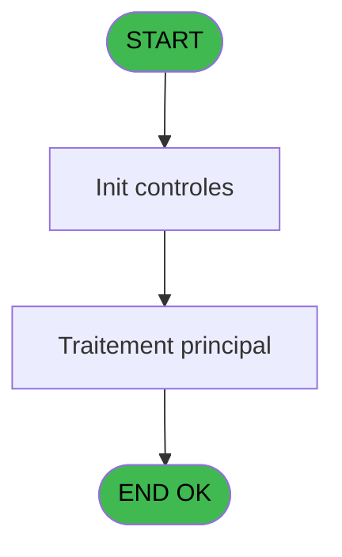
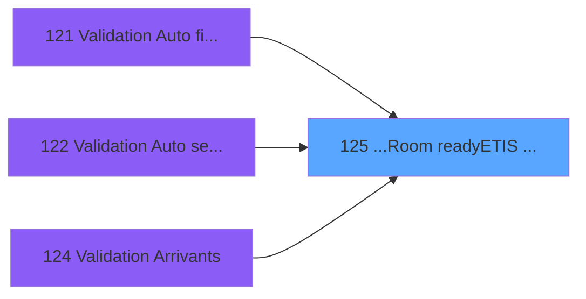
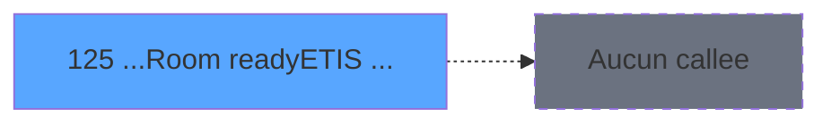

# PBG IDE 125 - ...Room ready/ETIS prio

> **Analyse**: Phases 1-4 2026-02-03 09:34 -> 09:34 (18s) | Assemblage 09:34
> **Pipeline**: V7.2 Enrichi
> **Structure**: 4 onglets (Resume | Ecrans | Donnees | Connexions)

<!-- TAB:Resume -->

## 1. FICHE D'IDENTITE

| Attribut | Valeur |
|----------|--------|
| Projet | PBG |
| IDE Position | 125 |
| Nom Programme | ...Room ready/ETIS prio |
| Fichier source | `Prg_125.xml` |
| Domaine metier | General |
| Taches | 1 (0 ecrans visibles) |
| Tables modifiees | 0 |
| Programmes appeles | 0 |

## 2. DESCRIPTION FONCTIONNELLE

**...Room ready/ETIS prio** assure la gestion complete de ce processus, accessible depuis [Validation Arrivants (IDE 124)](PBG-IDE-124.md), [    Validation Auto filiations (IDE 121)](PBG-IDE-121.md), [    Validation Auto seminaire (IDE 122)](PBG-IDE-122.md).

Le flux de traitement s'organise en **1 blocs fonctionnels** :

- **Traitement** (1 tache) : traitements metier divers

**Logique metier** : 1 regles identifiees couvrant conditions metier.

## 3. BLOCS FONCTIONNELS

### 3.1 Traitement (1 tache)

Traitements internes.

---

#### 125 - ...Room ready/ETIS prio

**Role** : Traitement : ...Room ready/ETIS prio.

## 5. REGLES METIER

1 regles identifiees:

### Autres (1 regles)

#### [RM-001] Si [U] est FAUX, branche alternative

| Element | Detail |
|---------|--------|
| **Condition** | `NOT [U]` |
| **Si vrai** | MlsTrans('Hébergement non trouvé') |
| **Si faux** | IF(NOT [V], StrBuild(MlsTrans('Logement @1@ non trouvé'), [L]), ''), '') |
| **Expression source** | Expression 19 : `if(NOT [U], MlsTrans('Hébergement non trouvé'), IF(NOT [V], ` |
| **Exemple** | Si NOT [U] → MlsTrans('Hébergement non trouvé') |

## 6. CONTEXTE

- **Appele par**: [Validation Arrivants (IDE 124)](PBG-IDE-124.md), [    Validation Auto filiations (IDE 121)](PBG-IDE-121.md), [    Validation Auto seminaire (IDE 122)](PBG-IDE-122.md)
- **Appelle**: 0 programmes | **Tables**: 3 (W:0 R:1 L:2) | **Taches**: 1 | **Expressions**: 23

<!-- TAB:Ecrans -->

## 8. ECRANS

*(Programme sans ecran visible)*

## 9. NAVIGATION

### 9.3 Structure hierarchique (1 tache)

| Position | Tache | Type | Dimensions | Bloc |
|----------|-------|------|------------|------|
| **125.1** | [**...Room ready/ETIS prio** (125)](#t1) | - | - | Traitement |

### 9.4 Algorigramme

> **Legende**: Vert = START/END OK | Rouge = END KO | Bleu = Decisions
> *Algorigramme auto-genere. Utiliser `/algorigramme` pour une synthese metier detaillee.*

<!-- TAB:Donnees -->

## 10. TABLES

### Tables utilisees (3)

| ID | Nom | Description | Type | R | W | L | Usages |
|----|-----|-------------|------|---|---|---|--------|
| 31 | gm-complet_______gmc |  | DB | R |   |   | 1 |
| 34 | hebergement______heb | Hebergement (chambres) | DB |   |   | L | 1 |
| 103 | logement_client__loc |  | DB |   |   | L | 1 |

### Colonnes par table (2 / 1 tables avec colonnes identifiees)

Table 31 - gm-complet_______gmc (R) - 1 usages

| Lettre | Variable | Acces | Type |
|--------|----------|-------|------|
| A | i.Société | R | Unicode |
| B | i.Compte | R | Numeric |
| C | i.Filliiation | R | Numeric |
| D | i.Flag valide O/N | R | Alpha |
| E | v.Hébergement existe ? | R | Logical |
| F | v.Logement client existe ? | R | Logical |

## 11. VARIABLES

### 11.1 Variables de session (2)

Variables persistantes pendant toute la session.

| Lettre | Nom | Type | Usage dans |
|--------|-----|------|-----------|
| E | v.Hébergement existe ? | Logical | 2x session |
| F | v.Logement client existe ? | Logical | - |

### 11.2 Autres (4)

Variables diverses.

| Lettre | Nom | Type | Usage dans |
|--------|-----|------|-----------|
| A | i.Société | Unicode | 2x refs |
| B | i.Compte | Numeric | 2x refs |
| C | i.Filliiation | Numeric | 2x refs |
| D | i.Flag valide O/N | Alpha | - |

## 12. EXPRESSIONS

**23 / 23 expressions decodees (100%)**

### 12.1 Repartition par type

| Type | Expressions | Regles |
|------|-------------|--------|
| CALCULATION | 1 | 0 |
| CONDITION | 6 | 5 |
| CONSTANTE | 3 | 0 |
| DATE | 1 | 0 |
| OTHER | 10 | 0 |
| REFERENCE_VG | 1 | 0 |
| FORMAT | 1 | 0 |

### 12.2 Expressions cles par type

#### CALCULATION (1 expressions)

| Type | IDE | Expression | Regle |
|------|-----|------------|-------|
| CALCULATION | 10 | `Time() - Second (Time())` | - |

#### CONDITION (6 expressions)

| Type | IDE | Expression | Regle |
|------|-----|------------|-------|
| CONDITION | 19 | `if(NOT [U], MlsTrans('Hébergement non trouvé'), IF(NOT [V], StrBuild(MlsTrans('Logement @1@ non trouvé'), [L]), ''), '')` | [RM-001](#rm-RM-001) |
| CONDITION | 8 | `v.Hébergement existe ? [E]='O'` | - |
| CONDITION | 9 | `v.Hébergement existe ? [E]='N'` | - |
| CONDITION | 13 | `[S]<>'00:00:00'TIME AND [R]=Date()` | - |
| CONDITION | 16 | `VG75 AND [AA]<>0 AND [R]='00/00/0000'DATE` | - |
| ... | | *+1 autres* | |

#### CONSTANTE (3 expressions)

| Type | IDE | Expression | Regle |
|------|-----|------------|-------|
| CONSTANTE | 22 | `'ERR'` | - |
| CONSTANTE | 17 | `'ETIS'` | - |
| CONSTANTE | 5 | `'H'` | - |

#### DATE (1 expressions)

| Type | IDE | Expression | Regle |
|------|-----|------------|-------|
| DATE | 4 | `Date()` | - |

#### OTHER (10 expressions)

| Type | IDE | Expression | Regle |
|------|-----|------------|-------|
| OTHER | 14 | `[Y]` | - |
| OTHER | 11 | `'00:00:00'TIME` | - |
| OTHER | 15 | `[AA]` | - |
| OTHER | 21 | `StrBuild('@1@ @2@ : @3@', [AJ], [AI], ExpCalc('19'EXP))` | - |
| OTHER | 18 | `MlsTrans('GM en arrivée')` | - |
| ... | | *+5 autres* | |

#### REFERENCE_VG (1 expressions)

| Type | IDE | Expression | Regle |
|------|-----|------------|-------|
| REFERENCE_VG | 20 | `VG75` | - |

#### FORMAT (1 expressions)

| Type | IDE | Expression | Regle |
|------|-----|------------|-------|
| FORMAT | 23 | `StrBuild('@1@~@2@~@3@', i.Société [A], Str(i.Compte [B], '10'), Str(i.Filliiation [C], '5'))` | - |

### 12.3 Toutes les expressions (23)

Voir les 23 expressions

#### CALCULATION (1)

| IDE | Expression Decodee |
|-----|-------------------|
| 10 | `Time() - Second (Time())` |

#### CONDITION (6)

| IDE | Expression Decodee |
|-----|-------------------|
| 16 | `VG75 AND [AA]<>0 AND [R]='00/00/0000'DATE` |
| 19 | `if(NOT [U], MlsTrans('Hébergement non trouvé'), IF(NOT [V], StrBuild(MlsTrans('Logement @1@ non trouvé'), [L]), ''), '')` |
| 12 | `[S]='00:00:00'TIME AND [R]=Date()` |
| 13 | `[S]<>'00:00:00'TIME AND [R]=Date()` |
| 8 | `v.Hébergement existe ? [E]='O'` |
| 9 | `v.Hébergement existe ? [E]='N'` |

#### CONSTANTE (3)

| IDE | Expression Decodee |
|-----|-------------------|
| 5 | `'H'` |
| 17 | `'ETIS'` |
| 22 | `'ERR'` |

#### DATE (1)

| IDE | Expression Decodee |
|-----|-------------------|
| 4 | `Date()` |

#### OTHER (10)

| IDE | Expression Decodee |
|-----|-------------------|
| 1 | `i.Société [A]` |
| 2 | `i.Compte [B]` |
| 3 | `i.Filliiation [C]` |
| 6 | `[L]` |
| 7 | `[U] AND [V]` |
| 11 | `'00:00:00'TIME` |
| 14 | `[Y]` |
| 15 | `[AA]` |
| 18 | `MlsTrans('GM en arrivée')` |
| 21 | `StrBuild('@1@ @2@ : @3@', [AJ], [AI], ExpCalc('19'EXP))` |

#### REFERENCE_VG (1)

| IDE | Expression Decodee |
|-----|-------------------|
| 20 | `VG75` |

#### FORMAT (1)

| IDE | Expression Decodee |
|-----|-------------------|
| 23 | `StrBuild('@1@~@2@~@3@', i.Société [A], Str(i.Compte [B], '10'), Str(i.Filliiation [C], '5'))` |

<!-- TAB:Connexions -->

## 13. GRAPHE D'APPELS

### 13.1 Chaine depuis Main (Callers)

Main -> ... -> [Validation Arrivants (IDE 124)](PBG-IDE-124.md) -> **...Room ready/ETIS prio (IDE 125)**

Main -> ... -> [    Validation Auto filiations (IDE 121)](PBG-IDE-121.md) -> **...Room ready/ETIS prio (IDE 125)**

Main -> ... -> [    Validation Auto seminaire (IDE 122)](PBG-IDE-122.md) -> **...Room ready/ETIS prio (IDE 125)**

### 13.2 Callers

| IDE | Nom Programme | Nb Appels |
|-----|---------------|-----------|
| [124](PBG-IDE-124.md) | Validation Arrivants | 4 |
| [121](PBG-IDE-121.md) |     Validation Auto filiations | 1 |
| [122](PBG-IDE-122.md) |     Validation Auto seminaire | 1 |

### 13.3 Callees (programmes appeles)

### 13.4 Detail Callees avec contexte

| IDE | Nom Programme | Appels | Contexte |
|-----|---------------|--------|----------|
| - | (aucun) | - | - |

## 14. RECOMMANDATIONS MIGRATION

### 14.1 Profil du programme

| Metrique | Valeur | Impact migration |
|----------|--------|-----------------|
| Lignes de logique | 68 | Programme compact |
| Expressions | 23 | Peu de logique |
| Tables WRITE | 0 | Impact faible |
| Sous-programmes | 0 | Peu de dependances |
| Ecrans visibles | 0 | Ecran unique ou traitement batch |
| Code desactive | 0% (0 / 68) | Code sain |
| Regles metier | 1 | Quelques regles a preserver |

### 14.2 Plan de migration par bloc

#### Traitement (1 tache: 0 ecran, 1 traitement)

- **Strategie** : 1 service(s) backend injectable(s) (Domain Services).
- Decomposer les taches en services unitaires testables.

### 14.3 Dependances critiques

| Dependance | Type | Appels | Impact |
|------------|------|--------|--------|

---
*Spec DETAILED generee par Pipeline V7.2 - 2026-02-03 09:34*
