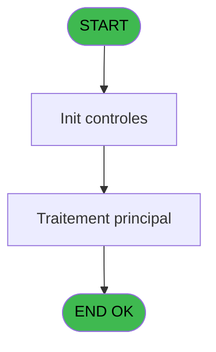

# PBG IDE 126 - Affectation Crédit Bar

> **Analyse**: Phases 1-4 2026-02-03 09:34 -> 09:34 (18s) | Assemblage 09:34
> **Pipeline**: V7.2 Enrichi
> **Structure**: 4 onglets (Resume | Ecrans | Donnees | Connexions)

<!-- TAB:Resume -->

## 1. FICHE D'IDENTITE

| Attribut | Valeur |
|----------|--------|
| Projet | PBG |
| IDE Position | 126 |
| Nom Programme | Affectation Crédit Bar |
| Fichier source | `Prg_126.xml` |
| Domaine metier | General |
| Taches | 1 (0 ecrans visibles) |
| Tables modifiees | 0 |
| Programmes appeles | 0 |

## 2. DESCRIPTION FONCTIONNELLE

**Affectation Crédit Bar** assure la gestion complete de ce processus, accessible depuis [Validation Arrivants (IDE 124)](PBG-IDE-124.md).

Le flux de traitement s'organise en **1 blocs fonctionnels** :

- **Traitement** (1 tache) : traitements metier divers

**Logique metier** : 1 regles identifiees couvrant conditions metier.

## 3. BLOCS FONCTIONNELS

### 3.1 Traitement (1 tache)

Traitements internes.

---

#### 126 - Credit Bar [[ECRAN]](#ecran-t2)

**Role** : Calcul fidelite/avantage : Credit Bar.
**Ecran** : 898 x 105 DLU (Modal) | [Voir mockup](#ecran-t2)

## 5. REGLES METIER

1 regles identifiees:

### Autres (1 regles)

#### [RM-001] Si v Date de fin [F]<Date() alors Date() sinon v Date de fin [F])

| Element | Detail |
|---------|--------|
| **Condition** | `v Date de fin [F]<Date()` |
| **Si vrai** | Date() |
| **Si faux** | v Date de fin [F]) |
| **Variables** | F (v Date de fin) |
| **Expression source** | Expression 11 : `IF(v Date de fin [F]<Date(),Date(),v Date de fin [F])` |
| **Exemple** | Si v Date de fin [F]<Date() → Date(). Sinon → v Date de fin [F]) |

## 6. CONTEXTE

- **Appele par**: [Validation Arrivants (IDE 124)](PBG-IDE-124.md)
- **Appelle**: 0 programmes | **Tables**: 2 (W:0 R:1 L:1) | **Taches**: 1 | **Expressions**: 14

<!-- TAB:Ecrans -->

## 8. ECRANS

*(Programme sans ecran visible)*

## 9. NAVIGATION

### 9.3 Structure hierarchique (1 tache)

| Position | Tache | Type | Dimensions | Bloc |
|----------|-------|------|------------|------|
| **126.1** | [**Credit Bar** (126)](#t2) [mockup](#ecran-t2) | Modal | 898x105 | Traitement |

### 9.4 Algorigramme

> **Legende**: Vert = START/END OK | Rouge = END KO | Bleu = Decisions
> *Algorigramme auto-genere. Utiliser `/algorigramme` pour une synthese metier detaillee.*

<!-- TAB:Donnees -->

## 10. TABLES

### Tables utilisees (2)

| ID | Nom | Description | Type | R | W | L | Usages |
|----|-----|-------------|------|---|---|---|--------|
| 34 | hebergement______heb | Hebergement (chambres) | DB | R |   |   | 1 |
| 847 | stat_lieu_vente_date | Statistiques point de vente | TMP |   |   | L | 1 |

### Colonnes par table (2 / 1 tables avec colonnes identifiees)

Table 34 - hebergement______heb (R) - 1 usages

| Lettre | Variable | Acces | Type |
|--------|----------|-------|------|
| A | P.Societe | R | Alpha |
| B | P.Num_compte | R | Numeric |
| C | P.Filiation | R | Numeric |
| D | v Retout Crédit Bar / Q | R | Logical |
| E | v Date de début | R | Date |
| F | v Date de fin | R | Date |
| G | v Nbre de Jour | R | Numeric |
| H | v Time (N.U) | R | Time |
| I | v Montant Calculé | R | Numeric |

## 11. VARIABLES

### 11.1 Parametres entrants (3)

Variables recues du programme appelant ([Validation Arrivants (IDE 124)](PBG-IDE-124.md)).

| Lettre | Nom | Type | Usage dans |
|--------|-----|------|-----------|
| A | P.Societe | Alpha | - |
| B | P.Num_compte | Numeric | - |
| C | P.Filiation | Numeric | - |

### 11.2 Variables de session (6)

Variables persistantes pendant toute la session.

| Lettre | Nom | Type | Usage dans |
|--------|-----|------|-----------|
| D | v Retout Crédit Bar / Q | Logical | - |
| E | v Date de début | Date | - |
| F | v Date de fin | Date | 1x session |
| G | v Nbre de Jour | Numeric | - |
| H | v Time (N.U) | Time | 1x session |
| I | v Montant Calculé | Numeric | - |

## 12. EXPRESSIONS

**14 / 14 expressions decodees (100%)**

### 12.1 Repartition par type

| Type | Expressions | Regles |
|------|-------------|--------|
| CALCULATION | 2 | 0 |
| CONDITION | 3 | 5 |
| CONSTANTE | 2 | 0 |
| OTHER | 7 | 0 |

### 12.2 Expressions cles par type

#### CALCULATION (2 expressions)

| Type | IDE | Expression | Regle |
|------|-----|------------|-------|
| CALCULATION | 9 | `[AY]+[AV]*[AU]` | - |
| CALCULATION | 8 | `[AV]+1` | - |

#### CONDITION (3 expressions)

| Type | IDE | Expression | Regle |
|------|-----|------------|-------|
| CONDITION | 11 | `IF(v Date de fin [F]<Date(),Date(),v Date de fin [F])` | [RM-001](#rm-RM-001) |
| CONDITION | 14 | `Counter(0)=1` | - |
| CONDITION | 1 | `[M]<>''` | - |

#### CONSTANTE (2 expressions)

| Type | IDE | Expression | Regle |
|------|-----|------------|-------|
| CONSTANTE | 13 | `'C'` | - |
| CONSTANTE | 5 | `'Q'` | - |

#### OTHER (7 expressions)

| Type | IDE | Expression | Regle |
|------|-----|------------|-------|
| OTHER | 7 | `DifDateTime ([AZ],Time(),[BB],Time(),'[AV]'VAR,'[AW]'VAR)` | - |
| OTHER | 10 | `v Time (N.U) [H]` | - |
| OTHER | 12 | `[BC]` | - |
| OTHER | 6 | `[M]` | - |
| OTHER | 2 | `[BE]` | - |
| ... | | *+2 autres* | |

<!-- TAB:Connexions -->

## 13. GRAPHE D'APPELS

### 13.1 Chaine depuis Main (Callers)

Main -> ... -> [Validation Arrivants (IDE 124)](PBG-IDE-124.md) -> **Affectation Crédit Bar (IDE 126)**

### 13.2 Callers

| IDE | Nom Programme | Nb Appels |
|-----|---------------|-----------|
| [124](PBG-IDE-124.md) | Validation Arrivants | 3 |

### 13.3 Callees (programmes appeles)

### 13.4 Detail Callees avec contexte

| IDE | Nom Programme | Appels | Contexte |
|-----|---------------|--------|----------|
| - | (aucun) | - | - |

## 14. RECOMMANDATIONS MIGRATION

### 14.1 Profil du programme

| Metrique | Valeur | Impact migration |
|----------|--------|-----------------|
| Lignes de logique | 40 | Programme compact |
| Expressions | 14 | Peu de logique |
| Tables WRITE | 0 | Impact faible |
| Sous-programmes | 0 | Peu de dependances |
| Ecrans visibles | 0 | Ecran unique ou traitement batch |
| Code desactive | 0% (0 / 40) | Code sain |
| Regles metier | 1 | Quelques regles a preserver |

### 14.2 Plan de migration par bloc

#### Traitement (1 tache: 1 ecran, 0 traitement)

- **Strategie** : 1 composant(s) UI (Razor/React) avec formulaires et validation.
- Decomposer les taches en services unitaires testables.

### 14.3 Dependances critiques

| Dependance | Type | Appels | Impact |
|------------|------|--------|--------|

---
*Spec DETAILED generee par Pipeline V7.2 - 2026-02-03 09:34*
