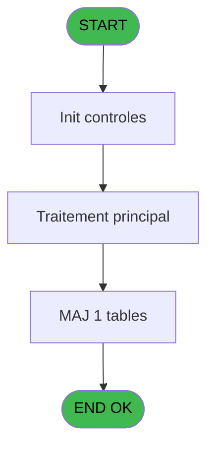
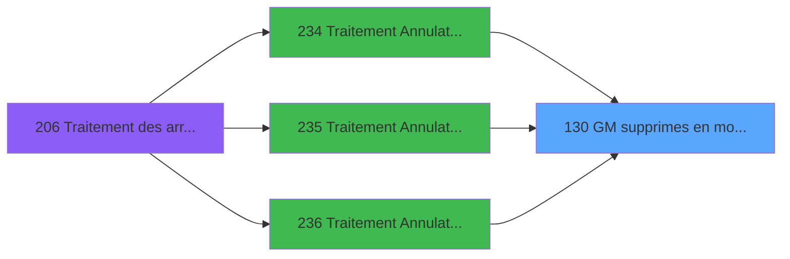

# PBG IDE 130 - GM supprimes en modif 1

> **Analyse**: Phases 1-4 2026-02-03 09:36 -> 09:36 (18s) | Assemblage 09:36
> **Pipeline**: V7.2 Enrichi
> **Structure**: 4 onglets (Resume | Ecrans | Donnees | Connexions)

<!-- TAB:Resume -->

## 1. FICHE D'IDENTITE

| Attribut | Valeur |
|----------|--------|
| Projet | PBG |
| IDE Position | 130 |
| Nom Programme | GM supprimes en modif 1 |
| Fichier source | `Prg_130.xml` |
| Domaine metier | General |
| Taches | 1 (0 ecrans visibles) |
| Tables modifiees | 1 |
| Programmes appeles | 0 |

## 2. DESCRIPTION FONCTIONNELLE

**GM supprimes en modif 1** assure la gestion complete de ce processus, accessible depuis [Traitement Annulation sur modi (IDE 234)](PBG-IDE-234.md), [Traitement Annulation/pms-682 (IDE 235)](PBG-IDE-235.md), [Traitement Annulation/pms-912 (IDE 236)](PBG-IDE-236.md).

Le flux de traitement s'organise en **1 blocs fonctionnels** :

- **Traitement** (1 tache) : traitements metier divers

**Donnees modifiees** : 1 tables en ecriture (pms_printer_dispo).

## 3. BLOCS FONCTIONNELS

### 3.1 Traitement (1 tache)

Traitements internes.

---

#### 130 - GM supprimes en modif 1

**Role** : Traitement : GM supprimes en modif 1.

## 5. REGLES METIER

*(Aucune regle metier identifiee)*

## 6. CONTEXTE

- **Appele par**: [Traitement Annulation sur modi (IDE 234)](PBG-IDE-234.md), [Traitement Annulation/pms-682 (IDE 235)](PBG-IDE-235.md), [Traitement Annulation/pms-912 (IDE 236)](PBG-IDE-236.md)
- **Appelle**: 0 programmes | **Tables**: 1 (W:1 R:0 L:0) | **Taches**: 1 | **Expressions**: 9

<!-- TAB:Ecrans -->

## 8. ECRANS

*(Programme sans ecran visible)*

## 9. NAVIGATION

### 9.3 Structure hierarchique (1 tache)

| Position | Tache | Type | Dimensions | Bloc |
|----------|-------|------|------------|------|
| **130.1** | [**GM supprimes en modif 1** (130)](#t1) | MDI | - | Traitement |

### 9.4 Algorigramme

> **Legende**: Vert = START/END OK | Rouge = END KO | Bleu = Decisions
> *Algorigramme auto-genere. Utiliser `/algorigramme` pour une synthese metier detaillee.*

<!-- TAB:Donnees -->

## 10. TABLES

### Tables utilisees (1)

| ID | Nom | Description | Type | R | W | L | Usages |
|----|-----|-------------|------|---|---|---|--------|
| 567 | pms_printer_dispo |  | TMP |   | **W** |   | 1 |

### Colonnes par table (1 / 1 tables avec colonnes identifiees)

Table 567 - pms_printer_dispo (**W**) - 1 usages

| Lettre | Variable | Acces | Type |
|--------|----------|-------|------|
| A | PARAM Societe | W | Alpha |
| B | PARAM Type | W | Alpha |
| C | PARAM Adherent | W | Numeric |
| D | PARAM Filiation club | W | Numeric |
| E | PARAM compte | W | Numeric |
| F | PARAM filiation | W | Numeric |
| G | PARAM nom | W | Alpha |
| H | PARAM prenom | W | Alpha |
| I | PARAM Date forfait ski | W | Date |

## 11. VARIABLES

### 11.1 Autres (9)

Variables diverses.

| Lettre | Nom | Type | Usage dans |
|--------|-----|------|-----------|
| A | PARAM Societe | Alpha | 1x refs |
| B | PARAM Type | Alpha | 1x refs |
| C | PARAM Adherent | Numeric | 1x refs |
| D | PARAM Filiation club | Numeric | 1x refs |
| E | PARAM compte | Numeric | 1x refs |
| F | PARAM filiation | Numeric | 2x refs |
| G | PARAM nom | Alpha | 1x refs |
| H | PARAM prenom | Alpha | 1x refs |
| I | PARAM Date forfait ski | Date | - |

## 12. EXPRESSIONS

**9 / 9 expressions decodees (100%)**

### 12.1 Repartition par type

| Type | Expressions | Regles |
|------|-------------|--------|
| OTHER | 9 | 0 |

### 12.2 Expressions cles par type

#### OTHER (9 expressions)

| Type | IDE | Expression | Regle |
|------|-----|------------|-------|
| OTHER | 7 | `PARAM nom [G]` | - |
| OTHER | 6 | `PARAM filiation [F]` | - |
| OTHER | 9 | `[AJ]` | - |
| OTHER | 8 | `PARAM prenom [H]` | - |
| OTHER | 5 | `PARAM compte [E]` | - |
| ... | | *+4 autres* | |

<!-- TAB:Connexions -->

## 13. GRAPHE D'APPELS

### 13.1 Chaine depuis Main (Callers)

Main -> ... -> [Traitement Annulation sur modi (IDE 234)](PBG-IDE-234.md) -> **GM supprimes en modif 1 (IDE 130)**

Main -> ... -> [Traitement Annulation/pms-682 (IDE 235)](PBG-IDE-235.md) -> **GM supprimes en modif 1 (IDE 130)**

Main -> ... -> [Traitement Annulation/pms-912 (IDE 236)](PBG-IDE-236.md) -> **GM supprimes en modif 1 (IDE 130)**

### 13.2 Callers

| IDE | Nom Programme | Nb Appels |
|-----|---------------|-----------|
| [234](PBG-IDE-234.md) | Traitement Annulation sur modi | 1 |
| [235](PBG-IDE-235.md) | Traitement Annulation/pms-682 | 1 |
| [236](PBG-IDE-236.md) | Traitement Annulation/pms-912 | 1 |

### 13.3 Callees (programmes appeles)

### 13.4 Detail Callees avec contexte

| IDE | Nom Programme | Appels | Contexte |
|-----|---------------|--------|----------|
| - | (aucun) | - | - |

## 14. RECOMMANDATIONS MIGRATION

### 14.1 Profil du programme

| Metrique | Valeur | Impact migration |
|----------|--------|-----------------|
| Lignes de logique | 23 | Programme compact |
| Expressions | 9 | Peu de logique |
| Tables WRITE | 1 | Impact faible |
| Sous-programmes | 0 | Peu de dependances |
| Ecrans visibles | 0 | Ecran unique ou traitement batch |
| Code desactive | 0% (0 / 23) | Code sain |
| Regles metier | 0 | Pas de regle identifiee |

### 14.2 Plan de migration par bloc

#### Traitement (1 tache: 0 ecran, 1 traitement)

- **Strategie** : 1 service(s) backend injectable(s) (Domain Services).
- Decomposer les taches en services unitaires testables.

### 14.3 Dependances critiques

| Dependance | Type | Appels | Impact |
|------------|------|--------|--------|
| pms_printer_dispo | Table WRITE (Temp) | 1x | Schema + repository |

---
*Spec DETAILED generee par Pipeline V7.2 - 2026-02-03 09:36*
