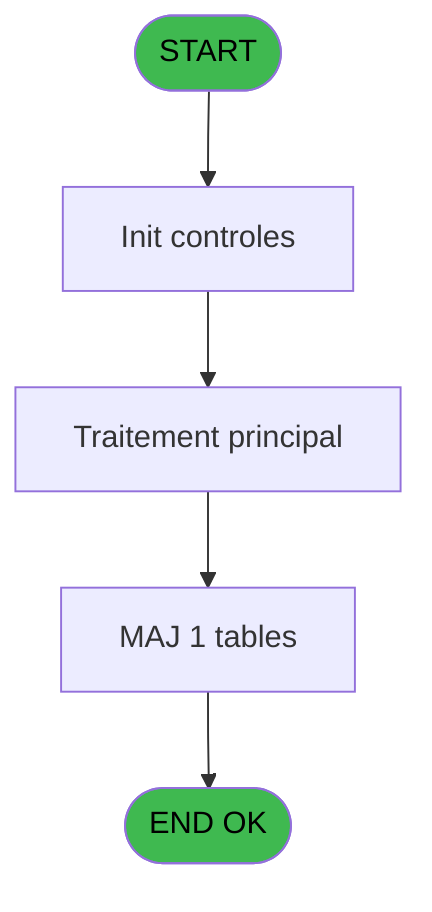
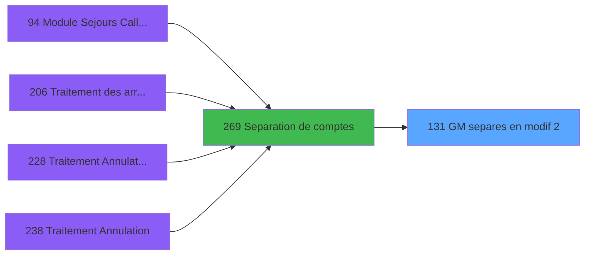

# PBG IDE 131 - GM separes en modif 2

> **Analyse**: Phases 1-4 2026-02-03 09:36 -> 09:37 (17s) | Assemblage 09:37
> **Pipeline**: V7.2 Enrichi
> **Structure**: 4 onglets (Resume | Ecrans | Donnees | Connexions)

<!-- TAB:Resume -->

## 1. FICHE D'IDENTITE

| Attribut | Valeur |
|----------|--------|
| Projet | PBG |
| IDE Position | 131 |
| Nom Programme | GM separes en modif 2 |
| Fichier source | `Prg_131.xml` |
| Domaine metier | General |
| Taches | 1 (0 ecrans visibles) |
| Tables modifiees | 1 |
| Programmes appeles | 0 |

## 2. DESCRIPTION FONCTIONNELLE

**GM separes en modif 2** assure la gestion complete de ce processus, accessible depuis [Separation de comptes (IDE 269)](PBG-IDE-269.md).

Le flux de traitement s'organise en **1 blocs fonctionnels** :

- **Traitement** (1 tache) : traitements metier divers

**Donnees modifiees** : 1 tables en ecriture (pms_printer_choice).

## 3. BLOCS FONCTIONNELS

### 3.1 Traitement (1 tache)

Traitements internes.

---

#### 131 - GM separes en modif 2

**Role** : Traitement : GM separes en modif 2.

## 5. REGLES METIER

*(Aucune regle metier identifiee)*

## 6. CONTEXTE

- **Appele par**: [Separation de comptes (IDE 269)](PBG-IDE-269.md)
- **Appelle**: 0 programmes | **Tables**: 1 (W:1 R:0 L:0) | **Taches**: 1 | **Expressions**: 9

<!-- TAB:Ecrans -->

## 8. ECRANS

*(Programme sans ecran visible)*

## 9. NAVIGATION

### 9.3 Structure hierarchique (1 tache)

| Position | Tache | Type | Dimensions | Bloc |
|----------|-------|------|------------|------|
| **131.1** | [**GM separes en modif 2** (131)](#t1) | MDI | - | Traitement |

### 9.4 Algorigramme

> **Legende**: Vert = START/END OK | Rouge = END KO | Bleu = Decisions
> *Algorigramme auto-genere. Utiliser `/algorigramme` pour une synthese metier detaillee.*

<!-- TAB:Donnees -->

## 10. TABLES

### Tables utilisees (1)

| ID | Nom | Description | Type | R | W | L | Usages |
|----|-----|-------------|------|---|---|---|--------|
| 566 | pms_printer_choice |  | TMP |   | **W** |   | 1 |

### Colonnes par table (1 / 1 tables avec colonnes identifiees)

Table 566 - pms_printer_choice (**W**) - 1 usages

| Lettre | Variable | Acces | Type |
|--------|----------|-------|------|
| A | PARAM Societe | W | Alpha |
| B | PARAM Type | W | Alpha |
| C | PARAM Adherent | W | Numeric |
| D | PARAM Filiation club | W | Numeric |
| E | PARAM compte old | W | Numeric |
| F | PARAM filiation old | W | Numeric |
| G | PARAM compte new | W | Numeric |
| H | PARAM filiation new | W | Numeric |

## 11. VARIABLES

### 11.1 Autres (8)

Variables diverses.

| Lettre | Nom | Type | Usage dans |
|--------|-----|------|-----------|
| A | PARAM Societe | Alpha | 1x refs |
| B | PARAM Type | Alpha | 1x refs |
| C | PARAM Adherent | Numeric | 1x refs |
| D | PARAM Filiation club | Numeric | 1x refs |
| E | PARAM compte old | Numeric | 1x refs |
| F | PARAM filiation old | Numeric | 1x refs |
| G | PARAM compte new | Numeric | 1x refs |
| H | PARAM filiation new | Numeric | 1x refs |

## 12. EXPRESSIONS

**9 / 9 expressions decodees (100%)**

### 12.1 Repartition par type

| Type | Expressions | Regles |
|------|-------------|--------|
| OTHER | 8 | 0 |
| CAST_LOGIQUE | 1 | 0 |

### 12.2 Expressions cles par type

#### OTHER (8 expressions)

| Type | IDE | Expression | Regle |
|------|-----|------------|-------|
| OTHER | 6 | `PARAM filiation old [F]` | - |
| OTHER | 5 | `PARAM compte old [E]` | - |
| OTHER | 8 | `PARAM filiation new [H]` | - |
| OTHER | 7 | `PARAM compte new [G]` | - |
| OTHER | 2 | `PARAM Type [B]` | - |
| ... | | *+3 autres* | |

#### CAST_LOGIQUE (1 expressions)

| Type | IDE | Expression | Regle |
|------|-----|------------|-------|
| CAST_LOGIQUE | 9 | `'TRUE'LOG` | - |

<!-- TAB:Connexions -->

## 13. GRAPHE D'APPELS

### 13.1 Chaine depuis Main (Callers)

Main -> ... -> [Separation de comptes (IDE 269)](PBG-IDE-269.md) -> **GM separes en modif 2 (IDE 131)**

### 13.2 Callers

| IDE | Nom Programme | Nb Appels |
|-----|---------------|-----------|
| [269](PBG-IDE-269.md) | Separation de comptes | 1 |

### 13.3 Callees (programmes appeles)

### 13.4 Detail Callees avec contexte

| IDE | Nom Programme | Appels | Contexte |
|-----|---------------|--------|----------|
| - | (aucun) | - | - |

## 14. RECOMMANDATIONS MIGRATION

### 14.1 Profil du programme

| Metrique | Valeur | Impact migration |
|----------|--------|-----------------|
| Lignes de logique | 27 | Programme compact |
| Expressions | 9 | Peu de logique |
| Tables WRITE | 1 | Impact faible |
| Sous-programmes | 0 | Peu de dependances |
| Ecrans visibles | 0 | Ecran unique ou traitement batch |
| Code desactive | 0% (0 / 27) | Code sain |
| Regles metier | 0 | Pas de regle identifiee |

### 14.2 Plan de migration par bloc

#### Traitement (1 tache: 0 ecran, 1 traitement)

- **Strategie** : 1 service(s) backend injectable(s) (Domain Services).
- Decomposer les taches en services unitaires testables.

### 14.3 Dependances critiques

| Dependance | Type | Appels | Impact |
|------------|------|--------|--------|
| pms_printer_choice | Table WRITE (Temp) | 1x | Schema + repository |

---
*Spec DETAILED generee par Pipeline V7.2 - 2026-02-03 09:37*
