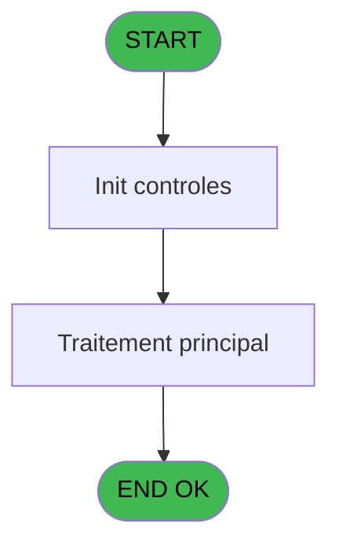

# PBG IDE 132 - Edition des GM Deloges

> **Analyse**: Phases 1-4 2026-02-03 09:37 -> 09:37 (18s) | Assemblage 09:37
> **Pipeline**: V7.2 Enrichi
> **Structure**: 4 onglets (Resume | Ecrans | Donnees | Connexions)

<!-- TAB:Resume -->

## 1. FICHE D'IDENTITE

| Attribut | Valeur |
|----------|--------|
| Projet | PBG |
| IDE Position | 132 |
| Nom Programme | Edition des GM Deloges |
| Fichier source | `Prg_132.xml` |
| Domaine metier | Impression |
| Taches | 1 (0 ecrans visibles) |
| Tables modifiees | 0 |
| Programmes appeles | 0 |

## 2. DESCRIPTION FONCTIONNELLE

**Edition des GM Deloges** assure la gestion complete de ce processus, accessible depuis [Affichage des GM Deloges (IDE 133)](PBG-IDE-133.md).

Le flux de traitement s'organise en **1 blocs fonctionnels** :

- **Impression** (1 tache) : generation de tickets et documents

**Logique metier** : 1 regles identifiees couvrant conditions metier.

## 3. BLOCS FONCTIONNELS

### 3.1 Impression (1 tache)

Generation des documents et tickets.

---

#### 132 - Edition des GM Deloges

**Role** : Generation du document : Edition des GM Deloges.

## 5. REGLES METIER

1 regles identifiees:

### Autres (1 regles)

#### [RM-001] Si [AK] AND NOT ([AL]) alors 'Annule' sinon '')

| Element | Detail |
|---------|--------|
| **Condition** | `[AK] AND NOT ([AL])` |
| **Si vrai** | 'Annule' |
| **Si faux** | '') |
| **Expression source** | Expression 6 : `IF ([AK] AND NOT ([AL]),'Annule','')` |
| **Exemple** | Si [AK] AND NOT ([AL]) → 'Annule'. Sinon → '') |

## 6. CONTEXTE

- **Appele par**: [Affichage des GM Deloges (IDE 133)](PBG-IDE-133.md)
- **Appelle**: 0 programmes | **Tables**: 4 (W:0 R:1 L:3) | **Taches**: 1 | **Expressions**: 15

<!-- TAB:Ecrans -->

## 8. ECRANS

*(Programme sans ecran visible)*

## 9. NAVIGATION

### 9.3 Structure hierarchique (1 tache)

| Position | Tache | Type | Dimensions | Bloc |
|----------|-------|------|------------|------|
| **132.1** | [**Edition des GM Deloges** (132)](#t1) | MDI | - | Impression |

### 9.4 Algorigramme

> **Legende**: Vert = START/END OK | Rouge = END KO | Bleu = Decisions
> *Algorigramme auto-genere. Utiliser `/algorigramme` pour une synthese metier detaillee.*

<!-- TAB:Donnees -->

## 10. TABLES

### Tables utilisees (4)

| ID | Nom | Description | Type | R | W | L | Usages |
|----|-----|-------------|------|---|---|---|--------|
| 31 | gm-complet_______gmc |  | DB | R |   |   | 1 |
| 34 | hebergement______heb | Hebergement (chambres) | DB |   |   | L | 1 |
| 564 | pms_check_out |  | TMP |   |   | L | 1 |
| 565 | pms_listing_choice |  | TMP |   |   | L | 1 |

### Colonnes par table (1 / 1 tables avec colonnes identifiees)

Table 31 - gm-complet_______gmc (R) - 1 usages

| Lettre | Variable | Acces | Type |
|--------|----------|-------|------|
| A | Param Societe | R | Alpha |
| B | Param Nom Village | R | Alpha |

## 11. VARIABLES

### 11.1 Autres (2)

Variables diverses.

| Lettre | Nom | Type | Usage dans |
|--------|-----|------|-----------|
| A | Param Societe | Alpha | - |
| B | Param Nom Village | Alpha | - |

## 12. EXPRESSIONS

**15 / 15 expressions decodees (100%)**

### 12.1 Repartition par type

| Type | Expressions | Regles |
|------|-------------|--------|
| CONDITION | 3 | 5 |
| CONSTANTE | 2 | 0 |
| DATE | 1 | 0 |
| OTHER | 9 | 0 |

### 12.2 Expressions cles par type

#### CONDITION (3 expressions)

| Type | IDE | Expression | Regle |
|------|-----|------------|-------|
| CONDITION | 6 | `IF ([AK] AND NOT ([AL]),'Annule','')` | [RM-001](#rm-RM-001) |
| CONDITION | 5 | `[AK] AND [AL] AND [J]<>''` | - |
| CONDITION | 1 | `INIGet ('[MAGIC_LOGICAL_NAMES]preview')='O'` | - |

#### CONSTANTE (2 expressions)

| Type | IDE | Expression | Regle |
|------|-----|------------|-------|
| CONSTANTE | 15 | `'H'` | - |
| CONSTANTE | 7 | `'2'` | - |

#### DATE (1 expressions)

| Type | IDE | Expression | Regle |
|------|-----|------------|-------|
| DATE | 4 | `Date ()` | - |

#### OTHER (9 expressions)

| Type | IDE | Expression | Regle |
|------|-----|------------|-------|
| OTHER | 12 | `[P]` | - |
| OTHER | 11 | `[F]` | - |
| OTHER | 14 | `[G]` | - |
| OTHER | 13 | `[Q]` | - |
| OTHER | 10 | `[E]` | - |
| ... | | *+4 autres* | |

<!-- TAB:Connexions -->

## 13. GRAPHE D'APPELS

### 13.1 Chaine depuis Main (Callers)

Main -> ... -> [Affichage des GM Deloges (IDE 133)](PBG-IDE-133.md) -> **Edition des GM Deloges (IDE 132)**

### 13.2 Callers

| IDE | Nom Programme | Nb Appels |
|-----|---------------|-----------|
| [133](PBG-IDE-133.md) | Affichage des GM Deloges | 1 |

### 13.3 Callees (programmes appeles)

### 13.4 Detail Callees avec contexte

| IDE | Nom Programme | Appels | Contexte |
|-----|---------------|--------|----------|
| - | (aucun) | - | - |

## 14. RECOMMANDATIONS MIGRATION

### 14.1 Profil du programme

| Metrique | Valeur | Impact migration |
|----------|--------|-----------------|
| Lignes de logique | 55 | Programme compact |
| Expressions | 15 | Peu de logique |
| Tables WRITE | 0 | Impact faible |
| Sous-programmes | 0 | Peu de dependances |
| Ecrans visibles | 0 | Ecran unique ou traitement batch |
| Code desactive | 0% (0 / 55) | Code sain |
| Regles metier | 1 | Quelques regles a preserver |

### 14.2 Plan de migration par bloc

#### Impression (1 tache: 0 ecran, 1 traitement)

- **Strategie** : Templates HTML -> PDF via wkhtmltopdf ou Puppeteer.
- `PrintService` injectable avec choix imprimante

### 14.3 Dependances critiques

| Dependance | Type | Appels | Impact |
|------------|------|--------|--------|

---
*Spec DETAILED generee par Pipeline V7.2 - 2026-02-03 09:37*
