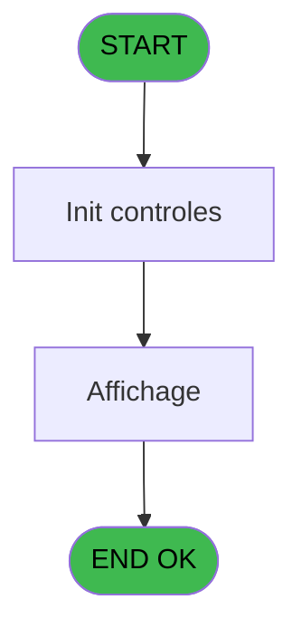
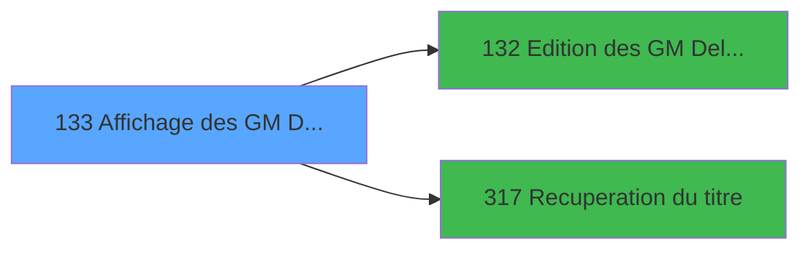

# PBG IDE 133 - Affichage des GM Deloges

> **Analyse**: Phases 1-4 2026-02-03 09:37 -> 09:37 (18s) | Assemblage 09:37
> **Pipeline**: V7.2 Enrichi
> **Structure**: 4 onglets (Resume | Ecrans | Donnees | Connexions)

<!-- TAB:Resume -->

## 1. FICHE D'IDENTITE

| Attribut | Valeur |
|----------|--------|
| Projet | PBG |
| IDE Position | 133 |
| Nom Programme | Affichage des GM Deloges |
| Fichier source | `Prg_133.xml` |
| Domaine metier | General |
| Taches | 3 (1 ecrans visibles) |
| Tables modifiees | 0 |
| Programmes appeles | 2 |
| :warning: Statut | **ORPHELIN_POTENTIEL** |

## 2. DESCRIPTION FONCTIONNELLE

**Affichage des GM Deloges** assure la gestion complete de ce processus.

Le flux de traitement s'organise en **3 blocs fonctionnels** :

- **Consultation** (1 tache) : ecrans de recherche, selection et consultation
- **Validation** (1 tache) : controles et verifications de coherence
- **Traitement** (1 tache) : traitements metier divers

Detail : phases du traitement

#### Phase 1 : Traitement (1 tache)

- **133** - Avertissement Import **[[ECRAN]](#ecran-t1)**

Delegue a : [Recuperation du titre (IDE 317)](PBG-IDE-317.md)

#### Phase 2 : Validation (1 tache)

- **133.1** - Verification Affichage

#### Phase 3 : Consultation (1 tache)

- **133.2** - Affichage Avertissement **[[ECRAN]](#ecran-t3)**

Delegue a : [Recuperation du titre (IDE 317)](PBG-IDE-317.md)

## 3. BLOCS FONCTIONNELS

### 3.1 Traitement (1 tache)

Traitements internes.

---

#### 133 - Avertissement Import [[ECRAN]](#ecran-t1)

**Role** : Traitement : Avertissement Import.
**Ecran** : 190 x 11 DLU (MDI) | [Voir mockup](#ecran-t1)
**Delegue a** : [Recuperation du titre (IDE 317)](PBG-IDE-317.md)

### 3.2 Validation (1 tache)

Controles de coherence : 1 tache verifie les donnees et conditions.

---

#### 133.1 - Verification Affichage

**Role** : Verification : Verification Affichage.

### 3.3 Consultation (1 tache)

Ecrans de recherche et consultation.

---

#### 133.2 - Affichage Avertissement [[ECRAN]](#ecran-t3)

**Role** : Reinitialisation : Affichage Avertissement.
**Ecran** : 1086 x 251 DLU (MDI) | [Voir mockup](#ecran-t3)

## 5. REGLES METIER

*(Aucune regle metier identifiee)*

## 6. CONTEXTE

- **Appele par**: (aucun)
- **Appelle**: 2 programmes | **Tables**: 4 (W:0 R:2 L:3) | **Taches**: 3 | **Expressions**: 6

<!-- TAB:Ecrans -->

## 8. ECRANS

### 8.1 Forms visibles (1 / 3)

| # | Position | Tache | Nom | Type | Largeur | Hauteur | Bloc |
|---|----------|-------|-----|------|---------|---------|------|
| 1 | 133.2 | 133.2 | Affichage Avertissement | MDI | 1086 | 251 | Consultation |

### 8.2 Mockups Ecrans

---

#### 133.2 - Affichage Avertissement
**Tache** : [133.2](#t3) | **Type** : MDI | **Dimensions** : 1086 x 251 DLU
**Bloc** : Consultation | **Titre IDE** : Affichage Avertissement

<!-- FORM-DATA:
{
    "width":  1086,
    "vFactor":  8,
    "type":  "MDI",
    "hFactor":  8,
    "controls":  [
                     {
                         "x":  0,
                         "type":  "label",
                         "var":  "",
                         "y":  0,
                         "w":  1081,
                         "fmt":  "",
                         "name":  "",
                         "h":  21,
                         "color":  "",
                         "text":  "",
                         "parent":  null
                     },
                     {
                         "x":  5,
                         "type":  "table",
                         "var":  "",
                         "name":  "",
                         "titleH":  13,
                         "color":  "110",
                         "w":  1072,
                         "y":  28,
                         "fmt":  "",
                         "parent":  null,
                         "text":  "",
                         "rowH":  13,
                         "h":  188,
                         "cols":  [
                                      {
                                          "title":  "Adhérent",
                                          "layer":  1,
                                          "w":  131
                                      },
                                      {
                                          "title":  "Nom",
                                          "layer":  2,
                                          "w":  209
                                      },
                                      {
                                          "title":  "Prénom",
                                          "layer":  3,
                                          "w":  165
                                      },
                                      {
                                          "title":  "Dossier",
                                          "layer":  4,
                                          "w":  105
                                      },
                                      {
                                          "title":  "Logement Avant",
                                          "layer":  5,
                                          "w":  156
                                      },
                                      {
                                          "title":  "Logement après",
                                          "layer":  6,
                                          "w":  162
                                      },
                                      {
                                          "title":  "",
                                          "layer":  7,
                                          "w":  110
                                      }
                                  ],
                         "rows":  7
                     },
                     {
                         "x":  0,
                         "type":  "label",
                         "var":  "",
                         "y":  224,
                         "w":  1081,
                         "fmt":  "",
                         "name":  "",
                         "h":  24,
                         "color":  "",
                         "text":  "",
                         "parent":  null
                     },
                     {
                         "x":  621,
                         "type":  "edit",
                         "var":  "",
                         "y":  44,
                         "w":  32,
                         "fmt":  "",
                         "name":  "",
                         "h":  8,
                         "color":  "110",
                         "text":  "",
                         "parent":  6
                     },
                     {
                         "x":  656,
                         "type":  "edit",
                         "var":  "",
                         "y":  44,
                         "w":  54,
                         "fmt":  "",
                         "name":  "",
                         "h":  8,
                         "color":  "110",
                         "text":  "",
                         "parent":  6
                     },
                     {
                         "x":  715,
                         "type":  "edit",
                         "var":  "",
                         "y":  44,
                         "w":  54,
                         "fmt":  "",
                         "name":  "",
                         "h":  8,
                         "color":  "110",
                         "text":  "",
                         "parent":  6
                     },
                     {
                         "x":  776,
                         "type":  "edit",
                         "var":  "",
                         "y":  44,
                         "w":  27,
                         "fmt":  "",
                         "name":  "",
                         "h":  8,
                         "color":  "110",
                         "text":  "",
                         "parent":  6
                     },
                     {
                         "x":  870,
                         "type":  "edit",
                         "var":  "",
                         "y":  44,
                         "w":  54,
                         "fmt":  "",
                         "name":  "",
                         "h":  8,
                         "color":  "110",
                         "text":  "",
                         "parent":  6
                     },
                     {
                         "x":  810,
                         "type":  "edit",
                         "var":  "",
                         "y":  44,
                         "w":  54,
                         "fmt":  "",
                         "name":  "",
                         "h":  8,
                         "color":  "110",
                         "text":  "",
                         "parent":  6
                     },
                     {
                         "x":  10,
                         "type":  "edit",
                         "var":  "",
                         "y":  44,
                         "w":  88,
                         "fmt":  "",
                         "name":  "",
                         "h":  8,
                         "color":  "110",
                         "text":  "",
                         "parent":  6
                     },
                     {
                         "x":  104,
                         "type":  "edit",
                         "var":  "",
                         "y":  44,
                         "w":  28,
                         "fmt":  "",
                         "name":  "",
                         "h":  8,
                         "color":  "110",
                         "text":  "",
                         "parent":  6
                     },
                     {
                         "x":  146,
                         "type":  "edit",
                         "var":  "",
                         "y":  44,
                         "w":  197,
                         "fmt":  "",
                         "name":  "",
                         "h":  8,
                         "color":  "110",
                         "text":  "",
                         "parent":  6
                     },
                     {
                         "x":  352,
                         "type":  "edit",
                         "var":  "",
                         "y":  44,
                         "w":  157,
                         "fmt":  "",
                         "name":  "",
                         "h":  8,
                         "color":  "110",
                         "text":  "",
                         "parent":  6
                     },
                     {
                         "x":  517,
                         "type":  "edit",
                         "var":  "",
                         "y":  44,
                         "w":  97,
                         "fmt":  "",
                         "name":  "",
                         "h":  8,
                         "color":  "110",
                         "text":  "",
                         "parent":  6
                     },
                     {
                         "x":  781,
                         "type":  "edit",
                         "var":  "",
                         "y":  7,
                         "w":  296,
                         "fmt":  "WWW DD MMM YYYYT",
                         "name":  "",
                         "h":  8,
                         "color":  "",
                         "text":  "",
                         "parent":  null
                     },
                     {
                         "x":  944,
                         "type":  "edit",
                         "var":  "",
                         "y":  44,
                         "w":  88,
                         "fmt":  "30",
                         "name":  "",
                         "h":  8,
                         "color":  "110",
                         "text":  "",
                         "parent":  6
                     },
                     {
                         "x":  6,
                         "type":  "button",
                         "var":  "",
                         "y":  227,
                         "w":  154,
                         "fmt":  "\u0026Quitter",
                         "name":  "",
                         "h":  18,
                         "color":  "",
                         "text":  "",
                         "parent":  null
                     },
                     {
                         "x":  920,
                         "type":  "button",
                         "var":  "",
                         "y":  227,
                         "w":  154,
                         "fmt":  "\u0026Impression",
                         "name":  "",
                         "h":  18,
                         "color":  "",
                         "text":  "",
                         "parent":  null
                     },
                     {
                         "x":  6,
                         "type":  "edit",
                         "var":  "",
                         "y":  7,
                         "w":  267,
                         "fmt":  "20",
                         "name":  "",
                         "h":  8,
                         "color":  "",
                         "text":  "",
                         "parent":  null
                     }
                 ],
    "taskId":  "133.2",
    "height":  251
}
-->

<strong>Champs : 14 champs</strong>

| Pos (x,y) | Nom | Variable | Type |
|-----------|-----|----------|------|
| 621,44 | (sans nom) | - | edit |
| 656,44 | (sans nom) | - | edit |
| 715,44 | (sans nom) | - | edit |
| 776,44 | (sans nom) | - | edit |
| 870,44 | (sans nom) | - | edit |
| 810,44 | (sans nom) | - | edit |
| 10,44 | (sans nom) | - | edit |
| 104,44 | (sans nom) | - | edit |
| 146,44 | (sans nom) | - | edit |
| 352,44 | (sans nom) | - | edit |
| 517,44 | (sans nom) | - | edit |
| 781,7 | WWW DD MMM YYYYT | - | edit |
| 944,44 | 30 | - | edit |
| 6,7 | 20 | - | edit |

<strong>Boutons : 2 boutons</strong>

| Bouton | Pos (x,y) | Action |
|--------|-----------|--------|
| Quitter | 6,227 | Quitte le programme |
| Impression | 920,227 | Bouton fonctionnel |

## 9. NAVIGATION

Ecran unique: **Affichage Avertissement**

### 9.3 Structure hierarchique (3 taches)

| Position | Tache | Type | Dimensions | Bloc |
|----------|-------|------|------------|------|
| **133.1** | [**Avertissement Import** (133)](#t1) [mockup](#ecran-t1) | MDI | 190x11 | Traitement |
| **133.2** | [**Verification Affichage** (133.1)](#t2) | MDI | - | Validation |
| **133.3** | [**Affichage Avertissement** (133.2)](#t3) [mockup](#ecran-t3) | MDI | 1086x251 | Consultation |

### 9.4 Algorigramme

> **Legende**: Vert = START/END OK | Rouge = END KO | Bleu = Decisions
> *Algorigramme auto-genere. Utiliser `/algorigramme` pour une synthese metier detaillee.*

<!-- TAB:Donnees -->

## 10. TABLES

### Tables utilisees (4)

| ID | Nom | Description | Type | R | W | L | Usages |
|----|-----|-------------|------|---|---|---|--------|
| 31 | gm-complet_______gmc |  | DB | R |   |   | 1 |
| 34 | hebergement______heb | Hebergement (chambres) | DB |   |   | L | 1 |
| 564 | pms_check_out |  | TMP |   |   | L | 2 |
| 565 | pms_listing_choice |  | TMP | R |   | L | 2 |

### Colonnes par table (0 / 2 tables avec colonnes identifiees)

Table 31 - gm-complet_______gmc (R) - 1 usages

*Table utilisee uniquement en Link ou aucune colonne Real identifiee dans le DataView.*

Table 565 - pms_listing_choice (R/L) - 2 usages

*Table utilisee uniquement en Link ou aucune colonne Real identifiee dans le DataView.*

## 11. VARIABLES

### 11.1 Autres (5)

Variables diverses.

| Lettre | Nom | Type | Usage dans |
|--------|-----|------|-----------|
| A | P0-Code Choix | Alpha | - |
| B | P0-Code Societe | Alpha | - |
| C | P0-Code Langue | Alpha | - |
| D | W0-Code Suite | Alpha | 2x refs |
| E | W0-Code B031 | Alpha | - |

## 12. EXPRESSIONS

**6 / 6 expressions decodees (100%)**

### 12.1 Repartition par type

| Type | Expressions | Regles |
|------|-------------|--------|
| CONSTANTE | 2 | 0 |
| OTHER | 2 | 0 |
| CONDITION | 2 | 0 |

### 12.2 Expressions cles par type

#### CONSTANTE (2 expressions)

| Type | IDE | Expression | Regle |
|------|-----|------------|-------|
| CONSTANTE | 6 | `'B031'` | - |
| CONSTANTE | 3 | `''` | - |

#### OTHER (2 expressions)

| Type | IDE | Expression | Regle |
|------|-----|------------|-------|
| OTHER | 2 | `GetParam ('LANGUE')` | - |
| OTHER | 1 | `GetParam ('SOCIETE')` | - |

#### CONDITION (2 expressions)

| Type | IDE | Expression | Regle |
|------|-----|------------|-------|
| CONDITION | 5 | `W0-Code Suite [D]='O'` | - |
| CONDITION | 4 | `W0-Code Suite [D]='N'` | - |

<!-- TAB:Connexions -->

## 13. GRAPHE D'APPELS

### 13.1 Chaine depuis Main (Callers)

**Chemin**: (pas de callers directs)

### 13.2 Callers

| IDE | Nom Programme | Nb Appels |
|-----|---------------|-----------|
| - | (aucun) | - |

### 13.3 Callees (programmes appeles)

### 13.4 Detail Callees avec contexte

| IDE | Nom Programme | Appels | Contexte |
|-----|---------------|--------|----------|
| [132](PBG-IDE-132.md) | Edition des GM Deloges | 1 | Impression ticket/document |
| [317](PBG-IDE-317.md) | Recuperation du titre | 1 | Recuperation donnees |

## 14. RECOMMANDATIONS MIGRATION

### 14.1 Profil du programme

| Metrique | Valeur | Impact migration |
|----------|--------|-----------------|
| Lignes de logique | 89 | Programme compact |
| Expressions | 6 | Peu de logique |
| Tables WRITE | 0 | Impact faible |
| Sous-programmes | 2 | Peu de dependances |
| Ecrans visibles | 1 | Ecran unique ou traitement batch |
| Code desactive | 0% (0 / 89) | Code sain |
| Regles metier | 0 | Pas de regle identifiee |

### 14.2 Plan de migration par bloc

#### Traitement (1 tache: 1 ecran, 0 traitement)

- **Strategie** : 1 composant(s) UI (Razor/React) avec formulaires et validation.
- 2 sous-programme(s) a migrer ou a reutiliser depuis les services existants.
- Decomposer les taches en services unitaires testables.

#### Validation (1 tache: 0 ecran, 1 traitement)

- **Strategie** : FluentValidation avec validators specifiques.
- Chaque tache de validation -> un validator injectable

#### Consultation (1 tache: 1 ecran, 0 traitement)

- **Strategie** : Composants de recherche/selection en modales.
- 1 ecran : Affichage Avertissement

### 14.3 Dependances critiques

| Dependance | Type | Appels | Impact |
|------------|------|--------|--------|
| [Recuperation du titre (IDE 317)](PBG-IDE-317.md) | Sous-programme | 1x | Normale - Recuperation donnees |
| [Edition des GM Deloges (IDE 132)](PBG-IDE-132.md) | Sous-programme | 1x | Normale - Impression ticket/document |

---
*Spec DETAILED generee par Pipeline V7.2 - 2026-02-03 09:37*
