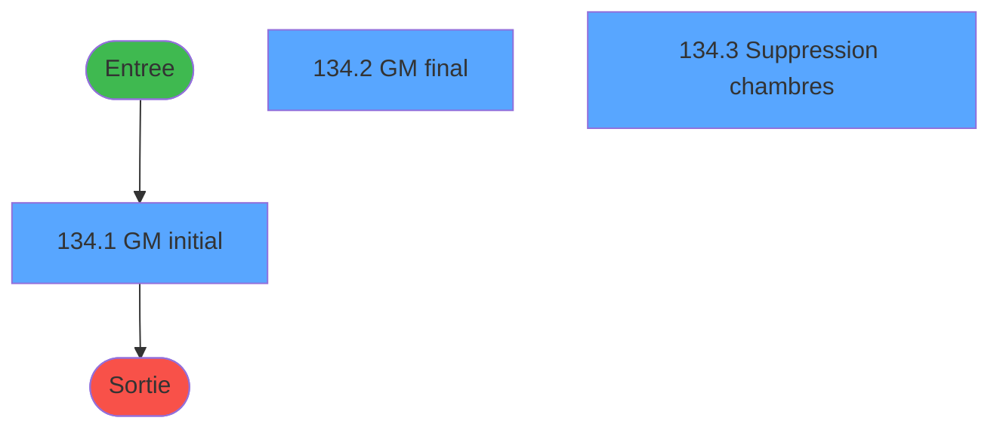
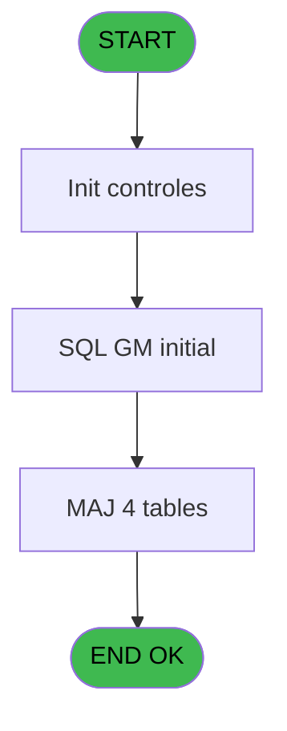
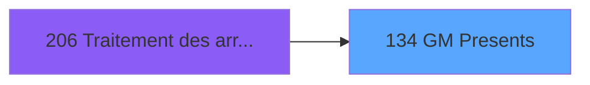
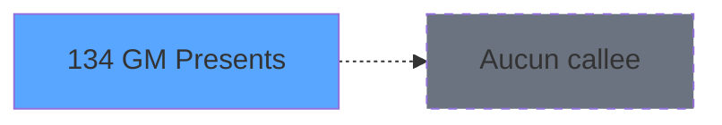

# PBG IDE 134 - GM Presents

> **Analyse**: Phases 1-4 2026-02-03 09:38 -> 09:38 (17s) | Assemblage 09:38
> **Pipeline**: V7.2 Enrichi
> **Structure**: 4 onglets (Resume | Ecrans | Donnees | Connexions)

<!-- TAB:Resume -->

## 1. FICHE D'IDENTITE

| Attribut | Valeur |
|----------|--------|
| Projet | PBG |
| IDE Position | 134 |
| Nom Programme | GM Presents |
| Fichier source | `Prg_134.xml` |
| Domaine metier | General |
| Taches | 12 (3 ecrans visibles) |
| Tables modifiees | 4 |
| Programmes appeles | 0 |

## 2. DESCRIPTION FONCTIONNELLE

**GM Presents** assure la gestion complete de ce processus, accessible depuis [Traitement des arrivants (IDE 206)](PBG-IDE-206.md).

Le flux de traitement s'organise en **3 blocs fonctionnels** :

- **Traitement** (9 taches) : traitements metier divers
- **Calcul** (2 taches) : calculs de montants, stocks ou compteurs
- **Initialisation** (1 tache) : reinitialisation d'etats et de variables de travail

**Donnees modifiees** : 4 tables en ecriture (hebergement______heb, tairejet, pms_check_out, pms_listing_choice).

Detail : phases du traitement

#### Phase 1 : Traitement (9 taches)

- **134** - (sans nom) **[[ECRAN]](#ecran-t1)**
- **134.1.2** - Sejours
- **134.2** - GM final **[[ECRAN]](#ecran-t5)**
- **134.2.2** - Nbre sejours **[[ECRAN]](#ecran-t7)**
- **134.2.3** - 1 Sejour
- **134.2.4** - N Sejours
- **134.3** - Suppression chambres **[[ECRAN]](#ecran-t10)**
- **134.3.1** - Suppression
- **134.4** - Purge chambre

#### Phase 2 : Initialisation (1 tache)

- **134.1** - GM initial **[[ECRAN]](#ecran-t2)**

#### Phase 3 : Calcul (2 taches)

- **134.1.1** - Stockage GM initial
- **134.2.1** - Stockage GM final

#### Tables impactees

| Table | Operations | Role metier |
|-------|-----------|-------------|
| pms_check_out | **W**/L (4 usages) |  |
| hebergement______heb | R/**W** (3 usages) | Hebergement (chambres) |
| tairejet | **W**/L (3 usages) |  |
| pms_listing_choice | **W** (2 usages) |  |

## 3. BLOCS FONCTIONNELS

### 3.1 Traitement (9 taches)

Traitements internes.

---

#### 134 - (sans nom) [[ECRAN]](#ecran-t1)

**Role** : Tache d'orchestration : point d'entree du programme (9 sous-taches). Coordonne l'enchainement des traitements.
**Ecran** : 424 x 66 DLU (MDI) | [Voir mockup](#ecran-t1)

8 sous-taches directes

| Tache | Nom | Bloc |
|-------|-----|------|
| [134.1.2](#t4) | Sejours | Traitement |
| [134.2](#t5) | GM final **[[ECRAN]](#ecran-t5)** | Traitement |
| [134.2.2](#t7) | Nbre sejours **[[ECRAN]](#ecran-t7)** | Traitement |
| [134.2.3](#t8) | 1 Sejour | Traitement |
| [134.2.4](#t9) | N Sejours | Traitement |
| [134.3](#t10) | Suppression chambres **[[ECRAN]](#ecran-t10)** | Traitement |
| [134.3.1](#t11) | Suppression | Traitement |
| [134.4](#t12) | Purge chambre | Traitement |

---

#### 134.1.2 - Sejours

**Role** : Traitement : Sejours.

---

#### 134.2 - GM final [[ECRAN]](#ecran-t5)

**Role** : Traitement : GM final.
**Ecran** : 223 x 78 DLU (MDI) | [Voir mockup](#ecran-t5)

---

#### 134.2.2 - Nbre sejours [[ECRAN]](#ecran-t7)

**Role** : Traitement : Nbre sejours.
**Ecran** : 103 x 195 DLU | [Voir mockup](#ecran-t7)

---

#### 134.2.3 - 1 Sejour

**Role** : Traitement : 1 Sejour.

---

#### 134.2.4 - N Sejours

**Role** : Traitement : N Sejours.

---

#### 134.3 - Suppression chambres [[ECRAN]](#ecran-t10)

**Role** : Traitement : Suppression chambres.
**Ecran** : 224 x 74 DLU (MDI) | [Voir mockup](#ecran-t10)
**Variables liees** : B (V.Compteur chambres)

---

#### 134.3.1 - Suppression

**Role** : Traitement : Suppression.

---

#### 134.4 - Purge chambre

**Role** : Traitement : Purge chambre.
**Variables liees** : B (V.Compteur chambres)

### 3.2 Initialisation (1 tache)

Reinitialisation d'etats et variables de travail.

---

#### 134.1 - GM initial [[ECRAN]](#ecran-t2)

**Role** : Reinitialisation : GM initial.
**Ecran** : 223 x 78 DLU (MDI) | [Voir mockup](#ecran-t2)

### 3.3 Calcul (2 taches)

Calculs metier : montants, stocks, compteurs.

---

#### 134.1.1 - Stockage GM initial

**Role** : Calcul : Stockage GM initial.

---

#### 134.2.1 - Stockage GM final

**Role** : Calcul : Stockage GM final.

## 5. REGLES METIER

*(Aucune regle metier identifiee)*

## 6. CONTEXTE

- **Appele par**: [Traitement des arrivants (IDE 206)](PBG-IDE-206.md)
- **Appelle**: 0 programmes | **Tables**: 4 (W:4 R:1 L:2) | **Taches**: 12 | **Expressions**: 2

<!-- TAB:Ecrans -->

## 8. ECRANS

### 8.1 Forms visibles (3 / 12)

| # | Position | Tache | Nom | Type | Largeur | Hauteur | Bloc |
|---|----------|-------|-----|------|---------|---------|------|
| 1 | 134.1 | 134.1 | GM initial | MDI | 223 | 78 | Initialisation |
| 2 | 134.2 | 134.2 | GM final | MDI | 223 | 78 | Traitement |
| 3 | 134.3 | 134.3 | Suppression chambres | MDI | 224 | 74 | Traitement |

### 8.2 Mockups Ecrans

---

#### 134.1 - GM initial
**Tache** : [134.1](#t2) | **Type** : MDI | **Dimensions** : 223 x 78 DLU
**Bloc** : Initialisation | **Titre IDE** : GM initial

<!-- FORM-DATA:
{
    "width":  223,
    "vFactor":  8,
    "type":  "MDI",
    "hFactor":  4,
    "controls":  [
                     {
                         "x":  4,
                         "type":  "label",
                         "var":  "",
                         "y":  3,
                         "w":  216,
                         "fmt":  "",
                         "name":  "",
                         "h":  29,
                         "color":  "",
                         "text":  "",
                         "parent":  null
                     },
                     {
                         "x":  50,
                         "type":  "label",
                         "var":  "",
                         "y":  13,
                         "w":  123,
                         "fmt":  "",
                         "name":  "",
                         "h":  9,
                         "color":  "7",
                         "text":  "GM Présents - Initialisation",
                         "parent":  null
                     },
                     {
                         "x":  4,
                         "type":  "label",
                         "var":  "",
                         "y":  32,
                         "w":  216,
                         "fmt":  "",
                         "name":  "",
                         "h":  37,
                         "color":  "",
                         "text":  "",
                         "parent":  null
                     },
                     {
                         "x":  12,
                         "type":  "label",
                         "var":  "",
                         "y":  44,
                         "w":  200,
                         "fmt":  "",
                         "name":  "",
                         "h":  19,
                         "color":  "",
                         "text":  "",
                         "parent":  null
                     },
                     {
                         "x":  5,
                         "type":  "image",
                         "var":  "",
                         "y":  5,
                         "w":  40,
                         "fmt":  "",
                         "name":  "",
                         "h":  25,
                         "color":  "",
                         "text":  "",
                         "parent":  null
                     },
                     {
                         "x":  12,
                         "type":  "edit",
                         "var":  "",
                         "y":  45,
                         "w":  198,
                         "fmt":  "30",
                         "name":  "",
                         "h":  17,
                         "color":  "159",
                         "text":  "",
                         "parent":  4
                     },
                     {
                         "x":  99,
                         "type":  "edit",
                         "var":  "",
                         "y":  49,
                         "w":  24,
                         "fmt":  "3 %",
                         "name":  "",
                         "h":  8,
                         "color":  "143",
                         "text":  "",
                         "parent":  1
                     }
                 ],
    "taskId":  "134.1",
    "height":  78
}
-->

<strong>Champs : 2 champs</strong>

| Pos (x,y) | Nom | Variable | Type |
|-----------|-----|----------|------|
| 12,45 | 30 | - | edit |
| 99,49 | 3 % | - | edit |

---

#### 134.2 - GM final
**Tache** : [134.2](#t5) | **Type** : MDI | **Dimensions** : 223 x 78 DLU
**Bloc** : Traitement | **Titre IDE** : GM final

<!-- FORM-DATA:
{
    "width":  223,
    "vFactor":  8,
    "type":  "MDI",
    "hFactor":  4,
    "controls":  [
                     {
                         "x":  5,
                         "type":  "label",
                         "var":  "",
                         "y":  4,
                         "w":  216,
                         "fmt":  "",
                         "name":  "",
                         "h":  29,
                         "color":  "",
                         "text":  "",
                         "parent":  null
                     },
                     {
                         "x":  66,
                         "type":  "label",
                         "var":  "",
                         "y":  14,
                         "w":  90,
                         "fmt":  "",
                         "name":  "",
                         "h":  9,
                         "color":  "7",
                         "text":  "GM Présents - Final",
                         "parent":  null
                     },
                     {
                         "x":  5,
                         "type":  "label",
                         "var":  "",
                         "y":  33,
                         "w":  216,
                         "fmt":  "",
                         "name":  "",
                         "h":  37,
                         "color":  "",
                         "text":  "",
                         "parent":  null
                     },
                     {
                         "x":  13,
                         "type":  "label",
                         "var":  "",
                         "y":  45,
                         "w":  200,
                         "fmt":  "",
                         "name":  "",
                         "h":  19,
                         "color":  "",
                         "text":  "",
                         "parent":  null
                     },
                     {
                         "x":  6,
                         "type":  "image",
                         "var":  "",
                         "y":  6,
                         "w":  40,
                         "fmt":  "",
                         "name":  "",
                         "h":  25,
                         "color":  "",
                         "text":  "",
                         "parent":  null
                     },
                     {
                         "x":  13,
                         "type":  "edit",
                         "var":  "",
                         "y":  46,
                         "w":  198,
                         "fmt":  "30",
                         "name":  "",
                         "h":  17,
                         "color":  "159",
                         "text":  "",
                         "parent":  4
                     },
                     {
                         "x":  100,
                         "type":  "edit",
                         "var":  "",
                         "y":  50,
                         "w":  24,
                         "fmt":  "3 %",
                         "name":  "",
                         "h":  8,
                         "color":  "143",
                         "text":  "",
                         "parent":  1
                     }
                 ],
    "taskId":  "134.2",
    "height":  78
}
-->

<strong>Champs : 2 champs</strong>

| Pos (x,y) | Nom | Variable | Type |
|-----------|-----|----------|------|
| 13,46 | 30 | - | edit |
| 100,50 | 3 % | - | edit |

---

#### 134.3 - Suppression chambres
**Tache** : [134.3](#t10) | **Type** : MDI | **Dimensions** : 224 x 74 DLU
**Bloc** : Traitement | **Titre IDE** : Suppression chambres

<!-- FORM-DATA:
{
    "width":  224,
    "vFactor":  8,
    "type":  "MDI",
    "hFactor":  4,
    "controls":  [
                     {
                         "x":  5,
                         "type":  "label",
                         "var":  "",
                         "y":  4,
                         "w":  216,
                         "fmt":  "",
                         "name":  "",
                         "h":  29,
                         "color":  "",
                         "text":  "",
                         "parent":  null
                     },
                     {
                         "x":  47,
                         "type":  "label",
                         "var":  "",
                         "y":  14,
                         "w":  129,
                         "fmt":  "",
                         "name":  "",
                         "h":  9,
                         "color":  "7",
                         "text":  "GM Présents - Suppr Chamb",
                         "parent":  null
                     },
                     {
                         "x":  5,
                         "type":  "label",
                         "var":  "",
                         "y":  33,
                         "w":  216,
                         "fmt":  "",
                         "name":  "",
                         "h":  37,
                         "color":  "",
                         "text":  "",
                         "parent":  null
                     },
                     {
                         "x":  13,
                         "type":  "label",
                         "var":  "",
                         "y":  45,
                         "w":  200,
                         "fmt":  "",
                         "name":  "",
                         "h":  19,
                         "color":  "",
                         "text":  "",
                         "parent":  null
                     },
                     {
                         "x":  6,
                         "type":  "image",
                         "var":  "",
                         "y":  6,
                         "w":  40,
                         "fmt":  "",
                         "name":  "",
                         "h":  25,
                         "color":  "",
                         "text":  "",
                         "parent":  null
                     },
                     {
                         "x":  13,
                         "type":  "edit",
                         "var":  "",
                         "y":  46,
                         "w":  198,
                         "fmt":  "30",
                         "name":  "",
                         "h":  17,
                         "color":  "159",
                         "text":  "",
                         "parent":  4
                     },
                     {
                         "x":  100,
                         "type":  "edit",
                         "var":  "",
                         "y":  50,
                         "w":  24,
                         "fmt":  "3 %",
                         "name":  "",
                         "h":  8,
                         "color":  "143",
                         "text":  "",
                         "parent":  1
                     }
                 ],
    "taskId":  "134.3",
    "height":  74
}
-->

<strong>Champs : 2 champs</strong>

| Pos (x,y) | Nom | Variable | Type |
|-----------|-----|----------|------|
| 13,46 | 30 | - | edit |
| 100,50 | 3 % | - | edit |

## 9. NAVIGATION

### 9.1 Enchainement des ecrans

**Detail par enchainement :**

| Depuis | Action | Vers | Retour |
|--------|--------|------|--------|

### 9.3 Structure hierarchique (12 taches)

| Position | Tache | Type | Dimensions | Bloc |
|----------|-------|------|------------|------|
| **134.1** | [**(sans nom)** (134)](#t1) [mockup](#ecran-t1) | MDI | 424x66 | Traitement |
| 134.1.1 | [Sejours (134.1.2)](#t4) | MDI | - | |
| 134.1.2 | [GM final (134.2)](#t5) [mockup](#ecran-t5) | MDI | 223x78 | |
| 134.1.3 | [Nbre sejours (134.2.2)](#t7) [mockup](#ecran-t7) | - | 103x195 | |
| 134.1.4 | [1 Sejour (134.2.3)](#t8) | MDI | - | |
| 134.1.5 | [N Sejours (134.2.4)](#t9) | MDI | - | |
| 134.1.6 | [Suppression chambres (134.3)](#t10) [mockup](#ecran-t10) | MDI | 224x74 | |
| 134.1.7 | [Suppression (134.3.1)](#t11) | MDI | - | |
| 134.1.8 | [Purge chambre (134.4)](#t12) | MDI | - | |
| **134.2** | [**GM initial** (134.1)](#t2) [mockup](#ecran-t2) | MDI | 223x78 | Initialisation |
| **134.3** | [**Stockage GM initial** (134.1.1)](#t3) | MDI | - | Calcul |
| 134.3.1 | [Stockage GM final (134.2.1)](#t6) | MDI | - | |

### 9.4 Algorigramme

> **Legende**: Vert = START/END OK | Rouge = END KO | Bleu = Decisions
> *Algorigramme auto-genere. Utiliser `/algorigramme` pour une synthese metier detaillee.*

<!-- TAB:Donnees -->

## 10. TABLES

### Tables utilisees (4)

| ID | Nom | Description | Type | R | W | L | Usages |
|----|-----|-------------|------|---|---|---|--------|
| 34 | hebergement______heb | Hebergement (chambres) | DB | R | **W** |   | 3 |
| 455 | tairejet |  | DB |   | **W** | L | 3 |
| 564 | pms_check_out |  | TMP |   | **W** | L | 4 |
| 565 | pms_listing_choice |  | TMP |   | **W** |   | 2 |

### Colonnes par table (0 / 4 tables avec colonnes identifiees)

Table 34 - hebergement______heb (R/**W**) - 3 usages

*Table utilisee uniquement en Link ou aucune colonne Real identifiee dans le DataView.*

Table 455 - tairejet (**W**/L) - 3 usages

*Table utilisee uniquement en Link ou aucune colonne Real identifiee dans le DataView.*

Table 564 - pms_check_out (**W**/L) - 4 usages

*Table utilisee uniquement en Link ou aucune colonne Real identifiee dans le DataView.*

Table 565 - pms_listing_choice (**W**) - 2 usages

*Table utilisee uniquement en Link ou aucune colonne Real identifiee dans le DataView.*

## 11. VARIABLES

### 11.1 Variables de session (2)

Variables persistantes pendant toute la session.

| Lettre | Nom | Type | Usage dans |
|--------|-----|------|-----------|
| B | V.Compteur chambres | Numeric | - |
| J | V.Compteur | Numeric | - |

### 11.2 Autres (8)

Variables diverses.

| Lettre | Nom | Type | Usage dans |
|--------|-----|------|-----------|
| A | PARAM Code Traitement | Numeric | 2x refs |
| C | gmc_filiation_compte | Numeric | - |
| D | gmc_nom_complet | Unicode | - |
| E | gmc_prenom_complet | Unicode | - |
| F | gmc_type_de_client | Unicode | - |
| G | gmc_numero_adherent | Numeric | - |
| H | gmc_filiation_club | Numeric | - |
| I | gmc_numero_dossier | Numeric | - |

## 12. EXPRESSIONS

**2 / 2 expressions decodees (100%)**

### 12.1 Repartition par type

| Type | Expressions | Regles |
|------|-------------|--------|
| CONDITION | 2 | 0 |

### 12.2 Expressions cles par type

#### CONDITION (2 expressions)

| Type | IDE | Expression | Regle |
|------|-----|------------|-------|
| CONDITION | 2 | `PARAM Code Traitement [A]=2` | - |
| CONDITION | 1 | `PARAM Code Traitement [A]=1` | - |

<!-- TAB:Connexions -->

## 13. GRAPHE D'APPELS

### 13.1 Chaine depuis Main (Callers)

Main -> ... -> [Traitement des arrivants (IDE 206)](PBG-IDE-206.md) -> **GM Presents (IDE 134)**

### 13.2 Callers

| IDE | Nom Programme | Nb Appels |
|-----|---------------|-----------|
| [206](PBG-IDE-206.md) | Traitement des arrivants | 2 |

### 13.3 Callees (programmes appeles)

### 13.4 Detail Callees avec contexte

| IDE | Nom Programme | Appels | Contexte |
|-----|---------------|--------|----------|
| - | (aucun) | - | - |

## 14. RECOMMANDATIONS MIGRATION

### 14.1 Profil du programme

| Metrique | Valeur | Impact migration |
|----------|--------|-----------------|
| Lignes de logique | 236 | Taille moyenne |
| Expressions | 2 | Peu de logique |
| Tables WRITE | 4 | Impact modere |
| Sous-programmes | 0 | Peu de dependances |
| Ecrans visibles | 3 | Quelques ecrans |
| Code desactive | 0% (0 / 236) | Code sain |
| Regles metier | 0 | Pas de regle identifiee |

### 14.2 Plan de migration par bloc

#### Traitement (9 taches: 4 ecrans, 5 traitements)

- **Strategie** : Orchestrateur avec 4 ecrans (Razor/React) et 5 traitements backend (services).
- Les ecrans deviennent des composants UI, les traitements invisibles deviennent des services injectables.
- Decomposer les taches en services unitaires testables.

#### Initialisation (1 tache: 1 ecran, 0 traitement)

- **Strategie** : Constructeur/methode `InitAsync()` dans l'orchestrateur.

#### Calcul (2 taches: 0 ecran, 2 traitements)

- **Strategie** : Services de calcul purs (Domain Services).
- Migrer la logique de calcul (stock, compteurs, montants)

### 14.3 Dependances critiques

| Dependance | Type | Appels | Impact |
|------------|------|--------|--------|
| hebergement______heb | Table WRITE (Database) | 2x | Schema + repository |
| tairejet | Table WRITE (Database) | 1x | Schema + repository |
| pms_check_out | Table WRITE (Temp) | 1x | Schema + repository |
| pms_listing_choice | Table WRITE (Temp) | 2x | Schema + repository |

---
*Spec DETAILED generee par Pipeline V7.2 - 2026-02-03 09:38*
