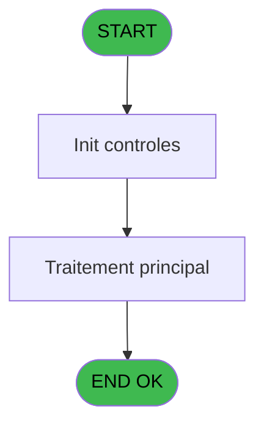
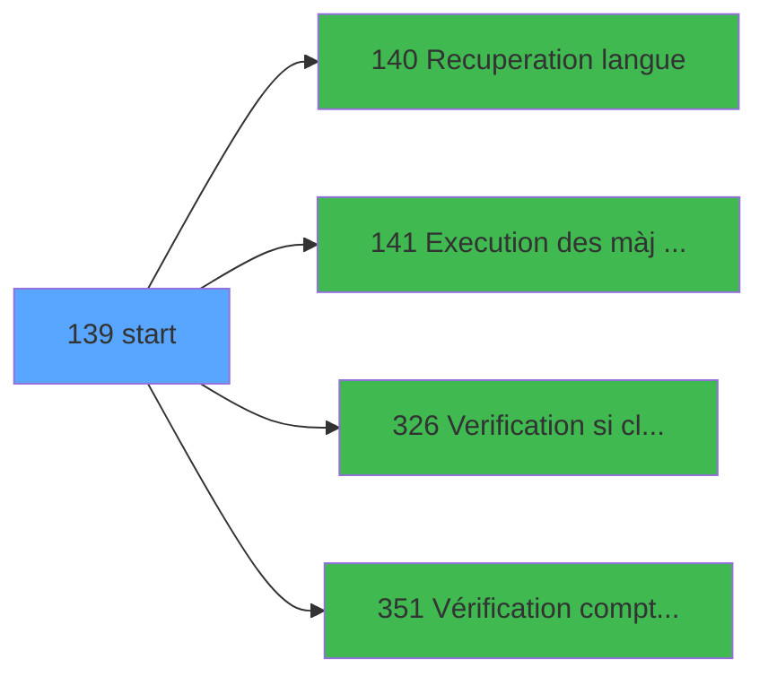

# PBG IDE 139 - start

> **Analyse**: Phases 1-4 2026-02-03 09:40 -> 09:40 (17s) | Assemblage 09:40
> **Pipeline**: V7.2 Enrichi
> **Structure**: 4 onglets (Resume | Ecrans | Donnees | Connexions)

<!-- TAB:Resume -->

## 1. FICHE D'IDENTITE

| Attribut | Valeur |
|----------|--------|
| Projet | PBG |
| IDE Position | 139 |
| Nom Programme | start |
| Fichier source | `Prg_139.xml` |
| Domaine metier | General |
| Taches | 1 (0 ecrans visibles) |
| Tables modifiees | 0 |
| Programmes appeles | 4 |

## 2. DESCRIPTION FONCTIONNELLE

**start** assure la gestion complete de ce processus, accessible depuis [Main Program (IDE 1)](PBG-IDE-1.md).

Le flux de traitement s'organise en **1 blocs fonctionnels** :

- **Traitement** (1 tache) : traitements metier divers

## 3. BLOCS FONCTIONNELS

### 3.1 Traitement (1 tache)

Traitements internes.

---

#### 139 - Start

**Role** : Traitement : Start.
**Delegue a** : [  Recuperation langue (IDE 140)](PBG-IDE-140.md), [Execution des màj combo (IDE 141)](PBG-IDE-141.md)

## 5. REGLES METIER

*(Aucune regle metier identifiee)*

## 6. CONTEXTE

- **Appele par**: [Main Program (IDE 1)](PBG-IDE-1.md)
- **Appelle**: 4 programmes | **Tables**: 4 (W:0 R:1 L:3) | **Taches**: 1 | **Expressions**: 14

<!-- TAB:Ecrans -->

## 8. ECRANS

*(Programme sans ecran visible)*

## 9. NAVIGATION

### 9.3 Structure hierarchique (1 tache)

| Position | Tache | Type | Dimensions | Bloc |
|----------|-------|------|------------|------|
| **139.1** | [**Start** (139)](#t1) | MDI | - | Traitement |

### 9.4 Algorigramme

> **Legende**: Vert = START/END OK | Rouge = END KO | Bleu = Decisions
> *Algorigramme auto-genere. Utiliser `/algorigramme` pour une synthese metier detaillee.*

<!-- TAB:Donnees -->

## 10. TABLES

### Tables utilisees (4)

| ID | Nom | Description | Type | R | W | L | Usages |
|----|-----|-------------|------|---|---|---|--------|
| 63 | parametres___par |  | DB | R |   |   | 1 |
| 69 | initialisation___ini |  | DB |   |   | L | 1 |
| 81 | societe__________soc |  | DB |   |   | L | 1 |
| 135 | libelle_prestation | Prestations/services vendus | DB |   |   | L | 1 |

### Colonnes par table (0 / 1 tables avec colonnes identifiees)

Table 63 - parametres___par (R) - 1 usages

*Table utilisee uniquement en Link ou aucune colonne Real identifiee dans le DataView.*

## 11. VARIABLES

*(Programme sans variables locales mappees)*

## 12. EXPRESSIONS

**14 / 14 expressions decodees (100%)**

### 12.1 Repartition par type

| Type | Expressions | Regles |
|------|-------------|--------|
| CONSTANTE | 4 | 0 |
| OTHER | 5 | 0 |
| CAST_LOGIQUE | 1 | 0 |
| CONDITION | 4 | 0 |

### 12.2 Expressions cles par type

#### CONSTANTE (4 expressions)

| Type | IDE | Expression | Regle |
|------|-----|------------|-------|
| CONSTANTE | 5 | `40` | - |
| CONSTANTE | 9 | `'BEBE'` | - |
| CONSTANTE | 3 | `'C'` | - |
| CONSTANTE | 4 | `39` | - |

#### OTHER (5 expressions)

| Type | IDE | Expression | Regle |
|------|-----|------------|-------|
| OTHER | 11 | `[P]` | - |
| OTHER | 14 | `[R]` | - |
| OTHER | 10 | `[K]` | - |
| OTHER | 1 | `SetParam ('VERIF_USERB','O')` | - |
| OTHER | 8 | `[I]` | - |

#### CAST_LOGIQUE (1 expressions)

| Type | IDE | Expression | Regle |
|------|-----|------------|-------|
| CAST_LOGIQUE | 2 | `INIPut ('[MAGIC_LOGICAL_NAMES]club_user='&VG20,'FALSE'LOG)` | - |

#### CONDITION (4 expressions)

| Type | IDE | Expression | Regle |
|------|-----|------------|-------|
| CONDITION | 6 | `Trim([D])='O'` | - |
| CONDITION | 7 | `Trim([G])='O'` | - |
| CONDITION | 12 | `MnuShow('ADI',VG55 AND GetParam('FRONT')='B')` | - |
| CONDITION | 13 | `MnuShow('ADI',GetParam('FRONT')='B')` | - |

<!-- TAB:Connexions -->

## 13. GRAPHE D'APPELS

### 13.1 Chaine depuis Main (Callers)

Main -> ... -> [Main Program (IDE 1)](PBG-IDE-1.md) -> **start (IDE 139)**

### 13.2 Callers

| IDE | Nom Programme | Nb Appels |
|-----|---------------|-----------|
| [1](PBG-IDE-1.md) | Main Program | 1 |

### 13.3 Callees (programmes appeles)

### 13.4 Detail Callees avec contexte

| IDE | Nom Programme | Appels | Contexte |
|-----|---------------|--------|----------|
| [140](PBG-IDE-140.md) |   Recuperation langue | 1 | Recuperation donnees |
| [141](PBG-IDE-141.md) | Execution des màj combo | 1 | Sous-programme |
| [326](PBG-IDE-326.md) | Verification si client/serveur | 1 | Controle/validation |
| [351](PBG-IDE-351.md) | Vérification compteur compte | 1 | Sous-programme |

## 14. RECOMMANDATIONS MIGRATION

### 14.1 Profil du programme

| Metrique | Valeur | Impact migration |
|----------|--------|-----------------|
| Lignes de logique | 44 | Programme compact |
| Expressions | 14 | Peu de logique |
| Tables WRITE | 0 | Impact faible |
| Sous-programmes | 4 | Peu de dependances |
| Ecrans visibles | 0 | Ecran unique ou traitement batch |
| Code desactive | 2.3% (1 / 44) | Code sain |
| Regles metier | 0 | Pas de regle identifiee |

### 14.2 Plan de migration par bloc

#### Traitement (1 tache: 0 ecran, 1 traitement)

- **Strategie** : 1 service(s) backend injectable(s) (Domain Services).
- 4 sous-programme(s) a migrer ou a reutiliser depuis les services existants.
- Decomposer les taches en services unitaires testables.

### 14.3 Dependances critiques

| Dependance | Type | Appels | Impact |
|------------|------|--------|--------|
| [Verification si client/serveur (IDE 326)](PBG-IDE-326.md) | Sous-programme | 1x | Normale - Controle/validation |
| [Vérification compteur compte (IDE 351)](PBG-IDE-351.md) | Sous-programme | 1x | Normale - Sous-programme |
| [  Recuperation langue (IDE 140)](PBG-IDE-140.md) | Sous-programme | 1x | Normale - Recuperation donnees |
| [Execution des màj combo (IDE 141)](PBG-IDE-141.md) | Sous-programme | 1x | Normale - Sous-programme |

---
*Spec DETAILED generee par Pipeline V7.2 - 2026-02-03 09:40*
