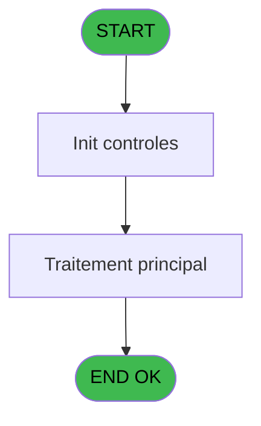
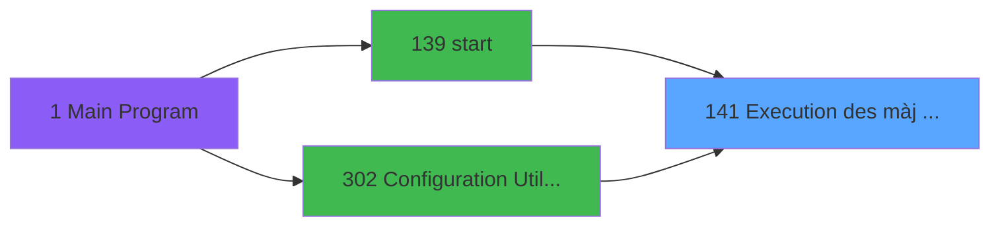
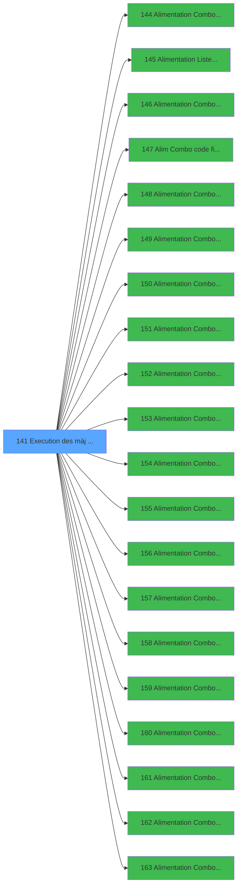

# PBG IDE 141 - Execution des màj combo

> **Analyse**: Phases 1-4 2026-02-03 09:40 -> 09:41 (17s) | Assemblage 09:41
> **Pipeline**: V7.2 Enrichi
> **Structure**: 4 onglets (Resume | Ecrans | Donnees | Connexions)

<!-- TAB:Resume -->

## 1. FICHE D'IDENTITE

| Attribut | Valeur |
|----------|--------|
| Projet | PBG |
| IDE Position | 141 |
| Nom Programme | Execution des màj combo |
| Fichier source | `Prg_141.xml` |
| Domaine metier | General |
| Taches | 2 (0 ecrans visibles) |
| Tables modifiees | 0 |
| Programmes appeles | 20 |

## 2. DESCRIPTION FONCTIONNELLE

**Execution des màj combo** assure la gestion complete de ce processus, accessible depuis [start (IDE 139)](PBG-IDE-139.md), [Configuration Utilisateur (IDE 302)](PBG-IDE-302.md).

Le flux de traitement s'organise en **1 blocs fonctionnels** :

- **Traitement** (2 taches) : traitements metier divers

## 3. BLOCS FONCTIONNELS

### 3.1 Traitement (2 taches)

Traitements internes.

---

#### 141 - Veuillez patienter [[ECRAN]](#ecran-t1)

**Role** : Traitement : Veuillez patienter.
**Ecran** : 429 x 60 DLU (MDI) | [Voir mockup](#ecran-t1)
**Delegue a** : [  Alimentation Combo Rais. Abs (IDE 144)](PBG-IDE-144.md), [  Alimentation Liste Handicap (IDE 145)](PBG-IDE-145.md), [  Alimentation Combo Type Mill (IDE 146)](PBG-IDE-146.md)

---

#### 141.1 - Mise à Jour menus back/front

**Role** : Traitement : Mise à Jour menus back/front.
**Delegue a** : [  Alimentation Combo Rais. Abs (IDE 144)](PBG-IDE-144.md), [  Alimentation Liste Handicap (IDE 145)](PBG-IDE-145.md), [  Alimentation Combo Type Mill (IDE 146)](PBG-IDE-146.md)

## 5. REGLES METIER

*(Aucune regle metier identifiee)*

## 6. CONTEXTE

- **Appele par**: [start (IDE 139)](PBG-IDE-139.md), [Configuration Utilisateur (IDE 302)](PBG-IDE-302.md)
- **Appelle**: 20 programmes | **Tables**: 5 (W:0 R:1 L:4) | **Taches**: 2 | **Expressions**: 39

<!-- TAB:Ecrans -->

## 8. ECRANS

*(Programme sans ecran visible)*

## 9. NAVIGATION

### 9.3 Structure hierarchique (2 taches)

| Position | Tache | Type | Dimensions | Bloc |
|----------|-------|------|------------|------|
| **141.1** | [**Veuillez patienter** (141)](#t1) [mockup](#ecran-t1) | MDI | 429x60 | Traitement |
| 141.1.1 | [Mise à Jour menus back/front (141.1)](#t3) | MDI | - | |

### 9.4 Algorigramme

> **Legende**: Vert = START/END OK | Rouge = END KO | Bleu = Decisions
> *Algorigramme auto-genere. Utiliser `/algorigramme` pour une synthese metier detaillee.*

<!-- TAB:Donnees -->

## 10. TABLES

### Tables utilisees (5)

| ID | Nom | Description | Type | R | W | L | Usages |
|----|-----|-------------|------|---|---|---|--------|
| 81 | societe__________soc |  | DB | R |   |   | 1 |
| 103 | logement_client__loc |  | DB |   |   | L | 1 |
| 109 | table_utilisateurs |  | DB |   |   | L | 1 |
| 691 | commandes |  | DB |   |   | L | 1 |
| 728 | arc_cc_total |  | DB |   |   | L | 1 |

### Colonnes par table (2 / 1 tables avec colonnes identifiees)

Table 81 - societe__________soc (R) - 1 usages

| Lettre | Variable | Acces | Type |
|--------|----------|-------|------|
| A | v. cdrt Lien Utilisateur | R | Logical |
| B | v. cdrt Lien Operateur | R | Logical |
| C | c.cdrt Lien Logement | R | Logical |
| D | v.Liste Combo | R | Alpha |
| E | v. connection ?? | R | Logical |

## 11. VARIABLES

### 11.1 Variables de session (4)

Variables persistantes pendant toute la session.

| Lettre | Nom | Type | Usage dans |
|--------|-----|------|-----------|
| A | v. cdrt Lien Utilisateur | Logical | 2x session |
| B | v. cdrt Lien Operateur | Logical | 3x session |
| D | v.Liste Combo | Alpha | - |
| E | v. connection ?? | Logical | 2x session |

### 11.2 Autres (1)

Variables diverses.

| Lettre | Nom | Type | Usage dans |
|--------|-----|------|-----------|
| C | c.cdrt Lien Logement | Logical | 2x refs |

## 12. EXPRESSIONS

**39 / 39 expressions decodees (100%)**

### 12.1 Repartition par type

| Type | Expressions | Regles |
|------|-------------|--------|
| CONSTANTE | 11 | 0 |
| DATE | 1 | 0 |
| OTHER | 18 | 0 |
| NEGATION | 5 | 0 |
| REFERENCE_VG | 3 | 0 |
| CAST_LOGIQUE | 1 | 0 |

### 12.2 Expressions cles par type

#### CONSTANTE (11 expressions)

| Type | IDE | Expression | Regle |
|------|-----|------------|-------|
| CONSTANTE | 19 | `'CONTRAT'` | - |
| CONSTANTE | 9 | `'TMILLESIA'` | - |
| CONSTANTE | 20 | `'INTITULE'` | - |
| CONSTANTE | 33 | `'PB'` | - |
| CONSTANTE | 21 | `'SERVICE'` | - |
| ... | | *+6 autres* | |

#### DATE (1 expressions)

| Type | IDE | Expression | Regle |
|------|-----|------------|-------|
| DATE | 29 | `Date ()` | - |

#### OTHER (18 expressions)

| Type | IDE | Expression | Regle |
|------|-----|------------|-------|
| OTHER | 24 | `v. cdrt Lien Operateur [B]` | - |
| OTHER | 25 | `v. cdrt Lien Utilisateur [A] AND v. cdrt Lien Operateur [B] AND c.cdrt Lien Logement [C] OR VG22 OR VG23` | - |
| OTHER | 18 | `SetCrsr (1)` | - |
| OTHER | 23 | `[G]` | - |
| OTHER | 30 | `Time ()` | - |
| ... | | *+13 autres* | |

#### NEGATION (5 expressions)

| Type | IDE | Expression | Regle |
|------|-----|------------|-------|
| NEGATION | 28 | `NOT (c.cdrt Lien Logement [C])` | - |
| NEGATION | 34 | `NOT VG41` | - |
| NEGATION | 27 | `NOT (v. cdrt Lien Operateur [B])` | - |
| NEGATION | 2 | `NOT (v. connection ?? [E]) AND NOT(IsComponent())` | - |
| NEGATION | 26 | `NOT (v. cdrt Lien Utilisateur [A])` | - |

#### REFERENCE_VG (3 expressions)

| Type | IDE | Expression | Regle |
|------|-----|------------|-------|
| REFERENCE_VG | 37 | `VG26` | - |
| REFERENCE_VG | 35 | `VG41` | - |
| REFERENCE_VG | 22 | `VG20` | - |

#### CAST_LOGIQUE (1 expressions)

| Type | IDE | Expression | Regle |
|------|-----|------------|-------|
| CAST_LOGIQUE | 32 | `INIPut ('[MAGIC_LOGICAL_NAMES]club_user='&VG20,'FALSE'LOG)` | - |

### 12.3 Toutes les expressions (39)

Voir les 39 expressions

#### CONSTANTE (11)

| IDE | Expression Decodee |
|-----|-------------------|
| 3 | `'UP'` |
| 4 | `'INSCRIPTION'` |
| 5 | `'LANG'` |
| 6 | `'CHOIX'` |
| 7 | `'FUMEUR'` |
| 8 | `'FLEURS'` |
| 9 | `'TMILLESIA'` |
| 19 | `'CONTRAT'` |
| 20 | `'INTITULE'` |
| 21 | `'SERVICE'` |
| 33 | `'PB'` |

#### DATE (1)

| IDE | Expression Decodee |
|-----|-------------------|
| 29 | `Date ()` |

#### OTHER (18)

| IDE | Expression Decodee |
|-----|-------------------|
| 1 | `v. connection ?? [E]` |
| 10 | `SetParam ('FISCALITEGREC',IF ([T],'O','N'))` |
| 11 | `SetParam ('FRONT',[N])` |
| 12 | `SetParam ('FRONT','B')` |
| 13 | `SetParam ('VILLAGE',[Q])` |
| 14 | `SetParam ('SOCIETE',[G])` |
| 15 | `SetParam ('LANGUE',[H])` |
| 16 | `SetParam ('ZONE',[I])` |
| 17 | `SetCrsr (2)` |
| 18 | `SetCrsr (1)` |
| 23 | `[G]` |
| 24 | `v. cdrt Lien Operateur [B]` |
| 25 | `v. cdrt Lien Utilisateur [A] AND v. cdrt Lien Operateur [B] AND c.cdrt Lien Logement [C] OR VG22 OR VG23` |
| 30 | `Time ()` |
| 31 | `VG22 OR VG23` |
| 36 | `VG31 OR VG42` |
| 38 | `NOT(IsComponent())` |
| 39 | `[Q]` |

#### NEGATION (5)

| IDE | Expression Decodee |
|-----|-------------------|
| 2 | `NOT (v. connection ?? [E]) AND NOT(IsComponent())` |
| 26 | `NOT (v. cdrt Lien Utilisateur [A])` |
| 27 | `NOT (v. cdrt Lien Operateur [B])` |
| 28 | `NOT (c.cdrt Lien Logement [C])` |
| 34 | `NOT VG41` |

#### REFERENCE_VG (3)

| IDE | Expression Decodee |
|-----|-------------------|
| 22 | `VG20` |
| 35 | `VG41` |
| 37 | `VG26` |

#### CAST_LOGIQUE (1)

| IDE | Expression Decodee |
|-----|-------------------|
| 32 | `INIPut ('[MAGIC_LOGICAL_NAMES]club_user='&VG20,'FALSE'LOG)` |

<!-- TAB:Connexions -->

## 13. GRAPHE D'APPELS

### 13.1 Chaine depuis Main (Callers)

Main -> ... -> [start (IDE 139)](PBG-IDE-139.md) -> **Execution des màj combo (IDE 141)**

Main -> ... -> [Configuration Utilisateur (IDE 302)](PBG-IDE-302.md) -> **Execution des màj combo (IDE 141)**

### 13.2 Callers

| IDE | Nom Programme | Nb Appels |
|-----|---------------|-----------|
| [139](PBG-IDE-139.md) | start | 1 |
| [302](PBG-IDE-302.md) | Configuration Utilisateur | 1 |

### 13.3 Callees (programmes appeles)

### 13.4 Detail Callees avec contexte

| IDE | Nom Programme | Appels | Contexte |
|-----|---------------|--------|----------|
| [144](PBG-IDE-144.md) |   Alimentation Combo Rais. Abs | 1 | Sous-programme |
| [145](PBG-IDE-145.md) |   Alimentation Liste Handicap | 1 | Configuration impression |
| [146](PBG-IDE-146.md) |   Alimentation Combo Type Mill | 1 | Sous-programme |
| [147](PBG-IDE-147.md) |   Alim Combo code fidelisation | 1 | Programme fidelite |
| [148](PBG-IDE-148.md) |   Alimentation Combos VIP | 1 | Sous-programme |
| [149](PBG-IDE-149.md) |   Alimentation Combos MODIF VA | 1 | Sous-programme |
| [150](PBG-IDE-150.md) |   Alimentation Combos U/P | 1 | Sous-programme |
| [151](PBG-IDE-151.md) |   Alimentation Combos NATION P | 1 | Sous-programme |
| [152](PBG-IDE-152.md) |   Alimentation Combos NATIONAL | 1 | Sous-programme |
| [153](PBG-IDE-153.md) |   Alimentation Combos INSCRIPT | 1 | Sous-programme |
| [154](PBG-IDE-154.md) |   Alimentation Combos LIEU SEJ | 1 | Sous-programme |
| [155](PBG-IDE-155.md) |   Alimentation Combos LANGUE | 1 | Sous-programme |
| [156](PBG-IDE-156.md) |   Alimentation Combos CHOIX | 1 | Selection/consultation |
| [157](PBG-IDE-157.md) |   Alimentation Combos FUMEUR | 1 | Sous-programme |
| [158](PBG-IDE-158.md) |   Alimentation Combos FLEURS | 1 | Sous-programme |
| [159](PBG-IDE-159.md) |   Alimentation Combos CONTRAT | 1 | Sous-programme |
| [160](PBG-IDE-160.md) |   Alimentation Combos BASE OCC | 1 | Sous-programme |
| [161](PBG-IDE-161.md) |   Alimentation Combos SERVICE | 1 | Sous-programme |
| [162](PBG-IDE-162.md) |   Alimentation Combos QUALITE | 1 | Sous-programme |
| [163](PBG-IDE-163.md) |   Alimentation Combos INTITULE | 1 | Sous-programme |

## 14. RECOMMANDATIONS MIGRATION

### 14.1 Profil du programme

| Metrique | Valeur | Impact migration |
|----------|--------|-----------------|
| Lignes de logique | 182 | Programme compact |
| Expressions | 39 | Peu de logique |
| Tables WRITE | 0 | Impact faible |
| Sous-programmes | 20 | Forte dependance |
| Ecrans visibles | 0 | Ecran unique ou traitement batch |
| Code desactive | 0.5% (1 / 182) | Code sain |
| Regles metier | 0 | Pas de regle identifiee |

### 14.2 Plan de migration par bloc

#### Traitement (2 taches: 1 ecran, 1 traitement)

- **Strategie** : Orchestrateur avec 1 ecrans (Razor/React) et 1 traitements backend (services).
- Les ecrans deviennent des composants UI, les traitements invisibles deviennent des services injectables.
- 20 sous-programme(s) a migrer ou a reutiliser depuis les services existants.
- Decomposer les taches en services unitaires testables.

### 14.3 Dependances critiques

| Dependance | Type | Appels | Impact |
|------------|------|--------|--------|
| [  Alimentation Combos FUMEUR (IDE 157)](PBG-IDE-157.md) | Sous-programme | 1x | Normale - Sous-programme |
| [  Alimentation Combos FLEURS (IDE 158)](PBG-IDE-158.md) | Sous-programme | 1x | Normale - Sous-programme |
| [  Alimentation Combos CHOIX (IDE 156)](PBG-IDE-156.md) | Sous-programme | 1x | Normale - Selection/consultation |
| [  Alimentation Combos LIEU SEJ (IDE 154)](PBG-IDE-154.md) | Sous-programme | 1x | Normale - Sous-programme |
| [  Alimentation Combos LANGUE (IDE 155)](PBG-IDE-155.md) | Sous-programme | 1x | Normale - Sous-programme |
| [  Alimentation Combos QUALITE (IDE 162)](PBG-IDE-162.md) | Sous-programme | 1x | Normale - Sous-programme |
| [  Alimentation Combos INTITULE (IDE 163)](PBG-IDE-163.md) | Sous-programme | 1x | Normale - Sous-programme |
| [  Alimentation Combos SERVICE (IDE 161)](PBG-IDE-161.md) | Sous-programme | 1x | Normale - Sous-programme |
| [  Alimentation Combos CONTRAT (IDE 159)](PBG-IDE-159.md) | Sous-programme | 1x | Normale - Sous-programme |
| [  Alimentation Combos BASE OCC (IDE 160)](PBG-IDE-160.md) | Sous-programme | 1x | Normale - Sous-programme |

---
*Spec DETAILED generee par Pipeline V7.2 - 2026-02-03 09:41*
