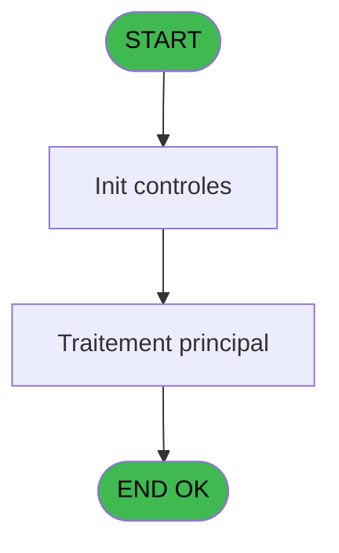
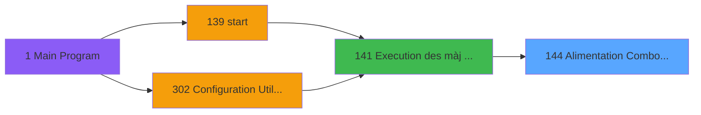

# PBG IDE 144 - Alimentation Combo Rais. Abs

> **Analyse**: Phases 1-4 2026-02-03 09:42 -> 09:42 (17s) | Assemblage 09:42
> **Pipeline**: V7.2 Enrichi
> **Structure**: 4 onglets (Resume | Ecrans | Donnees | Connexions)

<!-- TAB:Resume -->

## 1. FICHE D'IDENTITE

| Attribut | Valeur |
|----------|--------|
| Projet | PBG |
| IDE Position | 144 |
| Nom Programme | Alimentation Combo Rais. Abs |
| Fichier source | `Prg_144.xml` |
| Domaine metier | General |
| Taches | 1 (0 ecrans visibles) |
| Tables modifiees | 0 |
| Programmes appeles | 1 |

## 2. DESCRIPTION FONCTIONNELLE

**Alimentation Combo Rais. Abs** assure la gestion complete de ce processus, accessible depuis [Execution des màj combo (IDE 141)](PBG-IDE-141.md).

Le flux de traitement s'organise en **1 blocs fonctionnels** :

- **Traitement** (1 tache) : traitements metier divers

## 3. BLOCS FONCTIONNELS

### 3.1 Traitement (1 tache)

Traitements internes.

---

#### 144 - Alimentation Combos HEURE [[ECRAN]](#ecran-t1)

**Role** : Traitement : Alimentation Combos HEURE.
**Ecran** : 514 x 228 DLU (MDI) | [Voir mockup](#ecran-t1)
**Delegue a** : [Suppression Carac interdit (IDE 315)](PBG-IDE-315.md)

## 5. REGLES METIER

*(Aucune regle metier identifiee)*

## 6. CONTEXTE

- **Appele par**: [Execution des màj combo (IDE 141)](PBG-IDE-141.md)
- **Appelle**: 1 programmes | **Tables**: 1 (W:0 R:1 L:0) | **Taches**: 1 | **Expressions**: 11

<!-- TAB:Ecrans -->

## 8. ECRANS

*(Programme sans ecran visible)*

## 9. NAVIGATION

### 9.3 Structure hierarchique (1 tache)

| Position | Tache | Type | Dimensions | Bloc |
|----------|-------|------|------------|------|
| **144.1** | [**Alimentation Combos HEURE** (144)](#t1) [mockup](#ecran-t1) | MDI | 514x228 | Traitement |

### 9.4 Algorigramme

> **Legende**: Vert = START/END OK | Rouge = END KO | Bleu = Decisions
> *Algorigramme auto-genere. Utiliser `/algorigramme` pour une synthese metier detaillee.*

<!-- TAB:Donnees -->

## 10. TABLES

### Tables utilisees (1)

| ID | Nom | Description | Type | R | W | L | Usages |
|----|-----|-------------|------|---|---|---|--------|
| 732 | arc_pv_comptable |  | DB | R |   |   | 1 |

### Colonnes par table (1 / 1 tables avec colonnes identifiees)

Table 732 - arc_pv_comptable (R) - 1 usages

| Lettre | Variable | Acces | Type |
|--------|----------|-------|------|
| A | v.combo_GO | R | Alpha |
| B | v.combo_GM | R | Alpha |

## 11. VARIABLES

### 11.1 Variables de session (2)

Variables persistantes pendant toute la session.

| Lettre | Nom | Type | Usage dans |
|--------|-----|------|-----------|
| A | v.combo_GO | Alpha | 4x session |
| B | v.combo_GM | Alpha | 3x session |

## 12. EXPRESSIONS

**11 / 11 expressions decodees (100%)**

### 12.1 Repartition par type

| Type | Expressions | Regles |
|------|-------------|--------|
| OTHER | 2 | 0 |
| CONDITION | 6 | 0 |
| CONCATENATION | 3 | 0 |

### 12.2 Expressions cles par type

#### OTHER (2 expressions)

| Type | IDE | Expression | Regle |
|------|-----|------------|-------|
| OTHER | 5 | `SetParam ('RAISABSGM',[G])` | - |
| OTHER | 4 | `SetParam ('RAISABS',v.combo_GO [A])` | - |

#### CONDITION (6 expressions)

| Type | IDE | Expression | Regle |
|------|-----|------------|-------|
| CONDITION | 7 | `Trim(v.combo_GO [A])<>''` | - |
| CONDITION | 8 | `Trim([G])=''` | - |
| CONDITION | 9 | `Trim([G])<>''` | - |
| CONDITION | 10 | `[H]='GO'` | - |
| CONDITION | 11 | `[H]='GM'` | - |
| ... | | *+1 autres* | |

#### CONCATENATION (3 expressions)

| Type | IDE | Expression | Regle |
|------|-----|------------|-------|
| CONCATENATION | 3 | `Trim ([G])&','&Trim (v.combo_GM [B])&' '&Trim ([C])` | - |
| CONCATENATION | 2 | `Trim (v.combo_GO [A])&','&Trim (v.combo_GM [B])&' '&Trim ([C])` | - |
| CONCATENATION | 1 | `Trim (v.combo_GM [B])&' '&Trim ([C])` | - |

<!-- TAB:Connexions -->

## 13. GRAPHE D'APPELS

### 13.1 Chaine depuis Main (Callers)

Main -> ... -> [Execution des màj combo (IDE 141)](PBG-IDE-141.md) -> **Alimentation Combo Rais. Abs (IDE 144)**

### 13.2 Callers

| IDE | Nom Programme | Nb Appels |
|-----|---------------|-----------|
| [141](PBG-IDE-141.md) | Execution des màj combo | 1 |

### 13.3 Callees (programmes appeles)

### 13.4 Detail Callees avec contexte

| IDE | Nom Programme | Appels | Contexte |
|-----|---------------|--------|----------|
| [315](PBG-IDE-315.md) | Suppression Carac interdit | 2 | Validation saisie |

## 14. RECOMMANDATIONS MIGRATION

### 14.1 Profil du programme

| Metrique | Valeur | Impact migration |
|----------|--------|-----------------|
| Lignes de logique | 21 | Programme compact |
| Expressions | 11 | Peu de logique |
| Tables WRITE | 0 | Impact faible |
| Sous-programmes | 1 | Peu de dependances |
| Ecrans visibles | 0 | Ecran unique ou traitement batch |
| Code desactive | 0% (0 / 21) | Code sain |
| Regles metier | 0 | Pas de regle identifiee |

### 14.2 Plan de migration par bloc

#### Traitement (1 tache: 1 ecran, 0 traitement)

- **Strategie** : 1 composant(s) UI (Razor/React) avec formulaires et validation.
- 1 sous-programme(s) a migrer ou a reutiliser depuis les services existants.
- Decomposer les taches en services unitaires testables.

### 14.3 Dependances critiques

| Dependance | Type | Appels | Impact |
|------------|------|--------|--------|
| [Suppression Carac interdit (IDE 315)](PBG-IDE-315.md) | Sous-programme | 2x | Haute - Validation saisie |

---
*Spec DETAILED generee par Pipeline V7.2 - 2026-02-03 09:42*
