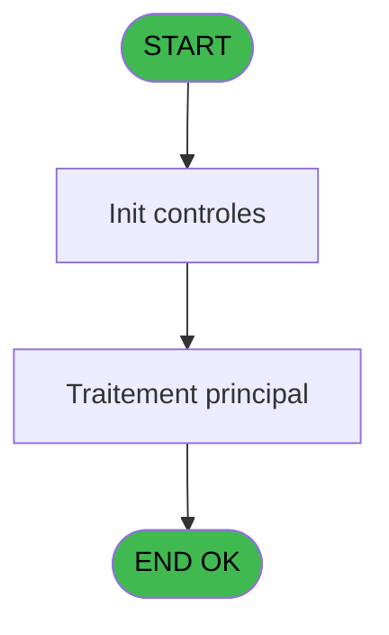
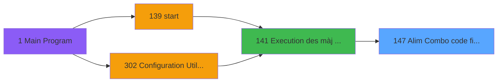

# PBG IDE 147 - Alim Combo code fidelisation

> **Analyse**: Phases 1-4 2026-02-03 09:43 -> 09:43 (18s) | Assemblage 09:43
> **Pipeline**: V7.2 Enrichi
> **Structure**: 4 onglets (Resume | Ecrans | Donnees | Connexions)

<!-- TAB:Resume -->

## 1. FICHE D'IDENTITE

| Attribut | Valeur |
|----------|--------|
| Projet | PBG |
| IDE Position | 147 |
| Nom Programme | Alim Combo code fidelisation |
| Fichier source | `Prg_147.xml` |
| Domaine metier | General |
| Taches | 1 (0 ecrans visibles) |
| Tables modifiees | 0 |
| Programmes appeles | 1 |

## 2. DESCRIPTION FONCTIONNELLE

**Alim Combo code fidelisation** assure la gestion complete de ce processus, accessible depuis [Execution des màj combo (IDE 141)](PBG-IDE-141.md).

Le flux de traitement s'organise en **1 blocs fonctionnels** :

- **Traitement** (1 tache) : traitements metier divers

**Logique metier** : 2 regles identifiees couvrant conditions metier, valeurs par defaut.

## 3. BLOCS FONCTIONNELS

### 3.1 Traitement (1 tache)

Traitements internes.

---

#### 147 - Alimentation Combos HEURE [[ECRAN]](#ecran-t1)

**Role** : Traitement : Alimentation Combos HEURE.
**Ecran** : 514 x 228 DLU (MDI) | [Voir mockup](#ecran-t1)
**Delegue a** : [Suppression Carac interdit (IDE 315)](PBG-IDE-315.md)

## 5. REGLES METIER

2 regles identifiees:

### Autres (2 regles)

#### [RM-001] Valeur par defaut si GetParam ('CODELANGUE') est vide

| Element | Detail |
|---------|--------|
| **Condition** | `GetParam ('CODELANGUE')=''` |
| **Si vrai** | 'FRA' |
| **Si faux** | GetParam ('CODELANGUE')) |
| **Expression source** | Expression 1 : `IF (GetParam ('CODELANGUE')='','FRA',GetParam ('CODELANGUE')` |
| **Exemple** | Si GetParam ('CODELANGUE')='' → 'FRA'. Sinon → GetParam ('CODELANGUE')) |

#### [RM-002] Condition toujours vraie (flag actif)

| Element | Detail |
|---------|--------|
| **Condition** | `VG149` |
| **Si vrai** | [D]<>'N' |
| **Si faux** | 'TRUE'LOG) |
| **Expression source** | Expression 7 : `IF(VG149,[D]<>'N','TRUE'LOG)` |
| **Exemple** | Si VG149 → [D]<>'N'. Sinon → 'TRUE'LOG) |

## 6. CONTEXTE

- **Appele par**: [Execution des màj combo (IDE 141)](PBG-IDE-141.md)
- **Appelle**: 1 programmes | **Tables**: 1 (W:0 R:1 L:0) | **Taches**: 1 | **Expressions**: 7

<!-- TAB:Ecrans -->

## 8. ECRANS

*(Programme sans ecran visible)*

## 9. NAVIGATION

### 9.3 Structure hierarchique (1 tache)

| Position | Tache | Type | Dimensions | Bloc |
|----------|-------|------|------------|------|
| **147.1** | [**Alimentation Combos HEURE** (147)](#t1) [mockup](#ecran-t1) | MDI | 514x228 | Traitement |

### 9.4 Algorigramme

> **Legende**: Vert = START/END OK | Rouge = END KO | Bleu = Decisions
> *Algorigramme auto-genere. Utiliser `/algorigramme` pour une synthese metier detaillee.*

<!-- TAB:Donnees -->

## 10. TABLES

### Tables utilisees (1)

| ID | Nom | Description | Type | R | W | L | Usages |
|----|-----|-------------|------|---|---|---|--------|
| 846 | stat_lieu_vente | Statistiques point de vente | TMP | R |   |   | 1 |

### Colonnes par table (1 / 1 tables avec colonnes identifiees)

Table 846 - stat_lieu_vente (R) - 1 usages

| Lettre | Variable | Acces | Type |
|--------|----------|-------|------|
| A | > Nom variable combo | R | Alpha |
| B | v.combo | R | Alpha |

## 11. VARIABLES

### 11.1 Variables de session (1)

Variables persistantes pendant toute la session.

| Lettre | Nom | Type | Usage dans |
|--------|-----|------|-----------|
| B | v.combo | Alpha | 2x session |

### 11.2 Autres (1)

Variables diverses.

| Lettre | Nom | Type | Usage dans |
|--------|-----|------|-----------|
| A | > Nom variable combo | Alpha | - |

## 12. EXPRESSIONS

**7 / 7 expressions decodees (100%)**

### 12.1 Repartition par type

| Type | Expressions | Regles |
|------|-------------|--------|
| CONDITION | 3 | 5 |
| CAST_LOGIQUE | 1 | 5 |
| OTHER | 1 | 0 |
| CONCATENATION | 2 | 0 |

### 12.2 Expressions cles par type

#### CONDITION (3 expressions)

| Type | IDE | Expression | Regle |
|------|-----|------------|-------|
| CONDITION | 1 | `IF (GetParam ('CODELANGUE')='','FRA',GetParam ('CODELANGUE'))` | [RM-001](#rm-RM-001) |
| CONDITION | 3 | `Counter (0)<>1` | - |
| CONDITION | 2 | `Counter (0)=1` | - |

#### CAST_LOGIQUE (1 expressions)

| Type | IDE | Expression | Regle |
|------|-----|------------|-------|
| CAST_LOGIQUE | 7 | `IF(VG149,[D]<>'N','TRUE'LOG)` | [RM-002](#rm-RM-002) |

#### OTHER (1 expressions)

| Type | IDE | Expression | Regle |
|------|-----|------------|-------|
| OTHER | 6 | `SetParam ('TMILLESIA',v.combo [B])` | - |

#### CONCATENATION (2 expressions)

| Type | IDE | Expression | Regle |
|------|-----|------------|-------|
| CONCATENATION | 5 | `Trim ([D])&' '&Trim ([E])` | - |
| CONCATENATION | 4 | `Trim (v.combo [B])&','&Trim ([D])&' '&Trim ([E])` | - |

<!-- TAB:Connexions -->

## 13. GRAPHE D'APPELS

### 13.1 Chaine depuis Main (Callers)

Main -> ... -> [Execution des màj combo (IDE 141)](PBG-IDE-141.md) -> **Alim Combo code fidelisation (IDE 147)**

### 13.2 Callers

| IDE | Nom Programme | Nb Appels |
|-----|---------------|-----------|
| [141](PBG-IDE-141.md) | Execution des màj combo | 1 |

### 13.3 Callees (programmes appeles)

### 13.4 Detail Callees avec contexte

| IDE | Nom Programme | Appels | Contexte |
|-----|---------------|--------|----------|
| [315](PBG-IDE-315.md) | Suppression Carac interdit | 1 | Validation saisie |

## 14. RECOMMANDATIONS MIGRATION

### 14.1 Profil du programme

| Metrique | Valeur | Impact migration |
|----------|--------|-----------------|
| Lignes de logique | 14 | Programme compact |
| Expressions | 7 | Peu de logique |
| Tables WRITE | 0 | Impact faible |
| Sous-programmes | 1 | Peu de dependances |
| Ecrans visibles | 0 | Ecran unique ou traitement batch |
| Code desactive | 0% (0 / 14) | Code sain |
| Regles metier | 2 | Quelques regles a preserver |

### 14.2 Plan de migration par bloc

#### Traitement (1 tache: 1 ecran, 0 traitement)

- **Strategie** : 1 composant(s) UI (Razor/React) avec formulaires et validation.
- 1 sous-programme(s) a migrer ou a reutiliser depuis les services existants.
- Decomposer les taches en services unitaires testables.

### 14.3 Dependances critiques

| Dependance | Type | Appels | Impact |
|------------|------|--------|--------|
| [Suppression Carac interdit (IDE 315)](PBG-IDE-315.md) | Sous-programme | 1x | Normale - Validation saisie |

---
*Spec DETAILED generee par Pipeline V7.2 - 2026-02-03 09:43*
