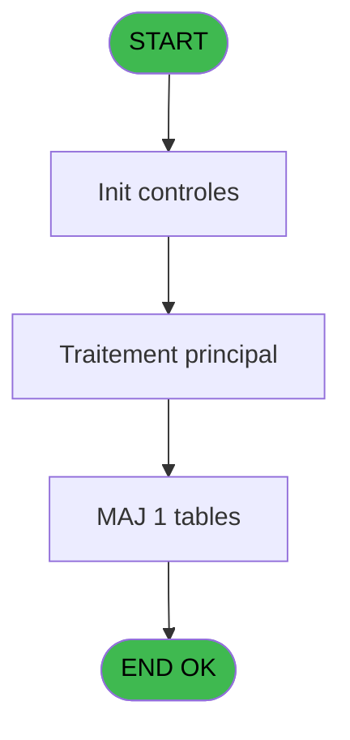
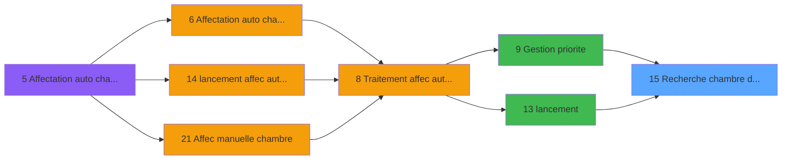

# PBG IDE 15 - Recherche chambre dispo new

> **Analyse**: Phases 1-4 2026-02-03 01:03 -> 01:03 (40s) | Assemblage 01:03
> **Pipeline**: V7.2 Enrichi
> **Structure**: 4 onglets (Resume | Ecrans | Donnees | Connexions)

<!-- TAB:Resume -->

## 1. FICHE D'IDENTITE

| Attribut | Valeur |
|----------|--------|
| Projet | PBG |
| IDE Position | 15 |
| Nom Programme | Recherche chambre dispo new |
| Fichier source | `Prg_15.xml` |
| Domaine metier | Consultation |
| Taches | 9 (0 ecrans visibles) |
| Tables modifiees | 1 |
| Programmes appeles | 2 |

## 2. DESCRIPTION FONCTIONNELLE

**Recherche chambre dispo new** assure la gestion complete de ce processus, accessible depuis [Gestion priorite (IDE 9)](PBG-IDE-9.md), [lancement (IDE 13)](PBG-IDE-13.md).

Le flux de traitement s'organise en **3 blocs fonctionnels** :

- **Consultation** (5 taches) : ecrans de recherche, selection et consultation
- **Traitement** (3 taches) : traitements metier divers
- **Validation** (1 tache) : controles et verifications de coherence

**Donnees modifiees** : 1 tables en ecriture (pv_message).

Detail : phases du traitement

#### Phase 1 : Consultation (5 taches)

- **15.1** - Recherche chambre disponible s
- **15.1.1** - recherche dispo
- **15.1.2** - recherche dispo
- **15** - rech
- **15.1.4** - recherche dispo

#### Phase 2 : Traitement (3 taches)

- **15.1.3** - suppression log si affect
- **15.1.3.1** - log
- **15.1.6** - View

Delegue a : [Affectation chambre (IDE 18)](PBG-IDE-18.md)

#### Phase 3 : Validation (1 tache)

- **15.1.5** - verifie bebe

#### Tables impactees

| Table | Operations | Role metier |
|-------|-----------|-------------|
| pv_message | **W** (1 usages) |  |

## 3. BLOCS FONCTIONNELS

### 3.1 Consultation (5 taches)

Ecrans de recherche et consultation.

---

#### 15.1 - Recherche chambre disponible s

**Role** : Traitement : Recherche chambre disponible s.

4 sous-taches directes

| Tache | Nom | Bloc |
|-------|-----|------|
| [15.1.1](#t3) | recherche dispo | Consultation |
| [15.1.2](#t22) | recherche dispo | Consultation |
| [15](#t31) | rech | Consultation |
| [15.1.4](#t34) | recherche dispo | Consultation |

**Variables liees** : C (V.Chambre affectee), J (V.Deuxieme chambre communi ?)

---

#### 15.1.1 - recherche dispo

**Role** : Traitement : recherche dispo.

---

#### 15.1.2 - recherche dispo

**Role** : Traitement : recherche dispo.

---

#### 15 - rech

**Role** : Traitement : rech.

---

#### 15.1.4 - recherche dispo

**Role** : Traitement : recherche dispo.

### 3.2 Traitement (3 taches)

Traitements internes.

---

#### 15.1.3 - suppression log si affect

**Role** : Traitement : suppression log si affect.
**Variables liees** : B (V.Nb pax restant a affecter ch), C (V.Chambre affectee), E (V.Nb pax total restant a affect), G (V.Nb pax com restant a affect)
**Delegue a** : [Affectation chambre (IDE 18)](PBG-IDE-18.md)

---

#### 15.1.3.1 - log

**Role** : Traitement interne.

---

#### 15.1.6 - View

**Role** : Traitement : View.
**Delegue a** : [Affectation chambre (IDE 18)](PBG-IDE-18.md)

### 3.3 Validation (1 tache)

Controles de coherence : 1 tache verifie les donnees et conditions.

---

#### 15.1.5 - verifie bebe

**Role** : Verification : verifie bebe.
**Variables liees** : K (V.Existe au moins un bebe ?), L (V.Code retour prestation bebe)

## 5. REGLES METIER

*(Aucune regle metier identifiee)*

## 6. CONTEXTE

- **Appele par**: [Gestion priorite (IDE 9)](PBG-IDE-9.md), [lancement (IDE 13)](PBG-IDE-13.md)
- **Appelle**: 2 programmes | **Tables**: 5 (W:1 R:3 L:2) | **Taches**: 9 | **Expressions**: 7

<!-- TAB:Ecrans -->

## 8. ECRANS

*(Programme sans ecran visible)*

## 9. NAVIGATION

### 9.3 Structure hierarchique (9 taches)

| Position | Tache | Type | Dimensions | Bloc |
|----------|-------|------|------------|------|
| **15.1** | [**Recherche chambre disponible s** (15.1)](#t1) | - | - | Consultation |
| 15.1.1 | [recherche dispo (15.1.1)](#t3) | - | - | |
| 15.1.2 | [recherche dispo (15.1.2)](#t22) | - | - | |
| 15.1.3 | [rech (15)](#t31) | - | - | |
| 15.1.4 | [recherche dispo (15.1.4)](#t34) | - | - | |
| **15.2** | [**suppression log si affect** (15.1.3)](#t25) | - | - | Traitement |
| 15.2.1 | [log (15.1.3.1)](#t26) | - | - | |
| 15.2.2 | [View (15.1.6)](#t42) | - | - | |
| **15.3** | [**verifie bebe** (15.1.5)](#t41) | - | - | Validation |

### 9.4 Algorigramme

> **Legende**: Vert = START/END OK | Rouge = END KO | Bleu = Decisions
> *Algorigramme auto-genere. Utiliser `/algorigramme` pour une synthese metier detaillee.*

<!-- TAB:Donnees -->

## 10. TABLES

### Tables utilisees (5)

| ID | Nom | Description | Type | R | W | L | Usages |
|----|-----|-------------|------|---|---|---|--------|
| 33 | prestations______pre | Prestations/services vendus | DB | R |   |   | 2 |
| 103 | logement_client__loc |  | DB | R |   |   | 3 |
| 105 | logement_complement |  | DB |   |   | L | 2 |
| 820 | Commentaire supprime |  | DB | R |   | L | 2 |
| 822 | pv_message |  | DB |   | **W** |   | 1 |

### Colonnes par table (2 / 4 tables avec colonnes identifiees)

Table 33 - prestations______pre (R) - 2 usages

| Lettre | Variable | Acces | Type |
|--------|----------|-------|------|
| A | P.Pas de gestion horaire ? | R | Logical |
| B | V.Nb pax restant a affecter ch | R | Numeric |
| C | V.Chambre affectee | R | Alpha |
| D | V.Code occupation | R | Numeric |
| E | V.Nb pax total restant a affect | R | Numeric |
| F | V.Communicante | R | Logical |
| G | V.Nb pax com restant a affect | R | Numeric |
| H | V.Nb occup com1 | R | Numeric |
| I | V.Nb occup com2 | R | Numeric |
| J | V.Deuxieme chambre communi ? | R | Logical |
| K | V.Existe au moins un bebe ? | R | Logical |
| L | V.Code retour prestation bebe | R | Logical |
| M | V.Clause Where | R | Alpha |
| N | V.Compte Précédent | R | Numeric |
| O | V.Batiment | R | Alpha |
| P | V.Etage | R | Alpha |

Table 103 - logement_client__loc (R) - 3 usages

| Lettre | Variable | Acces | Type |
|--------|----------|-------|------|
| A | P.Chambre affectee prox | R | Alpha |
| B | P.Lit bebe | R | Logical |
| C | V.Dispo ch1 ? | R | Logical |
| D | V.Dispo ch 2 ? | R | Logical |

Table 820 - Commentaire supprime (R/L) - 2 usages

*Table utilisee uniquement en Link ou aucune colonne Real identifiee dans le DataView.*

Table 822 - pv_message (**W**) - 1 usages

*Table utilisee uniquement en Link ou aucune colonne Real identifiee dans le DataView.*

## 11. VARIABLES

### 11.1 Parametres entrants (1)

Variables recues du programme appelant ([Gestion priorite (IDE 9)](PBG-IDE-9.md)).

| Lettre | Nom | Type | Usage dans |
|--------|-----|------|-----------|
| A | P.Pas de gestion horaire ? | Logical | - |

### 11.2 Variables de session (15)

Variables persistantes pendant toute la session.

| Lettre | Nom | Type | Usage dans |
|--------|-----|------|-----------|
| B | V.Nb pax restant a affecter ch | Numeric | - |
| C | V.Chambre affectee | Alpha | 2x session |
| D | V.Code occupation | Numeric | - |
| E | V.Nb pax total restant a affect | Numeric | - |
| F | V.Communicante | Logical | - |
| G | V.Nb pax com restant a affect | Numeric | - |
| H | V.Nb occup com1 | Numeric | - |
| I | V.Nb occup com2 | Numeric | - |
| J | V.Deuxieme chambre communi ? | Logical | - |
| K | V.Existe au moins un bebe ? | Logical | - |
| L | V.Code retour prestation bebe | Logical | - |
| M | V.Clause Where | Alpha | - |
| N | V.Compte Précédent | Numeric | - |
| O | V.Batiment | Alpha | - |
| P | V.Etage | Alpha | - |

Toutes les 16 variables (liste complete)

| Cat | Lettre | Nom Variable | Type |
|-----|--------|--------------|------|
| P0 | **A** | P.Pas de gestion horaire ? | Logical |
| V. | **B** | V.Nb pax restant a affecter ch | Numeric |
| V. | **C** | V.Chambre affectee | Alpha |
| V. | **D** | V.Code occupation | Numeric |
| V. | **E** | V.Nb pax total restant a affect | Numeric |
| V. | **F** | V.Communicante | Logical |
| V. | **G** | V.Nb pax com restant a affect | Numeric |
| V. | **H** | V.Nb occup com1 | Numeric |
| V. | **I** | V.Nb occup com2 | Numeric |
| V. | **J** | V.Deuxieme chambre communi ? | Logical |
| V. | **K** | V.Existe au moins un bebe ? | Logical |
| V. | **L** | V.Code retour prestation bebe | Logical |
| V. | **M** | V.Clause Where | Alpha |
| V. | **N** | V.Compte Précédent | Numeric |
| V. | **O** | V.Batiment | Alpha |
| V. | **P** | V.Etage | Alpha |

## 12. EXPRESSIONS

**7 / 7 expressions decodees (100%)**

### 12.1 Repartition par type

| Type | Expressions | Regles |
|------|-------------|--------|
| CONSTANTE | 1 | 0 |
| FORMAT | 2 | 0 |
| OTHER | 2 | 0 |
| NEGATION | 1 | 0 |
| CAST_LOGIQUE | 1 | 0 |

### 12.2 Expressions cles par type

#### CONSTANTE (1 expressions)

| Type | IDE | Expression | Regle |
|------|-----|------------|-------|
| CONSTANTE | 4 | `''` | - |

#### FORMAT (2 expressions)

| Type | IDE | Expression | Regle |
|------|-----|------------|-------|
| FORMAT | 6 | `'boucle '&Trim(Str(Counter(0),'6'))` | - |
| FORMAT | 5 | `Translate('%club_exportdata%traceaffec_'&Str(Day(Date()),'2P0')&'.txt')` | - |

#### OTHER (2 expressions)

| Type | IDE | Expression | Regle |
|------|-----|------------|-------|
| OTHER | 3 | `[S]` | - |
| OTHER | 1 | `V.Nb pax total restant... [E] OR V.Chambre affectee [C]` | - |

#### NEGATION (1 expressions)

| Type | IDE | Expression | Regle |
|------|-----|------------|-------|
| NEGATION | 2 | `NOT V.Nb pax total restant... [E] AND NOT V.Chambre affectee [C]` | - |

#### CAST_LOGIQUE (1 expressions)

| Type | IDE | Expression | Regle |
|------|-----|------------|-------|
| CAST_LOGIQUE | 7 | `'FALSE'LOG` | - |

<!-- TAB:Connexions -->

## 13. GRAPHE D'APPELS

### 13.1 Chaine depuis Main (Callers)

Main -> ... -> [Gestion priorite (IDE 9)](PBG-IDE-9.md) -> **Recherche chambre dispo new (IDE 15)**

Main -> ... -> [lancement (IDE 13)](PBG-IDE-13.md) -> **Recherche chambre dispo new (IDE 15)**

### 13.2 Callers

| IDE | Nom Programme | Nb Appels |
|-----|---------------|-----------|
| [9](PBG-IDE-9.md) | Gestion priorite | 102 |
| [13](PBG-IDE-13.md) | lancement | 1 |

### 13.3 Callees (programmes appeles)

### 13.4 Detail Callees avec contexte

| IDE | Nom Programme | Appels | Contexte |
|-----|---------------|--------|----------|
| [18](PBG-IDE-18.md) | Affectation chambre | 2 | Sous-programme |
| [19](PBG-IDE-19.md) | Desaffectation ch compte | 1 | Sous-programme |

## 14. RECOMMANDATIONS MIGRATION

### 14.1 Profil du programme

| Metrique | Valeur | Impact migration |
|----------|--------|-----------------|
| Lignes de logique | 257 | Taille moyenne |
| Expressions | 7 | Peu de logique |
| Tables WRITE | 1 | Impact faible |
| Sous-programmes | 2 | Peu de dependances |
| Ecrans visibles | 0 | Ecran unique ou traitement batch |
| Code desactive | 3.1% (8 / 257) | Code sain |
| Regles metier | 0 | Pas de regle identifiee |

### 14.2 Plan de migration par bloc

#### Consultation (5 taches: 0 ecran, 5 traitements)

- **Strategie** : Composants de recherche/selection en modales.

#### Traitement (3 taches: 0 ecran, 3 traitements)

- **Strategie** : 3 service(s) backend injectable(s) (Domain Services).
- 2 sous-programme(s) a migrer ou a reutiliser depuis les services existants.
- Decomposer les taches en services unitaires testables.

#### Validation (1 tache: 0 ecran, 1 traitement)

- **Strategie** : FluentValidation avec validators specifiques.
- Chaque tache de validation -> un validator injectable

### 14.3 Dependances critiques

| Dependance | Type | Appels | Impact |
|------------|------|--------|--------|
| pv_message | Table WRITE (Database) | 1x | Schema + repository |
| [Affectation chambre (IDE 18)](PBG-IDE-18.md) | Sous-programme | 2x | Haute - Sous-programme |
| [Desaffectation ch compte (IDE 19)](PBG-IDE-19.md) | Sous-programme | 1x | Normale - Sous-programme |

---
*Spec DETAILED generee par Pipeline V7.2 - 2026-02-03 01:03*
