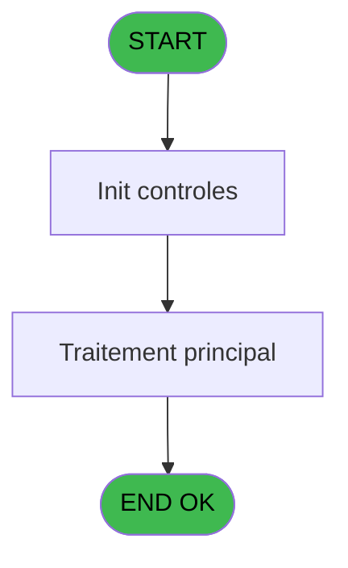

# PBG IDE 16 - Rech si ch occupee

> **Analyse**: Phases 1-4 2026-02-03 01:04 -> 01:04 (37s) | Assemblage 01:04
> **Pipeline**: V7.2 Enrichi
> **Structure**: 4 onglets (Resume | Ecrans | Donnees | Connexions)

<!-- TAB:Resume -->

## 1. FICHE D'IDENTITE

| Attribut | Valeur |
|----------|--------|
| Projet | PBG |
| IDE Position | 16 |
| Nom Programme | Rech si ch occupee |
| Fichier source | `Prg_16.xml` |
| Domaine metier | General |
| Taches | 1 (0 ecrans visibles) |
| Tables modifiees | 0 |
| Programmes appeles | 0 |
| :warning: Statut | **ORPHELIN_POTENTIEL** |

## 2. DESCRIPTION FONCTIONNELLE

**Rech si ch occupee** assure la gestion complete de ce processus.

Le flux de traitement s'organise en **1 blocs fonctionnels** :

- **Traitement** (1 tache) : traitements metier divers

## 3. BLOCS FONCTIONNELS

### 3.1 Traitement (1 tache)

Traitements internes.

---

#### 16 - test dispo

**Role** : Verification : test dispo.
**Variables liees** : H (P.Dispo ?)

## 5. REGLES METIER

*(Aucune regle metier identifiee)*

## 6. CONTEXTE

- **Appele par**: (aucun)
- **Appelle**: 0 programmes | **Tables**: 1 (W:0 R:1 L:0) | **Taches**: 1 | **Expressions**: 15

<!-- TAB:Ecrans -->

## 8. ECRANS

*(Programme sans ecran visible)*

## 9. NAVIGATION

### 9.3 Structure hierarchique (1 tache)

| Position | Tache | Type | Dimensions | Bloc |
|----------|-------|------|------------|------|
| **16.1** | [**test dispo** (16)](#t3) | - | - | Traitement |

### 9.4 Algorigramme

> **Legende**: Vert = START/END OK | Rouge = END KO | Bleu = Decisions
> *Algorigramme auto-genere. Utiliser `/algorigramme` pour une synthese metier detaillee.*

<!-- TAB:Donnees -->

## 10. TABLES

### Tables utilisees (1)

| ID | Nom | Description | Type | R | W | L | Usages |
|----|-----|-------------|------|---|---|---|--------|
| 34 | hebergement______heb | Hebergement (chambres) | DB | R |   |   | 1 |

### Colonnes par table (1 / 1 tables avec colonnes identifiees)

Table 34 - hebergement______heb (R) - 1 usages

| Lettre | Variable | Acces | Type |
|--------|----------|-------|------|
| A | P.Pas de gestion horaire ? | R | Logical |
| B | P.Logement | R | Alpha |
| C | P.Societe | R | Alpha |
| D | P.Date debut | R | Date |
| E | P.Heure debut | R | Alpha |
| F | P.Date fin | R | Date |
| G | P.Heure fin | R | Alpha |
| H | P.Dispo ? | R | Logical |
| I | V.Date/heure debut | R | Numeric |
| J | V.Date/heure fin | R | Numeric |

## 11. VARIABLES

### 11.1 Parametres entrants (8)

Variables recues en parametre.

| Lettre | Nom | Type | Usage dans |
|--------|-----|------|-----------|
| A | P.Pas de gestion horaire ? | Logical | - |
| B | P.Logement | Alpha | - |
| C | P.Societe | Alpha | - |
| D | P.Date debut | Date | 2x parametre entrant |
| E | P.Heure debut | Alpha | 1x parametre entrant |
| F | P.Date fin | Date | 2x parametre entrant |
| G | P.Heure fin | Alpha | 1x parametre entrant |
| H | P.Dispo ? | Logical | - |

### 11.2 Variables de session (2)

Variables persistantes pendant toute la session.

| Lettre | Nom | Type | Usage dans |
|--------|-----|------|-----------|
| I | V.Date/heure debut | Numeric | - |
| J | V.Date/heure fin | Numeric | - |

## 12. EXPRESSIONS

**15 / 15 expressions decodees (100%)**

### 12.1 Repartition par type

| Type | Expressions | Regles |
|------|-------------|--------|
| CONSTANTE | 1 | 0 |
| OTHER | 5 | 0 |
| CAST_LOGIQUE | 2 | 0 |
| NEGATION | 2 | 0 |
| CONDITION | 5 | 0 |

### 12.2 Expressions cles par type

#### CONSTANTE (1 expressions)

| Type | IDE | Expression | Regle |
|------|-----|------------|-------|
| CONSTANTE | 2 | `'H'` | - |

#### OTHER (5 expressions)

| Type | IDE | Expression | Regle |
|------|-----|------------|-------|
| OTHER | 8 | `[Q]` | - |
| OTHER | 9 | `[O]` | - |
| OTHER | 7 | `[N]` | - |
| OTHER | 1 | `[S]` | - |
| OTHER | 3 | `[M]` | - |

#### CAST_LOGIQUE (2 expressions)

| Type | IDE | Expression | Regle |
|------|-----|------------|-------|
| CAST_LOGIQUE | 5 | `'FALSE'LOG` | - |
| CAST_LOGIQUE | 4 | `'TRUE'LOG` | - |

#### NEGATION (2 expressions)

| Type | IDE | Expression | Regle |
|------|-----|------------|-------|
| NEGATION | 13 | `NOT [N]` | - |
| NEGATION | 6 | `NOT [L]` | - |

#### CONDITION (5 expressions)

| Type | IDE | Expression | Regle |
|------|-----|------------|-------|
| CONDITION | 11 | `[O]=P.Date fin [F] AND Val([P],'2')>=Val(P.Heure fin [G],'2')` | - |
| CONDITION | 12 | `[Q]=P.Date debut [D] AND Val([R],'2')<=Val(P.Heure debut [E],'2')` | - |
| CONDITION | 15 | `[Q]=P.Date debut [D]` | - |
| CONDITION | 10 | `Counter(0)=0` | - |
| CONDITION | 14 | `[O]=P.Date fin [F]` | - |

<!-- TAB:Connexions -->

## 13. GRAPHE D'APPELS

### 13.1 Chaine depuis Main (Callers)

**Chemin**: (pas de callers directs)

### 13.2 Callers

| IDE | Nom Programme | Nb Appels |
|-----|---------------|-----------|
| - | (aucun) | - |

### 13.3 Callees (programmes appeles)

### 13.4 Detail Callees avec contexte

| IDE | Nom Programme | Appels | Contexte |
|-----|---------------|--------|----------|
| - | (aucun) | - | - |

## 14. RECOMMANDATIONS MIGRATION

### 14.1 Profil du programme

| Metrique | Valeur | Impact migration |
|----------|--------|-----------------|
| Lignes de logique | 31 | Programme compact |
| Expressions | 15 | Peu de logique |
| Tables WRITE | 0 | Impact faible |
| Sous-programmes | 0 | Peu de dependances |
| Ecrans visibles | 0 | Ecran unique ou traitement batch |
| Code desactive | 0% (0 / 31) | Code sain |
| Regles metier | 0 | Pas de regle identifiee |

### 14.2 Plan de migration par bloc

#### Traitement (1 tache: 0 ecran, 1 traitement)

- **Strategie** : 1 service(s) backend injectable(s) (Domain Services).
- Decomposer les taches en services unitaires testables.

### 14.3 Dependances critiques

| Dependance | Type | Appels | Impact |
|------------|------|--------|--------|

---
*Spec DETAILED generee par Pipeline V7.2 - 2026-02-03 01:04*
