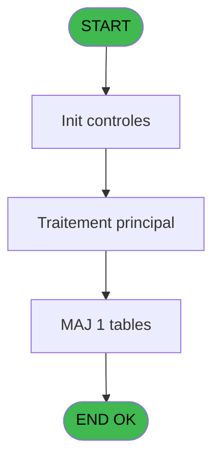
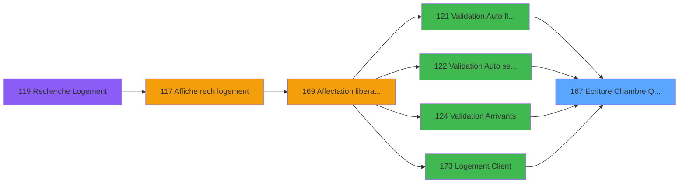

# PBG IDE 167 - Ecriture Chambre Quadriga

> **Analyse**: Phases 1-4 2026-02-03 09:53 -> 09:53 (19s) | Assemblage 09:53
> **Pipeline**: V7.2 Enrichi
> **Structure**: 4 onglets (Resume | Ecrans | Donnees | Connexions)

<!-- TAB:Resume -->

## 1. FICHE D'IDENTITE

| Attribut | Valeur |
|----------|--------|
| Projet | PBG |
| IDE Position | 167 |
| Nom Programme | Ecriture Chambre Quadriga |
| Fichier source | `Prg_167.xml` |
| Domaine metier | General |
| Taches | 1 (0 ecrans visibles) |
| Tables modifiees | 1 |
| Programmes appeles | 0 |

## 2. DESCRIPTION FONCTIONNELLE

**Ecriture Chambre Quadriga** assure la gestion complete de ce processus, accessible depuis [Validation Arrivants (IDE 124)](PBG-IDE-124.md), [Logement Client (IDE 0)](PBG-IDE-0.md), [Logement Client (IDE 173)](PBG-IDE-173.md), [Logement Client pms-626 (IDE 174)](PBG-IDE-174.md), [Logement Client (IDE 385)](PBG-IDE-385.md), [    Validation Auto filiations (IDE 121)](PBG-IDE-121.md), [    Validation Auto seminaire (IDE 122)](PBG-IDE-122.md).

Le flux de traitement s'organise en **1 blocs fonctionnels** :

- **Traitement** (1 tache) : traitements metier divers

**Donnees modifiees** : 1 tables en ecriture (fac_pied_tva_pro).

## 3. BLOCS FONCTIONNELS

### 3.1 Traitement (1 tache)

Traitements internes.

---

#### 167 - Ecriture Chambre Quadriga

**Role** : Traitement : Ecriture Chambre Quadriga.
**Variables liees** : A (P.Num chambre), D (P.Ancienne chambre)

## 5. REGLES METIER

*(Aucune regle metier identifiee)*

## 6. CONTEXTE

- **Appele par**: [Validation Arrivants (IDE 124)](PBG-IDE-124.md), [Logement Client (IDE 0)](PBG-IDE-0.md), [Logement Client (IDE 173)](PBG-IDE-173.md), [Logement Client pms-626 (IDE 174)](PBG-IDE-174.md), [Logement Client (IDE 385)](PBG-IDE-385.md), [    Validation Auto filiations (IDE 121)](PBG-IDE-121.md), [    Validation Auto seminaire (IDE 122)](PBG-IDE-122.md)
- **Appelle**: 0 programmes | **Tables**: 1 (W:1 R:0 L:0) | **Taches**: 1 | **Expressions**: 7

<!-- TAB:Ecrans -->

## 8. ECRANS

*(Programme sans ecran visible)*

## 9. NAVIGATION

### 9.3 Structure hierarchique (1 tache)

| Position | Tache | Type | Dimensions | Bloc |
|----------|-------|------|------------|------|
| **167.1** | [**Ecriture Chambre Quadriga** (167)](#t1) | - | - | Traitement |

### 9.4 Algorigramme

> **Legende**: Vert = START/END OK | Rouge = END KO | Bleu = Decisions
> *Algorigramme auto-genere. Utiliser `/algorigramme` pour une synthese metier detaillee.*

<!-- TAB:Donnees -->

## 10. TABLES

### Tables utilisees (1)

| ID | Nom | Description | Type | R | W | L | Usages |
|----|-----|-------------|------|---|---|---|--------|
| 824 | fac_pied_tva_pro |  | DB |   | **W** |   | 1 |

### Colonnes par table (1 / 1 tables avec colonnes identifiees)

Table 824 - fac_pied_tva_pro (**W**) - 1 usages

| Lettre | Variable | Acces | Type |
|--------|----------|-------|------|
| A | P.Num chambre | W | Alpha |
| B | P.Num compte | W | Numeric |
| C | P.Filiation | W | Numeric |
| D | P.Ancienne chambre | W | Alpha |
| E | P.Code demande | W | Alpha |
| F | P.Date | W | Date |
| G | P.Heure | W | Time |

## 11. VARIABLES

### 11.1 Parametres entrants (7)

Variables recues du programme appelant ([Validation Arrivants (IDE 124)](PBG-IDE-124.md)).

| Lettre | Nom | Type | Usage dans |
|--------|-----|------|-----------|
| A | P.Num chambre | Alpha | - |
| B | P.Num compte | Numeric | - |
| C | P.Filiation | Numeric | - |
| D | P.Ancienne chambre | Alpha | - |
| E | P.Code demande | Alpha | - |
| F | P.Date | Date | - |
| G | P.Heure | Time | - |

## 12. EXPRESSIONS

**7 / 7 expressions decodees (100%)**

### 12.1 Repartition par type

| Type | Expressions | Regles |
|------|-------------|--------|
| OTHER | 7 | 0 |

### 12.2 Expressions cles par type

#### OTHER (7 expressions)

| Type | IDE | Expression | Regle |
|------|-----|------------|-------|
| OTHER | 5 | `[R]` | - |
| OTHER | 6 | `[O]` | - |
| OTHER | 7 | `[N]` | - |
| OTHER | 4 | `[Q]` | - |
| OTHER | 1 | `[K]` | - |
| ... | | *+2 autres* | |

<!-- TAB:Connexions -->

## 13. GRAPHE D'APPELS

### 13.1 Chaine depuis Main (Callers)

Main -> ... -> [Validation Arrivants (IDE 124)](PBG-IDE-124.md) -> **Ecriture Chambre Quadriga (IDE 167)**

Main -> ... -> [Logement Client (IDE 0)](PBG-IDE-0.md) -> **Ecriture Chambre Quadriga (IDE 167)**

Main -> ... -> [Logement Client (IDE 173)](PBG-IDE-173.md) -> **Ecriture Chambre Quadriga (IDE 167)**

Main -> ... -> [Logement Client pms-626 (IDE 174)](PBG-IDE-174.md) -> **Ecriture Chambre Quadriga (IDE 167)**

Main -> ... -> [Logement Client (IDE 385)](PBG-IDE-385.md) -> **Ecriture Chambre Quadriga (IDE 167)**

Main -> ... -> [    Validation Auto filiations (IDE 121)](PBG-IDE-121.md) -> **Ecriture Chambre Quadriga (IDE 167)**

Main -> ... -> [    Validation Auto seminaire (IDE 122)](PBG-IDE-122.md) -> **Ecriture Chambre Quadriga (IDE 167)**

### 13.2 Callers

| IDE | Nom Programme | Nb Appels |
|-----|---------------|-----------|
| [124](PBG-IDE-124.md) | Validation Arrivants | 3 |
| [0](PBG-IDE-0.md) | Logement Client | 2 |
| [173](PBG-IDE-173.md) | Logement Client | 2 |
| [174](PBG-IDE-174.md) | Logement Client pms-626 | 2 |
| [385](PBG-IDE-385.md) | Logement Client | 2 |
| [121](PBG-IDE-121.md) |     Validation Auto filiations | 1 |
| [122](PBG-IDE-122.md) |     Validation Auto seminaire | 1 |

### 13.3 Callees (programmes appeles)

### 13.4 Detail Callees avec contexte

| IDE | Nom Programme | Appels | Contexte |
|-----|---------------|--------|----------|
| - | (aucun) | - | - |

## 14. RECOMMANDATIONS MIGRATION

### 14.1 Profil du programme

| Metrique | Valeur | Impact migration |
|----------|--------|-----------------|
| Lignes de logique | 20 | Programme compact |
| Expressions | 7 | Peu de logique |
| Tables WRITE | 1 | Impact faible |
| Sous-programmes | 0 | Peu de dependances |
| Ecrans visibles | 0 | Ecran unique ou traitement batch |
| Code desactive | 0% (0 / 20) | Code sain |
| Regles metier | 0 | Pas de regle identifiee |

### 14.2 Plan de migration par bloc

#### Traitement (1 tache: 0 ecran, 1 traitement)

- **Strategie** : 1 service(s) backend injectable(s) (Domain Services).
- Decomposer les taches en services unitaires testables.

### 14.3 Dependances critiques

| Dependance | Type | Appels | Impact |
|------------|------|--------|--------|
| fac_pied_tva_pro | Table WRITE (Database) | 1x | Schema + repository |

---
*Spec DETAILED generee par Pipeline V7.2 - 2026-02-03 09:53*
