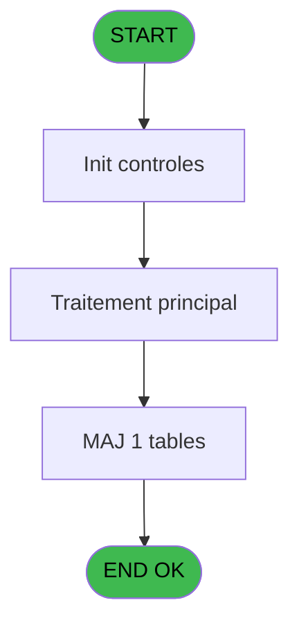
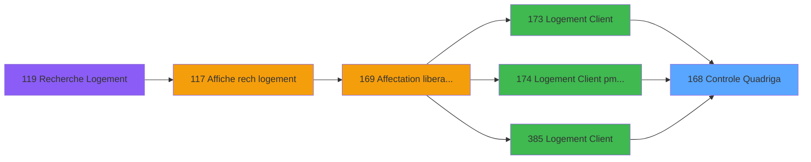
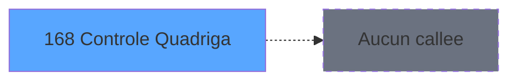

# PBG IDE 168 - Controle Quadriga

> **Analyse**: Phases 1-4 2026-02-03 09:53 -> 09:54 (20s) | Assemblage 09:54
> **Pipeline**: V7.2 Enrichi
> **Structure**: 4 onglets (Resume | Ecrans | Donnees | Connexions)

<!-- TAB:Resume -->

## 1. FICHE D'IDENTITE

| Attribut | Valeur |
|----------|--------|
| Projet | PBG |
| IDE Position | 168 |
| Nom Programme | Controle Quadriga |
| Fichier source | `Prg_168.xml` |
| Domaine metier | General |
| Taches | 2 (1 ecrans visibles) |
| Tables modifiees | 1 |
| Programmes appeles | 0 |

## 2. DESCRIPTION FONCTIONNELLE

**Controle Quadriga** assure la gestion complete de ce processus, accessible depuis [Logement Client (IDE 0)](PBG-IDE-0.md), [Logement Client (IDE 173)](PBG-IDE-173.md), [Logement Client pms-626 (IDE 174)](PBG-IDE-174.md), [Logement Client (IDE 385)](PBG-IDE-385.md).

Le flux de traitement s'organise en **2 blocs fonctionnels** :

- **Creation** (1 tache) : insertion d'enregistrements en base (mouvements, prestations)
- **Validation** (1 tache) : controles et verifications de coherence

**Donnees modifiees** : 1 tables en ecriture (fac_pied_tva_pro).

**Logique metier** : 1 regles identifiees couvrant conditions metier.

Detail : phases du traitement

#### Phase 1 : Validation (1 tache)

- **168** - Controle Quadriga **[[ECRAN]](#ecran-t1)**

#### Phase 2 : Creation (1 tache)

- **168.1** - Creation Commande

#### Tables impactees

| Table | Operations | Role metier |
|-------|-----------|-------------|
| fac_pied_tva_pro | **W** (1 usages) |  |

## 3. BLOCS FONCTIONNELS

### 3.1 Validation (1 tache)

Controles de coherence : 1 tache verifie les donnees et conditions.

---

#### 168 - Controle Quadriga [[ECRAN]](#ecran-t1)

**Role** : Verification : Controle Quadriga.
**Ecran** : 1654 x 166 DLU | [Voir mockup](#ecran-t1)

### 3.2 Creation (1 tache)

Insertion de nouveaux enregistrements en base.

---

#### 168.1 - Creation Commande

**Role** : Creation d'enregistrement : Creation Commande.

## 5. REGLES METIER

1 regles identifiees:

### Autres (1 regles)

#### [RM-001] Si vod_nom1 [E] alors 'OK' sinon 'NOK')

| Element | Detail |
|---------|--------|
| **Condition** | `vod_nom1 [E]` |
| **Si vrai** | 'OK' |
| **Si faux** | 'NOK') |
| **Variables** | E (vod_nom1) |
| **Expression source** | Expression 5 : `IF(vod_nom1 [E],'OK','NOK')` |
| **Exemple** | Si vod_nom1 [E] → 'OK'. Sinon → 'NOK') |

## 6. CONTEXTE

- **Appele par**: [Logement Client (IDE 0)](PBG-IDE-0.md), [Logement Client (IDE 173)](PBG-IDE-173.md), [Logement Client pms-626 (IDE 174)](PBG-IDE-174.md), [Logement Client (IDE 385)](PBG-IDE-385.md)
- **Appelle**: 0 programmes | **Tables**: 1 (W:1 R:0 L:0) | **Taches**: 2 | **Expressions**: 7

<!-- TAB:Ecrans -->

## 8. ECRANS

### 8.1 Forms visibles (1 / 2)

| # | Position | Tache | Nom | Type | Largeur | Hauteur | Bloc |
|---|----------|-------|-----|------|---------|---------|------|
| 1 | 168 | 168 | Controle Quadriga | Type0 | 1654 | 166 | Validation |

### 8.2 Mockups Ecrans

---

#### 168 - Controle Quadriga
**Tache** : [168](#t1) | **Type** : Type0 | **Dimensions** : 1654 x 166 DLU
**Bloc** : Validation | **Titre IDE** : Controle Quadriga

<!-- FORM-DATA:
{
    "width":  1654,
    "vFactor":  8,
    "type":  "Type0",
    "hFactor":  8,
    "controls":  [
                     {
                         "x":  11,
                         "type":  "table",
                         "var":  "",
                         "name":  "",
                         "titleH":  12,
                         "color":  "6",
                         "w":  1630,
                         "y":  36,
                         "fmt":  "",
                         "parent":  null,
                         "text":  "",
                         "rowH":  13,
                         "h":  95,
                         "cols":  [
                                      {
                                          "title":  "Date",
                                          "layer":  1,
                                          "w":  152
                                      },
                                      {
                                          "title":  "Heure",
                                          "layer":  2,
                                          "w":  102
                                      },
                                      {
                                          "title":  "Compte",
                                          "layer":  3,
                                          "w":  126
                                      },
                                      {
                                          "title":  "Nom",
                                          "layer":  4,
                                          "w":  1136
                                      },
                                      {
                                          "title":  "Statut",
                                          "layer":  5,
                                          "w":  80
                                      }
                                  ],
                         "rows":  5
                     },
                     {
                         "x":  18,
                         "type":  "label",
                         "var":  "",
                         "y":  2,
                         "w":  1624,
                         "fmt":  "",
                         "name":  "",
                         "h":  24,
                         "color":  "",
                         "text":  "",
                         "parent":  null
                     },
                     {
                         "x":  18,
                         "type":  "label",
                         "var":  "",
                         "y":  138,
                         "w":  1624,
                         "fmt":  "",
                         "name":  "",
                         "h":  24,
                         "color":  "",
                         "text":  "",
                         "parent":  null
                     },
                     {
                         "x":  43,
                         "type":  "edit",
                         "var":  "",
                         "y":  9,
                         "w":  454,
                         "fmt":  "20",
                         "name":  "VG.USER",
                         "h":  8,
                         "color":  "",
                         "text":  "",
                         "parent":  16
                     },
                     {
                         "x":  1403,
                         "type":  "edit",
                         "var":  "",
                         "y":  10,
                         "w":  203,
                         "fmt":  "WWW DD MMM YYYYT",
                         "name":  "",
                         "h":  8,
                         "color":  "",
                         "text":  "",
                         "parent":  16
                     },
                     {
                         "x":  19,
                         "type":  "edit",
                         "var":  "",
                         "y":  52,
                         "w":  144,
                         "fmt":  "##/##/####",
                         "name":  "vod_datedebut",
                         "h":  10,
                         "color":  "6",
                         "text":  "",
                         "parent":  1
                     },
                     {
                         "x":  173,
                         "type":  "edit",
                         "var":  "",
                         "y":  52,
                         "w":  88,
                         "fmt":  "HH:MM:SS",
                         "name":  "vod_heuredebut",
                         "h":  10,
                         "color":  "6",
                         "text":  "",
                         "parent":  1
                     },
                     {
                         "x":  274,
                         "type":  "edit",
                         "var":  "",
                         "y":  52,
                         "w":  112,
                         "fmt":  "",
                         "name":  "vod_compte1",
                         "h":  10,
                         "color":  "6",
                         "text":  "",
                         "parent":  1
                     },
                     {
                         "x":  402,
                         "type":  "edit",
                         "var":  "",
                         "y":  52,
                         "w":  1120,
                         "fmt":  "",
                         "name":  "vod_nom1",
                         "h":  10,
                         "color":  "6",
                         "text":  "",
                         "parent":  1
                     },
                     {
                         "x":  1544,
                         "type":  "edit",
                         "var":  "",
                         "y":  52,
                         "w":  62,
                         "fmt":  "30",
                         "name":  "vod_ack_info1",
                         "h":  10,
                         "color":  "6",
                         "text":  "",
                         "parent":  1
                     },
                     {
                         "x":  43,
                         "type":  "button",
                         "var":  "",
                         "y":  143,
                         "w":  189,
                         "fmt":  "\u0026Forcer Ouverture",
                         "name":  "",
                         "h":  14,
                         "color":  "",
                         "text":  "",
                         "parent":  18
                     },
                     {
                         "x":  1425,
                         "type":  "button",
                         "var":  "",
                         "y":  143,
                         "w":  189,
                         "fmt":  "\u0026Quitter",
                         "name":  "",
                         "h":  14,
                         "color":  "",
                         "text":  "",
                         "parent":  18
                     }
                 ],
    "taskId":  "168",
    "height":  166
}
-->

<strong>Champs : 7 champs</strong>

| Pos (x,y) | Nom | Variable | Type |
|-----------|-----|----------|------|
| 43,9 | VG.USER | - | edit |
| 1403,10 | WWW DD MMM YYYYT | - | edit |
| 19,52 | vod_datedebut | - | edit |
| 173,52 | vod_heuredebut | - | edit |
| 274,52 | vod_compte1 | - | edit |
| 402,52 | vod_nom1 | - | edit |
| 1544,52 | vod_ack_info1 | - | edit |

<strong>Boutons : 2 boutons</strong>

| Bouton | Pos (x,y) | Action |
|--------|-----------|--------|
| Forcer Ouverture | 43,143 | Bouton fonctionnel |
| Quitter | 1425,143 | Quitte le programme |

## 9. NAVIGATION

Ecran unique: **Controle Quadriga**

### 9.3 Structure hierarchique (2 taches)

| Position | Tache | Type | Dimensions | Bloc |
|----------|-------|------|------------|------|
| **168.1** | [**Controle Quadriga** (168)](#t1) [mockup](#ecran-t1) | - | 1654x166 | Validation |
| **168.2** | [**Creation Commande** (168.1)](#t2) | - | - | Creation |

### 9.4 Algorigramme

> **Legende**: Vert = START/END OK | Rouge = END KO | Bleu = Decisions
> *Algorigramme auto-genere. Utiliser `/algorigramme` pour une synthese metier detaillee.*

<!-- TAB:Donnees -->

## 10. TABLES

### Tables utilisees (1)

| ID | Nom | Description | Type | R | W | L | Usages |
|----|-----|-------------|------|---|---|---|--------|
| 824 | fac_pied_tva_pro |  | DB |   | **W** |   | 1 |

### Colonnes par table (0 / 1 tables avec colonnes identifiees)

Table 824 - fac_pied_tva_pro (**W**) - 1 usages

*Table utilisee uniquement en Link ou aucune colonne Real identifiee dans le DataView.*

## 11. VARIABLES

### 11.1 Autres (6)

Variables diverses.

| Lettre | Nom | Type | Usage dans |
|--------|-----|------|-----------|
| A | Prm - Chambre | Unicode | 1x refs |
| B | vod_datedebut | Alpha | 1x refs |
| C | vod_heuredebut | Alpha | - |
| D | vod_compte1 | Numeric | - |
| E | vod_nom1 | Unicode | 2x refs |
| F | vod_ack_info1 | Logical | 2x refs |

## 12. EXPRESSIONS

**7 / 7 expressions decodees (100%)**

### 12.1 Repartition par type

| Type | Expressions | Regles |
|------|-------------|--------|
| CONDITION | 2 | 5 |
| DATE | 2 | 0 |
| STRING | 3 | 0 |

### 12.2 Expressions cles par type

#### CONDITION (2 expressions)

| Type | IDE | Expression | Regle |
|------|-----|------------|-------|
| CONDITION | 5 | `IF(vod_nom1 [E],'OK','NOK')` | [RM-001](#rm-RM-001) |
| CONDITION | 6 | `IF(vod_nom1 [E],61,62)` | - |

#### DATE (2 expressions)

| Type | IDE | Expression | Regle |
|------|-----|------------|-------|
| DATE | 7 | `Date()` | - |
| DATE | 3 | `DVal(Prm - Chambre [A],'YYYYMMDD')` | - |

#### STRING (3 expressions)

| Type | IDE | Expression | Regle |
|------|-----|------------|-------|
| STRING | 4 | `TVal(vod_datedebut [B],'HHMMSS')` | - |
| STRING | 2 | `MlsTrans('Contrôle Quadriga : Chambre ')&Trim(vod_ack_info1 [F])` | - |
| STRING | 1 | `Trim(vod_ack_info1 [F])` | - |

<!-- TAB:Connexions -->

## 13. GRAPHE D'APPELS

### 13.1 Chaine depuis Main (Callers)

Main -> ... -> [Logement Client (IDE 0)](PBG-IDE-0.md) -> **Controle Quadriga (IDE 168)**

Main -> ... -> [Logement Client (IDE 173)](PBG-IDE-173.md) -> **Controle Quadriga (IDE 168)**

Main -> ... -> [Logement Client pms-626 (IDE 174)](PBG-IDE-174.md) -> **Controle Quadriga (IDE 168)**

Main -> ... -> [Logement Client (IDE 385)](PBG-IDE-385.md) -> **Controle Quadriga (IDE 168)**

### 13.2 Callers

| IDE | Nom Programme | Nb Appels |
|-----|---------------|-----------|
| [0](PBG-IDE-0.md) | Logement Client | 1 |
| [173](PBG-IDE-173.md) | Logement Client | 1 |
| [174](PBG-IDE-174.md) | Logement Client pms-626 | 1 |
| [385](PBG-IDE-385.md) | Logement Client | 1 |

### 13.3 Callees (programmes appeles)

### 13.4 Detail Callees avec contexte

| IDE | Nom Programme | Appels | Contexte |
|-----|---------------|--------|----------|
| - | (aucun) | - | - |

## 14. RECOMMANDATIONS MIGRATION

### 14.1 Profil du programme

| Metrique | Valeur | Impact migration |
|----------|--------|-----------------|
| Lignes de logique | 19 | Programme compact |
| Expressions | 7 | Peu de logique |
| Tables WRITE | 1 | Impact faible |
| Sous-programmes | 0 | Peu de dependances |
| Ecrans visibles | 1 | Ecran unique ou traitement batch |
| Code desactive | 0% (0 / 19) | Code sain |
| Regles metier | 1 | Quelques regles a preserver |

### 14.2 Plan de migration par bloc

#### Validation (1 tache: 1 ecran, 0 traitement)

- **Strategie** : FluentValidation avec validators specifiques.
- Chaque tache de validation -> un validator injectable

#### Creation (1 tache: 0 ecran, 1 traitement)

- **Strategie** : Repository pattern avec Entity Framework Core.
- Insertion via `IRepository<T>.CreateAsync()`

### 14.3 Dependances critiques

| Dependance | Type | Appels | Impact |
|------------|------|--------|--------|
| fac_pied_tva_pro | Table WRITE (Database) | 1x | Schema + repository |

---
*Spec DETAILED generee par Pipeline V7.2 - 2026-02-03 09:54*
