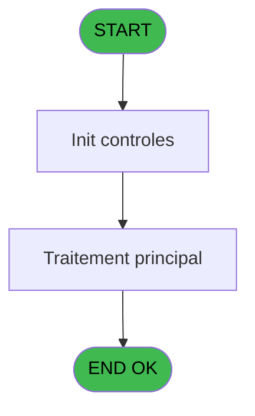
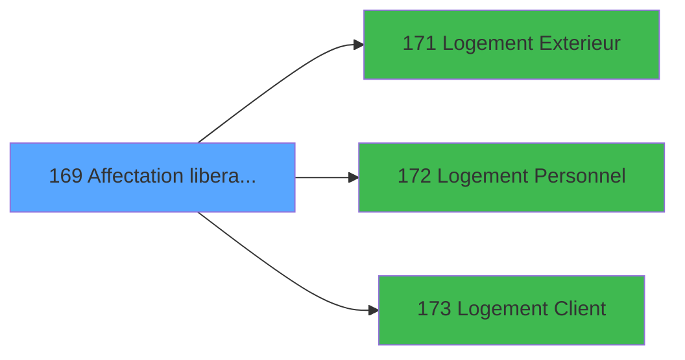

# PBG IDE 169 - Affectation / liberation reche

> **Analyse**: Phases 1-4 2026-02-03 09:54 -> 09:54 (24s) | Assemblage 09:54
> **Pipeline**: V7.2 Enrichi
> **Structure**: 4 onglets (Resume | Ecrans | Donnees | Connexions)

<!-- TAB:Resume -->

## 1. FICHE D'IDENTITE

| Attribut | Valeur |
|----------|--------|
| Projet | PBG |
| IDE Position | 169 |
| Nom Programme | Affectation / liberation reche |
| Fichier source | `Prg_169.xml` |
| Domaine metier | General |
| Taches | 1 (0 ecrans visibles) |
| Tables modifiees | 0 |
| Programmes appeles | 3 |

## 2. DESCRIPTION FONCTIONNELLE

**Affectation / liberation reche** assure la gestion complete de ce processus, accessible depuis [   Affiche rech logement (IDE 117)](PBG-IDE-117.md).

Le flux de traitement s'organise en **1 blocs fonctionnels** :

- **Consultation** (1 tache) : ecrans de recherche, selection et consultation

## 3. BLOCS FONCTIONNELS

### 3.1 Consultation (1 tache)

Ecrans de recherche et consultation.

---

#### 169 - Affectation / liberation reche

**Role** : Traitement : Affectation / liberation reche.

## 5. REGLES METIER

*(Aucune regle metier identifiee)*

## 6. CONTEXTE

- **Appele par**: [   Affiche rech logement (IDE 117)](PBG-IDE-117.md)
- **Appelle**: 3 programmes | **Tables**: 3 (W:0 R:1 L:2) | **Taches**: 1 | **Expressions**: 5

<!-- TAB:Ecrans -->

## 8. ECRANS

*(Programme sans ecran visible)*

## 9. NAVIGATION

### 9.3 Structure hierarchique (1 tache)

| Position | Tache | Type | Dimensions | Bloc |
|----------|-------|------|------------|------|
| **169.1** | [**Affectation / liberation reche** (169)](#t1) | MDI | - | Consultation |

### 9.4 Algorigramme

> **Legende**: Vert = START/END OK | Rouge = END KO | Bleu = Decisions
> *Algorigramme auto-genere. Utiliser `/algorigramme` pour une synthese metier detaillee.*

<!-- TAB:Donnees -->

## 10. TABLES

### Tables utilisees (3)

| ID | Nom | Description | Type | R | W | L | Usages |
|----|-----|-------------|------|---|---|---|--------|
| 102 | logement_go______lop |  | DB | R |   |   | 1 |
| 103 | logement_client__loc |  | DB |   |   | L | 1 |
| 106 | logement_exterieurs |  | DB |   |   | L | 1 |

### Colonnes par table (3 / 1 tables avec colonnes identifiees)

Table 102 - logement_go______lop (R) - 1 usages

| Lettre | Variable | Acces | Type |
|--------|----------|-------|------|
| A | > societe | R | Alpha |
| B | > Logement | R | Alpha |
| C | v. cdrt lclient | R | Logical |
| D | v. cdrt lgo | R | Logical |
| E | v. cdrt lext | R | Logical |

## 11. VARIABLES

### 11.1 Variables de session (3)

Variables persistantes pendant toute la session.

| Lettre | Nom | Type | Usage dans |
|--------|-----|------|-----------|
| C | v. cdrt lclient | Logical | 1x session |
| D | v. cdrt lgo | Logical | - |
| E | v. cdrt lext | Logical | - |

### 11.2 Autres (2)

Variables diverses.

| Lettre | Nom | Type | Usage dans |
|--------|-----|------|-----------|
| A | > societe | Alpha | 1x refs |
| B | > Logement | Alpha | 1x refs |

## 12. EXPRESSIONS

**5 / 5 expressions decodees (100%)**

### 12.1 Repartition par type

| Type | Expressions | Regles |
|------|-------------|--------|
| CONDITION | 2 | 0 |
| OTHER | 3 | 0 |

### 12.2 Expressions cles par type

#### CONDITION (2 expressions)

| Type | IDE | Expression | Regle |
|------|-----|------------|-------|
| CONDITION | 2 | `> Logement [B]` | - |
| CONDITION | 1 | `> societe [A]` | - |

#### OTHER (3 expressions)

| Type | IDE | Expression | Regle |
|------|-----|------------|-------|
| OTHER | 5 | `[I]` | - |
| OTHER | 4 | `[F]` | - |
| OTHER | 3 | `v. cdrt lclient [C]` | - |

<!-- TAB:Connexions -->

## 13. GRAPHE D'APPELS

### 13.1 Chaine depuis Main (Callers)

Main -> ... -> [   Affiche rech logement (IDE 117)](PBG-IDE-117.md) -> **Affectation / liberation reche (IDE 169)**

### 13.2 Callers

| IDE | Nom Programme | Nb Appels |
|-----|---------------|-----------|
| [117](PBG-IDE-117.md) |    Affiche rech logement | 1 |

### 13.3 Callees (programmes appeles)

### 13.4 Detail Callees avec contexte

| IDE | Nom Programme | Appels | Contexte |
|-----|---------------|--------|----------|
| [171](PBG-IDE-171.md) | Logement Exterieur | 1 | Sous-programme |
| [172](PBG-IDE-172.md) | Logement Personnel | 1 | Sous-programme |
| [173](PBG-IDE-173.md) | Logement Client | 1 | Sous-programme |

## 14. RECOMMANDATIONS MIGRATION

### 14.1 Profil du programme

| Metrique | Valeur | Impact migration |
|----------|--------|-----------------|
| Lignes de logique | 24 | Programme compact |
| Expressions | 5 | Peu de logique |
| Tables WRITE | 0 | Impact faible |
| Sous-programmes | 3 | Peu de dependances |
| Ecrans visibles | 0 | Ecran unique ou traitement batch |
| Code desactive | 0% (0 / 24) | Code sain |
| Regles metier | 0 | Pas de regle identifiee |

### 14.2 Plan de migration par bloc

#### Consultation (1 tache: 0 ecran, 1 traitement)

- **Strategie** : Composants de recherche/selection en modales.

### 14.3 Dependances critiques

| Dependance | Type | Appels | Impact |
|------------|------|--------|--------|
| [Logement Client (IDE 173)](PBG-IDE-173.md) | Sous-programme | 1x | Normale - Sous-programme |
| [Logement Personnel (IDE 172)](PBG-IDE-172.md) | Sous-programme | 1x | Normale - Sous-programme |
| [Logement Exterieur (IDE 171)](PBG-IDE-171.md) | Sous-programme | 1x | Normale - Sous-programme |

---
*Spec DETAILED generee par Pipeline V7.2 - 2026-02-03 09:54*
