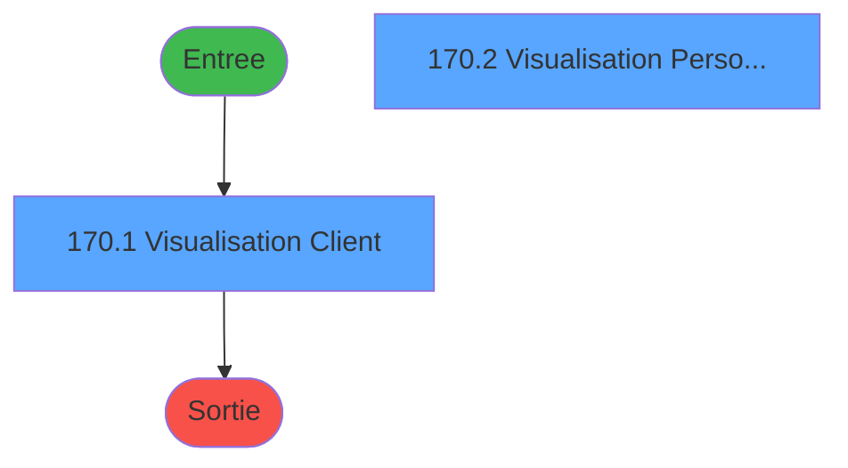
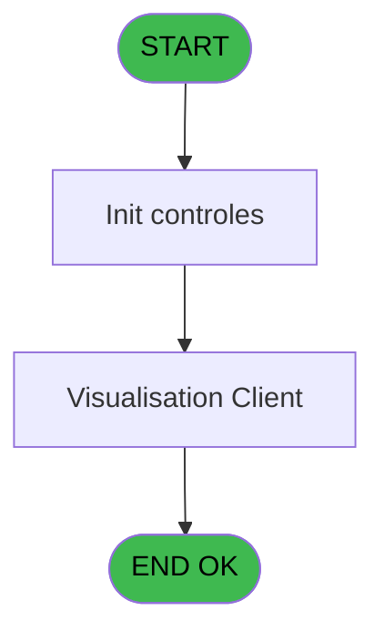
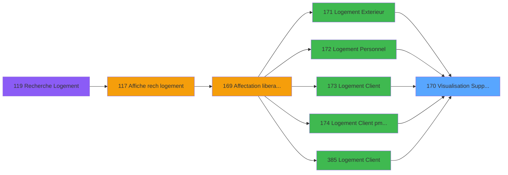
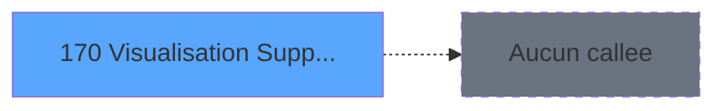

# PBG IDE 170 - Visualisation Supplementaire

> **Analyse**: Phases 1-4 2026-02-03 09:54 -> 09:55 (19s) | Assemblage 09:55
> **Pipeline**: V7.2 Enrichi
> **Structure**: 4 onglets (Resume | Ecrans | Donnees | Connexions)

<!-- TAB:Resume -->

## 1. FICHE D'IDENTITE

| Attribut | Valeur |
|----------|--------|
| Projet | PBG |
| IDE Position | 170 |
| Nom Programme | Visualisation Supplementaire |
| Fichier source | `Prg_170.xml` |
| Domaine metier | General |
| Taches | 3 (2 ecrans visibles) |
| Tables modifiees | 0 |
| Programmes appeles | 0 |

## 2. DESCRIPTION FONCTIONNELLE

**Visualisation Supplementaire** assure la gestion complete de ce processus, accessible depuis [Logement Exterieur (IDE 171)](PBG-IDE-171.md), [Logement Personnel (IDE 172)](PBG-IDE-172.md), [Logement Client (IDE 173)](PBG-IDE-173.md), [Logement Client pms-626 (IDE 174)](PBG-IDE-174.md), [Logement Client (IDE 385)](PBG-IDE-385.md).

Le flux de traitement s'organise en **1 blocs fonctionnels** :

- **Traitement** (3 taches) : traitements metier divers

## 3. BLOCS FONCTIONNELS

### 3.1 Traitement (3 taches)

Traitements internes.

---

#### 170 - Visualisation Supplementaire [[ECRAN]](#ecran-t1)

**Role** : Traitement : Visualisation Supplementaire.
**Ecran** : 637 x 128 DLU (MDI) | [Voir mockup](#ecran-t1)

---

#### 170.1 - Visualisation Client [[ECRAN]](#ecran-t2)

**Role** : Traitement : Visualisation Client.
**Ecran** : 576 x 196 DLU (MDI) | [Voir mockup](#ecran-t2)

---

#### 170.2 - Visualisation Personnel [[ECRAN]](#ecran-t3)

**Role** : Traitement : Visualisation Personnel.
**Ecran** : 536 x 177 DLU (MDI) | [Voir mockup](#ecran-t3)

## 5. REGLES METIER

*(Aucune regle metier identifiee)*

## 6. CONTEXTE

- **Appele par**: [Logement Exterieur (IDE 171)](PBG-IDE-171.md), [Logement Personnel (IDE 172)](PBG-IDE-172.md), [Logement Client (IDE 173)](PBG-IDE-173.md), [Logement Client pms-626 (IDE 174)](PBG-IDE-174.md), [Logement Client (IDE 385)](PBG-IDE-385.md)
- **Appelle**: 0 programmes | **Tables**: 9 (W:0 R:3 L:6) | **Taches**: 3 | **Expressions**: 5

<!-- TAB:Ecrans -->

## 8. ECRANS

### 8.1 Forms visibles (2 / 3)

| # | Position | Tache | Nom | Type | Largeur | Hauteur | Bloc |
|---|----------|-------|-----|------|---------|---------|------|
| 1 | 170.1 | 170.1 | Visualisation Client | MDI | 576 | 196 | Traitement |
| 2 | 170.2 | 170.2 | Visualisation Personnel | MDI | 536 | 177 | Traitement |

### 8.2 Mockups Ecrans

---

#### 170.1 - Visualisation Client
**Tache** : [170.1](#t2) | **Type** : MDI | **Dimensions** : 576 x 196 DLU
**Bloc** : Traitement | **Titre IDE** : Visualisation Client

<!-- FORM-DATA:
{
    "width":  576,
    "vFactor":  8,
    "type":  "MDI",
    "hFactor":  8,
    "controls":  [
                     {
                         "x":  0,
                         "type":  "label",
                         "var":  "",
                         "y":  169,
                         "w":  559,
                         "fmt":  "",
                         "name":  "",
                         "h":  24,
                         "color":  "",
                         "text":  "",
                         "parent":  null
                     },
                     {
                         "x":  31,
                         "type":  "label",
                         "var":  "",
                         "y":  6,
                         "w":  520,
                         "fmt":  "",
                         "name":  "",
                         "h":  71,
                         "color":  "195",
                         "text":  "Clients",
                         "parent":  null
                     },
                     {
                         "x":  50,
                         "type":  "label",
                         "var":  "",
                         "y":  19,
                         "w":  83,
                         "fmt":  "",
                         "name":  "",
                         "h":  8,
                         "color":  "",
                         "text":  "Nom",
                         "parent":  2
                     },
                     {
                         "x":  414,
                         "type":  "label",
                         "var":  "",
                         "y":  19,
                         "w":  13,
                         "fmt":  "",
                         "name":  "",
                         "h":  8,
                         "color":  "",
                         "text":  "-",
                         "parent":  2
                     },
                     {
                         "x":  47,
                         "type":  "label",
                         "var":  "",
                         "y":  31,
                         "w":  85,
                         "fmt":  "",
                         "name":  "",
                         "h":  8,
                         "color":  "",
                         "text":  "Prenom",
                         "parent":  2
                     },
                     {
                         "x":  47,
                         "type":  "label",
                         "var":  "",
                         "y":  43,
                         "w":  42,
                         "fmt":  "",
                         "name":  "",
                         "h":  9,
                         "color":  "",
                         "text":  "Titre",
                         "parent":  2
                     },
                     {
                         "x":  47,
                         "type":  "label",
                         "var":  "",
                         "y":  61,
                         "w":  88,
                         "fmt":  "",
                         "name":  "",
                         "h":  9,
                         "color":  "",
                         "text":  "Nationalite",
                         "parent":  2
                     },
                     {
                         "x":  199,
                         "type":  "label",
                         "var":  "",
                         "y":  61,
                         "w":  74,
                         "fmt":  "",
                         "name":  "",
                         "h":  9,
                         "color":  "",
                         "text":  "Fumeur",
                         "parent":  2
                     },
                     {
                         "x":  31,
                         "type":  "label",
                         "var":  "",
                         "y":  84,
                         "w":  520,
                         "fmt":  "",
                         "name":  "",
                         "h":  74,
                         "color":  "195",
                         "text":  "Sejour",
                         "parent":  null
                     },
                     {
                         "x":  309,
                         "type":  "label",
                         "var":  "",
                         "y":  94,
                         "w":  111,
                         "fmt":  "",
                         "name":  "",
                         "h":  8,
                         "color":  "",
                         "text":  "Retour",
                         "parent":  19
                     },
                     {
                         "x":  117,
                         "type":  "label",
                         "var":  "",
                         "y":  95,
                         "w":  77,
                         "fmt":  "",
                         "name":  "",
                         "h":  8,
                         "color":  "",
                         "text":  "Aller",
                         "parent":  19
                     },
                     {
                         "x":  133,
                         "type":  "label",
                         "var":  "",
                         "y":  107,
                         "w":  13,
                         "fmt":  "",
                         "name":  "",
                         "h":  8,
                         "color":  "",
                         "text":  "-",
                         "parent":  19
                     },
                     {
                         "x":  343,
                         "type":  "label",
                         "var":  "",
                         "y":  107,
                         "w":  13,
                         "fmt":  "",
                         "name":  "",
                         "h":  8,
                         "color":  "",
                         "text":  "-",
                         "parent":  19
                     },
                     {
                         "x":  42,
                         "type":  "label",
                         "var":  "",
                         "y":  122,
                         "w":  64,
                         "fmt":  "",
                         "name":  "",
                         "h":  8,
                         "color":  "",
                         "text":  "Sejour",
                         "parent":  19
                     },
                     {
                         "x":  42,
                         "type":  "label",
                         "var":  "",
                         "y":  133,
                         "w":  115,
                         "fmt":  "",
                         "name":  "",
                         "h":  8,
                         "color":  "",
                         "text":  "Logement",
                         "parent":  19
                     },
                     {
                         "x":  42,
                         "type":  "label",
                         "var":  "",
                         "y":  144,
                         "w":  104,
                         "fmt":  "",
                         "name":  "",
                         "h":  8,
                         "color":  "",
                         "text":  "Occupation",
                         "parent":  19
                     },
                     {
                         "x":  453,
                         "type":  "label",
                         "var":  "",
                         "y":  94,
                         "w":  87,
                         "fmt":  "",
                         "name":  "",
                         "h":  9,
                         "color":  "",
                         "text":  "H Dep.Vil",
                         "parent":  19
                     },
                     {
                         "x":  141,
                         "type":  "edit",
                         "var":  "",
                         "y":  19,
                         "w":  179,
                         "fmt":  "",
                         "name":  "",
                         "h":  9,
                         "color":  "",
                         "text":  "",
                         "parent":  2
                     },
                     {
                         "x":  141,
                         "type":  "edit",
                         "var":  "",
                         "y":  31,
                         "w":  123,
                         "fmt":  "",
                         "name":  "",
                         "h":  9,
                         "color":  "",
                         "text":  "",
                         "parent":  2
                     },
                     {
                         "x":  141,
                         "type":  "edit",
                         "var":  "",
                         "y":  61,
                         "w":  34,
                         "fmt":  "",
                         "name":  "",
                         "h":  9,
                         "color":  "",
                         "text":  "",
                         "parent":  2
                     },
                     {
                         "x":  50,
                         "type":  "edit",
                         "var":  "",
                         "y":  106,
                         "w":  78,
                         "fmt":  "",
                         "name":  "",
                         "h":  9,
                         "color":  "",
                         "text":  "",
                         "parent":  19
                     },
                     {
                         "x":  147,
                         "type":  "edit",
                         "var":  "",
                         "y":  106,
                         "w":  78,
                         "fmt":  "",
                         "name":  "",
                         "h":  9,
                         "color":  "",
                         "text":  "",
                         "parent":  19
                     },
                     {
                         "x":  263,
                         "type":  "edit",
                         "var":  "",
                         "y":  106,
                         "w":  78,
                         "fmt":  "",
                         "name":  "",
                         "h":  9,
                         "color":  "",
                         "text":  "",
                         "parent":  19
                     },
                     {
                         "x":  356,
                         "type":  "edit",
                         "var":  "",
                         "y":  106,
                         "w":  78,
                         "fmt":  "",
                         "name":  "",
                         "h":  10,
                         "color":  "",
                         "text":  "",
                         "parent":  19
                     },
                     {
                         "x":  277,
                         "type":  "edit",
                         "var":  "",
                         "y":  43,
                         "w":  23,
                         "fmt":  "",
                         "name":  "V.Code fidelisation",
                         "h":  9,
                         "color":  "164",
                         "text":  "",
                         "parent":  2
                     },
                     {
                         "x":  316,
                         "type":  "edit",
                         "var":  "",
                         "y":  43,
                         "w":  200,
                         "fmt":  "",
                         "name":  "V.Libelle fidelisation",
                         "h":  9,
                         "color":  "164",
                         "text":  "",
                         "parent":  2
                     },
                     {
                         "x":  361,
                         "type":  "edit",
                         "var":  "",
                         "y":  19,
                         "w":  45,
                         "fmt":  "",
                         "name":  "",
                         "h":  9,
                         "color":  "",
                         "text":  "",
                         "parent":  2
                     },
                     {
                         "x":  430,
                         "type":  "edit",
                         "var":  "",
                         "y":  19,
                         "w":  56,
                         "fmt":  "",
                         "name":  "",
                         "h":  9,
                         "color":  "",
                         "text":  "",
                         "parent":  2
                     },
                     {
                         "x":  277,
                         "type":  "edit",
                         "var":  "",
                         "y":  31,
                         "w":  78,
                         "fmt":  "UX5",
                         "name":  "",
                         "h":  9,
                         "color":  "",
                         "text":  "",
                         "parent":  2
                     },
                     {
                         "x":  141,
                         "type":  "edit",
                         "var":  "",
                         "y":  43,
                         "w":  34,
                         "fmt":  "UX",
                         "name":  "",
                         "h":  9,
                         "color":  "",
                         "text":  "",
                         "parent":  2
                     },
                     {
                         "x":  277,
                         "type":  "edit",
                         "var":  "",
                         "y":  61,
                         "w":  45,
                         "fmt":  "UX2",
                         "name":  "",
                         "h":  9,
                         "color":  "",
                         "text":  "",
                         "parent":  2
                     },
                     {
                         "x":  162,
                         "type":  "edit",
                         "var":  "",
                         "y":  122,
                         "w":  235,
                         "fmt":  "",
                         "name":  "",
                         "h":  9,
                         "color":  "",
                         "text":  "",
                         "parent":  19
                     },
                     {
                         "x":  162,
                         "type":  "edit",
                         "var":  "",
                         "y":  133,
                         "w":  235,
                         "fmt":  "",
                         "name":  "",
                         "h":  9,
                         "color":  "",
                         "text":  "",
                         "parent":  19
                     },
                     {
                         "x":  162,
                         "type":  "edit",
                         "var":  "",
                         "y":  144,
                         "w":  37,
                         "fmt":  "",
                         "name":  "",
                         "h":  9,
                         "color":  "",
                         "text":  "",
                         "parent":  19
                     },
                     {
                         "x":  6,
                         "type":  "button",
                         "var":  "",
                         "y":  172,
                         "w":  154,
                         "fmt":  "\u0026Quitter",
                         "name":  "",
                         "h":  18,
                         "color":  "",
                         "text":  "",
                         "parent":  null
                     },
                     {
                         "x":  467,
                         "type":  "edit",
                         "var":  "",
                         "y":  106,
                         "w":  51,
                         "fmt":  "U2h",
                         "name":  "heb_heure_fin Z",
                         "h":  10,
                         "color":  "",
                         "text":  "",
                         "parent":  19
                     }
                 ],
    "taskId":  "170.1",
    "height":  196
}
-->

<strong>Champs : 18 champs</strong>

| Pos (x,y) | Nom | Variable | Type |
|-----------|-----|----------|------|
| 141,19 | (sans nom) | - | edit |
| 141,31 | (sans nom) | - | edit |
| 141,61 | (sans nom) | - | edit |
| 50,106 | (sans nom) | - | edit |
| 147,106 | (sans nom) | - | edit |
| 263,106 | (sans nom) | - | edit |
| 356,106 | (sans nom) | - | edit |
| 277,43 | V.Code fidelisation | - | edit |
| 316,43 | V.Libelle fidelisation | - | edit |
| 361,19 | (sans nom) | - | edit |
| 430,19 | (sans nom) | - | edit |
| 277,31 | UX5 | - | edit |
| 141,43 | UX | - | edit |
| 277,61 | UX2 | - | edit |
| 162,122 | (sans nom) | - | edit |
| 162,133 | (sans nom) | - | edit |
| 162,144 | (sans nom) | - | edit |
| 467,106 | heb_heure_fin Z | - | edit |

<strong>Boutons : 1 boutons</strong>

| Bouton | Pos (x,y) | Action |
|--------|-----------|--------|
| Quitter | 6,172 | Quitte le programme |

---

#### 170.2 - Visualisation Personnel
**Tache** : [170.2](#t3) | **Type** : MDI | **Dimensions** : 536 x 177 DLU
**Bloc** : Traitement | **Titre IDE** : Visualisation Personnel

<!-- FORM-DATA:
{
    "width":  536,
    "vFactor":  8,
    "type":  "MDI",
    "hFactor":  8,
    "controls":  [
                     {
                         "x":  0,
                         "type":  "label",
                         "var":  "",
                         "y":  150,
                         "w":  533,
                         "fmt":  "",
                         "name":  "",
                         "h":  24,
                         "color":  "",
                         "text":  "",
                         "parent":  null
                     },
                     {
                         "x":  35,
                         "type":  "label",
                         "var":  "",
                         "y":  7,
                         "w":  471,
                         "fmt":  "",
                         "name":  "",
                         "h":  79,
                         "color":  "195",
                         "text":  "Personnel",
                         "parent":  null
                     },
                     {
                         "x":  57,
                         "type":  "label",
                         "var":  "",
                         "y":  19,
                         "w":  83,
                         "fmt":  "",
                         "name":  "",
                         "h":  8,
                         "color":  "",
                         "text":  "Nom",
                         "parent":  2
                     },
                     {
                         "x":  420,
                         "type":  "label",
                         "var":  "",
                         "y":  19,
                         "w":  13,
                         "fmt":  "",
                         "name":  "",
                         "h":  8,
                         "color":  "",
                         "text":  "-",
                         "parent":  2
                     },
                     {
                         "x":  57,
                         "type":  "label",
                         "var":  "",
                         "y":  31,
                         "w":  96,
                         "fmt":  "",
                         "name":  "",
                         "h":  8,
                         "color":  "",
                         "text":  "Prenom",
                         "parent":  2
                     },
                     {
                         "x":  57,
                         "type":  "label",
                         "var":  "",
                         "y":  43,
                         "w":  42,
                         "fmt":  "",
                         "name":  "",
                         "h":  8,
                         "color":  "",
                         "text":  "Titre",
                         "parent":  2
                     },
                     {
                         "x":  57,
                         "type":  "label",
                         "var":  "",
                         "y":  58,
                         "w":  98,
                         "fmt":  "",
                         "name":  "",
                         "h":  8,
                         "color":  "",
                         "text":  "Nationalite",
                         "parent":  2
                     },
                     {
                         "x":  57,
                         "type":  "label",
                         "var":  "",
                         "y":  70,
                         "w":  90,
                         "fmt":  "",
                         "name":  "",
                         "h":  8,
                         "color":  "",
                         "text":  "Fumeur",
                         "parent":  2
                     },
                     {
                         "x":  35,
                         "type":  "label",
                         "var":  "",
                         "y":  89,
                         "w":  471,
                         "fmt":  "",
                         "name":  "",
                         "h":  51,
                         "color":  "195",
                         "text":  "Emploi",
                         "parent":  null
                     },
                     {
                         "x":  57,
                         "type":  "label",
                         "var":  "",
                         "y":  101,
                         "w":  66,
                         "fmt":  "",
                         "name":  "",
                         "h":  8,
                         "color":  "",
                         "text":  "Service",
                         "parent":  17
                     },
                     {
                         "x":  57,
                         "type":  "label",
                         "var":  "",
                         "y":  112,
                         "w":  74,
                         "fmt":  "",
                         "name":  "",
                         "h":  8,
                         "color":  "",
                         "text":  "Fonction",
                         "parent":  17
                     },
                     {
                         "x":  57,
                         "type":  "label",
                         "var":  "",
                         "y":  124,
                         "w":  96,
                         "fmt":  "",
                         "name":  "",
                         "h":  8,
                         "color":  "",
                         "text":  "Occupation",
                         "parent":  17
                     },
                     {
                         "x":  169,
                         "type":  "edit",
                         "var":  "",
                         "y":  19,
                         "w":  179,
                         "fmt":  "",
                         "name":  "",
                         "h":  9,
                         "color":  "",
                         "text":  "",
                         "parent":  2
                     },
                     {
                         "x":  169,
                         "type":  "edit",
                         "var":  "",
                         "y":  31,
                         "w":  123,
                         "fmt":  "",
                         "name":  "GO Prenom",
                         "h":  9,
                         "color":  "",
                         "text":  "",
                         "parent":  2
                     },
                     {
                         "x":  169,
                         "type":  "edit",
                         "var":  "",
                         "y":  101,
                         "w":  258,
                         "fmt":  "100",
                         "name":  "",
                         "h":  9,
                         "color":  "",
                         "text":  "",
                         "parent":  17
                     },
                     {
                         "x":  169,
                         "type":  "edit",
                         "var":  "",
                         "y":  112,
                         "w":  258,
                         "fmt":  "100",
                         "name":  "",
                         "h":  9,
                         "color":  "",
                         "text":  "",
                         "parent":  17
                     },
                     {
                         "x":  169,
                         "type":  "edit",
                         "var":  "",
                         "y":  58,
                         "w":  34,
                         "fmt":  "",
                         "name":  "",
                         "h":  9,
                         "color":  "",
                         "text":  "",
                         "parent":  2
                     },
                     {
                         "x":  367,
                         "type":  "edit",
                         "var":  "",
                         "y":  19,
                         "w":  45,
                         "fmt":  "",
                         "name":  "",
                         "h":  9,
                         "color":  "",
                         "text":  "",
                         "parent":  2
                     },
                     {
                         "x":  428,
                         "type":  "edit",
                         "var":  "",
                         "y":  19,
                         "w":  56,
                         "fmt":  "",
                         "name":  "",
                         "h":  9,
                         "color":  "",
                         "text":  "",
                         "parent":  2
                     },
                     {
                         "x":  169,
                         "type":  "edit",
                         "var":  "",
                         "y":  43,
                         "w":  34,
                         "fmt":  "UX",
                         "name":  "",
                         "h":  9,
                         "color":  "",
                         "text":  "",
                         "parent":  2
                     },
                     {
                         "x":  228,
                         "type":  "edit",
                         "var":  "",
                         "y":  43,
                         "w":  56,
                         "fmt":  "UX3",
                         "name":  "",
                         "h":  9,
                         "color":  "",
                         "text":  "",
                         "parent":  2
                     },
                     {
                         "x":  169,
                         "type":  "edit",
                         "var":  "",
                         "y":  70,
                         "w":  45,
                         "fmt":  "UX2",
                         "name":  "",
                         "h":  9,
                         "color":  "",
                         "text":  "",
                         "parent":  2
                     },
                     {
                         "x":  169,
                         "type":  "edit",
                         "var":  "",
                         "y":  124,
                         "w":  34,
                         "fmt":  "",
                         "name":  "",
                         "h":  9,
                         "color":  "",
                         "text":  "",
                         "parent":  17
                     },
                     {
                         "x":  5,
                         "type":  "button",
                         "var":  "",
                         "y":  153,
                         "w":  154,
                         "fmt":  "\u0026Quitter",
                         "name":  "",
                         "h":  18,
                         "color":  "",
                         "text":  "",
                         "parent":  null
                     }
                 ],
    "taskId":  "170.2",
    "height":  177
}
-->

<strong>Champs : 11 champs</strong>

| Pos (x,y) | Nom | Variable | Type |
|-----------|-----|----------|------|
| 169,19 | (sans nom) | - | edit |
| 169,31 | GO Prenom | - | edit |
| 169,101 | 100 | - | edit |
| 169,112 | 100 | - | edit |
| 169,58 | (sans nom) | - | edit |
| 367,19 | (sans nom) | - | edit |
| 428,19 | (sans nom) | - | edit |
| 169,43 | UX | - | edit |
| 228,43 | UX3 | - | edit |
| 169,70 | UX2 | - | edit |
| 169,124 | (sans nom) | - | edit |

<strong>Boutons : 1 boutons</strong>

| Bouton | Pos (x,y) | Action |
|--------|-----------|--------|
| Quitter | 5,153 | Quitte le programme |

## 9. NAVIGATION

### 9.1 Enchainement des ecrans

**Detail par enchainement :**

| Depuis | Action | Vers | Retour |
|--------|--------|------|--------|

### 9.3 Structure hierarchique (3 taches)

| Position | Tache | Type | Dimensions | Bloc |
|----------|-------|------|------------|------|
| **170.1** | [**Visualisation Supplementaire** (170)](#t1) [mockup](#ecran-t1) | MDI | 637x128 | Traitement |
| 170.1.1 | [Visualisation Client (170.1)](#t2) [mockup](#ecran-t2) | MDI | 576x196 | |
| 170.1.2 | [Visualisation Personnel (170.2)](#t3) [mockup](#ecran-t3) | MDI | 536x177 | |

### 9.4 Algorigramme

> **Legende**: Vert = START/END OK | Rouge = END KO | Bleu = Decisions
> *Algorigramme auto-genere. Utiliser `/algorigramme` pour une synthese metier detaillee.*

<!-- TAB:Donnees -->

## 10. TABLES

### Tables utilisees (9)

| ID | Nom | Description | Type | R | W | L | Usages |
|----|-----|-------------|------|---|---|---|--------|
| 34 | hebergement______heb | Hebergement (chambres) | DB |   |   | L | 1 |
| 35 | personnel_go______go |  | DB | R |   |   | 1 |
| 36 | client_gm |  | DB | R |   |   | 1 |
| 108 | code_logement____clo |  | DB | R |   |   | 1 |
| 118 | tables_imports |  | DB |   |   | L | 1 |
| 358 | import_mod |  | DB |   |   | L | 1 |
| 738 | pv_selling_unit |  | DB |   |   | L | 1 |
| 846 | stat_lieu_vente | Statistiques point de vente | TMP |   |   | L | 1 |
| 1092 | Table_1092 |  | MEM |   |   | L | 1 |

### Colonnes par table (5 / 3 tables avec colonnes identifiees)

Table 35 - personnel_go______go (R) - 1 usages

| Lettre | Variable | Acces | Type |
|--------|----------|-------|------|
| A | W1-Fin de Tache | R | Alpha |
| B | W1-Selection Choix | R | Alpha |

Table 36 - client_gm (R) - 1 usages

| Lettre | Variable | Acces | Type |
|--------|----------|-------|------|
| A | W1-Selection Choix | R | Alpha |
| B | V.Code fidelisation | R | Alpha |
| C | V.Libelle fidelisation | R | Alpha |
| D | V.Couleur fidelisation | R | Numeric |

Table 108 - code_logement____clo (R) - 1 usages

| Lettre | Variable | Acces | Type |
|--------|----------|-------|------|
| A | P0-Societe | R | Alpha |
| B | P0-Numero Compte | R | Numeric |
| C | P0-Filiation Compte | R | Numeric |
| D | P0-Single | R | Alpha |
| E | P0-Type Hebergement | R | Alpha |
| F | P0-Complement | R | Alpha |
| G | P0-Lieu de Sejour | R | Alpha |
| H | P0-Code Logement | R | Alpha |
| I | P0-Fumeur | R | Alpha |

## 11. VARIABLES

### 11.1 Autres (9)

Variables diverses.

| Lettre | Nom | Type | Usage dans |
|--------|-----|------|-----------|
| A | P0-Societe | Alpha | 1x refs |
| B | P0-Numero Compte | Numeric | - |
| C | P0-Filiation Compte | Numeric | - |
| D | P0-Single | Alpha | - |
| E | P0-Type Hebergement | Alpha | 2x refs |
| F | P0-Complement | Alpha | - |
| G | P0-Lieu de Sejour | Alpha | 1x refs |
| H | P0-Code Logement | Alpha | 1x refs |
| I | P0-Fumeur | Alpha | - |

## 12. EXPRESSIONS

**5 / 5 expressions decodees (100%)**

### 12.1 Repartition par type

| Type | Expressions | Regles |
|------|-------------|--------|
| CONDITION | 2 | 0 |
| OTHER | 3 | 0 |

### 12.2 Expressions cles par type

#### CONDITION (2 expressions)

| Type | IDE | Expression | Regle |
|------|-----|------------|-------|
| CONDITION | 2 | `P0-Type Hebergement [E]='GO'` | - |
| CONDITION | 1 | `P0-Type Hebergement [E]='GM'` | - |

#### OTHER (3 expressions)

| Type | IDE | Expression | Regle |
|------|-----|------------|-------|
| OTHER | 5 | `P0-Code Logement [H]` | - |
| OTHER | 4 | `P0-Lieu de Sejour [G]` | - |
| OTHER | 3 | `P0-Societe [A]` | - |

<!-- TAB:Connexions -->

## 13. GRAPHE D'APPELS

### 13.1 Chaine depuis Main (Callers)

Main -> ... -> [Logement Exterieur (IDE 171)](PBG-IDE-171.md) -> **Visualisation Supplementaire (IDE 170)**

Main -> ... -> [Logement Personnel (IDE 172)](PBG-IDE-172.md) -> **Visualisation Supplementaire (IDE 170)**

Main -> ... -> [Logement Client (IDE 173)](PBG-IDE-173.md) -> **Visualisation Supplementaire (IDE 170)**

Main -> ... -> [Logement Client pms-626 (IDE 174)](PBG-IDE-174.md) -> **Visualisation Supplementaire (IDE 170)**

Main -> ... -> [Logement Client (IDE 385)](PBG-IDE-385.md) -> **Visualisation Supplementaire (IDE 170)**

### 13.2 Callers

| IDE | Nom Programme | Nb Appels |
|-----|---------------|-----------|
| [171](PBG-IDE-171.md) | Logement Exterieur | 2 |
| [172](PBG-IDE-172.md) | Logement Personnel | 2 |
| [173](PBG-IDE-173.md) | Logement Client | 2 |
| [174](PBG-IDE-174.md) | Logement Client pms-626 | 2 |
| [385](PBG-IDE-385.md) | Logement Client | 2 |

### 13.3 Callees (programmes appeles)

### 13.4 Detail Callees avec contexte

| IDE | Nom Programme | Appels | Contexte |
|-----|---------------|--------|----------|
| - | (aucun) | - | - |

## 14. RECOMMANDATIONS MIGRATION

### 14.1 Profil du programme

| Metrique | Valeur | Impact migration |
|----------|--------|-----------------|
| Lignes de logique | 112 | Programme compact |
| Expressions | 5 | Peu de logique |
| Tables WRITE | 0 | Impact faible |
| Sous-programmes | 0 | Peu de dependances |
| Ecrans visibles | 2 | Quelques ecrans |
| Code desactive | 0% (0 / 112) | Code sain |
| Regles metier | 0 | Pas de regle identifiee |

### 14.2 Plan de migration par bloc

#### Traitement (3 taches: 3 ecrans, 0 traitement)

- **Strategie** : 3 composant(s) UI (Razor/React) avec formulaires et validation.
- Decomposer les taches en services unitaires testables.

### 14.3 Dependances critiques

| Dependance | Type | Appels | Impact |
|------------|------|--------|--------|

---
*Spec DETAILED generee par Pipeline V7.2 - 2026-02-03 09:55*
