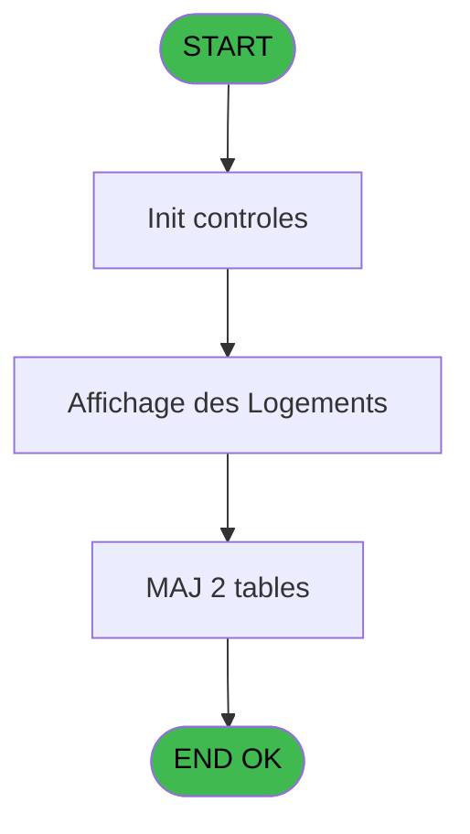
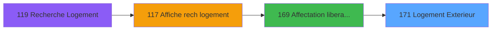
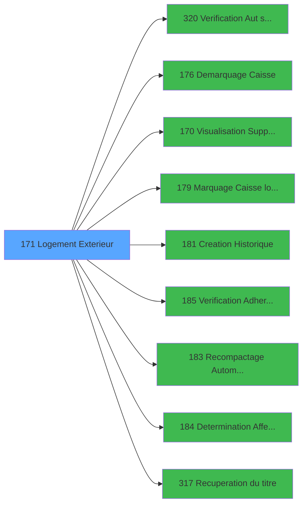

# PBG IDE 171 - Logement Exterieur

> **Analyse**: Phases 1-4 2026-02-03 09:55 -> 09:55 (17s) | Assemblage 09:55
> **Pipeline**: V7.2 Enrichi
> **Structure**: 4 onglets (Resume | Ecrans | Donnees | Connexions)

<!-- TAB:Resume -->

## 1. FICHE D'IDENTITE

| Attribut | Valeur |
|----------|--------|
| Projet | PBG |
| IDE Position | 171 |
| Nom Programme | Logement Exterieur |
| Fichier source | `Prg_171.xml` |
| Domaine metier | General |
| Taches | 26 (9 ecrans visibles) |
| Tables modifiees | 2 |
| Programmes appeles | 9 |

## 2. DESCRIPTION FONCTIONNELLE

**Logement Exterieur** assure la gestion complete de ce processus, accessible depuis [Affectation / liberation reche (IDE 169)](PBG-IDE-169.md).

Le flux de traitement s'organise en **6 blocs fonctionnels** :

- **Consultation** (8 taches) : ecrans de recherche, selection et consultation
- **Traitement** (8 taches) : traitements metier divers
- **Validation** (5 taches) : controles et verifications de coherence
- **Creation** (3 taches) : insertion d'enregistrements en base (mouvements, prestations)
- **Saisie** (1 tache) : ecrans de saisie utilisateur (formulaires, champs, donnees)
- **Calcul** (1 tache) : calculs de montants, stocks ou compteurs

**Donnees modifiees** : 2 tables en ecriture (hebergement______heb, historik_station).

**Logique metier** : 2 regles identifiees couvrant valeurs par defaut.

Detail : phases du traitement

#### Phase 1 : Traitement (8 taches)

- **171** - Logement Standard **[[ECRAN]](#ecran-t1)**
- **171.2** - Module des Logements **[[ECRAN]](#ecran-t3)**
- **171.2.4** - Traitement Adherents **[[ECRAN]](#ecran-t7)**
- **171.2.4.1** - Liberation Hebergement
- **171.2.4.2** - Effaçage Blocage
- **171.2.6.1.2** - Mise à Jour Hebergement
- **171.2.7** - Blocage Logement **[[ECRAN]](#ecran-t18)**
- **171.2.7.4** - Attribution N°Blocage

Delegue a : [Demarquage Caisse (IDE 176)](PBG-IDE-176.md), [  Visualisation Supplementaire (IDE 170)](PBG-IDE-170.md), [Marquage Caisse logique (IDE 179)](PBG-IDE-179.md), [Recompactage Automatique (IDE 183)](PBG-IDE-183.md), [Determination Affectation (IDE 184)](PBG-IDE-184.md), [Recuperation du titre (IDE 317)](PBG-IDE-317.md)

#### Phase 2 : Validation (5 taches)

- **171.1** - Verification Logement
- **171.2.3** - Verification Existence
- **171.2.6.1.4** - Verification Adherents
- **171.2.7.2** - Verification Logement
- **171.2.7.3** - Verification Blocage

Delegue a : [Verification Aut sans ecran (IDE 320)](PBG-IDE-320.md), [Verification Adherents (IDE 185)](PBG-IDE-185.md)

#### Phase 3 : Consultation (8 taches)

- **171.2.1** - Affichage Communicante **[[ECRAN]](#ecran-t4)**
- **171.2.2** - Affichage Proximite **[[ECRAN]](#ecran-t5)**
- **171.2.5** - Recherche Logement **[[ECRAN]](#ecran-t10)**
- **171.2.6** - Affichage Adherent batch **[[ECRAN]](#ecran-t11)**
- **171.2.6.1** - Affichage Adherents **[[ECRAN]](#ecran-t12)**
- **171.2.6.1.1** - Recherche Adherents **[[ECRAN]](#ecran-t13)**
- **171.2.7.4.1** - Recherche N°Blocage
- **171.2.8** - Affichage Logement **[[ECRAN]](#ecran-t26)**

Delegue a : [Recuperation du titre (IDE 317)](PBG-IDE-317.md)

#### Phase 4 : Creation (3 taches)

- **171.2.6.1.3** - Creation Historique
- **171.2.7.5** - Creation Blocage
- **171.2.7.6** - Creation Historique

Delegue a : [Creation Historique (IDE 181)](PBG-IDE-181.md)

#### Phase 5 : Calcul (1 tache)

- **171.2.6.1.5** - Calcul flag affectation

#### Phase 6 : Saisie (1 tache)

- **171.2.7.1** - Saisie Blocage **[[ECRAN]](#ecran-t19)**

#### Tables impactees

| Table | Operations | Role metier |
|-------|-----------|-------------|
| hebergement______heb | R/**W** (10 usages) | Hebergement (chambres) |
| historik_station | **W** (2 usages) | Historique / journal |

## 3. BLOCS FONCTIONNELS

### 3.1 Traitement (8 taches)

Traitements internes.

---

#### 171 - Logement Standard [[ECRAN]](#ecran-t1)

**Role** : Tache d'orchestration : point d'entree du programme (8 sous-taches). Coordonne l'enchainement des traitements.
**Ecran** : 175 x 90 DLU (MDI) | [Voir mockup](#ecran-t1)

7 sous-taches directes

| Tache | Nom | Bloc |
|-------|-----|------|
| [171.2](#t3) | Module des Logements **[[ECRAN]](#ecran-t3)** | Traitement |
| [171.2.4](#t7) | Traitement Adherents **[[ECRAN]](#ecran-t7)** | Traitement |
| [171.2.4.1](#t8) | Liberation Hebergement | Traitement |
| [171.2.4.2](#t9) | Effaçage Blocage | Traitement |
| [171.2.6.1.2](#t14) | Mise à Jour Hebergement | Traitement |
| [171.2.7](#t18) | Blocage Logement **[[ECRAN]](#ecran-t18)** | Traitement |
| [171.2.7.4](#t22) | Attribution N°Blocage | Traitement |

**Variables liees** : A (> logement)
**Delegue a** : [Demarquage Caisse (IDE 176)](PBG-IDE-176.md), [  Visualisation Supplementaire (IDE 170)](PBG-IDE-170.md), [Marquage Caisse logique (IDE 179)](PBG-IDE-179.md)

---

#### 171.2 - Module des Logements [[ECRAN]](#ecran-t3)

**Role** : Traitement : Module des Logements.
**Ecran** : 1248 x 279 DLU (MDI) | [Voir mockup](#ecran-t3)
**Delegue a** : [Demarquage Caisse (IDE 176)](PBG-IDE-176.md), [  Visualisation Supplementaire (IDE 170)](PBG-IDE-170.md), [Marquage Caisse logique (IDE 179)](PBG-IDE-179.md)

---

#### 171.2.4 - Traitement Adherents [[ECRAN]](#ecran-t7)

**Role** : Traitement : Traitement Adherents.
**Ecran** : 1055 x 96 DLU (MDI) | [Voir mockup](#ecran-t7)
**Delegue a** : [Demarquage Caisse (IDE 176)](PBG-IDE-176.md), [  Visualisation Supplementaire (IDE 170)](PBG-IDE-170.md), [Marquage Caisse logique (IDE 179)](PBG-IDE-179.md)

---

#### 171.2.4.1 - Liberation Hebergement

**Role** : Traitement : Liberation Hebergement.
**Delegue a** : [Demarquage Caisse (IDE 176)](PBG-IDE-176.md), [  Visualisation Supplementaire (IDE 170)](PBG-IDE-170.md), [Marquage Caisse logique (IDE 179)](PBG-IDE-179.md)

---

#### 171.2.4.2 - Effaçage Blocage

**Role** : Traitement : Effaçage Blocage.
**Delegue a** : [Demarquage Caisse (IDE 176)](PBG-IDE-176.md), [  Visualisation Supplementaire (IDE 170)](PBG-IDE-170.md), [Marquage Caisse logique (IDE 179)](PBG-IDE-179.md)

---

#### 171.2.6.1.2 - Mise à Jour Hebergement

**Role** : Traitement : Mise à Jour Hebergement.
**Delegue a** : [Demarquage Caisse (IDE 176)](PBG-IDE-176.md), [  Visualisation Supplementaire (IDE 170)](PBG-IDE-170.md), [Marquage Caisse logique (IDE 179)](PBG-IDE-179.md)

---

#### 171.2.7 - Blocage Logement [[ECRAN]](#ecran-t18)

**Role** : Traitement : Blocage Logement.
**Ecran** : 156 x 80 DLU (MDI) | [Voir mockup](#ecran-t18)
**Variables liees** : A (> logement)
**Delegue a** : [Demarquage Caisse (IDE 176)](PBG-IDE-176.md), [  Visualisation Supplementaire (IDE 170)](PBG-IDE-170.md), [Marquage Caisse logique (IDE 179)](PBG-IDE-179.md)

---

#### 171.2.7.4 - Attribution N°Blocage

**Role** : Traitement : Attribution N°Blocage.
**Delegue a** : [Demarquage Caisse (IDE 176)](PBG-IDE-176.md), [  Visualisation Supplementaire (IDE 170)](PBG-IDE-170.md), [Marquage Caisse logique (IDE 179)](PBG-IDE-179.md)

### 3.2 Validation (5 taches)

Controles de coherence : 5 taches verifient les donnees et conditions.

---

#### 171.1 - Verification Logement

**Role** : Verification : Verification Logement.
**Variables liees** : A (> logement)
**Delegue a** : [Verification Aut sans ecran (IDE 320)](PBG-IDE-320.md), [Verification Adherents (IDE 185)](PBG-IDE-185.md)

---

#### 171.2.3 - Verification Existence

**Role** : Verification : Verification Existence.
**Delegue a** : [Verification Aut sans ecran (IDE 320)](PBG-IDE-320.md), [Verification Adherents (IDE 185)](PBG-IDE-185.md)

---

#### 171.2.6.1.4 - Verification Adherents

**Role** : Verification : Verification Adherents.
**Delegue a** : [Verification Aut sans ecran (IDE 320)](PBG-IDE-320.md), [Verification Adherents (IDE 185)](PBG-IDE-185.md)

---

#### 171.2.7.2 - Verification Logement

**Role** : Verification : Verification Logement.
**Variables liees** : A (> logement)
**Delegue a** : [Verification Aut sans ecran (IDE 320)](PBG-IDE-320.md), [Verification Adherents (IDE 185)](PBG-IDE-185.md)

---

#### 171.2.7.3 - Verification Blocage

**Role** : Verification : Verification Blocage.
**Delegue a** : [Verification Aut sans ecran (IDE 320)](PBG-IDE-320.md), [Verification Adherents (IDE 185)](PBG-IDE-185.md)

### 3.3 Consultation (8 taches)

Ecrans de recherche et consultation.

---

#### 171.2.1 - Affichage Communicante [[ECRAN]](#ecran-t4)

**Role** : Reinitialisation : Affichage Communicante.
**Ecran** : 152 x 81 DLU (MDI) | [Voir mockup](#ecran-t4)

---

#### 171.2.2 - Affichage Proximite [[ECRAN]](#ecran-t5)

**Role** : Reinitialisation : Affichage Proximite.
**Ecran** : 151 x 81 DLU (MDI) | [Voir mockup](#ecran-t5)

---

#### 171.2.5 - Recherche Logement [[ECRAN]](#ecran-t10)

**Role** : Traitement : Recherche Logement.
**Ecran** : 542 x 111 DLU (MDI) | [Voir mockup](#ecran-t10)
**Variables liees** : A (> logement), G (W0-Recherche)

---

#### 171.2.6 - Affichage Adherent batch [[ECRAN]](#ecran-t11)

**Role** : Reinitialisation : Affichage Adherent batch.
**Ecran** : 1062 x 238 DLU (MDI) | [Voir mockup](#ecran-t11)

---

#### 171.2.6.1 - Affichage Adherents [[ECRAN]](#ecran-t12)

**Role** : Reinitialisation : Affichage Adherents.
**Ecran** : 952 x 265 DLU (MDI) | [Voir mockup](#ecran-t12)

---

#### 171.2.6.1.1 - Recherche Adherents [[ECRAN]](#ecran-t13)

**Role** : Traitement : Recherche Adherents.
**Ecran** : 542 x 113 DLU (MDI) | [Voir mockup](#ecran-t13)
**Variables liees** : G (W0-Recherche)

---

#### 171.2.7.4.1 - Recherche N°Blocage

**Role** : Traitement : Recherche N°Blocage.
**Variables liees** : G (W0-Recherche)

---

#### 171.2.8 - Affichage Logement [[ECRAN]](#ecran-t26)

**Role** : Reinitialisation : Affichage Logement.
**Ecran** : 509 x 154 DLU (MDI) | [Voir mockup](#ecran-t26)
**Variables liees** : A (> logement)

### 3.4 Creation (3 taches)

Insertion de nouveaux enregistrements en base.

---

#### 171.2.6.1.3 - Creation Historique

**Role** : Consultation/chargement : Creation Historique.
**Delegue a** : [Creation Historique (IDE 181)](PBG-IDE-181.md)

---

#### 171.2.7.5 - Creation Blocage

**Role** : Creation d'enregistrement : Creation Blocage.
**Delegue a** : [Creation Historique (IDE 181)](PBG-IDE-181.md)

---

#### 171.2.7.6 - Creation Historique

**Role** : Consultation/chargement : Creation Historique.
**Delegue a** : [Creation Historique (IDE 181)](PBG-IDE-181.md)

### 3.5 Calcul (1 tache)

Calculs metier : montants, stocks, compteurs.

---

#### 171.2.6.1.5 - Calcul flag affectation

**Role** : Calcul : Calcul flag affectation.

### 3.6 Saisie (1 tache)

L'operateur saisit les donnees de la transaction via 1 ecran (Saisie Blocage).

---

#### 171.2.7.1 - Saisie Blocage [[ECRAN]](#ecran-t19)

**Role** : Saisie des donnees : Saisie Blocage.
**Ecran** : 411 x 113 DLU (MDI) | [Voir mockup](#ecran-t19)

## 5. REGLES METIER

2 regles identifiees:

### Saisie (2 regles)

#### [RM-001] Valeur par defaut si W0-Code Societe [B] est vide

| Element | Detail |
|---------|--------|
| **Condition** | `W0-Code Societe [B]=''` |
| **Si vrai** | 'C' |
| **Si faux** | W0-Code Societe [B]) |
| **Variables** | B (W0-Code Societe) |
| **Expression source** | Expression 1 : `IF (W0-Code Societe [B]='','C',W0-Code Societe [B])` |
| **Exemple** | Si W0-Code Societe [B]='' → 'C'. Sinon → W0-Code Societe [B]) |
| **Impact** | Bloc Saisie |

#### [RM-002] Valeur par defaut si W0-Code Langue [C] est vide

| Element | Detail |
|---------|--------|
| **Condition** | `W0-Code Langue [C]=''` |
| **Si vrai** | 'F' |
| **Si faux** | W0-Code Langue [C]) |
| **Variables** | C (W0-Code Langue) |
| **Expression source** | Expression 2 : `IF (W0-Code Langue [C]='','F',W0-Code Langue [C])` |
| **Exemple** | Si W0-Code Langue [C]='' → 'F'. Sinon → W0-Code Langue [C]) |
| **Impact** | Bloc Saisie |

## 6. CONTEXTE

- **Appele par**: [Affectation / liberation reche (IDE 169)](PBG-IDE-169.md)
- **Appelle**: 9 programmes | **Tables**: 5 (W:2 R:4 L:2) | **Taches**: 26 | **Expressions**: 5

<!-- TAB:Ecrans -->

## 8. ECRANS

### 8.1 Forms visibles (9 / 26)

| # | Position | Tache | Nom | Type | Largeur | Hauteur | Bloc |
|---|----------|-------|-----|------|---------|---------|------|
| 1 | 171.2 | 171.2 | Module des Logements | MDI | 1248 | 279 | Traitement |
| 2 | 171.2.1 | 171.2.1 | Affichage Communicante | MDI | 152 | 81 | Consultation |
| 3 | 171.2.2 | 171.2.2 | Affichage Proximite | MDI | 151 | 81 | Consultation |
| 4 | 171.2.4 | 171.2.4 | Traitement Adherents | MDI | 1055 | 96 | Traitement |
| 5 | 171.2.5 | 171.2.5 | Recherche Logement | MDI | 542 | 111 | Consultation |
| 6 | 171.2.6.1 | 171.2.6.1 | Affichage Adherents | MDI | 952 | 265 | Consultation |
| 7 | 171.2.6.1.1 | 171.2.6.1.1 | Recherche Adherents | MDI | 542 | 113 | Consultation |
| 8 | 171.2.7.1 | 171.2.7.1 | Saisie Blocage | MDI | 411 | 113 | Saisie |
| 9 | 171.2.8 | 171.2.8 | Affichage Logement | MDI | 509 | 154 | Consultation |

### 8.2 Mockups Ecrans

---

#### 171.2 - Module des Logements
**Tache** : [171.2](#t3) | **Type** : MDI | **Dimensions** : 1248 x 279 DLU
**Bloc** : Traitement | **Titre IDE** : Module des Logements

<!-- FORM-DATA:
{
    "width":  1248,
    "vFactor":  8,
    "type":  "MDI",
    "hFactor":  8,
    "controls":  [
                     {
                         "x":  3,
                         "type":  "label",
                         "var":  "",
                         "y":  0,
                         "w":  1241,
                         "fmt":  "",
                         "name":  "",
                         "h":  20,
                         "color":  "",
                         "text":  "",
                         "parent":  null
                     },
                     {
                         "x":  1067,
                         "type":  "label",
                         "var":  "",
                         "y":  27,
                         "w":  175,
                         "fmt":  "",
                         "name":  "",
                         "h":  129,
                         "color":  "",
                         "text":  "",
                         "parent":  null
                     },
                     {
                         "x":  3,
                         "type":  "label",
                         "var":  "",
                         "y":  253,
                         "w":  1241,
                         "fmt":  "",
                         "name":  "",
                         "h":  24,
                         "color":  "",
                         "text":  "",
                         "parent":  null
                     },
                     {
                         "x":  7,
                         "type":  "table",
                         "var":  "",
                         "name":  "",
                         "titleH":  12,
                         "color":  "110",
                         "w":  179,
                         "y":  30,
                         "fmt":  "",
                         "parent":  null,
                         "text":  "",
                         "rowH":  15,
                         "h":  214,
                         "cols":  [
                                      {
                                          "title":  "Nom standard",
                                          "layer":  1,
                                          "w":  143
                                      }
                                  ],
                         "rows":  1
                     },
                     {
                         "x":  18,
                         "type":  "label",
                         "var":  "",
                         "y":  46,
                         "w":  21,
                         "fmt":  "",
                         "name":  "",
                         "h":  8,
                         "color":  "146",
                         "text":  "è",
                         "parent":  8
                     },
                     {
                         "x":  191,
                         "type":  "label",
                         "var":  "",
                         "y":  28,
                         "w":  840,
                         "fmt":  "",
                         "name":  "",
                         "h":  30,
                         "color":  "",
                         "text":  "",
                         "parent":  null
                     },
                     {
                         "x":  456,
                         "type":  "label",
                         "var":  "",
                         "y":  33,
                         "w":  78,
                         "fmt":  "",
                         "name":  "",
                         "h":  8,
                         "color":  "",
                         "text":  "Poste",
                         "parent":  12
                     },
                     {
                         "x":  562,
                         "type":  "label",
                         "var":  "",
                         "y":  33,
                         "w":  117,
                         "fmt":  "",
                         "name":  "",
                         "h":  8,
                         "color":  "",
                         "text":  "Zone menage",
                         "parent":  12
                     },
                     {
                         "x":  733,
                         "type":  "label",
                         "var":  "",
                         "y":  33,
                         "w":  154,
                         "fmt":  "",
                         "name":  "",
                         "h":  8,
                         "color":  "",
                         "text":  "Secteur menage",
                         "parent":  12
                     },
                     {
                         "x":  912,
                         "type":  "label",
                         "var":  "",
                         "y":  33,
                         "w":  74,
                         "fmt":  "",
                         "name":  "",
                         "h":  8,
                         "color":  "",
                         "text":  "Standing",
                         "parent":  12
                     },
                     {
                         "x":  190,
                         "type":  "label",
                         "var":  "",
                         "y":  58,
                         "w":  494,
                         "fmt":  "",
                         "name":  "",
                         "h":  96,
                         "color":  "195",
                         "text":  "Renseignements",
                         "parent":  null
                     },
                     {
                         "x":  509,
                         "type":  "label",
                         "var":  "",
                         "y":  68,
                         "w":  72,
                         "fmt":  "",
                         "name":  "",
                         "h":  8,
                         "color":  "",
                         "text":  "Lit Pliant",
                         "parent":  23
                     },
                     {
                         "x":  225,
                         "type":  "label",
                         "var":  "",
                         "y":  71,
                         "w":  91,
                         "fmt":  "",
                         "name":  "",
                         "h":  8,
                         "color":  "",
                         "text":  "Ensemble",
                         "parent":  23
                     },
                     {
                         "x":  507,
                         "type":  "label",
                         "var":  "",
                         "y":  84,
                         "w":  70,
                         "fmt":  "",
                         "name":  "",
                         "h":  8,
                         "color":  "",
                         "text":  "Lit Bebe",
                         "parent":  23
                     },
                     {
                         "x":  225,
                         "type":  "label",
                         "var":  "",
                         "y":  87,
                         "w":  93,
                         "fmt":  "",
                         "name":  "",
                         "h":  8,
                         "color":  "",
                         "text":  "Logement",
                         "parent":  23
                     },
                     {
                         "x":  507,
                         "type":  "label",
                         "var":  "",
                         "y":  99,
                         "w":  86,
                         "fmt":  "",
                         "name":  "",
                         "h":  8,
                         "color":  "",
                         "text":  "Banquette",
                         "parent":  23
                     },
                     {
                         "x":  225,
                         "type":  "label",
                         "var":  "",
                         "y":  102,
                         "w":  80,
                         "fmt":  "",
                         "name":  "",
                         "h":  8,
                         "color":  "",
                         "text":  "Batiment",
                         "parent":  23
                     },
                     {
                         "x":  225,
                         "type":  "label",
                         "var":  "",
                         "y":  115,
                         "w":  53,
                         "fmt":  "",
                         "name":  "",
                         "h":  8,
                         "color":  "",
                         "text":  "Etage",
                         "parent":  23
                     },
                     {
                         "x":  507,
                         "type":  "label",
                         "var":  "",
                         "y":  125,
                         "w":  91,
                         "fmt":  "",
                         "name":  "",
                         "h":  8,
                         "color":  "",
                         "text":  "Handicape",
                         "parent":  23
                     },
                     {
                         "x":  225,
                         "type":  "label",
                         "var":  "",
                         "y":  129,
                         "w":  38,
                         "fmt":  "",
                         "name":  "",
                         "h":  8,
                         "color":  "",
                         "text":  "Vue",
                         "parent":  23
                     },
                     {
                         "x":  507,
                         "type":  "label",
                         "var":  "",
                         "y":  143,
                         "w":  91,
                         "fmt":  "",
                         "name":  "",
                         "h":  8,
                         "color":  "",
                         "text":  "Communi.",
                         "parent":  23
                     },
                     {
                         "x":  225,
                         "type":  "label",
                         "var":  "",
                         "y":  144,
                         "w":  96,
                         "fmt":  "",
                         "name":  "",
                         "h":  8,
                         "color":  "",
                         "text":  "Occupation",
                         "parent":  23
                     },
                     {
                         "x":  710,
                         "type":  "label",
                         "var":  "",
                         "y":  57,
                         "w":  319,
                         "fmt":  "",
                         "name":  "",
                         "h":  96,
                         "color":  "195",
                         "text":  "Chambres voisines",
                         "parent":  null
                     },
                     {
                         "x":  58,
                         "type":  "edit",
                         "var":  "",
                         "y":  46,
                         "w":  75,
                         "fmt":  "",
                         "name":  "NOM STANDARD",
                         "h":  8,
                         "color":  "110",
                         "text":  "",
                         "parent":  8
                     },
                     {
                         "x":  218,
                         "type":  "edit",
                         "var":  "",
                         "y":  39,
                         "w":  182,
                         "fmt":  "",
                         "name":  "",
                         "h":  10,
                         "color":  "142",
                         "text":  "",
                         "parent":  12
                     },
                     {
                         "x":  455,
                         "type":  "edit",
                         "var":  "",
                         "y":  45,
                         "w":  82,
                         "fmt":  "",
                         "name":  "",
                         "h":  10,
                         "color":  "",
                         "text":  "",
                         "parent":  12
                     },
                     {
                         "x":  931,
                         "type":  "edit",
                         "var":  "",
                         "y":  45,
                         "w":  37,
                         "fmt":  "",
                         "name":  "",
                         "h":  10,
                         "color":  "",
                         "text":  "",
                         "parent":  12
                     },
                     {
                         "x":  341,
                         "type":  "edit",
                         "var":  "",
                         "y":  71,
                         "w":  42,
                         "fmt":  "",
                         "name":  "ENSEMBLE",
                         "h":  8,
                         "color":  "",
                         "text":  "",
                         "parent":  23
                     },
                     {
                         "x":  341,
                         "type":  "edit",
                         "var":  "",
                         "y":  87,
                         "w":  42,
                         "fmt":  "",
                         "name":  "",
                         "h":  8,
                         "color":  "",
                         "text":  "",
                         "parent":  23
                     },
                     {
                         "x":  341,
                         "type":  "edit",
                         "var":  "",
                         "y":  102,
                         "w":  42,
                         "fmt":  "",
                         "name":  "",
                         "h":  8,
                         "color":  "",
                         "text":  "",
                         "parent":  23
                     },
                     {
                         "x":  341,
                         "type":  "edit",
                         "var":  "",
                         "y":  115,
                         "w":  42,
                         "fmt":  "",
                         "name":  "",
                         "h":  8,
                         "color":  "",
                         "text":  "",
                         "parent":  23
                     },
                     {
                         "x":  341,
                         "type":  "edit",
                         "var":  "",
                         "y":  129,
                         "w":  42,
                         "fmt":  "",
                         "name":  "",
                         "h":  8,
                         "color":  "",
                         "text":  "",
                         "parent":  23
                     },
                     {
                         "x":  341,
                         "type":  "edit",
                         "var":  "",
                         "y":  144,
                         "w":  42,
                         "fmt":  "#2LZ",
                         "name":  "",
                         "h":  8,
                         "color":  "",
                         "text":  "",
                         "parent":  23
                     },
                     {
                         "x":  584,
                         "type":  "edit",
                         "var":  "",
                         "y":  45,
                         "w":  48,
                         "fmt":  "",
                         "name":  "LOM Zone Menage",
                         "h":  10,
                         "color":  "",
                         "text":  "",
                         "parent":  12
                     },
                     {
                         "x":  791,
                         "type":  "edit",
                         "var":  "",
                         "y":  45,
                         "w":  48,
                         "fmt":  "",
                         "name":  "LOM Secteur Menage",
                         "h":  10,
                         "color":  "",
                         "text":  "",
                         "parent":  12
                     },
                     {
                         "x":  1078,
                         "type":  "button",
                         "var":  "",
                         "y":  32,
                         "w":  154,
                         "fmt":  "",
                         "name":  "B_Affecter",
                         "h":  18,
                         "color":  "",
                         "text":  "",
                         "parent":  null
                     },
                     {
                         "x":  1080,
                         "type":  "button",
                         "var":  "",
                         "y":  65,
                         "w":  154,
                         "fmt":  "",
                         "name":  "B_Reaffecter",
                         "h":  18,
                         "color":  "",
                         "text":  "",
                         "parent":  null
                     },
                     {
                         "x":  1035,
                         "type":  "edit",
                         "var":  "",
                         "y":  5,
                         "w":  203,
                         "fmt":  "WWW DD MMM YYYYT",
                         "name":  "",
                         "h":  8,
                         "color":  "",
                         "text":  "",
                         "parent":  1
                     },
                     {
                         "x":  9,
                         "type":  "edit",
                         "var":  "",
                         "y":  6,
                         "w":  396,
                         "fmt":  "30",
                         "name":  "",
                         "h":  8,
                         "color":  "",
                         "text":  "",
                         "parent":  1
                     },
                     {
                         "x":  12,
                         "type":  "image",
                         "var":  "",
                         "y":  62,
                         "w":  165,
                         "fmt":  "",
                         "name":  "",
                         "h":  58,
                         "color":  "",
                         "text":  "",
                         "parent":  null
                     },
                     {
                         "x":  608,
                         "type":  "edit",
                         "var":  "",
                         "y":  68,
                         "w":  53,
                         "fmt":  "4",
                         "name":  "",
                         "h":  8,
                         "color":  "",
                         "text":  "",
                         "parent":  23
                     },
                     {
                         "x":  608,
                         "type":  "edit",
                         "var":  "",
                         "y":  84,
                         "w":  53,
                         "fmt":  "4",
                         "name":  "",
                         "h":  8,
                         "color":  "",
                         "text":  "",
                         "parent":  23
                     },
                     {
                         "x":  1078,
                         "type":  "button",
                         "var":  "",
                         "y":  98,
                         "w":  154,
                         "fmt":  "\u0026Bloquer",
                         "name":  "",
                         "h":  18,
                         "color":  "",
                         "text":  "",
                         "parent":  null
                     },
                     {
                         "x":  608,
                         "type":  "edit",
                         "var":  "",
                         "y":  99,
                         "w":  53,
                         "fmt":  "4",
                         "name":  "",
                         "h":  8,
                         "color":  "",
                         "text":  "",
                         "parent":  23
                     },
                     {
                         "x":  608,
                         "type":  "edit",
                         "var":  "",
                         "y":  125,
                         "w":  53,
                         "fmt":  "4",
                         "name":  "",
                         "h":  8,
                         "color":  "",
                         "text":  "",
                         "parent":  23
                     },
                     {
                         "x":  1078,
                         "type":  "button",
                         "var":  "",
                         "y":  131,
                         "w":  154,
                         "fmt":  "\u0026Visualiser",
                         "name":  "",
                         "h":  18,
                         "color":  "",
                         "text":  "",
                         "parent":  null
                     },
                     {
                         "x":  608,
                         "type":  "edit",
                         "var":  "",
                         "y":  143,
                         "w":  53,
                         "fmt":  "4",
                         "name":  "",
                         "h":  8,
                         "color":  "",
                         "text":  "",
                         "parent":  23
                     },
                     {
                         "x":  12,
                         "type":  "image",
                         "var":  "",
                         "y":  183,
                         "w":  163,
                         "fmt":  "",
                         "name":  "",
                         "h":  44,
                         "color":  "",
                         "text":  "",
                         "parent":  null
                     },
                     {
                         "x":  17,
                         "type":  "button",
                         "var":  "",
                         "y":  256,
                         "w":  154,
                         "fmt":  "\u0026Quitter",
                         "name":  "",
                         "h":  18,
                         "color":  "",
                         "text":  "",
                         "parent":  7
                     },
                     {
                         "x":  1081,
                         "type":  "button",
                         "var":  "",
                         "y":  256,
                         "w":  154,
                         "fmt":  "\u0026Rechercher",
                         "name":  "",
                         "h":  18,
                         "color":  "",
                         "text":  "",
                         "parent":  null
                     },
                     {
                         "x":  713,
                         "type":  "subform",
                         "var":  "",
                         "y":  66,
                         "w":  155,
                         "fmt":  "",
                         "name":  "Affichage Communicante",
                         "h":  85,
                         "color":  "",
                         "text":  "",
                         "parent":  46
                     },
                     {
                         "x":  870,
                         "type":  "subform",
                         "var":  "",
                         "y":  66,
                         "w":  155,
                         "fmt":  "",
                         "name":  "Affichage Proximite",
                         "h":  85,
                         "color":  "",
                         "text":  "",
                         "parent":  46
                     },
                     {
                         "x":  187,
                         "type":  "subform",
                         "var":  "",
                         "y":  156,
                         "w":  875,
                         "fmt":  "",
                         "name":  "SFADH",
                         "h":  94,
                         "color":  "",
                         "text":  "",
                         "parent":  null
                     }
                 ],
    "taskId":  "171.2",
    "height":  279
}
-->

<strong>Champs : 19 champs</strong>

| Pos (x,y) | Nom | Variable | Type |
|-----------|-----|----------|------|
| 58,46 | NOM STANDARD | - | edit |
| 218,39 | (sans nom) | - | edit |
| 455,45 | (sans nom) | - | edit |
| 931,45 | (sans nom) | - | edit |
| 341,71 | ENSEMBLE | - | edit |
| 341,87 | (sans nom) | - | edit |
| 341,102 | (sans nom) | - | edit |
| 341,115 | (sans nom) | - | edit |
| 341,129 | (sans nom) | - | edit |
| 341,144 | #2LZ | - | edit |
| 584,45 | LOM Zone Menage | - | edit |
| 791,45 | LOM Secteur Menage | - | edit |
| 1035,5 | WWW DD MMM YYYYT | - | edit |
| 9,6 | 30 | - | edit |
| 608,68 | 4 | - | edit |
| 608,84 | 4 | - | edit |
| 608,99 | 4 | - | edit |
| 608,125 | 4 | - | edit |
| 608,143 | 4 | - | edit |

<strong>Boutons : 6 boutons</strong>

| Bouton | Pos (x,y) | Action |
|--------|-----------|--------|
| B_Affecter | 1078,32 | Bouton fonctionnel |
| B_Reaffecter | 1080,65 | Bouton fonctionnel |
| Bloquer | 1078,98 | Bouton fonctionnel |
| Visualiser | 1078,131 | Appel [  Visualisation Supplementaire (IDE 170)](PBG-IDE-170.md) |
| Quitter | 17,256 | Quitte le programme |
| Rechercher | 1081,256 | Ouvre la selection |

---

#### 171.2.1 - Affichage Communicante
**Tache** : [171.2.1](#t4) | **Type** : MDI | **Dimensions** : 152 x 81 DLU
**Bloc** : Consultation | **Titre IDE** : Affichage Communicante

<!-- FORM-DATA:
{
    "width":  152,
    "vFactor":  8,
    "type":  "MDI",
    "hFactor":  8,
    "controls":  [
                     {
                         "x":  0,
                         "type":  "table",
                         "var":  "",
                         "name":  "",
                         "titleH":  12,
                         "color":  "110",
                         "w":  152,
                         "y":  1,
                         "fmt":  "",
                         "parent":  null,
                         "text":  "",
                         "rowH":  12,
                         "h":  75,
                         "cols":  [
                                      {
                                          "title":  "Communicantes",
                                          "layer":  1,
                                          "w":  146
                                      }
                                  ],
                         "rows":  1
                     },
                     {
                         "x":  21,
                         "type":  "edit",
                         "var":  "",
                         "y":  16,
                         "w":  75,
                         "fmt":  "",
                         "name":  "",
                         "h":  8,
                         "color":  "110",
                         "text":  "",
                         "parent":  1
                     }
                 ],
    "taskId":  "171.2.1",
    "height":  81
}
-->

<strong>Champs : 1 champs</strong>

| Pos (x,y) | Nom | Variable | Type |
|-----------|-----|----------|------|
| 21,16 | (sans nom) | - | edit |

---

#### 171.2.2 - Affichage Proximite
**Tache** : [171.2.2](#t5) | **Type** : MDI | **Dimensions** : 151 x 81 DLU
**Bloc** : Consultation | **Titre IDE** : Affichage Proximite

<!-- FORM-DATA:
{
    "width":  151,
    "vFactor":  8,
    "type":  "MDI",
    "hFactor":  8,
    "controls":  [
                     {
                         "x":  0,
                         "type":  "table",
                         "var":  "",
                         "name":  "",
                         "titleH":  12,
                         "color":  "110",
                         "w":  150,
                         "y":  1,
                         "fmt":  "",
                         "parent":  null,
                         "text":  "",
                         "rowH":  12,
                         "h":  75,
                         "cols":  [
                                      {
                                          "title":  "Proximité",
                                          "layer":  1,
                                          "w":  144
                                      }
                                  ],
                         "rows":  1
                     },
                     {
                         "x":  21,
                         "type":  "edit",
                         "var":  "",
                         "y":  16,
                         "w":  75,
                         "fmt":  "",
                         "name":  "",
                         "h":  8,
                         "color":  "110",
                         "text":  "",
                         "parent":  1
                     }
                 ],
    "taskId":  "171.2.2",
    "height":  81
}
-->

<strong>Champs : 1 champs</strong>

| Pos (x,y) | Nom | Variable | Type |
|-----------|-----|----------|------|
| 21,16 | (sans nom) | - | edit |

---

#### 171.2.4 - Traitement Adherents
**Tache** : [171.2.4](#t7) | **Type** : MDI | **Dimensions** : 1055 x 96 DLU
**Bloc** : Traitement | **Titre IDE** : Traitement Adherents

<!-- FORM-DATA:
{
    "width":  1055,
    "vFactor":  8,
    "type":  "MDI",
    "hFactor":  8,
    "controls":  [
                     {
                         "x":  884,
                         "type":  "label",
                         "var":  "",
                         "y":  6,
                         "w":  169,
                         "fmt":  "",
                         "name":  "",
                         "h":  75,
                         "color":  "",
                         "text":  "",
                         "parent":  null
                     },
                     {
                         "x":  8,
                         "type":  "table",
                         "var":  "",
                         "name":  "",
                         "titleH":  12,
                         "color":  "7",
                         "w":  794,
                         "y":  2,
                         "fmt":  "",
                         "parent":  null,
                         "text":  "",
                         "rowH":  11,
                         "h":  91,
                         "cols":  [
                                      {
                                          "title":  "Age",
                                          "layer":  1,
                                          "w":  318
                                      },
                                      {
                                          "title":  "Date Deb/Heure",
                                          "layer":  2,
                                          "w":  138
                                      },
                                      {
                                          "title":  "Date fin/Heure",
                                          "layer":  3,
                                          "w":  133
                                      },
                                      {
                                          "title":  "Nat.",
                                          "layer":  4,
                                          "w":  45
                                      },
                                      {
                                          "title":  "Age",
                                          "layer":  5,
                                          "w":  52
                                      },
                                      {
                                          "title":  "Fumeur",
                                          "layer":  6,
                                          "w":  67
                                      }
                                  ],
                         "rows":  6
                     },
                     {
                         "x":  19,
                         "type":  "edit",
                         "var":  "",
                         "y":  18,
                         "w":  30,
                         "fmt":  "",
                         "name":  "",
                         "h":  8,
                         "color":  "110",
                         "text":  "",
                         "parent":  2
                     },
                     {
                         "x":  98,
                         "type":  "edit",
                         "var":  "",
                         "y":  18,
                         "w":  221,
                         "fmt":  "",
                         "name":  "HEB Libelle",
                         "h":  8,
                         "color":  "110",
                         "text":  "",
                         "parent":  2
                     },
                     {
                         "x":  334,
                         "type":  "edit",
                         "var":  "",
                         "y":  18,
                         "w":  64,
                         "fmt":  "##/##",
                         "name":  "",
                         "h":  8,
                         "color":  "110",
                         "text":  "",
                         "parent":  2
                     },
                     {
                         "x":  405,
                         "type":  "edit",
                         "var":  "",
                         "y":  18,
                         "w":  42,
                         "fmt":  "UUh",
                         "name":  "",
                         "h":  8,
                         "color":  "110",
                         "text":  "",
                         "parent":  2
                     },
                     {
                         "x":  474,
                         "type":  "edit",
                         "var":  "",
                         "y":  18,
                         "w":  64,
                         "fmt":  "##/##",
                         "name":  "",
                         "h":  8,
                         "color":  "110",
                         "text":  "",
                         "parent":  2
                     },
                     {
                         "x":  550,
                         "type":  "edit",
                         "var":  "",
                         "y":  18,
                         "w":  42,
                         "fmt":  "UUh",
                         "name":  "",
                         "h":  8,
                         "color":  "110",
                         "text":  "",
                         "parent":  2
                     },
                     {
                         "x":  606,
                         "type":  "edit",
                         "var":  "",
                         "y":  18,
                         "w":  30,
                         "fmt":  "",
                         "name":  "",
                         "h":  8,
                         "color":  "110",
                         "text":  "",
                         "parent":  2
                     },
                     {
                         "x":  892,
                         "type":  "button",
                         "var":  "",
                         "y":  20,
                         "w":  154,
                         "fmt":  "",
                         "name":  "bouton Liberer",
                         "h":  18,
                         "color":  "",
                         "text":  "",
                         "parent":  null
                     },
                     {
                         "x":  64,
                         "type":  "edit",
                         "var":  "",
                         "y":  18,
                         "w":  30,
                         "fmt":  "UX",
                         "name":  "",
                         "h":  8,
                         "color":  "110",
                         "text":  "",
                         "parent":  2
                     },
                     {
                         "x":  650,
                         "type":  "edit",
                         "var":  "",
                         "y":  18,
                         "w":  43,
                         "fmt":  "#2Z",
                         "name":  "heb_age_num",
                         "h":  8,
                         "color":  "110",
                         "text":  "",
                         "parent":  2
                     },
                     {
                         "x":  702,
                         "type":  "edit",
                         "var":  "",
                         "y":  18,
                         "w":  42,
                         "fmt":  "UX2",
                         "name":  "",
                         "h":  8,
                         "color":  "110",
                         "text":  "",
                         "parent":  2
                     },
                     {
                         "x":  891,
                         "type":  "button",
                         "var":  "",
                         "y":  50,
                         "w":  154,
                         "fmt":  "\u0026Visualiser",
                         "name":  "",
                         "h":  18,
                         "color":  "",
                         "text":  "",
                         "parent":  null
                     }
                 ],
    "taskId":  "171.2.4",
    "height":  96
}
-->

<strong>Champs : 10 champs</strong>

| Pos (x,y) | Nom | Variable | Type |
|-----------|-----|----------|------|
| 19,18 | (sans nom) | - | edit |
| 98,18 | HEB Libelle | - | edit |
| 334,18 | ##/## | - | edit |
| 405,18 | UUh | - | edit |
| 474,18 | ##/## | - | edit |
| 550,18 | UUh | - | edit |
| 606,18 | (sans nom) | - | edit |
| 64,18 | UX | - | edit |
| 650,18 | heb_age_num | - | edit |
| 702,18 | UX2 | - | edit |

<strong>Boutons : 2 boutons</strong>

| Bouton | Pos (x,y) | Action |
|--------|-----------|--------|
| Liberer | 892,20 | Bouton fonctionnel |
| Visualiser | 891,50 | Appel [  Visualisation Supplementaire (IDE 170)](PBG-IDE-170.md) |

---

#### 171.2.5 - Recherche Logement
**Tache** : [171.2.5](#t10) | **Type** : MDI | **Dimensions** : 542 x 111 DLU
**Bloc** : Consultation | **Titre IDE** : Recherche Logement

<!-- FORM-DATA:
{
    "width":  542,
    "vFactor":  8,
    "type":  "MDI",
    "hFactor":  8,
    "controls":  [
                     {
                         "x":  0,
                         "type":  "label",
                         "var":  "",
                         "y":  1,
                         "w":  530,
                         "fmt":  "",
                         "name":  "",
                         "h":  19,
                         "color":  "",
                         "text":  "",
                         "parent":  null
                     },
                     {
                         "x":  170,
                         "type":  "label",
                         "var":  "",
                         "y":  34,
                         "w":  340,
                         "fmt":  "",
                         "name":  "",
                         "h":  37,
                         "color":  "",
                         "text":  "",
                         "parent":  null
                     },
                     {
                         "x":  173,
                         "type":  "label",
                         "var":  "",
                         "y":  35,
                         "w":  334,
                         "fmt":  "",
                         "name":  "",
                         "h":  35,
                         "color":  "",
                         "text":  "",
                         "parent":  null
                     },
                     {
                         "x":  190,
                         "type":  "label",
                         "var":  "",
                         "y":  49,
                         "w":  197,
                         "fmt":  "",
                         "name":  "",
                         "h":  8,
                         "color":  "",
                         "text":  "Entrer les première lettres",
                         "parent":  6
                     },
                     {
                         "x":  0,
                         "type":  "label",
                         "var":  "",
                         "y":  85,
                         "w":  531,
                         "fmt":  "",
                         "name":  "",
                         "h":  24,
                         "color":  "",
                         "text":  "",
                         "parent":  null
                     },
                     {
                         "x":  391,
                         "type":  "edit",
                         "var":  "",
                         "y":  48,
                         "w":  82,
                         "fmt":  "",
                         "name":  "",
                         "h":  10,
                         "color":  "110",
                         "text":  "",
                         "parent":  6
                     },
                     {
                         "x":  5,
                         "type":  "edit",
                         "var":  "",
                         "y":  6,
                         "w":  267,
                         "fmt":  "120",
                         "name":  "",
                         "h":  8,
                         "color":  "",
                         "text":  "",
                         "parent":  null
                     },
                     {
                         "x":  4,
                         "type":  "image",
                         "var":  "",
                         "y":  23,
                         "w":  154,
                         "fmt":  "",
                         "name":  "",
                         "h":  59,
                         "color":  "",
                         "text":  "",
                         "parent":  null
                     },
                     {
                         "x":  7,
                         "type":  "button",
                         "var":  "",
                         "y":  88,
                         "w":  154,
                         "fmt":  "\u0026Valider",
                         "name":  "",
                         "h":  18,
                         "color":  "",
                         "text":  "",
                         "parent":  null
                     },
                     {
                         "x":  368,
                         "type":  "button",
                         "var":  "",
                         "y":  88,
                         "w":  154,
                         "fmt":  "\u0026Abandonner",
                         "name":  "",
                         "h":  18,
                         "color":  "",
                         "text":  "",
                         "parent":  null
                     },
                     {
                         "x":  284,
                         "type":  "edit",
                         "var":  "",
                         "y":  4,
                         "w":  233,
                         "fmt":  "WWW DD MMM YYYYT",
                         "name":  "",
                         "h":  12,
                         "color":  "",
                         "text":  "",
                         "parent":  null
                     }
                 ],
    "taskId":  "171.2.5",
    "height":  111
}
-->

<strong>Champs : 3 champs</strong>

| Pos (x,y) | Nom | Variable | Type |
|-----------|-----|----------|------|
| 391,48 | (sans nom) | - | edit |
| 5,6 | 120 | - | edit |
| 284,4 | WWW DD MMM YYYYT | - | edit |

<strong>Boutons : 2 boutons</strong>

| Bouton | Pos (x,y) | Action |
|--------|-----------|--------|
| Valider | 7,88 | Valide la saisie et enregistre |
| Abandonner | 368,88 | Annule et retour au menu |

---

#### 171.2.6.1 - Affichage Adherents
**Tache** : [171.2.6.1](#t12) | **Type** : MDI | **Dimensions** : 952 x 265 DLU
**Bloc** : Consultation | **Titre IDE** : Affichage Adherents

<!-- FORM-DATA:
{
    "width":  952,
    "vFactor":  8,
    "type":  "MDI",
    "hFactor":  8,
    "controls":  [
                     {
                         "x":  0,
                         "type":  "label",
                         "var":  "",
                         "y":  240,
                         "w":  926,
                         "fmt":  "",
                         "name":  "",
                         "h":  20,
                         "color":  "",
                         "text":  "",
                         "parent":  null
                     },
                     {
                         "x":  9,
                         "type":  "table",
                         "var":  "",
                         "name":  "",
                         "titleH":  14,
                         "color":  "7",
                         "w":  936,
                         "y":  4,
                         "fmt":  "",
                         "parent":  null,
                         "text":  "",
                         "rowH":  15,
                         "h":  230,
                         "cols":  [
                                      {
                                          "title":  "Nom",
                                          "layer":  1,
                                          "w":  350
                                      },
                                      {
                                          "title":  "Date/Heure début",
                                          "layer":  2,
                                          "w":  170
                                      },
                                      {
                                          "title":  "Date/heure fin",
                                          "layer":  3,
                                          "w":  144
                                      },
                                      {
                                          "title":  "Logement",
                                          "layer":  4,
                                          "w":  238
                                      }
                                  ],
                         "rows":  4
                     },
                     {
                         "x":  126,
                         "type":  "edit",
                         "var":  "",
                         "y":  22,
                         "w":  221,
                         "fmt":  "",
                         "name":  "HEB Libelle",
                         "h":  10,
                         "color":  "110",
                         "text":  "",
                         "parent":  2
                     },
                     {
                         "x":  386,
                         "type":  "edit",
                         "var":  "",
                         "y":  22,
                         "w":  64,
                         "fmt":  "##/##",
                         "name":  "",
                         "h":  10,
                         "color":  "110",
                         "text":  "",
                         "parent":  2
                     },
                     {
                         "x":  464,
                         "type":  "edit",
                         "var":  "",
                         "y":  22,
                         "w":  42,
                         "fmt":  "UUh",
                         "name":  "",
                         "h":  10,
                         "color":  "110",
                         "text":  "",
                         "parent":  2
                     },
                     {
                         "x":  547,
                         "type":  "edit",
                         "var":  "",
                         "y":  22,
                         "w":  64,
                         "fmt":  "##/##",
                         "name":  "",
                         "h":  10,
                         "color":  "110",
                         "text":  "",
                         "parent":  2
                     },
                     {
                         "x":  619,
                         "type":  "edit",
                         "var":  "",
                         "y":  22,
                         "w":  42,
                         "fmt":  "UUh",
                         "name":  "",
                         "h":  10,
                         "color":  "110",
                         "text":  "",
                         "parent":  2
                     },
                     {
                         "x":  696,
                         "type":  "edit",
                         "var":  "",
                         "y":  22,
                         "w":  75,
                         "fmt":  "",
                         "name":  "",
                         "h":  10,
                         "color":  "110",
                         "text":  "",
                         "parent":  2
                     },
                     {
                         "x":  789,
                         "type":  "edit",
                         "var":  "",
                         "y":  22,
                         "w":  19,
                         "fmt":  "",
                         "name":  "",
                         "h":  10,
                         "color":  "110",
                         "text":  "",
                         "parent":  2
                     },
                     {
                         "x":  822,
                         "type":  "edit",
                         "var":  "",
                         "y":  22,
                         "w":  75,
                         "fmt":  "",
                         "name":  "",
                         "h":  10,
                         "color":  "110",
                         "text":  "",
                         "parent":  2
                     },
                     {
                         "x":  26,
                         "type":  "edit",
                         "var":  "",
                         "y":  22,
                         "w":  35,
                         "fmt":  "",
                         "name":  "",
                         "h":  10,
                         "color":  "110",
                         "text":  "",
                         "parent":  2
                     },
                     {
                         "x":  10,
                         "type":  "button",
                         "var":  "",
                         "y":  243,
                         "w":  154,
                         "fmt":  "\u0026Selectionner",
                         "name":  "Btn selectionner",
                         "h":  14,
                         "color":  "",
                         "text":  "",
                         "parent":  1
                     },
                     {
                         "x":  77,
                         "type":  "edit",
                         "var":  "",
                         "y":  22,
                         "w":  30,
                         "fmt":  "UX",
                         "name":  "",
                         "h":  10,
                         "color":  "110",
                         "text":  "",
                         "parent":  2
                     },
                     {
                         "x":  172,
                         "type":  "button",
                         "var":  "",
                         "y":  243,
                         "w":  154,
                         "fmt":  "\u0026Quitter",
                         "name":  "",
                         "h":  14,
                         "color":  "",
                         "text":  "",
                         "parent":  1
                     },
                     {
                         "x":  602,
                         "type":  "button",
                         "var":  "",
                         "y":  243,
                         "w":  154,
                         "fmt":  "\u0026Rechercher",
                         "name":  "",
                         "h":  14,
                         "color":  "",
                         "text":  "",
                         "parent":  null
                     },
                     {
                         "x":  764,
                         "type":  "button",
                         "var":  "",
                         "y":  243,
                         "w":  154,
                         "fmt":  "\u0026Visualiser",
                         "name":  "",
                         "h":  14,
                         "color":  "",
                         "text":  "",
                         "parent":  null
                     }
                 ],
    "taskId":  "171.2.6.1",
    "height":  265
}
-->

<strong>Champs : 10 champs</strong>

| Pos (x,y) | Nom | Variable | Type |
|-----------|-----|----------|------|
| 126,22 | HEB Libelle | - | edit |
| 386,22 | ##/## | - | edit |
| 464,22 | UUh | - | edit |
| 547,22 | ##/## | - | edit |
| 619,22 | UUh | - | edit |
| 696,22 | (sans nom) | - | edit |
| 789,22 | (sans nom) | - | edit |
| 822,22 | (sans nom) | - | edit |
| 26,22 | (sans nom) | - | edit |
| 77,22 | UX | - | edit |

<strong>Boutons : 4 boutons</strong>

| Bouton | Pos (x,y) | Action |
|--------|-----------|--------|
| Selectionner | 10,243 | Ouvre la selection |
| Quitter | 172,243 | Quitte le programme |
| Rechercher | 602,243 | Ouvre la selection |
| Visualiser | 764,243 | Appel [  Visualisation Supplementaire (IDE 170)](PBG-IDE-170.md) |

---

#### 171.2.6.1.1 - Recherche Adherents
**Tache** : [171.2.6.1.1](#t13) | **Type** : MDI | **Dimensions** : 542 x 113 DLU
**Bloc** : Consultation | **Titre IDE** : Recherche Adherents

<!-- FORM-DATA:
{
    "width":  542,
    "vFactor":  8,
    "type":  "MDI",
    "hFactor":  8,
    "controls":  [
                     {
                         "x":  0,
                         "type":  "label",
                         "var":  "",
                         "y":  1,
                         "w":  530,
                         "fmt":  "",
                         "name":  "",
                         "h":  19,
                         "color":  "",
                         "text":  "",
                         "parent":  null
                     },
                     {
                         "x":  154,
                         "type":  "label",
                         "var":  "",
                         "y":  34,
                         "w":  375,
                         "fmt":  "",
                         "name":  "",
                         "h":  37,
                         "color":  "",
                         "text":  "",
                         "parent":  null
                     },
                     {
                         "x":  161,
                         "type":  "label",
                         "var":  "",
                         "y":  49,
                         "w":  197,
                         "fmt":  "",
                         "name":  "",
                         "h":  8,
                         "color":  "",
                         "text":  "Entrer les première lettres",
                         "parent":  null
                     },
                     {
                         "x":  0,
                         "type":  "label",
                         "var":  "",
                         "y":  85,
                         "w":  531,
                         "fmt":  "",
                         "name":  "",
                         "h":  24,
                         "color":  "",
                         "text":  "",
                         "parent":  null
                     },
                     {
                         "x":  357,
                         "type":  "edit",
                         "var":  "",
                         "y":  48,
                         "w":  166,
                         "fmt":  "",
                         "name":  "",
                         "h":  10,
                         "color":  "110",
                         "text":  "",
                         "parent":  null
                     },
                     {
                         "x":  260,
                         "type":  "edit",
                         "var":  "",
                         "y":  6,
                         "w":  262,
                         "fmt":  "WWW DD MMM YYYYT",
                         "name":  "",
                         "h":  8,
                         "color":  "",
                         "text":  "",
                         "parent":  null
                     },
                     {
                         "x":  4,
                         "type":  "image",
                         "var":  "",
                         "y":  23,
                         "w":  154,
                         "fmt":  "",
                         "name":  "",
                         "h":  59,
                         "color":  "",
                         "text":  "",
                         "parent":  null
                     },
                     {
                         "x":  7,
                         "type":  "button",
                         "var":  "",
                         "y":  88,
                         "w":  154,
                         "fmt":  "\u0026OK",
                         "name":  "",
                         "h":  18,
                         "color":  "",
                         "text":  "",
                         "parent":  null
                     },
                     {
                         "x":  368,
                         "type":  "button",
                         "var":  "",
                         "y":  88,
                         "w":  154,
                         "fmt":  "\u0026Abandonner",
                         "name":  "",
                         "h":  18,
                         "color":  "",
                         "text":  "",
                         "parent":  null
                     },
                     {
                         "x":  5,
                         "type":  "edit",
                         "var":  "",
                         "y":  6,
                         "w":  267,
                         "fmt":  "20",
                         "name":  "",
                         "h":  8,
                         "color":  "",
                         "text":  "",
                         "parent":  null
                     }
                 ],
    "taskId":  "171.2.6.1.1",
    "height":  113
}
-->

<strong>Champs : 3 champs</strong>

| Pos (x,y) | Nom | Variable | Type |
|-----------|-----|----------|------|
| 357,48 | (sans nom) | - | edit |
| 260,6 | WWW DD MMM YYYYT | - | edit |
| 5,6 | 20 | - | edit |

<strong>Boutons : 2 boutons</strong>

| Bouton | Pos (x,y) | Action |
|--------|-----------|--------|
| OK | 7,88 | Valide la saisie et enregistre |
| Abandonner | 368,88 | Annule et retour au menu |

---

#### 171.2.7.1 - Saisie Blocage
**Tache** : [171.2.7.1](#t19) | **Type** : MDI | **Dimensions** : 411 x 113 DLU
**Bloc** : Saisie | **Titre IDE** : Saisie Blocage

<!-- FORM-DATA:
{
    "width":  411,
    "vFactor":  8,
    "type":  "MDI",
    "hFactor":  8,
    "controls":  [
                     {
                         "x":  46,
                         "type":  "label",
                         "var":  "",
                         "y":  6,
                         "w":  321,
                         "fmt":  "",
                         "name":  "",
                         "h":  78,
                         "color":  "",
                         "text":  "",
                         "parent":  null
                     },
                     {
                         "x":  48,
                         "type":  "label",
                         "var":  "",
                         "y":  7,
                         "w":  316,
                         "fmt":  "",
                         "name":  "",
                         "h":  76,
                         "color":  "",
                         "text":  "",
                         "parent":  null
                     },
                     {
                         "x":  67,
                         "type":  "label",
                         "var":  "",
                         "y":  14,
                         "w":  83,
                         "fmt":  "",
                         "name":  "",
                         "h":  9,
                         "color":  "",
                         "text":  "Operateur",
                         "parent":  null
                     },
                     {
                         "x":  67,
                         "type":  "label",
                         "var":  "",
                         "y":  28,
                         "w":  106,
                         "fmt":  "",
                         "name":  "",
                         "h":  10,
                         "color":  "",
                         "text":  "Commentaire",
                         "parent":  null
                     },
                     {
                         "x":  67,
                         "type":  "label",
                         "var":  "",
                         "y":  45,
                         "w":  93,
                         "fmt":  "",
                         "name":  "",
                         "h":  10,
                         "color":  "",
                         "text":  "Date debut",
                         "parent":  null
                     },
                     {
                         "x":  67,
                         "type":  "label",
                         "var":  "",
                         "y":  63,
                         "w":  67,
                         "fmt":  "",
                         "name":  "",
                         "h":  10,
                         "color":  "",
                         "text":  "Date fin",
                         "parent":  null
                     },
                     {
                         "x":  0,
                         "type":  "label",
                         "var":  "",
                         "y":  93,
                         "w":  411,
                         "fmt":  "",
                         "name":  "",
                         "h":  20,
                         "color":  "",
                         "text":  "",
                         "parent":  null
                     },
                     {
                         "x":  178,
                         "type":  "edit",
                         "var":  "",
                         "y":  28,
                         "w":  115,
                         "fmt":  "",
                         "name":  "W4 Commentaires",
                         "h":  10,
                         "color":  "6",
                         "text":  "",
                         "parent":  null
                     },
                     {
                         "x":  312,
                         "type":  "button",
                         "var":  "",
                         "y":  43,
                         "w":  35,
                         "fmt":  "...",
                         "name":  "v.Bouton date fin",
                         "h":  14,
                         "color":  "",
                         "text":  "",
                         "parent":  2
                     },
                     {
                         "x":  178,
                         "type":  "edit",
                         "var":  "",
                         "y":  45,
                         "w":  126,
                         "fmt":  "DD/MM/YYYYZ",
                         "name":  "W4 Date Debut",
                         "h":  10,
                         "color":  "6",
                         "text":  "",
                         "parent":  null
                     },
                     {
                         "x":  312,
                         "type":  "button",
                         "var":  "",
                         "y":  61,
                         "w":  35,
                         "fmt":  "...",
                         "name":  "v.Bouton date debut",
                         "h":  14,
                         "color":  "",
                         "text":  "",
                         "parent":  null
                     },
                     {
                         "x":  178,
                         "type":  "edit",
                         "var":  "",
                         "y":  63,
                         "w":  126,
                         "fmt":  "DD/MM/YYYYZ",
                         "name":  "W4 Date Fin",
                         "h":  10,
                         "color":  "6",
                         "text":  "",
                         "parent":  null
                     },
                     {
                         "x":  178,
                         "type":  "edit",
                         "var":  "",
                         "y":  14,
                         "w":  123,
                         "fmt":  "",
                         "name":  "",
                         "h":  9,
                         "color":  "",
                         "text":  "",
                         "parent":  null
                     },
                     {
                         "x":  6,
                         "type":  "button",
                         "var":  "",
                         "y":  96,
                         "w":  154,
                         "fmt":  "\u0026Ok",
                         "name":  "",
                         "h":  14,
                         "color":  "",
                         "text":  "",
                         "parent":  11
                     },
                     {
                         "x":  248,
                         "type":  "button",
                         "var":  "",
                         "y":  96,
                         "w":  154,
                         "fmt":  "\u0026Abandon",
                         "name":  "",
                         "h":  14,
                         "color":  "",
                         "text":  "",
                         "parent":  11
                     }
                 ],
    "taskId":  "171.2.7.1",
    "height":  113
}
-->

<strong>Champs : 4 champs</strong>

| Pos (x,y) | Nom | Variable | Type |
|-----------|-----|----------|------|
| 178,28 | W4 Commentaires | - | edit |
| 178,45 | W4 Date Debut | - | edit |
| 178,63 | W4 Date Fin | - | edit |
| 178,14 | (sans nom) | - | edit |

<strong>Boutons : 4 boutons</strong>

| Bouton | Pos (x,y) | Action |
|--------|-----------|--------|
| ... | 312,43 | Bouton fonctionnel |
| ... | 312,61 | Bouton fonctionnel |
| Ok | 6,96 | Valide la saisie et enregistre |
| Abandon | 248,96 | Annule et retour au menu |

---

#### 171.2.8 - Affichage Logement
**Tache** : [171.2.8](#t26) | **Type** : MDI | **Dimensions** : 509 x 154 DLU
**Bloc** : Consultation | **Titre IDE** : Affichage Logement

<!-- FORM-DATA:
{
    "width":  509,
    "vFactor":  8,
    "type":  "MDI",
    "hFactor":  8,
    "controls":  [
                     {
                         "x":  31,
                         "type":  "label",
                         "var":  "",
                         "y":  6,
                         "w":  442,
                         "fmt":  "",
                         "name":  "",
                         "h":  108,
                         "color":  "",
                         "text":  "",
                         "parent":  null
                     },
                     {
                         "x":  73,
                         "type":  "label",
                         "var":  "",
                         "y":  14,
                         "w":  157,
                         "fmt":  "",
                         "name":  "",
                         "h":  9,
                         "color":  "",
                         "text":  "Nom responsable",
                         "parent":  null
                     },
                     {
                         "x":  73,
                         "type":  "label",
                         "var":  "",
                         "y":  28,
                         "w":  125,
                         "fmt":  "",
                         "name":  "",
                         "h":  9,
                         "color":  "",
                         "text":  "N° telephone",
                         "parent":  null
                     },
                     {
                         "x":  0,
                         "type":  "label",
                         "var":  "",
                         "y":  126,
                         "w":  503,
                         "fmt":  "",
                         "name":  "",
                         "h":  24,
                         "color":  "",
                         "text":  "",
                         "parent":  null
                     },
                     {
                         "x":  46,
                         "type":  "label",
                         "var":  "",
                         "y":  44,
                         "w":  413,
                         "fmt":  "",
                         "name":  "",
                         "h":  65,
                         "color":  "195",
                         "text":  "Adresse",
                         "parent":  null
                     },
                     {
                         "x":  6,
                         "type":  "button",
                         "var":  "",
                         "y":  129,
                         "w":  154,
                         "fmt":  "\u0026Quitter",
                         "name":  "",
                         "h":  18,
                         "color":  "",
                         "text":  "",
                         "parent":  null
                     },
                     {
                         "x":  235,
                         "type":  "edit",
                         "var":  "",
                         "y":  28,
                         "w":  179,
                         "fmt":  "",
                         "name":  "",
                         "h":  9,
                         "color":  "",
                         "text":  "",
                         "parent":  null
                     },
                     {
                         "x":  81,
                         "type":  "edit",
                         "var":  "",
                         "y":  55,
                         "w":  347,
                         "fmt":  "",
                         "name":  "",
                         "h":  9,
                         "color":  "",
                         "text":  "",
                         "parent":  7
                     },
                     {
                         "x":  81,
                         "type":  "edit",
                         "var":  "",
                         "y":  68,
                         "w":  347,
                         "fmt":  "",
                         "name":  "",
                         "h":  9,
                         "color":  "",
                         "text":  "",
                         "parent":  7
                     },
                     {
                         "x":  81,
                         "type":  "edit",
                         "var":  "",
                         "y":  81,
                         "w":  347,
                         "fmt":  "",
                         "name":  "",
                         "h":  9,
                         "color":  "",
                         "text":  "",
                         "parent":  7
                     },
                     {
                         "x":  81,
                         "type":  "edit",
                         "var":  "",
                         "y":  94,
                         "w":  347,
                         "fmt":  "",
                         "name":  "",
                         "h":  9,
                         "color":  "",
                         "text":  "",
                         "parent":  7
                     },
                     {
                         "x":  235,
                         "type":  "edit",
                         "var":  "",
                         "y":  14,
                         "w":  179,
                         "fmt":  "",
                         "name":  "",
                         "h":  9,
                         "color":  "",
                         "text":  "",
                         "parent":  null
                     }
                 ],
    "taskId":  "171.2.8",
    "height":  154
}
-->

<strong>Champs : 6 champs</strong>

| Pos (x,y) | Nom | Variable | Type |
|-----------|-----|----------|------|
| 235,28 | (sans nom) | - | edit |
| 81,55 | (sans nom) | - | edit |
| 81,68 | (sans nom) | - | edit |
| 81,81 | (sans nom) | - | edit |
| 81,94 | (sans nom) | - | edit |
| 235,14 | (sans nom) | - | edit |

<strong>Boutons : 1 boutons</strong>

| Bouton | Pos (x,y) | Action |
|--------|-----------|--------|
| Quitter | 6,129 | Quitte le programme |

## 9. NAVIGATION

### 9.1 Enchainement des ecrans

```mermaid
flowchart TD
    START([Entree])
    style START fill:#3fb950
    VF3[171.2 Module des Logements]
    style VF3 fill:#58a6ff
    VF4[171.2.1 Affichage Communicante]
    style VF4 fill:#58a6ff
    VF5[171.2.2 Affichage Proximite]
    style VF5 fill:#58a6ff
    VF7[171.2.4 Traitement Adherents]
    style VF7 fill:#58a6ff
    VF10[171.2.5 Recherche Logement]
    style VF10 fill:#58a6ff
    VF12[171.2.6.1 Affichage Adherents]
    style VF12 fill:#58a6ff
    VF13[171.2.6.1.1 Recherche Adherents]
    style VF13 fill:#58a6ff
    VF19[171.2.7.1 Saisie Blocage]
    style VF19 fill:#58a6ff
    VF26[171.2.8 Affichage Logement]
    style VF26 fill:#58a6ff
    EXT320[IDE 320 Verification A...]
    style EXT320 fill:#3fb950
    EXT176[IDE 176 Demarquage Caisse]
    style EXT176 fill:#3fb950
    EXT170[IDE 170 Visualisation ...]
    style EXT170 fill:#3fb950
    EXT179[IDE 179 Marquage Caiss...]
    style EXT179 fill:#3fb950
    EXT181[IDE 181 Creation Histo...]
    style EXT181 fill:#3fb950
    EXT185[IDE 185 Verification A...]
    style EXT185 fill:#3fb950
    EXT183[IDE 183 Recompactage A...]
    style EXT183 fill:#3fb950
    EXT184[IDE 184 Determination ...]
    style EXT184 fill:#3fb950
    EXT317[IDE 317 Recuperation d...]
    style EXT317 fill:#3fb950
    FIN([Sortie])
    style FIN fill:#f85149
    START --> VF3
    VF3 -->|Controle/validation| EXT320
    VF3 -->|Sous-programme| EXT176
    VF3 -->|Sous-programme| EXT170
    VF3 -->|Sous-programme| EXT179
    VF3 -->|Historique/consultation| EXT181
    VF3 -->|Controle/validation| EXT185
    VF3 -->|Sous-programme| EXT183
    VF3 -->|Sous-programme| EXT184
    EXT317 --> FIN
```

**Detail par enchainement :**

| Depuis | Action | Vers | Retour |
|--------|--------|------|--------|
| Module des Logements | Controle/validation | [Verification Aut sans ecran (IDE 320)](PBG-IDE-320.md) | Retour ecran |
| Module des Logements | Sous-programme | [Demarquage Caisse (IDE 176)](PBG-IDE-176.md) | Retour ecran |
| Module des Logements | Sous-programme | [  Visualisation Supplementaire (IDE 170)](PBG-IDE-170.md) | Retour ecran |
| Module des Logements | Sous-programme | [Marquage Caisse logique (IDE 179)](PBG-IDE-179.md) | Retour ecran |
| Module des Logements | Historique/consultation | [Creation Historique (IDE 181)](PBG-IDE-181.md) | Retour ecran |
| Module des Logements | Controle/validation | [Verification Adherents (IDE 185)](PBG-IDE-185.md) | Retour ecran |
| Module des Logements | Sous-programme | [Recompactage Automatique (IDE 183)](PBG-IDE-183.md) | Retour ecran |
| Module des Logements | Sous-programme | [Determination Affectation (IDE 184)](PBG-IDE-184.md) | Retour ecran |
| Module des Logements | Recuperation donnees | [Recuperation du titre (IDE 317)](PBG-IDE-317.md) | Retour ecran |

### 9.3 Structure hierarchique (26 taches)

| Position | Tache | Type | Dimensions | Bloc |
|----------|-------|------|------------|------|
| **171.1** | [**Logement Standard** (171)](#t1) [mockup](#ecran-t1) | MDI | 175x90 | Traitement |
| 171.1.1 | [Module des Logements (171.2)](#t3) [mockup](#ecran-t3) | MDI | 1248x279 | |
| 171.1.2 | [Traitement Adherents (171.2.4)](#t7) [mockup](#ecran-t7) | MDI | 1055x96 | |
| 171.1.3 | [Liberation Hebergement (171.2.4.1)](#t8) | MDI | - | |
| 171.1.4 | [Effaçage Blocage (171.2.4.2)](#t9) | MDI | - | |
| 171.1.5 | [Mise à Jour Hebergement (171.2.6.1.2)](#t14) | MDI | - | |
| 171.1.6 | [Blocage Logement (171.2.7)](#t18) [mockup](#ecran-t18) | MDI | 156x80 | |
| 171.1.7 | [Attribution N°Blocage (171.2.7.4)](#t22) | MDI | - | |
| **171.2** | [**Verification Logement** (171.1)](#t2) | MDI | - | Validation |
| 171.2.1 | [Verification Existence (171.2.3)](#t6) | MDI | - | |
| 171.2.2 | [Verification Adherents (171.2.6.1.4)](#t16) | MDI | - | |
| 171.2.3 | [Verification Logement (171.2.7.2)](#t20) | MDI | - | |
| 171.2.4 | [Verification Blocage (171.2.7.3)](#t21) | MDI | - | |
| **171.3** | [**Affichage Communicante** (171.2.1)](#t4) [mockup](#ecran-t4) | MDI | 152x81 | Consultation |
| 171.3.1 | [Affichage Proximite (171.2.2)](#t5) [mockup](#ecran-t5) | MDI | 151x81 | |
| 171.3.2 | [Recherche Logement (171.2.5)](#t10) [mockup](#ecran-t10) | MDI | 542x111 | |
| 171.3.3 | [Affichage Adherent batch (171.2.6)](#t11) [mockup](#ecran-t11) | MDI | 1062x238 | |
| 171.3.4 | [Affichage Adherents (171.2.6.1)](#t12) [mockup](#ecran-t12) | MDI | 952x265 | |
| 171.3.5 | [Recherche Adherents (171.2.6.1.1)](#t13) [mockup](#ecran-t13) | MDI | 542x113 | |
| 171.3.6 | [Recherche N°Blocage (171.2.7.4.1)](#t23) | MDI | - | |
| 171.3.7 | [Affichage Logement (171.2.8)](#t26) [mockup](#ecran-t26) | MDI | 509x154 | |
| **171.4** | [**Creation Historique** (171.2.6.1.3)](#t15) | MDI | - | Creation |
| 171.4.1 | [Creation Blocage (171.2.7.5)](#t24) | MDI | - | |
| 171.4.2 | [Creation Historique (171.2.7.6)](#t25) | MDI | - | |
| **171.5** | [**Calcul flag affectation** (171.2.6.1.5)](#t17) | MDI | - | Calcul |
| **171.6** | [**Saisie Blocage** (171.2.7.1)](#t19) [mockup](#ecran-t19) | MDI | 411x113 | Saisie |

### 9.4 Algorigramme

> **Legende**: Vert = START/END OK | Rouge = END KO | Bleu = Decisions
> *Algorigramme auto-genere. Utiliser `/algorigramme` pour une synthese metier detaillee.*

<!-- TAB:Donnees -->

## 10. TABLES

### Tables utilisees (5)

| ID | Nom | Description | Type | R | W | L | Usages |
|----|-----|-------------|------|---|---|---|--------|
| 34 | hebergement______heb | Hebergement (chambres) | DB | R | **W** |   | 10 |
| 88 | historik_station | Historique / journal | DB |   | **W** |   | 2 |
| 104 | fichier_menage |  | DB | R |   |   | 1 |
| 105 | logement_complement |  | DB | R |   | L | 3 |
| 106 | logement_exterieurs |  | DB | R |   | L | 2 |

### Colonnes par table (4 / 5 tables avec colonnes identifiees)

Table 34 - hebergement______heb (R/**W**) - 10 usages

| Lettre | Variable | Acces | Type |
|--------|----------|-------|------|
| A | W2-Code Retour | W | Numeric |
| B | W3-Fin de Tache | W | Alpha |
| C | W3-Date/Heure | W | Numeric |
| D | W3 Autorisation | W | Alpha |
| E | W3-Selection Choix | W | Alpha |
| F | bouton Liberer | W | Alpha |
| G | W3-confirmation select | W | Logical |
| H | Btn selectionner | W | Alpha |

Table 88 - historik_station (**W**) - 2 usages

*Table utilisee uniquement en Link ou aucune colonne Real identifiee dans le DataView.*

Table 104 - fichier_menage (R) - 1 usages

| Lettre | Variable | Acces | Type |
|--------|----------|-------|------|
| A | v.code | R | Alpha |
| B | v.Statut sejour | R | Alpha |
| C | v.Autorisation affecter | R | Alpha |
| D | v.Autorisation Blocage | R | Alpha |
| E | v.Autorisation Statut | R | Alpha |
| F | v.Accord liberation | R | Numeric |
| G | W1-Fin de Tache | R | Logical |
| H | W1-Visualisation | R | Alpha |
| I | W1-Date/Heure | R | Numeric |
| J | W1 Autorisation | R | Alpha |
| K | B_Affecter | R | Alpha |
| L | B_Reaffecter | R | Alpha |
| M | v.titre | R | Alpha |

Table 105 - logement_complement (R/L) - 3 usages

| Lettre | Variable | Acces | Type |
|--------|----------|-------|------|
| A | > logement | R | Alpha |

Table 106 - logement_exterieurs (R/L) - 2 usages

| Lettre | Variable | Acces | Type |
|--------|----------|-------|------|
| A | > logement | R | Alpha |

## 11. VARIABLES

### 11.1 Variables de session (1)

Variables persistantes pendant toute la session.

| Lettre | Nom | Type | Usage dans |
|--------|-----|------|-----------|
| M | v.titre | Alpha | - |

### 11.2 Autres (12)

Variables diverses.

| Lettre | Nom | Type | Usage dans |
|--------|-----|------|-----------|
| A | > logement | Alpha | - |
| B | W0-Code Societe | Alpha | 1x refs |
| C | W0-Code Langue | Alpha | 1x refs |
| D | W0-Front/Back | Alpha | - |
| E | W0-Fin de Tache | Logical | 1x refs |
| F | W0-Code Suite | Alpha | 1x refs |
| G | W0-Recherche | Alpha | - |
| H | W1-Visualisation | Alpha | - |
| I | W1-Date/Heure | Numeric | - |
| J | W1 Autorisation | Alpha | - |
| K | B_Affecter | Alpha | - |
| L | B_Reaffecter | Alpha | - |

## 12. EXPRESSIONS

**5 / 5 expressions decodees (100%)**

### 12.1 Repartition par type

| Type | Expressions | Regles |
|------|-------------|--------|
| CONDITION | 3 | 2 |
| CONSTANTE | 1 | 0 |
| OTHER | 1 | 0 |

### 12.2 Expressions cles par type

#### CONDITION (3 expressions)

| Type | IDE | Expression | Regle |
|------|-----|------------|-------|
| CONDITION | 2 | `IF (W0-Code Langue [C]='','F',W0-Code Langue [C])` | [RM-002](#rm-RM-002) |
| CONDITION | 1 | `IF (W0-Code Societe [B]='','C',W0-Code Societe [B])` | [RM-001](#rm-RM-001) |
| CONDITION | 4 | `W0-Code Suite [F]='O'` | - |

#### CONSTANTE (1 expressions)

| Type | IDE | Expression | Regle |
|------|-----|------------|-------|
| CONSTANTE | 3 | `'/'` | - |

#### OTHER (1 expressions)

| Type | IDE | Expression | Regle |
|------|-----|------------|-------|
| OTHER | 5 | `W0-Fin de Tache [E]` | - |

<!-- TAB:Connexions -->

## 13. GRAPHE D'APPELS

### 13.1 Chaine depuis Main (Callers)

Main -> ... -> [Affectation / liberation reche (IDE 169)](PBG-IDE-169.md) -> **Logement Exterieur (IDE 171)**

### 13.2 Callers

| IDE | Nom Programme | Nb Appels |
|-----|---------------|-----------|
| [169](PBG-IDE-169.md) | Affectation / liberation reche | 1 |

### 13.3 Callees (programmes appeles)

### 13.4 Detail Callees avec contexte

| IDE | Nom Programme | Appels | Contexte |
|-----|---------------|--------|----------|
| [320](PBG-IDE-320.md) | Verification Aut sans ecran | 4 | Controle/validation |
| [176](PBG-IDE-176.md) | Demarquage Caisse | 3 | Sous-programme |
| [170](PBG-IDE-170.md) |   Visualisation Supplementaire | 2 | Sous-programme |
| [179](PBG-IDE-179.md) | Marquage Caisse logique | 2 | Sous-programme |
| [181](PBG-IDE-181.md) | Creation Historique | 2 | Historique/consultation |
| [185](PBG-IDE-185.md) | Verification Adherents | 2 | Controle/validation |
| [183](PBG-IDE-183.md) | Recompactage Automatique | 1 | Sous-programme |
| [184](PBG-IDE-184.md) | Determination Affectation | 1 | Sous-programme |
| [317](PBG-IDE-317.md) | Recuperation du titre | 1 | Recuperation donnees |

## 14. RECOMMANDATIONS MIGRATION

### 14.1 Profil du programme

| Metrique | Valeur | Impact migration |
|----------|--------|-----------------|
| Lignes de logique | 551 | Programme volumineux |
| Expressions | 5 | Peu de logique |
| Tables WRITE | 2 | Impact faible |
| Sous-programmes | 9 | Dependances moderees |
| Ecrans visibles | 9 | Interface complexe multi-ecrans |
| Code desactive | 0% (0 / 551) | Code sain |
| Regles metier | 2 | Quelques regles a preserver |

### 14.2 Plan de migration par bloc

#### Traitement (8 taches: 4 ecrans, 4 traitements)

- **Strategie** : Orchestrateur avec 4 ecrans (Razor/React) et 4 traitements backend (services).
- Les ecrans deviennent des composants UI, les traitements invisibles deviennent des services injectables.
- 9 sous-programme(s) a migrer ou a reutiliser depuis les services existants.
- Decomposer les taches en services unitaires testables.

#### Validation (5 taches: 0 ecran, 5 traitements)

- **Strategie** : FluentValidation avec validators specifiques.
- Chaque tache de validation -> un validator injectable

#### Consultation (8 taches: 7 ecrans, 1 traitement)

- **Strategie** : Composants de recherche/selection en modales.
- 7 ecrans : Affichage Communicante, Affichage Proximite, Recherche Logement, Affichage Adherent batch, Affichage Adherents, Recherche Adherents, Affichage Logement

#### Creation (3 taches: 0 ecran, 3 traitements)

- **Strategie** : Repository pattern avec Entity Framework Core.
- Insertion via `IRepository<T>.CreateAsync()`

#### Calcul (1 tache: 0 ecran, 1 traitement)

- **Strategie** : Services de calcul purs (Domain Services).
- Migrer la logique de calcul (stock, compteurs, montants)

#### Saisie (1 tache: 1 ecran, 0 traitement)

- **Strategie** : Formulaire React/Blazor avec validation Zod/FluentValidation.
- Reproduire 1 ecran : Saisie Blocage
- Validation temps reel cote client + serveur

### 14.3 Dependances critiques

| Dependance | Type | Appels | Impact |
|------------|------|--------|--------|
| hebergement______heb | Table WRITE (Database) | 4x | Schema + repository |
| historik_station | Table WRITE (Database) | 2x | Schema + repository |
| [Verification Aut sans ecran (IDE 320)](PBG-IDE-320.md) | Sous-programme | 4x | **CRITIQUE** - Controle/validation |
| [Demarquage Caisse (IDE 176)](PBG-IDE-176.md) | Sous-programme | 3x | **CRITIQUE** - Sous-programme |
| [Creation Historique (IDE 181)](PBG-IDE-181.md) | Sous-programme | 2x | Haute - Historique/consultation |
| [Verification Adherents (IDE 185)](PBG-IDE-185.md) | Sous-programme | 2x | Haute - Controle/validation |
| [  Visualisation Supplementaire (IDE 170)](PBG-IDE-170.md) | Sous-programme | 2x | Haute - Sous-programme |
| [Marquage Caisse logique (IDE 179)](PBG-IDE-179.md) | Sous-programme | 2x | Haute - Sous-programme |
| [Recuperation du titre (IDE 317)](PBG-IDE-317.md) | Sous-programme | 1x | Normale - Recuperation donnees |
| [Determination Affectation (IDE 184)](PBG-IDE-184.md) | Sous-programme | 1x | Normale - Sous-programme |
| [Recompactage Automatique (IDE 183)](PBG-IDE-183.md) | Sous-programme | 1x | Normale - Sous-programme |

---
*Spec DETAILED generee par Pipeline V7.2 - 2026-02-03 09:55*
