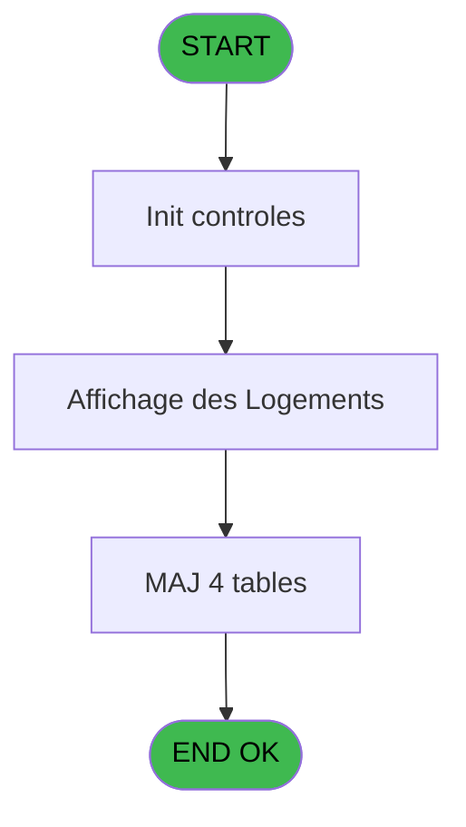
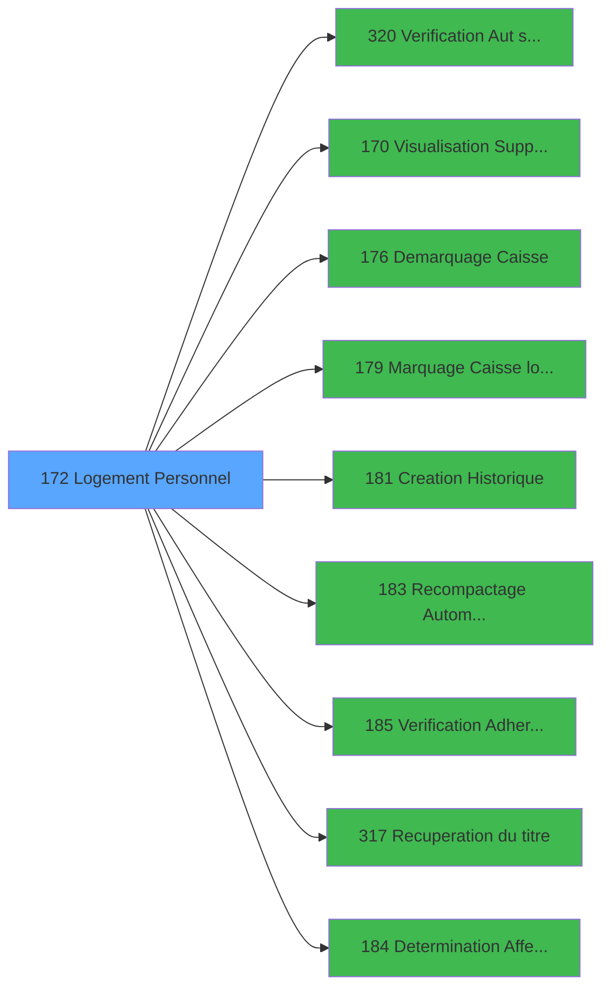

# PBG IDE 172 - Logement Personnel

> **Analyse**: Phases 1-4 2026-02-03 09:55 -> 09:56 (20s) | Assemblage 09:56
> **Pipeline**: V7.2 Enrichi
> **Structure**: 4 onglets (Resume | Ecrans | Donnees | Connexions)

<!-- TAB:Resume -->

## 1. FICHE D'IDENTITE

| Attribut | Valeur |
|----------|--------|
| Projet | PBG |
| IDE Position | 172 |
| Nom Programme | Logement Personnel |
| Fichier source | `Prg_172.xml` |
| Domaine metier | General |
| Taches | 36 (9 ecrans visibles) |
| Tables modifiees | 4 |
| Programmes appeles | 9 |

## 2. DESCRIPTION FONCTIONNELLE

**Logement Personnel** assure la gestion complete de ce processus, accessible depuis [Affectation / liberation reche (IDE 169)](PBG-IDE-169.md).

Le flux de traitement s'organise en **5 blocs fonctionnels** :

- **Traitement** (12 taches) : traitements metier divers
- **Consultation** (8 taches) : ecrans de recherche, selection et consultation
- **Creation** (7 taches) : insertion d'enregistrements en base (mouvements, prestations)
- **Validation** (7 taches) : controles et verifications de coherence
- **Saisie** (2 taches) : ecrans de saisie utilisateur (formulaires, champs, donnees)

**Donnees modifiees** : 4 tables en ecriture (hebergement______heb, historik_station, logement_go______lop, fi_complet_______gm_go).

Detail : phases du traitement

#### Phase 1 : Traitement (12 taches)

- **172** - Logement Standard **[[ECRAN]](#ecran-t1)**
- **172.2** - Module des Logements **[[ECRAN]](#ecran-t3)**
- **172.2.3** - Traitement Adherents **[[ECRAN]](#ecran-t6)**
- **172.2.3.1** - Liberation Hebergement
- **172.2.3.2** - Effaçage Blocage
- **172.2.5.1.2** - Mise à Jour Hebergement
- **172.2.6** - Blocage Logement **[[ECRAN]](#ecran-t17)**
- **172.2.6.4** - Attribution N°Blocage
- **172.2.7** - Statut logement
- **172.2.8** - Blocage Logement **[[ECRAN]](#ecran-t27)**
- **172.2.8.4** - Attribution N°Blocage
- **172.2.9** - Statut logement

Delegue a : [  Visualisation Supplementaire (IDE 170)](PBG-IDE-170.md), [Demarquage Caisse (IDE 176)](PBG-IDE-176.md), [Marquage Caisse logique (IDE 179)](PBG-IDE-179.md), [Recompactage Automatique (IDE 183)](PBG-IDE-183.md), [Recuperation du titre (IDE 317)](PBG-IDE-317.md), [Determination Affectation (IDE 184)](PBG-IDE-184.md)

#### Phase 2 : Validation (7 taches)

- **172.1** - Verification Logement
- **172.2.5.1.4** - Verification Adherents
- **172.2.5.1.5** - Verification Adherents
- **172.2.6.2** - Verification Logement
- **172.2.6.3** - Verification Blocage
- **172.2.8.2** - Verification Logement
- **172.2.8.3** - Verification Blocage

Delegue a : [Verification Aut sans ecran (IDE 320)](PBG-IDE-320.md), [Verification Adherents (IDE 185)](PBG-IDE-185.md)

#### Phase 3 : Consultation (8 taches)

- **172.2.1** - Affichage Proximite **[[ECRAN]](#ecran-t4)**
- **172.2.2** - Affichage Communicante **[[ECRAN]](#ecran-t5)**
- **172.2.4** - Recherche Logement **[[ECRAN]](#ecran-t9)**
- **172.2.5** - Affichage Adherent batch **[[ECRAN]](#ecran-t10)**
- **172.2.5.1** - Affichage Adherents **[[ECRAN]](#ecran-t11)**
- **172.2.5.1.1** - Recherche Adherents **[[ECRAN]](#ecran-t12)**
- **172.2.6.4.1** - Recherche N°Blocage
- **172.2.8.4.1** - Recherche N°Blocage

Delegue a : [Recuperation du titre (IDE 317)](PBG-IDE-317.md)

#### Phase 4 : Creation (7 taches)

- **172.2.5.1.3** - Creation Historique
- **172.2.6.5** - Creation Blocage
- **172.2.6.6** - Creation Historique
- **172.2.7.1** - Creation Historique
- **172.2.8.5** - Creation Blocage
- **172.2.8.6** - Creation Historique
- **172.2.9.1** - Creation Historique

Delegue a : [Creation Historique (IDE 181)](PBG-IDE-181.md)

#### Phase 5 : Saisie (2 taches)

- **172.2.6.1** - Saisie Blocage **[[ECRAN]](#ecran-t18)**
- **172.2.8.1** - Saisie Blocage **[[ECRAN]](#ecran-t28)**

#### Tables impactees

| Table | Operations | Role metier |
|-------|-----------|-------------|
| hebergement______heb | R/**W** (14 usages) | Hebergement (chambres) |
| historik_station | **W** (5 usages) | Historique / journal |
| logement_go______lop | R/**W** (4 usages) |  |
| fi_complet_______gm_go | **W** (1 usages) |  |

## 3. BLOCS FONCTIONNELS

### 3.1 Traitement (12 taches)

Traitements internes.

---

#### 172 - Logement Standard [[ECRAN]](#ecran-t1)

**Role** : Tache d'orchestration : point d'entree du programme (12 sous-taches). Coordonne l'enchainement des traitements.
**Ecran** : 175 x 90 DLU (MDI) | [Voir mockup](#ecran-t1)

11 sous-taches directes

| Tache | Nom | Bloc |
|-------|-----|------|
| [172.2](#t3) | Module des Logements **[[ECRAN]](#ecran-t3)** | Traitement |
| [172.2.3](#t6) | Traitement Adherents **[[ECRAN]](#ecran-t6)** | Traitement |
| [172.2.3.1](#t7) | Liberation Hebergement | Traitement |
| [172.2.3.2](#t8) | Effaçage Blocage | Traitement |
| [172.2.5.1.2](#t13) | Mise à Jour Hebergement | Traitement |
| [172.2.6](#t17) | Blocage Logement **[[ECRAN]](#ecran-t17)** | Traitement |
| [172.2.6.4](#t21) | Attribution N°Blocage | Traitement |
| [172.2.7](#t25) | Statut logement | Traitement |
| [172.2.8](#t27) | Blocage Logement **[[ECRAN]](#ecran-t27)** | Traitement |
| [172.2.8.4](#t31) | Attribution N°Blocage | Traitement |
| [172.2.9](#t37) | Statut logement | Traitement |

**Variables liees** : A (> code logement)

---

#### 172.2 - Module des Logements [[ECRAN]](#ecran-t3)

**Role** : Traitement : Module des Logements.
**Ecran** : 1165 x 282 DLU (MDI) | [Voir mockup](#ecran-t3)

---

#### 172.2.3 - Traitement Adherents [[ECRAN]](#ecran-t6)

**Role** : Traitement : Traitement Adherents.
**Ecran** : 975 x 107 DLU (MDI) | [Voir mockup](#ecran-t6)

---

#### 172.2.3.1 - Liberation Hebergement

**Role** : Traitement : Liberation Hebergement.

---

#### 172.2.3.2 - Effaçage Blocage

**Role** : Traitement : Effaçage Blocage.

---

#### 172.2.5.1.2 - Mise à Jour Hebergement

**Role** : Traitement : Mise à Jour Hebergement.

---

#### 172.2.6 - Blocage Logement [[ECRAN]](#ecran-t17)

**Role** : Traitement : Blocage Logement.
**Ecran** : 156 x 80 DLU (MDI) | [Voir mockup](#ecran-t17)
**Variables liees** : A (> code logement)

---

#### 172.2.6.4 - Attribution N°Blocage

**Role** : Traitement : Attribution N°Blocage.

---

#### 172.2.7 - Statut logement

**Role** : Traitement : Statut logement.
**Variables liees** : A (> code logement)

---

#### 172.2.8 - Blocage Logement [[ECRAN]](#ecran-t27)

**Role** : Traitement : Blocage Logement.
**Ecran** : 156 x 80 DLU (MDI) | [Voir mockup](#ecran-t27)
**Variables liees** : A (> code logement)

---

#### 172.2.8.4 - Attribution N°Blocage

**Role** : Traitement : Attribution N°Blocage.

---

#### 172.2.9 - Statut logement

**Role** : Traitement : Statut logement.
**Variables liees** : A (> code logement)

### 3.2 Validation (7 taches)

Controles de coherence : 7 taches verifient les donnees et conditions.

---

#### 172.1 - Verification Logement

**Role** : Verification : Verification Logement.
**Variables liees** : A (> code logement)
**Delegue a** : [Verification Aut sans ecran (IDE 320)](PBG-IDE-320.md), [Verification Adherents (IDE 185)](PBG-IDE-185.md)

---

#### 172.2.5.1.4 - Verification Adherents

**Role** : Verification : Verification Adherents.
**Delegue a** : [Verification Aut sans ecran (IDE 320)](PBG-IDE-320.md), [Verification Adherents (IDE 185)](PBG-IDE-185.md)

---

#### 172.2.5.1.5 - Verification Adherents

**Role** : Verification : Verification Adherents.
**Delegue a** : [Verification Aut sans ecran (IDE 320)](PBG-IDE-320.md), [Verification Adherents (IDE 185)](PBG-IDE-185.md)

---

#### 172.2.6.2 - Verification Logement

**Role** : Verification : Verification Logement.
**Variables liees** : A (> code logement)
**Delegue a** : [Verification Aut sans ecran (IDE 320)](PBG-IDE-320.md), [Verification Adherents (IDE 185)](PBG-IDE-185.md)

---

#### 172.2.6.3 - Verification Blocage

**Role** : Verification : Verification Blocage.
**Delegue a** : [Verification Aut sans ecran (IDE 320)](PBG-IDE-320.md), [Verification Adherents (IDE 185)](PBG-IDE-185.md)

---

#### 172.2.8.2 - Verification Logement

**Role** : Verification : Verification Logement.
**Variables liees** : A (> code logement)
**Delegue a** : [Verification Aut sans ecran (IDE 320)](PBG-IDE-320.md), [Verification Adherents (IDE 185)](PBG-IDE-185.md)

---

#### 172.2.8.3 - Verification Blocage

**Role** : Verification : Verification Blocage.
**Delegue a** : [Verification Aut sans ecran (IDE 320)](PBG-IDE-320.md), [Verification Adherents (IDE 185)](PBG-IDE-185.md)

### 3.3 Consultation (8 taches)

Ecrans de recherche et consultation.

---

#### 172.2.1 - Affichage Proximite [[ECRAN]](#ecran-t4)

**Role** : Reinitialisation : Affichage Proximite.
**Ecran** : 144 x 80 DLU (Modal) | [Voir mockup](#ecran-t4)

---

#### 172.2.2 - Affichage Communicante [[ECRAN]](#ecran-t5)

**Role** : Reinitialisation : Affichage Communicante.
**Ecran** : 142 x 78 DLU (Modal) | [Voir mockup](#ecran-t5)

---

#### 172.2.4 - Recherche Logement [[ECRAN]](#ecran-t9)

**Role** : Traitement : Recherche Logement.
**Ecran** : 541 x 114 DLU (MDI) | [Voir mockup](#ecran-t9)
**Variables liees** : A (> code logement), G (W0-Recherche), K (B_Recherche)

---

#### 172.2.5 - Affichage Adherent batch [[ECRAN]](#ecran-t10)

**Role** : Reinitialisation : Affichage Adherent batch.
**Ecran** : 1062 x 244 DLU (MDI) | [Voir mockup](#ecran-t10)

---

#### 172.2.5.1 - Affichage Adherents [[ECRAN]](#ecran-t11)

**Role** : Reinitialisation : Affichage Adherents.
**Ecran** : 941 x 240 DLU (MDI) | [Voir mockup](#ecran-t11)

---

#### 172.2.5.1.1 - Recherche Adherents [[ECRAN]](#ecran-t12)

**Role** : Traitement : Recherche Adherents.
**Ecran** : 553 x 115 DLU (MDI) | [Voir mockup](#ecran-t12)
**Variables liees** : G (W0-Recherche), K (B_Recherche)

---

#### 172.2.6.4.1 - Recherche N°Blocage

**Role** : Traitement : Recherche N°Blocage.
**Variables liees** : G (W0-Recherche), K (B_Recherche)

---

#### 172.2.8.4.1 - Recherche N°Blocage

**Role** : Traitement : Recherche N°Blocage.
**Variables liees** : G (W0-Recherche), K (B_Recherche)

### 3.4 Creation (7 taches)

Insertion de nouveaux enregistrements en base.

---

#### 172.2.5.1.3 - Creation Historique

**Role** : Consultation/chargement : Creation Historique.
**Delegue a** : [Creation Historique (IDE 181)](PBG-IDE-181.md)

---

#### 172.2.6.5 - Creation Blocage

**Role** : Creation d'enregistrement : Creation Blocage.
**Delegue a** : [Creation Historique (IDE 181)](PBG-IDE-181.md)

---

#### 172.2.6.6 - Creation Historique

**Role** : Consultation/chargement : Creation Historique.
**Delegue a** : [Creation Historique (IDE 181)](PBG-IDE-181.md)

---

#### 172.2.7.1 - Creation Historique

**Role** : Consultation/chargement : Creation Historique.
**Delegue a** : [Creation Historique (IDE 181)](PBG-IDE-181.md)

---

#### 172.2.8.5 - Creation Blocage

**Role** : Creation d'enregistrement : Creation Blocage.
**Delegue a** : [Creation Historique (IDE 181)](PBG-IDE-181.md)

---

#### 172.2.8.6 - Creation Historique

**Role** : Consultation/chargement : Creation Historique.
**Delegue a** : [Creation Historique (IDE 181)](PBG-IDE-181.md)

---

#### 172.2.9.1 - Creation Historique

**Role** : Consultation/chargement : Creation Historique.
**Delegue a** : [Creation Historique (IDE 181)](PBG-IDE-181.md)

### 3.5 Saisie (2 taches)

L'operateur saisit les donnees de la transaction via 2 ecrans (Saisie Blocage, Saisie Blocage).

---

#### 172.2.6.1 - Saisie Blocage [[ECRAN]](#ecran-t18)

**Role** : Saisie des donnees : Saisie Blocage.
**Ecran** : 480 x 116 DLU (MDI) | [Voir mockup](#ecran-t18)

---

#### 172.2.8.1 - Saisie Blocage [[ECRAN]](#ecran-t28)

**Role** : Saisie des donnees : Saisie Blocage.
**Ecran** : 474 x 114 DLU (MDI) | [Voir mockup](#ecran-t28)

## 5. REGLES METIER

*(Aucune regle metier identifiee)*

## 6. CONTEXTE

- **Appele par**: [Affectation / liberation reche (IDE 169)](PBG-IDE-169.md)
- **Appelle**: 9 programmes | **Tables**: 7 (W:4 R:3 L:2) | **Taches**: 36 | **Expressions**: 6

<!-- TAB:Ecrans -->

## 8. ECRANS

### 8.1 Forms visibles (9 / 36)

| # | Position | Tache | Nom | Type | Largeur | Hauteur | Bloc |
|---|----------|-------|-----|------|---------|---------|------|
| 1 | 172.2 | 172.2 | Module des Logements | MDI | 1165 | 282 | Traitement |
| 2 | 172.2.1 | 172.2.1 | Affichage Proximite | Modal | 144 | 80 | Consultation |
| 3 | 172.2.2 | 172.2.2 | Affichage Communicante | Modal | 142 | 78 | Consultation |
| 4 | 172.2.3 | 172.2.3 | Traitement Adherents | MDI | 975 | 107 | Traitement |
| 5 | 172.2.4 | 172.2.4 | Recherche Logement | MDI | 541 | 114 | Consultation |
| 6 | 172.2.5.1 | 172.2.5.1 | Affichage Adherents | MDI | 941 | 240 | Consultation |
| 7 | 172.2.5.1.1 | 172.2.5.1.1 | Recherche Adherents | MDI | 553 | 115 | Consultation |
| 8 | 172.2.6.1 | 172.2.6.1 | Saisie Blocage | MDI | 480 | 116 | Saisie |
| 9 | 172.2.9.1 | 172.2.8.1 | Saisie Blocage | MDI | 474 | 114 | Saisie |

### 8.2 Mockups Ecrans

---

#### 172.2 - Module des Logements
**Tache** : [172.2](#t3) | **Type** : MDI | **Dimensions** : 1165 x 282 DLU
**Bloc** : Traitement | **Titre IDE** : Module des Logements

<!-- FORM-DATA:
{
    "width":  1165,
    "vFactor":  8,
    "type":  "MDI",
    "hFactor":  8,
    "controls":  [
                     {
                         "x":  1,
                         "type":  "label",
                         "var":  "",
                         "y":  0,
                         "w":  1158,
                         "fmt":  "",
                         "name":  "",
                         "h":  21,
                         "color":  "",
                         "text":  "",
                         "parent":  null
                     },
                     {
                         "x":  0,
                         "type":  "label",
                         "var":  "",
                         "y":  256,
                         "w":  1158,
                         "fmt":  "",
                         "name":  "",
                         "h":  24,
                         "color":  "",
                         "text":  "",
                         "parent":  null
                     },
                     {
                         "x":  188,
                         "type":  "label",
                         "var":  "",
                         "y":  24,
                         "w":  789,
                         "fmt":  "",
                         "name":  "",
                         "h":  32,
                         "color":  "",
                         "text":  "",
                         "parent":  null
                     },
                     {
                         "x":  461,
                         "type":  "label",
                         "var":  "",
                         "y":  30,
                         "w":  52,
                         "fmt":  "",
                         "name":  "",
                         "h":  8,
                         "color":  "",
                         "text":  "Statut",
                         "parent":  7
                     },
                     {
                         "x":  579,
                         "type":  "label",
                         "var":  "",
                         "y":  30,
                         "w":  122,
                         "fmt":  "",
                         "name":  "",
                         "h":  8,
                         "color":  "",
                         "text":  "Tel. Interieur",
                         "parent":  7
                     },
                     {
                         "x":  730,
                         "type":  "label",
                         "var":  "",
                         "y":  30,
                         "w":  71,
                         "fmt":  "",
                         "name":  "",
                         "h":  8,
                         "color":  "",
                         "text":  "Standing",
                         "parent":  7
                     },
                     {
                         "x":  856,
                         "type":  "label",
                         "var":  "",
                         "y":  30,
                         "w":  77,
                         "fmt":  "",
                         "name":  "",
                         "h":  8,
                         "color":  "",
                         "text":  "Attribution",
                         "parent":  7
                     },
                     {
                         "x":  985,
                         "type":  "label",
                         "var":  "",
                         "y":  24,
                         "w":  173,
                         "fmt":  "",
                         "name":  "",
                         "h":  123,
                         "color":  "",
                         "text":  "",
                         "parent":  null
                     },
                     {
                         "x":  1,
                         "type":  "table",
                         "var":  "",
                         "name":  "",
                         "titleH":  12,
                         "color":  "110",
                         "w":  176,
                         "y":  26,
                         "fmt":  "",
                         "parent":  null,
                         "text":  "",
                         "rowH":  15,
                         "h":  219,
                         "cols":  [
                                      {
                                          "title":  "Nom Standard",
                                          "layer":  1,
                                          "w":  141
                                      }
                                  ],
                         "rows":  1
                     },
                     {
                         "x":  11,
                         "type":  "label",
                         "var":  "",
                         "y":  42,
                         "w":  21,
                         "fmt":  "",
                         "name":  "",
                         "h":  8,
                         "color":  "146",
                         "text":  "è",
                         "parent":  18
                     },
                     {
                         "x":  188,
                         "type":  "label",
                         "var":  "",
                         "y":  57,
                         "w":  475,
                         "fmt":  "",
                         "name":  "",
                         "h":  90,
                         "color":  "195",
                         "text":  "Renseignements",
                         "parent":  null
                     },
                     {
                         "x":  209,
                         "type":  "label",
                         "var":  "",
                         "y":  71,
                         "w":  91,
                         "fmt":  "",
                         "name":  "",
                         "h":  8,
                         "color":  "",
                         "text":  "Ensemble",
                         "parent":  24
                     },
                     {
                         "x":  434,
                         "type":  "label",
                         "var":  "",
                         "y":  71,
                         "w":  110,
                         "fmt":  "",
                         "name":  "",
                         "h":  8,
                         "color":  "",
                         "text":  "Hebergement",
                         "parent":  24
                     },
                     {
                         "x":  209,
                         "type":  "label",
                         "var":  "",
                         "y":  91,
                         "w":  80,
                         "fmt":  "",
                         "name":  "",
                         "h":  8,
                         "color":  "",
                         "text":  "Logement :",
                         "parent":  24
                     },
                     {
                         "x":  434,
                         "type":  "label",
                         "var":  "",
                         "y":  91,
                         "w":  96,
                         "fmt":  "",
                         "name":  "",
                         "h":  8,
                         "color":  "",
                         "text":  "Occupation",
                         "parent":  24
                     },
                     {
                         "x":  209,
                         "type":  "label",
                         "var":  "",
                         "y":  111,
                         "w":  80,
                         "fmt":  "",
                         "name":  "",
                         "h":  8,
                         "color":  "",
                         "text":  "Batiment",
                         "parent":  24
                     },
                     {
                         "x":  434,
                         "type":  "label",
                         "var":  "",
                         "y":  111,
                         "w":  94,
                         "fmt":  "",
                         "name":  "",
                         "h":  8,
                         "color":  "",
                         "text":  "Occup.Sbk",
                         "parent":  24
                     },
                     {
                         "x":  209,
                         "type":  "label",
                         "var":  "",
                         "y":  131,
                         "w":  53,
                         "fmt":  "",
                         "name":  "",
                         "h":  8,
                         "color":  "",
                         "text":  "Etage",
                         "parent":  24
                     },
                     {
                         "x":  434,
                         "type":  "label",
                         "var":  "",
                         "y":  131,
                         "w":  120,
                         "fmt":  "",
                         "name":  "",
                         "h":  8,
                         "color":  "",
                         "text":  "Communicante",
                         "parent":  24
                     },
                     {
                         "x":  665,
                         "type":  "label",
                         "var":  "",
                         "y":  57,
                         "w":  319,
                         "fmt":  "",
                         "name":  "",
                         "h":  90,
                         "color":  "195",
                         "text":  "Chambres voisines",
                         "parent":  null
                     },
                     {
                         "x":  53,
                         "type":  "edit",
                         "var":  "",
                         "y":  42,
                         "w":  75,
                         "fmt":  "",
                         "name":  "LOP Nom Standard",
                         "h":  8,
                         "color":  "110",
                         "text":  "",
                         "parent":  18
                     },
                     {
                         "x":  205,
                         "type":  "edit",
                         "var":  "",
                         "y":  37,
                         "w":  203,
                         "fmt":  "U15",
                         "name":  "",
                         "h":  8,
                         "color":  "142",
                         "text":  "",
                         "parent":  7
                     },
                     {
                         "x":  332,
                         "type":  "edit",
                         "var":  "",
                         "y":  72,
                         "w":  42,
                         "fmt":  "",
                         "name":  "LOP Ensemble",
                         "h":  8,
                         "color":  "",
                         "text":  "",
                         "parent":  24
                     },
                     {
                         "x":  602,
                         "type":  "edit",
                         "var":  "",
                         "y":  43,
                         "w":  78,
                         "fmt":  "",
                         "name":  "",
                         "h":  9,
                         "color":  "",
                         "text":  "",
                         "parent":  7
                     },
                     {
                         "x":  332,
                         "type":  "edit",
                         "var":  "",
                         "y":  92,
                         "w":  67,
                         "fmt":  "",
                         "name":  "",
                         "h":  8,
                         "color":  "",
                         "text":  "",
                         "parent":  24
                     },
                     {
                         "x":  332,
                         "type":  "edit",
                         "var":  "",
                         "y":  112,
                         "w":  42,
                         "fmt":  "",
                         "name":  "",
                         "h":  8,
                         "color":  "",
                         "text":  "",
                         "parent":  24
                     },
                     {
                         "x":  332,
                         "type":  "edit",
                         "var":  "",
                         "y":  131,
                         "w":  42,
                         "fmt":  "",
                         "name":  "",
                         "h":  8,
                         "color":  "",
                         "text":  "",
                         "parent":  24
                     },
                     {
                         "x":  599,
                         "type":  "edit",
                         "var":  "",
                         "y":  71,
                         "w":  45,
                         "fmt":  "",
                         "name":  "",
                         "h":  8,
                         "color":  "",
                         "text":  "",
                         "parent":  24
                     },
                     {
                         "x":  599,
                         "type":  "edit",
                         "var":  "",
                         "y":  91,
                         "w":  45,
                         "fmt":  "",
                         "name":  "",
                         "h":  8,
                         "color":  "",
                         "text":  "",
                         "parent":  24
                     },
                     {
                         "x":  599,
                         "type":  "edit",
                         "var":  "",
                         "y":  111,
                         "w":  45,
                         "fmt":  "",
                         "name":  "",
                         "h":  8,
                         "color":  "",
                         "text":  "",
                         "parent":  24
                     },
                     {
                         "x":  749,
                         "type":  "edit",
                         "var":  "",
                         "y":  43,
                         "w":  34,
                         "fmt":  "",
                         "name":  "",
                         "h":  9,
                         "color":  "",
                         "text":  "",
                         "parent":  7
                     },
                     {
                         "x":  996,
                         "type":  "button",
                         "var":  "",
                         "y":  259,
                         "w":  154,
                         "fmt":  "\u0026Recherche",
                         "name":  "B_Recherche",
                         "h":  18,
                         "color":  "",
                         "text":  "",
                         "parent":  6
                     },
                     {
                         "x":  995,
                         "type":  "button",
                         "var":  "",
                         "y":  33,
                         "w":  154,
                         "fmt":  "",
                         "name":  "B_Affecter",
                         "h":  18,
                         "color":  "",
                         "text":  "",
                         "parent":  null
                     },
                     {
                         "x":  995,
                         "type":  "button",
                         "var":  "",
                         "y":  56,
                         "w":  154,
                         "fmt":  "",
                         "name":  "B_Reaffecter",
                         "h":  18,
                         "color":  "",
                         "text":  "",
                         "parent":  null
                     },
                     {
                         "x":  9,
                         "type":  "edit",
                         "var":  "",
                         "y":  6,
                         "w":  395,
                         "fmt":  "30",
                         "name":  "",
                         "h":  8,
                         "color":  "",
                         "text":  "",
                         "parent":  1
                     },
                     {
                         "x":  943,
                         "type":  "edit",
                         "var":  "",
                         "y":  6,
                         "w":  203,
                         "fmt":  "WWW DD MMM YYYYT",
                         "name":  "",
                         "h":  8,
                         "color":  "",
                         "text":  "",
                         "parent":  1
                     },
                     {
                         "x":  430,
                         "type":  "edit",
                         "var":  "",
                         "y":  43,
                         "w":  112,
                         "fmt":  "15",
                         "name":  "",
                         "h":  8,
                         "color":  "",
                         "text":  "",
                         "parent":  7
                     },
                     {
                         "x":  877,
                         "type":  "edit",
                         "var":  "",
                         "y":  43,
                         "w":  34,
                         "fmt":  "2",
                         "name":  "",
                         "h":  9,
                         "color":  "",
                         "text":  "",
                         "parent":  7
                     },
                     {
                         "x":  5,
                         "type":  "image",
                         "var":  "",
                         "y":  71,
                         "w":  165,
                         "fmt":  "",
                         "name":  "",
                         "h":  58,
                         "color":  "",
                         "text":  "",
                         "parent":  null
                     },
                     {
                         "x":  995,
                         "type":  "button",
                         "var":  "",
                         "y":  79,
                         "w":  154,
                         "fmt":  "\u0026Bloquer",
                         "name":  "",
                         "h":  18,
                         "color":  "",
                         "text":  "",
                         "parent":  null
                     },
                     {
                         "x":  995,
                         "type":  "button",
                         "var":  "",
                         "y":  102,
                         "w":  154,
                         "fmt":  "\u0026Statuer",
                         "name":  "",
                         "h":  18,
                         "color":  "",
                         "text":  "",
                         "parent":  null
                     },
                     {
                         "x":  995,
                         "type":  "button",
                         "var":  "",
                         "y":  125,
                         "w":  154,
                         "fmt":  "\u0026Reservation",
                         "name":  "",
                         "h":  18,
                         "color":  "",
                         "text":  "",
                         "parent":  null
                     },
                     {
                         "x":  599,
                         "type":  "edit",
                         "var":  "",
                         "y":  131,
                         "w":  45,
                         "fmt":  "3",
                         "name":  "",
                         "h":  8,
                         "color":  "",
                         "text":  "",
                         "parent":  24
                     },
                     {
                         "x":  12,
                         "type":  "image",
                         "var":  "",
                         "y":  179,
                         "w":  163,
                         "fmt":  "",
                         "name":  "",
                         "h":  44,
                         "color":  "",
                         "text":  "",
                         "parent":  null
                     },
                     {
                         "x":  6,
                         "type":  "button",
                         "var":  "",
                         "y":  259,
                         "w":  154,
                         "fmt":  "\u0026Quitter",
                         "name":  "",
                         "h":  18,
                         "color":  "",
                         "text":  "",
                         "parent":  6
                     },
                     {
                         "x":  173,
                         "type":  "subform",
                         "var":  "",
                         "y":  148,
                         "w":  992,
                         "fmt":  "",
                         "name":  "Traitement Adherents",
                         "h":  106,
                         "color":  "",
                         "text":  "",
                         "parent":  null
                     },
                     {
                         "x":  670,
                         "type":  "subform",
                         "var":  "",
                         "y":  67,
                         "w":  154,
                         "fmt":  "",
                         "name":  "Affichage Communicante",
                         "h":  77,
                         "color":  "",
                         "text":  "",
                         "parent":  41
                     },
                     {
                         "x":  827,
                         "type":  "subform",
                         "var":  "",
                         "y":  67,
                         "w":  154,
                         "fmt":  "",
                         "name":  "Affichage Proximite",
                         "h":  77,
                         "color":  "",
                         "text":  "",
                         "parent":  41
                     }
                 ],
    "taskId":  "172.2",
    "height":  282
}
-->

<strong>Champs : 16 champs</strong>

| Pos (x,y) | Nom | Variable | Type |
|-----------|-----|----------|------|
| 53,42 | LOP Nom Standard | - | edit |
| 205,37 | U15 | - | edit |
| 332,72 | LOP Ensemble | - | edit |
| 602,43 | (sans nom) | - | edit |
| 332,92 | (sans nom) | - | edit |
| 332,112 | (sans nom) | - | edit |
| 332,131 | (sans nom) | - | edit |
| 599,71 | (sans nom) | - | edit |
| 599,91 | (sans nom) | - | edit |
| 599,111 | (sans nom) | - | edit |
| 749,43 | (sans nom) | - | edit |
| 9,6 | 30 | - | edit |
| 943,6 | WWW DD MMM YYYYT | - | edit |
| 430,43 | 15 | - | edit |
| 877,43 | 2 | - | edit |
| 599,131 | 3 | - | edit |

<strong>Boutons : 7 boutons</strong>

| Bouton | Pos (x,y) | Action |
|--------|-----------|--------|
| Recherche | 996,259 | Ouvre la selection |
| B_Affecter | 995,33 | Bouton fonctionnel |
| B_Reaffecter | 995,56 | Bouton fonctionnel |
| Bloquer | 995,79 | Bouton fonctionnel |
| Statuer | 995,102 | Bouton fonctionnel |
| Reservation | 995,125 | Bouton fonctionnel |
| Quitter | 6,259 | Quitte le programme |

---

#### 172.2.1 - Affichage Proximite
**Tache** : [172.2.1](#t4) | **Type** : Modal | **Dimensions** : 144 x 80 DLU
**Bloc** : Consultation | **Titre IDE** : Affichage Proximite

<!-- FORM-DATA:
{
    "width":  144,
    "vFactor":  8,
    "type":  "Modal",
    "hFactor":  8,
    "controls":  [
                     {
                         "x":  3,
                         "type":  "table",
                         "var":  "",
                         "name":  "",
                         "titleH":  12,
                         "color":  "110",
                         "w":  141,
                         "y":  0,
                         "fmt":  "",
                         "parent":  null,
                         "text":  "",
                         "rowH":  12,
                         "h":  75,
                         "cols":  [
                                      {
                                          "title":  "Proximité",
                                          "layer":  1,
                                          "w":  135
                                      }
                                  ],
                         "rows":  1
                     },
                     {
                         "x":  26,
                         "type":  "edit",
                         "var":  "",
                         "y":  15,
                         "w":  91,
                         "fmt":  "",
                         "name":  "",
                         "h":  8,
                         "color":  "110",
                         "text":  "",
                         "parent":  1
                     }
                 ],
    "taskId":  "172.2.1",
    "height":  80
}
-->

<strong>Champs : 1 champs</strong>

| Pos (x,y) | Nom | Variable | Type |
|-----------|-----|----------|------|
| 26,15 | (sans nom) | - | edit |

---

#### 172.2.2 - Affichage Communicante
**Tache** : [172.2.2](#t5) | **Type** : Modal | **Dimensions** : 142 x 78 DLU
**Bloc** : Consultation | **Titre IDE** : Affichage Communicante

<!-- FORM-DATA:
{
    "width":  142,
    "vFactor":  8,
    "type":  "Modal",
    "hFactor":  8,
    "controls":  [
                     {
                         "x":  3,
                         "type":  "table",
                         "var":  "",
                         "name":  "",
                         "titleH":  12,
                         "color":  "110",
                         "w":  133,
                         "y":  0,
                         "fmt":  "",
                         "parent":  null,
                         "text":  "",
                         "rowH":  12,
                         "h":  75,
                         "cols":  [
                                      {
                                          "title":  "Communicante",
                                          "layer":  1,
                                          "w":  133
                                      }
                                  ],
                         "rows":  1
                     },
                     {
                         "x":  21,
                         "type":  "edit",
                         "var":  "",
                         "y":  15,
                         "w":  75,
                         "fmt":  "",
                         "name":  "",
                         "h":  8,
                         "color":  "110",
                         "text":  "",
                         "parent":  1
                     }
                 ],
    "taskId":  "172.2.2",
    "height":  78
}
-->

<strong>Champs : 1 champs</strong>

| Pos (x,y) | Nom | Variable | Type |
|-----------|-----|----------|------|
| 21,15 | (sans nom) | - | edit |

---

#### 172.2.3 - Traitement Adherents
**Tache** : [172.2.3](#t6) | **Type** : MDI | **Dimensions** : 975 x 107 DLU
**Bloc** : Traitement | **Titre IDE** : Traitement Adherents

<!-- FORM-DATA:
{
    "width":  975,
    "vFactor":  8,
    "type":  "MDI",
    "hFactor":  8,
    "controls":  [
                     {
                         "x":  0,
                         "type":  "table",
                         "var":  "",
                         "name":  "",
                         "titleH":  12,
                         "color":  "7",
                         "w":  790,
                         "y":  6,
                         "fmt":  "",
                         "parent":  null,
                         "text":  "",
                         "rowH":  13,
                         "h":  90,
                         "cols":  [
                                      {
                                          "title":  "Nom",
                                          "layer":  1,
                                          "w":  315
                                      },
                                      {
                                          "title":  "Date  Deb/Heure",
                                          "layer":  2,
                                          "w":  141
                                      },
                                      {
                                          "title":  "Date fin/Heure",
                                          "layer":  3,
                                          "w":  131
                                      },
                                      {
                                          "title":  "Nat.",
                                          "layer":  4,
                                          "w":  55
                                      },
                                      {
                                          "title":  "Age",
                                          "layer":  5,
                                          "w":  52
                                      },
                                      {
                                          "title":  "Fumeur",
                                          "layer":  6,
                                          "w":  65
                                      }
                                  ],
                         "rows":  6
                     },
                     {
                         "x":  801,
                         "type":  "label",
                         "var":  "",
                         "y":  17,
                         "w":  170,
                         "fmt":  "",
                         "name":  "",
                         "h":  66,
                         "color":  "",
                         "text":  "",
                         "parent":  null
                     },
                     {
                         "x":  99,
                         "type":  "edit",
                         "var":  "",
                         "y":  21,
                         "w":  208,
                         "fmt":  "",
                         "name":  "HEB Libelle",
                         "h":  8,
                         "color":  "110",
                         "text":  "",
                         "parent":  1
                     },
                     {
                         "x":  326,
                         "type":  "edit",
                         "var":  "",
                         "y":  21,
                         "w":  64,
                         "fmt":  "##/##",
                         "name":  "",
                         "h":  8,
                         "color":  "110",
                         "text":  "",
                         "parent":  1
                     },
                     {
                         "x":  397,
                         "type":  "edit",
                         "var":  "",
                         "y":  21,
                         "w":  42,
                         "fmt":  "UUh",
                         "name":  "",
                         "h":  8,
                         "color":  "110",
                         "text":  "",
                         "parent":  1
                     },
                     {
                         "x":  462,
                         "type":  "edit",
                         "var":  "",
                         "y":  21,
                         "w":  64,
                         "fmt":  "##/##",
                         "name":  "",
                         "h":  8,
                         "color":  "110",
                         "text":  "",
                         "parent":  1
                     },
                     {
                         "x":  530,
                         "type":  "edit",
                         "var":  "",
                         "y":  21,
                         "w":  42,
                         "fmt":  "UUh",
                         "name":  "",
                         "h":  8,
                         "color":  "110",
                         "text":  "",
                         "parent":  1
                     },
                     {
                         "x":  598,
                         "type":  "edit",
                         "var":  "",
                         "y":  21,
                         "w":  30,
                         "fmt":  "",
                         "name":  "",
                         "h":  8,
                         "color":  "110",
                         "text":  "",
                         "parent":  1
                     },
                     {
                         "x":  810,
                         "type":  "button",
                         "var":  "",
                         "y":  25,
                         "w":  154,
                         "fmt":  "",
                         "name":  "B_Liberer",
                         "h":  18,
                         "color":  "",
                         "text":  "",
                         "parent":  18
                     },
                     {
                         "x":  8,
                         "type":  "edit",
                         "var":  "",
                         "y":  21,
                         "w":  38,
                         "fmt":  "3",
                         "name":  "",
                         "h":  8,
                         "color":  "110",
                         "text":  "",
                         "parent":  1
                     },
                     {
                         "x":  56,
                         "type":  "edit",
                         "var":  "",
                         "y":  21,
                         "w":  30,
                         "fmt":  "UX",
                         "name":  "",
                         "h":  8,
                         "color":  "110",
                         "text":  "",
                         "parent":  1
                     },
                     {
                         "x":  653,
                         "type":  "edit",
                         "var":  "",
                         "y":  21,
                         "w":  35,
                         "fmt":  "#2Z",
                         "name":  "heb_age_num",
                         "h":  8,
                         "color":  "110",
                         "text":  "",
                         "parent":  1
                     },
                     {
                         "x":  701,
                         "type":  "edit",
                         "var":  "",
                         "y":  21,
                         "w":  42,
                         "fmt":  "UX2",
                         "name":  "",
                         "h":  8,
                         "color":  "110",
                         "text":  "",
                         "parent":  1
                     },
                     {
                         "x":  810,
                         "type":  "button",
                         "var":  "",
                         "y":  56,
                         "w":  154,
                         "fmt":  "\u0026Visualiser",
                         "name":  "",
                         "h":  18,
                         "color":  "",
                         "text":  "",
                         "parent":  null
                     }
                 ],
    "taskId":  "172.2.3",
    "height":  107
}
-->

<strong>Champs : 10 champs</strong>

| Pos (x,y) | Nom | Variable | Type |
|-----------|-----|----------|------|
| 99,21 | HEB Libelle | - | edit |
| 326,21 | ##/## | - | edit |
| 397,21 | UUh | - | edit |
| 462,21 | ##/## | - | edit |
| 530,21 | UUh | - | edit |
| 598,21 | (sans nom) | - | edit |
| 8,21 | 3 | - | edit |
| 56,21 | UX | - | edit |
| 653,21 | heb_age_num | - | edit |
| 701,21 | UX2 | - | edit |

<strong>Boutons : 2 boutons</strong>

| Bouton | Pos (x,y) | Action |
|--------|-----------|--------|
| B_Liberer | 810,25 | Bouton fonctionnel |
| Visualiser | 810,56 | Appel [  Visualisation Supplementaire (IDE 170)](PBG-IDE-170.md) |

---

#### 172.2.4 - Recherche Logement
**Tache** : [172.2.4](#t9) | **Type** : MDI | **Dimensions** : 541 x 114 DLU
**Bloc** : Consultation | **Titre IDE** : Recherche Logement

<!-- FORM-DATA:
{
    "width":  541,
    "vFactor":  8,
    "type":  "MDI",
    "hFactor":  8,
    "controls":  [
                     {
                         "x":  0,
                         "type":  "label",
                         "var":  "",
                         "y":  1,
                         "w":  530,
                         "fmt":  "",
                         "name":  "",
                         "h":  19,
                         "color":  "",
                         "text":  "",
                         "parent":  null
                     },
                     {
                         "x":  170,
                         "type":  "label",
                         "var":  "",
                         "y":  34,
                         "w":  340,
                         "fmt":  "",
                         "name":  "",
                         "h":  37,
                         "color":  "",
                         "text":  "",
                         "parent":  null
                     },
                     {
                         "x":  173,
                         "type":  "label",
                         "var":  "",
                         "y":  35,
                         "w":  334,
                         "fmt":  "",
                         "name":  "",
                         "h":  35,
                         "color":  "",
                         "text":  "",
                         "parent":  null
                     },
                     {
                         "x":  190,
                         "type":  "label",
                         "var":  "",
                         "y":  49,
                         "w":  197,
                         "fmt":  "",
                         "name":  "",
                         "h":  8,
                         "color":  "",
                         "text":  "Numero de la chambre",
                         "parent":  6
                     },
                     {
                         "x":  0,
                         "type":  "label",
                         "var":  "",
                         "y":  85,
                         "w":  531,
                         "fmt":  "",
                         "name":  "",
                         "h":  24,
                         "color":  "",
                         "text":  "",
                         "parent":  null
                     },
                     {
                         "x":  391,
                         "type":  "edit",
                         "var":  "",
                         "y":  48,
                         "w":  82,
                         "fmt":  "",
                         "name":  "",
                         "h":  10,
                         "color":  "110",
                         "text":  "",
                         "parent":  6
                     },
                     {
                         "x":  260,
                         "type":  "edit",
                         "var":  "",
                         "y":  6,
                         "w":  262,
                         "fmt":  "WWW DD MMM YYYYT",
                         "name":  "",
                         "h":  8,
                         "color":  "",
                         "text":  "",
                         "parent":  null
                     },
                     {
                         "x":  4,
                         "type":  "image",
                         "var":  "",
                         "y":  23,
                         "w":  154,
                         "fmt":  "",
                         "name":  "",
                         "h":  59,
                         "color":  "",
                         "text":  "",
                         "parent":  null
                     },
                     {
                         "x":  7,
                         "type":  "button",
                         "var":  "",
                         "y":  88,
                         "w":  154,
                         "fmt":  "\u0026Valider",
                         "name":  "",
                         "h":  18,
                         "color":  "",
                         "text":  "",
                         "parent":  null
                     },
                     {
                         "x":  368,
                         "type":  "button",
                         "var":  "",
                         "y":  88,
                         "w":  154,
                         "fmt":  "\u0026Abandonner",
                         "name":  "",
                         "h":  18,
                         "color":  "",
                         "text":  "",
                         "parent":  null
                     },
                     {
                         "x":  5,
                         "type":  "edit",
                         "var":  "",
                         "y":  6,
                         "w":  267,
                         "fmt":  "25",
                         "name":  "",
                         "h":  8,
                         "color":  "",
                         "text":  "",
                         "parent":  null
                     }
                 ],
    "taskId":  "172.2.4",
    "height":  114
}
-->

<strong>Champs : 3 champs</strong>

| Pos (x,y) | Nom | Variable | Type |
|-----------|-----|----------|------|
| 391,48 | (sans nom) | - | edit |
| 260,6 | WWW DD MMM YYYYT | - | edit |
| 5,6 | 25 | - | edit |

<strong>Boutons : 2 boutons</strong>

| Bouton | Pos (x,y) | Action |
|--------|-----------|--------|
| Valider | 7,88 | Valide la saisie et enregistre |
| Abandonner | 368,88 | Annule et retour au menu |

---

#### 172.2.5.1 - Affichage Adherents
**Tache** : [172.2.5.1](#t11) | **Type** : MDI | **Dimensions** : 941 x 240 DLU
**Bloc** : Consultation | **Titre IDE** : Affichage Adherents

<!-- FORM-DATA:
{
    "width":  941,
    "vFactor":  8,
    "type":  "MDI",
    "hFactor":  8,
    "controls":  [
                     {
                         "x":  77,
                         "type":  "label",
                         "var":  "",
                         "y":  196,
                         "w":  112,
                         "fmt":  "",
                         "name":  "",
                         "h":  8,
                         "color":  "",
                         "text":  "Entrez le nom",
                         "parent":  null
                     },
                     {
                         "x":  0,
                         "type":  "label",
                         "var":  "",
                         "y":  212,
                         "w":  926,
                         "fmt":  "",
                         "name":  "",
                         "h":  24,
                         "color":  "",
                         "text":  "",
                         "parent":  null
                     },
                     {
                         "x":  2,
                         "type":  "table",
                         "var":  "",
                         "name":  "",
                         "titleH":  14,
                         "color":  "7",
                         "w":  934,
                         "y":  5,
                         "fmt":  "",
                         "parent":  null,
                         "text":  "",
                         "rowH":  15,
                         "h":  171,
                         "cols":  [
                                      {
                                          "title":  "Nom",
                                          "layer":  1,
                                          "w":  347
                                      },
                                      {
                                          "title":  "Date/heure début",
                                          "layer":  2,
                                          "w":  162
                                      },
                                      {
                                          "title":  "Date/heure fin",
                                          "layer":  3,
                                          "w":  150
                                      },
                                      {
                                          "title":  "Logement",
                                          "layer":  4,
                                          "w":  241
                                      }
                                  ],
                         "rows":  4
                     },
                     {
                         "x":  125,
                         "type":  "edit",
                         "var":  "",
                         "y":  23,
                         "w":  221,
                         "fmt":  "",
                         "name":  "",
                         "h":  8,
                         "color":  "110",
                         "text":  "",
                         "parent":  5
                     },
                     {
                         "x":  371,
                         "type":  "edit",
                         "var":  "",
                         "y":  23,
                         "w":  64,
                         "fmt":  "##/##",
                         "name":  "",
                         "h":  8,
                         "color":  "110",
                         "text":  "",
                         "parent":  5
                     },
                     {
                         "x":  454,
                         "type":  "edit",
                         "var":  "",
                         "y":  23,
                         "w":  42,
                         "fmt":  "UUh",
                         "name":  "",
                         "h":  8,
                         "color":  "110",
                         "text":  "",
                         "parent":  5
                     },
                     {
                         "x":  531,
                         "type":  "edit",
                         "var":  "",
                         "y":  23,
                         "w":  64,
                         "fmt":  "##/##",
                         "name":  "",
                         "h":  8,
                         "color":  "110",
                         "text":  "",
                         "parent":  5
                     },
                     {
                         "x":  611,
                         "type":  "edit",
                         "var":  "",
                         "y":  23,
                         "w":  42,
                         "fmt":  "UUh",
                         "name":  "",
                         "h":  8,
                         "color":  "110",
                         "text":  "",
                         "parent":  5
                     },
                     {
                         "x":  691,
                         "type":  "edit",
                         "var":  "",
                         "y":  23,
                         "w":  75,
                         "fmt":  "",
                         "name":  "",
                         "h":  8,
                         "color":  "110",
                         "text":  "",
                         "parent":  5
                     },
                     {
                         "x":  779,
                         "type":  "edit",
                         "var":  "",
                         "y":  23,
                         "w":  19,
                         "fmt":  "",
                         "name":  "",
                         "h":  8,
                         "color":  "110",
                         "text":  "",
                         "parent":  5
                     },
                     {
                         "x":  813,
                         "type":  "edit",
                         "var":  "",
                         "y":  23,
                         "w":  75,
                         "fmt":  "",
                         "name":  "",
                         "h":  8,
                         "color":  "110",
                         "text":  "",
                         "parent":  5
                     },
                     {
                         "x":  30,
                         "type":  "edit",
                         "var":  "",
                         "y":  23,
                         "w":  35,
                         "fmt":  "",
                         "name":  "",
                         "h":  8,
                         "color":  "110",
                         "text":  "",
                         "parent":  5
                     },
                     {
                         "x":  191,
                         "type":  "edit",
                         "var":  "",
                         "y":  196,
                         "w":  238,
                         "fmt":  "",
                         "name":  "RECHERCHE",
                         "h":  10,
                         "color":  "110",
                         "text":  "",
                         "parent":  null
                     },
                     {
                         "x":  11,
                         "type":  "button",
                         "var":  "",
                         "y":  216,
                         "w":  154,
                         "fmt":  "\u0026Selectionner",
                         "name":  "Bouton selectionner",
                         "h":  18,
                         "color":  "",
                         "text":  "",
                         "parent":  4
                     },
                     {
                         "x":  78,
                         "type":  "edit",
                         "var":  "",
                         "y":  23,
                         "w":  30,
                         "fmt":  "UX",
                         "name":  "",
                         "h":  8,
                         "color":  "110",
                         "text":  "",
                         "parent":  5
                     },
                     {
                         "x":  5,
                         "type":  "image",
                         "var":  "",
                         "y":  182,
                         "w":  58,
                         "fmt":  "",
                         "name":  "",
                         "h":  27,
                         "color":  "",
                         "text":  "",
                         "parent":  null
                     },
                     {
                         "x":  262,
                         "type":  "button",
                         "var":  "",
                         "y":  216,
                         "w":  154,
                         "fmt":  "\u0026Quitter",
                         "name":  "",
                         "h":  18,
                         "color":  "",
                         "text":  "",
                         "parent":  4
                     },
                     {
                         "x":  513,
                         "type":  "button",
                         "var":  "",
                         "y":  216,
                         "w":  154,
                         "fmt":  "\u0026Rechercher",
                         "name":  "",
                         "h":  18,
                         "color":  "",
                         "text":  "",
                         "parent":  null
                     },
                     {
                         "x":  765,
                         "type":  "button",
                         "var":  "",
                         "y":  216,
                         "w":  154,
                         "fmt":  "\u0026Visualiser",
                         "name":  "",
                         "h":  18,
                         "color":  "",
                         "text":  "",
                         "parent":  null
                     },
                     {
                         "x":  514,
                         "type":  "edit",
                         "var":  "",
                         "y":  193,
                         "w":  123,
                         "fmt":  "",
                         "name":  "nom_personne",
                         "h":  10,
                         "color":  "",
                         "text":  "",
                         "parent":  null
                     },
                     {
                         "x":  694,
                         "type":  "edit",
                         "var":  "",
                         "y":  193,
                         "w":  123,
                         "fmt":  "",
                         "name":  "prenom_personne",
                         "h":  10,
                         "color":  "",
                         "text":  "",
                         "parent":  null
                     }
                 ],
    "taskId":  "172.2.5.1",
    "height":  240
}
-->

<strong>Champs : 13 champs</strong>

| Pos (x,y) | Nom | Variable | Type |
|-----------|-----|----------|------|
| 125,23 | (sans nom) | - | edit |
| 371,23 | ##/## | - | edit |
| 454,23 | UUh | - | edit |
| 531,23 | ##/## | - | edit |
| 611,23 | UUh | - | edit |
| 691,23 | (sans nom) | - | edit |
| 779,23 | (sans nom) | - | edit |
| 813,23 | (sans nom) | - | edit |
| 30,23 | (sans nom) | - | edit |
| 191,196 | RECHERCHE | - | edit |
| 78,23 | UX | - | edit |
| 514,193 | nom_personne | - | edit |
| 694,193 | prenom_personne | - | edit |

<strong>Boutons : 4 boutons</strong>

| Bouton | Pos (x,y) | Action |
|--------|-----------|--------|
| Selectionner | 11,216 | Ouvre la selection |
| Quitter | 262,216 | Quitte le programme |
| Rechercher | 513,216 | Ouvre la selection |
| Visualiser | 765,216 | Appel [  Visualisation Supplementaire (IDE 170)](PBG-IDE-170.md) |

---

#### 172.2.5.1.1 - Recherche Adherents
**Tache** : [172.2.5.1.1](#t12) | **Type** : MDI | **Dimensions** : 553 x 115 DLU
**Bloc** : Consultation | **Titre IDE** : Recherche Adherents

<!-- FORM-DATA:
{
    "width":  553,
    "vFactor":  8,
    "type":  "MDI",
    "hFactor":  8,
    "controls":  [
                     {
                         "x":  3,
                         "type":  "label",
                         "var":  "",
                         "y":  1,
                         "w":  546,
                         "fmt":  "",
                         "name":  "",
                         "h":  19,
                         "color":  "",
                         "text":  "",
                         "parent":  null
                     },
                     {
                         "x":  149,
                         "type":  "label",
                         "var":  "",
                         "y":  34,
                         "w":  400,
                         "fmt":  "",
                         "name":  "",
                         "h":  37,
                         "color":  "",
                         "text":  "",
                         "parent":  null
                     },
                     {
                         "x":  165,
                         "type":  "label",
                         "var":  "",
                         "y":  49,
                         "w":  197,
                         "fmt":  "",
                         "name":  "",
                         "h":  10,
                         "color":  "",
                         "text":  "Entrer les première lettres",
                         "parent":  null
                     },
                     {
                         "x":  2,
                         "type":  "label",
                         "var":  "",
                         "y":  84,
                         "w":  545,
                         "fmt":  "",
                         "name":  "",
                         "h":  25,
                         "color":  "",
                         "text":  "",
                         "parent":  null
                     },
                     {
                         "x":  359,
                         "type":  "edit",
                         "var":  "",
                         "y":  49,
                         "w":  182,
                         "fmt":  "",
                         "name":  "",
                         "h":  10,
                         "color":  "110",
                         "text":  "",
                         "parent":  null
                     },
                     {
                         "x":  334,
                         "type":  "edit",
                         "var":  "",
                         "y":  7,
                         "w":  203,
                         "fmt":  "WWW DD MMM YYYYT",
                         "name":  "",
                         "h":  8,
                         "color":  "",
                         "text":  "",
                         "parent":  null
                     },
                     {
                         "x":  4,
                         "type":  "image",
                         "var":  "",
                         "y":  23,
                         "w":  152,
                         "fmt":  "",
                         "name":  "",
                         "h":  59,
                         "color":  "",
                         "text":  "",
                         "parent":  null
                     },
                     {
                         "x":  14,
                         "type":  "button",
                         "var":  "",
                         "y":  88,
                         "w":  154,
                         "fmt":  "\u0026Valider",
                         "name":  "",
                         "h":  18,
                         "color":  "",
                         "text":  "",
                         "parent":  null
                     },
                     {
                         "x":  388,
                         "type":  "button",
                         "var":  "",
                         "y":  88,
                         "w":  156,
                         "fmt":  "A\u0026bandonner",
                         "name":  "",
                         "h":  18,
                         "color":  "",
                         "text":  "",
                         "parent":  null
                     },
                     {
                         "x":  5,
                         "type":  "edit",
                         "var":  "",
                         "y":  6,
                         "w":  203,
                         "fmt":  "15",
                         "name":  "",
                         "h":  8,
                         "color":  "",
                         "text":  "",
                         "parent":  null
                     }
                 ],
    "taskId":  "172.2.5.1.1",
    "height":  115
}
-->

<strong>Champs : 3 champs</strong>

| Pos (x,y) | Nom | Variable | Type |
|-----------|-----|----------|------|
| 359,49 | (sans nom) | - | edit |
| 334,7 | WWW DD MMM YYYYT | - | edit |
| 5,6 | 15 | - | edit |

<strong>Boutons : 2 boutons</strong>

| Bouton | Pos (x,y) | Action |
|--------|-----------|--------|
| Valider | 14,88 | Valide la saisie et enregistre |
| Abandonner | 388,88 | Annule et retour au menu |

---

#### 172.2.6.1 - Saisie Blocage
**Tache** : [172.2.6.1](#t18) | **Type** : MDI | **Dimensions** : 480 x 116 DLU
**Bloc** : Saisie | **Titre IDE** : Saisie Blocage

<!-- FORM-DATA:
{
    "width":  480,
    "vFactor":  8,
    "type":  "MDI",
    "hFactor":  8,
    "controls":  [
                     {
                         "x":  0,
                         "type":  "label",
                         "var":  "",
                         "y":  88,
                         "w":  470,
                         "fmt":  "",
                         "name":  "",
                         "h":  24,
                         "color":  "",
                         "text":  "",
                         "parent":  null
                     },
                     {
                         "x":  4,
                         "type":  "label",
                         "var":  "",
                         "y":  2,
                         "w":  463,
                         "fmt":  "",
                         "name":  "",
                         "h":  82,
                         "color":  "",
                         "text":  "",
                         "parent":  null
                     },
                     {
                         "x":  169,
                         "type":  "label",
                         "var":  "",
                         "y":  16,
                         "w":  83,
                         "fmt":  "",
                         "name":  "",
                         "h":  9,
                         "color":  "",
                         "text":  "Operateur",
                         "parent":  2
                     },
                     {
                         "x":  169,
                         "type":  "label",
                         "var":  "",
                         "y":  30,
                         "w":  106,
                         "fmt":  "",
                         "name":  "",
                         "h":  10,
                         "color":  "",
                         "text":  "Commentaire",
                         "parent":  2
                     },
                     {
                         "x":  169,
                         "type":  "label",
                         "var":  "",
                         "y":  47,
                         "w":  93,
                         "fmt":  "",
                         "name":  "",
                         "h":  10,
                         "color":  "",
                         "text":  "Date debut",
                         "parent":  2
                     },
                     {
                         "x":  169,
                         "type":  "label",
                         "var":  "",
                         "y":  63,
                         "w":  67,
                         "fmt":  "",
                         "name":  "",
                         "h":  10,
                         "color":  "",
                         "text":  "Date fin",
                         "parent":  2
                     },
                     {
                         "x":  280,
                         "type":  "edit",
                         "var":  "",
                         "y":  30,
                         "w":  115,
                         "fmt":  "",
                         "name":  "W4 Commentaires",
                         "h":  10,
                         "color":  "110",
                         "text":  "",
                         "parent":  2
                     },
                     {
                         "x":  414,
                         "type":  "button",
                         "var":  "",
                         "y":  45,
                         "w":  35,
                         "fmt":  "...",
                         "name":  "v.Bouton date debut",
                         "h":  14,
                         "color":  "",
                         "text":  "",
                         "parent":  null
                     },
                     {
                         "x":  280,
                         "type":  "edit",
                         "var":  "",
                         "y":  47,
                         "w":  126,
                         "fmt":  "DD/MM/YYYYZ",
                         "name":  "W4 Date Debut",
                         "h":  10,
                         "color":  "110",
                         "text":  "",
                         "parent":  2
                     },
                     {
                         "x":  414,
                         "type":  "button",
                         "var":  "",
                         "y":  61,
                         "w":  35,
                         "fmt":  "...",
                         "name":  "v.Bouton date fin",
                         "h":  14,
                         "color":  "",
                         "text":  "",
                         "parent":  null
                     },
                     {
                         "x":  280,
                         "type":  "edit",
                         "var":  "",
                         "y":  63,
                         "w":  126,
                         "fmt":  "DD/MM/YYYYZ",
                         "name":  "W4 Date Fin",
                         "h":  10,
                         "color":  "110",
                         "text":  "",
                         "parent":  2
                     },
                     {
                         "x":  11,
                         "type":  "image",
                         "var":  "",
                         "y":  13,
                         "w":  147,
                         "fmt":  "",
                         "name":  "",
                         "h":  62,
                         "color":  "",
                         "text":  "",
                         "parent":  2
                     },
                     {
                         "x":  280,
                         "type":  "edit",
                         "var":  "",
                         "y":  16,
                         "w":  123,
                         "fmt":  "",
                         "name":  "",
                         "h":  9,
                         "color":  "",
                         "text":  "",
                         "parent":  2
                     },
                     {
                         "x":  6,
                         "type":  "button",
                         "var":  "",
                         "y":  91,
                         "w":  154,
                         "fmt":  "\u0026Ok",
                         "name":  "",
                         "h":  18,
                         "color":  "",
                         "text":  "",
                         "parent":  null
                     },
                     {
                         "x":  299,
                         "type":  "button",
                         "var":  "",
                         "y":  91,
                         "w":  154,
                         "fmt":  "\u0026Abandonner",
                         "name":  "",
                         "h":  18,
                         "color":  "",
                         "text":  "",
                         "parent":  null
                     }
                 ],
    "taskId":  "172.2.6.1",
    "height":  116
}
-->

<strong>Champs : 4 champs</strong>

| Pos (x,y) | Nom | Variable | Type |
|-----------|-----|----------|------|
| 280,30 | W4 Commentaires | - | edit |
| 280,47 | W4 Date Debut | - | edit |
| 280,63 | W4 Date Fin | - | edit |
| 280,16 | (sans nom) | - | edit |

<strong>Boutons : 4 boutons</strong>

| Bouton | Pos (x,y) | Action |
|--------|-----------|--------|
| ... | 414,45 | Bouton fonctionnel |
| ... | 414,61 | Bouton fonctionnel |
| Ok | 6,91 | Valide la saisie et enregistre |
| Abandonner | 299,91 | Annule et retour au menu |

---

#### 172.2.9.1 - Saisie Blocage
**Tache** : [172.2.8.1](#t28) | **Type** : MDI | **Dimensions** : 474 x 114 DLU
**Bloc** : Saisie | **Titre IDE** : Saisie Blocage

<!-- FORM-DATA:
{
    "width":  474,
    "vFactor":  8,
    "type":  "MDI",
    "hFactor":  8,
    "controls":  [
                     {
                         "x":  0,
                         "type":  "label",
                         "var":  "",
                         "y":  88,
                         "w":  470,
                         "fmt":  "",
                         "name":  "",
                         "h":  24,
                         "color":  "",
                         "text":  "",
                         "parent":  null
                     },
                     {
                         "x":  4,
                         "type":  "label",
                         "var":  "",
                         "y":  2,
                         "w":  463,
                         "fmt":  "",
                         "name":  "",
                         "h":  82,
                         "color":  "",
                         "text":  "",
                         "parent":  null
                     },
                     {
                         "x":  169,
                         "type":  "label",
                         "var":  "",
                         "y":  16,
                         "w":  83,
                         "fmt":  "",
                         "name":  "",
                         "h":  9,
                         "color":  "",
                         "text":  "Operateur",
                         "parent":  2
                     },
                     {
                         "x":  169,
                         "type":  "label",
                         "var":  "",
                         "y":  30,
                         "w":  106,
                         "fmt":  "",
                         "name":  "",
                         "h":  10,
                         "color":  "",
                         "text":  "Commentaire",
                         "parent":  2
                     },
                     {
                         "x":  169,
                         "type":  "label",
                         "var":  "",
                         "y":  47,
                         "w":  93,
                         "fmt":  "",
                         "name":  "",
                         "h":  10,
                         "color":  "",
                         "text":  "Date debut",
                         "parent":  2
                     },
                     {
                         "x":  169,
                         "type":  "label",
                         "var":  "",
                         "y":  63,
                         "w":  67,
                         "fmt":  "",
                         "name":  "",
                         "h":  10,
                         "color":  "",
                         "text":  "Date fin",
                         "parent":  2
                     },
                     {
                         "x":  280,
                         "type":  "edit",
                         "var":  "",
                         "y":  30,
                         "w":  115,
                         "fmt":  "",
                         "name":  "W4 Commentaires",
                         "h":  10,
                         "color":  "110",
                         "text":  "",
                         "parent":  2
                     },
                     {
                         "x":  414,
                         "type":  "button",
                         "var":  "",
                         "y":  45,
                         "w":  35,
                         "fmt":  "...",
                         "name":  "v.Bouton date debut",
                         "h":  14,
                         "color":  "",
                         "text":  "",
                         "parent":  null
                     },
                     {
                         "x":  280,
                         "type":  "edit",
                         "var":  "",
                         "y":  47,
                         "w":  126,
                         "fmt":  "DD/MM/YYYYZ",
                         "name":  "W4 Date Debut",
                         "h":  10,
                         "color":  "110",
                         "text":  "",
                         "parent":  2
                     },
                     {
                         "x":  414,
                         "type":  "button",
                         "var":  "",
                         "y":  61,
                         "w":  35,
                         "fmt":  "...",
                         "name":  "v.Bouton date fin",
                         "h":  14,
                         "color":  "",
                         "text":  "",
                         "parent":  null
                     },
                     {
                         "x":  280,
                         "type":  "edit",
                         "var":  "",
                         "y":  63,
                         "w":  126,
                         "fmt":  "DD/MM/YYYYZ",
                         "name":  "W4 Date Fin",
                         "h":  10,
                         "color":  "110",
                         "text":  "",
                         "parent":  2
                     },
                     {
                         "x":  11,
                         "type":  "image",
                         "var":  "",
                         "y":  13,
                         "w":  147,
                         "fmt":  "",
                         "name":  "",
                         "h":  62,
                         "color":  "",
                         "text":  "",
                         "parent":  2
                     },
                     {
                         "x":  280,
                         "type":  "edit",
                         "var":  "",
                         "y":  16,
                         "w":  123,
                         "fmt":  "",
                         "name":  "",
                         "h":  9,
                         "color":  "",
                         "text":  "",
                         "parent":  2
                     },
                     {
                         "x":  6,
                         "type":  "button",
                         "var":  "",
                         "y":  91,
                         "w":  154,
                         "fmt":  "\u0026Ok",
                         "name":  "",
                         "h":  18,
                         "color":  "",
                         "text":  "",
                         "parent":  null
                     },
                     {
                         "x":  299,
                         "type":  "button",
                         "var":  "",
                         "y":  91,
                         "w":  154,
                         "fmt":  "\u0026Abandonner",
                         "name":  "",
                         "h":  18,
                         "color":  "",
                         "text":  "",
                         "parent":  null
                     }
                 ],
    "taskId":  "172.2.9.1",
    "height":  114
}
-->

<strong>Champs : 4 champs</strong>

| Pos (x,y) | Nom | Variable | Type |
|-----------|-----|----------|------|
| 280,30 | W4 Commentaires | - | edit |
| 280,47 | W4 Date Debut | - | edit |
| 280,63 | W4 Date Fin | - | edit |
| 280,16 | (sans nom) | - | edit |

<strong>Boutons : 4 boutons</strong>

| Bouton | Pos (x,y) | Action |
|--------|-----------|--------|
| ... | 414,45 | Bouton fonctionnel |
| ... | 414,61 | Bouton fonctionnel |
| Ok | 6,91 | Valide la saisie et enregistre |
| Abandonner | 299,91 | Annule et retour au menu |

## 9. NAVIGATION

### 9.1 Enchainement des ecrans

```mermaid
flowchart TD
    START([Entree])
    style START fill:#3fb950
    VF3[172.2 Module des Logements]
    style VF3 fill:#58a6ff
    VF4[172.2.1 Affichage Proximite]
    style VF4 fill:#58a6ff
    VF5[172.2.2 Affichage Communicante]
    style VF5 fill:#58a6ff
    VF6[172.2.3 Traitement Adherents]
    style VF6 fill:#58a6ff
    VF9[172.2.4 Recherche Logement]
    style VF9 fill:#58a6ff
    VF11[172.2.5.1 Affichage Adherents]
    style VF11 fill:#58a6ff
    VF12[172.2.5.1.1 Recherche Adherents]
    style VF12 fill:#58a6ff
    VF18[172.2.6.1 Saisie Blocage]
    style VF18 fill:#58a6ff
    VF28[172.2.8.1 Saisie Blocage]
    style VF28 fill:#58a6ff
    EXT320[IDE 320 Verification A...]
    style EXT320 fill:#3fb950
    EXT170[IDE 170 Visualisation ...]
    style EXT170 fill:#3fb950
    EXT176[IDE 176 Demarquage Caisse]
    style EXT176 fill:#3fb950
    EXT179[IDE 179 Marquage Caiss...]
    style EXT179 fill:#3fb950
    EXT181[IDE 181 Creation Histo...]
    style EXT181 fill:#3fb950
    EXT183[IDE 183 Recompactage A...]
    style EXT183 fill:#3fb950
    EXT185[IDE 185 Verification A...]
    style EXT185 fill:#3fb950
    EXT317[IDE 317 Recuperation d...]
    style EXT317 fill:#3fb950
    EXT184[IDE 184 Determination ...]
    style EXT184 fill:#3fb950
    FIN([Sortie])
    style FIN fill:#f85149
    START --> VF3
    VF3 -->|Controle/validation| EXT320
    VF3 -->|Sous-programme| EXT170
    VF3 -->|Sous-programme| EXT176
    VF3 -->|Sous-programme| EXT179
    VF3 -->|Historique/consultation| EXT181
    VF3 -->|Sous-programme| EXT183
    VF3 -->|Controle/validation| EXT185
    VF3 -->|Recuperation donnees| EXT317
    EXT184 --> FIN
```

**Detail par enchainement :**

| Depuis | Action | Vers | Retour |
|--------|--------|------|--------|
| Module des Logements | Controle/validation | [Verification Aut sans ecran (IDE 320)](PBG-IDE-320.md) | Retour ecran |
| Module des Logements | Sous-programme | [  Visualisation Supplementaire (IDE 170)](PBG-IDE-170.md) | Retour ecran |
| Module des Logements | Sous-programme | [Demarquage Caisse (IDE 176)](PBG-IDE-176.md) | Retour ecran |
| Module des Logements | Sous-programme | [Marquage Caisse logique (IDE 179)](PBG-IDE-179.md) | Retour ecran |
| Module des Logements | Historique/consultation | [Creation Historique (IDE 181)](PBG-IDE-181.md) | Retour ecran |
| Module des Logements | Sous-programme | [Recompactage Automatique (IDE 183)](PBG-IDE-183.md) | Retour ecran |
| Module des Logements | Controle/validation | [Verification Adherents (IDE 185)](PBG-IDE-185.md) | Retour ecran |
| Module des Logements | Recuperation donnees | [Recuperation du titre (IDE 317)](PBG-IDE-317.md) | Retour ecran |
| Module des Logements | Sous-programme | [Determination Affectation (IDE 184)](PBG-IDE-184.md) | Retour ecran |

### 9.3 Structure hierarchique (36 taches)

| Position | Tache | Type | Dimensions | Bloc |
|----------|-------|------|------------|------|
| **172.1** | [**Logement Standard** (172)](#t1) [mockup](#ecran-t1) | MDI | 175x90 | Traitement |
| 172.1.1 | [Module des Logements (172.2)](#t3) [mockup](#ecran-t3) | MDI | 1165x282 | |
| 172.1.2 | [Traitement Adherents (172.2.3)](#t6) [mockup](#ecran-t6) | MDI | 975x107 | |
| 172.1.3 | [Liberation Hebergement (172.2.3.1)](#t7) | MDI | - | |
| 172.1.4 | [Effaçage Blocage (172.2.3.2)](#t8) | MDI | - | |
| 172.1.5 | [Mise à Jour Hebergement (172.2.5.1.2)](#t13) | MDI | - | |
| 172.1.6 | [Blocage Logement (172.2.6)](#t17) [mockup](#ecran-t17) | MDI | 156x80 | |
| 172.1.7 | [Attribution N°Blocage (172.2.6.4)](#t21) | MDI | - | |
| 172.1.8 | [Statut logement (172.2.7)](#t25) | MDI | - | |
| 172.1.9 | [Blocage Logement (172.2.8)](#t27) [mockup](#ecran-t27) | MDI | 156x80 | |
| 172.1.10 | [Attribution N°Blocage (172.2.8.4)](#t31) | MDI | - | |
| 172.1.11 | [Statut logement (172.2.9)](#t37) | MDI | - | |
| **172.2** | [**Verification Logement** (172.1)](#t2) | MDI | - | Validation |
| 172.2.1 | [Verification Adherents (172.2.5.1.4)](#t15) | MDI | - | |
| 172.2.2 | [Verification Adherents (172.2.5.1.5)](#t16) | MDI | - | |
| 172.2.3 | [Verification Logement (172.2.6.2)](#t19) | MDI | - | |
| 172.2.4 | [Verification Blocage (172.2.6.3)](#t20) | MDI | - | |
| 172.2.5 | [Verification Logement (172.2.8.2)](#t29) | MDI | - | |
| 172.2.6 | [Verification Blocage (172.2.8.3)](#t30) | MDI | - | |
| **172.3** | [**Affichage Proximite** (172.2.1)](#t4) [mockup](#ecran-t4) | Modal | 144x80 | Consultation |
| 172.3.1 | [Affichage Communicante (172.2.2)](#t5) [mockup](#ecran-t5) | Modal | 142x78 | |
| 172.3.2 | [Recherche Logement (172.2.4)](#t9) [mockup](#ecran-t9) | MDI | 541x114 | |
| 172.3.3 | [Affichage Adherent batch (172.2.5)](#t10) [mockup](#ecran-t10) | MDI | 1062x244 | |
| 172.3.4 | [Affichage Adherents (172.2.5.1)](#t11) [mockup](#ecran-t11) | MDI | 941x240 | |
| 172.3.5 | [Recherche Adherents (172.2.5.1.1)](#t12) [mockup](#ecran-t12) | MDI | 553x115 | |
| 172.3.6 | [Recherche N°Blocage (172.2.6.4.1)](#t22) | MDI | - | |
| 172.3.7 | [Recherche N°Blocage (172.2.8.4.1)](#t32) | MDI | - | |
| **172.4** | [**Creation Historique** (172.2.5.1.3)](#t14) | MDI | - | Creation |
| 172.4.1 | [Creation Blocage (172.2.6.5)](#t23) | MDI | - | |
| 172.4.2 | [Creation Historique (172.2.6.6)](#t24) | MDI | - | |
| 172.4.3 | [Creation Historique (172.2.7.1)](#t26) | MDI | - | |
| 172.4.4 | [Creation Blocage (172.2.8.5)](#t33) | MDI | - | |
| 172.4.5 | [Creation Historique (172.2.8.6)](#t34) | MDI | - | |
| 172.4.6 | [Creation Historique (172.2.9.1)](#t38) | MDI | - | |
| **172.5** | [**Saisie Blocage** (172.2.6.1)](#t18) [mockup](#ecran-t18) | MDI | 480x116 | Saisie |
| 172.5.1 | [Saisie Blocage (172.2.8.1)](#t28) [mockup](#ecran-t28) | MDI | 474x114 | |

### 9.4 Algorigramme

> **Legende**: Vert = START/END OK | Rouge = END KO | Bleu = Decisions
> *Algorigramme auto-genere. Utiliser `/algorigramme` pour une synthese metier detaillee.*

<!-- TAB:Donnees -->

## 10. TABLES

### Tables utilisees (7)

| ID | Nom | Description | Type | R | W | L | Usages |
|----|-----|-------------|------|---|---|---|--------|
| 34 | hebergement______heb | Hebergement (chambres) | DB | R | **W** |   | 14 |
| 88 | historik_station | Historique / journal | DB |   | **W** |   | 5 |
| 102 | logement_go______lop |  | DB | R | **W** |   | 4 |
| 104 | fichier_menage |  | DB |   |   | L | 1 |
| 105 | logement_complement |  | DB | R |   |   | 2 |
| 131 | fichier_validation |  | DB |   |   | L | 1 |
| 315 | fi_complet_______gm_go |  | DB |   | **W** |   | 1 |

### Colonnes par table (3 / 5 tables avec colonnes identifiees)

Table 34 - hebergement______heb (R/**W**) - 14 usages

| Lettre | Variable | Acces | Type |
|--------|----------|-------|------|
| A | P.Logement | W | Alpha |
| B | W3-Date/Heure | W | Numeric |
| C | W3 Autorisation | W | Alpha |
| D | B_Liberer | W | Alpha |
| E | W3-confirmation | W | Numeric |
| F | W3-Recherche Nom | W | Alpha |
| G | W3-Confirmation selection | W | Logical |
| H | Bouton selectionner | W | Alpha |
| I | V Existe Reserve | W | Logical |

Table 88 - historik_station (**W**) - 5 usages

*Table utilisee uniquement en Link ou aucune colonne Real identifiee dans le DataView.*

Table 102 - logement_go______lop (R/**W**) - 4 usages

| Lettre | Variable | Acces | Type |
|--------|----------|-------|------|
| A | W1-Code Retour | W | Numeric |
| B | v.Statut sejour | W | Alpha |
| C | v.Autorisation affecter | W | Alpha |
| D | v.Autorisation Blocage | W | Alpha |
| E | v.Autorisation Statut | W | Alpha |
| F | v.Accord liberation | W | Numeric |
| G | W1-Fin de Tache | W | Logical |
| H | W1-Visualisation | W | Alpha |
| I | W1-Date/Heure | W | Numeric |
| J | W1 Autorisation | W | Alpha |
| K | B_Recherche | W | Alpha |
| L | B_Affecter | W | Alpha |
| M | B_Reaffecter | W | Alpha |
| N | v.titre | W | Alpha |

Table 105 - logement_complement (R) - 2 usages

| Lettre | Variable | Acces | Type |
|--------|----------|-------|------|
| A | > code logement | R | Alpha |

Table 315 - fi_complet_______gm_go (**W**) - 1 usages

*Table utilisee uniquement en Link ou aucune colonne Real identifiee dans le DataView.*

## 11. VARIABLES

### 11.1 Variables de session (1)

Variables persistantes pendant toute la session.

| Lettre | Nom | Type | Usage dans |
|--------|-----|------|-----------|
| N | v.titre | Alpha | - |

### 11.2 Autres (13)

Variables diverses.

| Lettre | Nom | Type | Usage dans |
|--------|-----|------|-----------|
| A | > code logement | Alpha | - |
| B | W0-Code Societe | Alpha | - |
| C | W0-Code Langue | Alpha | - |
| D | W0-Front/Back | Alpha | - |
| E | W0-Fin de Tache | Logical | 1x refs |
| F | W0-Code Suite | Alpha | 1x refs |
| G | W0-Recherche | Alpha | - |
| H | W1-Visualisation | Alpha | - |
| I | W1-Date/Heure | Numeric | - |
| J | W1 Autorisation | Alpha | - |
| K | B_Recherche | Alpha | - |
| L | B_Affecter | Alpha | - |
| M | B_Reaffecter | Alpha | - |

## 12. EXPRESSIONS

**6 / 6 expressions decodees (100%)**

### 12.1 Repartition par type

| Type | Expressions | Regles |
|------|-------------|--------|
| CONSTANTE | 1 | 0 |
| OTHER | 4 | 0 |
| CONDITION | 1 | 0 |

### 12.2 Expressions cles par type

#### CONSTANTE (1 expressions)

| Type | IDE | Expression | Regle |
|------|-----|------------|-------|
| CONSTANTE | 4 | `'/'` | - |

#### OTHER (4 expressions)

| Type | IDE | Expression | Regle |
|------|-----|------------|-------|
| OTHER | 3 | `GetParam ('LANGUE')` | - |
| OTHER | 6 | `W0-Fin de Tache [E]` | - |
| OTHER | 1 | `GetParam ('FRONT')` | - |
| OTHER | 2 | `GetParam ('SOCIETE')` | - |

#### CONDITION (1 expressions)

| Type | IDE | Expression | Regle |
|------|-----|------------|-------|
| CONDITION | 5 | `W0-Code Suite [F]='O'` | - |

<!-- TAB:Connexions -->

## 13. GRAPHE D'APPELS

### 13.1 Chaine depuis Main (Callers)

Main -> ... -> [Affectation / liberation reche (IDE 169)](PBG-IDE-169.md) -> **Logement Personnel (IDE 172)**

### 13.2 Callers

| IDE | Nom Programme | Nb Appels |
|-----|---------------|-----------|
| [169](PBG-IDE-169.md) | Affectation / liberation reche | 1 |

### 13.3 Callees (programmes appeles)

### 13.4 Detail Callees avec contexte

| IDE | Nom Programme | Appels | Contexte |
|-----|---------------|--------|----------|
| [320](PBG-IDE-320.md) | Verification Aut sans ecran | 4 | Controle/validation |
| [170](PBG-IDE-170.md) |   Visualisation Supplementaire | 2 | Sous-programme |
| [176](PBG-IDE-176.md) | Demarquage Caisse | 2 | Sous-programme |
| [179](PBG-IDE-179.md) | Marquage Caisse logique | 2 | Sous-programme |
| [181](PBG-IDE-181.md) | Creation Historique | 2 | Historique/consultation |
| [183](PBG-IDE-183.md) | Recompactage Automatique | 2 | Sous-programme |
| [185](PBG-IDE-185.md) | Verification Adherents | 2 | Controle/validation |
| [317](PBG-IDE-317.md) | Recuperation du titre | 2 | Recuperation donnees |
| [184](PBG-IDE-184.md) | Determination Affectation | 1 | Sous-programme |

## 14. RECOMMANDATIONS MIGRATION

### 14.1 Profil du programme

| Metrique | Valeur | Impact migration |
|----------|--------|-----------------|
| Lignes de logique | 803 | Programme volumineux |
| Expressions | 6 | Peu de logique |
| Tables WRITE | 4 | Impact modere |
| Sous-programmes | 9 | Dependances moderees |
| Ecrans visibles | 9 | Interface complexe multi-ecrans |
| Code desactive | 0% (0 / 803) | Code sain |
| Regles metier | 0 | Pas de regle identifiee |

### 14.2 Plan de migration par bloc

#### Traitement (12 taches: 5 ecrans, 7 traitements)

- **Strategie** : Orchestrateur avec 5 ecrans (Razor/React) et 7 traitements backend (services).
- Les ecrans deviennent des composants UI, les traitements invisibles deviennent des services injectables.
- 9 sous-programme(s) a migrer ou a reutiliser depuis les services existants.
- Decomposer les taches en services unitaires testables.

#### Validation (7 taches: 0 ecran, 7 traitements)

- **Strategie** : FluentValidation avec validators specifiques.
- Chaque tache de validation -> un validator injectable

#### Consultation (8 taches: 6 ecrans, 2 traitements)

- **Strategie** : Composants de recherche/selection en modales.
- 6 ecrans : Affichage Proximite, Affichage Communicante, Recherche Logement, Affichage Adherent batch, Affichage Adherents, Recherche Adherents

#### Creation (7 taches: 0 ecran, 7 traitements)

- **Strategie** : Repository pattern avec Entity Framework Core.
- Insertion via `IRepository<T>.CreateAsync()`

#### Saisie (2 taches: 2 ecrans, 0 traitement)

- **Strategie** : Formulaire React/Blazor avec validation Zod/FluentValidation.
- Reproduire 2 ecrans : Saisie Blocage, Saisie Blocage
- Validation temps reel cote client + serveur

### 14.3 Dependances critiques

| Dependance | Type | Appels | Impact |
|------------|------|--------|--------|
| hebergement______heb | Table WRITE (Database) | 6x | Schema + repository |
| historik_station | Table WRITE (Database) | 5x | Schema + repository |
| logement_go______lop | Table WRITE (Database) | 2x | Schema + repository |
| fi_complet_______gm_go | Table WRITE (Database) | 1x | Schema + repository |
| [Verification Aut sans ecran (IDE 320)](PBG-IDE-320.md) | Sous-programme | 4x | **CRITIQUE** - Controle/validation |
| [Recompactage Automatique (IDE 183)](PBG-IDE-183.md) | Sous-programme | 2x | Haute - Sous-programme |
| [Verification Adherents (IDE 185)](PBG-IDE-185.md) | Sous-programme | 2x | Haute - Controle/validation |
| [Recuperation du titre (IDE 317)](PBG-IDE-317.md) | Sous-programme | 2x | Haute - Recuperation donnees |
| [Creation Historique (IDE 181)](PBG-IDE-181.md) | Sous-programme | 2x | Haute - Historique/consultation |
| [  Visualisation Supplementaire (IDE 170)](PBG-IDE-170.md) | Sous-programme | 2x | Haute - Sous-programme |
| [Demarquage Caisse (IDE 176)](PBG-IDE-176.md) | Sous-programme | 2x | Haute - Sous-programme |
| [Marquage Caisse logique (IDE 179)](PBG-IDE-179.md) | Sous-programme | 2x | Haute - Sous-programme |
| [Determination Affectation (IDE 184)](PBG-IDE-184.md) | Sous-programme | 1x | Normale - Sous-programme |

---
*Spec DETAILED generee par Pipeline V7.2 - 2026-02-03 09:56*
