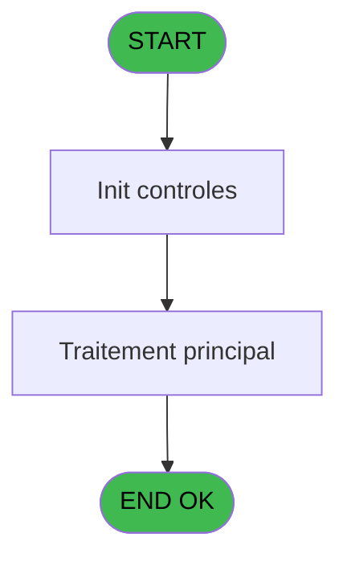
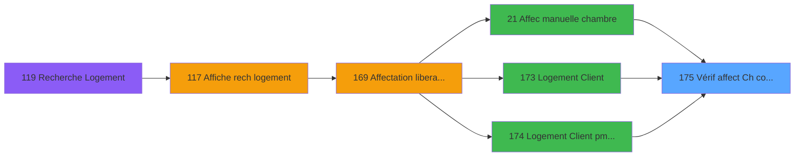

# PBG IDE 175 - Vérif affect Ch comm libre

> **Analyse**: Phases 1-4 2026-02-03 09:57 -> 09:57 (19s) | Assemblage 09:57
> **Pipeline**: V7.2 Enrichi
> **Structure**: 4 onglets (Resume | Ecrans | Donnees | Connexions)

<!-- TAB:Resume -->

## 1. FICHE D'IDENTITE

| Attribut | Valeur |
|----------|--------|
| Projet | PBG |
| IDE Position | 175 |
| Nom Programme | Vérif affect Ch comm libre |
| Fichier source | `Prg_175.xml` |
| Domaine metier | General |
| Taches | 3 (0 ecrans visibles) |
| Tables modifiees | 0 |
| Programmes appeles | 1 |

## 2. DESCRIPTION FONCTIONNELLE

**Vérif affect Ch comm libre** assure la gestion complete de ce processus, accessible depuis [Affec manuelle chambre (IDE 21)](PBG-IDE-21.md), [Logement Client (IDE 173)](PBG-IDE-173.md), [Logement Client pms-626 (IDE 174)](PBG-IDE-174.md).

Le flux de traitement s'organise en **1 blocs fonctionnels** :

- **Traitement** (3 taches) : traitements metier divers

## 3. BLOCS FONCTIONNELS

### 3.1 Traitement (3 taches)

Traitements internes.

---

#### 175 - Vérif affect Ch comm libre

**Role** : Traitement : Vérif affect Ch comm libre.
**Variables liees** : D (P.I.Code logement affecté), E (P.I.Code logement unit affecté)

---

#### 175.1 - Vérif chambre comm libre

**Role** : Traitement : Vérif chambre comm libre.
**Variables liees** : L (v.Flag  Chambre dispo)

---

#### 175.1.1 - Vérif. Comm occupée

**Role** : Traitement : Vérif. Comm occupée.

## 5. REGLES METIER

*(Aucune regle metier identifiee)*

## 6. CONTEXTE

- **Appele par**: [Affec manuelle chambre (IDE 21)](PBG-IDE-21.md), [Logement Client (IDE 173)](PBG-IDE-173.md), [Logement Client pms-626 (IDE 174)](PBG-IDE-174.md)
- **Appelle**: 1 programmes | **Tables**: 3 (W:0 R:1 L:2) | **Taches**: 3 | **Expressions**: 7

<!-- TAB:Ecrans -->

## 8. ECRANS

*(Programme sans ecran visible)*

## 9. NAVIGATION

### 9.3 Structure hierarchique (3 taches)

| Position | Tache | Type | Dimensions | Bloc |
|----------|-------|------|------------|------|
| **175.1** | [**Vérif affect Ch comm libre** (175)](#t1) | - | - | Traitement |
| 175.1.1 | [Vérif chambre comm libre (175.1)](#t2) | - | - | |
| 175.1.2 | [Vérif. Comm occupée (175.1.1)](#t4) | - | - | |

### 9.4 Algorigramme

> **Legende**: Vert = START/END OK | Rouge = END KO | Bleu = Decisions
> *Algorigramme auto-genere. Utiliser `/algorigramme` pour une synthese metier detaillee.*

<!-- TAB:Donnees -->

## 10. TABLES

### Tables utilisees (3)

| ID | Nom | Description | Type | R | W | L | Usages |
|----|-----|-------------|------|---|---|---|--------|
| 34 | hebergement______heb | Hebergement (chambres) | DB |   |   | L | 1 |
| 103 | logement_client__loc |  | DB | R |   |   | 3 |
| 105 | logement_complement |  | DB |   |   | L | 2 |

### Colonnes par table (2 / 1 tables avec colonnes identifiees)

Table 103 - logement_client__loc (R) - 3 usages

| Lettre | Variable | Acces | Type |
|--------|----------|-------|------|
| A | P.I. Sté | R | Alpha |
| B | P.I. Num copte | R | Numeric |
| C | P.I. Filiation | R | Numeric |
| D | P.I.Code logement affecté | R | Alpha |
| E | P.I.Code logement unit affecté | R | Alpha |
| F | P.I.Lieux séjour | R | Alpha |
| G | P.I. Date début | R | Date |
| H | P.I.Heure début | R | Unicode |
| I | P.I. Date fin | R | Date |
| J | P.I.Heure fin | R | Unicode |
| K | P.I.Code logement substitution | R | Alpha |
| L | v.Flag  Chambre dispo | R | Logical |

## 11. VARIABLES

### 11.1 Parametres entrants (11)

Variables recues du programme appelant ([Affec manuelle chambre (IDE 21)](PBG-IDE-21.md)).

| Lettre | Nom | Type | Usage dans |
|--------|-----|------|-----------|
| A | P.I. Sté | Alpha | 1x parametre entrant |
| B | P.I. Num copte | Numeric | - |
| C | P.I. Filiation | Numeric | - |
| D | P.I.Code logement affecté | Alpha | - |
| E | P.I.Code logement unit affecté | Alpha | - |
| F | P.I.Lieux séjour | Alpha | - |
| G | P.I. Date début | Date | 1x parametre entrant |
| H | P.I.Heure début | Unicode | - |
| I | P.I. Date fin | Date | - |
| J | P.I.Heure fin | Unicode | - |
| K | P.I.Code logement substitution | Alpha | - |

### 11.2 Variables de session (1)

Variables persistantes pendant toute la session.

| Lettre | Nom | Type | Usage dans |
|--------|-----|------|-----------|
| L | v.Flag  Chambre dispo | Logical | - |

## 12. EXPRESSIONS

**7 / 7 expressions decodees (100%)**

### 12.1 Repartition par type

| Type | Expressions | Regles |
|------|-------------|--------|
| CONSTANTE | 2 | 0 |
| OTHER | 4 | 0 |
| CAST_LOGIQUE | 1 | 0 |

### 12.2 Expressions cles par type

#### CONSTANTE (2 expressions)

| Type | IDE | Expression | Regle |
|------|-----|------------|-------|
| CONSTANTE | 6 | `''` | - |
| CONSTANTE | 3 | `'C'` | - |

#### OTHER (4 expressions)

| Type | IDE | Expression | Regle |
|------|-----|------------|-------|
| OTHER | 4 | `P.I. Date début [G]` | - |
| OTHER | 5 | `[Z]` | - |
| OTHER | 1 | `P.I.Code logement subs... [K]` | - |
| OTHER | 2 | `P.I. Sté [A]` | - |

#### CAST_LOGIQUE (1 expressions)

| Type | IDE | Expression | Regle |
|------|-----|------------|-------|
| CAST_LOGIQUE | 7 | `'TRUE'LOG` | - |

<!-- TAB:Connexions -->

## 13. GRAPHE D'APPELS

### 13.1 Chaine depuis Main (Callers)

Main -> ... -> [Affec manuelle chambre (IDE 21)](PBG-IDE-21.md) -> **Vérif affect Ch comm libre (IDE 175)**

Main -> ... -> [Logement Client (IDE 173)](PBG-IDE-173.md) -> **Vérif affect Ch comm libre (IDE 175)**

Main -> ... -> [Logement Client pms-626 (IDE 174)](PBG-IDE-174.md) -> **Vérif affect Ch comm libre (IDE 175)**

### 13.2 Callers

| IDE | Nom Programme | Nb Appels |
|-----|---------------|-----------|
| [21](PBG-IDE-21.md) | Affec manuelle chambre | 1 |
| [173](PBG-IDE-173.md) | Logement Client | 1 |
| [174](PBG-IDE-174.md) | Logement Client pms-626 | 1 |

### 13.3 Callees (programmes appeles)

### 13.4 Detail Callees avec contexte

| IDE | Nom Programme | Appels | Contexte |
|-----|---------------|--------|----------|
| [17](PBG-IDE-17.md) | Rech si ch occup pour manuelle | 2 | Sous-programme |

## 14. RECOMMANDATIONS MIGRATION

### 14.1 Profil du programme

| Metrique | Valeur | Impact migration |
|----------|--------|-----------------|
| Lignes de logique | 63 | Programme compact |
| Expressions | 7 | Peu de logique |
| Tables WRITE | 0 | Impact faible |
| Sous-programmes | 1 | Peu de dependances |
| Ecrans visibles | 0 | Ecran unique ou traitement batch |
| Code desactive | 0% (0 / 63) | Code sain |
| Regles metier | 0 | Pas de regle identifiee |

### 14.2 Plan de migration par bloc

#### Traitement (3 taches: 0 ecran, 3 traitements)

- **Strategie** : 3 service(s) backend injectable(s) (Domain Services).
- 1 sous-programme(s) a migrer ou a reutiliser depuis les services existants.
- Decomposer les taches en services unitaires testables.

### 14.3 Dependances critiques

| Dependance | Type | Appels | Impact |
|------------|------|--------|--------|
| [Rech si ch occup pour manuelle (IDE 17)](PBG-IDE-17.md) | Sous-programme | 2x | Haute - Sous-programme |

---
*Spec DETAILED generee par Pipeline V7.2 - 2026-02-03 09:57*
