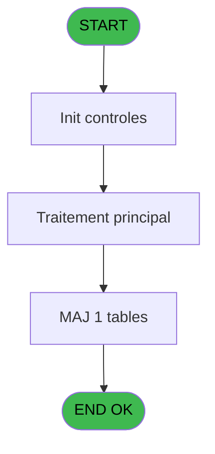
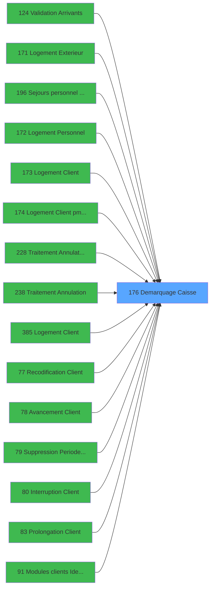

# PBG IDE 176 - Demarquage Caisse

> **Analyse**: Phases 1-4 2026-02-03 09:57 -> 09:58 (20s) | Assemblage 09:58
> **Pipeline**: V7.2 Enrichi
> **Structure**: 4 onglets (Resume | Ecrans | Donnees | Connexions)

<!-- TAB:Resume -->

## 1. FICHE D'IDENTITE

| Attribut | Valeur |
|----------|--------|
| Projet | PBG |
| IDE Position | 176 |
| Nom Programme | Demarquage Caisse |
| Fichier source | `Prg_176.xml` |
| Domaine metier | Caisse |
| Taches | 1 (0 ecrans visibles) |
| Tables modifiees | 1 |
| Programmes appeles | 0 |

## 2. DESCRIPTION FONCTIONNELLE

**Demarquage Caisse** assure la gestion complete de ce processus, accessible depuis [Validation Arrivants (IDE 124)](PBG-IDE-124.md), [Logement Exterieur (IDE 0)](PBG-IDE-0.md), [Sejours personnel SubForm (IDE 0)](PBG-IDE-0.md), [Logement Exterieur (IDE 171)](PBG-IDE-171.md), [Sejours personnel CallTask (IDE 196)](PBG-IDE-196.md), [Logement Client (IDE 0)](PBG-IDE-0.md), [Logement Personnel (IDE 0)](PBG-IDE-0.md), [Logement Personnel (IDE 172)](PBG-IDE-172.md), [Logement Client (IDE 173)](PBG-IDE-173.md), [Logement Client pms-626 (IDE 174)](PBG-IDE-174.md), [Traitement Annulation Existant (IDE 228)](PBG-IDE-228.md), [Traitement Annulation (IDE 238)](PBG-IDE-238.md), [Logement Client (IDE 385)](PBG-IDE-385.md), [Module Sejours CallTask (IDE 0)](PBG-IDE-0.md), [   Recodification Client (IDE 77)](PBG-IDE-77.md), [   Avancement Client (IDE 78)](PBG-IDE-78.md), [   Suppression Periode Client (IDE 79)](PBG-IDE-79.md), [   Interruption Client (IDE 80)](PBG-IDE-80.md), [   Prolongation Client (IDE 83)](PBG-IDE-83.md), [Modules clients Identite (IDE 91)](PBG-IDE-91.md).

Le flux de traitement s'organise en **1 blocs fonctionnels** :

- **Traitement** (1 tache) : traitements metier divers

**Donnees modifiees** : 1 tables en ecriture (compte_gm________cgm).

## 3. BLOCS FONCTIONNELS

### 3.1 Traitement (1 tache)

Traitements internes.

---

#### 176 - Demarquage Caisse

**Role** : Traitement : Demarquage Caisse.

## 5. REGLES METIER

*(Aucune regle metier identifiee)*

## 6. CONTEXTE

- **Appele par**: [Validation Arrivants (IDE 124)](PBG-IDE-124.md), [Logement Exterieur (IDE 0)](PBG-IDE-0.md), [Sejours personnel SubForm (IDE 0)](PBG-IDE-0.md), [Logement Exterieur (IDE 171)](PBG-IDE-171.md), [Sejours personnel CallTask (IDE 196)](PBG-IDE-196.md), [Logement Client (IDE 0)](PBG-IDE-0.md), [Logement Personnel (IDE 0)](PBG-IDE-0.md), [Logement Personnel (IDE 172)](PBG-IDE-172.md), [Logement Client (IDE 173)](PBG-IDE-173.md), [Logement Client pms-626 (IDE 174)](PBG-IDE-174.md), [Traitement Annulation Existant (IDE 228)](PBG-IDE-228.md), [Traitement Annulation (IDE 238)](PBG-IDE-238.md), [Logement Client (IDE 385)](PBG-IDE-385.md), [Module Sejours CallTask (IDE 0)](PBG-IDE-0.md), [   Recodification Client (IDE 77)](PBG-IDE-77.md), [   Avancement Client (IDE 78)](PBG-IDE-78.md), [   Suppression Periode Client (IDE 79)](PBG-IDE-79.md), [   Interruption Client (IDE 80)](PBG-IDE-80.md), [   Prolongation Client (IDE 83)](PBG-IDE-83.md), [Modules clients Identite (IDE 91)](PBG-IDE-91.md)
- **Appelle**: 0 programmes | **Tables**: 1 (W:1 R:0 L:0) | **Taches**: 1 | **Expressions**: 4

<!-- TAB:Ecrans -->

## 8. ECRANS

*(Programme sans ecran visible)*

## 9. NAVIGATION

### 9.3 Structure hierarchique (1 tache)

| Position | Tache | Type | Dimensions | Bloc |
|----------|-------|------|------------|------|
| **176.1** | [**Demarquage Caisse** (176)](#t1) | MDI | - | Traitement |

### 9.4 Algorigramme

> **Legende**: Vert = START/END OK | Rouge = END KO | Bleu = Decisions
> *Algorigramme auto-genere. Utiliser `/algorigramme` pour une synthese metier detaillee.*

<!-- TAB:Donnees -->

## 10. TABLES

### Tables utilisees (1)

| ID | Nom | Description | Type | R | W | L | Usages |
|----|-----|-------------|------|---|---|---|--------|
| 47 | compte_gm________cgm | Comptes GM (generaux) | DB |   | **W** |   | 1 |

### Colonnes par table (1 / 1 tables avec colonnes identifiees)

Table 47 - compte_gm________cgm (**W**) - 1 usages

| Lettre | Variable | Acces | Type |
|--------|----------|-------|------|
| A | P0-Code Societe | W | Alpha |
| B | P0-Numero Compte | W | Numeric |

## 11. VARIABLES

### 11.1 Autres (2)

Variables diverses.

| Lettre | Nom | Type | Usage dans |
|--------|-----|------|-----------|
| A | P0-Code Societe | Alpha | 1x refs |
| B | P0-Numero Compte | Numeric | 1x refs |

## 12. EXPRESSIONS

**4 / 4 expressions decodees (100%)**

### 12.1 Repartition par type

| Type | Expressions | Regles |
|------|-------------|--------|
| CONSTANTE | 1 | 0 |
| OTHER | 3 | 0 |

### 12.2 Expressions cles par type

#### CONSTANTE (1 expressions)

| Type | IDE | Expression | Regle |
|------|-----|------------|-------|
| CONSTANTE | 4 | `''` | - |

#### OTHER (3 expressions)

| Type | IDE | Expression | Regle |
|------|-----|------------|-------|
| OTHER | 3 | `[F]` | - |
| OTHER | 2 | `P0-Numero Compte [B]` | - |
| OTHER | 1 | `P0-Code Societe [A]` | - |

<!-- TAB:Connexions -->

## 13. GRAPHE D'APPELS

### 13.1 Chaine depuis Main (Callers)

Main -> ... -> [Validation Arrivants (IDE 124)](PBG-IDE-124.md) -> **Demarquage Caisse (IDE 176)**

Main -> ... -> [Logement Exterieur (IDE 0)](PBG-IDE-0.md) -> **Demarquage Caisse (IDE 176)**

Main -> ... -> [Sejours personnel SubForm (IDE 0)](PBG-IDE-0.md) -> **Demarquage Caisse (IDE 176)**

Main -> ... -> [Logement Exterieur (IDE 171)](PBG-IDE-171.md) -> **Demarquage Caisse (IDE 176)**

Main -> ... -> [Sejours personnel CallTask (IDE 196)](PBG-IDE-196.md) -> **Demarquage Caisse (IDE 176)**

Main -> ... -> [Logement Client (IDE 0)](PBG-IDE-0.md) -> **Demarquage Caisse (IDE 176)**

Main -> ... -> [Logement Personnel (IDE 0)](PBG-IDE-0.md) -> **Demarquage Caisse (IDE 176)**

Main -> ... -> [Logement Personnel (IDE 172)](PBG-IDE-172.md) -> **Demarquage Caisse (IDE 176)**

Main -> ... -> [Logement Client (IDE 173)](PBG-IDE-173.md) -> **Demarquage Caisse (IDE 176)**

Main -> ... -> [Logement Client pms-626 (IDE 174)](PBG-IDE-174.md) -> **Demarquage Caisse (IDE 176)**

Main -> ... -> [Traitement Annulation Existant (IDE 228)](PBG-IDE-228.md) -> **Demarquage Caisse (IDE 176)**

Main -> ... -> [Traitement Annulation (IDE 238)](PBG-IDE-238.md) -> **Demarquage Caisse (IDE 176)**

Main -> ... -> [Logement Client (IDE 385)](PBG-IDE-385.md) -> **Demarquage Caisse (IDE 176)**

Main -> ... -> [Module Sejours CallTask (IDE 0)](PBG-IDE-0.md) -> **Demarquage Caisse (IDE 176)**

Main -> ... -> [   Recodification Client (IDE 77)](PBG-IDE-77.md) -> **Demarquage Caisse (IDE 176)**

Main -> ... -> [   Avancement Client (IDE 78)](PBG-IDE-78.md) -> **Demarquage Caisse (IDE 176)**

Main -> ... -> [   Suppression Periode Client (IDE 79)](PBG-IDE-79.md) -> **Demarquage Caisse (IDE 176)**

Main -> ... -> [   Interruption Client (IDE 80)](PBG-IDE-80.md) -> **Demarquage Caisse (IDE 176)**

Main -> ... -> [   Prolongation Client (IDE 83)](PBG-IDE-83.md) -> **Demarquage Caisse (IDE 176)**

Main -> ... -> [Modules clients Identite (IDE 91)](PBG-IDE-91.md) -> **Demarquage Caisse (IDE 176)**

### 13.2 Callers

| IDE | Nom Programme | Nb Appels |
|-----|---------------|-----------|
| [124](PBG-IDE-124.md) | Validation Arrivants | 4 |
| [0](PBG-IDE-0.md) | Logement Exterieur | 3 |
| [0](PBG-IDE-0.md) | Sejours personnel SubForm | 3 |
| [171](PBG-IDE-171.md) | Logement Exterieur | 3 |
| [196](PBG-IDE-196.md) | Sejours personnel CallTask | 3 |
| [0](PBG-IDE-0.md) | Logement Client | 2 |
| [0](PBG-IDE-0.md) | Logement Personnel | 2 |
| [172](PBG-IDE-172.md) | Logement Personnel | 2 |
| [173](PBG-IDE-173.md) | Logement Client | 2 |
| [174](PBG-IDE-174.md) | Logement Client pms-626 | 2 |
| [228](PBG-IDE-228.md) | Traitement Annulation Existant | 2 |
| [238](PBG-IDE-238.md) | Traitement Annulation | 2 |
| [385](PBG-IDE-385.md) | Logement Client | 2 |
| [0](PBG-IDE-0.md) | Module Sejours CallTask | 1 |
| [77](PBG-IDE-77.md) |    Recodification Client | 1 |
| [78](PBG-IDE-78.md) |    Avancement Client | 1 |
| [79](PBG-IDE-79.md) |    Suppression Periode Client | 1 |
| [80](PBG-IDE-80.md) |    Interruption Client | 1 |
| [83](PBG-IDE-83.md) |    Prolongation Client | 1 |
| [91](PBG-IDE-91.md) | Modules clients Identite | 1 |

### 13.3 Callees (programmes appeles)

### 13.4 Detail Callees avec contexte

| IDE | Nom Programme | Appels | Contexte |
|-----|---------------|--------|----------|
| - | (aucun) | - | - |

## 14. RECOMMANDATIONS MIGRATION

### 14.1 Profil du programme

| Metrique | Valeur | Impact migration |
|----------|--------|-----------------|
| Lignes de logique | 10 | Programme compact |
| Expressions | 4 | Peu de logique |
| Tables WRITE | 1 | Impact faible |
| Sous-programmes | 0 | Peu de dependances |
| Ecrans visibles | 0 | Ecran unique ou traitement batch |
| Code desactive | 0% (0 / 10) | Code sain |
| Regles metier | 0 | Pas de regle identifiee |

### 14.2 Plan de migration par bloc

#### Traitement (1 tache: 0 ecran, 1 traitement)

- **Strategie** : 1 service(s) backend injectable(s) (Domain Services).
- Decomposer les taches en services unitaires testables.

### 14.3 Dependances critiques

| Dependance | Type | Appels | Impact |
|------------|------|--------|--------|
| compte_gm________cgm | Table WRITE (Database) | 1x | Schema + repository |

---
*Spec DETAILED generee par Pipeline V7.2 - 2026-02-03 09:58*
