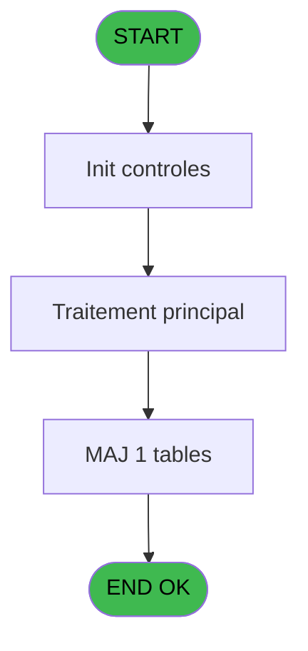
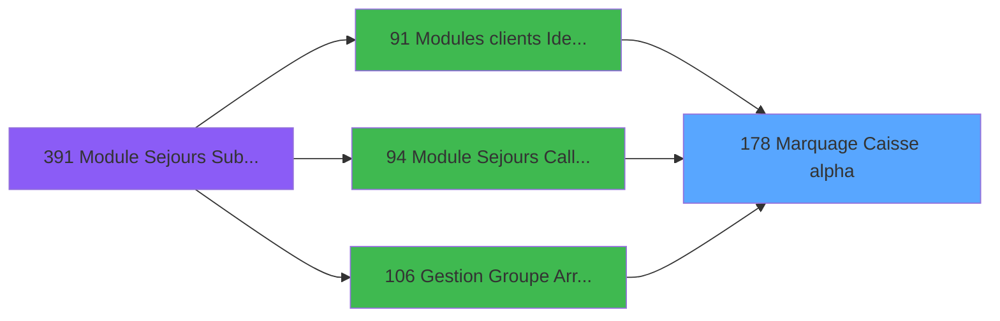
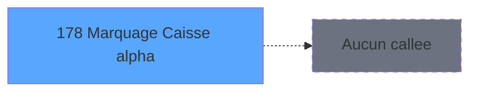

# PBG IDE 178 - Marquage Caisse alpha

> **Analyse**: Phases 1-4 2026-02-03 09:58 -> 09:59 (17s) | Assemblage 09:59
> **Pipeline**: V7.2 Enrichi
> **Structure**: 4 onglets (Resume | Ecrans | Donnees | Connexions)

<!-- TAB:Resume -->

## 1. FICHE D'IDENTITE

| Attribut | Valeur |
|----------|--------|
| Projet | PBG |
| IDE Position | 178 |
| Nom Programme | Marquage Caisse alpha |
| Fichier source | `Prg_178.xml` |
| Domaine metier | Caisse |
| Taches | 1 (0 ecrans visibles) |
| Tables modifiees | 1 |
| Programmes appeles | 0 |

## 2. DESCRIPTION FONCTIONNELLE

**Marquage Caisse alpha** assure la gestion complete de ce processus, accessible depuis [Sejours personnel SubForm (IDE 0)](PBG-IDE-0.md), [Sejours personnel CallTask (IDE 196)](PBG-IDE-196.md), [Modules clients Identite (IDE 91)](PBG-IDE-91.md), [Gestion Groupe Arr/dep pms-656 (IDE 106)](PBG-IDE-106.md), [Module Sejours CallTask (IDE 0)](PBG-IDE-0.md), [Module Sejours CallTask (IDE 94)](PBG-IDE-94.md), [Validation Arrivants (IDE 124)](PBG-IDE-124.md), [Module Sejours SubForm (IDE 391)](PBG-IDE-391.md).

Le flux de traitement s'organise en **1 blocs fonctionnels** :

- **Traitement** (1 tache) : traitements metier divers

**Donnees modifiees** : 1 tables en ecriture (compte_gm________cgm).

**Logique metier** : 1 regles identifiees couvrant conditions metier.

## 3. BLOCS FONCTIONNELS

### 3.1 Traitement (1 tache)

Traitements internes.

---

#### 178 - Marquage Caisse

**Role** : Traitement : Marquage Caisse.

## 5. REGLES METIER

1 regles identifiees:

### Autres (1 regles)

#### [RM-001] Si [F]='R' alors 'N' sinon 'O')

| Element | Detail |
|---------|--------|
| **Condition** | `[F]='R'` |
| **Si vrai** | 'N' |
| **Si faux** | 'O') |
| **Expression source** | Expression 3 : `IF ([F]='R','N','O')` |
| **Exemple** | Si [F]='R' → 'N'. Sinon → 'O') |

## 6. CONTEXTE

- **Appele par**: [Sejours personnel SubForm (IDE 0)](PBG-IDE-0.md), [Sejours personnel CallTask (IDE 196)](PBG-IDE-196.md), [Modules clients Identite (IDE 91)](PBG-IDE-91.md), [Gestion Groupe Arr/dep pms-656 (IDE 106)](PBG-IDE-106.md), [Module Sejours CallTask (IDE 0)](PBG-IDE-0.md), [Module Sejours CallTask (IDE 94)](PBG-IDE-94.md), [Validation Arrivants (IDE 124)](PBG-IDE-124.md), [Module Sejours SubForm (IDE 391)](PBG-IDE-391.md)
- **Appelle**: 0 programmes | **Tables**: 1 (W:1 R:0 L:0) | **Taches**: 1 | **Expressions**: 7

<!-- TAB:Ecrans -->

## 8. ECRANS

*(Programme sans ecran visible)*

## 9. NAVIGATION

### 9.3 Structure hierarchique (1 tache)

| Position | Tache | Type | Dimensions | Bloc |
|----------|-------|------|------------|------|
| **178.1** | [**Marquage Caisse** (178)](#t1) | MDI | - | Traitement |

### 9.4 Algorigramme

> **Legende**: Vert = START/END OK | Rouge = END KO | Bleu = Decisions
> *Algorigramme auto-genere. Utiliser `/algorigramme` pour une synthese metier detaillee.*

<!-- TAB:Donnees -->

## 10. TABLES

### Tables utilisees (1)

| ID | Nom | Description | Type | R | W | L | Usages |
|----|-----|-------------|------|---|---|---|--------|
| 47 | compte_gm________cgm | Comptes GM (generaux) | DB |   | **W** |   | 1 |

### Colonnes par table (1 / 1 tables avec colonnes identifiees)

Table 47 - compte_gm________cgm (**W**) - 1 usages

| Lettre | Variable | Acces | Type |
|--------|----------|-------|------|
| A | > Code Societe | W | Alpha |
| B | > Numero Compte | W | Numeric |
| C | < Autorisation | W | Alpha |

## 11. VARIABLES

### 11.1 Autres (3)

Variables diverses.

| Lettre | Nom | Type | Usage dans |
|--------|-----|------|-----------|
| A | > Code Societe | Alpha | 1x refs |
| B | > Numero Compte | Numeric | 1x refs |
| C | < Autorisation | Alpha | 2x refs |

## 12. EXPRESSIONS

**7 / 7 expressions decodees (100%)**

### 12.1 Repartition par type

| Type | Expressions | Regles |
|------|-------------|--------|
| CONDITION | 5 | 5 |
| CONSTANTE | 1 | 0 |
| OTHER | 1 | 0 |

### 12.2 Expressions cles par type

#### CONDITION (5 expressions)

| Type | IDE | Expression | Regle |
|------|-----|------------|-------|
| CONDITION | 3 | `IF ([F]='R','N','O')` | [RM-001](#rm-RM-001) |
| CONDITION | 6 | `< Autorisation [C]='O'` | - |
| CONDITION | 7 | `< Autorisation [C]='N'` | - |
| CONDITION | 1 | `> Code Societe [A]` | - |
| CONDITION | 2 | `> Numero Compte [B]` | - |

#### CONSTANTE (1 expressions)

| Type | IDE | Expression | Regle |
|------|-----|------------|-------|
| CONSTANTE | 5 | `'R'` | - |

#### OTHER (1 expressions)

| Type | IDE | Expression | Regle |
|------|-----|------------|-------|
| OTHER | 4 | `[F]` | - |

<!-- TAB:Connexions -->

## 13. GRAPHE D'APPELS

### 13.1 Chaine depuis Main (Callers)

Main -> ... -> [Sejours personnel SubForm (IDE 0)](PBG-IDE-0.md) -> **Marquage Caisse alpha (IDE 178)**

Main -> ... -> [Sejours personnel CallTask (IDE 196)](PBG-IDE-196.md) -> **Marquage Caisse alpha (IDE 178)**

Main -> ... -> [Modules clients Identite (IDE 91)](PBG-IDE-91.md) -> **Marquage Caisse alpha (IDE 178)**

Main -> ... -> [Gestion Groupe Arr/dep pms-656 (IDE 106)](PBG-IDE-106.md) -> **Marquage Caisse alpha (IDE 178)**

Main -> ... -> [Module Sejours CallTask (IDE 0)](PBG-IDE-0.md) -> **Marquage Caisse alpha (IDE 178)**

Main -> ... -> [Module Sejours CallTask (IDE 94)](PBG-IDE-94.md) -> **Marquage Caisse alpha (IDE 178)**

Main -> ... -> [Validation Arrivants (IDE 124)](PBG-IDE-124.md) -> **Marquage Caisse alpha (IDE 178)**

Main -> ... -> [Module Sejours SubForm (IDE 391)](PBG-IDE-391.md) -> **Marquage Caisse alpha (IDE 178)**

### 13.2 Callers

| IDE | Nom Programme | Nb Appels |
|-----|---------------|-----------|
| [0](PBG-IDE-0.md) | Sejours personnel SubForm | 6 |
| [196](PBG-IDE-196.md) | Sejours personnel CallTask | 6 |
| [91](PBG-IDE-91.md) | Modules clients Identite | 2 |
| [106](PBG-IDE-106.md) | Gestion Groupe Arr/dep pms-656 | 2 |
| [0](PBG-IDE-0.md) | Module Sejours CallTask | 1 |
| [94](PBG-IDE-94.md) | Module Sejours CallTask | 1 |
| [124](PBG-IDE-124.md) | Validation Arrivants | 1 |
| [391](PBG-IDE-391.md) | Module Sejours SubForm | 1 |

### 13.3 Callees (programmes appeles)

### 13.4 Detail Callees avec contexte

| IDE | Nom Programme | Appels | Contexte |
|-----|---------------|--------|----------|
| - | (aucun) | - | - |

## 14. RECOMMANDATIONS MIGRATION

### 14.1 Profil du programme

| Metrique | Valeur | Impact migration |
|----------|--------|-----------------|
| Lignes de logique | 14 | Programme compact |
| Expressions | 7 | Peu de logique |
| Tables WRITE | 1 | Impact faible |
| Sous-programmes | 0 | Peu de dependances |
| Ecrans visibles | 0 | Ecran unique ou traitement batch |
| Code desactive | 0% (0 / 14) | Code sain |
| Regles metier | 1 | Quelques regles a preserver |

### 14.2 Plan de migration par bloc

#### Traitement (1 tache: 0 ecran, 1 traitement)

- **Strategie** : 1 service(s) backend injectable(s) (Domain Services).
- Decomposer les taches en services unitaires testables.

### 14.3 Dependances critiques

| Dependance | Type | Appels | Impact |
|------------|------|--------|--------|
| compte_gm________cgm | Table WRITE (Database) | 1x | Schema + repository |

---
*Spec DETAILED generee par Pipeline V7.2 - 2026-02-03 09:59*
