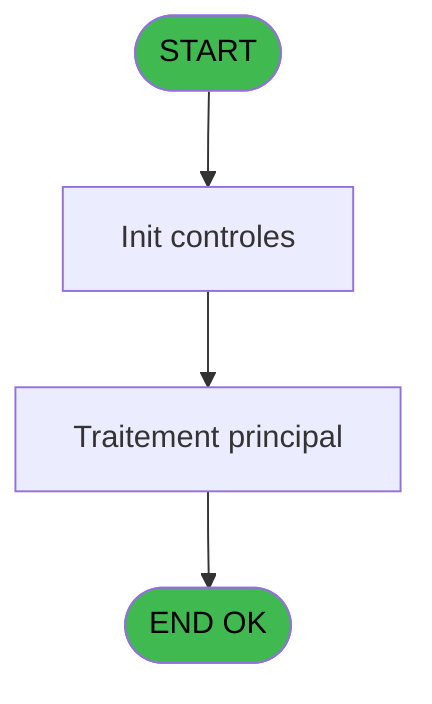
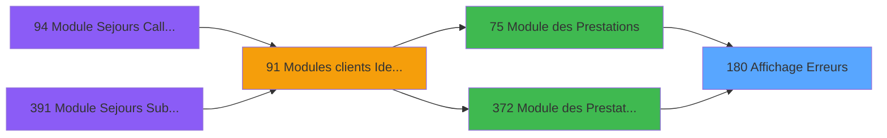

# PBG IDE 180 - Affichage Erreurs !!

> **Analyse**: Phases 1-4 2026-02-03 09:59 -> 10:00 (18s) | Assemblage 10:00
> **Pipeline**: V7.2 Enrichi
> **Structure**: 4 onglets (Resume | Ecrans | Donnees | Connexions)

<!-- TAB:Resume -->

## 1. FICHE D'IDENTITE

| Attribut | Valeur |
|----------|--------|
| Projet | PBG |
| IDE Position | 180 |
| Nom Programme | Affichage Erreurs !! |
| Fichier source | `Prg_180.xml` |
| Domaine metier | General |
| Taches | 2 (0 ecrans visibles) |
| Tables modifiees | 0 |
| Programmes appeles | 0 |

## 2. DESCRIPTION FONCTIONNELLE

**Affichage Erreurs !!** assure la gestion complete de ce processus, accessible depuis [Module des Prestations (IDE 75)](PBG-IDE-75.md), [Module des Prestations (IDE 372)](PBG-IDE-372.md).

Le flux de traitement s'organise en **2 blocs fonctionnels** :

- **Traitement** (1 tache) : traitements metier divers
- **Consultation** (1 tache) : ecrans de recherche, selection et consultation

Detail : phases du traitement

#### Phase 1 : Consultation (1 tache)

- **180** - AFFICHAGE ERREURS !!

#### Phase 2 : Traitement (1 tache)

- **180.1** - Recuperation Erreur

## 3. BLOCS FONCTIONNELS

### 3.1 Consultation (1 tache)

Ecrans de recherche et consultation.

---

#### 180 - AFFICHAGE ERREURS !!

**Role** : Reinitialisation : AFFICHAGE ERREURS !!.

### 3.2 Traitement (1 tache)

Traitements internes.

---

#### 180.1 - Recuperation Erreur

**Role** : Consultation/chargement : Recuperation Erreur.
**Variables liees** : A (P0-Code Erreur), B (P0-Type erreur)

## 5. REGLES METIER

*(Aucune regle metier identifiee)*

## 6. CONTEXTE

- **Appele par**: [Module des Prestations (IDE 75)](PBG-IDE-75.md), [Module des Prestations (IDE 372)](PBG-IDE-372.md)
- **Appelle**: 0 programmes | **Tables**: 1 (W:0 R:1 L:0) | **Taches**: 2 | **Expressions**: 2

<!-- TAB:Ecrans -->

## 8. ECRANS

*(Programme sans ecran visible)*

## 9. NAVIGATION

### 9.3 Structure hierarchique (2 taches)

| Position | Tache | Type | Dimensions | Bloc |
|----------|-------|------|------------|------|
| **180.1** | [**AFFICHAGE ERREURS !!** (180)](#t1) | MDI | - | Consultation |
| **180.2** | [**Recuperation Erreur** (180.1)](#t2) | MDI | - | Traitement |

### 9.4 Algorigramme

> **Legende**: Vert = START/END OK | Rouge = END KO | Bleu = Decisions
> *Algorigramme auto-genere. Utiliser `/algorigramme` pour une synthese metier detaillee.*

<!-- TAB:Donnees -->

## 10. TABLES

### Tables utilisees (1)

| ID | Nom | Description | Type | R | W | L | Usages |
|----|-----|-------------|------|---|---|---|--------|
| 115 | tables_erreurs |  | DB | R |   |   | 1 |

### Colonnes par table (0 / 1 tables avec colonnes identifiees)

Table 115 - tables_erreurs (R) - 1 usages

*Table utilisee uniquement en Link ou aucune colonne Real identifiee dans le DataView.*

## 11. VARIABLES

### 11.1 Autres (4)

Variables diverses.

| Lettre | Nom | Type | Usage dans |
|--------|-----|------|-----------|
| A | P0-Code Erreur | Alpha | - |
| B | P0-Type erreur | Alpha | - |
| C | W0-Libelle | Alpha | 1x refs |
| D | W0-Code ERRE | Alpha | - |

## 12. EXPRESSIONS

**2 / 2 expressions decodees (100%)**

### 12.1 Repartition par type

| Type | Expressions | Regles |
|------|-------------|--------|
| CONSTANTE | 1 | 0 |
| OTHER | 1 | 0 |

### 12.2 Expressions cles par type

#### CONSTANTE (1 expressions)

| Type | IDE | Expression | Regle |
|------|-----|------------|-------|
| CONSTANTE | 2 | `'ERRE'` | - |

#### OTHER (1 expressions)

| Type | IDE | Expression | Regle |
|------|-----|------------|-------|
| OTHER | 1 | `W0-Libelle [C]` | - |

<!-- TAB:Connexions -->

## 13. GRAPHE D'APPELS

### 13.1 Chaine depuis Main (Callers)

Main -> ... -> [Module des Prestations (IDE 75)](PBG-IDE-75.md) -> **Affichage Erreurs !! (IDE 180)**

Main -> ... -> [Module des Prestations (IDE 372)](PBG-IDE-372.md) -> **Affichage Erreurs !! (IDE 180)**

### 13.2 Callers

| IDE | Nom Programme | Nb Appels |
|-----|---------------|-----------|
| [75](PBG-IDE-75.md) | Module des Prestations | 1 |
| [372](PBG-IDE-372.md) | Module des Prestations | 1 |

### 13.3 Callees (programmes appeles)

### 13.4 Detail Callees avec contexte

| IDE | Nom Programme | Appels | Contexte |
|-----|---------------|--------|----------|
| - | (aucun) | - | - |

## 14. RECOMMANDATIONS MIGRATION

### 14.1 Profil du programme

| Metrique | Valeur | Impact migration |
|----------|--------|-----------------|
| Lignes de logique | 20 | Programme compact |
| Expressions | 2 | Peu de logique |
| Tables WRITE | 0 | Impact faible |
| Sous-programmes | 0 | Peu de dependances |
| Ecrans visibles | 0 | Ecran unique ou traitement batch |
| Code desactive | 0% (0 / 20) | Code sain |
| Regles metier | 0 | Pas de regle identifiee |

### 14.2 Plan de migration par bloc

#### Consultation (1 tache: 0 ecran, 1 traitement)

- **Strategie** : Composants de recherche/selection en modales.

#### Traitement (1 tache: 0 ecran, 1 traitement)

- **Strategie** : 1 service(s) backend injectable(s) (Domain Services).
- Decomposer les taches en services unitaires testables.

### 14.3 Dependances critiques

| Dependance | Type | Appels | Impact |
|------------|------|--------|--------|

---
*Spec DETAILED generee par Pipeline V7.2 - 2026-02-03 10:00*
